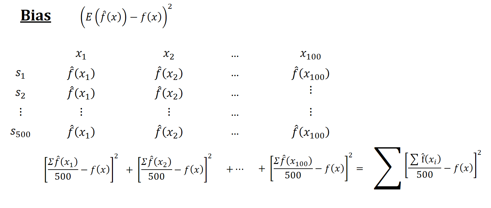

# Overfitting:

Overfitting is a phenomenon that occurs when a statistical model describes random error (noise, irreducible error) instead of the underlying relationship. A model that has been overfitted has poor predictive performance, as it overreacts to minor fluctuations in the training data. Overfitting is a common problem in statistics and machine learning. The more flexible (complex) a model is, the more likely it is to overfit the data. A good predictive model is able to learn the pattern from your data and then to generalize it on new data. Generalization(i.e. (learning)) is the ability of a model to perform well on unseen data. Overfitting occurs when a model does not generalize well. Underfitting occurs when a model is not flexible enough to capture the underlying relationship as well.
 
A simple example is the curve-fitting of a polynomial of a certain degree to a set of data points. A low-degree polynomial, such as a straight line, may fit the data points reasonably well, but would fail to capture the behavior of the data outside the range of the data points. However, a high-degree polynomial may fit the data points well, but would have wild fluctuations outside the range of the data points. The wild fluctuations would be fitting to the random noise in the data, and would fail to generalize to new data. We will simulate this example below. Another example is a decision tree with a large number of branches, may overfit the training data.
 
All in all, we say that The optimal model is the simplest model (less complexity (or flexibility)) which has the right amount of Bias–variance tradeoff and fits the data without overfitting.

To **detect overfitting**, you need to monitor the training error and the test error during the training process. As the model becomes more complex, the training error will decrease. However, when the model overfits the training data (i.e when model complexity increases), the test error will begin to increase.

To detect model complexity in the linear population model, we use Mallows' $C_{p}$ statistic, or Akaike information criterion (AIC) or Bayesian information criterion (BIC). Accuracy of $C_{p}$, AIC, and BIC depends on some knowledge of population model. 
(https://online.stat.psu.edu/stat462/node/197/)
**Cross-validation** is common way to for estimating prediction error of a model while handling overfitting, when data is (relatively) limited. The data is divided into a training set and a test set. The model is trained on the training set and evaluated on the test set. To reduce variability, the procedure is repeated for different partitions of the data into training and test sets, and the results are averaged. We discuss these model complexity scores and techniques in related chapters.

Overfitting can be **reduced or avoided** by using a simpler model, collecting more data, using regularization, or applying early stopping. The simplest way to prevent overfitting is to use a simpler model. The model should be as simple as possible, consistent with the bias–variance tradeoff. For example, a polynomial of low degree may be used instead of a polynomial of high degree. Another way to prevent overfitting is to use more data. More data can help to reduce the variance of the model. For example, if a model overfits the training data because it has too many parameters relative to the number of data points, then the model may not overfit if more data points are used. A third way to prevent overfitting is to use regularization. Regularization techniques add a penalty term to the loss function that measures the complexity of the model. The penalty term is called a regularizer. In neural networks, overfitting can be reduced by early stopping. During training, the error on the training set and the error on a validation set are monitored. When the error on the validation set begins to increase, training is stopped.

In time series, the problem of overfitting can be addressed by applying a smoothing technique, such as moving average, to the data. Overfitting can also be reduced by removing seasonal trends from the data. The seasonal trends are then reintroduced after forecasting has been performed.

https://www.r-bloggers.com/2017/06/machine-learning-explained-overfitting/

regularization:
https://towardsdatascience.com/regularization-the-path-to-bias-variance-trade-off-b7a7088b4577

https://statisticsbyjim.com/regression/overfitting-regression-models/

Although it seems that overfitting is a prediction problem, it is also a serious problem in estimations, where the unbiasedness is the main objective.  


$$ 
MSPE=E\left[(Y-\hat{f(X)})^{2}\right]=Bias[\hat{f(X)}]^{2}+Var[\hat{f(X)}]+\sigma^{2}=MSE(\hat{f(X)})+\sigma^{2}
$$

using an estimator for predictions means that we use in-sample data points to calculate MSPE in predictions, which may result in overfitting and a poor out-of-sample prediction accuracy.
Let's start with an example:  

```{r, warning=FALSE, message=FALSE, cache=TRUE}
# Getting one-sample.
set.seed(123)
x_1 <- rnorm(100, mean= 0, sd= 1) 
f <- 1 + 2*x_1 - 2*(x_1^2)+ 3*(x_1^3) # DGM
#y <- f + rnorm(100, 0, 8) yigits eqn
y <- f + rnorm(100, 0, 2)
inn <- data.frame(y, x_1)

# OLS
ols1 <- lm(y~ poly(x_1, degree = 1), inn)
ols2 <- lm(y~ poly(x_1, degree = 2), inn)
ols3 <- lm(y~ poly(x_1, degree = 3), inn)
ols4 <- lm(y~ poly(x_1, degree = 20), inn)
ror <- order(x_1)
plot(x_1, y, col="darkgrey")
lines(x_1[ror], predict(ols1)[ror], col="pink", lwd = 1.5)
lines(x_1[ror], predict(ols2)[ror], col="green", lwd = 1.5)
lines(x_1[ror], predict(ols3)[ror], col="blue", lwd = 1.5)
lines(x_1[ror], predict(ols4)[ror], col="red" , lwd = 1.5)
legend("bottomright", c("ols1", "ols2", "ols3", "ols4"),
       col = c("pink", "green", "blue", "red"), lwd = 2)
```
  
As this is simulation, we know that the "true" estimator, $f(x)$, which is the "blue" line, is:  

$$
f(x_i)=\beta_0+\beta_1 x_{1i}+\beta_2 x_{1i}^2+\beta_2 x_{1i}^3 = 1+2x_{1i}-2x_{1i}^2+3 x_{1i}^3.
$$

Now we can calculate in-sample **empirical** MSPE:  
$$~$$
```{r, warning=FALSE, message=FALSE, cache=TRUE}
# MSE
MSPE1 <- mean((predict(ols1)-y)^2) # which is also mean(ols1$residuals^2)
MSPE2 <- mean((predict(ols2)-y)^2)
MSPE3 <- mean((predict(ols3)-y)^2)
MSPE4 <- mean((predict(ols4)-y)^2)
all <- c(MSPE1, MSPE2, MSPE3, MSPE4)
MSPE <- matrix(all, 4, 1)
row.names(MSPE) <- c("ols1", "ols2", "ols3", "ols4")
colnames(MSPE) <- "In-sample MSPE's"
MSPE
```
  
As we see, the **overfitted** $\hat{f}(x)$, the $4^{th}$ model, has a lower **empirical in-sample** MSPE.  If we use nonparametric models, we can even find a better fitting model with a lower empirical in-sample MSPE.  We call these MSPE's **empirical** because they are not calculated based on repeated samples, which would give an **expected value** of squared errors over all samples.  In practice, however, we have only one sample. Therefore, even if our objective is to find an **unbiased** estimator of ${f}(x)$, not a prediction of $y$, since we choose our estimator, $\hat{f}(x)$, by the **empirical** in-sample MSPE, we may end up with an **overfitted** $\hat{f}(x)$, such as the $4^{th}$ estimator.  

Would an overfitted model create a biased estimator?  We will see the answer in a simulation later.  However, in estimations, our objective is not only to find an unbiased estimator but also to find the one that has the minimum variance.  We know that our $3^{rd}$ model is unbiased estimator of $f(x)$ as is the overfitted $4^{th}$ estimator.  Which one should we choose?  We have answered this question at the beginning of this chapter: the one with the minimum variance. Since overfitting would create a greater variance, our choice must be the $3^{rd}$ model.  

That is why we do not use the **empirical** in-sample MSPE as a "cost" or "risk" function in finding the best estimator.  This process is called a "data mining" exercise based on one sample without any theoretical justification on what the "true" model would be.  This is a general problem in **empirical risk minimization** specially in finding unbiased estimators of population parameters.

To see all these issues in actions, let's have a simulation for the decomposition of in-sample unconditional MSPE's.  

```{r, warning=FALSE, message=FALSE, cache=TRUE}
# Function for X - fixed at repeated samples
xfunc <- function(n){
  set.seed(123)
  x_1 <- rnorm(n, 0, 1) 
  return(x_1)
}
  
# Function for simulation (M - number of samples)
simmse <- function(M, n, sigma, poldeg){
  
  x_1 <- xfunc(n) # Repeated X's in each sample

  # Containers
  MSPE <- rep(0, M)
  yhat <- matrix(0, M, n)
  olscoef <- matrix(0, M, poldeg+1)
  ymat <- matrix(0, M, n)
  
  # Loop for samples
  for (i in 1:M) {
    f <- 1 + 2*x_1 - 2*I(x_1^2) # DGM
    y <- f + rnorm(n, 0, sigma)
    samp <- data.frame("y" = y, x_1)
    # Estimator
    ols <- lm(y ~ poly(x_1, degree = poldeg, raw=TRUE), samp)
    olscoef[i, ] <- ols$coefficients
    # Yhat's
    yhat[i,] <- predict(ols, samp)
    # MSPE - That is, residual sum of squares
    MSPE[i] <- mean((ols$residuals)^2)
    ymat[i,] <- y
  }
  output <- list(MSPE, yhat, sigma, olscoef, f, ymat)
  return(output)
}

# running different fhat with different polynomial degrees
output1 <- simmse(2000, 100, 7, 1)
output2 <- simmse(2000, 100, 7, 2) #True model (i.e fhat = f)
output3 <- simmse(2000, 100, 7, 5) 
output4 <- simmse(2000, 100, 7, 20)

# Table
tab <- matrix(0, 4, 5)
row.names(tab) <- c("ols1", "ols2", "ols3", "ols4")
colnames(tab) <- c("bias^2", "var(yhat)", "MSE", "var(eps)", "In-sample MSPE")

f <- output1[[5]]

# Var(yhat) -  We use our own function instead of "var()"
tab[1,2] <- mean(apply(output1[[2]], 2, function(x) mean((x-mean(x))^2)))
tab[2,2] <- mean(apply(output2[[2]], 2, function(x) mean((x-mean(x))^2)))
tab[3,2] <- mean(apply(output3[[2]], 2, function(x) mean((x-mean(x))^2)))
tab[4,2] <- mean(apply(output4[[2]], 2, function(x) mean((x-mean(x))^2)))

# Bias^2 = (mean(yhat))-f)^2
tab[1,1] <- mean((apply(output1[[2]], 2, mean) - f)^2)
tab[2,1] <- mean((apply(output2[[2]], 2, mean) - f)^2)
tab[3,1] <- mean((apply(output3[[2]], 2, mean) - f)^2)
tab[4,1] <- mean((apply(output4[[2]], 2, mean) - f)^2)

# MSE
fmat <- matrix(f, nrow(output1[[6]]), length(f), byrow = TRUE)
tab[1,3] <- mean(colMeans((fmat - output1[[2]])^2))
tab[2,3] <- mean(colMeans((fmat - output2[[2]])^2))
tab[3,3] <- mean(colMeans((fmat - output3[[2]])^2))
tab[4,3] <- mean(colMeans((fmat - output4[[2]])^2))

# # MSPE - This can be used as well, which is RSS
# tab[1,5] <- mean(output1[[1]])
# tab[2,5] <- mean(output2[[1]])
# tab[3,5] <- mean(output3[[1]])
# tab[4,5] <- mean(output4[[1]])

# MSPE
tab[1,5] <- mean(colMeans((output1[[6]] - output1[[2]])^2))
tab[2,5] <- mean(colMeans((output2[[6]] - output2[[2]])^2))
tab[3,5] <- mean(colMeans((output3[[6]] - output3[[2]])^2))
tab[4,5] <- mean(colMeans((output4[[6]] - output4[[2]])^2))

# Irreducable error - var(eps) = var(y)
tab[1,4] <- mean(apply(output1[[6]], 2,  function(x) mean((x-mean(x))^2)))
tab[2,4] <- mean(apply(output2[[6]] - output2[[2]], 2,  function(x) mean(x^2)))
tab[3,4] <- mean(apply(output3[[6]], 2,  function(x) mean((x-mean(x))^2)))
tab[4,4] <- mean(apply(output4[[6]], 2,  function(x) mean((x-mean(x))^2)))

round(tab, 4)
```

(SIMULATION TRAINING ERROR VS TEST ERROR CH 6, (https://web.stanford.edu/~rjohari/teaching/notes.html)

The table verifies that $\mathbf{MSE}(\hat{f})=\mathbf{Var}(\hat{f})+\left[\mathbf{bias}(\hat{f})\right]^{2}.$  However, it seems that the MSPE (in-sample) of each model is "wrong", which is not the sum of MSE and $\mathbf{Var}(\varepsilon)$.  
Now, back to our question:  Why is the in-sample MSPE not the sum of MSE and $\sigma^2$?  Let's look at MSPE again but this time with different angle.  

**For linear regression with a linear population model**

We define MSPE over some data points, as we did in our simulation above, and re-write it as follows:

$$
\mathbf{MSPE}_{out}=\mathbf{E}\left[\frac{1}{n} \sum_{i=1}^{n}\left(y'_{i}-\hat{f}(x_i)\right)^{2}\right],~~~~~~\text{where}~~y'_i=f(x_i)+\varepsilon'_i
$$
  
This type of MSPE is also called as **unconditional** MSPE.  Inside of the brackets is the "prediction error" for a range of out-of-sample data points.  The only difference here is that we distinguish $y'_i$ as out-of-sample data points.  Likewise, we define MSPE for in-sample data points $y_i$ as  

$$
\mathbf{MSPE}_{in}=\mathbf{E}\left[\frac{1}{n} \sum_{i=1}^{n}\left(y_{i}-\hat{f}(x_i)\right)^{2}\right],~~~~~~\text{where}~~y_i=f(x_i)+\varepsilon_i.
$$
  
Note that $\varepsilon'_i$ and $\varepsilon_i$ are independent but identically distributed. Moreover $y'_i$ and $y_i$ has the same distribution.  


$$
\mathbf{MSPE}_{out} =\mathbf{MSPE}_{in}+\frac{2}{n} \sigma^{2}(p+1).
$$


The last term quantifies the **overfitting**, the the amount by which the in-sample MSPE systematically underestimates its true MSPE, i.e. out-of-sample MSPE.  Note also that the overfitting  

1. **grows** with the "noise" ($\sigma^2$) in the data, 
2. **shrinks** with the sample size ($n$),
3. **grows** with the number of variables ($p$).  

Hence, as we had stated earlier, the overfitting problem gets worse as $p/n$ gets bigger.  Minimizing the in-sample MSPE completely ignores the overfitting by picking models which are too large and with a very poor out-of-sample prediction accuracy.  

Now we can calculate the size of overfitting in our simulation.

```{r, warning=FALSE, message=FALSE, cache=TRUE}
# New Table
tabb <- matrix(0, 4, 3)
row.names(tabb) <- c("ols1", "ols2", "ols3", "ols4")
colnames(tabb) <- c("Cov(yi, yhat)","True MSPE", "TrueMSPE-Cov")

#COV
tabb[1,1] <- 2*mean(diag(cov(output1[[2]], output1[[6]])))
tabb[2,1] <- 2*mean(diag(cov(output2[[2]], output2[[6]])))
tabb[3,1] <- 2*mean(diag(cov(output3[[2]], output3[[6]])))
tabb[4,1] <- 2*mean(diag(cov(output4[[2]], output4[[6]])))

#True MSPE
tabb[1,2] <- tab[1,3] + tab[1,4]
tabb[2,2] <- tab[2,3] + tab[2,4]
tabb[3,2] <- tab[3,3] + tab[3,4]
tabb[4,2] <- tab[4,3] + tab[4,4]

#True MSPE - Cov (to compare with the measures in the earlier table)
tabb[1,3] <- tabb[1,2] - tabb[1,1]
tabb[2,3] <- tabb[2,2] - tabb[2,1]
tabb[3,3] <- tabb[3,2] - tabb[3,1]
tabb[4,3] <- tabb[4,2] - tabb[4,1]

t <- cbind(tab, tabb)
round(t, 4)
```
  
Let's have a pause and look at this table:


1. We know that the "true" model is "ols2" in this simulation. However, we cannot know the true model and we have only one sample in practice. 
2. If we use the in-sample MSPE to choose a model, we pick "ols4" as it has the minimum MSPE. 
3. Not only "ols4" is the worst **predictor** among all models, it is also the worst **estimator** among the **unbiased** estimators "ols2", "ols3", and "ols4", as it has the highest MSE. 
4. If our task is to find the best predictor, we cannot use in-sample MSPE, as it give us "ols4", the worst predictor.  


https://web.stanford.edu/~rjohari/teaching/notes.html

https://bookdown.org/marklhc/notes_bookdown/model-comparison-and-regularization.html
use figure exaple.take data takesubset show that in figure

**Detailed explanation of Simulation for MSPE decomposition**

We will come back to this point, but before going further, to make the simulation calculations more understandable, I put here simple illustrations for each calculation.  
  
Think of a simulation as a big matrix: each row contains one sample and each column contains one observation of $x_i$.  For example, if we have 500 samples and each sample we have 100 observations, the "matrix" will be 500 by 100.  The figures below show how the simulations are designed and each term is calculated
  
```{r bias, echo=FALSE, out.width = '130%', out.height='130%'}

```
  
```{r, echo=FALSE, out.width = '80%', out.height='80%'}
knitr::include_graphics("png/var.png")
``` 
  
```{r, echo=FALSE, out.width = '130%', out.height='130%'}
knitr::include_graphics("png/mse.png")
```    
  
```{r, echo=FALSE, out.width = '130%', out.height='130%'}
knitr::include_graphics("png/mspe.png")
```    
 
**Technical Explanation of MSPE out and in sample**

 Let's look at $\mathbf{E}\left[(y'_i-\hat{f}(x_i))^{2}\right]$ closer.  By using the definition of variance,  

$$
\begin{aligned}
\mathbf{E}\left[(y'_i-\hat{f}(x_i))^{2}\right]
&=\mathbf{Var}\left[y'_{i}-\hat{f}(x_i)\right]+\left(\mathbf{E}\left[y'_{i}-\hat{f}(x_i)\right]\right)^{2}\\
&=\mathbf{Var}\left[y'_{i}\right]+\mathbf{Var}\left[\hat{f}(x_i)\right]-2 \mathbf{Cov}\left[y'_{i}, \hat{f}(x_i)\right]+\left(\mathbf{E}\left[y'_{i}\right]-\mathbf{E}\left[\hat{f}(x_i)\right]\right)^{2}
\end{aligned}
$$

Similarly,  

$$
\begin{aligned}
\mathbf{E}\left[(y_i-\hat{f}(x_i))^{2}\right]
&=\mathbf{Var}\left[y_{i}-\hat{f}(x_i)\right]+\left(\mathbf{E}\left[y_{i}-\hat{f}(x_i)\right]\right)^{2}\\
&=\mathbf{Var}\left[y_{i}\right]+\mathbf{Var}\left[\hat{f}(x_i)\right]-2 \mathbf{Cov}\left[y_{i}, \hat{f}(x_i)\right]+\left(\mathbf{E}\left[y_{i}\right]-\mathbf{E}\left[\hat{f}(x_i)\right]\right)^{2}
\end{aligned}
$$

Remember our earlier derivation of variance-bias decomposition:  When we predict out-of-sample data points, we know that $y_0$ and $\hat{f}(x_0)$ are independent.  We had stated it differently: $\varepsilon_0$ is independent from $\hat{f}(x_0)$.  In other words, how we estimate our estimator is an independent process from $y'_i$.  Hence, $\mathbf{Cov}\left[y'_{i}, \hat{f}(x_i)\right]=0$.  The critical point here is to understand is $\mathbf{Cov}\left[y_{i}, \hat{f}(x_i)\right]$, is **not zero**.  This is because the estimator $\hat{f}(x_i)$ is chosen in a way that its difference from $y_i$ should be minimum.  Hence, our estimator is not an independent than in-sample $y_i$ data points, on the contrary, we use them to estimate $\hat{f}(x_i)$.  In fact, we can even choose $\hat{f}(x_i) = y_i$ where the MSPE would be zero.  In that case correlation between $\hat{f}(x_i)$ and $y_i$ would be 1.

Using the fact that $\mathbf{E}(y'_i) = \mathbf{E}(y_i)$ and $\mathbf{Var}(y'_i) = \mathbf{Var}(y_i)$, we can now re-write $\mathbf{E}\left[(y'_i-\hat{f}(x_i))^{2}\right]$ as follows:    

$$
\mathbf{E}\left[(y'_i-\hat{f}(x_i))^{2}\right]=\mathbf{Var}\left[y_{i}\right]+\mathbf{Var}\left[\hat{f}(x_i)\right]+\left(\mathbf{E}\left[y_{i}\right]-\mathbf{E}\left[\hat{f}(x_i)\right]\right)^{2}\\ =\mathbf{E}\left[(y_i-\hat{f}(x_i))^{2}\right]+2 \mathbf{Cov}\left[y_{i}, \hat{f}(x_i)\right].
$$
  
Averaging over data points,  

$$
\mathbf{E}\left[\frac{1}{n} \sum_{i=1}^{n}\left(y_{i}^{\prime}-\hat{f}(x_i)\right)^{2}\right]=\mathbf{E}\left[\frac{1}{n} \sum_{i=1}^{n}\left(y_{i}-\hat{f}(x_i)\right)^{2}\right]+\frac{2}{n} \sum_{i=1}^{n} \mathbf{Cov}\left[y_{i}, \hat{f}(x_i)\right].
$$

For a linear model, it can be shown that    

$$
\frac{2}{n} \sum_{i=1}^{n} \mathbf{Cov}\left[y_{i}, \hat{f}(x_i)\right]=\frac{2}{n} \sigma^{2}(p+1).
$$
Hence,   

$$
\mathbf{MSPE}_{out} =\mathbf{MSPE}_{in}+\frac{2}{n} \sigma^{2}(p+1).
$$
   
