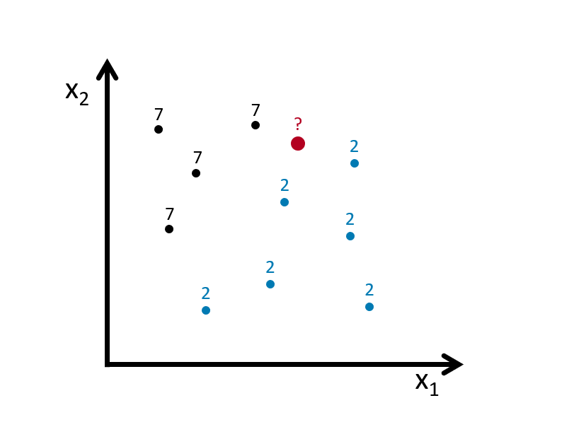

# Nonparametric Estimations - Basics


The models we see in the previous chapters are parametric, which means that they have to assume a certain structure on the regression function $m$ controlled by parameters before the estimations. Therefore, the results from parametric models are the best for estimating $m$, if and only if their model specifications are correct.  Avoiding this assumption is the strongest point of nonparametric methods, which do not require any hard-to-satisfy pre-determined regression functions.  

Before talking about a nonparametric estimator for the regression function $m$, we should first look at a simple nonparametric density estimation of the predictor $X$. This estimator is aimed to estimate $f(x)$, the density of $X$, from a sample and without assuming any specific form for $f$. That is, without assuming, for example, that the data is normally distributed.  Therefore, we first start with nonparametric density estimations.

## Density estimations

We are only going to look at one-variable Kernel density estimation.  Let's assume that a sample of $n$ observations, $y_1,...,y_n$, is drawn from a parametric distribution $f(y,\theta)$. If the data are i.i.d., the joint density function is:  

\begin{equation}
f(y;\theta)=\prod_{i=1}^{n} f\left(y_{i} ; \theta\right)
  (\#eq:6-1)
\end{equation} 


To estimate the parameters that maximize this density function ("likelihood"), or more easily, its logarithmic transformation:  

\begin{equation}
\ell(y ; \theta)=\log f(y ; \theta)=\sum_{i=1}^{n} \log f\left(y_{i} ; \theta\right)
  (\#eq:6-2)
\end{equation} 
   
We use MLE to estimate $\theta$.  This is called **parametric estimation**  and if our pre-determined density model is not right, that is, if $f$ is misspecified, we will have biased estimators on $\theta$.  To avoid this problem, we can use **nonparametric estimation**.  The starting point for a density estimation is a histogram.  We define the intervals by choosing a number of bins and a starting value for the first interval.  Here, we use 0 as a starting value and 10 bins:  

```{r, warning=FALSE, message=FALSE}
#Random integers from 1 to 100
set.seed(123)
data <- sample(1:100, 100, replace = TRUE)
stem(data)
foo <- hist(data, nclass = 10,
            col = "lightblue",
            cex.main = 0.80, cex.axis = 0.75)
foo$counts
foo$density
sum(foo$density)
```


Not that the sum of these densities is not one.  The vertical scale of a 'frequency histogram' shows the number of observations in each bin. From above, we know that the tallest bar has 14 observations, so this bar accounts for relative frequency 14/100=0.14 of the observations. As the relative frequency indicate probability their total would be 1.  We are looking for a density function which gives the "height" of each observation.  Since the width of this bar is 10, the density of each observation in the bin is 0.014. 
  
Can we have a formula that we calculate the density for each bin?

\begin{equation}
\hat{f}(y)=\frac{1}{n} \times \frac{\text{ number of observations in the interval of } y}{\text { width of the interval }}
  (\#eq:6-3)
\end{equation} 

Here is the pdf on the same data with binwidth = 4 for our example:

```{r, warning=FALSE, message=FALSE}
# to put pdf and X's on the same graph, we scale the data
foo <- hist(data/(10*mean(data)), nclass = 25,
            cex.main = 0.80, cex.axis = 0.75, xlim = c(0, 0.2))
lines(foo$mids, foo$density, col="blue", lwd = 2) #Naive
```
   
The number of bins defines the degree of smoothness of the histogram.  We can have the following general expression for a nonparametric density estimation:

\begin{equation}
f(x) \cong \frac{k}{n h} \text { where }\left\{\begin{array}{ll}{h} & {\text { binwidth }} \\ {n} & {\text { total } \text { number of observation points }} \\ {k} & {\text { number of observations inside } h}\end{array}\right.
  (\#eq:6-4)
\end{equation} 

Note that, in practical density estimation problems, two basic approaches can be adopted: (1) we can fix $h$ (width of the interval) and determine $k$ in each bin from the data, which is the subject of this chapter and called **kernel density estimation (KDE)**; or (2) we can fix $k$ in each bin and determine $h$ from the data. This gives rise to the **k-nearest-neighbors (kNN)** approach, which we cover in the next chapters.

The global density is obtained with a *moving window* (intervals with intersections).  This also called as **Naive estimator** (a.k.a. Parzen windows), which is not sensitive to the position of bins, but it is not smooth either. We can rewrite it as  

\begin{equation}
\hat{f}(y)=\frac{1}{n h} \sum_{i=1}^{n} I\left(y-\frac{h}{2}<y_{i}<y+\frac{h}{2}\right),
  (\#eq:6-5)
\end{equation} 
  
where $I(.)$ is an indicator function, which results in value of 1 if the expression inside of the function is satisfied (0 otherwise). Hence it counts the number of observations in a given window.  The binwidth ($h$) defines the bin range by adding and subtracting $h/2$ from $y$.  Let's rearrange 6.5 differently:  

$$
\hat{f}(y)=\frac{1}{2n h} \sum_{i=1}^{n} I\left(y-h<y_{i}<y+h\right)
$$

If we rewrite the inequality by subtracting $y$ and divide it by $h$:  

$$
\hat{f}(y)=\frac{1}{2n h} \sum_{i=1}^{n} I\left(-1<\frac{y-y_{i}}{h}<1\right)
$$
which can be written more compactly,  
  
\begin{equation}
\hat{f}(y)=\frac{1}{2nh} \sum_{i=1}^{n} w\left(\frac{y-y_{i}}{h}\right) \quad \text { where } \quad w(x)=\left\{\begin{array}{ll}{1} & {\text { if }|x|<1} \\ {0} & {\text { otherwise }}\end{array}\right.
  (\#eq:6-6)
\end{equation} 
  
Consider a sample $\left\{X_{i}\right\}_{i=1}^{10}$, which is 4, 5, 5, 6, 12, 14, 15, 15, 16, 17.  And the bin width is $h=4$.  What's the density of 3, i.e, $\hat{f}(3)$?  Note that there is not 3 in the data.  

$$
\begin{aligned} \hat{f}(3) &=\frac{1}{2*10*4}\left\{w\left(\frac{3-4}{4}\right)+w\left(\frac{3-5}{4}\right)+\ldots+w\left(\frac{3-17}{4}\right)\right\} \\ &=\frac{1}{80}\left\{1+1+1+1+0+\ldots+0\right\} \\ &=\frac{1}{20} \end{aligned}
$$

This "naive" estimator yields density estimates that have discontinuities and weights equal at all points $x_i$ regardless of their distance to the estimation point $x$.  In other words, in any given bin, $x$'s have a uniform distribution.  That's why, $w(x)$ is commonly replaced with a smooth kernel function $K(x)$. Kernel replaces it with usually, but not always, with a radially symmetric and unimodal pdf, such as the Gaussian.  You can choose **"gaussian", "epanechnikov", "rectangular", "triangular", "biweight", "cosine", "optcosine"** distributions in the R's `density()` function. With the Kernel density estimator replacing $w$ by a kernel function $K$:  

\begin{equation}
\hat{f}(y)=\frac{1}{2n h} \sum_{i=1}^{n} K\left(\frac{y-y_{i}}{h}\right),
  (\#eq:6-7)
\end{equation} 
  
Here are the samples of kernels, $K(x)$:  

$$
\text { Rectangular (Uniform): } ~~ K(x)=\left\{\begin{array}{ll}{\frac{1}{2}} & {|x|<1} \\ {0} & {\text { otherwise }}\end{array}\right.
$$
$$
\text { Epanechnikov: } ~~ K(x)=\left\{\begin{array}{cc}{\frac{3}{4}\left(1-\frac{1}{5} x^{2}\right) / \sqrt{5}} & {|x|<\sqrt{5}} \\ {0} & {\text { otherwise }}\end{array}\right.
$$
$$
\text { Gaussian: } ~~ K(x)=\frac{1}{\sqrt{2 \pi}} e^{(-1 / 2) x^{2}}
$$
  
Although the kernel density estimator depends on the choices of the kernel function $K$, it is very sensitive to $h$, not to $K$.  

In R, the standard kernel density estimation is obtained by `density()`, which uses **Silverman rule-of-thumb** to select the optimal bandwidth, $h$, and the **Gaussian kernel**.  Here is an example with our artificial data:  

#```{r, warning=FALSE, message=FALSE}
#X <- readRDS("fes73.rds")
#X <- X/mean(X)
#hist(X[X<3.5], nclass = 130 , probability = TRUE, col = "white",
#     cex.axis = 0.75, cex.main = 0.8)
#lines(density(X, adjust = 1/4), col = "red") # bw/4
#lines(density(X, adjust = 1), col = "blue") # bw
#lines(density(X, adjust = 4), col = "green") # bw * 4
#lines(density(X, kernel = "rectangular", adjust = 1/4), col = "black") # bw * 4

#Here is the details of the last one
#density(X, adjust = 4)
#```
  
Bigger the bandwidth $h$ smoother the pdf.  Which one is better?  Here, we again have a *bias-variance tradeoff*.  As we will see later, $h$ can be found by cross-validation methods. An example of cross-validation methods on KDE can be found [here](https://bookdown.org/egarpor/PM-UC3M/npreg-npdens.html#npreg-npdens-kde) [@Garcia-Portugues2022].

Why do we estimate pdf with KDE?  Note that, when you explore our density object by `str()`, you'll see that $Y$ will get you the pdf values of density for each value of $X$ you have in our data. Of course pdf is a function: the values of pdf are $Y$ and the input values are $X$.  Hence, given a new data point on $X$, we may want to find the outcome of $Y$ (the value of pdf for that data point) based on the function, the kernel density estimator that we have from the `density()` function result. How can we do that? Lets look at an example. 

#```{r, warning=FALSE, message=FALSE}
#poo <- density(X, adjust = 4)

#dens <- with(poo, approxfun(x, y, rule=1))
# Here y is the pdf of a specified x.
#dens(1.832)
#```
  
This is a predicted value of pdf when $x=1.832$ estimated by KDE without specifying the model apriori, which is like a magic!  Based on the sample we have, we just predicted $Y$ without explicitly modeling it. Keep in mind that our objective here is not to estimate probabilities.  We can do it if we want.  But then, of course we have to remember that values of a density curve are not the same thing as probabilities. As with any continuous distribution, the probability that $X$ is exactly 1.832, for example, is 0.  Taking the integral of the desired section in the estimated pdf would give us the corresponding probability.


## Kernel regression

Theoretically, nonparametric density estimation can be easily extended to several dimensions (multivariate distributions).  For instance, suppose you are interested in the relationship between one endogenous variable $Y$ and a few exogenous variables of $X$. The ultimate goal is forecasting new realizations of $Y$ given new realizations of $X$'s. You have little clue what functional form the relationship could take. Suppose you have a sufficiently large sample, so that you may obtain a reasonably accurate estimate of the joint probability density (by kernel density estimation or similar) of $Y$ and the $X$'s.  

In practice, however, you rarely actually have a good enough sample to perform highly accurate density estimation. As the dimension increases, KDE rapidly needs many more samples.  Hence, KDE is rarely useful beyond the order of 10 dimensions.  Even in low dimensions, a density estimation-based model has essentially no ability to generalize; if your test set has any examples outside the support of your training distribution, you're likely in trouble.

In regression functions, the outcome is the conditional mean of $Y$ given $X$'s.  Unlike linear regression, nonparametric regression is agnostic about the functional form between the outcome and the covariates and is *therefore not subject to misspecification error*.  In nonparametric regression, you do not specify the functional form. You specify the outcome variable and the covariates. In traditional parametric regression models, the functional form of the model is specified before the model is fit to data, and the objective is to estimate the parameters of the model. In nonparametric regression, in contrast, the objective is to estimate the regression function directly without specifying its form explicitly ^[For more theoretical explanations, see the link [here](https://socialsciences.mcmaster.ca/jfox/Books/Companion/appendices/Appendix-Nonparametric-Regression.pdf) to one of the good sources) [@Fox_2018]].  

The traditional regression model fits the model:  

\begin{equation}
y=m(\mathbf{x}, \boldsymbol{\theta})+\varepsilon
  (\#eq:6-8)
\end{equation} 
  
where $\theta$ is a vector of parameters to be estimated, and **x** is a vector of predictors. The errors, $\varepsilon$ are assumed to be normally and independently distributed with mean 0 and constant variance $\sigma^2$. The function $m(\mathbf{x},\theta)$, relating the average value of the response $y$ to the predictors, is specified in advance, as it is in a linear regression model.  The general nonparametric regression model is written in a similar manner, but the function $m$ is left unspecified for the $p$ predictors:  

$$
\begin{aligned} y &=m(\mathbf{x})+\varepsilon \\ &=m\left(x_{1}, x_{2}, \ldots, x_{p}\right)+\varepsilon \end{aligned}
$$
Moreover, the objective of nonparametric regression is to estimate the regression function $m(\mathbf{x})$ directly, rather than to estimate parameters. Most methods of nonparametric regression implicitly assume that $m$ is a smooth, continuous function.  As in nonlinear regression, it is standard to assume that error is normally and identically distributed $\varepsilon \sim NID(0, \sigma^2)$.  

An important special case of the general model is nonparametric simple regression, where there is only one predictor:  

$$
y=m(x)+\varepsilon
$$
  
Because it is difficult to fit the general nonparametric regression model when there are many predictors, and because it is difficult to display the fitted model when there are more than two or three predictors, more restrictive models have been developed. One such model is the additive regression model,  

\begin{equation}
y=\beta_{0}+m_{1}\left(x_{1}\right)+m_{2}\left(x_{2}\right)+\cdots+m_{p}\left(x_{p}\right)+\varepsilon
  (\#eq:6-9)
\end{equation} 


Variations on the additive regression model include semiparametric models, in which some of the predictors enter linearly or interactively.^[Without theoretical background, which can be found at [@Fox_2018] and [@Garcia-Portugues2022]. We will see several important applications later.]

Let's consider the simplest situation with one continuous predictor, $X$. Due to its definition, we can rewrite $m$ as  

\begin{equation}
\begin{split}
\begin{aligned} m(x) &=\mathbb{E}[Y | X=x] \\ &=\int y f_{Y | X=x}(y) \mathrm{d} y \\ &=\frac{\int y f(x, y) \mathrm{d} y}{f_{X}(x)} \end{aligned}
  \end{split}
  (\#eq:6-10)
\end{equation} 
    
This shows that the regression function can be computed from the joint density $f(x,y)$ and the marginal $f(x)$. Therefore, given a sample $\left\{\left(X_{i}, Y_{i}\right)\right\}_{i=1}^{n}$, a nonparametric estimate of $m$ may follow by replacing the previous densities by their kernel density estimators, which we've just seen in the previous section.

A limitation of the bin smoothing approach in kernel density estimations is that we need small windows for the approximately constant assumptions to hold. As a result, we end up with a small number of data points to average and obtain imprecise estimates of $f(x)$. Local weighted regression (`loess`) permits us to consider larger window sizes. `loess()` is a nonparametric approach that fits multiple regressions in local neighborhood.  It is called local regression because, instead of assuming the function is approximately constant in a window, it fits a local regression at the "neighborhood" of $x_0$.  The distance from $x_0$ is controlled by the span setting, which determines the width of the moving (sliding) window when smoothing the data. `span` (also defined as alpha) represents the proportion of the data (size of the sliding window) that is considered to be neighboring $x_0$ ^[if N is the number of data points and span= 0.5, then for a given x, loess will use the 0.5*N closest points to x for the fit. Usually span should be between 0 and 1.  When its larger than 1, then the regression will be over-smoothed]. Moreover, the weighting in the regression is proportional to $1-(\text{distance}/\text{maximum distance})^3)^3$, which is called the Tukey tri-weight.  Different than the Gaussian kernel, the Tukey tri-weight covers more points closer to the center point.

We will not see the theoretical derivations of kernel regressions but an illustration of local polynomial of order 0, 1 and 2, below. (Examples from Ahamada and Flachaire) [-@Ibrahim_2011]. The Nadaraya–Watson estimator is a local polynomial of order 0, which estimates a local mean of $Y_1...Y_n$ around $X=x_0$.

```{r, warning=FALSE, message=FALSE}
#Simulating our data
n = 300
set.seed(1)
x <- sort(runif(n)*2*pi)
y <- sin(x) + rnorm(n)/4
plot(x, y)

#Estimation
loe0 <- loess(y~x, degree=0, span = 0.5) #Nadaraya-Watson
loe1 <- loess(y~x, degree=1, span = 0.5) #Local linear
loe2 <- loess(y~x, degree=2, span = 0.5) #Locally quadratic

#To have a plot, we first calculate the fitted values on a grid,
t <- seq(min(x), max(x), length.out = 100)
fit0 <- predict(loe0, t)
fit1 <- predict(loe1, t)
fit2 <- predict(loe2, t)
plot(x, y, col = "gray", cex.main = 0.80, cex.axis = 0.75)
lines(t, fit0, col = "green", lwd = 3)
lines(t, fit1, col = "red")
lines(t, fit2, col = "blue")
```
  
Let's see sensitivity of local quadratic to the bandwidth:
  
```{r, warning=FALSE, message=FALSE}
fit0 <- predict(loess(y~x, degree=2, span = 0.05)) #minimum, 5%*300 = 14 obs. 
fit1 <- predict(loess(y~x, degree=2, span = 0.75)) #default
fit2 <- predict(loess(y~x, degree=2, span = 2)) 

plot(x, y, col = "gray", cex.main = 0.80, cex.axis = 0.75)
lines(x, fit0, lwd = 2, col = "green")
lines(x, fit1, lwd = 2, col = "red")
lines(x, fit2, lwd = 2, col = "blue")
```
  
As we have seen in the concept of bias-variance trade off before, which bandwidth we choose will be determined by the prediction accuracy.  This subject is related to **cross-validation**, which we will see later as a whole chapter.

## Knn
With k-nearest neighbors (kNN) we estimate $p(x_1, x_2)$ by using a method similar to *bin smoothing*. kNN is a nonparametric method used for classification or regression. That's why sometimes it is called as a *black-box* method, as it does not return an explicit model but the direct classified outcome.  In *kNN classification*, the output is a class membership. An object is assigned to the class most common among its k nearest neighbors. In *kNN regression*, the output is the property value for the object. This value is the average of the values of k nearest neighbors, which we've seen in bin smoothing applications.  Here are the steps to understand it:    

```{r, echo=FALSE}

``` 
  
Suppose we have to classify (identify) the red dot as 7 or 2.  Since it's a nonparametric approach, we have to define bins.  If the number of observations in bins set to 1 ($k = 1$), then we need to find one observation that is nearest to the red dot.  How?  Since we know to coordinates ($x_1, x_2$) of that red dot, we can calculate find its nearest neighbors by some distance functions for all points (observations) in the data.  A popular choice is the Euclidean distance given by  

$$
d\left(x, x^{\prime}\right)=\sqrt{\left(x_{1}-x_{1}^{\prime}\right)^{2}+\ldots+\left(x_{n}-x_{n}^{\prime}\right)^{2}}.
$$
  
Other measures are also available and can be more suitable in different settings including the Manhattan, Chebyshev and Hamming distance.  The last one is used if the features are binary.  In our case the features are continuous so we can use the Euclidean distance.  We now have to calculate this measure for every point (observation) in our data.  In our graph we have 10 points, and we have to have 10 distance measures from the red dot.  Usually, in practice, we calculate all distance measures between each point, which becomes a symmetric matrix with $n$x$n$ dimensions.  When $k=1$, the observation that has the shortest distance is going to be the one to predict what the red dot could be. This is shown in the figure below:     

```{r, echo=FALSE}
knitr::include_graphics("png/kNN2.png")
``` 
  
If we define the bin as $k=3$, we look for the 3 nearest points to the red dot and then take an average of the 1s (7s) and 0s (2s) associated with these points.  Here is an example:  

```{r, echo=FALSE}
knitr::include_graphics("png/kNN3.png")
``` 
  
Using $k$ neighbors to estimate the probability of $Y=1$ (the dot is 7), that is  

\begin{equation}
\hat{P}_{k}(Y=1 | X=x)=\frac{1}{k} \sum_{i \in \mathcal{N}_{k}(x, D)} I\left(y_{i}=1\right)
  (\#eq:8-2)
\end{equation} 
  
With this predicted probability, we classify the red dot to the class with the most observations in the $k$ nearest neighbors (we assign a class at random to one of the classes tied for highest).  Here is the rule in our case:  

$$
\hat{C}_{k}(x)=\left\{\begin{array}{ll}{1} & {\hat{p}_{k 0}(x)>0.5} \\ {0} & {\hat{p}_{k 1}(x)<0.5}\end{array}\right.
$$
  
Suppose our red dot has $x=(x_1,x_2)=(4,3)$  

$$
\begin{aligned} \hat{P}\left(Y=\text { Seven } | X_{1}=4, X_{2}=3\right)=\frac{2}{3} \\ \hat{P}\left(Y=\text { Two} | X_{1}=4, X_{2}=3\right)=\frac{1}{3} \end{aligned}
$$
  
Hence,  

$$
\hat{C}_{k=4}\left(x_{1}=4, x_{2}=3\right)=\text { Seven }
$$
  
As it's clear from this application, $k$ is our hyperparameter and we need to tune it as to have the best predictive kNN algorithm.  The following section will show its application.  But before that, let's see the hyperplane to understand its nonparametric structure.  We will use `knn3()` from the *Caret* package.  We will not train a model but only see how the separation between classes will be nonlinear and different for different $k$.  

```{r, message=FALSE, warning=FALSE, cache=TRUE}

#With k = 5

```

One with $k=2$ shows signs for overfitting, the other one with $k=400$ indicates oversmoothing or underfitting.  We need to tune $k$ such a way that it will be best in terms of prediction accuracy.  

### Adult dataset
This dataset provides information on income and attributes that may effect it. Information on the dataset is give at its [website](https://archive.ics.uci.edu/ml/datasets/Adult) [@Kohavi_1996]: 

>Extraction from 1994 US. Census database. A set of reasonably clean records was extracted using the following conditions: ((`AAGE`>16) && (`AGI`>100) && (`AFNLWGT`>1)&& (`HRSWK`>0)).
>

The prediction task is to determine whether a person makes over 50K a year. 

```{r, message=FALSE, warning=FALSE}
# Download adult income data
# SET YOUR WORKING DIRECTORY FIRST

# url.train <- "http://archive.ics.uci.edu/ml/machine-learning-databases/adult/adult.data"
# url.test <- "http://archive.ics.uci.edu/ml/machine-learning-databases/adult/adult.test"
# url.names <- "http://archive.ics.uci.edu/ml/machine-learning-databases/adult/adult.names"
# download.file(url.train, destfile = "adult_train.csv")
# download.file(url.test, destfile = "adult_test.csv")
# download.file(url.names, destfile = "adult_names.txt")

# Read the training set into memory
#train <- read.csv("adult_train.csv", header = FALSE)
#str(train)

# Read the test set into memory
#test <- read.csv("adult_test.csv", header = FALSE)
```

The data doesn't have the variable names.  That's bad because we don't know which one is which.  Check the **adult_names.txt** file.  The list of variables is given in that file.  Thanks to [Matthew Baumer](https://rpubs.com/mbaumer/knn) [@Baumer_2015], we can write them manually:

```{r, message=FALSE, warning=FALSE}
#varNames <- c("Age", 
#              "WorkClass",
 #             "fnlwgt",
  #            "Education",
   #           "EducationNum",
    #          "MaritalStatus",
      #        "Occupation",
     #         "Relationship",
#              "Race",
 #             "Sex",
  #            "CapitalGain",
   #           "CapitalLoss",
    #          "HoursPerWeek",
     #         "NativeCountry",
      #        "IncomeLevel")
#names(train) <- varNames
#names(test) <- varNames
#str(train)
```

Since the dataset is large we are not going to use the test set but split the train set into our own test and train sets. Note that, however, if we had used the original test set, we would have had to make some adjustments/cleaning before using it.  For example, if you look at `Age` variable, it seems as a factor variable.  It's an integer in the training set.  We have to change it first. Moreover, our $Y$ has two levels in the train set, it has 3 levels in the test set.  We have to go over each variable and make sure that the test and train sets have the same features and class types.  This task is left to you if you want to use the original train and test sets.  A final tip: remove the first row in the original test set!  
  
```{r, message=FALSE, warning=FALSE, cache=TRUE}
#Caret needs some preparations!
#table(train$IncomeLevel)
# this is b/c we will use it the same data for LPM later in class examples
#train$Y <- ifelse(train$IncomeLevel==" <=50K", 0, 1) 
#train <- train[, -15]
# kNN needs Y to be a factor variable
#train$Y <- as.factor(train$Y)
#levels(train$Y)[levels(train$Y)=="0"] <- "Less"
#levels(train$Y)[levels(train$Y)=="1"] <- "More"
#levels(train$Y)

#kNN
#set.seed(3033)
#train_df <- caret::createDataPartition(y = train$Y, p= 0.7, list = FALSE)
#training <- train[train_df,]
#testing <- train[-train_df,]

#Training/Model building with 10-k cross validation
#It will take a long time.  If you want to run it
#make sure that you have something to read:-)
#cv <- caret::trainControl(method = "cv", number = 10, p = 0.9)
#model_knn3 <- caret::train(Y ~ ., method = "knn", data = training,
#                   tuneGrid = data.frame(k=seq(9, 41 ,2)),
#                   trControl = cv)
#ggplot(model_knn3, highlight = TRUE)
```

Now we are going to use the test set to see the model's performance. 

```{r, message=FALSE, warning=FALSE, cache=TRUE}
#caret::confusionMatrix(predict(model_knn3, testing, type = "raw"),
 #               testing$Y)
```

Next, as you can guess, we will delve into these performance measures.  But before that, let's ask some questions.  

Why would you go with kNN? LPM may be as good as kNN.  How can you see the individual effect of each feature on this classification?  It seems that there is no way that we can interpret the results by looking at each feature.  A learning algorithm may not be evaluated only by its predictive capacity. We may want to interpret the results by identifying the important predictors and their importance in predicting the outcome.  **There is always a trade-off between interpretability and predictive accuracy**.  Here is a an illustration.  We will talk about this later in the book.

```{r, echo=FALSE, out.width = '130%', out.height='130%'}
knitr::include_graphics("png/tradeoff.png")
``` 

