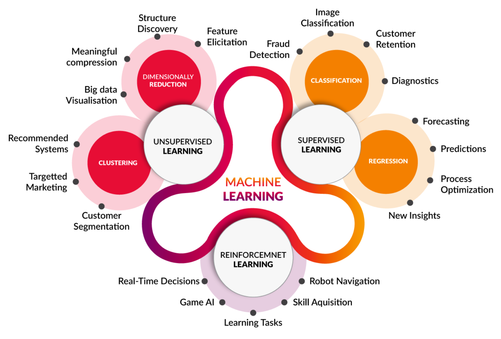

---
output:
  pdf_document: default
  html_document: default
---

#  Introduction:

Let’s start the book with an ancient parable. A group of blind men heard that a strange animal had been brought to the town, but none of them were aware of its shape and form. Out of curiosity, they said: "We must inspect and know it by touch, of which we are capable". So, they sought it out, and when they found it, they groped about it. They say the following one by one:

An animal such as a tree! ... said while holding his leg

An animal, such as walls! ... said while touching its broad and sturdy side

An animal like a snake! ... said while holding the squirming trunk within his hands

An animal, such as rope! ... said while seizing on the swinging tail

An animal like a fan! ... said while touching the ear 

An animal such as a spear! ... said while touching his tusk

What is this animal?

This animal is elephant!

Like in this parable, think someone, who just wanted to start to learn econometrics, came to you and ask for some advice. They're asking you the following question. How can I learn Econometrics? Your answer will depend on yours and that persons interest. You can tell that person to start with cross section, time-series, or panel data. Or you can start with frequentist approach or Bayesian approach. You can start with Econometrics theory then applied or vice versa. You can start with Applied Micro Econometrics or Macro Econometrics. You can start with parametric econometrics or nonparametric econometrics. You can provide any sources and courses and lectures with any of these topics and all of them are rightfully starting point to learn Econometrics. But people within this field even within the subfields don't agree totally which is the real econometrics and which is not.

Why are we telling this? Because everyone is talking about what machine learning is. Everyone explains this depending on their own field or from their own subfield or own perspective or what they're doing. Even finding a good definition for Machine Learning has become a subtle job as "machine learning" seems increasingly an *overloaded* term implying that a robot-like *machine* predicts the things by learning itself without being explicitly programmed.  

Ethem Alpaydin, defines machine learning as follows:

> Machine learning is programming computers to optimize a performance criterion using example data or past experience. We have a model defined up to some parameters, and learning is the execution of a computer program to optimize the parameters of the model using the training data of past experience. (...) Machine learning uses the ***theory of statistics in building mathematical models***, because the core task is making inference from sample.  The role of computer science is twofold: First, in training, we need efficient algorithms to solve the optimization problem, as well as to store and process the massive amount of data we generally have.  Second, once the model is learned, its representation and algorithmic solution for inference needs to be efficient as well.
>

Hence, there are no "mysterious" machines that are learning and acting alone, but well-defined **statistical/econometrics models** for predictions that are optimized by efficient algorithms and executed by powerful machines, as known as computers.  Thus, the name of the book: **MachineMetrics**

 The following machine learning visualization/list shows separate fields in machine learning.  

- **Supervised Learning**
  - **Classification**
    - Fraud detection
    - Image classification
    - Customer retention
    - Diagnostics
    - Email spam and malware filtering
    - Sentiment analysis
  - **Regression**
    - Forecasting (weather, stock prices)
    - Predictions (sales, revenue)
    - Process optimization (manufacturing, supply chain)
    - Real estate pricing
    - Energy demand modeling

- **Unsupervised Learning**
  - **Clustering**
    - Recommendation systems
    - Targeted marketing
    - Customer segmentation
    - Genetic clustering
    - Social network analysis
  - **Dimensionality Reduction**
    - Big data visualizations
    - Meaningful compression
    - Structure discovery
    - Feature elicitation
    - Noise reduction
    - Data preprocessing for supervised learning

- **Semi-Supervised Learning**
  - Data labeling
  - Web content classification
  - Image and video annotation
  - Medical image analysis

- **Reinforcement Learning**
  - Real-time decisions
  - Game AI
  - Learning tasks
  - Skill acquisition
  - Robot navigation
  - Autonomous vehicles
  - Personalized recommendations

- **Deep Learning**
  - **Convolutional Neural Networks (CNNs)**
    - Image and video recognition
    - Image segmentation
    - Medical image analysis
  - **Recurrent Neural Networks (RNNs)**
    - Language modeling
    - Speech recognition
    - Time series prediction
  - **Generative Adversarial Networks (GANs)**
    - Image generation
    - Art creation
    - Data augmentation
  - **Transformer Models**
    - Natural language understanding
    - Machine translation
    - Text summarization

$$
\begin{table}[h]
\centering
\caption{Overview of Machine Learning Categories}
\label{table:ml_categories}
\begin{tabular}{|p{3.5cm}|p{3.5cm}|p{6.5cm}|}
\hline
\textbf{ML Category} & \textbf{Subcategory} & \textbf{Details} \\
\hline
\multirow{6}{*}{\textbf{\begin{tabular}[c]{@{}c@{}}Supervised \\ Learning\end{tabular}}} & \textbf{Classification} & 
    \begin{tabular}[c]{@{}l@{}}
    - Fraud detection \\
    - Image classification \\
    - Customer retention \\
    - Diagnostics \\
    - Email spam and malware filtering \\
    - Sentiment analysis \\
    \end{tabular} \\
\cline{2-3}
 & \textbf{Regression} & 
    \begin{tabular}[c]{@{}l@{}}
    - Forecasting (weather, stock prices) \\
    - Predictions (sales, revenue) \\
    - Process optimization (manufacturing, supply chain) \\
    - Real estate pricing \\
    - Energy demand modeling \\
    \end{tabular} \\
\hline
\multirow{6}{*}{\textbf{\begin{tabular}[c]{@{}c@{}}Unsupervised \\ Learning\end{tabular}}} & \textbf{Clustering} & 
    \begin{tabular}[c]{@{}l@{}}
    - Recommendation systems \\
    - Targeted marketing \\
    - Customer segmentation \\
    - Genetic clustering \\
    - Social network analysis \\
    \end{tabular} \\
\cline{2-3}
 & \textbf{Dimensionality Reduction} & 
    \begin{tabular}[c]{@{}l@{}}
    - Big data visualizations \\
    - Meaningful compression \\
    - Structure discovery \\
    - Feature elicitation \\
    - Noise reduction \\
    - Data preprocessing \\
    \end{tabular} \\
\hline
\textbf{\begin{tabular}[c]{@{}c@{}}Reinforcement \\ Learning\end{tabular}} & & 
    \begin{tabular}[c]{@{}l@{}}
    - Real-time decisions \\
    - Game AI \\
    - Learning tasks \\
    - Skill acquisition \\
    - Robot navigation \\
    - Autonomous vehicles \\
    - Personalized recommendations \\
    \end{tabular} \\
\hline
\multirow{12}{*}{\textbf{\begin{tabular}[c]{@{}c@{}}Deep \\ Learning\end{tabular}}} & \textbf{Convolutional Neural Networks (CNNs)} & 
    \begin{tabular}[c]{@{}l@{}}
    - Image and video recognition \\
    - Image segmentation \\
    - Medical image analysis \\
    \end{tabular} \\
\cline{2-3}
 & \textbf{Recurrent Neural Networks (RNNs)} & 
    \begin{tabular}[c]{@{}l@{}}
    - Language modeling \\
    - Speech recognition \\
    - Time series prediction \\
    \end{tabular} \\
\cline{2-3}
 & \textbf{Generative Adversarial Networks (GANs)} & 
    \begin{tabular}[c]{@{}l@{}}
    - Image generation \\
    - Art creation \\
    - Data augmentation \\
    \end{tabular} \\
\cline{2-3}
 & \textbf{Transformer Models} & 
    \begin{tabular}[c]{@{}l@{}}
    - Natural language understanding \\
    - Machine translation \\
    - Text summarization \\
    \end{tabular} \\
\hline
\end{tabular}
\end{table}
$$

We designed this book for researchers who deal with data and aimed to provide toolkit which is easily accessible. When we started to learn these topics years ago, we did not know where to start and poke in each topic in that graph. We tried to learn one topic or how we can use it in our own research. We tried to identify the topics we can use as an applied microeconomics and in general as an economist as we are not dealing in robot navigation or game AI or similar topics in our research. Thus, we are only interested in subtopics which are relevant for our research such as dimension reduction and the structure discovery, the regression part and forecasting mostly for finance and so on (these topics from figure). We can use topics related to predictions and optimizations and some new insights.  As a social scientist the part we can employ in our research is just some part of the topics in that figure.  Because of that, when you discuss with someone who is in machine learning from computer science and robotics or AI sector and so on, they may try to explain where ML can be used as recommending songs, pictures, the fraud detection, computer vision, speech recognition, document classification, automated driving, but it may not be interesting or relevant for us directly. However, nearly all these subfields start and build on the statistical learning methods we will cover in this book.

Imagine guiding a child to distinguish between animals, particularly identifying what a dog is and what a cat is. By the end of this exercise, the child will learn to recognize these animals. Instead of detailing every nuance of what differentiates a dog from a cat, you might show the child various pictures of dogs and cats. Over time, the child will start to notice patterns and be able to differentiate between the two animals. Machine learning works in a similar way. You feed a computer lots of data (like pictures of cats and dogs), and over time, the computer learns to recognize the patterns in the data.

Put simply, machine learning teaches computers to recognize patterns much as we teach children—though the former relies on data and algorithms, while the latter uses tangible examples and verbal explanations. Distinguishing between cats and dogs in images is just one facet of machine learning. Similarly, these techniques power our email filters to sort spam from important messages, enable virtual assistants like Siri or Alexa to understand voice commands, and help streaming platforms like Netflix or Spotify suggest movies or songs tailored to our preferences. These instances, alongside text analysis and speech recognition, underscore the pervasive role of machine learning in modern life. Yet, our primary emphasis will be on the techniques and uses of machine learning in data analysis, which is used for estimation procedures, data exploration, and causal inference.

A more fitting example for this book's content would be the following:

In a community with rising concerns about food allergies, Alex, a young individual, grappled with recurring allergic reactions. Driven by a pressing need to pinpoint their root cause, he embarked on a personal mission. Eager to understand the extent of his susceptibility, Alex meticulously documented each instance he consumed food as well as various nuts, leading to a preliminary data collection effort. 

In a bid to learn the reason of his sporadic sickness after eating, Alex adopted an approach resembling statistical and machine learning. By systematically recording his meals and subsequent health reactions, he discerned a pattern linking his discomfort to garlic consumption. Testing and validating his hypothesis through various food experiments, Alex refined his understanding, confirming garlic as the culprit while ruling out other foods. His methodical process of data collection, pattern recognition, hypothesis testing, and model refining mirrors the foundational steps in machine learning, showcasing how both humans and machines learn from data and adjust based on outcomes.

Visualization of this gathered data unveiled stark patterns, underscoring the correlation between his various nuts and garlic consumption and the allergic reactions, with garlic standing out prominently. Motivated to transition from mere correlation to concrete causation, Alex conducted controlled experiments, eventually confirming that garlic was the definitive cause of his allergic symptoms.

Realizing the potential broader implications of his discovery, especially for those who might share similar susceptibilities, Alex's endeavor caught the attention of researchers. Researchers embarked on a study to gauge its prevalence among those similar to Alex in the larger community. They selected a representative sample and found a significant proportion exhibited allergic reactions. Through their findings, they estimated a certain percentage of the broader group might have this allergy. Using statistical tools, they provided a confidence interval to show the likely range of this percentage. They then extrapolated their findings to the broader community, highlighting potential allergen prevalence. Yet, they acknowledged that their conclusions depend on the sample's accuracy and potential biases. This exercise underscores the principles of statistical estimation, with a focus on sampling, confidence intervals, and extrapolation.

Delving into statistical methods, they journeyed from basic correlations to deep causative insights, unraveling the true triggers behind such allergies. The research eventually progressed to other methodologies like time series forecasting of allergy intensities. Through using time series analysis and forecasting, researchers not only confirm the relationship between garlic consumption and allergic reactions in a larger sample but also provide valuable predictive insights for individuals similar to Alex.

Additionally, researchers employed graphical network analysis for the spread of allergy awareness in the population. By leveraging this analysis, they could grasp the intricacies of the community's social dynamics and the paths information took. This empowers them to deploy targeted interventions, ensuring that knowledge about garlic allergies is disseminated effectively.

Researchers also use of classification and regression models to ascertain risk categories and predict allergic reaction severity. While classification assists in grouping individuals as either high-risk or not, regression quantifies the anticipated intensity of their reactions.

Starting with Alex's personal exploration into his garlic allergy, mirroring the steps of machine learning, the scope expanded into a wider research project. This broader study harnessed statistical learning methodologies, using samples to gauge the prevalence of such allergies in the community. Both machine and statistical learning techniques can be instrumental in addressing varied research questions, demonstrating the multifaceted nature of learning from data.

In general, there are four different starting points and approaches to Machine Learning Theory. Bias- variance trade-off approach, Vapnik-Chervonenkis theory, Computational Complexity of Machine Learning, and Bayesian Learning. In this book, we will focus on bias-variance trade-off approach. You can think this like in micro theory, when I teach, we will talk about preference relation or choice-based relation. Then I connect these concepts to utility maximization, and then continue from there. It is a similar idea but in economics especially as we will almost always deal with sampling issues and so on. We will start with bias- variance trade-off. We will also mainly follow frequentist approach not Bayesian approach.  Again, as a side note, you can learn everything by starting from Vapnik-Chervonenkis Theory, the Perceptron Algorithm, especially if you are interested in deep learning and neural networks and you will reach to the same point. However, we will also cover these topics (deep learning and neural networks) in our book as well.

 
Machine Learning has three main paradigms build on the aforementioned theories. Supervised learning, Unsupervised learning, and Reinforcement learning.  The main paradigm we will cover in this book is supervised learning. Simply put, when we know the outcome, it is called supervised learning, and when we do not it is called unsupervised learning. The main topics we will cover under these paradigms are classification, regression, clustering, and dimensionality reduction. We will also cover some additional topics such as …… Some of these uninterpretable ML methods’ goal and aim are different as we will cover in this book.
 
## Prediction vs. Estimation:

As a researcher our aim is finding associations and predictions using different dataset. We want to clarify some concepts that are used interchangeably, which is a mistake, in different machine learning sources.  

Keep in mind, the main aspect of machine learning is to use one set of data to generalize the findings on new data not seen yet.  We use the term Prediction to describe this process in Machine Learning. The other similar terms are extrapolation and forecasting. In social sciences, the most common term is estimation while analyzing main data. However, these terms have different connotations, and we think using them in the right place will help all of us to understand certain topics better.

Let’s started by describing the term of prediction first.

**Prediction** (Latin præ-, "before," and dicere, "to say"), or forecast, is a statement about a future event. They are often, but not always, based upon experience or knowledge. There is no universal agreement about the exact difference from "estimation"; different authors and disciplines ascribe different connotations. Prediction in the non-economic social sciences differs from the natural sciences and includes multiple alternative methods such as trend projection, forecasting, scenario-building and surveys. You can read different definitions of prediction and its use from 12 different fields from science, sports, finance, and non-scientific context. Here is the link (https://en.wikipedia.org/wiki/Prediction).  

**Extrapolation**: the action of estimating or concluding something by assuming that existing trends will continue, or a current method will remain applicable. Extrapolation is estimating the value of a variable outside a known range of values by assuming that the estimated value follows some pattern from the known ones. In mathematics, extrapolation is a type of estimation, beyond the original observation range, the value of a variable is based on its relationship with another variable.

**Forecasting**: the process of making predictions based on past and present data. Risk and uncertainty are central to forecasting and prediction; it is generally considered a good practice to indicate the degree of uncertainty attaching to forecasts. In any case, the data must be up to date in order for the forecast to be as accurate as possible.  “Good forecasts capture the genuine patterns and relationships which exist in the historical data, but do not replicate past events that will not occur again.” (reference Hydman book ). This term is more commonly used in fields of Finance and Economics. Generally, people use time series data and methods for forecasting.  

Even though, we think extrapolation is better term, we use forecast in Economics, Finance, or prediction in Machine Learning.

We should be aware that prediction in economics and social sciences differs from the natural sciences. If you discover a relationship in the natural sciences and explain the conditions for that relationship, then that relationship holds regardless of where and when it is found unlike social sciences. Hence, this relationship can be understood as both a prediction as well as an extrapolation. Consider the example of a chemical reaction occurring in a laboratory under well-defined conditions; the findings become immediately applicable to other locations with the same conditions. Moreover, in natural sciences, prediction incorporates multiple alternative methods such as trend projection, forecasting, and scenario building.

The hardest part of prediction in the social sciences, "predictors are part of the social context about which they are trying to make a prediction and may influence that context in the process". In another word, you predict something and implement the policy using this prediction, people change their behaviour based on this new policy, even before implementing the policy. In economics, this is well known as Lucas Critique.  “Lucas summarized his critique: Given that the structure of an econometric model consists of optimal decision rules of economic agents, and that optimal decision rules vary systematically with changes in the structure of series relevant to the decision maker, it follows that any change in policy will systematically alter the structure of econometric models.”

Estimation is various procedures to find an estimate using a sample drawn from the population. Estimate is the potential range of values of some property of a population and generated by projecting results from samples onto the entire population. Both effect and prediction research questions are inherently estimation questions, but they are distinct in their goals. In encapsulating Effect, the researcher is mainly interested in estimating the effect of exposure on outcome adjusted for covariates. On the other hand, when the focus is Prediction, the researcher is mainly interested in generating a function to input covariates and predict a value for the outcome. Mostly, economists and social and health scientists estimate an effect, and try to find Causal Explanation/Attribution. Even though, Economists prefer to use causal relation or explanation, statisticians studying these topics prefer to use the term of attribution.

**What about prediction?**

Most economist claim that economics research is not about prediction but estimation and finding a causal explanation. For instance, Ludwig von Mises, “[predicting the economic future is] beyond the power of mortal man”. Or Applied economists act as if unbiased estimation is prediction (on average). Even some claims prediction is not a good thing, and it is unscientific. We are interested in understanding things, not just predicting, or controlling them. However, “being able to predict something is a sign that you understand it, not being able to predict is a good sign that you don’t.”	

However, in real life, most people or firms are interested in prediction.  For instance, individually you ask whether this education policy is good for my children, and you don't care about the average estimates. You care about what will happen to your own kids education with this specific teacher or specific education policy. Similarly, crime forecasting in the law enforcement operations, or the change in specific treatment might cure the patient, or improve the prediction of one-year survival probability after sickness, treatment, etc.
All in all, you want a specific individual prediction. You don't care too much about the average estimated effect of the population.

Here you can see two very good sources that you can read about this discussion.
\footnotetext[1]{Bradley Efron,(2020) \href{https://doi.org/10.1080/01621459.2020.1762613}{"Prediction, Estimation, and Attribution"}, \textit{Journal of the American Statistical Association}, 115:530, 636-655}
\footnotetext[2]{Shmueli, Galit,(2010) \href{https://dx.doi.org/10.2139/ssrn.1351252}{"To Explain or To Predict?"}, \textit{Statistical Science}}

## Where can you use the covered topics in Social Sciences?:

In addition to clarifying the terms and terminology above, we would like to emphasize that even though Machine Learning is used primarily for prediction, we, as economists,social and health scientists, can use machine learning and other statistical and econometric tools  covered in this book for estimation procedures, exploration of data, causal inference, and more.

To begin, we can transform text, images, historical documents, and similar unconventional information into new data. It may be possible to incorporate job descriptions, language and sentiment of financial documents, social media, court transcripts, and health reports into indexes or other types of variables. Researchers can implement these types of new tools in almost any program in a straightforward and reliable way with ready-to-use packages.

The standard machine learning methods are correlational approaches; therefore, we can use some of these methods to visualize data in a more meaningful way, analyze it better, and identify patterns in the data. We have discussed several of these methods in this book, such as graphical modelling, semi-partial correlation, regularized covariance matrix, graphical ridge and lasso models.

There are some statistical methods which assist researchers in reducing dimensions when they are attempting to identify patterns between variables and identify significant influences, i.e. correlation analysis. The correlation analysis is a statistical method used to determine the degree of relationship between two or more variables while accounting for both spatial and temporal dimensions of these static and dynamic relationships. Correlation analysis may become complicated when the model includes too many variables as well as ‘latent variables’. These latent variables are unobserved but influential factors that explain a significant proportion of the variation common among the input variables. In the social sciences, it is common to use either random or fixed effect indicators to account for these unobserved factors.  However, dimension reduction methods should be used for settings which has too many latent variables, as well as dynamic spatial and temporal relationships. Some of these methods we cover are Principle Component Analysis, Factor Analysis, as well as Dynamic Mode Decomposition which can be thought of as an ideal combination of spatial dimensionality-reduction techniques.

In economics as well as other health and social sciences, finding causal relationship is the ultimate goal for any researcher, policy maker or business. Researchers use some machine learning methods to improve some of the usual causal methods. Researchers work with Rubin causal framework, in which they compare the representative sample in actual and counterfactual situations to find treatment or causal effect. Thus, imputing missing counterfactual values are mainly a prediction problem. Hence, researchers implement various ML methods for Direct and conditional randomization, Indirect randomization: Instrumental variables, Local randomization: Regression discontinuity, Second-order randomization: Difference-in-difference, as well as Propensity Score matching, and Synthetic Control methods.

Both Athey&Imbens (2019) and Mullainathan & Spiess (2017) highlight, “some substantive problems are naturally cast as prediction problems, and assessing their goodness of fit on a test set may be sufficient for the purposes of the analysis in such cases. In other cases, the output of a prediction problem is an input to the primary analysis of interest, and statistical analysis of the prediction component beyond convergence rates is not needed.” As an example , Variable Selection in $ y=D\gamma+X\beta+\epsilon$ as most coefficients besides treatment one are inconsequential! Another common example is first stage selection (since the first stage deals with prediction problems) in instrumental variable models. Debiased Machine Learning for Treatment is another recently developed method.
[footnote: [https://doi.org/10.1146/annurev-economics-080217-053433 ])  ]
(https://arxiv.org/pdf/1712.10024.pdf)

Researchers are also interested in knowing how treatment affects certain sub-populations in addition to finding the average treatment effect. A given treatment may have different effects on different units. Heterogeneity of treatment effects refers to the study of these differences across subjects. There are several machine-learning methods that can help to improve heterogeneous treatments or causal effects, including Causal Forest. The casual forest approach splits the covariate sample and calculates predictions as a local average treatment effect. (footnote: https://arxiv.org/abs/1712.09988 )

Almost always, in social sciences, we assume our models are linear and parametric. Model selection, however, is the process of selecting one model out of numerous potentials for a predictive problem. We discuss in detail the importance and usefulness of model selection as well.
	
Time series forecasting is a fundamental task at the core of many data-driven applications. Forecasting models were developed using a variety of advanced autoregressive methods, including ARIMA. Rather than using normal time series tests, we show how to grid search ARIMA model hyperparameters. Furthermore, methods based on deep learning have been explored for time series forecasting. Additionally, we cover an embedding method that enhances the performance of many deep learning models on time series data. As a result of the embedding layers, the model can simultaneously learn from several time series of different units. These categorical features (e.g., holidays, weather, geography) are embedded in a lower dimensional space to extract useful information.

The dynamic discrete choice (DDC) models are used for modeling an agent's choices among discrete options. As opposed to the assumption that observed choices are the result of static utility maximization, DDC models assume that observed choices are the result of maximization of the present value of utility. DDC methods aim to determine the structural parameters of the decision process of agents. By using these parameters, researchers can simulate how the agent would behave in a counterfactual setting. Recently developed machine learning methods have the potential to improve DDC models . [Dynamic Discrete Choice models (https://arxiv.org/abs/1808.02569) (https://sites.google.com/view/semenovavira/research?authuser=0)]

Obtaining reliable estimates of demand is fundamental to a wide range of studies in Industrial Organization and other fields of economics. For every counterfactual question concerning a market, it is necessary to quantify the response of choices to ceteris paribus changes in prices and other characteristics of the market. The most common methods of estimating demand are linear, logit, nested logit, and DDC. Recently, ML methods have been incorporated into routine demand estimation techniques to improve the out-of-sample prediction accuracy.
 [Footnote: Recent very extensive review about demand estimation: https://cowles.yale.edu/sites/default/files/d2301.pdf]

## Translation of Concepts: Different Terminology

-	Raw data and labels; create features (covariates(x)) which is input data

-	to train an algorithm: to run an estimation procedure

-	Estimation sample; Training data

- Features – Predictive covariates, Regressors

-	Labels- Outcome

-	Training Data- Sample

-	Prediction Rule (hypotheses): A function for prediction

-	Hypothesis testing:  testing whether prediction rule (function) is true or not (not a coefficient test)

-	Learning algorithms: algorithm which map samples into predictor functions.

-	a (categorical) dependent variable (y); Label

-	a (continuous) dependent variable (y); Response

-	Classification: predicting Discrete variables (-1, 1)

-	Regression: predicting a continuous value		

-	Use training data, validation data and test data (in-sample and out-sample)	

-	Linear regression is one type of parametric algorithm

-	Bias-Variance Tradeoff

-	The main goal is to get good out-of-sample predictions. To do so, we must overcome a problem known as overfitting.

-	Regularization ; hyperparameter by model tuning using cross-validation or penalty measure (like Akaike’s information criterion (AIC))

-	Minimize loss function and Learning parameters (minimize cost function using Lagrangian or gradient descent)

-	Non-parametric supervised learning algorithms: k-NN and	decision trees

-	Unsupervised learning (no y): principal components analysis (PCA), k-means clustering, Hierarchical clustering (\href{https://towardsdatascience.com/how-gene-expression-related-to-leukemia-type-using-pca-and-hierarchical-clustering-c8561303853a}{Real life example}), Singular value decomposition (SVD)

- Support Vector Machine

-	Ensemble methods; Bagging; Boosting

-	Neural Networks; Deep Learning

## Is Machine Learning Better?

Machine learning, while a powerful tool, may not always be the most suitable approach for every research inquiry. A crucial aspect of conducting research is the formulation of a precise and answerable research question. The strengths and weaknesses of conventional research methods versus machine learning techniques differ, and it is vital to establish the research objective before embarking on any study.

Traditional estimation methods still hold significant value and will continue to be employed in various research settings. However, machine learning techniques can be harnessed for their predictive capabilities. It is essential to understand that machine learning does not provide a solution to the core identification problem in social sciences, which revolves around the fact that counterfactual situations remain unobservable. Nonetheless, machine learning can enhance our ability to create certain counterfactual scenarios.

Machine learning demonstrates exceptional performance in tasks involving the prediction of patterns or structures, such as letters, words, and images. For example, it can accurately predict handwritten letters with a remarkable 99.97 percent accuracy rate. Despite these impressive capabilities, machine learning cannot replace human intuition or theoretical understanding when addressing the question of "why?" Furthermore, it is limited in its ability to predict large, unforeseen events (also known as "black swans"), as its predictions are grounded in historical data, and predicting such exceptional occurrences proves to be challenging.

In conclusion, researchers should carefully consider the purpose of their study and the specific research question at hand when deciding whether to employ machine learning techniques or rely on conventional statistical and econometrics methods. While machine learning offers notable advancements in predictive accuracy, it remains limited in addressing certain aspects of research, such as explaining causality and anticipating unexpected events.

