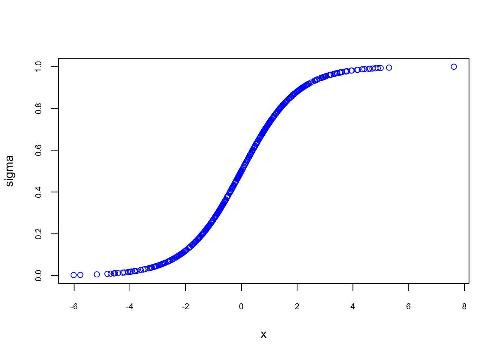

# Parametric Estimations - Basics

 Parametric vs. Nonparametric methods {-}

https://towardsdatascience.com/parametric-vs-non-parametric-methods-2cea475da1a

In parametric methods, we typically make an assumption with regards to the form of the function f. For example, you could make an assumption that the unknown function f is linear. parametric methods in Machine Learning usually take a model-based approach where we make an assumption with respect to form of the function to be estimated and then we select a suitable model based on this assumption in order to estimate the set of parameters.The biggest disadvantage of parametric methods is that the assumptions we make may not always be true. For instance, you may assume that the form of the function is linear, whilst it is not. Therefore, these methods involve less flexible algorithms and are usually used for less complex problems.

However, parametric methods tend to be quite fast and they also require significantly less data compared to non-parametric methods (more on this in the following section). Additionally, since parametric methods tend to be less flexible and suitable for less complex problems, they are more interpretable.
On the other hand, non-parametric methods refer to a set of algorithms that do not make any underlying assumptions with respect to the form of the function to be estimated. And since no assumption is being made, such methods are capable of estimating the unknown function f that could be of any form.

Non-parametric methods tend to be more accurate as they seek to best fit the data points. However, this comes at the expense of requiring a very large number of observations that is needed in order to estimate the unknown function f accurately. Additionally, these methods tend to be less efficient when it comes to training the models. Furthermore, non-parametric methods may sometimes introduce overfitting. Since these algorithms tend to be more flexible, they may sometimes learn the errors and noise in a way that they cannot generalise well to new, unseen data points.

On the flip side, non-parametric methods are quite flexible and can lead to better model performance since no assumptions are being made about the underlying function.

http://www2.math.uu.se/~thulin/mm/breiman.pdf

https://www.quora.com/What-was-Leo-Breiman-trying-to-convey-in-his-research-paper-Statistical-Modeling-The-Two-Cultures-Was-he-trying-to-say-that-the-field-is-odd-Did-he-mean-that-algorithmic-modelling-machine-learning-is-superior-to-traditional-data-modelling

https://www.uio.no/studier/emner/matnat/math/STK9200/h21/two_cultures_pdf.pdf

http://www.stat.columbia.edu/~gelman/research/published/gelman_breiman.pdf

https://muse.jhu.edu/article/799731/pdf

https://muse.jhu.edu/issue/45147

Leo Breiman [@Breiman_2001]: [Statistical Modeling: The Two Cultures](https://projecteuclid.org/download/pdf_1/euclid.ss/1009213726):

> For instance, in the Journal of the American Statistical Association (JASA), virtually every article contains a statement of the form: *Assume that the data are generated by the following model:... I am deeply troubled by the current and past use of data models in applications, where quantitative conclusions are drawn and perhaps policy decisions made.*
>
>... assume the data is generated by independent draws from the model*
>
>$$
>y=b_{0}+\sum_{1}^{M} b_{m} x_{m}+\varepsilon
>$$
>
>where the coefficients are to be estimated. The error term is N(0, $\sigma^2$) and $\sigma^2$ is to be estimated. Given that the data is generated this way, elegant tests of hypotheses,confidence intervals,distributions of the residual sum-of-squares and asymptotics can be derived. This made the model attractive in terms of the mathematics involved. This theory was used both by academics statisticians and others to derive significance levels for coefficients on the basis of model (R), with little consideration as to whether the data on hand could have been generated by a linear model. Hundreds, perhaps thousands of articles were published claiming proof of something or other because the coefficient was significant at the 5% level...
>
>...With the insistence on data models, multivariate analysis tools in statistics are frozen at discriminant analysis and logistic regression in classification and multiple linear regression in regression. Nobody really believes that multivariate data is multivariate normal, but that data model occupies a large number of pages in every graduate text book on multivariate statistical analysis...
>

According to Breiman, there are two "cultures":  
**The Data Modeling Culture** : One assumes that the data are generated by a given stochastic data model (econometrics) ...  
**Algorithmic Modeling Culture**: One uses algorithmic models and treats the data mechanism as unknown (machine learning) ...    

He argues that the focus in the statistical community on data models has:
  
- Led to irrelevant theory and questionable scientific conclusions; 
- Kept statisticians from using more suitable algorithmic models; 
- Prevented statisticians from working on exciting new problems.  

In **parametric econometrics** we assume that the data come from a generating process that takes the following form:

$$
y=X \beta+\varepsilon
$$

Model ($X$'s) are determined by the researcher and probability theory is a foundation of econometrics


In **Machine learning** we do not make any assumption on how the data have been generated:

$$
y \approx m(X)
$$

Model ($X$'s) is not selected by the researcher and probability theory is not required

Nonparametric econometrics makes the link between the two: **Machine Learning: an extension of nonparametric econometrics**
   
To see the difference between two "cultures", we start with parametric modeling in classification problems.

## Parametric Estimations

So far we have only considered models for numeric response variables. What happens if the response variable is categorical? Can we use linear models in these situations? Yes, we can.  To understand how, let's look at the model that we have been using, ordinary least-square (OLS) regression, which is actually a specific case of the more general, generalized linear model (GLM).  So, in general, GLMs relate the mean of the response to a linear combination of the predictors, $\eta(x)$, through the use of a link function, $g()$. That is,  

\begin{equation}
\eta(\mathbf{x})=g(\mathrm{E}[Y | \mathbf{X}=\mathbf{x}]),
  (\#eq:5-1)
\end{equation} 

Or,  

\begin{equation}
\eta(\mathbf{x})=\beta_{0}+\beta_{1} x_{1}+\beta_{2} x_{2}+\ldots+\beta_{p-1} x_{p-1} = g(\mathrm{E}[Y | \mathbf{X}=\mathbf{x}])
  (\#eq:5-2)
\end{equation} 
  
In the case of a OLS,  

$$
g(\mathrm{E}[Y | \mathbf{X}=\mathbf{x}]) = E[Y | \mathbf{X}=\mathbf{x}],
$$
  
To illustrate the use of a GLM we’ll focus on the case of binary responses variable coded using 0 and 1. In practice, these 0 and 1s will code for two classes such as yes/no, committed-crime/not, sick/healthy, etc.  

$$
Y=\left\{\begin{array}{ll}{1} & {\text { yes }} \\ {0} & {\text { no }}\end{array}\right.
$$


##	LPM

Estimate the regression function, which under squared error loss is the conditional mean of $Y$ , the response, given  $X$, the features. These goal are essentially the same. We want to fit a model that “generalizes” well, that is, works well on new data that was not used to fit the model. To do this, we want to use a model of appropriate flexibility so as not to overfit to the training data.

Linear models are a family of parametric models which assume that the regression function (outcome is known and continuous) is a linear combination of the features. The $\beta$ coefficients are model parameters that are learned from the data via least squares or maximum likelihood.


A linear classifier (like LPM and Logistic) is one where a “hyperplane” is formed by taking a linear combination of the features, such that one side of the hyperplane predicts one class and the other side predicts the other.
nonparametric classifier such as knn

Let's use the same dataset, **Vehicles**, that we used in the lab sections and create a new variable, `mpg`:  


```r
#Inspect the data before doing anything
library(fueleconomy)  #install.packages("fueleconomy")
data(vehicles)
df <- as.data.frame(vehicles)

#Keep only observations without NA
dim(df)
```

```
## [1] 33442    12
```

```r
data <- df[complete.cases(df), ]
dim(data)
```

```
## [1] 33382    12
```

```r
#Let's create a binary variable, mpg = 1 if hwy > mean(hwy), 0 otherwise
mpg <- c(rep(0, nrow(data))) #Create vector mpg
data2 <- cbind(data, mpg) # add it to data
data2$mpg[data2$hwy > mean(data2$hwy)] <- 1
```
  
We are going to have a model that will predict whether the vehicle is a high mpg (i.e. `mpg` = 1) or low mpg (`mpg` = 0) car. As you notice, we have lots of character variables. Our model cannot accept character variables, but we can convert them into factor variables that give each unique character variable a number. This allows our model to accept our data. Let's convert them to factor variables now:  
  

```r
for (i in 1:ncol(data2)) {
  if(is.character(data2[,i])) data2[,i] <- as.factor(data2[,i])
}
str(data2)
```

```
## 'data.frame':	33382 obs. of  13 variables:
##  $ id   : num  13309 13310 13311 14038 14039 ...
##  $ make : Factor w/ 124 levels "Acura","Alfa Romeo",..: 1 1 1 1 1 1 1 1 1 1 ...
##  $ model: Factor w/ 3174 levels "1-Ton Truck 2WD",..: 28 28 28 29 29 29 29 29 29 30 ...
##  $ year : num  1997 1997 1997 1998 1998 ...
##  $ class: Factor w/ 34 levels "Compact Cars",..: 29 29 29 29 29 29 29 29 29 1 ...
##  $ trans: Factor w/ 46 levels "Auto (AV-S6)",..: 32 43 32 32 43 32 32 43 32 32 ...
##  $ drive: Factor w/ 7 levels "2-Wheel Drive",..: 5 5 5 5 5 5 5 5 5 5 ...
##  $ cyl  : num  4 4 6 4 4 6 4 4 6 5 ...
##  $ displ: num  2.2 2.2 3 2.3 2.3 3 2.3 2.3 3 2.5 ...
##  $ fuel : Factor w/ 12 levels "CNG","Diesel",..: 11 11 11 11 11 11 11 11 11 7 ...
##  $ hwy  : num  26 28 26 27 29 26 27 29 26 23 ...
##  $ cty  : num  20 22 18 19 21 17 20 21 17 18 ...
##  $ mpg  : num  1 1 1 1 1 1 1 1 1 0 ...
```

Done! We are ready to have a model to predict `mpg`.  For now, we'll use only `fuel`.  


```r
model1 <- lm(mpg ~ fuel + 0, data = data2) #No intercept
summary(model1)
```

```
## 
## Call:
## lm(formula = mpg ~ fuel + 0, data = data2)
## 
## Residuals:
##     Min      1Q  Median      3Q     Max 
## -0.8571 -0.4832 -0.2694  0.5168  0.7306 
## 
## Coefficients:
##                                 Estimate Std. Error t value Pr(>|t|)    
## fuelCNG                         0.362069   0.065383   5.538 3.09e-08 ***
## fuelDiesel                      0.479405   0.016843  28.463  < 2e-16 ***
## fuelGasoline or E85             0.269415   0.015418  17.474  < 2e-16 ***
## fuelGasoline or natural gas     0.277778   0.117366   2.367   0.0180 *  
## fuelGasoline or propane         0.000000   0.176049   0.000   1.0000    
## fuelMidgrade                    0.302326   0.075935   3.981 6.87e-05 ***
## fuelPremium                     0.507717   0.005364  94.650  < 2e-16 ***
## fuelPremium and Electricity     1.000000   0.497942   2.008   0.0446 *  
## fuelPremium Gas or Electricity  0.857143   0.188205   4.554 5.27e-06 ***
## fuelPremium or E85              0.500000   0.053081   9.420  < 2e-16 ***
## fuelRegular                     0.483221   0.003311 145.943  < 2e-16 ***
## fuelRegular Gas and Electricity 1.000000   0.176049   5.680 1.36e-08 ***
## ---
## Signif. codes:  0 '***' 0.001 '**' 0.01 '*' 0.05 '.' 0.1 ' ' 1
## 
## Residual standard error: 0.4979 on 33370 degrees of freedom
## Multiple R-squared:  0.4862,	Adjusted R-squared:  0.486 
## F-statistic:  2631 on 12 and 33370 DF,  p-value: < 2.2e-16
```
  
What we estimated is LPM.  Since $Y$ is 1 or 0,  

$$
E[Y | \mathbf{X}=\mathbf{Regular}]) = Probability(Y|X = \mathbf{Regular}),
$$
  
In this context, the link function is called "identity" because it directly “links” the probability to the linear function of the predictor variables. Let's see if we can verify this:  


```r
tab <- table(data2$fuel, data2$mpg)
ftable(addmargins(tab))
```

```
##                                  0     1   Sum
##                                               
## CNG                             37    21    58
## Diesel                         455   419   874
## Gasoline or E85                762   281  1043
## Gasoline or natural gas         13     5    18
## Gasoline or propane              8     0     8
## Midgrade                        30    13    43
## Premium                       4242  4375  8617
## Premium and Electricity          0     1     1
## Premium Gas or Electricity       1     6     7
## Premium or E85                  44    44    88
## Regular                      11688 10929 22617
## Regular Gas and Electricity      0     8     8
## Sum                          17280 16102 33382
```

```r
prop.table(tab, 1)
```

```
##                              
##                                       0         1
##   CNG                         0.6379310 0.3620690
##   Diesel                      0.5205950 0.4794050
##   Gasoline or E85             0.7305849 0.2694151
##   Gasoline or natural gas     0.7222222 0.2777778
##   Gasoline or propane         1.0000000 0.0000000
##   Midgrade                    0.6976744 0.3023256
##   Premium                     0.4922827 0.5077173
##   Premium and Electricity     0.0000000 1.0000000
##   Premium Gas or Electricity  0.1428571 0.8571429
##   Premium or E85              0.5000000 0.5000000
##   Regular                     0.5167794 0.4832206
##   Regular Gas and Electricity 0.0000000 1.0000000
```
  
Yes!  That's why OLS with a binary $Y$ is actually LPM.  That is,  

$$
Pr[Y = 1 | x=\mathbf{Regular}]) = \beta_{0}+\beta_{1} x_{i}.
$$
  
A more formal explanation is related to how $Y$ is distributed.  Since $Y$ has only 2 possible outcomes (1 and 0), it has a specific probability distribution.  First, let's refresh our memories about Binomial and Bernoulli distributions.  In general, if a random variable, $X$, follows the **binomial distribution** with parameters $n \in \mathbb{N}$ and $p \in [0,1]$, we write $X \sim B(n, p)$. The probability of getting exactly $k$ successes in $n$ trials is given by the probability mass function:  

\begin{equation}
\operatorname{Pr}(X=k)=\left(\begin{array}{l}{n} \\ {k}\end{array}\right) p^{k}(1-p)^{n-k}
  (\#eq:5-3)
\end{equation} 
for $k = 0, 1, 2, ..., n$, where  

$$
\left(\begin{array}{l}{n} \\ {k}\end{array}\right)=\frac{n !}{k !(n-k) !}
$$
  
Formula 5.3 can be understood as follows: $k$ successes occur with probability $p^k$ and $n-k$ failures occur with probability $(1-p)^{n−k}$. However, the $k$ successes can occur anywhere among the $n$ trials, and there are $n!/k!(n!-k!)$ different ways of distributing $k$ successes in a sequence of $n$ trials. Suppose a *biased coin* comes up heads with probability 0.3 when tossed. What is the probability of achieving 4 heads after 6 tosses?  
  
$$
\operatorname{Pr}(4 \text { heads})=f(4)=\operatorname{Pr}(X=4)=\left(\begin{array}{l}{6} \\ {4}\end{array}\right) 0.3^{4}(1-0.3)^{6-4}=0.059535
$$
  
The **Bernoulli distribution** on the other hand, is a discrete probability distribution of a random variable which takes the value 1 with probability $p$ and the value 0 with probability $q = (1 - p)$, that is, the probability distribution of any single experiment that asks a yes–no question.  The **Bernoulli distribution** is a special case of the **binomial distribution**, where $n = 1$. Symbolically, $X \sim B(1, p)$ has the same meaning as $X \sim Bernoulli(p)$. Conversely, any binomial distribution, $B(n, p)$, is the distribution of the sum of $n$ Bernoulli trials, $Bernoulli(p)$, each with the same probability $p$.  

$$
\operatorname{Pr}(X=k) =p^{k}(1-p)^{1-k} \quad \text { for } k \in\{0,1\}
$$
  
Formally, the outcomes $Y_i$ are described as being Bernoulli-distributed data, where each outcome is determined by an unobserved probability $p_i$ that is specific to the outcome at hand, but related to the explanatory variables. This can be expressed in any of the following equivalent forms:  

\begin{equation}
\operatorname{Pr}\left(Y_{i}=y | x_{1, i}, \ldots, x_{m, i}\right)=\left\{\begin{array}{ll}{p_{i}} & {\text { if } y=1} \\ {1-p_{i}} & {\text { if } y=0}\end{array}\right.
  (\#eq:5-4)
\end{equation} 
  
The expression 5.4 is the probability mass function of the Bernoulli distribution, specifying the probability of seeing each of the two possible outcomes. Similarly, this can be written as follows, which avoids having to write separate cases and is more convenient for certain types of calculations. This relies on the fact that $Y_{i}$ can take only the value 0 or 1. In each case, one of the exponents will be 1, which will make the outcome either $p_{i}$ or 1−$p_{i}$, as in 5.4.^[Intuitively, when $n=1$, achieving head once ($k=1$) is $P(head)= p^{k}(1-p)^{1-k}=p$ or $P(tail)= p^{k}(1-p)^{1-k}=1-p.$]  

$$
\operatorname{Pr}\left(Y_{i}=y | x_{1, i}, \ldots, x_{m, i}\right)=p_{i}^{y}\left(1-p_{i}\right)^{(1-y)}
$$
  
Hence this shows that  

$$
\operatorname{Pr}\left(Y_{i}=1 | x_{1, i}, \ldots, x_{m, i}\right)=p_{i}=E[Y_{i}  | \mathbf{X}=\mathbf{x}])
$$

Let's have a more complex model:  


```r
model2 <- lm(mpg ~ fuel + drive + cyl, data = data2)
summary(model2)
```

```
## 
## Call:
## lm(formula = mpg ~ fuel + drive + cyl, data = data2)
## 
## Residuals:
##      Min       1Q   Median       3Q      Max 
## -1.09668 -0.21869  0.01541  0.12750  0.97032 
## 
## Coefficients:
##                                  Estimate Std. Error t value Pr(>|t|)    
## (Intercept)                      0.858047   0.049540  17.320  < 2e-16 ***
## fuelDiesel                       0.194540   0.047511   4.095 4.24e-05 ***
## fuelGasoline or E85              0.030228   0.047277   0.639  0.52258    
## fuelGasoline or natural gas      0.031187   0.094466   0.330  0.74129    
## fuelGasoline or propane          0.031018   0.132069   0.235  0.81432    
## fuelMidgrade                     0.214471   0.070592   3.038  0.00238 ** 
## fuelPremium                      0.189008   0.046143   4.096 4.21e-05 ***
## fuelPremium and Electricity      0.746139   0.353119   2.113  0.03461 *  
## fuelPremium Gas or Electricity   0.098336   0.140113   0.702  0.48279    
## fuelPremium or E85               0.307425   0.059412   5.174 2.30e-07 ***
## fuelRegular                      0.006088   0.046062   0.132  0.89485    
## fuelRegular Gas and Electricity  0.092330   0.132082   0.699  0.48454    
## drive4-Wheel Drive               0.125323   0.020832   6.016 1.81e-09 ***
## drive4-Wheel or All-Wheel Drive -0.053057   0.016456  -3.224  0.00126 ** 
## driveAll-Wheel Drive             0.333921   0.018879  17.687  < 2e-16 ***
## driveFront-Wheel Drive           0.497978   0.016327  30.499  < 2e-16 ***
## drivePart-time 4-Wheel Drive    -0.078447   0.039258  -1.998  0.04570 *  
## driveRear-Wheel Drive            0.068346   0.016265   4.202 2.65e-05 ***
## cyl                             -0.112089   0.001311 -85.488  < 2e-16 ***
## ---
## Signif. codes:  0 '***' 0.001 '**' 0.01 '*' 0.05 '.' 0.1 ' ' 1
## 
## Residual standard error: 0.3501 on 33363 degrees of freedom
## Multiple R-squared:  0.5094,	Adjusted R-squared:  0.5091 
## F-statistic:  1924 on 18 and 33363 DF,  p-value: < 2.2e-16
```
  
Since OLS is a "Gaussian" member of GLS family, we can also estimate it as GLS. We use glm() and define the family as "gaussian".  


```r
model3 <- glm(mpg ~ fuel + drive + cyl, family = gaussian, data = data2)
#You can check it by comparing model2 above to summary(model3)
#Let's check only the coefficients  
identical(round(coef(model2),2), round(coef(model3),2))
```

```
## [1] TRUE
```
  
With this LPM model, we can now predict the classification of future cars in term of high (`mpg` = 1) or low (`mpg` = 0), which was our objective.  Let's see how successful we are in identifying cars with `mpg` = 1 in our own sample.  


```r
#How many cars we have with mpg = 1 and mpg = 0 in our data
table(data2$mpg) 
```

```
## 
##     0     1 
## 17280 16102
```

```r
#In-sample fitted values or predicted probabilities for mpg = 1
#Remember our E(Y|X) is Pr(Y=1|X)
mpg_hat <- fitted(model2)

#If you think that any predicted mpg above 0.5 should be consider 1 then
length(mpg_hat[mpg_hat > 0.5]) 
```

```
## [1] 14079
```

```r
length(mpg_hat[mpg_hat <= 0.5])
```

```
## [1] 19303
```
  
This is Problem 1: we are using 0.5 as our threshold (discriminating) probability to convert predicted probabilities to predicted "labels". When we use 0.5 as our threshold probability though, our prediction is significantly off:  we predict many cars with `mpg` = 0 as having `mpg` = 1.  

And here is Problem 2:  


```r
summary(mpg_hat)
```

```
##    Min. 1st Qu.  Median    Mean 3rd Qu.    Max. 
## -0.7994  0.2187  0.4429  0.4824  0.9138  1.2088
```
  
The predicted probabilities (of `mpg` = 1) are not bounded between 1 and 0.  We will talk about these issues later.  First let's see our next classification model or GLM.  


## Logistic Regression

Logistic Regression
Linear vs. Logistic Probability Models, which is better and when?  We will briefly talk about it here. You can find a nice summary by Paul Von Hippel here as well (<https://statisticalhorizons.com/linear-vs-logistic>) [@Hippel_2015].  

First, let's define some notation that we will use throughout. (Note that many machine learning texts use $p$ as the number of parameters.  Here we use as a notation for probability.  You should be aware of it.)  

$$
p(\mathbf{x})=P[Y=1 | \mathbf{X}=\mathbf{x}]
$$

With a binary (Bernoulli) response, we will mostly focus on the case when $Y = 1$, since, with only two possibilities, it is trivial to obtain probabilities when $Y = 0$.  

$$
\begin{array}{c}{P[Y=0 | \mathbf{X}=\mathbf{x}]+P[Y=1 | \mathbf{X}=\mathbf{x}]=1} \\\\ {P[Y=0 | \mathbf{X}=\mathbf{x}]=1-p(\mathbf{x})}\end{array}
$$
  
An explanation of logistic regression can begin with an explanation of the standard logistic function. The logistic function is a sigmoid function, which takes any real input $z$, and outputs a value between zero and one. The standard logistic function is defined as follows:  

\begin{equation}
\sigma(z)=\frac{e^{z}}{e^{z}+1}=\frac{1}{1+e^{-z}}
  (\#eq:5-5)
\end{equation} 

Let's see possible $\sigma(z)$ values and plot them against $z$.  


```r
set.seed(1)
n <- 500
x = rnorm(n, 0,2)
sigma <- 1/(1+exp(-x))
plot(sigma ~ x, col ="blue", cex.axis = 0.7)
```



This logistic function is nice because: (1) whatever the $x$'s are $\sigma(z)$ is always between 0 and 1, (2) The effect of $x$ on $\sigma(z)$ is not linear.  That is, there is lower and upper thresholds in $x$ that before and after those values (around -2 and 2 here) the marginal effect of $x$ on $\sigma(z)$ is very low.  Therefore, it seems that if we use a logistic function and replace $\sigma(z)$ with $p(x)$, we can solve issues related to these 2 major drawbacks of LPM.  

Let us assume that $z = y = \beta_{0}+\beta_{1} x_{1}$, the general logistic function can now be written as:  

\begin{equation}
p(x)=P[Y=1|\mathbf{X}=\mathbf{x}]=\frac{1}{1+e^{-\left(\beta_{0}+\beta_{1} x\right)}}
  (\#eq:5-6)
\end{equation} 


To understand why nonlinearity would be a desirable future in some probability predictions, let's imagine we try to predict the effect of saving ($x$) on home ownership ($p(x)$).  If you have no saving now ($x=0$), additional \$10K saving would not make a significant difference in your decision to buy a house ($P(Y=1|x)$).  Similarly, when you have \$500K ($x$) saving but without having house,  additional \$10K ($dx$) saving should not make you buy a house (with \$500K, you could've bought a house already, had you wanted one).  That is why flat lower and upper tails of $\sigma(z)$ are nice futures reflecting very low marginal effects of $x$ on the probability of having a house in this case.  

After a simple algebra, we can also write the same function as follows,  

\begin{equation}
\ln \left(\frac{p(x)}{1-p(x)}\right)=\beta_{0}+\beta_{1} x,
  (\#eq:5-7)
\end{equation}

where $p(x)/[1-p(x)]$ is called *odds*, a ratio of success over failure.  The natural log (ln) of this ratio is called, **log odds**, or **Logit**, usually denoted as $\mathbf(L)$.  Let's see if this expression is really linear. 
  


```r
p_x <- sigma
Logit <- log(p_x/(1-p_x)) #By defult log() calculates natural logarithms
plot(Logit ~ x, col ="red", cex.axis = 0.7)
```


In many cases, researchers use a logistic function, when the outcome variable in a regression is dichotomous.  Although there are situations where the linear model is clearly problematic (as described above), there are many common situations where the linear model is just fine, and even has advantages.  Let’s start by comparing the two models explicitly. If the outcome $Y$ is dichotomous with values 1 and 0, we define $P[Y=1|X] = E(Y|X)$ as proved earlier, which is just the probability that $Y$ is 1, given some value of the regressors $X$. Then the linear and logistic probability models are:  

$$
P[Y = 1|\mathbf{X}=\mathbf{x}]=E[Y | \mathbf{X}=\mathbf{x}] = \beta_{0}+\beta_{1} x_{1}+\beta_{2} x_{2}+\ldots+\beta_{k} x_{k},
$$
$~$

$$
\ln \left(\frac{P[Y=1|\mathbf{X}]}{1-P[Y=1|\mathbf{X}]}\right)=\beta_{0}+\beta_{1} x_{1}+\ldots+\beta_{k} x_{k}
$$

$~$

The linear model assumes that the probability $P$ is a linear function of the regressors, while the logistic model assumes that the natural log of the odds $P/(1-P)$ is a linear function of the regressors.  Note that applying the inverse logit transformation allows us to obtain an expression for $P(x)$.  With LPM you don't need that transformation to have $P(x)$.  While LPM can be estimated easily with OLS, the Logistic model needs MLE.  

$$
p(\mathbf{x})=E[Y | \mathbf{X}=\mathbf{x}]=P[Y=1 | \mathbf{X}=\mathbf{x}]=\frac{1}{1+e^{-(\beta_{0}+\beta_{1} x_{1}+\cdots+\beta_{p-1} x_{(p-1)})}}
$$
$~$

The major advantage of LPM is its interpretability. In the linear model, if $\beta_{2}$ is (say) 0.05, that means that a one-unit increase in $x_{2}$ is associated with a 5-percentage point increase in the probability that $Y$ is 1. Just about everyone has some understanding of what it would mean to increase by 5 percentage points their probability of, say, voting, or dying, or becoming obese.  The logistic model is less interpretable. In the logistic model, if $\beta_{1}$ is 0.05, that means that a one-unit increase in $x_{1}$ is associated with a 0.05 "unit" increase in the log odds, $\text{log}(P/{(1-P)})$, that $Y$ is 1. And what does that mean? I’ve never had any intuition for log odds.  So you have to convert it to the odd ratio (OR) or use the above equation to calculate fitted (predicted) probabilities.  Not a problem with R, Stata, etc.  

But the main question is when we should use the logistic model?  The logistic model is unavoidable if it fits the data much better than the linear model. And sometimes it does. But in many situations the linear model fits just as well, or almost as well, as the logistic model. In fact, in many situations, the linear and logistic model give results that are practically indistinguishable except that the logistic estimates are harder to interpret.  Here is the difference: **For the logistic model to fit better than the linear model, it must be the case that the log odds are a linear function of X, but the probability is not.**  


Lets review these concepts in a simulation exercise: 


```r
#Creating random data
set.seed(1) # In order to get the same data everytime 
n <- 500 # number of observation
x = rnorm(n) # this is our x
z = -2 + 3 * x

#Probablity is defined by a logistic function
#Therefore it is not a linear function of x!
p = 1 / (1 + exp(-z))

#Remember Bernoulli distribution defines Y as 1 or 0 
#Bernoulli is the special case of the binomial distribution with size = 1
y = rbinom(n, size = 1, prob = p)

#And we create our data
data <-  data.frame(y, x)
head(data)
```

```
##   y          x
## 1 0 -0.6264538
## 2 0  0.1836433
## 3 0 -0.8356286
## 4 0  1.5952808
## 5 0  0.3295078
## 6 0 -0.8204684
```

```r
table(y)
```

```
## y
##   0   1 
## 353 147
```

We know that probablity is defined by a logistic function (see above).  What happens if we fit it as LPM, which is $Pr[Y = 1 | x=\mathbf{x}]) = \beta_{0}+\beta_{1} x_{i}$?


```r
lpm <- lm(y ~ x, data = data)
summary(lpm)
```

```
## 
## Call:
## lm(formula = y ~ x, data = data)
## 
## Residuals:
##      Min       1Q   Median       3Q      Max 
## -0.76537 -0.25866 -0.08228  0.28686  0.82338 
## 
## Coefficients:
##             Estimate Std. Error t value Pr(>|t|)    
## (Intercept)  0.28746    0.01567   18.34   <2e-16 ***
## x            0.28892    0.01550   18.64   <2e-16 ***
## ---
## Signif. codes:  0 '***' 0.001 '**' 0.01 '*' 0.05 '.' 0.1 ' ' 1
## 
## Residual standard error: 0.3504 on 498 degrees of freedom
## Multiple R-squared:  0.411,	Adjusted R-squared:  0.4098 
## F-statistic: 347.5 on 1 and 498 DF,  p-value: < 2.2e-16
```

```r
#Here is the plot Probabilities (fitted and DGM) vs x. 
plot(x, p, col = "green", cex.lab = 0.7, cex.axis = 0.8)
abline(lpm, col = "red")
legend("topleft", c("Estimated Probability by LPM", "Probability"), lty = c(1, 1),
pch = c(NA, NA), lwd = 2, col = c("red", "green"), cex = 0.7)
```


How about a logistic regression?


```r
logis <- glm(y ~ x, data = data, family = binomial)
summary(logis)
```

```
## 
## Call:
## glm(formula = y ~ x, family = binomial, data = data)
## 
## Coefficients:
##             Estimate Std. Error z value Pr(>|z|)    
## (Intercept)  -1.8253     0.1867  -9.776   <2e-16 ***
## x             2.7809     0.2615  10.635   <2e-16 ***
## ---
## Signif. codes:  0 '***' 0.001 '**' 0.01 '*' 0.05 '.' 0.1 ' ' 1
## 
## (Dispersion parameter for binomial family taken to be 1)
## 
##     Null deviance: 605.69  on 499  degrees of freedom
## Residual deviance: 328.13  on 498  degrees of freedom
## AIC: 332.13
## 
## Number of Fisher Scoring iterations: 6
```

```r
#Here is the plot Probabilities (fitted and DGM) vs x. 

plot(x, p, col = "green", cex.lab = 0.8, cex.axis = 0.8)
curve(predict(logis, data.frame(x), type = "response"), add = TRUE, col = "red", lty = 2)
legend("topleft", c("Estimated Probability by GLM", "Probability"), lty = c(1, 1),
pch = c(NA, NA), lwd = 2, col = c("red", "green"), cex = 0.7)
```


As you can see, the estimated logistic regression coefficients are in line with our DGM coefficients (-2, 3).
  
$$
\log \left(\frac{\hat{p}(\mathbf{x})}{1-\hat{p}(\mathbf{x})}\right)=-1.8253+2.7809 x
$$

