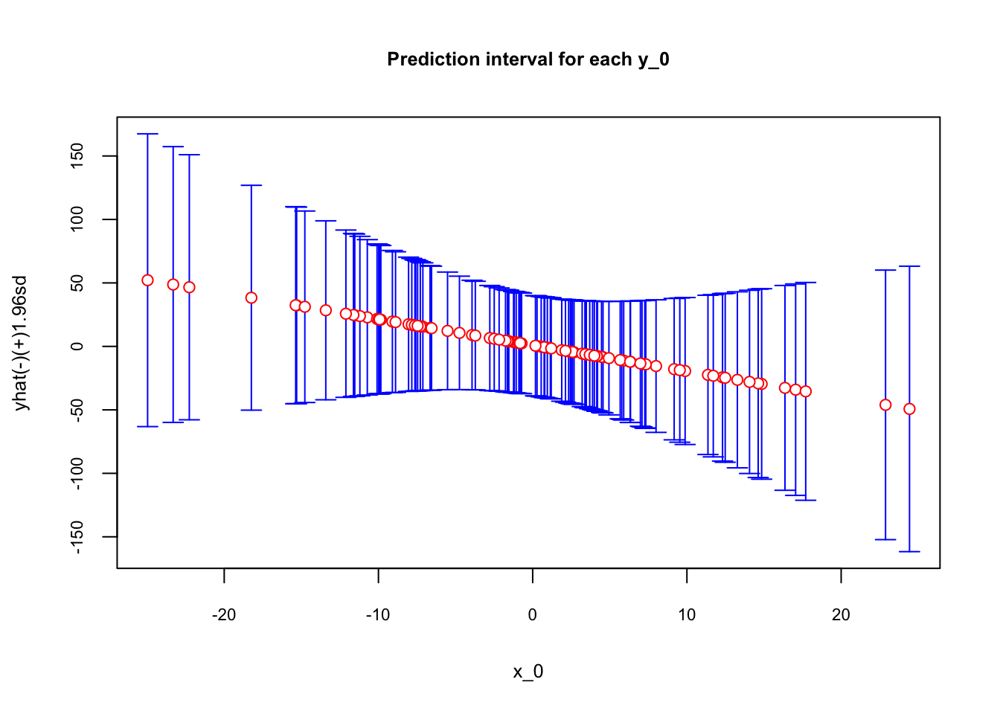

# Prediction Intervals

When we look back how we built our estimation and prediction simulations, we can see one thing:  we had withdrawn 2000 samples and applied our estimators and predictors to each sample.  More specifically, we had 2000 estimates from the estimator $\bar{X}$ and 2000 predictions by $\hat{f}$. Hence, we have a sampling uncertainty that is captured by the variance of the distribution of estimates, which is also known as the sampling distribution.  

Sampling distributions are probability distributions that provide the set of possible values for the estimates and will inform us of how appropriately our current estimator is able to explain the population data.  And if the estimator is BLUE of $\mu_x$, the sampling distribution of $\bar{X}$ can be defined as $\bar{X}\sim \mathcal{T}\left(\mu, S^{2}\right)$ where $S$ is the standard deviation of the sample and $\mathcal{T}$ is the Student's $t$-distribution.  This concept is the key point in inferential statistics as it helps us build the interval estimation of the true parameter, $\mu_x$.  The variation of $\bar{X}$ from sample to sample is important as it makes the interval wider or narrower.

Similar to estimation, we make predictions in each sample by the best $\hat{f}$.  Since each sample is a random pick from the population, the prediction would be different from sample to sample. Unlike estimations, however, we allow bias in predictors in exchange with a reduction in variance, which captures the variation of predictions across samples.  Although it was easy to calculate the variance of our predictions across samples with simulations, in practice, we have only one sample to calculate our prediction.  While we can consider developing a theoretical concept similar to sampling distribution to have an **interval prediction**,  since we allow a variance-bias trade-off in predictions, it would not be as simple as before to develop a confidence interval around our predictions.  This is one of the drawbacks in machine learning and the subject of the recent research. [One of the posts](https://forecasting.svetunkov.ru/en/2019/10/18/how-confident-are-you-assessing-the-uncertainty-in-forecasting/) from Ivan Svetunkov (the builder of R package **smooth()**) describes the situation: (...)*capturing the uncertainty is a difficult task, and there is still a lot of things that can be done in terms of model formulation and estimation. But at least, when applying models on real data, we can have an idea about their performance in terms of the uncertainty captured*(...) [@Svetunkov_2019].

It is tempting to come to an idea that, when we are able to use an unbiased **estimator** as a **predictor**, perhaps due to an insignificant difference between their MSPEs, we may have a more reliable interval prediction, which quantifies the uncertainty in predictions. However, although machine learning predictions are subject to a lack of reliable interval predictions, finding an **unbiased** estimator specifically in regression-based models is not a simple task either. There are many reasons that the condition of unbiasedness, $\mathbf{E}(\hat{\theta})=\theta$, may be easily violated. Reverse causality, simultaneity, endogeneity, unobserved heterogeneity, selection bias, model misspecification, measurement errors in covariates are some of the well-known and very common reasons for biased estimations in the empirical world and the major challenges in the field of econometrics today. 

This section will summarize the forecast error, **F**, and the prediction interval when we use an **unbiased estimator** as a predictor.  Here is the definition of forecast error, which is the difference between $x_0$ and the predicted $\hat{x}_0$ in our case:


$$
F=x_0-\hat{x}_0=\mu_x+\varepsilon_0-\bar{X}
$$
  
If we construct a standard normal variable from $F$:  

$$
z= \frac{F-\mathbf{E}[F]}{\sqrt{\mathbf{Var}(F)}}=\frac{F}{\sqrt{\mathbf{Var}(F)}}=\frac{x_0-\hat{x}_0}{\sqrt{\mathbf{Var}(F)}}\sim N(0,1)
$$
  
where $\mathbf{E}[F]=0$ because $\mathbf{E}[\bar{X}]=\mu_x$ and $\mathbf{E}[\varepsilon]=0$.  

We know that approximately 95% observations of any standard normal variable can be between $\pm{1.96}\mathbf{sd}$ Since the standard deviation is 1:  

$$
\mathbf{Pr} = (-1.96 \leqslant z \leqslant 1.96) = 0.95.
$$
Or,  

$$
\mathbf{Pr} = \left(-1.96 \leqslant \frac{x_0-\hat{x}_0}{\mathbf{sd}(F)} \leqslant 1.96\right) = 0.95.
$$
  
With a simple algebra this becomes,  

$$
\mathbf{Pr} \left(\hat{x}_0-1.96\mathbf{sd}(F) \leqslant x_0 \leqslant \hat{x}_0+1.96\mathbf{sd}(F)\right) = 0.95.
$$
  
This is called a 95% **confidence interval** or **prediction interval** for $x_0$.  We need to calculate $\mathbf{sd}(F)$. We have derived it before, but let's repeat it here again:  

$$
\mathbf{Var}(F) = \mathbf{Var}\left(\mu_x+\varepsilon_0-\bar{X}\right)=\mathbf{Var}\left(\mu_x\right)+\mathbf{Var}\left(\varepsilon_0\right)+\mathbf{Var}\left(\bar{X}\right)\\ = \mathbf{Var}\left(\varepsilon_0\right)+\mathbf{Var}\left(\bar{X}\right)\\=\sigma^2+\mathbf{Var}\left(\bar{X}\right)
$$
  
What's $\mathbf{Var}(\bar{X})$? With the assumption of i.i.d.  

$$
\mathbf{Var}(\bar{X}) = \mathbf{Var}\left(\frac{1}{n}\sum_{i=1}^{n} x_{i}\right) =\frac{1}{n^2} \sum_{i=1}^{n}\mathbf{Var}(x_{i})=\frac{1}{n^2} \sum_{i=1}^{n}\sigma^2=\frac{1}{n^2} n\sigma^2=\frac{\sigma^2}{n}.
$$
  
We do not know $\sigma^2$ but we can approximate it by $\hat{\sigma}^2$, which is the variance of the sample.  

$$
\mathbf{Var}(\bar{X}) = \frac{\hat{\sigma}^2}{n}~~\Rightarrow~~ \mathbf{se}(\bar{X}) = \frac{\hat{\sigma}}{\sqrt{n}}
$$
  
Note that the terms, standard deviation and standard error, often lead to confusion about their interchangeability. We use the term standard error for the sampling distribution (standard error of the mean - SEM): the standard error measures how far the sample mean is likely to be from the population mean. Whereas the standard deviation of the sample (population) is the degree to which individuals within the sample (population) differ from the sample (population) mean.  

Now we can get $\mathbf{sd}(F)$:  

$$
\mathbf{sd}(F) =\hat{\sigma}+\frac{\hat{\sigma}}{\sqrt{n}}=\hat{\sigma}\left(1+\frac{1}{\sqrt{n}}\right)
$$
  
Therefore, $\mathbf{se}(\bar{X})$ changes from sample to sample, as $\hat{\sigma}$ will be different in each sample.  As we discussed earlier, when we use $\hat{\sigma}$ we should use $t$-distribution, instead of standard normal distribution.  Although they have the same critical vaules for 95% intervals, which is closed to 1.96 when the sample size larger than 100, we usually use critical $t$-values for the interval estimations.  

Note that when $\mathbf{E}[\bar{X}]\neq\mu_x$ the whole process of building a prediction interval collapses at the beginning.  Moreover, confidence or prediction intervals require data that must follow a normal distribution.  If the sample size is large enough (more than 35, roughly) the central limit theorem makes sure that the sampling distribution would be normal regardless of how the population is distributed.  In our example, since our sample sizes 3, the CLT does not hold.  Let's have a more realistic case in which we have a large population and multiple samples with $n=100$.


```r
# Better example
set.seed(123)
popx <- floor(rnorm(10000, 10, 2))
summary(popx)
```

```
##    Min. 1st Qu.  Median    Mean 3rd Qu.    Max. 
##    2.00    8.00    9.00    9.49   11.00   17.00
```

```r
samples <- matrix(0, 1000, 200)
set.seed(1)
for (i in 1:nrow(samples)) {
  samples[i,] <- sample(popx, ncol(samples), replace = TRUE)
}
head(samples[, 1:10])
```

```
##      [,1] [,2] [,3] [,4] [,5] [,6] [,7] [,8] [,9] [,10]
## [1,]   10   10    9   10    8    9   11    8   13    10
## [2,]   11   13    5   11    6    9    9    9   10     9
## [3,]   12   12   11    9    7    7    5   10    9     6
## [4,]    9    8   12    8   10   11    8    8   10    10
## [5,]   15    9   10   10   10   10   10   11    9     7
## [6,]    8    9   11    9   10   10   10   13   11    15
```

```r
hist(rowMeans(samples), breaks = 20, cex.main=0.8,
     cex.lab = 0.8, main = "Histogram of X_bar's",
     xlab = "X_bar")
```


```r
summary(rowMeans(samples))
```

```
##    Min. 1st Qu.  Median    Mean 3rd Qu.    Max. 
##   9.005   9.390   9.485   9.486   9.581   9.940
```

```r
mean(popx)
```

```
## [1] 9.4895
```

As you can see, the sampling distribution of $\bar{X}$ is almost normal ranging from 9 to 9.94 with mean 9.486.  We can see also that it's an unbiased estimator of $\mu_x$.  

When we use $\bar{X}$ from a sample to predict $x$, we can quantify the uncertainty in this prediction by building a 95% confidence interval.  Let's use sample 201 to show the interval.


```r
# Our sample
sample_0 <- samples[201,]
mean(sample_0)
```

```
## [1] 9.35
```

```r
# sd(F)
sdF <- sqrt(var(sample_0))*(1+1/sqrt(length(sample_0))) 

upper <- mean(sample_0) + 1.96*sdF
lower <- mean(sample_0) - 1.96*sdF
c(lower, upper)
```

```
## [1]  5.387422 13.312578
```
  
The range of this 95% prediction interval quantifies the prediction accuracy when we use 9.35 as a predictor, which implies that the value of a randomly picked $x$ from the same population could be predicted to be between those numbers.  When we change the sample, the interval changes due to differences in the mean and the variance of the sample.


## Prediction interval for unbiased OLS predictor 

We will end this chapter by setting up a confidence interval for predictions made by an unbiased $\hat{f}(x)$.  We follow the same steps as in section 4.  Note that the definition of the forecast error,  

$$
F=y_0-\hat{f}(x_0)=f(x_0)+\varepsilon_0-\hat{f}(x_0),
$$

is the base in MSPE. We will have here a simple textbook example to identify some important elements in prediction interval. Our model is, 

$$
y_{i}=\beta_0+\beta_1 x_{1i}+\varepsilon_{i}, ~~~~ i=1, \ldots, n
$$
  
where $\varepsilon_{i} \sim N\left(0, \sigma^{2}\right)$, $\mathbf{Cov}\left(\varepsilon_{i}, \varepsilon_{j}\right)=0$ for $i\neq j$.  We can write this function as  

$$
y_{i}=f(x_i)+\varepsilon_{i}, ~~~~ i=1, \ldots, n
$$

Based on a sample and the assumption about DGM, we choose an estimator of $f(x)$,  

$$
\hat{f}(x) = \hat{\beta}_0+\hat{\beta}_1 x_{1i},
$$
  
which is BLUE of $f(x)$, when it is estimated with OLS given the assumptions about $\varepsilon_i$ stated above.  Then the forecast error is  

$$
F=y_0-\hat{f}(x_0)=\beta_0+\beta_1 x_{0}+\varepsilon_{0}-\hat{\beta}_0+\hat{\beta}_1 x_{0},
$$

Since our $\hat{f}(x)$ is an unbiased estimator of $f(x)$, $\mathbf{E}(F)=0$.  And, given that $\varepsilon_{0}$ is independent of $\hat{\beta}_0$ and $\hat{\beta}_1$ and $\beta_0$ as well as $\beta_1 x_{0}$ are non-stochastic (i.e. they have variance zero), then  

$$
\mathbf{Var}(F)=\mathbf{Var}\left(\varepsilon_{0}\right)+\mathbf{Var}\left(\hat{\beta_0}+\hat{\beta_1} x_{0}\right),
$$

which is  

$$
\mathbf{Var}(F)=\sigma^{2}+\mathbf{Var}(\hat{\beta}_0)+x_{0}^{2} \mathbf{Var}(\hat{\beta}_1)+2 x_{0} \mathbf{Cov}(\hat{\beta}_0, \hat{\beta}_1).
$$
More specifically,  

$$
\mathbf{Var}(F)=\sigma^{2}+\sigma^{2}\left(\frac{1}{n}+\frac{\bar{x}^{2}}{\sum\left(x_{i}-\bar{x}\right)^{2}}\right)+x_{0}^{2}\left( \frac{\sigma^{2}}{\sum\left(x_{i}-\bar{x}\right)^{2}}\right)-2 x_{0}\left( \sigma^{2} \frac{\bar{x}}{\sum\left(x_{i}-\bar{x}\right)^{2}}\right).
$$
   
After simplifying it, we get the textbook expression of the forecast variance:  

$$
\mathbf{Var}(F)=\sigma^{2}\left(1+\frac{1}{n}+\frac{\left(x_{0}-\bar{x}\right)^{2}}{\sum\left(x_{i}-\bar{x}\right)^{2}}\right)
$$

We have seen it before: as the noise in the data ($\sigma^2$) goes up, the variance increases.  More importantly, as $x_0$ moves away from $\bar{x}$,  $\mathbf{Var}(F)$ rises further.  Intuitively, rare incidence in data should have less uncertainty in predicting the outcome.  The rarity of $x_0$ will be quantified by $x_0-\bar{x}$ and the uncertainty in prediction is captured by $\mathbf{Var}(F)$.   

Finally, using the fact that $\varepsilon$ is normally distributed, with $\mathbf{E}(F)=0$, we just found that $F \sim  N(0, \mathbf{Var}(F))$. Hence, the 95% prediction interval for $n>100$ will approximately be:  

$$
\mathbf{Pr} \left(\hat{f}_0-1.96\mathbf{sd}(F) \leqslant y_0 \leqslant \hat{f}_0+1.96\mathbf{sd}(F)\right) = 0.95.
$$

When we replace $\sigma^2$ with $\hat{\sigma}^2$, $F$ will have a Student's $t$ distribution and the critical values (1.96) will be different specially if $n<100$.  Since this interval is for $x_0$, we can have a range of $x$ and have a nice plot showing the conficence interval around the point predictions for each $x$.

Let's have a simulation with a simple one-variable regression to see the uncertainty in prediction.  We need one sample and one out-sample dataset for prediction.


```r
# Getting one-sample.
set.seed(123)
x_1 <- rnorm(100, 0, 1) 
f <- 1 - 2*x_1 # DGM
y <- f + rnorm(100, 0, 1)
inn <- data.frame(y, x_1)

# Getting out-of-sample data points.
set.seed(321)
x_1 <- rnorm(100, 0, 10) # sd =10 to see the prediction of outlier X's
f <- 1 - 2*x_1 # DGM
y <- f + rnorm(100, 0, 1) 
out <- data.frame(y, x_1)

# OLS
ols <- lm(y~., inn)
yhat <- predict(ols, out)

# Let's have a Variance(f) function
# since variance is not fixed and changes by x_0

v <- function(xzero){
  n <- nrow(inn)
  sigma2_hat <- sum((inn$y -yhat)^2)/(n-2) #we replace it with sample variance
  num= (xzero-mean(inn$x_1))^2
  denom = sum((inn$x_1-mean(inn$x_1))^2)
  var <- sigma2_hat*(1 + 1/n + num/denom)
  x0 <- xzero
  outcome <- c(var, x0)
  return(outcome)
}

varF <- matrix(0, nrow(out), 2)
for (i in 1:nrow(out)) {
  varF[i, ] <- v(out$x_1[i])
}

data <- data.frame("sd" = c(sqrt(varF[,1])), "x0" = varF[,2], "yhat" = yhat,
                   "upper" = c(yhat + 1.96*sqrt(varF[,1])),
                    "lower" = c(yhat - 1.96*sqrt(varF[,1])))

require(plotrix)
plotCI(data$x0, data$yhat , ui=data$upper,
       li=data$lower, pch=21, pt.bg=par("bg"), scol = "blue", col="red",
       main = "Prediction interval for each y_0", ylab="yhat(-)(+)1.96sd",
       xlab="x_0", cex.main = 0.8, cex.lab = 0.8, cex.axis = 0.7)
```



As the $x_0$ moves away from the mean, which is zero in our simulation, the prediction uncertainty captured by the range of confidence intervals becomes larger.  


  
