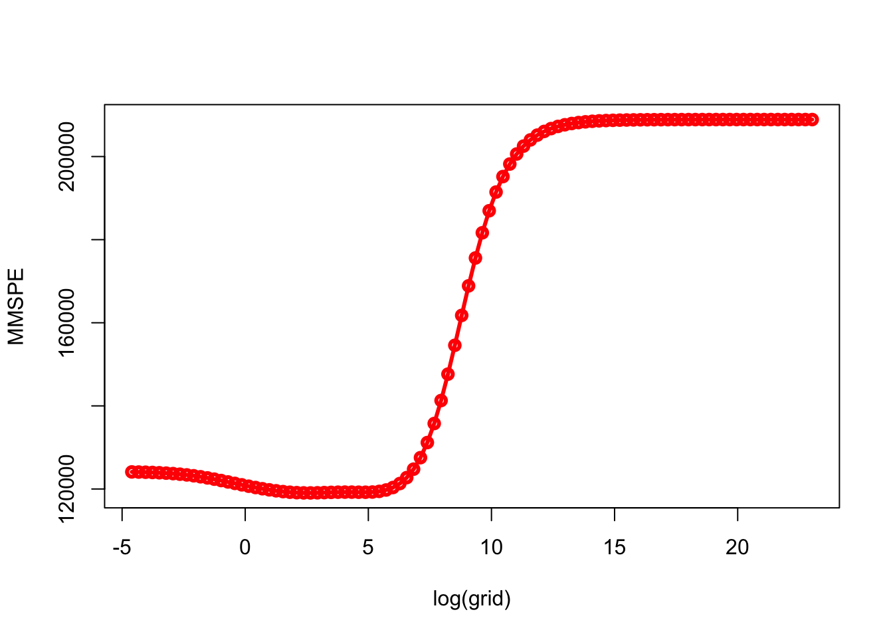
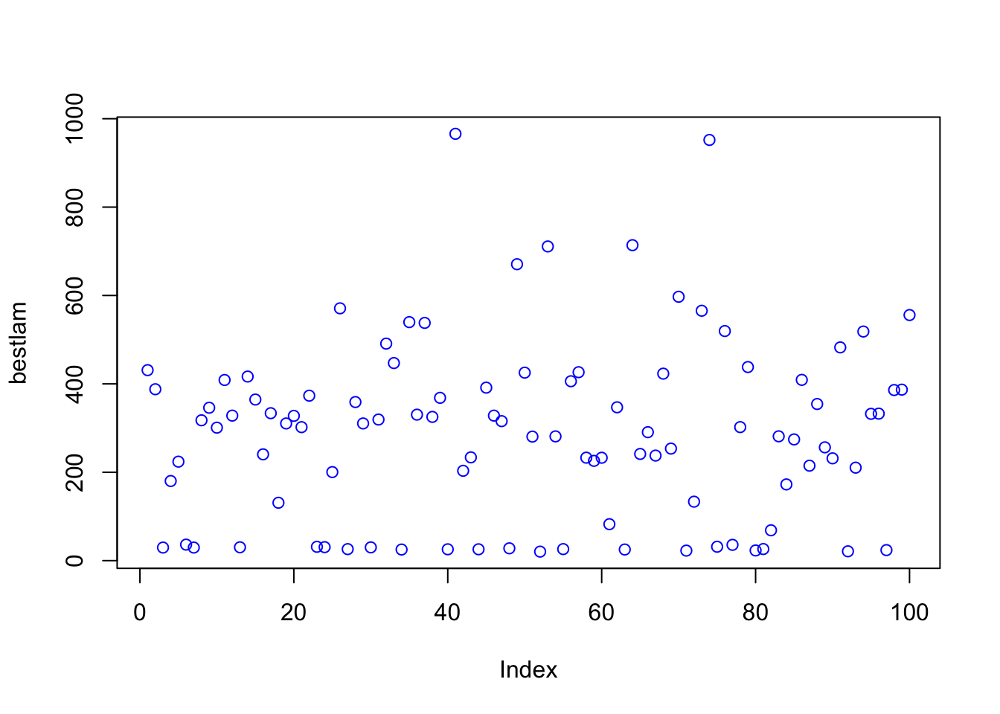
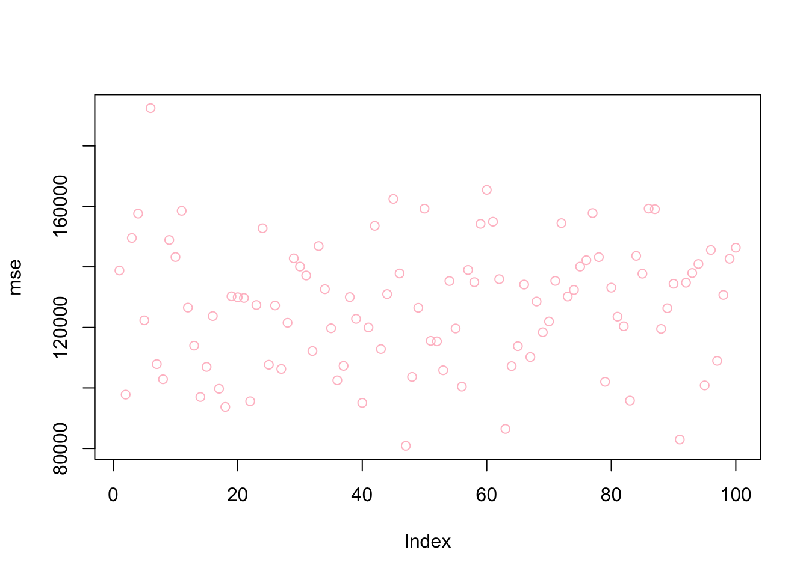

# Shrinkage Models

In simple regression or classification problems, we cannot train a parametric model in a way that the fitted model minimizes the out-of-sample prediction error.  We could (and did) fit the parametric models **manually** by adding or removing predictors and their interactions and polynomials.  As we have seen in earlier chapters, by dropping a variable in a regression, for example, it is possible to reduce the variance at the cost of a negligible increase in bias.  
  
In fitting the predictive model, some of the variables used in a regression may not be well associated with the response. Keeping those "irrelevant" variables often leads to unnecessary complexity in the resulting model. Regularization or penalization is an alternative and automated fitting procedure that refers to a process that removes irrelevant variables or shrinks the magnitude of their parameters, which can yield better prediction accuracy and model interpretability by preventing overfitting.

There are several types of regularization techniques that can be used in parametric models.  Each of these techniques adds a different type of penalty term to the objective function and can be used in different situations depending on the characteristics of the data and the desired properties of the model.  Two methods, Ridge and Lasso, are two of well-known benchmark techniques that reduce the model complexity and prevent overfitting resulting from simple linear regression. 

The general principle in penalization can be shown as 

$$
\widehat{m}_\lambda(\boldsymbol{x})=\operatorname{argmin}\left\{\sum_{i=1}^n \underbrace{\mathcal{L}\left(y_i, m(\boldsymbol{x})\right)}_{\text {loss function }}+\underbrace{\lambda\|m\|_{\ell_q}}_{\text {penalization }}\right\}
$$

where $\mathcal{L}$ could be conditional mean, quantiles, expectiles, $m$ could be linear, logit, splines, tree-based models, neural networks.  The penalization,  $\ell_q$, could be lasso ($\ell_1$) or ridge ($\ell_2$).  And, $\lambda$ regulates overfitting that can be determined by cross-validation or other methods.  It puts a price to pay for a having more flexible model:
  
- $\lambda\rightarrow0$: it interpolates data, low bias, high variance
- $\lambda\rightarrow\infty$: linear model high bias, low variance

There are two fundamental goals in statistical learning: achieving a high prediction accuracy and identifying relevant predictors. The second objective, variable selection, is particularly important when there is a true sparsity in the underlying model. By their nature, penalized parametric models are not well-performing tools for prediction.  But, they provide important tools for model selection specially when $p>N$ and the true model is sparse.  This section starts with two major models in regularized regressions, Ridge and Lasso, and develops an idea on sparse statistical modelling with Adaptive Lasso.

Although there are many sources on the subject, perhaps the most fundamental one is [Statistical Learning with Sparsity](https://hastie.su.domains/StatLearnSparsity/) by Hastie et al. (2015).

## Ridge

The least squares fitting procedure is that one estimates $\beta_{0}, \beta_{1}, \ldots, \beta_{p}$ that minimize the residual sum of squares:

$$
\mathrm{RSS}=\sum_{i=1}^{n}\left(y_{i}-\beta_{0}-\sum_{j=1}^{p} \beta_{j} x_{i j}\right)^{2}
$$
Ridge regression is very similar to least squares, except that the coefficients are estimated by minimizing a slightly different quantity.

$$
\sum_{i=1}^{n}\left(y_{i}-\beta_{0}-\sum_{j=1}^{p} \beta_{j} x_{i j}\right)^{2}+\lambda \sum_{j=1}^{p} \beta_{j}^{2} =\mathrm{RSS}+\lambda \sum_{j=1}^{p} \beta_{j}^{2},
$$

where $\lambda$ is the hyperparameter that can be tuned by cross-validation and grid search.  The last term, $\lambda \sum_{j} \beta_{j}^{2}$, is a constraint, which is also called shrinkage penalty.  This type of penalty is called as $\ell_{2}$ (L-2 penalty).  As with Ordinary Least Squares (OLS), this cost function tries to minimize RSS but also penalizes the size of the coefficients.

More specifically,
  
$$
\hat{\beta}_\lambda^{\text {ridge }}=\operatorname{argmin}\left\{\left\|\mathbf{y}-\left(\beta_0+\mathbf{X} \beta\right)\right\|_{\ell_2}^2+\lambda\|\beta\|_{\ell_2}^2\right\},
$$
  
which has the solution:
  
$$
\hat{\beta}_\lambda=\left(\mathbf{X}^{\top} \mathbf{X}+\lambda \mathbf{I}\right)^{-1} \mathbf{X}^{\top} \mathbf{y}
$$
  
where,

- If $\lambda \rightarrow 0, \quad \hat{\beta}_0^{\text {ridge }}=\hat{\beta}^{\text {ols }}$, 
- If $\lambda \rightarrow \infty, \quad \hat{\beta}_{\infty}^{\text {ridge }}=\mathbf{0}$.  


The hyperparameter $\lambda$ controls the relative impact of the penalization on the regression coefficient estimates. When $\lambda = 0$, the cost function becomes RSS (residual sum of squares), that is the cost function of OLS and the estimations, produce the least squares estimates. However, as $\lambda$ gets higher, the impact of the shrinkage penalty grows, and the coefficients of the ridge regression will approach zero. Note that, the shrinkage penalty is applied to slope coefficients not to the intercept, which is simply the mean of the response, when all features are zero.

Let's apply this to the same data we used earlier, `Hitters` from the [ISLR](http://faculty.marshall.usc.edu/gareth-james/ISL/) [@ISLR_2021] package:


```r
library(ISLR)

remove(list = ls())

data(Hitters)
df <- Hitters[complete.cases(Hitters$Salary), ]
```

We will use the `glmnet` package to fit a ridge regression. The generic function in `glmnet` is defined by 

$$
\min _{\beta_0, \beta} \frac{1}{N} \sum_{i=1}^N w_i l\left(y_i, \beta_0+\beta^T x_i\right)+\lambda\left[(1-\alpha)\|\beta\|_2^2 / 2+\alpha\|\beta\|_1\right] \text {, }
$$
where $l\left(y_i, \eta_i\right)$ is the negative log-likelihood contribution for observation $i$ and $\alpha$ is the elastic net penalty.   When $\alpha=1$ ( the default), the penalty term becomes $\ell_{1}$ and the resulting model is called lasso regression (least absolute shrinkage and selection operator).  When $\alpha=1$, the penalty term becomes $\ell_{2}$ and the resulting model is called ridge regression (some authors use the term Tikhonov–Phillips regularization). As before, the tuning parameter $\lambda$ controls the overall strength of the penalty.  Since the penalty shrinks the coefficients of correlated variables (in Ridge) or pick one of them and discard the others (in Lasso), the variables are supposed to be standardized, which is done by `glmnet`.

The `glmnet` function has a slightly different syntax from other model-fitting functions that we have used so far in this book (`y ~ X`). Therefore, before we execute the syntax, we have the prepare the model so that `X` will be a matrix and `y` will be a vector.  The matrix `X` has to be prepared before we proceed, which must be free of `NA`s.


```r
X  <- model.matrix(Salary ~ ., df)[, -1]
y <- df$Salary
```

The `glmnet` package is maintained by Trevor Hastie who provides a friendly [vignette](https://glmnet.stanford.edu/articles/glmnet.html) [@Hastie_glmnet].  They describe the importance of `model.matrix()` in `glmnet` as follows:

> (...)particularly useful for creating $x$; not only does it produce a matrix corresponding to the 19 predictors but it also automatically transforms any qualitative variables into dummy variables. The latter property is important because `glmnet()` can only take numerical, quantitative inputs.
>

Here is the example for a ridge regression:


```r
library(glmnet)
grid = 10 ^ seq(10,-2, length = 100)
model <- glmnet(X, y, alpha = 0, lambda = grid)
```

Although we defined the grid, we did not do a grid search explicitly by cross validation. Moreover, we do not need to select a grid.  By default, the `glmnet()` function performs ridge regression for an automatically selected range of $\lambda$ values.  It ranges from the null model - only intercept when $\lambda$ is at the upper bound and the least squares fit when the $\lambda$ is at lower bound.
  
The application above is to show that we can also choose to implement the function over a grid of values.  Further, the `glmnet()` function standardizes the variables so that they are on the same scale. To turn off this default setting, we use the argument `standardize=FALSE`.  

The methods here, ridge and lasso, are parametric models.  Unlike non-parametric methods, each model is defined by a set of parameters or, as in our case, coefficients.  Therefore, when we do a grid search, each value of the hyperparameter ($\lambda$) is associated with one model defined by a set of coefficients.  In order to see the coefficients we need to apply another function, `coef()`.  Remember, we have 100 $\lambda's$.  Hence, `coef()` produces a 20 x 100 matrix, with 20 rows (one for each predictor, plus an intercept) and 100 columns (one for each value of $\lambda$).  


```r
dim(coef(model))
```

```
## [1]  20 100
```

```r
model$lambda[c(20, 80)]
```

```
## [1] 4.977024e+07 2.656088e+00
```

```r
coef(model)[, c(20, 80)]
```

```
## 20 x 2 sparse Matrix of class "dgCMatrix"
##                       s19          s79
## (Intercept)  5.358880e+02  156.6073700
## AtBat        1.093664e-05   -1.7526436
## Hits         3.967221e-05    6.1739859
## HmRun        1.598556e-04    1.3285278
## Runs         6.708833e-05   -0.7689372
## RBI          7.086606e-05   -0.1297830
## Walks        8.340541e-05    5.5357165
## Years        3.410894e-04   -9.2923000
## CAtBat       9.390097e-07   -0.0792321
## CHits        3.455823e-06    0.2132942
## CHmRun       2.606160e-05    0.6557328
## CRuns        6.933126e-06    0.8349167
## CRBI         7.155123e-06    0.4090719
## CWalks       7.570013e-06   -0.6623253
## LeagueN     -1.164983e-04   62.0427219
## DivisionW   -1.568625e-03 -121.5286522
## PutOuts      4.380543e-06    0.2809457
## Assists      7.154972e-07    0.3124435
## Errors      -3.336588e-06   -3.6852362
## NewLeagueN  -2.312257e-05  -27.9849755
```

As we see, the coefficient estimates are much smaller when a large value of $\lambda$ is used.
  
We generally use the `predict()` function as before.  But, here we can also use it to estimate the ridge regression coefficients for a new value of $\lambda$.  Hence, if we don't want to rely on the internal grid search provided by `glmnet()`, we can do our own grid search by `predict()`.  This is an example when $\lambda = 50$, which wasn't in the grid.    


```r
predict(model, s = 50, type = "coefficients")
```

```
## 20 x 1 sparse Matrix of class "dgCMatrix"
##                        s1
## (Intercept)  4.876610e+01
## AtBat       -3.580999e-01
## Hits         1.969359e+00
## HmRun       -1.278248e+00
## Runs         1.145892e+00
## RBI          8.038292e-01
## Walks        2.716186e+00
## Years       -6.218319e+00
## CAtBat       5.447837e-03
## CHits        1.064895e-01
## CHmRun       6.244860e-01
## CRuns        2.214985e-01
## CRBI         2.186914e-01
## CWalks      -1.500245e-01
## LeagueN      4.592589e+01
## DivisionW   -1.182011e+02
## PutOuts      2.502322e-01
## Assists      1.215665e-01
## Errors      -3.278600e+00
## NewLeagueN  -9.496680e+00
```
  
There are two ways that we can train ridge (and Lasso):
  
- We use our own training algorithm; 
- Or, we rely on `'glmnet` internal cross-validation process. 

Here is an example for our own algorithm for training ridge regression:   
  

```r
grid = 10^seq(10, -2, length = 100)

MSPE <- c()
MMSPE <- c()

for(i in 1:length(grid)){
  for(j in 1:100){
    set.seed(j)
    ind <- unique(sample(nrow(df), nrow(df), replace = TRUE))
    
    train <- df[ind, ]
    xtrain <- model.matrix(Salary~., train)[,-1]
    ytrain <- df[ind, "Salary"]
    
    test <- df[-ind, ]
    xtest <- model.matrix(Salary~., test)[,-1]
    ytest <- df[-ind, "Salary"]
  
    model <- glmnet(xtrain, ytrain, alpha = 0, lambda = grid[i], thresh = 1e-12)
    yhat <- predict(model, s = grid[i], newx = xtest)
    MSPE[j] <- mean((yhat - ytest)^2)
    }
  MMSPE[i] <- mean(MSPE)
}

min(MMSPE)
```

```
## [1] 119058.3
```

```r
grid[which.min(MMSPE)]
```

```
## [1] 14.17474
```

```r
plot(log(grid), MMSPE, type = "o", col = "red", lwd = 3)
```



What is the tuned model using the last training set with this $\lambda$?  


```r
lambda <- grid[which.min(MMSPE)]
coeff <- predict(model, s = lambda , type = "coefficients", newx = xtrain)
coeff
```

```
## 20 x 1 sparse Matrix of class "dgCMatrix"
##                        s1
## (Intercept)  285.78834247
## AtBat         -1.27240085
## Hits           2.06931134
## HmRun          0.04319066
## Runs           2.75588969
## RBI            0.45631590
## Walks          3.46189297
## Years         -8.82528502
## CAtBat        -0.26127780
## CHits          1.28540111
## CHmRun         1.31904979
## CRuns          0.05880843
## CRBI          -0.05103190
## CWalks        -0.34003983
## LeagueN      131.98795986
## DivisionW   -119.25402540
## PutOuts        0.19785230
## Assists        0.64820842
## Errors        -6.97397640
## NewLeagueN   -54.55149894
```

We may want to compare the ridge with a simple OLS:


```r
MSPE <- c()

for (j in 1:100) {
  set.seed(j)
  ind <- unique(sample(nrow(df), nrow(df), replace = TRUE))
  train <- df[ind,]
  test <- df[-ind, ]
  
  model <- lm(Salary ~ ., data = train)
  yhat <- predict(model, newdata = test)
  MSPE[j] <- mean((yhat - test$Salary) ^ 2)
}
mean(MSPE)
```

```
## [1] 124217.3
```

```r
summary(model)
```

```
## 
## Call:
## lm(formula = Salary ~ ., data = train)
## 
## Residuals:
##     Min      1Q  Median      3Q     Max 
## -715.51 -187.40  -32.85  148.29 1686.38 
## 
## Coefficients:
##               Estimate Std. Error t value Pr(>|t|)  
## (Intercept)  285.95478  126.06479   2.268   0.0248 *
## AtBat         -1.26497    0.94674  -1.336   0.1837  
## Hits           2.02174    3.61275   0.560   0.5766  
## HmRun         -0.01383    8.03787  -0.002   0.9986  
## Runs           2.79786    4.23051   0.661   0.5095  
## RBI            0.47768    3.56888   0.134   0.8937  
## Walks          3.44099    2.57671   1.335   0.1839  
## Years         -8.76533   17.25334  -0.508   0.6122  
## CAtBat        -0.26610    0.20435  -1.302   0.1950  
## CHits          1.31361    1.09982   1.194   0.2343  
## CHmRun         1.35851    2.30018   0.591   0.5557  
## CRuns          0.04142    1.02393   0.040   0.9678  
## CRBI          -0.06982    1.08722  -0.064   0.9489  
## CWalks        -0.33312    0.45479  -0.732   0.4651  
## LeagueN      132.36961  113.39037   1.167   0.2450  
## DivisionW   -119.16837   56.96453  -2.092   0.0382 *
## PutOuts        0.19795    0.10911   1.814   0.0718 .
## Assists        0.64902    0.29986   2.164   0.0321 *
## Errors        -6.97871    5.97011  -1.169   0.2444  
## NewLeagueN   -54.96821  111.81338  -0.492   0.6238  
## ---
## Signif. codes:  0 '***' 0.001 '**' 0.01 '*' 0.05 '.' 0.1 ' ' 1
## 
## Residual standard error: 335.6 on 140 degrees of freedom
## Multiple R-squared:  0.4428,	Adjusted R-squared:  0.3672 
## F-statistic: 5.856 on 19 and 140 DF,  p-value: 1.346e-10
```
  
The second way is to rely on the `glmnet` internal training process, `cv.glmnet`, which is the main function to do cross-validation along with various supporting methods such as plotting and prediction.  A part of the following scripts follows the same algorithm as the one in the book ([Introduction to Statistical Learning](https://www.statlearning.com) - ISLR p.254).  This approach uses a specific grid on $\lambda$.  We also run the same grid search 100 times to see the associated uncertainty.     


```r
# With a defined grid on lambda
bestlam <- c()
mse <- c()
grid = 10 ^ seq(10, -2, length = 100)

for(i in 1:100){
  set.seed(i)
  train <- sample(1:nrow(X), nrow(X) * 0.5) # 50% split
  test <- c(-train)
  ytest <- y[test]

  #finding lambda
  cv.out <- cv.glmnet(X[train,], y[train], alpha = 0)
  bestlam[i] <- cv.out$lambda.min

  #Predicting with that lambda
  ridge.mod <- glmnet(X[train,], y[train], alpha = 0,
                      lambda = grid, thresh = 1e-12)
  yhat <- predict(ridge.mod, s = bestlam[i], newx = X[test,])
  mse[i] <- mean((yhat - ytest)^2)
}

mean(bestlam)
```

```
## [1] 290.227
```

```r
mean(mse)
```

```
## [1] 127472.6
```

```r
plot(bestlam, col = "blue")
```



```r
plot(mse, col = "pink")
```



Now the same application without a specific grid:  


```r
bestlam <- c()
mse <- c()

# Without a pre-defined grid on lambda
for(i in 1:100){
  set.seed(i)
  train <- sample(1:nrow(X), nrow(X) * 0.5) # arbitrary split
  test <- c(-train)
  ytest <- y[test]
  
  cv.out <- cv.glmnet(X[train,], y[train], alpha = 0)
  yhat <- predict(cv.out, s = "lambda.min", newx = X[test,])
  mse[i] <- mean((yhat - ytest) ^ 2)
}

mean(mse)
```

```
## [1] 127481.6
```

```r
plot(mse, col = "pink")
```


Ridge regression adds a penalty term that is the sum of the squares of the coefficients of the features in the model. This results in a penalty that is continuous and differentiable, which makes Ridge regression easy to optimize using gradient descent. Ridge regression can be useful when we have a large number of features but we still want to keep all of the features in the model. Ridge regression works best in situations where the least squares estimates have high variance.

On the other hand, Lasso (Least Absolute Shrinkage and Selection Operator) adds a penalty term that is the sum of the absolute values of the coefficients in the model. This results in a penalty that is non-differentiable, which makes it more difficult to optimize using gradient descent. However, Lasso has the advantage of being able to set the coefficients of some features to exactly zero, effectively eliminating those features from the model. This can be useful when we have a large number of features, and we want to select a subset of the most important features to include in the model.

## Lasso

The penalty in ridge regression, $\lambda \sum_{j} \beta_{j}^{2}$, will shrink all of the coefficients towards zero, but it will not set any of them exactly to zero.  This may present a problem in model interpretation when the number of variables is quite large.  One of the key advantages of Lasso is that it can set the coefficients of some features to exactly zero, effectively eliminating those features from the model.
  
By eliminating unnecessary or redundant features from the model, Lasso can help to improve the interpretability and simplicity of the model. This can be particularly useful when you have a large number of features and you want to identify the most important ones for predicting the target variable.

The lasso, a relatively recent alternative to ridge regression, minimizes the following quantity:

\begin{equation}
\sum_{i=1}^{n}\left(y_{i}-\beta_{0}-\sum_{j=1}^{p} \beta_{j} x_{i j}\right)^{2}+\lambda \sum_{j=1}^{p}\left|\beta_{j}\right|=\operatorname{RSS}+\lambda \sum_{j=1}^{p}\left|\beta_{j}\right|
  (\#eq:16-1)
\end{equation} 

The lasso also shrinks the coefficient estimates towards zero. However, the $\ell_{1}$ penalty, the second term of equation 18.1, has the effect of forcing some of the coefficient estimates to be exactly equal to zero when the tuning parameter $\lambda$ is sufficiently large.  Hence, the lasso performs variable selection. As a result, models generated from the lasso are generally much easier to interpret than those produced by ridge regression.  

In general, one might expect lasso to perform better in a setting where a relatively small number of predictors have substantial coefficients and the remaining predictors have no significant effect on the outcome. This property is known as "sparsity", because it results in a model with a relatively small number of non-zero coefficients.  In some cases, Lasso can find a true sparsity pattern in the data by identifying a small subset of the most important features that are sufficient to accurately predict the target variable.

Now, we apply lasso to the same data, `Hitters`.  Again, we will follow a similar way to compare ridge and lasso as in [Introduction to Statistical Learning](https://www.statlearning.com) (ISLR).    


```r
library(glmnet)
library(ISLR)
remove(list = ls())

data(Hitters)
df <- Hitters[complete.cases(Hitters$Salary), ]
X  <- model.matrix(Salary ~ ., df)[,-1]
y <- df$Salary

# Without a specific grid on lambda
set.seed(1)
train <- sample(1:nrow(X), nrow(X) * 0.5)
test <- c(-train)
ytest <- y[test]

# Ridge
set.seed(1)
ridge.out <- cv.glmnet(X[train,], y[train], alpha = 0)
yhatR <- predict(ridge.out, s = "lambda.min", newx = X[test,])
mse_r <- mean((yhatR - ytest)^2)

# Lasso
set.seed(1)
lasso.out <- cv.glmnet(X[train,], y[train], alpha = 1)
yhatL <- predict(lasso.out, s = "lambda.min", newx = X[test,])
mse_l <- mean((yhatL - ytest) ^ 2)

mse_r
```

```
## [1] 139863.2
```

```r
mse_l
```

```
## [1] 143668.8
```

Now, we will define our own grid search:  


```r
# With a specific grid on lambda + lm()
grid = 10 ^ seq(10, -2, length = 100)

set.seed(1)
train <- sample(1:nrow(X), nrow(X)*0.5)
test <- c(-train)
ytest <- y[test]

#Ridge
ridge.mod <- glmnet(X[train,], y[train], alpha = 0,
                    lambda = grid, thresh = 1e-12)
set.seed(1)
cv.outR <- cv.glmnet(X[train,], y[train], alpha = 0)
bestlamR <- cv.outR$lambda.min
yhatR <- predict(ridge.mod, s = bestlamR, newx = X[test,])
mse_R <- mean((yhatR - ytest) ^ 2)

# Lasso
lasso.mod <- glmnet(X[train,], y[train], alpha = 1,
                    lambda = grid, thresh = 1e-12)
set.seed(1)
cv.outL <- cv.glmnet(X[train,], y[train], alpha = 1)
bestlamL <- cv.outL$lambda.min
yhatL <- predict(lasso.mod, s = bestlamL, newx = X[test,])
mse_L <- mean((yhatL - ytest) ^ 2)

mse_R
```

```
## [1] 139856.6
```

```r
mse_L
```

```
## [1] 143572.1
```

Now, we apply our own algorithm:  


```r
grid = 10 ^ seq(10, -2, length = 100)
MSPE <- c()
MMSPE <- c()

for(i in 1:length(grid)){
  for(j in 1:100){
    set.seed(j)
    ind <- unique(sample(nrow(df), nrow(df), replace = TRUE))
    
    train <- df[ind, ]
    xtrain <- model.matrix(Salary ~ ., train)[,-1]
    ytrain <- df[ind, 19]
    
    test <- df[-ind, ]
    xtest <- model.matrix(Salary~., test)[,-1]
    ytest <- df[-ind, 19]
  
    model <- glmnet(xtrain, ytrain, alpha = 1,
                    lambda = grid[i], thresh = 1e-12)
    yhat <- predict(model, s = grid[i], newx = xtest)
    MSPE[j] <- mean((yhat - ytest) ^ 2)
    }
  MMSPE[i] <- mean(MSPE)
}

min(MMSPE)
```

```
## [1] 119855.1
```

```r
grid[which.min(MMSPE)]
```

```
## [1] 2.656088
```

```r
plot(log(grid), MMSPE, type="o", col = "red", lwd = 3)
```


What are the coefficients?


```r
coef_lasso <- coef(model, s=grid[which.min(MMSPE)], nonzero = T)
coef_lasso
```

```
## 20 x 1 sparse Matrix of class "dgCMatrix"
##                        s1
## (Intercept)  285.73172897
## AtBat         -1.26603002
## Hits           2.04074005
## HmRun          0.02355750
## Runs           2.77938363
## RBI            0.45867292
## Walks          3.44852914
## Years         -8.78839869
## CAtBat        -0.26343169
## CHits          1.29690477
## CHmRun         1.32913790
## CRuns          0.05007662
## CRBI          -0.05515544
## CWalks        -0.33624685
## LeagueN      132.06438132
## DivisionW   -119.26618910
## PutOuts        0.19772257
## Assists        0.64809649
## Errors        -6.97381705
## NewLeagueN   -54.62728800
```

We can also try a classification problem with LPM or Logistic regression when the response is categorical. If there are two possible outcomes, we use the binomial distribution, else we use the multinomial.

## Adaptive Lasso

Adaptive lasso is a method for regularization and variable selection in regression analysis that was introduced by Zou (2006) in [The Adaptive Lasso and Its Oracle Properties](http://users.stat.umn.edu/~zouxx019/Papers/adalasso.pdf). In this paper, the author proposed the use of a weighted $\ell_{1}$ penalty in the objective function, with the weights chosen to adapt to the correlation structure of the data. He showed that this method can result in a more stable model with fewer coefficients being exactly zero, compared to the standard lasso method which uses a simple $\ell_{1}$ penalty. 

Since its introduction, adaptive lasso has been widely used in a variety of applications in statistical modeling and machine learning. It has been applied to problems such as feature selections in genomic data, high-dimensional regressions, and model selections with generalized linear models.  Adaptive lasso is useful in situations where the predictors are correlated and there is a need to select a small subset of important variables to include in the model. It has been shown that adaptive lasso is an oracle efficient estimator (consistency in variable selection and asymptotic normality in coefficient estimation), while the plain lasso is not.
  
Consider the linear regression model:

$$
y_i=x_i^{\prime} \beta+\epsilon_i, ~~~~i=1, \ldots, n ~~~~\text{and} ~~~~\beta \text { is } (p \times 1)
$$
The adaptive Lasso estimates $\beta$ by minimizing
  
$$
L(\beta)=\sum_{i=1}^n\left(y_i-x_i^{\prime} \beta\right)^2+\lambda_n \sum_{j=1}^p \frac{1}{w_j}\left|\beta_j\right|
$$
  
where, typically $w_j=(\left|\hat{\beta}_{O L S_j}\right|)^{\gamma}$ or $w_j=(\left|\hat{\beta}_{Ridge_j}\right|)^{\gamma}$, where $\gamma$ is a positive constant for adjustment of the Adaptive Weights vector, and suggested to be the possible values of 0.5, 1, and 2.

The weights in adaptive lasso (AL) provides a prior "intelligence" about variables such that,while the plain Lasso penalizes all parameters equally, the adaptive Lasso is likely to penalize non-zero coefficients less than the zero ones. This is because the weights can be obtained from the consistent least squares estimator. If $\beta_{AL, j}=0$, then $\hat{\beta}_{O L S, j}$ is likely to be close to zero leading to a very small $w_j$. Hence, truly zero coefficients are penalized a lot.  Calculating the weights in adaptive lasso requires a two-step procedure

Here is an example where we use the ridge weight in adaptive lasso:  


```r
library(ISLR)
library(glmnet)

remove(list = ls())

data(Hitters)
df <- Hitters[complete.cases(Hitters$Salary), ]
X  <- model.matrix(Salary~., df)[,-1]
y <- df$Salary

# Ridge weights with gamma = 1
g = 1
set.seed(1)
modelr <- cv.glmnet(X, y, alpha = 0)
coefr <- as.matrix(coef(modelr, s = modelr$lambda.min))
w.r <- 1/(abs(coefr[-1,]))^g

## Adaptive Lasso
set.seed(1)
alasso <- cv.glmnet(X, y, alpha=1, penalty.factor = w.r)

## Lasso
set.seed(1)
lasso <- cv.glmnet(X, y, alpha=1)

# Sparsity
cbind(LASSO = coef(lasso, s="lambda.1se"),
           ALASSO = coef(alasso, s="lambda.1se"))
```

```
## 20 x 2 sparse Matrix of class "dgCMatrix"
##                       s1          s1
## (Intercept) 127.95694754   -7.109481
## AtBat         .             .       
## Hits          1.42342566    2.054867
## HmRun         .             .       
## Runs          .             .       
## RBI           .             .       
## Walks         1.58214111    3.573120
## Years         .            31.573334
## CAtBat        .             .       
## CHits         .             .       
## CHmRun        .             .       
## CRuns         0.16027975    .       
## CRBI          0.33667715    .       
## CWalks        .             .       
## LeagueN       .            29.811080
## DivisionW    -8.06171262 -138.088953
## PutOuts       0.08393604    .       
## Assists       .             .       
## Errors        .             .       
## NewLeagueN    .             .
```

We can see the difference between lasso and adaptive lasso in this example: `PutOuts`, `CRuns`, and `CRBI` picked by lasso are not selected by adaptive lasso. There are only three common features in both methods: `Hits`, `Walks`, and `DivisionW`. To understand which model is better in terms of catching the true sparsity, we will have a simulation to illustrate some of the properties of the Lasso and the adaptive Lasso.

## Sparsity

This is a simulation to illustrate some of the properties of Lasso-type estimations. There are two objectives in using these penalized regressions: model selection (identifying "correct" sparsity) and prediction accuracy.  These two objectives require different optimization approaches and usually are not compatible. In model selection, the objective is to shrink the dimension of the model to the “true” sparsity. This is usually evaluated by checking whether the Oracle properties are satisfied.  These asymptotic properties look at (1) if the model identified by the penalized regression converges to the “true” sparsity, (2) if the coefficients are consistent.

The literature suggests that Lasso is not an oracle estimator. Adaptive Lasso was developed (Zou 2006) to fill this gap.

Let's specify a data generating process with a linear regression model:

$$
y_i=x_i^{\prime} \beta+u_i, ~~~~~i=1, \ldots, n
$$

where $\beta$ is $p \times 1$. First, we consider the case where $p<n$ then move to the case where $p \geq n$.  We define $\beta=(1,1,0,0)^{\prime}$ and $n=100$.


```r
#This function generates the data
dgp <- function(N, Beta) {
  p = length(Beta)
  
  X <- matrix(rnorm(N * p), ncol = p)
  u <- matrix(rnorm(N), ncol = 1)
  dgm <- X %*% Beta
  y <- X %*% Beta + u
  
  return <- list(y, X)
}

N = 100
Beta = c(1, 1, 0, 0)

set.seed(148)
Output <- dgp(N, Beta)
y <- Output[[1]]
X <- Output[[2]]
```

First, we apply lasso


```r
library(glmnet)

set.seed(432)
lasso <- glmnet(x = X, y = y, family = "gaussian")

beta_hat <- lasso$beta
S_matrix <- cbind(t(beta_hat), "lambda" = lasso$lambda)
S_matrix[c(1:8, 25:30, 55:60), ] # selected rows
```

```
## 20 x 5 sparse Matrix of class "dgCMatrix"
##             V1        V2          V3         V4      lambda
## s0  .          .          .          .          1.083220708
## s1  0.09439841 0.0283513  .          .          0.986990366
## s2  0.17344129 0.1097255  .          .          0.899308862
## s3  0.24546220 0.1838706  .          .          0.819416741
## s4  0.31108496 0.2514289  .          .          0.746622016
## s5  0.37087798 0.3129855  .          .          0.680294174
## s6  0.42535915 0.3690736  .          .          0.619858715
## s7  0.47500037 0.4201789  .          .          0.564792175
## s24 0.87944075 0.8365481  .          .          0.116150206
## s25 0.88874261 0.8461243  .          .          0.105831742
## s26 0.89685610 0.8542117 -0.00686322 .          0.096429941
## s27 0.90418482 0.8614679 -0.01432988 .          0.087863371
## s28 0.91086250 0.8680794 -0.02113323 .          0.080057832
## s29 0.91694695 0.8741036 -0.02733218 .          0.072945714
## s54 0.98352129 0.9289175 -0.09282009 0.05192379 0.007126869
## s55 0.98423271 0.9294382 -0.09350608 0.05278151 0.006493738
## s56 0.98488092 0.9299126 -0.09413113 0.05356303 0.005916852
## s57 0.98547155 0.9303449 -0.09470066 0.05427512 0.005391215
## s58 0.98600972 0.9307388 -0.09521958 0.05492395 0.004912274
## s59 0.98650007 0.9310977 -0.09569241 0.05551515 0.004475881
```
  
Which set of beta_hat should we select?  To answer this question we need to find the lambda.  We need $\lambda_n \rightarrow \infty$ in order to shrink the truly zero coefficients to zero. This requires $\lambda_n$ to be sufficiently large. This would introduce asymptotic bias to the non-zero coefficients. 
  
In practice, choosing $\lambda_n$ by $\mathrm{BIC}$ (Bayesian Information Criterion) results in a consistent model selection in the fixed $p$ setting. That is, let $\mathcal{A}=\left\{j: \beta_{0, j} \neq 0\right\}$,  active set or relevant variables,
  
$$
P\left(\hat{\mathcal{A}}_{\lambda_{BIC}}=\mathcal{A}\right) \rightarrow 1
$$

Thus, let $S S E_\lambda$ be the sum of squared error terms for a given value of $\lambda$ and $n z_\lambda$ be the number of non-zero coefficients. Then, it can be shown that
  
$$
B I C_\lambda=\log \left(S S E_\lambda\right)+\frac{\log (n)}{n} n z_\lambda
$$


```r
# Predict yhat for each of 61 lambda (s)
y_hat = predict(lasso, newx = X)
dim(y_hat)
```

```
## [1] 100  60
```

```r
# SSE for each lambda (s)
SSE <- c()
for (i in 1:ncol(y_hat)) {
  SSE_each <- sum((y_hat[, i] - y[, 1]) ^ (2))
  SSE <- c(SSE, SSE_each)
}

# BIC
nz <- colSums(beta_hat != 0) # Number of non-zero coefficients for each lambda
BIC <- log(SSE) + (log(N) / N) * nz # BIC
BIC
```

```
##       s0       s1       s2       s3       s4       s5       s6       s7 
## 5.598919 5.595359 5.468287 5.348947 5.237755 5.135013 5.040883 4.955387 
##       s8       s9      s10      s11      s12      s13      s14      s15 
## 4.878394 4.809638 4.748729 4.695181 4.648437 4.607898 4.572946 4.542971 
##      s16      s17      s18      s19      s20      s21      s22      s23 
## 4.517383 4.495631 4.477205 4.461646 4.448541 4.437530 4.428295 4.420563 
##      s24      s25      s26      s27      s28      s29      s30      s31 
## 4.414098 4.408698 4.448661 4.443309 4.438844 4.435121 4.432021 4.429439 
##      s32      s33      s34      s35      s36      s37      s38      s39 
## 4.427290 4.425503 4.424017 4.468004 4.466218 4.464732 4.463498 4.462471 
##      s40      s41      s42      s43      s44      s45      s46      s47 
## 4.461618 4.460910 4.460321 4.459832 4.459426 4.459088 4.458808 4.458575 
##      s48      s49      s50      s51      s52      s53      s54      s55 
## 4.458382 4.458222 4.458088 4.457978 4.457886 4.457810 4.457746 4.457694 
##      s56      s57      s58      s59 
## 4.457650 4.457614 4.457584 4.457559
```
  
And, the selected model that has the minimum BIC


```r
beta_lasso <- beta_hat[, which(BIC == min(BIC))]
beta_lasso
```

```
##        V1        V2        V3        V4 
## 0.8887426 0.8461243 0.0000000 0.0000000
```

This is the `beta_hat` that identifies the true sparsity. And, the second Oracle property, the $\ell_2$ error:


```r
l_2 <- sqrt(sum((beta_lasso - Beta) ^ 2))
l_2
```

```
## [1] 0.189884
```

Here we will create a simulation that will report two Oracle Properties for Lasso and Adaptive Lasso:

- True sparsity,  
- $\ell_2$  error.  

**Lasso**
  
We first have a function, `msc()`, that executes a simulation with all the steps shown before:


```r
mcs <- function(mc, N, Beta) {
  mcmat <- matrix(0, nrow = mc, ncol = 3)
  beta_lasso_mat <- matrix(0, nr = mc, nc = length(Beta))
  
  for (i in 1:mc) {
    set.seed(i)
    data <- dgp(N, Beta)
    y <- data[[1]]
    X <- data[[2]]
    
    set.seed(i)
    lasso <- glmnet(x = X, y = y, family = "gaussian")
    beta_hat <- lasso$beta    # beta_hat is a matrix
    y_hat = predict(lasso, newx = X)
    
    SSE <- c()
    for (j in 1:ncol(y_hat)) {
      SSE_each <- sum((y_hat[, j] - y[, 1]) ^ (2))
      SSE <- c(SSE, SSE_each)
    }
    
    nz <- colSums(beta_hat != 0)
    BIC <- log(SSE) + (log(N) / N) * nz
    beta_lasso <- beta_hat[, which(BIC == min(BIC))]
    nonz_beta = length(Beta[Beta == 0])
    nonz_beta_hat = length(beta_lasso[beta_lasso == 0])
    
    mcmat[i, 1] <- sqrt(sum((beta_lasso - Beta) ^ 2))
    mcmat[i, 2] <- ifelse(nonz_beta != nonz_beta_hat, 0, 1)
    mcmat[i, 3] <- sum(beta_lasso != 0)
    beta_lasso_mat[i, ] <- beta_lasso
  }
  return(list(mcmat, beta_lasso_mat))
}
```

We are ready for simulation:


```r
mc <- 500
N <- 1000
Beta <- matrix(c(1, 1, 0, 0), nc = 1)
output <- mcs(mc, N, Beta) #see the function

MC_betas = output[[2]]
MC_performance = output[[1]]

sum(MC_performance[, 2]) #how many times lasso finds true sparsity
```

```
## [1] 400
```

This is the first property: lasso identifies the true sparsity $400/500 = 80\%$ of cases. And the second property, $\ell_2$ error, in the simulation is (in total):  


```r
sum(MC_performance[, 1])
```

```
## [1] 29.41841
```

**Adaptive Lasso**
  
This time we let our adaptive lasso use lasso coefficients as penalty weights in `glmnet()`.   Let's have the same function with Adaptive Lasso for the simulation:


```r
# Adaptive LASSO
mcsA <- function(mc, N, Beta) {
  mcmat <- matrix(0, nr = mc, nc = 3)
  beta_lasso_mat <- matrix(0, nr = mc, nc = length(Beta))
  
  for (i in 1:mc) {
    data <- dgp(N, Beta)
    y <- data[[1]]
    X <- data[[2]]
    
    lasso <- glmnet(x = X, y = y, family = "gaussian")
    beta_hat <- lasso$beta
    
    y_hat = predict(lasso, newx = X)
    
    SSE <- c()
    for (j in 1:ncol(y_hat)) {
      SSE_each <- sum((y_hat[, j] - y[, 1]) ^ (2))
      SSE <- c(SSE, SSE_each)
    }
    
    nz <- colSums(beta_hat != 0)
    BIC <- log(SSE) + (log(N) / N) * nz
    beta_lasso <- beta_hat[, which(BIC == min(BIC))]
    
    weights = abs(beta_lasso) ^ (-1)
    weights[beta_lasso == 0] = 10 ^ 10 # to handle inf's
    
    #Now Adaptive Lasso
    lasso <-
      glmnet(
        x = X,
        y = y,
        family = "gaussian",
        penalty.factor = weights
      )
    beta_hat <- lasso$beta
    
    y_hat = predict(lasso, newx = X)
    
    SSE <- c()
    for (j in 1:ncol(y_hat)) {
      SSE_each <- sum((y_hat[, j] - y[, 1]) ^ (2))
      SSE <- c(SSE, SSE_each)
    }
    
    nz <- colSums(beta_hat != 0)
    BIC <- log(SSE) + (log(N) / N) * nz
    beta_lasso <- beta_hat[, which(BIC == min(BIC))]
    nonz_beta = length(Beta[Beta == 0])
    nonz_beta_hat = length(beta_lasso[beta_lasso == 0])
    
    mcmat[i, 1] <- sqrt(sum((beta_lasso - Beta) ^ 2))
    mcmat[i, 2] <- ifelse(nonz_beta != nonz_beta_hat, 0, 1)
    mcmat[i, 3] <- sum(beta_lasso != 0)
    beta_lasso_mat[i, ] <- beta_lasso
  }
  return(list(mcmat, beta_lasso_mat))
}
```

Here are the results for adaptive lasso:  


```r
mc <- 500
N <- 1000
beta <- matrix(c(1, 1, 0, 0), nc = 1)
output <- mcsA(mc, N, beta) #see the function

MC_betas = output[[2]]
MC_performance = output[[1]]

sum(MC_performance[, 2])
```

```
## [1] 492
```

And,


```r
sum(MC_performance[,1])
```

```
## [1] 20.21311
```

The simulation results clearly show that Adaptive Lasso is an Oracle estimator and a better choice for sparsity applications.
  
We saw here a basic application of adaptive lasso, which has several different variations in practice, such as Thresholded Lasso and Rigorous Lasso.  Model selections with lasso has been an active research area.  One of the well-known applications is the double-selection lasso linear regression method that can be used for variable selections.  Moreover, lasso type applications are also used in time-series forecasting and graphical network analysis for dimension reductions. 


