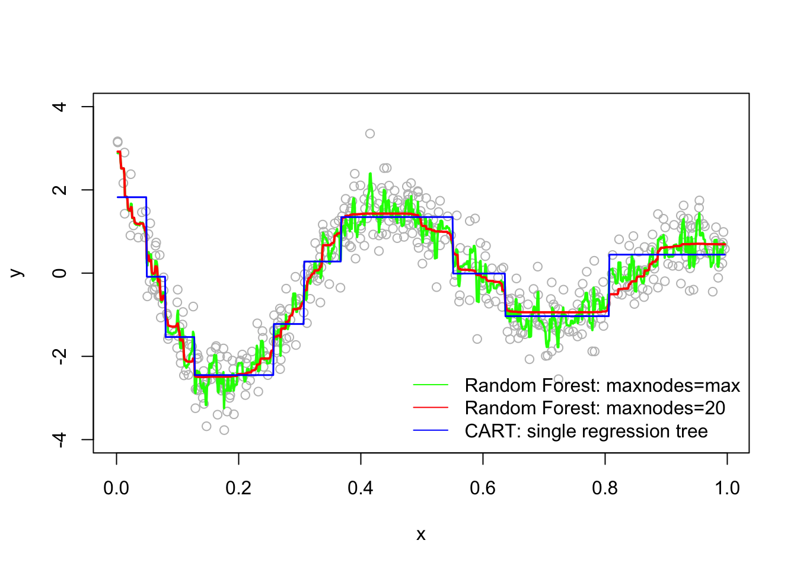
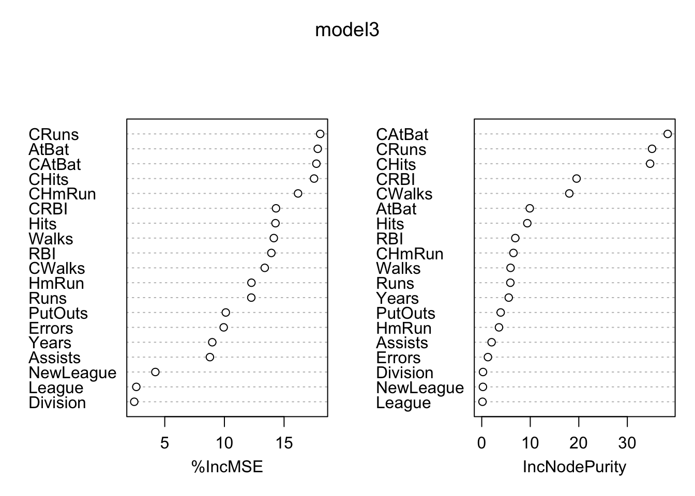

# Ensemble Methods

Bagging, random forests and, boosting methods are the main methods of ensemble learning - a machine learning method where multiple models are trained to solve the same problem.  The main idea is that, instead of using all features (predictors) in one complex base model running on the whole data, we combine multiple models each using selected number of features and subsections of the data. With this, we can have a more robust learning system.
  
What inspires ensemble learning is the idea of the “wisdom of crowds”.  It suggests that "many are smarter than the few" so that collective decision-making of a diverse and larger group of individuals is better than that of a single expert. When we use a single robust model, poor predictors would be eliminated in the training procedure.  Although each poor predictor has a very small contribution in training, their combination would be significant.  Ensemble learning systems help these poor predictors have their "voice" in the training process by **keeping them in the system rather than eliminating them**.  That is the main reason why ensemble methods represent robust learning algorithms in machine learning.  

## Bagging

Bagging gets its name from **B**ootstrap **agg**regat**ing** of trees.  The idea is simple: we train many trees each of which use a separate bootstrapped sample then aggregate them to one tree for the final decision. It works with few steps:

1. Select number of trees (B), and the tree depth (D),
2. Create a loop (B) times,
3. In each loop, (a) generate a bootstrap sample from the original data; (b) estimate a tree of depth D on that sample.  

Let's see an example with the titanic dataset:  


```r
library(PASWR)
library(rpart)
library(rpart.plot)
data(titanic3)

# This is for a set of colors in each tree
clr = c("pink","red","blue","yellow","darkgreen",
        "orange","brown","purple","darkblue")

n = nrow(titanic3)
par(mfrow=c(3,3))

for(i in 1:9){  # Here B = 9
  set.seed(i*2)
  idx = sample(n, n, replace = TRUE) #Bootstrap sampling with replacement
  tr <- titanic3[idx,]
  cart =  rpart(survived~sex+age+pclass+sibsp+parch,
                cp = 0, data = tr, method = "class") #unpruned
  prp(cart, type=1, extra=1, box.col=clr[i])
}
```


  
What are we going to do with these 9 trees? 
  
In regression trees, the prediction will be the **average of the resulting predictions**.  In classification trees, we **take a majority vote**. 
  
Since averaging a set of observations by bootstrapping reduces the variance, the prediction accuracy increases.  More importantly, compared to CART, the results would be much less sensitive to the original sample.  As a result, they show impressive improvement in accuracy.  

Below, we have an algorithm that follows the steps for bagging in classification. Let's start with a single tree and see how we can improve it with bagging:


```r
library(ROCR)

#test/train split
set.seed(1)
ind <- sample(nrow(titanic3), nrow(titanic3) * 0.8)
train <- titanic3[ind, ]
test <- titanic3[-ind, ]

#Single tree
cart <-  rpart(survived ~ sex + age + pclass + sibsp + parch,
                data = train, method = "class") #Pruned
phat1 <- predict(cart, test, type = "prob") 

#AUC
pred_rocr <- prediction(phat1[,2], test$survived)
auc_ROCR <- performance(pred_rocr, measure = "auc")
auc_ROCR@y.values[[1]]
```

```
## [1] 0.8352739
```

Now, we apply bagging:


```r
B = 100 # number of trees

phat2 <- matrix(0, B, nrow(test))

# Loops
for(i in 1:B){  
  set.seed(i) # to make it reproducible
  idx <- sample(nrow(train), nrow(train), replace = TRUE)
  dt <- train[idx, ]
 
  cart_B <- rpart(survived ~ sex + age + pclass + sibsp + parch,
                cp = 0, data = dt, method = "class") # unpruned
  phat2[i,] <- predict(cart_B, test, type = "prob")[, 2]
}

dim(phat2)
```

```
## [1] 100 262
```

You can see in that `phat2` is a $100 \times 262$ matrix.  Each column is representing the predicted probability that `survived` = 1. We have 100 trees (rows in `phat2`) and 100 predicted probabilities for each the observation in the test data.  The only job we will have now to take the average of 100 predicted probabilities for each column.
  

```r
# Take the average
phat_f <- colMeans(phat2)

#AUC
pred_rocr <- prediction(phat_f, test$survived)
auc_ROCR <- performance(pred_rocr, measure = "auc")
auc_ROCR@y.values[[1]]
```

```
## [1] 0.8765668
```

Hence, we have a slight improvement over a single tree. We can see how the number of trees (B) would cumulatively increases AUC (reduces MSPE in regressions).   

```r
B = 300 

phat3 <- matrix(0, B, nrow(test))
AUC <- c()

for (i in 1:B) {
  set.seed(i) 
  idx <- sample(nrow(train), nrow(train), replace = TRUE)
  dt <- train[idx,]
  
  fit <- rpart(
    survived ~ sex + age + pclass + sibsp + parch,
    cp = 0,
    data = dt,
    method = "class"
  )
  
  phat3[i, ] <- predict(fit, test, type = "prob")[, 2]
  
  phat_f <- colMeans(phat3)
  
  #AUC
  pred_rocr <- prediction(phat_f, test$survived)
  auc_ROCR <- performance(pred_rocr, measure = "auc")
  AUC[i] <- auc_ROCR@y.values[[1]]
}

plot(AUC, type = "l", col = "red",
     xlab = "B - Number of trees",
     lwd = 2)
```


As it is clear from the plot that, when we use a large value of B, the AUC (or error in regression) becomes stable.  Therefore, we do not need to tune the number of trees with bagging. Using a value of B sufficiently large would suffice.

The main idea behind bagging is to reduce the variance in prediction.  The reason for this reduction is simple: we take the mean prediction of all bootstrapped samples.  Remember, when we use a simple tree and make 500 bootstrapping validations, each one of them gives a different MSPE (in regressions) or AUC (in classification).  The difference now is that we average `yhat` in regressions or `phat` in classifications (or `yhat` with majority voting).  This reduces the prediction uncertainty drastically. 

Bagging works very well for high-variance base learners, such as decision trees or kNN.  If the learner is stable, bagging adds little to the model's performance. This brings us to another and improved ensemble method, random forests.   

## Random Forest

**Random Forest = Bagging + subsample of covariates at each node**.  We have done the first part before.   Random forests algorithm produces many single trees based on randomly selected a subset of observations and features. Since the algorithm leads to many single trees (like a forest) with a sufficient variation, the averaging them provides relatively a smooth and, more importantly, better predictive power than a single tree. Random forests and regression trees are particularly effective in settings with a large number of features that are correlated each other. The splits will generally ignore those covariates, and as a result, the performance will remain strong even in settings with many features.

We will use the Breiman and Cutler's [Random Forests for Classification and Regression](https://www.stat.berkeley.edu/~breiman/RandomForests/cc_home.htm): `randomForest()`[@Brei_2004].

Here are the steps and the loop structure:  

1. Select number of trees (`ntree`), subsampling parameter (`mtry`), and the tree depth `maxnodes`,
2. Create a loop `ntree` times,
3. In each loop, (a) generate a bootstrap sample from the original data; (b) estimate a tree of depth `maxnodes` on that sample,
4. But, for each split in the tree (this is our second loop), randomly select `mtry` original covariates and do the split among those.  

Hence, bagging is a special case of random forest, with `mtry` = number of features ($P$).
  
As we think on the idea of "subsampling covariates at each node" little bit more, we can see the rationale: suppose there is one very strong covariate in the sample.  Almost all trees will use this covariate in the top split.  All of the trees will look quite similar to each other.  Hence the predictions will be highly correlated.  **Averaging many highly correlated quantities does not lead to a large reduction in variance**.  Random forests **decorrelate** the trees and, thus, further reduces the sensitivity of trees to the data points that are not in the original dataset.

How are we going to pick `mtry`?  In practice, default values are `mtry` = $P/3$ in regression and `mtry` = $\sqrt{P}$ classification. (See `mtry` in `?randomForest`). Note that, with this parameter (`mtry`), we can run a pure bagging model with `randomForest()`, instead of `rpart()`, if we set `mtry` = $P$.  

With the bootstrap resampling process for each tree, random forests have an efficient and reasonable approximation of the test error calculated from out-of-bag (OOB) sets. When bootstrap aggregating is performed, two independent sets are created. One set, the bootstrap sample, is the data chosen to be “in-the-bag” by sampling with replacement. The out-of-bag set is all data not chosen in the sampling process. Hence, there is no need for cross-validation or a separate test set to obtain an unbiased estimate of the prediction error. It is estimated internally as each tree is constructed using a different bootstrap sample from the original data. About one-third of the cases (observations) are left out of the bootstrap sample and not used in the construction of the $k^{th}$ tree. In this way, a test set classification is obtained for each case in about one-third of the trees. In each run, the class is selected when it
gets most of the votes among the OOB cases. The proportion of times that the selected class for the observation is not equal to the true class over all observations in OOB set is called the OOB error estimate. This has proven to be unbiased in many tests.  Note that the forest’s variance decreases as the number of trees grows. Thus, more accurate predictions are likely to be obtained by choosing a large number of trees.

You can think of a random forest model as a robust version of CART models.  There are some default parameters that can be tuned in `randomForest()`.  It is  argued that, however, the problem of overfitting is minor in random forests.

>Segal (2004) demonstrates small gains in performance by controlling the depths of the individual trees grown in random forests. Our experience is that using full-grown trees seldom costs much, and results in one less tuning parameter. Figure 15.8 shows the modest effect of depth control in a simple regression example. (Hastie et al., 2009, p.596)  
>
  
Let's start with a simulation to show random forest and CART models:  


```r
library(randomForest)
# Note that this is actually Bagging since we have only 1 variable

# Our simulated data
set.seed(1)
n = 500
x <- runif(n)
y <- sin(12 * (x + .2)) / (x + .2) + rnorm(n) / 2

# Fitting the models
fit.tree <- rpart(y ~ x) #CART
fit.rf1 <- randomForest(y ~ x) #No depth control
fit.rf2 <- randomForest(y ~ x, maxnodes = 20) # Control it

# Plot observations and predicted values
z <- seq(min(x), max(x), length.out = 1000)
par(mfrow = c(1, 1))
plot(x, y, col = "gray", ylim = c(-4, 4))
lines(z,
      predict(fit.rf1, data.frame(x = z)),
      col = "green",
      lwd = 2)
lines(z,
      predict(fit.rf2, data.frame(x = z)),
      col = "red",
      lwd = 2)
lines(z,
      predict(fit.tree, data.frame(x = z)),
      col = "blue",
      lwd = 1.5)
legend("bottomright",
  c("Random Forest: maxnodes=max",
    "Random Forest: maxnodes=20",
    "CART: single regression tree"),
  col = c("green", "red", "blue"),
  lty = c(1, 1, 1),
  bty = "n"
)
```



The random forest models are definitely improvements over CART, but which one is better?  Although random forest models should not overfit when increasing the number of trees (`ntree`) in the forest, in practice `maxnodes` and `mtry` are used as hyperparameters in the field. 

Let's use out-of-bag (OOB) MSE to tune Random Forest parameters in our case to see if there is any improvement.  


```r
maxnode <- c(10, 50, 100, 500)
for (i in 1:length(maxnode)) {
  a <- randomForest(y ~ x, maxnodes = maxnode[i])
  print(c(maxnode[i], a$mse[500]))
}
```

```
## [1] 10.0000000  0.3878058
## [1] 50.000000  0.335875
## [1] 100.0000000   0.3592119
## [1] 500.0000000   0.3905135
```

```r
# Increase ntree = 1500
maxnode <- c(10, 50, 100, 500)
for (i in 1:length(maxnode)) {
  a <- randomForest(y ~ x, maxnodes = maxnode[i], ntree = 2500)
  print(c(maxnode[i], a$mse[500]))
}
```

```
## [1] 10.000000  0.391755
## [1] 50.0000000  0.3353198
## [1] 100.0000000   0.3616621
## [1] 500.0000000   0.3900982
```

We can see that OOB-MSE is smaller with `maxnodes` = 50 even when we increase `ntree` = 1500 . Of course we can have a finer sequence of `maxnodes` series to test.  Similarly, we can select parameter `mtry` with a grid search.  In a bagged model we set `mtry` = $P$.  If we don't set it, the default values for `mtry` are square-root of $p$ for classification and $p/3$ in regression, where $p$ is number of features.  If we want, we can tune both parameters with cross-validation.  The effectiveness of tuning random forest models in improving their prediction accuracy is an open question in practice.  

Bagging and random forest models tend to work well for problems where there are important nonlinearities and interactions.  More importantly, **they are robust to the original sample** and more efficient than single trees.  However, **the results would be less intuitive and difficult to interpret**. Nevertheless, we can obtain an overall summary of the importance of each covariates using SSR (for regression) or Gini index (for classification).  The index records the total amount that the SSR or Gini is decreased due to splits over a given covariate, averaged over all `ntree` trees.  


```r
rf <-
  randomForest(
    as.factor(survived) ~ sex + age + pclass + sibsp + parch,
    data = titanic3,
    na.action = na.omit,
    localImp = TRUE,
  )

plot(rf, main = "Learning curve of the forest")
legend(
  "topright",
  c(
    "Error for 'Survived'",
    "Misclassification error",
    "Error for 'Dead'"
  ),
  lty = c(1, 1, 1),
  col = c("green", "black", "red")
)
```


The plot shows the evolution of out-of-bag errors when the number of trees increases. The learning curves reach to a stable section right after a couple of trees.  With 500 trees, which is the default number, the OOB estimate of our error rate is around 0.2, which can be seen in the basic information concerning our model below


```r
rf
```

```
## 
## Call:
##  randomForest(formula = as.factor(survived) ~ sex + age + pclass +      sibsp + parch, data = titanic3, localImp = TRUE, , na.action = na.omit) 
##                Type of random forest: classification
##                      Number of trees: 500
## No. of variables tried at each split: 2
## 
##         OOB estimate of  error rate: 19.69%
## Confusion matrix:
##     0   1 class.error
## 0 562  57  0.09208401
## 1 149 278  0.34894614
```

We will see a several applications on CART, bagging and Random Forest later in Chapter 14.

## Boosting

Boosting is an ensemble method that combines a set of "weak learners" into a strong learner to improve the prediction accuracy in self-learning algorithms. In boosting, the constructed iteration selects a random sample of data, fits a model, and then train sequentially.  In each sequential model, the algorithm learns from the weaknesses of its predecessor (predictions errors) and tries to compensate for the weaknesses by "boosting" the weak rules from each individual classifier. The first original boosted application was offered in 1990 by Robert Schapire (1990) [@Schapire].^[<https://web.archive.org/web/20121010030839/http://www.cs.princeton.edu/~schapire/papers/strengthofweak.pdf>]

Today, there are many boosting algorithms that are mainly grouped in the following three types:
  
- Gradient descent algorithm,
- AdaBoost algorithm,
- Xtreme gradient descent algorithm,

We will start with a general application to show the idea behind the algorithm using the package `gbm`, [Generalized Boosted Regression Models](https://cran.r-project.org/web/packages/gbm/gbm.pdf)

### Sequential ensemble with `gbm`

Similar to bagging, boosting also combines a large number of decision trees.  However, the trees are grown **sequentially** without bootstrap sampling.  Instead each tree is fit on a modified version of the original dataset, the **error**.
  
In regression trees, for example, each tree is fit to the residuals from the previous tree model so that each iteration is focused on **improving previous errors**.  This process would be very weird for an econometrician. The accepted model building practice in econometrics is that you should have a model that the errors (residuals) should be orthogonal (independent from) to covariates. Here, what we suggest is the opposite of this practice: start with a very low-depth (shallow) model that omits many relevant variables, run a linear regression, get the residuals (prediction errors), and run another regression that explains the residuals with covariates.  This is called **learning from mistakes**.  

Since there is no bootstrapping, this process is open to overfitting problem as it aims to minimize the in-sample prediction error. Hence, we introduce a **hyperparameter** that we can tune the learning process with cross-validation to stop the overfitting and get the best predictive model.
  
This hyperparameter (shrinkage parameter,  also known as the **learning rate** or **step-size reduction**)  limits the size of the errors.  

Let's see the whole process in a simple example inspired by [Freakonometrics](https://freakonometrics.hypotheses.org/52782) [@Hyp_2018]:


```r
# First we will simulate our data
n <- 300
set.seed(1)
x <- sort(runif(n) * 2 * pi)
y <- sin(x) + rnorm(n) / 4
df <- data.frame("x" = x, "y" = y)
plot(df$x, df$y, ylab = "y", xlab = "x", col = "grey")
```


We will "boost" a single regression tree:  

**Step 1**: Fit the model by using in-sample data


```r
# Regression tree with rpart()
fit <- rpart(y ~ x, data = df) # First fit: y~x
yp <- predict(fit) # using in-sample data

# Plot for single regression tree
plot(df$x, df$y, ylab = "y", xlab = "x", col = "grey")
lines(df$x, yp, type = "s", col = "blue", lwd = 3)
```


Now, we will have a loop that will "boost" the model.  What we mean by boosting is that we seek to improve `yhat`, i.e. $\hat{f}(x_i)$, in areas where it does not perform well by fitting trees to the residuals.  

**Step 2**: Find the "error" and introduce a hyperparameter `h`.


```r
h <- 0.1 # shrinkage parameter

# Calculate the prediction error adjusted by h
yr <- df$y - h * yp 

# Add this adjusted prediction error, `yr` to our main data frame,
# which will be our target variable to predict later
df$yr <- yr

# Store the "first" predictions in YP
YP <- h * yp 
```

Note that if `h`= 1, it would give us usual "residuals".  Hence, `h` controls for "how much error" we would like to reduce.  

**Step 3**: Now, we will predict the "error" in a loop that repeats itself many times.


```r
# Boosting loop for t times (trees)
for (t in 1:100) {
  fit <- rpart(yr ~ x, data = df) # here it's yr~x.
  # We try to understand the prediction error by x's
  
  yp <- predict(fit, newdata = df)
  
  # This is your main prediction added to YP
  YP <- cbind(YP, h * yp) 
  
  df$yr <- df$yr - h * yp # errors for the next iteration
  # i.e. the next target to predict!
}

str(YP)
```

```
##  num [1:300, 1:101] 0.00966 0.00966 0.00966 0.00966 0.00966 ...
##  - attr(*, "dimnames")=List of 2
##   ..$ : chr [1:300] "1" "2" "3" "4" ...
##   ..$ : chr [1:101] "YP" "" "" "" ...
```

Look at `YP` now.  We have a matrix 300 by 101.  This is a matrix of **predicted errors**, except for the first column.  So what?


```r
# Function to plot a single tree and boosted trees for different t
viz <- function(M) {
  # Boosting
  yhat <- apply(YP[, 1:M], 1, sum) # This is predicted y for depth M
  plot(df$x, df$y, ylab = "", xlab = "") # Data points
  lines(df$x, yhat, type = "s", col = "red", lwd = 3) # line for boosting
  
  # Single Tree
  fit <- rpart(y ~ x, data = df) # Single regression tree
  yp <- predict(fit, newdata = df) # prediction for the single tree
  lines(df$x, yp, type = "s", col = "blue", lwd = 3) # line for single tree
  lines(df$x, sin(df$x), lty = 1, col = "black") # Line for DGM
}

# Run each
viz(5)
```


```r
viz(101)
```


Each of 100 trees is given in the `YP` matrix.  **Boosting combines the outputs of many "weak" learners (each tree) to produce a powerful "committee".**  What if we change the shrinkage parameter?  Let's increase it to 1.8.  


```r
h <- 1.8 # shrinkage parameter 
df$yr <- df$y - h*yp # Prediction errors with "h" after rpart
YP <- h*yp  #Store the "first" prediction errors in YP

# Boosting Loop for t (number of trees) times
for(t in 1:100){
  fit <- rpart(yr~x, data=df) # here it's yr~x.  
  yhat <- predict(fit, newdata=df)
  df$yr <- df$yr - h*yhat # errors for the next iteration
  YP <- cbind(YP, h*yhat) # This is your main prediction added to YP 
}

viz(101)
```


It overfits. Unlike random forests, boosting can overfit if the number of trees (B) and depth of each tree (D) are too large.  By averaging over a large number of trees, bagging and random forests reduces variability. Boosting does not average over the trees.  
  
This shows that $h$ should be tuned by a proper process.  The generalized [boosted regression modeling (GBM)](https://cran.r-project.org/web/packages/gbm/vignettes/gbm.pdf) [@Ridgeway_2020] can also be used for boosting regressions.  Note that there are many arguments with their specific default values in the function.  For example, `n.tree` (B) is 100 and `shrinkage` ($h$) is 0.1. The `gbm()` function also has `interaction.depth` (D) specifying the maximum depth of each tree. When it is 1, the model is just an additive model, while 2 implies a model with up to 2-way interactions.  A smaller $h$ typically requires more trees $B$. It allows more and different shaped trees to attack the residuals.  

Here is the application of `gbm` to our simulated data:  


```r
library(gbm)

# Note bag.fraction = 1 (no CV).  The default is 0.5
bo1 <- gbm(y ~ x, distribution = "gaussian", n.tree = 100, data = df,
              shrinkage = 0.1, bag.fraction = 1)

bo2 <- gbm(y ~ x, distribution = "gaussian", data = df) # All default

plot(df$x, df$y, ylab = "", xlab = "") #Data points
lines(df$x, predict(bo1, data = df, n.trees = t), type = "s",
      col = "red", lwd = 3) #line for without CV
lines(df$x, predict(bo2, n.trees = t, data = df), type = "s",
      col = "green", lwd = 3) #line with default parameters with CV
```


We will have more applications with `gbm` in the next chapter.  We can also have a boosting application for classification problems. While the `gbm` function can be used for classification that requires a different distribution ("bernoulli" - logistic regression for 0-1 outcomes), there is a special boosting method for classification problems, AdaBoost.M1, which is what we will look at next.

### AdaBoost

One of the most popular boosting algorithm is **AdaBost.M1**  due to Freund and Schpire (1997).  We consider two-class problem where $y \in\{-1,1\}$, which is a categorical outcome.  With a set of predictor variables $X$, a classifier $\hat{m}_{b}(x)$ at tree $b$ among B trees, produces a prediction taking the two values $\{-1,1\}$.  

To understand how AdaBoost works, let's look at the algorithm step by step:    

1. Select the number of trees B, and the tree depth D;
2. Set initial weights, $w_i=1/n$, for each observation.
3. Fit a classification tree $\hat{m}_{b}(x)$ at $b=1$, the first tree.
3. Calculate the following misclassification error for $b=1$:  

$$
\mathbf{err}_{b=1}=\frac{\sum_{i=1}^{n} \mathbf{I}\left(y_{i} \neq \hat{m}_{b}\left(x_{i}\right)\right)}{n}
$$
  
4. By using this error, calculate  

$$
\alpha_{b}=0.5\log \left(\frac{1-e r r_{b}}{e r r_{b}}\right)
$$
  
For example, suppose $err_b = 0.3$, then $\alpha_{b}=0.5\text{log}(0.7/0.3)$, which is a log odds or $\log (\text{success}/\text{failure})$.   

5. If the observation $i$ is misclassified, update its weights, if not, use $w_i$ which is $1/n$:  

$$
w_{i} \leftarrow w_{i} e^{\alpha_b}
$$
  
Let's try some numbers:  


```r
#Suppose err = 0.2, n=100
n = 100
err = 0.2
alpha <- 0.5 * log((1 - err) / err)
alpha
```

```
## [1] 0.6931472
```

```r
exp(alpha)
```

```
## [1] 2
```

So, the new weight for the misclassified $i$ in the second tree (i.e., $b=2$ stump) will be


```r
# For misclassified observations
weight_miss <- (1 / n) * (exp(alpha))
weight_miss
```

```
## [1] 0.02
```

```r
# For correctly classified observations
weight_corr <- (1 / n) * (exp(-alpha))
weight_corr
```

```
## [1] 0.005
```

This shows that as the misclassification error goes up, it increases the weights for each misclassified observation and reduces the weights for correctly classified observations.  

6. With this procedure, in each loop from $b$ to B, it applies $\hat{m}_{b}(x)$  to the data using updated weights $w_i$ in each $b$:  

$$
\mathbf{err}_{b}=\frac{\sum_{i=1}^{n} w_{i} \mathbf{I}\left(y_{i} \neq \hat{m}_{b}\left(x_{i}\right)\right)}{\sum_{i=1}^{n} w_{i}}
$$

We normalize all weights between 0 and 1 so that sum of the weights would be one in each iteration.  Hence, the algorithm works in a way that it randomly replicates the observations as new data points by using the weights as their probabilities. This process also resembles to under- and oversampling at the same time so that the number of observations stays the same.  The new dataset now is used again for the next tree ($b=2$) and this iteration continues until B.  We can use `rpart` in each tree with `weights` option as we will shown momentarily.  

Here is an example with the `myocarde` data that we only use the first 6 observations:


```r
library(readr)

myocarde <- read_delim("myocarde.csv", delim = ";" ,
                       escape_double = FALSE, trim_ws = TRUE,
                       show_col_types = FALSE)
myocarde <- data.frame(myocarde)
df <- head(myocarde)
df$Weights = 1 / nrow(df)
df
```

```
##   FRCAR INCAR INSYS PRDIA PAPUL PVENT REPUL  PRONO   Weights
## 1    90  1.71  19.0    16  19.5  16.0   912 SURVIE 0.1666667
## 2    90  1.68  18.7    24  31.0  14.0  1476  DECES 0.1666667
## 3   120  1.40  11.7    23  29.0   8.0  1657  DECES 0.1666667
## 4    82  1.79  21.8    14  17.5  10.0   782 SURVIE 0.1666667
## 5    80  1.58  19.7    21  28.0  18.5  1418  DECES 0.1666667
## 6    80  1.13  14.1    18  23.5   9.0  1664  DECES 0.1666667
```

Suppose that our first stump misclassifies the first observation.  So the error rate 


```r
# Alpha
n = nrow(df)
err = 1 / n
alpha <- 0.5 * log((1 - err) / err)
alpha
```

```
## [1] 0.804719
```

```r
exp(alpha)
```

```
## [1] 2.236068
```

```r
# Weights for misclassified observations
weight_miss <- (1 / n) * (exp(alpha))
weight_miss
```

```
## [1] 0.372678
```

```r
# Weights for correctly classified observations
weight_corr <- (1 / n) * (exp(-alpha))
weight_corr
```

```
## [1] 0.0745356
```
  
Hence, our new sample weights


```r
df$New_weights <- c(weight_miss, rep(weight_corr, 5))
df$Norm_weights <- df$New_weight / sum(df$New_weight) # normalizing
# Not reporting X's for now
df[, 8:11]
```

```
##    PRONO   Weights New_weights Norm_weights
## 1 SURVIE 0.1666667   0.3726780          0.5
## 2  DECES 0.1666667   0.0745356          0.1
## 3  DECES 0.1666667   0.0745356          0.1
## 4 SURVIE 0.1666667   0.0745356          0.1
## 5  DECES 0.1666667   0.0745356          0.1
## 6  DECES 0.1666667   0.0745356          0.1
```

We can see that the misclassified observation (the first one) has 5 times more likelihood than the other correctly classified observations.  We now need to incorporate these weights and resample these six observations. Since incorrectly classified records have higher sample weights, the probability to select those records is very high.

If we use a simple tree as our base classifier, we can directly incorporate these weights into `rpart`.  We can use other base classifier. In that case, we can do resampling with these probability weights: 


```r
set.seed(123)
ind <- sample(6, 6, replace = TRUE, prob = df$Norm_weights)
df[ind, -c(9:12)] # After
```

```
##     FRCAR INCAR INSYS PRDIA PAPUL PVENT REPUL  PRONO
## 1      90  1.71  19.0    16  19.5  16.0   912 SURVIE
## 5      80  1.58  19.7    21  28.0  18.5  1418  DECES
## 1.1    90  1.71  19.0    16  19.5  16.0   912 SURVIE
## 6      80  1.13  14.1    18  23.5   9.0  1664  DECES
## 2      90  1.68  18.7    24  31.0  14.0  1476  DECES
## 1.2    90  1.71  19.0    16  19.5  16.0   912 SURVIE
```

As we can see, the misclassified observation is repeated three times in the new sample.  Hence, observations that are misclassified will have more influence in the next classifier. **This is an incredible boost that forces the classification tree to adjust its prediction to do better job for misclassified observations.**  

7. Finally, in the output, the contributions from classifiers that fit the data better are given more weight (a larger $\alpha_b$ means a better fit).  Unlike a random forest algorithm where each tree gets an equal weight in final decision, here some stumps get more say in final classification.  Moreover, "forest of stumps" the order of trees is important.

Hence, the final prediction on $y_i$ will be combined from all trees, $b$ to B, through a weighted majority vote:      

$$
\hat{y}_{i}=\operatorname{sign}\left(\sum_{b=1}^{B} \alpha_{b} \hat{m}_{b}(x)\right),
$$

which is a signum function defined as follows:  

$$
\operatorname{sign}(x):=\left\{\begin{array}{ll}
{-1} & {\text { if } x<0} \\
{0} & {\text { if } x=0} \\
{1} & {\text { if } x>0}
\end{array}\right.
$$
  
Here is a simple simulation to show how $\alpha_b$ will make the importance of each tree ($\hat{m}_{b}(x)$) different:  


```r
n = 1000
set.seed(1)
err <- sample(seq(0, 1, 0.01), n, replace = TRUE)
alpha = 0.5 * log((1 - err) / err)
ind = order(err)
plot(
  err[ind],
  alpha[ind],
  xlab = "error (err)",
  ylab = "alpha",
  type = "o",
  col = "red",
  lwd = 2
)
```


We can see that when there is no misclassification error (`err` = 0), "alpha” will be a large positive number.  When the classifier very weak and predicts as good as a random guess (`err` = 0.5), the importance of the classifier will be 0.  If all the observations are incorrectly classified (`err` = 1), our alpha value will be a negative integer.

The AdaBoost.M1 is known as a "discrete classifier" because it directly calculates discrete class labels $\hat{y}_i$, rather than predicted probabilities, $\hat{p}_i$.    

What type of classifier, $\hat{m}_{b}(x)$, would we choose?  Usually a "weak classifier" like a "stump" (a two terminal-node classification tree, i.e one split) would be enough.  The $\hat{m}_{b}(x)$ choose one variable to form a stump that gives the lowest Gini index. 

Here is our simple example with the `myocarde` data to show how we can boost a simple weak learner (stump) by using AdaBoost algorithm:
  

```r
library(rpart)

# Data
myocarde <- read_delim("myocarde.csv", delim = ";" ,
                       escape_double = FALSE, trim_ws = TRUE,
                       show_col_types = FALSE)

myocarde <- data.frame(myocarde)
y <- (myocarde[ , "PRONO"] == "SURVIE") * 2 - 1
x <- myocarde[ , 1:7]
df <- data.frame(x, y)

# Setting
rnd = 100 # number of rounds
m = nrow(x)
whts <- rep(1 / m, m) # initial weights
st <- list() # container to save all stumps
alpha <- vector(mode = "numeric", rnd) # container for alpha
y_hat <- vector(mode = "numeric", m) # container for final predictions

set.seed(123)
for(i in 1:rnd) {
  st[[i]] <- rpart(y ~., data = df, weights = whts, maxdepth = 1, method = "class")
  yhat <- predict(st[[i]], x, type = "class")
  yhat <- as.numeric(as.character(yhat))
  e <- sum((yhat != y) * whts)
  # alpha
  alpha[i] <- 0.5 * log((1 - e) / e)
  # Updating weights 
  # Note that, for true predictions, (y * yhat) will be +, otherwise -
  whts <- whts * exp(-alpha[i] * y * yhat)
  # Normalizing weights
  whts <- whts / sum(whts)
}
 
# Using each stump for final predictions
for (i in 1:rnd) {
  pred = predict(st[[i]], df, type = "class")
  pred = as.numeric(as.character(pred))
  y_hat = y_hat + (alpha[i] * pred)
}

# Let's see what y_hat is
y_hat
```

```
##  [1]   3.132649  -4.135656  -4.290437   7.547707  -3.118702  -6.946686
##  [7]   2.551433   1.960603   9.363346   6.221990   3.012195   6.982287
## [13]   9.765139   8.053999   8.494254   7.454104   4.112493   5.838279
## [19]   4.918513   9.514860   9.765139  -3.519537  -3.172093  -7.134057
## [25]  -3.066699  -4.539863  -2.532759  -2.490742   5.412605   2.903552
## [31]   2.263095  -6.718090  -2.790474   6.813963  -5.131830   3.680202
## [37]   3.495350   3.014052  -7.435835   6.594157  -7.435835  -6.838387
## [43]   3.951168   5.091548  -3.594420   8.237515  -6.718090  -9.582674
## [49]   2.658501 -10.282682   4.490239   9.765139  -5.891116  -5.593352
## [55]   6.802687  -2.059754   2.832103   7.655197  10.635851   9.312842
## [61]  -5.804151   2.464149  -5.634676   1.938855   9.765139   7.023157
## [67]  -6.078756  -7.031840   5.651634  -1.867942   9.472835
```

```r
# sign() function
pred <- sign(y_hat)

# Confusion matrix
table(pred, y)
```

```
##     y
## pred -1  1
##   -1 29  0
##   1   0 42
```
  
This is our in-sample confusion table.  We can also see several stumps:


```r
library(rpart.plot)

plt <- c(1,5,10,30, 60, 90)

p = par(mfrow=c(2,3))
for(i in 1:length(plt)){
prp(st[[i]], type = 2, extra = 1, split.col = "red",
    split.border.col = "blue", box.col = "pink")
}
```


```r
par(p)
```

Let's see it with the `JOUSBoost` [package](https://cran.r-project.org/web/packages/JOUSBoost/vignettes/JOUS.pdf):  
  

```r
library(JOUSBoost)
ada <- adaboost(as.matrix(x), y, tree_depth = 1, n_rounds = rnd)
summary(ada)
```

```
##                  Length Class  Mode   
## alphas           100    -none- numeric
## trees            100    -none- list   
## tree_depth         1    -none- numeric
## terms              3    terms  call   
## confusion_matrix   4    table  numeric
```

```r
pred <- predict(ada, x)
table(pred, y)
```

```
##     y
## pred -1  1
##   -1 29  0
##   1   0 42
```
  
These results provide in-sample predictions.  When we use it in a real example, we can train AdaBoost.M1 by the tree depths (1 in our example) and the number of iterations (100 trees in our example).  

An application is provided in the next chapter.  
  
### XGBoost

Extreme Gradient Boosting (XGBoost) the most efficient version of the gradient boosting framework by its capacity to implement parallel computation on a single machine.  It can be used for regression and classification problems with two modes: linear models and tree learning algorithm.  That means XGBoost can also be used for regularization in linear models (Section VIII).  As decision trees are much better to catch a nonlinear link between predictors and outcome, comparison between two modes can provide quick information to the practitioner, specially in causal analyses, about the structure of alternative models. 

The XGBoost has several unique advantages: its speed is measured as "10 times faster than the `gbm`" (see its [vignette](https://xgboost.readthedocs.io/en/stable/R-package/xgboostPresentation.html)) and it accepts very efficient input data structures, such as a *sparse* matrix^[In a sparse matrix, cells containing 0 are not stored in memory. Therefore, in a dataset mainly made of 0, the memory size is reduced.].  This special input structure in `xgboost` requires some additional data preparation: a matrix input for the features and a vector for the response. Therefore, a matrix input of the features requires to encode our categorical variables.  The matrix can also be selected several possible choices: a regular R matrix, a sparse matrix from the `Matrix` package, and its own class, `xgb.Matrix`. 

We start with a regression example here and leave the classification example to the next chapter in boosting applications.  We will use the [Ames housing data](https://www.tmwr.org/ames.html)  to see the best "predictors" of the sale price.


```r
library(xgboost)
library(mltools)
library(data.table)
library(modeldata) # This can also be loaded by the tidymodels package
data(ames)
dim(ames)
```

```
## [1] 2930   74
```

Since, the `xgboost` algorithm accepts its input data as a matrix, all categorical variables have be one-hot coded, which creates a large matrix even with a small size data.  That's why using more memory efficient matrix types (sparse matrix etc.) speeds up the process.  We ignore it here and use a regular R matrix, for now.     
  

```r
ames_new <- one_hot(as.data.table(ames))
df <- as.data.frame(ames_new)

ind <- sample(nrow(df), nrow(df), replace = TRUE)
train <- df[ind,]
test <- df[-ind,]

X <- as.matrix(train[,-which(names(train) == "Sale_Price")])
Y <- train$Sale_Price
```
  
Now we are ready for finding the optimal tuning parameters.  One strategy in tuning is to see if there is a substantial difference between train and CV errors.  We first start with the number of trees and the learning rate.  If the difference still persists, we introduce regularization parameters.  There are three regularization parameters: `gamma`, `lambda`, and `alpha`.  The last two are similar to what we will see in regularization in Section VIII.
  
Here is our first run without a grid search.  We will have a regression tree.  The default booster is `gbtree` for tree-based models.  For linear models it should be set to `gblinear`.  The number of parameters and their combinations are very extensive in XGBoost.  Please see them here: <https://xgboost.readthedocs.io/en/latest/parameter.html#global-configuration>.  The combination of parameters we picked below is just an example.  


```r
#
params = list(
  eta = 0.1, # Step size in boosting (default is 0.3)
  max_depth = 3, # maximum depth of the tree (default is 6)
  min_child_weight = 3, # minimum number of instances in each node
  subsample = 0.8, # Subsample ratio of the training instances
  colsample_bytree = 1.0 # the fraction of columns to be subsampled
)

set.seed(123)
boost <- xgb.cv(
  data = X,
  label = Y,
  nrounds = 3000, # the max number of iterations
  nthread = 4, # the number of CPU cores
  objective = "reg:squarederror", # regression tree
  early_stopping_rounds = 50, # Stop if doesn't improve after 50 rounds 
  nfold = 10, # 10-fold-CV
  params = params,
  verbose = 0 #silent
)  
```

Let's see the RMSE and the best iteration:


```r
best_it <- boost$best_iteration
best_it
```

```
## [1] 1781
```

```r
min(boost$evaluation_log$test_rmse_mean)
```

```
## [1] 16807.16
```

```r
# One possible grid would be:
# param_grid <- expand.grid(
#   eta = 0.01,
#   max_depth = 3,
#   min_child_weight = 3,
#   subsample = 0.5,
#   colsample_bytree = 0.5,
#   gamma = c(0, 1, 10, 100, 1000),
#   lambda = seq(0, 0.01, 0.1, 1, 100, 1000),
#   alpha = c(0, 0.01, 0.1, 1, 100, 1000)
#   )

# After going through the grid in a loop with `xgb.cv`
# we save multiple `test_rmse_mean` and `best_iteration`
# and find the parameters that gives the minimum rmse
```

Now after identifying the tuning parameters, we build the best model:


```r
tr_model <- xgboost(
  params = params,
  data = X,
  label = Y,
  nrounds = best_it,
  objective = "reg:squarederror",
  verbose = 0
)
```

We can obtain the top 10 influential features in our final model using the impurity (gain) metric:


```r
library(vip)
vip(tr_model,
    aesthetics = list(color = "green", fill = "orange")) 
```


Now, we can use our trained model for predictions using our test set.  Note that, again, `xgboost` would only accept matrix inputs.  
  

```r
yhat <- predict(tr_model,
                as.matrix(test[, -which(names(test) == "Sale_Price")]))
rmse_test <-
  sqrt(mean((test[, which(names(train) == "Sale_Price")] - yhat) ^ 2))
rmse_test
```

```
## [1] 23364.86
```
  
Note the big difference between training and test RMSPE's.  This is an indication that our "example grid" is not doing a good job.  We should include regularization tuning parameters and run a full scale grid search.  We will look at a classification example in the next chapter (Chapter 13).  


## Ensemble Applications

To conclude this section we will cover classification and regression applications using bagging, random forest and, boosting. First we will start with a classification problem.  In comparing different ensemble methods, we must look not only at their accuracy, but evaluate their stability as well.


## Classification
We will again predict survival on the Titanic, using CART, bagging and random forest.  We will use the following variables:  

`survived` - 1 if true, 0 otherwise;  
`sex` - the gender of the passenger;  
`age` - age of the passenger in years;  
`pclass` - the passengers class of passage;  
`sibsp` - the number of siblings/spouses aboard;  
`parch` - the number of parents/children aboard.  


```r
library(PASWR)
library(ROCR)
library(rpart)
library(randomForest)

# Data
data(titanic3)
nam <- c("survived", "sex", "age", "pclass", "sibsp", "parch")
df <- titanic3[, nam]
dfc <- df[complete.cases(df), ]
dfc$survived <- as.factor(dfc$survived)

AUC1 <- c()
AUC2 <- c()
AUC3 <- c()
n = 100
B = 100

for (i in 1:n) {
  set.seed(i+i*100)
  ind <- sample(nrow(dfc), nrow(dfc), replace = TRUE)
  train <- dfc[ind, ]
  test <- dfc[-ind, ]
  
  p = ncol(train)-1

  #3 Methods
  model1 <- rpart(survived~sex+age+pclass+sibsp+parch,
                data=train, method="class") #Single tree, pruned
  model2 <- randomForest(survived~sex+age+pclass+sibsp+parch,
                         ntree = B, mtry = p, data = train) #Bagged
  model3 <- randomForest(survived~sex+age+pclass+sibsp+parch,
                         ntree = B, data = train, localImp = TRUE) # RF    
  
  phat1 <- predict(model1, test, type = "prob")
  phat2 <- predict(model2, test, type = "prob")
  phat3 <- predict(model3, test, type = "prob")
  
  #AUC1
  pred_rocr1 <- prediction(phat1[,2], test$survived)
  auc_ROCR1 <- performance(pred_rocr1, measure = "auc")
  AUC1[i] <- auc_ROCR1@y.values[[1]]
  
  #AUC2
  pred_rocr2 <- prediction(phat2[,2], test$survived)
  auc_ROCR2 <- performance(pred_rocr2, measure = "auc")
  AUC2[i] <- auc_ROCR2@y.values[[1]]
  
  #AUC3
  pred_rocr3 <- prediction(phat3[,2], test$survived)
  auc_ROCR3 <- performance(pred_rocr3, measure = "auc")
  AUC3[i] <- auc_ROCR3@y.values[[1]]
}

model <- c("Single-Tree", "Bagging", "RF")
AUCs <- c(mean(AUC1), mean(AUC2), mean(AUC3))
sd <- c(sqrt(var(AUC1)), sqrt(var(AUC2)), sqrt(var(AUC3)))
data.frame(model, AUCs, sd) 
```

```
##         model      AUCs         sd
## 1 Single-Tree 0.8129740 0.02585391
## 2     Bagging 0.8129736 0.01713075
## 3          RF 0.8413922 0.01684504
```

There is a consensus that we can determine a bagged model’s test error without using cross-validation.  We used `randomForest` for bagging in the previous application.  By default, bagging grows classification trees to their maximal size. If we want to prune each tree, however, it is not clear whether or not this may decrease prediction error.  Let's see if we can obtain a similar result with our manual bagging using `rpart` pruned and unpruned:


```r
n <- 100
B <- 500
AUCp <- c()
AUCup <- c()

for (i in 1:n) {
  
  set.seed(i+i*100)
  ind <- sample(nrow(dfc), nrow(dfc), replace = TRUE)
  train <- dfc[ind, ]
  test <- dfc[-ind, ]
  
  phatp <- matrix(0, B, nrow(test))
  phatup <- matrix(0, B, nrow(test))

  for (j in 1:B) {
    set.seed(j+j*2)
    ind <- sample(nrow(train), nrow(train), replace = TRUE)
    tr <- train[ind, ]

    modelp <- rpart(survived ~ sex + age + pclass + sibsp + parch,
                  data = tr, method = "class") # Pruned
    modelup <- rpart(survived ~ sex + age + pclass + sibsp + parch,
                  data = tr,
                  control = rpart.control(minsplit = 2, minbucket = 1
                                          , cp = 0),
                  method = "class") # Unpruned
    phatp[j, ] <- predict(modelp, test, type = "prob")[, 2]
    phatup[j, ] <- predict(modelup, test, type = "prob")[, 2]
  }
  # Averaging for B Trees
  phatpr <- apply(phatp, 2, mean)
  phatupr <- apply(phatup, 2, mean)
  
  # AUC pruned
  pred_rocr <- prediction(phatpr, test$survived)
  auc_ROCR <- performance(pred_rocr, measure = "auc")
  AUCp[i] <- auc_ROCR@y.values[[1]]
  
  # AUC unpruned
  pred_rocr <- prediction(phatupr, test$survived)
  auc_ROCR <- performance(pred_rocr, measure = "auc")
  AUCup[i] <- auc_ROCR@y.values[[1]]
}

model <- c("Pruned", "Unpruned")
AUCs <- c(mean(AUCp), mean(AUCup))
sd <- c(sqrt(var(AUCp)), sqrt(var(AUCup)))
data.frame(model, AUCs, sd) 
```

```
##      model      AUCs         sd
## 1   Pruned 0.8523158 0.01626892
## 2 Unpruned 0.8180811 0.01692990
```
  
We can see a significant reduction in uncertainty and improvement in accuracy relative to a single tree.  When we use "unpruned" single-tree using `rpart()` for bagging, the result becomes very similar to one that we obtain with random forest.  Using pruned trees for bagging improves the accuracy in our case. 

This would also be the case in regression trees, where we would be averaging `yhat`'s and calculating RMSPE and its standard deviations instead of AUC.

## Regression

Consider the data we used earlier chapters to predict baseball player's salary:  


```r
library(ISLR)

remove(list = ls())

data(Hitters)
df <- Hitters[complete.cases(Hitters$Salary), ]
```

Let's use only a single tree with bagging:


```r
library(rpart)

# Data
df$logsal <- log(df$Salary)
df <- df[, -19]

n = 100
B = 500
RMSPEp <- c()
RMSPEup <- c()

for (i in 1:n) {
  set.seed(i+i*8)
  ind <- sample(nrow(df), nrow(df), replace = TRUE)
  train <- df[ind, ]
  test <- df[-ind, ]

  yhatp <- matrix(0, B, nrow(test))
  yhatup <- matrix(0, B, nrow(test))
    
  for (j in 1:B) {
    set.seed(j+j*2)
    ind <- sample(nrow(train), nrow(train), replace = TRUE)
    tr <- train[ind, ]
    
    modelp <- rpart(logsal ~ ., data = tr, method = "anova") # Pruned
    modelup <- rpart(logsal ~ ., data = tr,
                    control = rpart.control(minsplit = 2, minbucket = 1
                                            ,cp = 0),
                    method = "anova") # unpruned
    yhatp[j,] <- predict(modelp, test)
    yhatup[j,] <- predict(modelup, test)
  }
  # Averaging for B Trees
  yhatpr <- apply(yhatp, 2, mean)
  yhatupr <- apply(yhatup, 2, mean)
  
  RMSPEp[i] <- sqrt(mean((test$logsal - yhatpr)^2))
  RMSPEup[i] <- sqrt(mean((test$logsal - yhatupr)^2))
}

model <- c("Pruned", "Unpruned")
RMSPEs <- c(mean(RMSPEp), mean(RMSPEup))
sd <- c(sqrt(var(RMSPEp)), sqrt(var(RMSPEup)))
data.frame(model, RMSPEs, sd) 
```

```
##      model    RMSPEs         sd
## 1   Pruned 0.5019840 0.05817388
## 2 Unpruned 0.4808079 0.06223845
```

With and without pruning, the results are very similar.  Let's put all these together and do it with Random Forest:  


```r
library(randomForest)
library(rpart)

# Data
remove(list = ls())
data(Hitters)
df <- Hitters[complete.cases(Hitters$Salary), ]
df$logsal <- log(df$Salary)
df <- df[, -19]

n <- 100
B <- 500
RMSPE1 <- c()
RMSPE2 <- c()
RMSPE3 <- c()

for (i in 1:n) {
  set.seed(i+i*8)
  ind <- sample(nrow(df), nrow(df), replace = TRUE)
  train <- df[ind, ]
  test <- df[-ind, ]
  
  p = ncol(train)-1

  model1 <- rpart(logsal~., data =train) # Single Tree
  model2 <- randomForest(logsal~., ntree = B, mtry = p, data = train) #Bagged
  model3 <- randomForest(logsal~., ntree = B, localImp = TRUE, data = train) # RF

  yhat1 <- predict(model1, test)
  yhat2 <- predict(model2, test)
  yhat3 <- predict(model3, test)
  
  RMSPE1[i] <- sqrt(mean((test$logsal - yhat1)^2))
  RMSPE2[i] <- sqrt(mean((test$logsal - yhat2)^2))
  RMSPE3[i] <- sqrt(mean((test$logsal - yhat3)^2))
}

model <- c("Single-Tree", "Bagging", "RF")
RMSPEs <- c(mean(RMSPE1), mean(RMSPE2), mean(RMSPE3))
sd <- c(sqrt(var(RMSPE1)), sqrt(var(RMSPE2)), sqrt(var(RMSPE3)))
data.frame(model, RMSPEs, sd) 
```

```
##         model    RMSPEs         sd
## 1 Single-Tree 0.5739631 0.05360920
## 2     Bagging 0.4807307 0.06122742
## 3          RF 0.4631913 0.06038268
```

Random forest has the lowest RMSPE.


## Exploration

While the task in machine learning is to achieve the best predictive capacity, for many applications identifying the major predictors could be the major objective. Of course, finding the most important predictors is contingent on the model’s predictive performance.  As we discussed earlier, however, there is a trade-off between prediction accuracy and interpretability.  Although there are many different aspects of interpretability, it refer to understanding the relationship between the predicted outcome and the predictors.

The interpretability in predictive modeling is an active research area.  Two excellent books on the subject provide much needed comprehensive information about the interpretability and explanatory analysis in machine learning: [Interpretable Machine Learning](https://christophm.github.io/interpretable-ml-book/) by Christoph Molnar and [Explanatory Model Analysis](https://ema.drwhy.ai) by Biecek and Burzykowski (2020). 

Explorations of predictive models are classified in two major groups.  The first one is the instance-level exploration, or example-based explanation methods, which present methods for exploration of a model’s predictions for a single observation.  For example, for a particular subject (person, firm, patient), we may want to know contribution of the different features to the predicted outcome for the subject.  The main idea is to understand marginal effect of a predictor on the prediction for a specific subject. There are two important methods in this level: Shapley Additive Explanations (SHAP) and Local Interpretable Model-agnostic Explanations (LIME). We will not explain and apply them here in this book.  These two methods are easily accessible with multiple examples in both books we cited ealrier.  

The second group of explanation methods focuses on dataset-level explainers, which help understand the average behavior of a machine learning model for an entire set of observations. Here, we will focus on several variable-importance measures.  They are permutation-based variable importance metrics offering a model-agnostic approach to the assessment of the influence of an explanatory variable on a model’s performance.  

There are several options to evaluate how important is the variable $x$ in predictions. One major method is the permutation-based variable-importance in which the effect of a variable is removed through a random reshuffling of the data in $x$. This method takes the original data under $x$, permutates (mixes) its values, and gets “new” data, on which computes the weighted decrease of accuracy corresponding to splits along the variable $x$ and averages this quantity over all trees. If a variable is an important predictor in the model, after its permutation, the mean decrease accuracy (MDA) rises.  It stems from the idea that if the variable is not important, rearranging its values should not degrade prediction accuracy. The MDA relies on a different principle and uses the out-of-bag error estimate.  Every tree in the forest has its own out-of-bag sample, on which the prediction accuracy is measured. To calculate MDA, the values of the variable in the out-of-bag-sample are randomly shuffled and the decrease in prediction accuracy on the shuffled data is measured.  This process is repeated for all variables and trees.  The MDA averaged over all trees is  ranked. If a variable has insignificant predictive power, shuffling may not lead to substantial decrease in accuracy. It is shown that building a tree with additional irrelevant variables does not alter the importance of relevant variables in an infinite sample setting. 

Another measure of significance is Mean Decrease Impurity (MDI). It is not permutation-based; instead, it is based on the impurity decrease attributable to a particular feature during the construction of the decision trees that make up the random forest.  In a Random Forest model, multiple decision trees are built using a random subset of features and a random subset of the training dataset. Each decision tree is constructed through a process called recursive binary splitting, where the best split for a particular node is determined by maximizing the impurity decrease.  Impurity is a measure of how well the samples at a node in the decision tree are classified. Common impurity measures include Gini impurity and entropy. The impurity decrease is calculated by comparing the impurity of the parent node with the weighted average impurity of the child nodes.  For each feature, the impurity decrease is calculated at every split where the feature is used. The impurity decreases are then summed up across all the trees in the random forest for that feature. The sum of the impurity decreases is then normalized by the total sum of the impurity decreases across all the features to calculate the MDI value for each feature.

The MDI values represent the average contribution of a feature to the decrease in impurity across all the trees in the random forest. A higher MDI value for a feature indicates that it is more important for making accurate predictions, while a lower value indicates a less important feature.

In contrast, permutation-based feature importance, such as Mean Decrease in Accuracy (MDA), measures the impact of a feature on model performance by randomly permuting the feature's values and evaluating the change in model accuracy. This approach provides an estimate of the importance of a feature by assessing the performance drop when the feature's information is removed or disrupted.

For a numeric outcome (regression problem) there are two similar measures. The percentage increase in mean square error (`%IncMSE`), which is calculated by shuffling the values of the out-of-bag samples, is analogous to MDA.  Increase in node purity (`IncNodePurity`), which is calculated based on the reduction in sum of squared errors whenever a variable is chosen to split is,  analogous to MDI.

Here are the variable importance measures for our random forest application (`model3`):


```r
library(randomForest)
varImpPlot(model3)
```



And, the partial dependence plot gives a graphical representation of the marginal effect of a variable on the class probability (classification) or response (regression).  The intuition behind it is simple: change the value of a predictor and see how much the prediction will change (log wage in our example).
  

```r
partialPlot(model3, test, CRuns, xlab="CRuns",
                main="Effects of CRuns",
                col = "red", lwd = 3)
```


Partial dependence plots (PDPs) are a graphical tool used to visualize the relationship between a single feature and the predicted outcome in a machine learning model, while averaging out the effects of all other features. For each unique value of the chosen feature, the algorithm fixes the value and keeps all other feature values unchanged. Then, the modified dataset with the fixed feature value is used by the Random Forest model to obtain predictions for each instance. We compute the average prediction across all instances for the fixed feature value. This represents the partial dependence of the outcome on the chosen feature value. We perform these steps for all unique values of the chosen feature, and obtain the partial dependence values for each feature value. A plot with the chosen feature values on the x-axis and the corresponding partial dependence values on the y-axis is the Partial dependence plot.

The resulting partial dependence plot illustrates the relationship between the chosen feature and the model's predictions, while accounting for the average effect of all other features. The plot helps to identify the direction (positive or negative) and strength of the relationship, as well as any non-linear patterns or interactions with other features.  Keep in mind that partial dependence plots are most useful for understanding the effects of individual features in isolation, and they may not capture the full complexity of the model if there are strong interactions between features.

There are several libraries that we can use to improve presentation of permutation-based variable importance metrics: the `randomForestExplainer` package (see its [vignette](https://htmlpreview.github.io/?https://github.com/geneticsMiNIng/BlackBoxOpener/master/randomForestExplainer/inst/doc/randomForestExplainer.html)) [@Palu_2012] and.the `DALEX` packages. 


```r
library(randomForestExplainer)

importance_frame <- measure_importance(model3)
importance_frame
```

```
##     variable mean_min_depth no_of_nodes mse_increase node_purity_increase
## 1    Assists       4.385264        2351 0.0111643040            2.0354183
## 2      AtBat       2.880632        2691 0.0823060539            9.8976694
## 3     CAtBat       2.378316        2598 0.2180919045           38.3175006
## 4      CHits       2.254316        2711 0.2219603757           34.6913645
## 5     CHmRun       3.444948        2556 0.0465389503            6.5334618
## 6       CRBI       2.826000        2752 0.1037441042           19.5413640
## 7      CRuns       2.076316        2731 0.2415297175           35.0893626
## 8     CWalks       3.090316        2579 0.0842675407           18.0455320
## 9   Division       7.025920         691 0.0009003443            0.2610306
## 10    Errors       4.626844        2080 0.0091803849            1.2750433
## 11      Hits       3.086316        2582 0.0891232078            9.3889994
## 12     HmRun       4.019580        2229 0.0229235515            3.5544146
## 13    League       7.723940         442 0.0007442309            0.1574101
## 14 NewLeague       7.097292         627 0.0012483369            0.2430058
## 15   PutOuts       3.654632        2593 0.0174281111            3.9026093
## 16       RBI       3.486948        2620 0.0406771125            6.9162313
## 17      Runs       3.518948        2543 0.0515670394            5.8962241
## 18     Walks       3.532316        2576 0.0397964535            5.9405180
## 19     Years       4.597688        1716 0.0246697278            5.5647402
##    no_of_trees times_a_root      p_value
## 1          496            0 3.136068e-04
## 2          498            5 2.277643e-26
## 3          499          133 2.885642e-18
## 4          499          110 2.632589e-28
## 5          497            7 4.203385e-15
## 6          500           55 1.727502e-32
## 7          499          101 2.602255e-30
## 8          499           52 8.510193e-17
## 9          380            0 1.000000e+00
## 10         491            0 9.939409e-01
## 11         499            7 5.036363e-17
## 12         495            0 2.179972e-01
## 13         285            0 1.000000e+00
## 14         363            0 1.000000e+00
## 15         498            0 7.131388e-18
## 16         497            7 4.777556e-20
## 17         497            1 3.461522e-14
## 18         499            0 1.432750e-16
## 19         482           22 1.000000e+00
```

This table shows few more metrics in addition to `mse_increase` and `node_purity_increase`.  The first column, `mean_min_depth`, the average of the first time this variable is used to split the tree. Therefore, more important variables have lower minimum depth values. The metric `no_of_nodes` shows the total number of nodes that use for splitting.  Finally, `times_a_root` shows how many times the split occurs at the root. The last column, `p_value` for the one-sided binomial test, which tells us whether the observed number of of nodes in which the variable was used for splitting exceeds the theoretical number of successes if they were random. 

We can take advantage of several multidimensional plots from the `randomForestExplainer` package:
  

```r
plot_multi_way_importance(importance_frame, x_measure = "mean_min_depth",
                          y_measure = "mse_increase",
                          size_measure = "p_value", no_of_labels = 6)
```


  

```r
min_depth_frame <- min_depth_distribution(model3)
plot_min_depth_distribution(min_depth_frame, mean_sample = "all_trees", k =20,
                            main = "Distribution of minimal depth and its mean")
```


  
## Boosting Applications

We need to tune the boosting applications with `gbm()`.  There are two groups of tuning parameters: boosting parameters and tree parameters.  

- **Boosting parameters:** The number iterations (`n.trees` = 100) and learning rate (`shrinkage` = 0.1).  
- **Tree parameters:** The maximum depth of each tree (`interaction.depth` = 1) and the minimum number of observations in the terminal nodes of the trees (`n.minobsinnode` = 10)

The `gbm` algorithm offers three tuning options internally to select the best iteration: `OOB`, `test`, and `cv.fold`. The `test` uses a single holdout test set to select the optimal number of iterations.  It's regulated by `train.fraction`, which creates a test set by `train.fraction` × `nrow(data)`. This is not a cross validation but could be used with multiple loops running externally.

The k-fold cross validation is regulated by `cv.fold` that canbe used to find the optimal number of iterations. For example, if `cv.folds`=5 then `gbm` fits five `gbm` models to compute the cross validation error.  The using the best (average iterations) it fits a sixth and final gbm model using all of the data. The `cv.error` reported this final model will determined the the best iteration. 

Finally, there is one parameter, `bag.fraction`, the fraction of the training set observations randomly selected to propose the next tree in the expansion. This introduces randomnesses into the model fit, hence, reduces overfitting possibilities.  The "improvements" the error (prediected errors) in each iterations is reported by `oobag.improve`.

Below, we show these three methods to identify the best iteration


```r
library(ISLR)
library(gbm)

data(Hitters)
df <- Hitters[complete.cases(Hitters$Salary), ]
df$Salary <- log(df$Salary)

model_cv <- gbm(Salary~., distribution ="gaussian", n.trees=1000,
            interaction.depth = 3, shrinkage = 0.01, data = df,
            bag.fraction = 0.5,
            cv.folds = 5)
best <- which.min(model_cv$cv.error)
sqrt(model_cv$cv.error[best])
```

```
## [1] 0.4666599
```

```r
# or this can be obtained
gbm.perf(model_cv, method="cv")
```


```
## [1] 988
```

The following method can be combined with an external loops that runs several times, for example.
  

```r
model_test <- gbm(Salary~., distribution ="gaussian", n.trees=1000,
            interaction.depth = 3, shrinkage = 0.01, data = df,
            bag.fraction = 0.5,
            train.fraction = 0.8)
gbm.perf(model_test, method="test")
```


```
## [1] 999
```

```r
which.min(model_test$valid.error)
```

```
## [1] 999
```

```r
min(model_test$valid.error)
```

```
## [1] 0.303144
```

The OOB is option is not suggested for model selection (see [A guide to the gbm package](http://127.0.0.1:17306/library/gbm/doc/gbm.pdf). The `bag.fraction`, however, can be used to reduce overfitting as the fraction of the training set observations randomly selected to propose the next tree in the expansion. This introduces randomnesses into the model fit, hence, reduces overfitting.

We can also override all the internal process and apply our own grid search.  Below, we show several examples.  We should also note that the `gbm` function uses parallel processing in iterations.

### Regression

This will give you an idea how tuning the boosting by using `h` would be done:  


```r
# Test/Train Split
set.seed(1)
ind <- sample(nrow(df), nrow(df), replace = TRUE)
train <- df[ind, ]
test <- df[-ind, ]

h <- seq(0.01, 1.8, 0.01)

test_mse <- c()

# D = 1 and B = 1000
for(i in 1:length(h)){
    boos <- gbm(Salary~., distribution = "gaussian", n.trees = 1000,
            interaction.depth = 1, shrinkage = h[i], data = train)
    prboos <- predict(boos, test, n.trees = 100)
    test_mse[i] <- mean((test$Salary - prboos) ^ 2)
}
plot(h, test_mse, type = "l", col = "blue", main = "MSE - Prediction")
```


```r
h[which.min(test_mse)]
```

```
## [1] 0.08
```

```r
min(test_mse)
```

```
## [1] 0.181286
```

A complete but limited grid search is here:  


```r
library(gbm)

h <- seq(0.01, 0.3, 0.01)
B <- c(100, 300, 500, 750, 900)
D <- 1:2
grid <- as.matrix(expand.grid(D, B, h))

mse <-c()
sdmse <-c()

for(i in 1:nrow(grid)){
  test_mse <- c()
  for (j in 1:20) {
    try({
      set.seed(j)
      ind <- sample(nrow(df), nrow(df), replace = TRUE)
      train <- df[ind, ]
      test <- df[-ind, ]
      boos <- gbm(Salary~., distribution ="gaussian", n.trees = 1000,
              interaction.depth = grid[i,1], shrinkage = grid[i,3], data = train)
      prboos <- predict(boos, test, n.trees = grid[i,2])
      test_mse[j] <- mean((test$Salary - prboos) ^ 2)
      },
    silent = TRUE)
  }
mse[i] <- mean(test_mse)
sdmse[i] <- sd(test_mse)
}

min(mse)
```

```
## [1] 0.2108654
```

```r
grid[as.numeric(which.min(mse)), ]
```

```
##  Var1  Var2  Var3 
## 2e+00 9e+02 1e-02
```

### Random search with parallel processing
  
Now, we will apply a random grid search introduced by Bergstra and Bengio in [Random Search for Hyper-Parameter Optimization](https://jmlr.csail.mit.edu/papers/volume13/bergstra12a/bergstra12a.pdf)) [@Bergs_2012].  This paper shows that randomly chosen trials are more efficient for hyperparameter optimization than trials on a grid.  Random search is a slight variation on grid search. Instead of searching over the entire grid, random search evaluates randomly selected parts on the grid. 

To characterize the performance of random search, the authors use the analytic form of the expectation. The expected probability of finding the target is $1.0$ minus the probability of missing the target with every single one of $T$ trials in the experiment. If the volume of the target relative to the unit hypercube is $(v / V=0.01)$ and there are $T$ trials, then this probability of finding the target is

$$
1-\left(1-\frac{v}{V}\right)^T=1-0.99^T .
$$
In more practical terms, for any distribution over a sample space with a maximum, we can find the number of randomly selected points from the grid.  First, we define the confidence level, say 95\%.  Then we decide how many points we wish to have around the maximum.  We can decide as a number or directly as a percentage.  Let's say we decide 0.01\% interval around the maximum.  Then the formula will be

$$
1-(1-0.01)^T>0.95,
$$
which can be solved as

$$
\text{T} = \log (1-0.95)/\log (1-0.01)
$$

We also apply a parallel multicore processing using `doParallel` and `foreach()` to accelerate the grid search. More details can be found at [Getting Started with doParallel and foreach](https://cran.r-project.org/web/packages/doParallel/vignettes/gettingstartedParallel.pdf).


```r
library(gbm)
library(doParallel)
library(foreach)

h <- seq(0.001, 0.25, 0.001)
B <- seq(100, 800, 20)
D <- 1:4
grid <- as.matrix(expand.grid(D, B, h))

#Random grid-search
conf_lev <- 0.95
num_max <- 5 # we define it by numbers
n <- log(1-conf_lev)/log(1-num_max/nrow(grid))
set.seed(123)
ind <- sample(nrow(grid), nrow(grid)*(n/nrow(grid)), replace = FALSE)
comb <- grid[ind, ]

# Set-up for multicore loops
trials <- 1:nrow(comb)
numCores <- detectCores()
registerDoParallel(numCores)

# Bootstrapping with parallel process 
lst <- foreach(k=trials, .combine=c, .errorhandling = 'remove') %dopar% {
  test_mse <- c()
  for (j in 1:10) {
    try({
      set.seed(j)
      ind <- sample(nrow(df), nrow(df), replace = TRUE)
      train <- df[ind, ]
      test <- df[-ind, ]
      boos <- gbm(Salary~., distribution ="gaussian", n.trees=1000,
             interaction.depth =comb[k,1], shrinkage = comb[k,3], data = train)
      prboos <- predict(boos, test, n.trees = comb[k,2])
      test_mse[j] <- mean((test$Salary - prboos)^2)
      },
    silent = TRUE)
  }
list(c(k, mean(test_mse), sd(test_mse)))
}

stopImplicitCluster()

unlst  <- do.call(rbind, lst)
result <- cbind(comb[unlst[,1],], unlst)
sorted  <- result[order(result[,5]), -4]
colnames(sorted) <- c("D", "B", "h", "MSPE", "sd")
head(sorted)
```

```
##      D   B     h      MSPE         sd
## [1,] 2 360 0.024 0.2057671 0.05657079
## [2,] 2 300 0.024 0.2060013 0.05807494
## [3,] 2 340 0.022 0.2061847 0.05827857
## [4,] 2 340 0.023 0.2061895 0.05823719
## [5,] 2 320 0.023 0.2062056 0.05874694
## [6,] 2 360 0.021 0.2062124 0.05785775
```

You can increase `for (j in 1:10)` to `for (j in 1:50)` depending on your computer's capacity.

### Boosting vs. Others

Let's add OLS to this competition just for curiosity.  Here is a one possible script:  


```r
library(ISLR)
library(randomForest)
library(rpart)

df <- Hitters[complete.cases(Hitters$Salary), ]
df$Salary <- log(df$Salary)

# Containers
mse_cart <- c(0)
mse_bag <- c(0)
mse_rf <- c(0)
mse_boost <- c(0)
mse_ols <- c(0)

for(i in 1:200){
  set.seed(i)
      ind <- sample(nrow(df), nrow(df), replace = TRUE)
      train <- df[ind, ]
      test <- df[-ind, ]
      
      OLS <- lm(Salary~., data = train)
      pols <- predict(OLS, test)
      
      cart <- rpart(Salary~., data = train)
      pcart <- predict(cart, test)
      
      bags <- randomForest(Salary ~., mtry = 19, data = train)
      pbag <- predict(bags, test)
      
      rf <- randomForest(Salary ~., data = train)
      prf <- predict(rf, test)
      
      boost <- gbm(Salary~., distribution ="gaussian", n.trees = 1000,
                 data = train) # without a grid search
      pboost <- predict(boost, test, n.trees = 100)
      
      mse_ols[i] <- mean((test$Salary - pols)^2)
      mse_cart[i] <- mean((test$Salary - pcart)^2)
      mse_bag[i] <- mean((test$Salary - pbag)^2)
      mse_rf[i] <- mean((test$Salary - prf)^2)
      mse_boost[i] <- mean((test$Salary - pboost)^2)
}

# Bootstrapping Results

a <- matrix(c(mean(mse_cart), mean(mse_bag), mean(mse_rf), mean(mse_boost), mean(mse_ols)), 5, 1)
row.names(a) <- c("mse_cart", "mse_bag", "mse_rf", "mse_boost", "mse_ols")
a
```

```
##                [,1]
## mse_cart  0.3172687
## mse_bag   0.2206152
## mse_rf    0.2057663
## mse_boost 0.2451800
## mse_ols   0.4584240
```

```r
b <- matrix(c(sqrt(var(mse_cart)), sqrt(var(mse_bag)), sqrt(var(mse_rf)), sqrt(var(mse_boost)), sqrt(var(mse_ols))), 5, 1)
row.names(b) <- c("mse_cart", "mse_bag", "mse_rf", "mse_boost", "mse_ols")
b
```

```
##                 [,1]
## mse_cart  0.07308726
## mse_bag   0.06279604
## mse_rf    0.05981292
## mse_boost 0.05929530
## mse_ols   0.06907506
```

The random forest and boosting have similar performances.  However, boosting and is not tuned in the algorithm.  With the full grid search in the previous algorithm, boosting would be a better choice.  

Let's have a classification example.

### Classification
  
A simulated data set containing sales of child car seats at 400 different stores from.  We will predict the sale, a binary variable that will be 1 if the sale is higher than 8.  See [ISLR](https://rdrr.io/cran/ISLR/man/Carseats.html) [@ISLR_Car] for the details.


```r
library(ISLR)
df <- Carseats
str(df)
```

```
## 'data.frame':	400 obs. of  11 variables:
##  $ Sales      : num  9.5 11.22 10.06 7.4 4.15 ...
##  $ CompPrice  : num  138 111 113 117 141 124 115 136 132 132 ...
##  $ Income     : num  73 48 35 100 64 113 105 81 110 113 ...
##  $ Advertising: num  11 16 10 4 3 13 0 15 0 0 ...
##  $ Population : num  276 260 269 466 340 501 45 425 108 131 ...
##  $ Price      : num  120 83 80 97 128 72 108 120 124 124 ...
##  $ ShelveLoc  : Factor w/ 3 levels "Bad","Good","Medium": 1 2 3 3 1 1 3 2 3 3 ...
##  $ Age        : num  42 65 59 55 38 78 71 67 76 76 ...
##  $ Education  : num  17 10 12 14 13 16 15 10 10 17 ...
##  $ Urban      : Factor w/ 2 levels "No","Yes": 2 2 2 2 2 1 2 2 1 1 ...
##  $ US         : Factor w/ 2 levels "No","Yes": 2 2 2 2 1 2 1 2 1 2 ...
```

```r
#Change SALES to a factor variable
df$Sales <- ifelse(Carseats$Sales <= 8, 0, 1)
str(df$Sales)
```

```
##  num [1:400] 1 1 1 0 0 1 0 1 0 0 ...
```


```r
library(PASWR)
library(ROCR)
library(rpart)
library(randomForest)

df <- df[complete.cases(df), ]
df$d <- as.factor(df$Sales)

n <- 50
B <- 1000
AUC1 <- c()
AUC2 <- c()
AUC3 <- c()
AUC4 <- c()

for (i in 1:n) {
  set.seed(i)
  ind <- sample(nrow(df), nrow(df), replace = TRUE)
  train <- df[ind, ]
  test <- df[-ind, ]
  
  p = ncol(train)-1

  # We used two different outcome structure: "Sales" and "d"
  # "d" is a factor and "Sales" is numeric
  # Factor variable is necessary for RF but GBM needs a numeric variable
  # That's sometimes annoying but wee need to be careful about the data
  model1 <- rpart(Sales~., data=train[,-12], method = "class")
  model2 <- randomForest(d~., ntree = B, mtry = p, data = train[, -1]) #Bagged
  model3 <- randomForest(d~., ntree = B, data = train[, -1]) # RF    
  model4 <- gbm(Sales~., data=train[,-12], n.trees = B,
                distribution = "bernoulli") # Boosting without grid search    
  
  phat1 <- predict(model1, test[,-12], type = "prob")
  phat2 <- predict(model2, test[,-1], type = "prob")
  phat3 <- predict(model3, test[,-1], type = "prob")
  phat4 <- predict(model4, n.trees = B, test[,-12], type = "response")
  
  #AUC1
  pred_rocr1 <- prediction(phat1[,2], test$Sales)
  auc_ROCR1 <- performance(pred_rocr1, measure = "auc")
  AUC1[i] <- auc_ROCR1@y.values[[1]]
  
  #AUC2
  pred_rocr2 <- prediction(phat2[,2], test$d)
  auc_ROCR2 <- performance(pred_rocr2, measure = "auc")
  AUC2[i] <- auc_ROCR2@y.values[[1]]
  
  #AUC3
  pred_rocr3 <- prediction(phat3[,2], test$d)
  auc_ROCR3 <- performance(pred_rocr3, measure = "auc")
  AUC3[i] <- auc_ROCR3@y.values[[1]]
  
  #AUC4
  pred_rocr4 <- prediction(phat4, test$Sales)
  auc_ROCR4 <- performance(pred_rocr4, measure = "auc")
  AUC4[i] <- auc_ROCR4@y.values[[1]]
}

model <- c("Single-Tree", "Bagging", "RF", "Boosting")
AUCs <- c(mean(AUC1), mean(AUC2), mean(AUC3), mean(AUC4))
sd <- c(sqrt(var(AUC1)), sqrt(var(AUC2)), sqrt(var(AUC3)), sqrt(var(AUC4)))
data.frame(model, AUCs, sd) 
```

```
##         model      AUCs         sd
## 1 Single-Tree 0.7607756 0.03203628
## 2     Bagging 0.8642527 0.02674844
## 3          RF 0.8777902 0.02393084
## 4    Boosting 0.9176397 0.01742109
```

The results are very telling: booster is a clear winner for prediction accuracy and stability. When we have these machine learning applications, one should always show the "baseline" prediction that we can judge the winner performance:  A simple LPM would be a good baseline model:  


```r
AUC5 <- c()

for (i in 1:100) {
  set.seed(i)
  ind <- sample(nrow(df), nrow(df), replace = TRUE)
  train <- df[ind, ]
  test <- df[-ind, ]
  
  model <- lm(Sales ~ ., data= train[,-12])
  phat5 <- predict(model, test[, -12])
  
  pred_rocr5 <- prediction(phat5, test$Sales)
  auc_ROCR5 <- performance(pred_rocr5, measure = "auc")
  AUC5[i] <- auc_ROCR5@y.values[[1]]
} 

mean(AUC5)
```

```
## [1] 0.9546986
```

```r
sqrt(var(AUC5)) 
```

```
## [1] 0.0117673
```
  
I choose this example to show that we cannot assume that our complex algorithms will always be better than a simple OLS.  We judge the success of prediction not only its own AUC and stability, but also how much it improves over a benchmark.
  
### AdaBoost.M1

Let's apply AdaBoost to our example to see if we can have any improvements


```r
library(JOUSBoost)
library(ISLR)
df <- Carseats

#Change SALES to a factor variable
df$Sales <- ifelse(Carseats$Sales <= 8, -1, 1) #adaboost requires -1,1 coding
str(df$Sales)
```

```
##  num [1:400] 1 1 1 -1 -1 1 -1 1 -1 -1 ...
```

```r
# adaboost requires X as a matrix
# so factor variables must be coded as numerical

# With `one-hot()`
library(mltools)
library(data.table)
df_new <- one_hot(as.data.table(df))
```

Now, we are ready:  
  

```r
rnd = seq(100, 500, 50)
MAUC <- c()

for (r in 1:length(rnd)) {
  AUC <- c()
  for (i in 1:20) {
    set.seed(i)
    ind <- sample(nrow(df_new), nrow(df_new), replace = TRUE)
    train <- df_new[ind,]
    test <- df_new[-ind,]
    
    ada <- adaboost(as.matrix(train[, -"Sales"]),
                    train$Sales,
                    tree_depth = 1,
                    n_rounds = rnd[r])
    phat <- predict(ada, test, type = "prob")
    
    pred_rocr <- prediction(phat, test$Sales)
    auc_ROCR <- performance(pred_rocr, measure = "auc")
    AUC[i] <- auc_ROCR@y.values[[1]]
  }
  MAUC[r] <- mean(AUC)
}

mean(MAUC)
```

```
## [1] 0.9218254
```

```r
sqrt(var(MAUC)) 
```

```
## [1] 0.001441398
```

It's slightly better than the gradient boosting (`gbm`) but not much from LPM. We should apply a better grid for the rounds of iterations.
  
### Classification with XGBoost

Before jumping into an example, let's first understand about the most frequently used hyperparameters in `xgboost`. You can refer to its [official documentation](https://xgboost.readthedocs.io/en/latest/parameter.html) for more details.

We will classify them in three groups:
  
1. Booster type: `Booster = gbtree` is the default.  It could be set to `gblinear` or `dart`.  The first one uses a linear model and the second one refers to *Dropout Additive Regression Trees*. When constructing a gradient boosting machine, the first few trees at the beginning dominate the model performance relative to trees added later. Thus, the idea of "dropout" is to build an ensemble by randomly dropping trees in the boosting sequence. 
2. Tuning parameters (note that when `gblinear` is used, only `nround`, `lambda`, and `alpha` are used):  
  - `nrounds` = 100 (default).  It controls the maximum number of iterations (or trees for classification).  
  - `eta` = 0.3. It controls the learning rate. Typically, it lies between 0.01 - 0.3.  
  - `gamma` = 0. It controls regularization (or prevents overfitting - a higher difference between the train and test prediction performance). It can be used as it brings improvements when shallow (low `max_depth`) trees are employed.
  - `max_depth` = 6.  It controls the depth of the tree.
  - `min_child_weight` = 1.  It blocks the potential feature interactions to prevent overfitting. (The minimum number of instances required in a child node.)
  - `subsample` = 1.  It controls the number of observations supplied to a tree. Generally, it lies between 0.01 - 0.3. (remember bagging).
  - `colsample_bytree` = 1. It control the number of features (variables) supplied to a tree.  Both `subsample` and `colsample_bytree` can be use to build a "random forest" type learner.
  - `lambda` = 0, equivalent to Ridge regression
  - `alpha` = 1, equivalent to Lasso regression (more useful on high dimensional data sets).  When both are set different than zero, it becomes an "Elastic Net", which we will see later.
3. Evaluation parameters:  
  - `objective` = "reg:squarederror" for linear regression, "binary:logistic"  binary classification (it returns class probabilities).  See the official guide for more options.
  - `eval_metric` = no default. Depending on objective selected, it could be one of those: `mae`, `Logloss`, `AUC`, `RMSE`, `error` - (#wrong cases/#all cases), `mlogloss` - multiclass.
  
Before executing a full-scale grid search, see what default parameters provide you.  That's your "base" model's prediction accuracy, which can improve from.  If the result is not giving you a desired accuracy, as we did in Chapter 13.3.3, set `eta` = 0.1 and the other parameters at their default values. Using `xgb.cv` function get best `n_rounds` and build a model with these parameters.  See how much improvement you will get in its accuracy.  Then apply the full-scale grid search.  

We will use the same data ("Adult") as we used in Chapter 11.


```r
library(xgboost)
library(mltools)
library(data.table)

train <- read.csv("adult_train.csv", header = FALSE)

varNames <- c("Age", 
              "WorkClass",
              "fnlwgt",
              "Education",
              "EducationNum",
              "MaritalStatus",
              "Occupation",
              "Relationship",
              "Race",
              "Sex",
              "CapitalGain",
              "CapitalLoss",
              "HoursPerWeek",
              "NativeCountry",
              "IncomeLevel")

names(train) <- varNames
data <- train

tbl <- table(data$IncomeLevel)
tbl
```

```
## 
##  <=50K   >50K 
##  24720   7841
```

```r
# we remove some outliers - See Ch.11
ind <- which(data$NativeCountry==" Holand-Netherlands")
data <- data[-ind, ]

#Converting chr to factor with `apply()` family
df <- data
df[sapply(df, is.character)] <- lapply(df[sapply(df, is.character)],
                                       as.factor)

str(df)
```

```
## 'data.frame':	32560 obs. of  15 variables:
##  $ Age          : int  39 50 38 53 28 37 49 52 31 42 ...
##  $ WorkClass    : Factor w/ 9 levels " ?"," Federal-gov",..: 8 7 5 5 5 5 5 7 5 5 ...
##  $ fnlwgt       : int  77516 83311 215646 234721 338409 284582 160187 209642 45781 159449 ...
##  $ Education    : Factor w/ 16 levels " 10th"," 11th",..: 10 10 12 2 10 13 7 12 13 10 ...
##  $ EducationNum : int  13 13 9 7 13 14 5 9 14 13 ...
##  $ MaritalStatus: Factor w/ 7 levels " Divorced"," Married-AF-spouse",..: 5 3 1 3 3 3 4 3 5 3 ...
##  $ Occupation   : Factor w/ 15 levels " ?"," Adm-clerical",..: 2 5 7 7 11 5 9 5 11 5 ...
##  $ Relationship : Factor w/ 6 levels " Husband"," Not-in-family",..: 2 1 2 1 6 6 2 1 2 1 ...
##  $ Race         : Factor w/ 5 levels " Amer-Indian-Eskimo",..: 5 5 5 3 3 5 3 5 5 5 ...
##  $ Sex          : Factor w/ 2 levels " Female"," Male": 2 2 2 2 1 1 1 2 1 2 ...
##  $ CapitalGain  : int  2174 0 0 0 0 0 0 0 14084 5178 ...
##  $ CapitalLoss  : int  0 0 0 0 0 0 0 0 0 0 ...
##  $ HoursPerWeek : int  40 13 40 40 40 40 16 45 50 40 ...
##  $ NativeCountry: Factor w/ 41 levels " ?"," Cambodia",..: 39 39 39 39 6 39 23 39 39 39 ...
##  $ IncomeLevel  : Factor w/ 2 levels " <=50K"," >50K": 1 1 1 1 1 1 1 2 2 2 ...
```

As required by the `xgboost` package, we need a numeric $Y$ and all the factor variables have to be one-hot coded 


```r
df$Y <- ifelse(data$IncomeLevel==" <=50K", 0, 1)

#Remove `IncomeLevel`
df <- df[, -15]

anyNA(df) # no NA's
```

```
## [1] FALSE
```

```r
# Initial Split 90-10% split
set.seed(321)
ind <- sample(nrow(df), nrow(df)*0.90, replace = FALSE)
train <- df[ind, ]
test <- df[-ind, ]

# One-hot coding using R's `model.matrix`
ty <- train$Y
tsy <- test$Y
hot_tr <- model.matrix(~.+0, data = train[,-which(names(train) == "Y")]) 
hot_ts <- model.matrix(~.+0, data = test[,-which(names(train) == "Y")])

# Preparing efficient matrix
ttrain <- xgb.DMatrix(data = hot_tr, label = ty) 
ttest <- xgb.DMatrix(data = hot_ts, label = tsy)
```

Now we are ready to set our first `xgb.sv` with default parameters


```r
params <- list(booster = "gbtree",
               objective = "binary:logistic"
               )

set.seed(112)
cvb <- xgb.cv( params = params,
               nrounds = 100,
               data = ttrain,
               nfold = 5,
               showsd = T,
               stratified = T,
               print.every.n = 10,
               early.stop.round = 20,
               maximize = F
               )
```

```
## [1]	train-logloss:0.541285+0.000640	test-logloss:0.542411+0.001768 
## Multiple eval metrics are present. Will use test_logloss for early stopping.
## Will train until test_logloss hasn't improved in 20 rounds.
## 
## [11]	train-logloss:0.290701+0.000486	test-logloss:0.302696+0.003658 
## [21]	train-logloss:0.264326+0.000814	test-logloss:0.285655+0.004132 
## [31]	train-logloss:0.251203+0.001082	test-logloss:0.280880+0.004269 
## [41]	train-logloss:0.243382+0.001291	test-logloss:0.279297+0.004772 
## [51]	train-logloss:0.237065+0.001390	test-logloss:0.278460+0.004780 
## [61]	train-logloss:0.230541+0.001288	test-logloss:0.278528+0.004913 
## [71]	train-logloss:0.225721+0.001117	test-logloss:0.279118+0.005197 
## Stopping. Best iteration:
## [59]	train-logloss:0.231852+0.000732	test-logloss:0.278273+0.004699
```
  

```r
theb <- cvb$best_iteration
theb
```

```
## [1] 59
```


```r
model_default <- xgb.train (params = params,
                            data = ttrain,
                            nrounds = theb,
                            watchlist = list(val=ttest,train=ttrain),
                            print_every_n = 10,
                            maximize = F ,
                            eval_metric = "auc")
```

```
## [1]	val-auc:0.898067	train-auc:0.895080 
## [11]	val-auc:0.922919	train-auc:0.925884 
## [21]	val-auc:0.927905	train-auc:0.936823 
## [31]	val-auc:0.928464	train-auc:0.942277 
## [41]	val-auc:0.929252	train-auc:0.946379 
## [51]	val-auc:0.928459	train-auc:0.949633 
## [59]	val-auc:0.928224	train-auc:0.951403
```
  
And the prediction:


```r
phat <- predict (model_default, ttest)

# AUC
library(ROCR)
pred_rocr <- prediction(phat, tsy)
auc_ROCR <- performance(pred_rocr, measure = "auc")
auc_ROCR@y.values[[1]]
```

```
## [1] 0.9282243
```

```r
# ROCR
perf <- performance(pred_rocr,"tpr","fpr")
plot(perf, colorize=TRUE)
abline(a = 0, b = 1)
```


You can go back to Chapter 11.3.2 and see that XGBoost is better than kNN in this example without even a proper grid search.  


  
