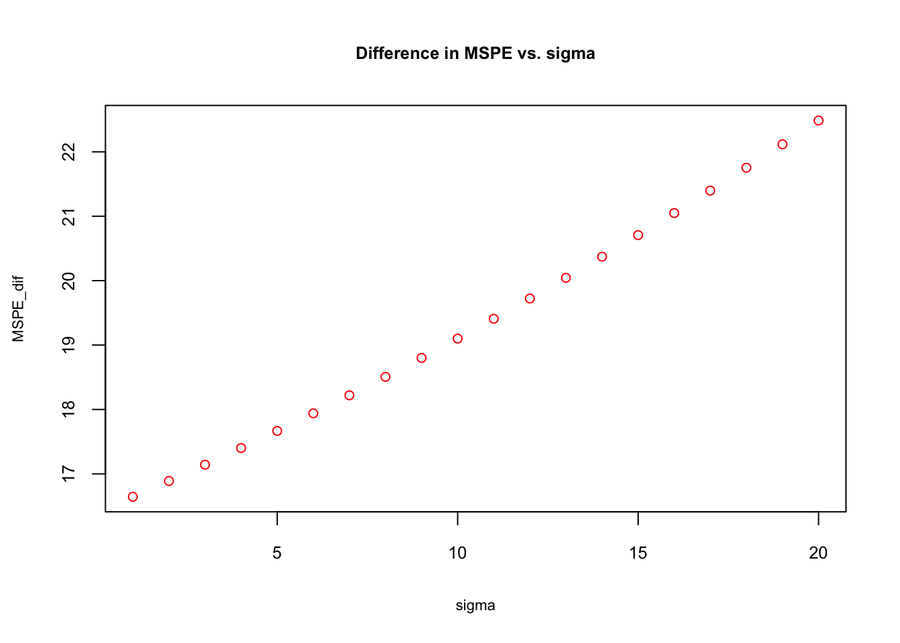
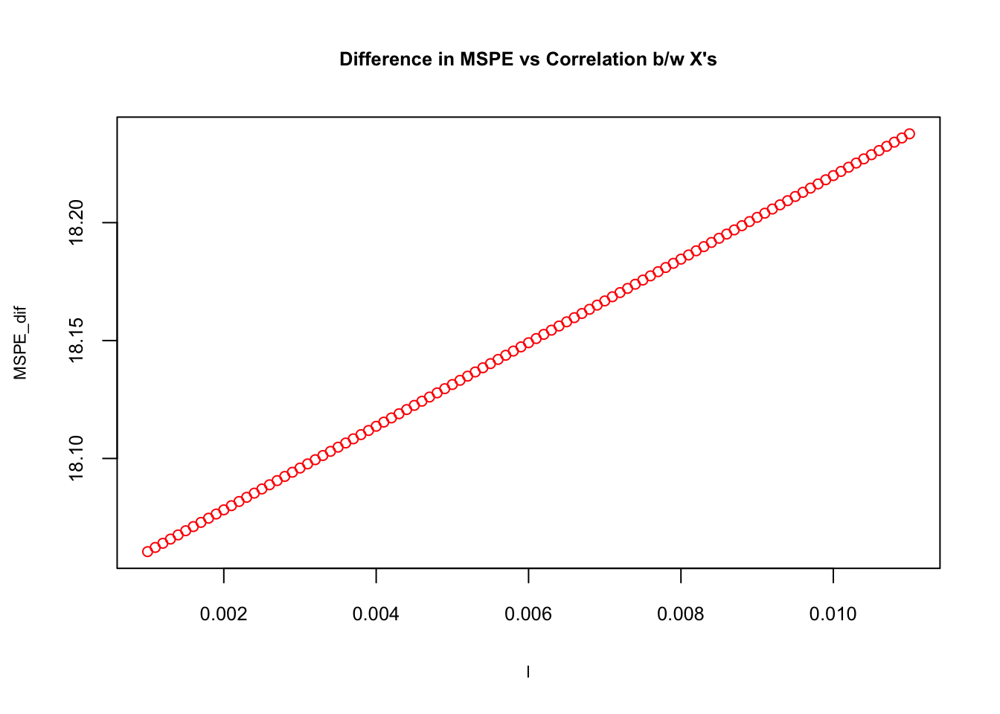

# Model selection and Sparsity


## Model selection

## Dropping a variable in a regression


We can assume that the outcome $y_i$ is determined by the following function:

$$
y_{i}=\beta_0+\beta_1 x_{i}+\varepsilon_{i}, ~~~~ i=1, \ldots, n
$$
where $\varepsilon_{i} \sim N\left(0, \sigma^{2}\right)$, $\mathbf{Cov}\left(\varepsilon_{i}, \varepsilon_{j}\right)=0$ for $i\neq j.$  Although unrealistic, for now we assume that $x_i$ is **fixed** (non-stochastic) for simplicity in notations. That means in each sample we have same $x_i$.  We can write this function as

$$
y_{i}=f(x_i)+\varepsilon_{i}, ~~~~ i=1, \ldots, n
$$

As usual, $f(x_i)$ is the deterministic part (DGM) and $\varepsilon_i$ is the random part in the function that together determine the value of $y_i$.  Again, we are living in two universes: the population and a sample.  Since none of the elements in population is known to us, we can only **assume** what $f(x)$ would be.  Based on a sample and the assumption about DGM, we choose an estimator of $f(x)$,

$$
\hat{f}(x) = \hat{\beta}_0+\hat{\beta}_1 x_{i},
$$
  
which is BLUE of $f(x)$, when it is estimated with OLS given the assumptions about $\varepsilon_i$ stated above.  Since the task of this estimation is to satisfy the **unbiasedness** condition, i.e. $\mathbf{E}[\hat{f}(x)]=f(x)$, it can be achieved only if $\mathbf{E}[\hat{\beta_0}]=\beta_0$ and $\mathbf{E}[\hat{\beta_1}]=\beta_1$.  At the end of this process, we can understand the effect of $x$ on $y$, signified by the unbiased slope coefficient $\hat{\beta_1}$.  This is not as an easy job as it sounds in this simple example.  Finding an unbiased estimator of $\beta$ is the main challenge in the field of econometrics.   

In **prediction**, on the other hand, our main task is **not** to find unbiased estimator of $f(x)$.  We just want to **predict** $y_0$ given $x_0$.  The subscript $0$ tells us that we want to predict $y$ for a specific value of $x$.  Hence we can write it as,  

$$
y_{0}=\beta_0+\beta_1 x_{0}+\varepsilon_{0}, 
$$
   
In other words, when $x_0=5$, for example, $y_0$ will be determined by $f(x_0)$ and the random error, $\varepsilon_0$, which has the same variance, $\sigma^2$, as $\varepsilon_i$.  Hence, when $x_0=5$, although $f(x_0)$ is fixed, $y_0$ will vary because of its random part, $\varepsilon_0$.  This in an irreducible uncertainty in predicting $y_0$ given $f(x_0)$.  We do not know about the population.  Therefore, we do not know what $f(x_0)$ is.  We can have a sample from the population and build a model $\hat{f}(x)$ so that $\hat{f}(x_0)$ would be as close to $f(x_0)$ as possible.  But this introduces another layer of uncertainty in predicting $y_0$. Since each sample is random and different, $\hat{f}(x_0)$ will be a function of the sample: $\hat{f}(x_0, S_m)$. Of course, we will have one sample in practice.  However, if this variation is high, it would be highly likely that our predictions, $\hat{f}(x_0, S_m)$, would be far off from $f(x_0)$.  

We can use an **unbiased** estimator for prediction, but as we have seen before, we may be able to improve MSPE if we allow some **bias** in $\hat{f}(x)$.  To see this potential trade-off, we look at the decomposition of MSPE with a simplified notation:

$$
\mathbf{MSPE}=\mathbf{E}\left[(y_0-\hat{f})^{2}\right]=\mathbf{E}\left[(f+\varepsilon-\hat{f})^{2}\right]
$$
$$
\mathbf{MSPE}=\mathbf{E}\left[(f+\varepsilon-\hat{f}+\mathbf{E}[\hat{f}]-\mathbf{E}[\hat{f}])^{2}\right]
$$

We have seen this before. Since we calculate MSPE for $x_i = x_0$, we call it the conditional MSPE, which can be expressed as $\mathbf{MSPE}=\mathbf{E}\left[(y_0-\hat{f})^{2}|x=x_0\right]$.  We will see unconditional MSPE, which is the average of all possible data points later in last two sections.  The simplification will follow the same steps, and we will have:  

$$
\mathbf{MSPE}=(f-\mathbf{E}[\hat{f}])^{2}+\mathbf{E}\left[(\mathbf{E}[\hat{f}]-\hat{f})^{2}\right]+\mathbf{E}\left[\varepsilon^{2}\right]
$$

Let's look at the first term first:  

$$
\left(f-\mathbf{E}[\hat{f}]\right)^{2}=\left(\beta_0+\beta_1 x_{0}-\mathbf{E}[\hat{\beta}_0]-x_{0}\mathbf{E}[\hat{\beta}_1]\right)^2=\left((\beta_0-\mathbf{E}[\hat{\beta}_0])+x_{0}(\beta_1-\mathbf{E}[\hat{\beta}_1])\right)^2.
$$
  
Hence it shows the bias (squared) in parameters.  The second term is the variance of $\hat{f}(x)$:  

$$
\mathbf{E}\left[(\mathbf{E}[\hat{f}]-\hat{f})^{2}\right]=\mathbf{Var}[\hat{f}(x)]=\mathbf{Var}[\hat{\beta}_0+\hat{\beta}_1 x_{0}]=\mathbf{Var}[\hat{\beta}_0]+x_{0}^2\mathbf{Var}[\hat{\beta}_1]+2x_{0}\mathbf{Cov}[\hat{\beta}_0,\hat{\beta}_1]
$$
  
As expected, the model's variance is the sum of the variances of estimators and their covariance.  Again, the variance can be thought of variation of $\hat{f}(x)$ from sample to sample.  

With the irreducible prediction error $\mathbf{E}[\varepsilon^{2}]=\sigma^2$,  

$$
\mathbf{MSPE}=(\mathbf{bias})^{2}+\mathbf{Var}(\hat{f})+\sigma^2.
$$
  
Suppose that our OLS estimators are **unbiased** and that $\mathbf{Cov}[\hat{\beta}_0,\hat{\beta}_1]=0$.  In that case,  

$$
\mathbf{MSPE}_{OLS}  =\mathbf{Var}(\hat{\beta}_{0})+x_{0}^2\mathbf{Var}(\hat{\beta}_{1})+\sigma^2
$$

Before going further, let's summarize the meaning of this measure.  The mean squared prediction error of unbiased $\hat{f}(x_0)$, or how much $\hat{f}(x_0)$ deviates from $y_0$ is defined by two factors: First, $y_0$ itself varies around $f(x_0)$ by $\sigma^2$. This is irreducible. Second, $\hat{f}(x_0)$ varies from sample to sample.  The model's variance is the sum of variations in estimated coefficients from sample to sample, which can be reducible.  
  
Suppose that $\hat{\beta}_{1}$ has a large variance.  Hence, we can ask what would happen if we dropped the variable:  

$$
\mathbf{MSPE}_{Biased~OLS}  = \mathbf{Bias}^2+\mathbf{Var}(\hat{\beta}_{0})+\sigma^2
$$

When we take the difference:  

$$
\mathbf{MSPE}_{OLS} -\mathbf{MSPE}_{Biased~OLS} =x_{0}^2\mathbf{Var}(\hat{\beta}_{1}) - \mathbf{Bias}^2 
$$
  
This expression shows that dropping a variable would decrease the expected prediction error if:  

$$
x_{0}^2\mathbf{Var}(\hat{\beta}_{1}) > \mathbf{Bias}^2 ~~\Rightarrow~~  \mathbf{MSPE}_{Biased~OLS} < \mathbf{MSPE}_{OLS} 
$$
  
**This option, omitting a variable, is unthinkable if our task is to obtain an unbiased estimator** of ${f}(x)$, but improves the prediction accuracy if the condition above is satisfied.  Let's expand this example into a two-variable case:  

$$
y_{i}=\beta_0+\beta_1 x_{1i}+\beta_2 x_{2i}+\varepsilon_{i}, ~~~~ i=1, \ldots, n.
$$
  
Thus, the bias term becomes  

$$
\left(f-\mathbf{E}[\hat{f}]\right)^{2}=\left((\beta_0-\mathbf{E}[\hat{\beta}_0])+x_{10}(\beta_1-\mathbf{E}[\hat{\beta}_1])+x_{20}(\beta_2-\mathbf{E}[\hat{\beta}_2])\right)^2.
$$
  
And let's assume that $\mathbf{Cov}[\hat{\beta}_0,\hat{\beta}_1]=\mathbf{Cov}[\hat{\beta}_0,\hat{\beta}_2]=0$, but $\mathbf{Cov}[\hat{\beta}_1,\hat{\beta}_2] \neq 0$. Hence, the variance of $\hat{f}(x)$:  

$$
\mathbf{Var}[\hat{f}(x)]=\mathbf{Var}[\hat{\beta}_0+\hat{\beta}_1 x_{10}+\hat{\beta}_2 x_{20}]=\mathbf{Var}[\hat{\beta}_0]+x_{10}^2\mathbf{Var}[\hat{\beta}_1]+x_{20}^2\mathbf{Var}[\hat{\beta}_2]+\\2x_{10}x_{20}\mathbf{Cov}[\hat{\beta}_1,\hat{\beta}_2].
$$
  
This two-variable example shows that as the number of variables rises, the covariance between variables inflates the model's variance further. This fact captured by Variance Inflation Factor ([VIF](https://en.wikipedia.org/wiki/Variance_inflation_factor)) in econometrics is a key point in high-dimensional models for two reasons:  First, dropping a variable highly correlated with other variables would reduce the model's variance substantially.  Second, a highly correlated variable also has limited new information among other variables.  Hence dropping a highly correlated variable (with a high variance) would have a less significant effect on the prediction accuracy while reducing the model's variance substantially.   

Suppose that we want to predict $y_0$ for $\left[x_{10},~ x_{20}\right]$ and $\mathbf{Var}[\hat{\beta}_2] \approx 10~\text{x}~\mathbf{Var}[\hat{\beta}_1]$.  Hence, we consider dropping $x_2$.  To evaluate the effect of this decision on MSPE, we take the difference between two MSPE's:  

$$
\mathbf{MSPE}_{OLS} -\mathbf{MSPE}_{Biased~OLS} =x_{20}^2\mathbf{Var}(\hat{\beta}_{2}) + 2x_{10}x_{20}\mathbf{Cov}[\hat{\beta}_1,\hat{\beta}_2] - \mathbf{Bias}^2 
$$
  
Thus, dropping $x_2$ would decrease the prediction error if  

$$
x_{20}^2\mathbf{Var}(\hat{\beta}_{2}) + 2x_{10}x_{20}\mathbf{Cov}[\hat{\beta}_1,\hat{\beta}_2]> \mathbf{Bias}^2 ~~\Rightarrow~~  \mathbf{MSPE}_{Biased~OLS} < \mathbf{MSPE}_{OLS} 
$$
  
We know from Elementary Econometrics that $\mathbf{Var}(\hat{\beta}_j)$ increases by $\sigma^2$, decreases by the $\mathbf{Var}(x_j)$, and rises by the correlation between $x_j$ and other $x$'s.  Let's look at   $\mathbf{Var}(\hat{\beta}_j)$ closer:  


$$
\mathbf{Var}(\hat{\beta}_{j}) = \frac{\sigma^{2}}{\mathbf{Var}(x_{j})} \cdot \frac{1}{1-R_{j}^{2}}
$$



  
where $R_j^2$ is $R^2$ in the regression on $x_j$ on the remaining $(k-2)$ regressors ($x$'s).  The second term is called the variance-inflating factor (VIF).  As usual, a higher variability in a particular $x$ leads to proportionately less variance in the corresponding coefficient estimate. Note that, however, as $R_j^2$ get closer to one, that is, as the correlation between $x_j$ with other regressors approaches to unity, $\mathbf{Var}(\hat{\beta}_j)$ goes to infinity.   

The variance of $\varepsilon_i$, $\sigma^2$, indicates how much $y_i$'s deviate from the $f(x)$.  Since $\sigma^2$ is typically unknown, we estimate it from **the sample** as  

$$
\widehat{\sigma}^{2}=\frac{1}{(n-k+1)} \sum_{i=1}^{n}\left(y_{i}-\hat{f}(x)\right)^{2}
$$
  
Remember that we have multiple samples, hence if our estimator is **unbiased**, we can prove that $\mathbf{E}(\hat{\sigma}^2)=\sigma^2$.  The proof is not important now.  However, $\mathbf{Var}(\hat{\beta}_j)$ becomes  

$$
\mathbf{Var}\left(\hat{\beta}_{j}\right)=\frac{\sum_{i=1}^{n}\left(y_{i}-\hat{f}(x)\right)^{2}}{(n-k+1)\mathbf{Var}\left(x_{j}\right)} \cdot \frac{1}{1-R_{j}^{2}},
$$

It is clear now that a greater sample size, $n$, results in a proportionately less variance in the coefficient estimates.  On the other hand, as the number of regressors, $k$, goes up, the variance goes up.  In large $n$ and small $k$, the trade-off by dropping a variable would be insignificant, but as $k/n$ rises, the trade-off becomes more important.  

Let's have a simulation example to conclude this section.  Here are the steps for our simulation:  

1. There is a random variable, $y$, that we want to predict.
2. $y_{i}=f(x_i)+\varepsilon_{i}$.
3. DGM is $f(x_i)=\beta_0+\beta_1 x_{1i}+\beta_2 x_{2i}$
4. $\varepsilon_{i} \sim N(0, \sigma^2)$.
5. The steps above define the **population**.  We will withdraw $M$ number of **samples** from this population.
6. Using each sample ($S_m$, where $m=1, \ldots, M$), we will estimate two models: **unbiased** $\hat{f}(x)_{OLS}$ and **biased** $\hat{f}(x)_{Biased~OLS}$
7. Using these models we will predict $y'_i$ from a different sample ($T$) drawn from the same population.  We can call it the "unseen" dataset or the "test" dataset, which contains out-of-sample data points, $(y'_i, x_{1i}, x_{2i})$., where $i=1, \ldots, n$.  
  
Before we start, we need to be clear how we define MSPE in our simulation. Since  we will predict every $y'_i$ with corresponding predictors $(x_{1i}, x_{2i})$ in test set $T$ by each $\hat{f}(x_{1i}, x_{2i}, S_m))$ estimated by each sample, we calculate the following **unconditional** MSPE:   

$$
\mathbf{MSPE}=\mathbf{E}_{S}\mathbf{E}_{S_{m}}\left[(y'_i-\hat{f}(x_{1i}, x_{2i}, S_m))^{2}\right]=\\\mathbf{E}_S\left[\frac{1}{n} \sum_{i=1}^{n}\left(y_{i}^{\prime}-\hat{f}(x_{1i}, x_{2i}, S_m)\right)^{2}\right],~~~~~~~~~ m=1, \ldots, M
$$
  
We first calculate MSPE for all data points in the test set using $\hat{f}(x_{1T}, x_{2T}, S_m)$, and then take the average of $M$ samples.  

Below, we will show the sensitivity of trade-off by the size of irreducible error.  The simulation below plots $diff= \mathbf{MSPE}_{OLS}-\mathbf{MSPE}_{Biased~OLS}$ against $\sigma$.  


```r
# Function for X - fixed at repeated samples
# Argument l is used for correlation and with 0.01
# Correlation between x_1 and x_2 is 0.7494
xfunc <- function(n, l){
  set.seed(123)
  x_1 <- rnorm(n, 0, 25) 
  x_2 <- l*x_1+rnorm(n, 0, 0.2)
  X <- data.frame("x_1" = x_1, "x_2" = x_2)
  return(X)
}

# Note that we can model dependencies with copulas in R
# More specifically by using mvrnorn() function.  However, here
# We want one variable with a higher variance. which is easier to do manaully
# More: https://datascienceplus.com/modelling-dependence-with-copulas/ 

# Function for test set - with different X's but same dist.
unseen <- function(n, sigma, l){
  set.seed(1)
  x_11 <- rnorm(n, 0, 25) 
  x_22 <- l*x_11+rnorm(n, 0, 0.2)
  f <- 0 + 2*x_11 + 2*x_22   
  y_u <- f + rnorm(n, 0, sigma) 
  un <- data.frame("y" = y_u, "x_1" = x_11, "x_2" = x_22)
  return(un)
}

# Function for simulation (M - number of samples)
sim <- function(M, n, sigma, l){
  
  X <- xfunc(n, l) # Repeated X's in each sample
  un <- unseen(n, sigma, l) # Out-of sample (y, x_1, x_2)

  # containers
  MSPE_ols <- rep(0, M)
  MSPE_b <- rep(0, M)
  coeff <- matrix(0, M, 3)
  coeff_b <- matrix(0, M, 2)
  yhat <- matrix(0, M, n)
  yhat_b <- matrix(0, M, n)
  
  # loop for samples
  for (i in 1:M) {
    f <- 0 + 2*X$x_1 + 2*X$x_2   # DGM
    y <- f + rnorm(n, 0, sigma)
    samp <- data.frame("y" = y, X)
    ols <- lm(y~., samp) # Unbaised OLS
    ols_b <- lm(y~x_1, samp) #Biased OLS
    coeff[i,] <- ols$coefficients
    coeff_b[i,] <- ols_b$coefficients
    yhat[i,] <- predict(ols, un)
    yhat_b[i,] <- predict(ols_b, un)
    MSPE_ols[i] <- mean((un$y-yhat[i])^2)
    MSPE_b[i] <- mean((un$y-yhat_b[i])^2)
  }
  d = mean(MSPE_ols)-mean(MSPE_b)
  output <- list(d, MSPE_b, MSPE_ols, coeff, coeff_b, yhat, yhat_b)
  return(output)
}

# Sensitivity of (MSPE_biased)-(MSPE_ols)
# different sigma for the irreducible error
sigma <- seq(1, 20, 1)
MSPE_dif <- rep(0, length(sigma))
for (i in 1: length(sigma)) {
  MSPE_dif[i] <- sim(1000, 100, sigma[i], 0.01)[[1]]
}

plot(sigma, MSPE_dif, col="red", main = "Difference in MSPE vs. sigma",
     cex = 0.9, cex.main= 0.8, cex.lab = 0.7, cex.axis = 0.8)
```


  
The simulation shows that the **biased** $\hat{f}(x)$ is getting a better precision in prediction as the "noise" in the data gets higher.  The reason can be understood if we look at $\mathbf{Var}(\hat{\beta}_{2}) + 2\mathbf{Cov}[\hat{\beta}_1,\hat{\beta}_2]$ closer:  

$$
\mathbf{Var}\left(\hat{\beta}_{2}\right)=\frac{\sigma^{2}}{\mathbf{Var}\left(x_{2}\right)} \cdot \frac{1}{1-r_{1,2}^{2}},
$$
  
where $r_{1,2}^{2}$ is the coefficient of correlation between $x_1$ and $x_2$.  And,  

$$
\mathbf{Cov}\left(\hat{\beta}_{1},\hat{\beta}_{2}\right)=\frac{-r_{1,2}^{2}\sigma^{2}}{\sqrt{\mathbf{Var}\left(x_{1}\right)\mathbf{Var}\left(x_{2}\right)}} \cdot \frac{1}{1-r_{1,2}^{2}},
$$
  
Hence,  

$$
\begin{aligned}
\mathbf{MSPE}_{O L S}-& \mathbf{MSPE}_{Biased~OLS}=\mathbf{V} \mathbf{a r}\left(\hat{\beta}_{2}\right)+2 \mathbf{C} \mathbf{o} \mathbf{v}\left[\hat{\beta}_{1}, \hat{\beta}_{2}\right]-\mathbf{Bias}^{2}=\\
& \frac{\sigma^{2}}{1-r_{1,2}^{2}}\left(\frac{1}{\mathbf{V a r}\left(x_{2}\right)}+\frac{-2 r_{1,2}^{2}}{\sqrt{\mathbf{V a r}\left(x_{1}\right) \mathbf{V a r}\left(x_{2}\right)}}\right)-\mathbf{Bias}^{2}
\end{aligned}
$$
  
Given the bias due to the omitted variable $x_2$, this expression shows the difference as a function of $\sigma^2$ and $r_{1,2}^{2}$ and explains why the biased-OLS estimator have increasingly better predictions.  

As a final experiment, let's have the same simulation that shows the relationship between correlation and trade-off. To create different correlations between $x_1$ and $x_2$, we use the `xfunc()` we created earlier.  The argument $l$ is used to change the the correlation and can be seen below. In our case, when $l=0.01$ $r_{1,2}^{2}=0.7494$.  
  

```r
# Function for X for correlation
X <- xfunc(100, 0.001)
cor(X)
```

```
##            x_1        x_2
## x_1 1.00000000 0.06838898
## x_2 0.06838898 1.00000000
```

```r
X <- xfunc(100, 0.0011)
cor(X)
```

```
##            x_1        x_2
## x_1 1.00000000 0.08010547
## x_2 0.08010547 1.00000000
```

```r
# We use this in our simulation
X <- xfunc(100, 0.01)
cor(X)
```

```
##           x_1       x_2
## x_1 1.0000000 0.7494025
## x_2 0.7494025 1.0000000
```

Now the simulation with different levels of correlation:  
  

```r
# Sensitivity of (MSPE_biased)-(MSPE_ols)
# different levels of correlation when sigma^2=7
l <- seq(0.001, 0.011, 0.0001)
MSPE_dif <- rep(0, length(l))
for (i in 1: length(l)) {
  MSPE_dif[i] <- sim(1000, 100, 7, l[i])[[1]]
}

plot(l, MSPE_dif, col="red", main= "Difference in MSPE vs Correlation b/w X's",
     cex=0.9, cex.main= 0.8, cex.lab = 0.7, cex.axis = 0.8)
```



  
As the correlation between $x$'s goes up, $\mathbf{MSPE}_{OLS}-\mathbf{MSPE}_{Biased~OLS}$ rises.  Later we will have a high-dimensional dataset (large $k$) to show the importance of correlation. We will leave the calculation of bias and how the sample size affects trade-off to labs.  


## out-sample prediction accuracy
As a side note: when we compare the models in terms their out-sample prediction accuracy, we usually use the root MSPE (RMSPE), which gives us the prediction error in original units.  

When we calculate empirical in-sample MSPE with one sample, we can asses its out-of-sample prediction performance by the Mallows $C_P$ statistics, which just substitutes the feasible estimator of $\sigma^2$ into the overfitting penalty.  That is, for a linear model with $p + 1$ coefficients fit by OLS,  

$$
C_{p}=\frac{1}{n} \sum_{i=1}^{n}\left(y_{i}-\hat{f}(x_i)\right)^{2}+\frac{2 \widehat{\sigma}^{2}}{n}(p+1),
$$
  
which becomes a good proxy for the our-of-sample error. That is, a small value of $C_p$ means that the model is relatively precise. For comparing models, we really care about differences in empirical out-sample MSPE's:  

$$
\Delta C_{p}=\mathbf{MSPE}_{1}-\mathbf{MSPE}_{2}+\frac{2}{n} \widehat{\sigma}^{2}\left(p_{1}-p_{2}\right),
$$
  
where we use $\hat{\sigma}^2$ from the largest model.  


https://online.stat.psu.edu/stat462/node/197/

How are we going to find the best predictor? In addition to $C_p$, we can also use **Akaike Information Criterion (AIC)**, which also has the form of “in-sample performance plus penalty”. AIC can be applied whenever we have a likelihood function, whereas $C_p$ can be used when we use squared errors.  We will see later AIC and BIC (Bayesian Information Criteria) in this book.  With these measures, we can indirectly estimate the test (out-of-sample) error by making an adjustment to the training (in-sample) error to account for the bias due to overfitting.  Therefore, these methods are **ex-post** tools to **penalize** the overfitting.  

On the other hand, we can directly estimate the test error (out-sample) and choose the model that minimizes it.  We can do it by directly validating the model using a cross-validation approach.  Therefore, cross-validation methods provide **ex-ante** penalization for overfitting and are the main tools in selecting predictive models in machine learning applications as they have almost no assumptions.


## Sparsity

