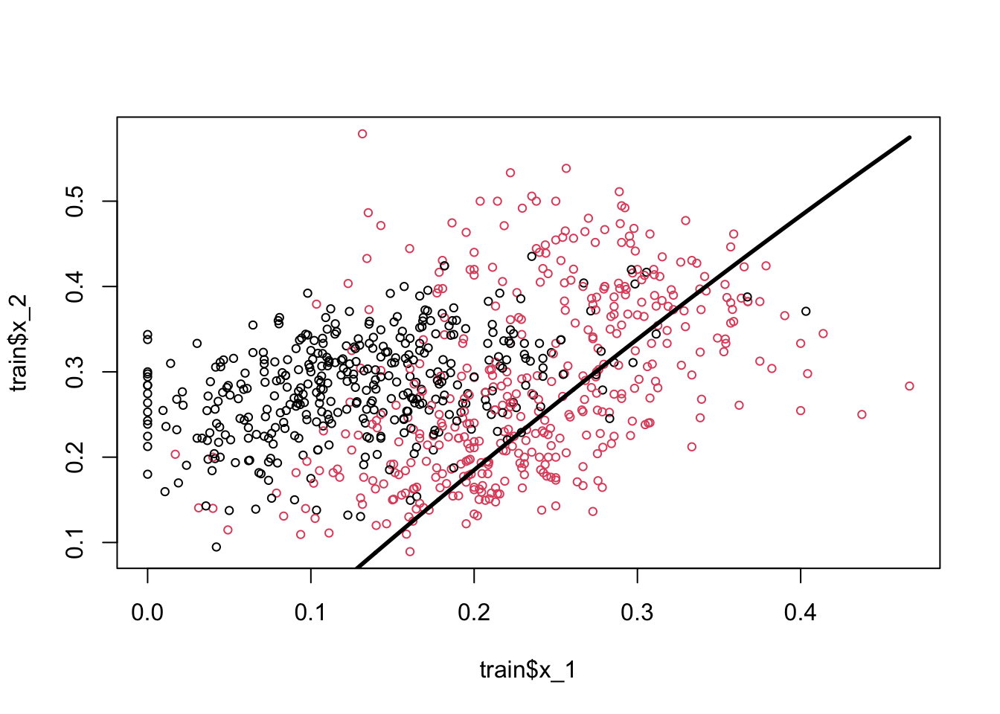
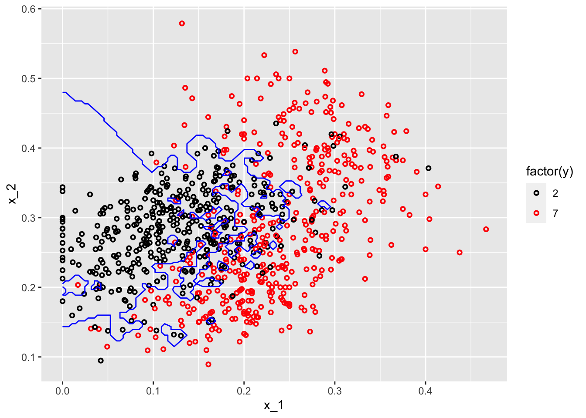
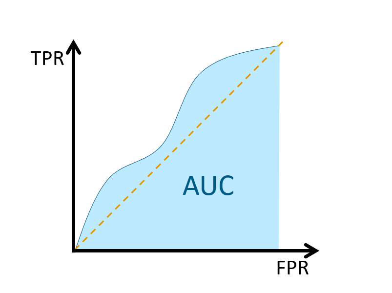

# Classification

## Nonparametric Classifier - kNN

We complete this section, Nonparametric Estimations, with a nonparametric classifier and compare its performance with parametric classifiers, LPM and Logistic.

## `mnist` Dataset

Reading hand-written letters and numbers is not a big deal nowadays.  For example, In Canada Post, computers read postal codes and robots sorts them for each postal code groups.  This application is mainly achieved by machine learning algorithms.  In order to understand how, let's use a real dataset, Mnist. Here is the description of the dataset by Wikipedia: 

> The MNIST database (Modified National Institute of Standards and Technology database) is a large database of handwritten digits that is commonly used for training various image processing systems. The MNIST database contains 60,000 training images and 10,000 testing images. Half of the training set and half of the test set were taken from NIST's training dataset, while the other half of the training set and the other half of the test set were taken from NIST's testing dataset. There have been a number of scientific papers on attempts to achieve the lowest error rate; one paper, using a hierarchical system of convolutional neural networks, manages to get an error rate on the MNIST database of 0.23\%.
>


These images are converted into $28 \times 28 = 784$ pixels and, for each pixel, there is a measure that scales the darkness in that pixel between 0 (white) and 255 (black).  Hence, for each digitized image, we have an indicator variable $Y$ between 0 and 9, and we have 784 variables that identifies each pixel in the digitized image. Let's download the data.  ([More details about the data](http://yann.lecun.com/exdb/mnist/)).     


```r
#loading the data
library(tidyverse)
library(dslabs)
#Download the data to your directory.  It's big!
#mnist <- read_mnist() 
#save(mnist, file = "mnist.Rdata")
load("mnist.Rdata")
str(mnist)
```

```
## List of 2
##  $ train:List of 2
##   ..$ images: int [1:60000, 1:784] 0 0 0 0 0 0 0 0 0 0 ...
##   ..$ labels: int [1:60000] 5 0 4 1 9 2 1 3 1 4 ...
##  $ test :List of 2
##   ..$ images: int [1:10000, 1:784] 0 0 0 0 0 0 0 0 0 0 ...
##   ..$ labels: int [1:10000] 7 2 1 0 4 1 4 9 5 9 ...
```

The data is given as a list and already divided into train and test sets.  We have 60,000 images in the train set and 10,000 images in the test set. For the train set, we have two nested sets: `images`, which contains all 784 features for 60,000 images.  Hence, it's a $60000 \times 784$ matrix. And, `labels` contains the labes (from 0 to 9) for each image. 
  
The digitizing can be understood from this image better:
  


Each image has $28 \times 28$ = 784 pixels.  For each image, the pixels are features with a label that shows the true number between 0 and 9.  This methods is called as "flattening", which is a technique that is used to convert multi-dimensional image into a one-dimension array (vector).
  
For now, we will use a smaller version of this data set given in the `dslabs` package, which is a random sample of 1,000 images (only for 2 and 7 digits), 800 in the training set and 200 in the test set, with only two features: the proportion of dark pixels that are in the upper left quadrant, `x_1`, and the lower right quadrant, `x_2`. 


```r
data("mnist_27")
str(mnist_27)
```

```
## List of 5
##  $ train      :'data.frame':	800 obs. of  3 variables:
##   ..$ y  : Factor w/ 2 levels "2","7": 1 2 1 1 2 1 2 2 2 1 ...
##   ..$ x_1: num [1:800] 0.0395 0.1607 0.0213 0.1358 0.3902 ...
##   ..$ x_2: num [1:800] 0.1842 0.0893 0.2766 0.2222 0.3659 ...
##  $ test       :'data.frame':	200 obs. of  3 variables:
##   ..$ y  : Factor w/ 2 levels "2","7": 1 2 2 2 2 1 1 1 1 2 ...
##   ..$ x_1: num [1:200] 0.148 0.283 0.29 0.195 0.218 ...
##   ..$ x_2: num [1:200] 0.261 0.348 0.435 0.115 0.397 ...
##  $ index_train: int [1:800] 40334 33996 3200 38360 36239 38816 8085 9098 15470 5096 ...
##  $ index_test : int [1:200] 46218 35939 23443 30466 2677 54248 5909 13402 11031 47308 ...
##  $ true_p     :'data.frame':	22500 obs. of  3 variables:
##   ..$ x_1: num [1:22500] 0 0.00352 0.00703 0.01055 0.01406 ...
##   ..$ x_2: num [1:22500] 0 0 0 0 0 0 0 0 0 0 ...
##   ..$ p  : num [1:22500] 0.703 0.711 0.719 0.727 0.734 ...
##   ..- attr(*, "out.attrs")=List of 2
##   .. ..$ dim     : Named int [1:2] 150 150
##   .. .. ..- attr(*, "names")= chr [1:2] "x_1" "x_2"
##   .. ..$ dimnames:List of 2
##   .. .. ..$ x_1: chr [1:150] "x_1=0.0000000" "x_1=0.0035155" "x_1=0.0070310" "x_1=0.0105465" ...
##   .. .. ..$ x_2: chr [1:150] "x_2=0.000000000" "x_2=0.004101417" "x_2=0.008202834" "x_2=0.012304251" ...
```
  
## Linear classifiers (again) 

A linear classifier (like LPM and Logistic) is one where a "hyperplane" is formed by taking a linear combination of the features.  Hyperplane represents a decision boundary chosen by our classifier to separate the data points in different class labels.  let's start with LPM:  
  
\begin{equation}
\operatorname{Pr}\left(Y=1 | X_{1}=x_{1}, X_{2}=x_{2}\right)=\beta_{0}+\beta_{1} x_{1}+\beta_{2} x_{2}
  (\#eq:8-1)
\end{equation} 
  

```r
# LPM requires numerical 1 and 0
y10 = ifelse(mnist_27$train$y == 7, 1, 0)
train <- data.frame(mnist_27$train, y10)
plot(train$x_1, train$x_2, col = train$y10 + 1, cex = 0.5)
```


Here, the black dots are 2 and red dots are 7.  Note that if we use 0.5 as a decision rule such that it separates pairs ($x_1$, $x_2$) for which $\operatorname{Pr}\left(Y=1 | X_{1}=x_{1}, X_{2}=x_{2}\right) < 0.5$ then we can have a hyperplane as  

$$
\hat{\beta}_{0}+\hat{\beta}_{1} x_{1}+\hat{\beta}_{2} x_{2}=0.5 \Longrightarrow x_{2}=\left(0.5-\hat{\beta}_{0}\right) / \hat{\beta}_{2}-\hat{\beta}_{1} / \hat{\beta}_{2} x_{1}.
$$
  
If we incorporate this into our plot for the train data:  


```r
model <- lm(y10 ~ x_1 + x_2, train)

tr <- 0.5
a <- tr - model$coefficients[1]
a <- a / model$coefficients[3]
b <- -model$coefficients[2] / model$coefficients[3]
plot(train$x_1, train$x_2, col = train$y10 + 1, cex = 0.72)
abline(a, b, col = "blue", lwd = 2.8)
```


Play with the (discriminating) threshold and see how the hyperplane moves.  When we change it to different numbers between 0 and 1, the number of correct and wrong predictions, a separation of red and black dots located in different sides, changes as well.  Moreover **the decision boundary is linear**.  That's why LPM is called a linear classifier.  

Would including interactions and polynomials (nonlinear parts) would place the line such a way that separation of these dots (2s and 7s) would be better?  

Let's see if adding a polynomial to our LPM improves this.


```r
model2 <- lm(y10 ~ x_1 + I(x_1 ^ 2) + x_2, train)
summary(model2)
```

```
## 
## Call:
## lm(formula = y10 ~ x_1 + I(x_1^2) + x_2, data = train)
## 
## Residuals:
##      Min       1Q   Median       3Q      Max 
## -1.14744 -0.28816  0.03999  0.28431  1.06759 
## 
## Coefficients:
##             Estimate Std. Error t value Pr(>|t|)    
## (Intercept)  0.09328    0.06571   1.419   0.1562    
## x_1          4.81884    0.55310   8.712  < 2e-16 ***
## I(x_1^2)    -2.75520    1.40760  -1.957   0.0507 .  
## x_2         -1.18864    0.17252  -6.890 1.14e-11 ***
## ---
## Signif. codes:  0 '***' 0.001 '**' 0.01 '*' 0.05 '.' 0.1 ' ' 1
## 
## Residual standard error: 0.3891 on 796 degrees of freedom
## Multiple R-squared:  0.3956,	Adjusted R-squared:  0.3933 
## F-statistic: 173.7 on 3 and 796 DF,  p-value: < 2.2e-16
```

```r
tr <- 0.5
s <- model2$coefficients
a = tr / s[3]
b = s[1] / s[3]
d = s[2] / s[3]
e = s[4] / s[3]
x22 = a - b - d * train$x_1 - e * (train$x_1 ^ 2)
plot(train$x_1, train$x_2, col = train$y10 + 1, cex = 0.72)
lines(train$x_1[order(x22)], x22[order(x22)], lwd = 2.8)
```



The coefficient of the polynomial is barely significant and very negligible in magnitude.  And in fact the classification seems worse than the previous one.
  
Would a logistic regression give us a better line?  We don't need to estimate it, but we can obtain the decision boundary for the logistic regression.  Remember,
  
$$
P(Y=1 | x)=\frac{\exp \left(w_{0}+\sum_{i} w_{i} x_{i}\right)}{1+\exp \left(w_{0}+\sum_{i} w_{i} x_{i}\right)}
$$
  
And,  

$$
P(Y=0 | x)=1-P(Y=1 | x)= \frac{1}{1+\exp \left(w_{0}+\sum_{i} w_{i} x_{i}\right)}
$$
  
if we take the ratio of success over failure, $P/1-P$,  

$$
\frac{P}{1-P}=\exp \left(w_{0}+\sum_{i} w_{i} x_{i}\right)
$$
  
If this ratio is higher than 1, we think that the probability for $Y=1$ is higher than the probability for $Y=0$.  And this only happens when $P>0.5$.  Hence, the condition to classify the observation as $Y=1$ is:

$$
\frac{P}{1-P}=\exp \left(w_{0}+\sum_{i} w_{i} x_{i}\right) > 1
$$
  
If we take the log of both sides,  

$$
w_{0}+\sum_{i} w_{i} X_{i}>0
$$

From here, the hyperplane function in our case becomes,  

$$
\hat{\beta}_{0}+\hat{\beta}_{1} x_{1}+\hat{\beta}_{2} x_{2}=0 \Longrightarrow x_{2}=-\hat{\beta}_{0} / \hat{\beta}_{2}-\hat{\beta}_{1} / \hat{\beta}_{2} x_{1}.
$$
  
We see that the decision boundary is again linear. Therefore, LPM and logistic regressions are called as **linear classifiers**, which are good **only if the problem on hand is linearly separable**.

Would it be possible to have a nonlinear boundary condition so that we can get a better classification for our predicted probabilities?  

## k-Nearest Neighbors

k-nearest neighbors (kNN) is a nonparametric method used for classification (or regression), which estimate $p(x_1, x_2)$ by using a method similar to *bin smoothing*. In *kNN classification*, the output is a class membership. An object is assigned to the class most common among its k-nearest neighbors. In *kNN regressions*, the output is the average of the values of k-nearest neighbors, which we've seen in bin smoothing applications.  
  
<!-- -->
  
Suppose we have to classify (identify) the red dot as 7 or 2.  Since it's a nonparametric approach, we have to define bins.  If the number of observations in bins set to 1 ($k = 1$), then we need to find one observation that is nearest to the red dot.  How?  Since we know to coordinates ($x_1, x_2$) of that red dot, we can find its nearest neighbors by some distance functions among all points (observations) in the data.  A popular choice is the Euclidean distance given by  

$$
d\left(x, x^{\prime}\right)=\sqrt{\left(x_{1}-x_{1}^{\prime}\right)^{2}+\ldots+\left(x_{n}-x_{n}^{\prime}\right)^{2}}.
$$

Other measures are also available and can be more suitable in different settings including the Manhattan, Chebyshev and Hamming distance.  The last one is used if the features are binary.  In our case the features are continuous so we can use the Euclidean distance.  We now have to calculate this measure for every point (observation) in our data.  In our graph we have 10 points, and we have to have 10 distance measures from the red dot.  Usually, in practice, we calculate all distance measures between each point, which becomes a symmetric matrix with $n$x$n$ dimensions.  

For example, for two dimensional space, we can calculate the distances as follows


```r
x1 <- c(2, 2.1, 4, 4.3)
x2 <- c(3, 3.3, 5, 5.1)

EDistance <- function(x, y){
  dx <- matrix(0, length(x), length(x))
  dy <- matrix(0, length(x), length(x))
  
  for (i in 1:length(x)) {
    dx[i,] <- (x[i] - x)^2
    dy[i,] <- (y[i] - y)^2
    dd <- sqrt(dx^2 + dy^2)
  }
  return(dd)
}
  
EDistance(x1, x2)
```

```
##            [,1]       [,2]       [,3]       [,4]
## [1,] 0.00000000 0.09055385 5.65685425 6.88710389
## [2,] 0.09055385 0.00000000 4.62430535 5.82436263
## [3,] 5.65685425 4.62430535 0.00000000 0.09055385
## [4,] 6.88710389 5.82436263 0.09055385 0.00000000
```

```r
plot(x1, x2, col = "red", lwd = 3)
#segments(x1[1], x2[1], x1[2:4], x2[2:4], col = "blue" )
#segments(x1[2], x2[2], x1[c(1, 3:4)], x2[c(1, 3:4)], col = "green" )
#segments(x1[3], x2[3], x1[c(1:2, 4)], x2[c(1:2, 4)], col = "orange" )
segments(x1[4], x2[4], x1[1:3], x2[1:3], col = "darkgreen" )
```


  
The matrix shows all distances for four points and, as we expect, it is symmetric.  The green lines show the distance from the last point ($x = 4.3,~ y = 5.1$) to all other points.  Using this matrix, we can easily find the k-nearest neighbors for any point.
  
When $k=1$, the observation that has the shortest distance is going to be the one to predict what the red dot could be. This is shown in the figure below:

<!-- -->
  
If we define the bin as $k=3$, we look for the 3 nearest points to the red dot and then take an average of the 1s (7s) and 0s (2s) associated with these points.  Here is an example:  

<!-- -->
  
Using $k$ neighbors to estimate the probability of $Y=1$ (the dot is 7), that is  

\begin{equation}
\hat{P}_{k}(Y=1 | X=x)=\frac{1}{k} \sum_{i \in \mathcal{N}_{k}(x, D)} I\left(y_{i}=1\right)
  (\#eq:8-2)
\end{equation} 
  
With this predicted probability, we classify the red dot to the class with the most observations in the $k$ nearest neighbors (we assign a class at random to one of the classes tied for highest).  Here is the rule in our case:  

$$
\hat{C}_{k}(x)=\left\{\begin{array}{ll}{1} & {\hat{p}_{k 0}(x)>0.5} \\ {0} & {\hat{p}_{k 1}(x)<0.5}\end{array}\right.
$$
  
Suppose our red dot has $x=(x_1,x_2)=(4,3)$  

$$
\begin{aligned} \hat{P}\left(Y=\text { Seven } | X_{1}=4, X_{2}=3\right)=\frac{2}{3} \\ \hat{P}\left(Y=\text { Two} | X_{1}=4, X_{2}=3\right)=\frac{1}{3} \end{aligned}
$$
  
Hence,  

$$
\hat{C}_{k=4}\left(x_{1}=4, x_{2}=3\right)=\text { Seven }
$$
  
As it's clear from this application, $k$ is our hyperparameter and we need to tune it as to have the best predictive kNN algorithm.  The following section will show its application.  But before that, we need to understand how decision boundaries can be found in kNN


```r
set.seed(1)
x1 <- runif(50)
x2 <- runif(50)

library(deldir)
tesselation <- deldir(x1, x2)
tiles <- tile.list(tesselation)

plot(tiles, pch = 19, close = TRUE,
     fillcol =  hcl.colors(4, "Sunset"),
     xlim = c(-0.2:1.1))
```


These are called Voronoi cells associated with 1-NN, which is the set of polygons whose edges are the perpendicular bisectors of the lines joining the neighboring points.  Thus, the decision boundary is the result of fusing adjacent Voronoi cells that are associated with same class.  In the example above, it's the boundary of unions of each colors.  Finding the boundaries that trace each adjacent Vorono regions can be done with additional several steps. 

To see all in an application, we will use `knn3()` from the *Caret* package.  We will not train a model but only see how the separation between classes will be nonlinear and different for different $k$.  


```r
library(tidyverse)
library(caret)
library(dslabs)

#With k = 50
model1 <- knn3(y ~ ., data = mnist_27$train, k = 2)

x_1 <- mnist_27$true_p$x_1
x_2 <- mnist_27$true_p$x_2
df <- data.frame(x_1, x_2) #This is whole data 22500 obs.

p_hat <- predict(model1, df, type = "prob") # Predicting probabilities in each bin
p_7 <- p_hat[,2] #Selecting the p_hat for 7

df <- data.frame(x_1, x_2, p_7)

my_colors <- c("black", "red")

p1 <- ggplot() +
  geom_point(data = mnist_27$train, aes(x = x_1, y = x_2, colour = factor(y)),
             shape = 21, size = 1, stroke = 1) +
  stat_contour(data = df, aes(x = x_1, y = x_2, z = p_7), breaks=c(0.5), color="blue") +
  scale_color_manual(values = my_colors)
plot(p1)
```



```r
#With k = 400
model2 <- knn3(y ~ ., data = mnist_27$train, k = 400)

p_hat <- predict(model2, df, type = "prob") # Prediciting probabilities in each bin
p_7 <- p_hat[,2] #Selecting the p_hat for 7

df <- data.frame(x_1, x_2, p_7)

p1 <- ggplot() +
  geom_point(data = mnist_27$train, aes(x = x_1, y = x_2, colour = factor(y)),
             shape = 21, size = 1, stroke = 1) +
  stat_contour(data = df, aes(x = x_1, y = x_2, z = p_7), breaks=c(0.5), color="blue") +
  scale_color_manual(values = my_colors)
plot(p1)
```


One with $k=2$ shows signs for overfitting, the other one with $k=400$ indicates oversmoothing or underfitting.  We need to tune $k$ such a way that it will be best in terms of prediction accuracy.  

## kNN with caret

There are many different learning algorithms developed by different authors and often with different parametric structures.  The `caret`, **Classification And Regression Training** package tries to consolidate these differences and provide consistency. It currently includes 237 (and growing) different methods which are summarized in the caret [package manual](https://topepo.github.io/caret/available-models.html) [@Kuhn_2019]. Here, we will use `mnset_27` to illustrate how we can use `caret` for kNN. For now, we will use the caret's `train()` function to find the optimal `k` in kNN, which is basically an automated version of cross-validation that we will see in the next chapter.  

### `mnist_27`

Since, our dataset, `mnist_27`, is already split into train and test sets, we do not need to do it again. Here is the starting point:


```r
library(caret)

#Training/Model building
model_knn <- train(y ~ ., method = "knn", data = mnist_27$train)
model_knn
```

```
## k-Nearest Neighbors 
## 
## 800 samples
##   2 predictor
##   2 classes: '2', '7' 
## 
## No pre-processing
## Resampling: Bootstrapped (25 reps) 
## Summary of sample sizes: 800, 800, 800, 800, 800, 800, ... 
## Resampling results across tuning parameters:
## 
##   k  Accuracy   Kappa    
##   5  0.8075980  0.6135168
##   7  0.8157975  0.6300494
##   9  0.8205824  0.6396302
## 
## Accuracy was used to select the optimal model using the largest value.
## The final value used for the model was k = 9.
```

By default, the cross validation is performed by taking 25 bootstrap samples comprised of 25% of the observations.  Moreover, the default is to try $k=5,7,9$. We can to expand it:


```r
#Training/Model building with our own grid
set.seed(2008)
model_knn1 <- train(
  y ~ .,
  method = "knn",
  data = mnist_27$train,
  tuneGrid = data.frame(k = seq(9, 71, 2))
)
ggplot(model_knn1, highlight = TRUE)
```


```r
model_knn1$bestTune
```

```
##     k
## 10 27
```

```r
model_knn1$finalModel
```

```
## 27-nearest neighbor model
## Training set outcome distribution:
## 
##   2   7 
## 379 421
```

We can change its tuning to cross-validation:


```r
#Training/Model building with 10-k cross validation
cv <- trainControl(method = "cv", number = 10, p = 0.9)
model_knn2 <- train(y ~ ., method = "knn", data = mnist_27$train,
                   tuneGrid = data.frame(k=seq(9,71,2)),
                   trControl = cv)
ggplot(model_knn2, highlight = TRUE)
```


```r
model_knn2$bestTune
```

```
##     k
## 11 29
```
  
It seems like $k=27$ ($k=29$ with CV) gives us the best performing prediction model. We can see their prediction performance on the test set:


```r
caret::confusionMatrix(predict(model_knn1, mnist_27$test, type = "raw"),
                mnist_27$test$y)
```

```
## Confusion Matrix and Statistics
## 
##           Reference
## Prediction  2  7
##          2 92 19
##          7 14 75
##                                           
##                Accuracy : 0.835           
##                  95% CI : (0.7762, 0.8836)
##     No Information Rate : 0.53            
##     P-Value [Acc > NIR] : <2e-16          
##                                           
##                   Kappa : 0.6678          
##                                           
##  Mcnemar's Test P-Value : 0.4862          
##                                           
##             Sensitivity : 0.8679          
##             Specificity : 0.7979          
##          Pos Pred Value : 0.8288          
##          Neg Pred Value : 0.8427          
##              Prevalence : 0.5300          
##          Detection Rate : 0.4600          
##    Detection Prevalence : 0.5550          
##       Balanced Accuracy : 0.8329          
##                                           
##        'Positive' Class : 2               
## 
```

```r
caret::confusionMatrix(predict(model_knn2, mnist_27$test, type = "raw"),
                mnist_27$test$y)
```

```
## Confusion Matrix and Statistics
## 
##           Reference
## Prediction  2  7
##          2 91 18
##          7 15 76
##                                           
##                Accuracy : 0.835           
##                  95% CI : (0.7762, 0.8836)
##     No Information Rate : 0.53            
##     P-Value [Acc > NIR] : <2e-16          
##                                           
##                   Kappa : 0.6682          
##                                           
##  Mcnemar's Test P-Value : 0.7277          
##                                           
##             Sensitivity : 0.8585          
##             Specificity : 0.8085          
##          Pos Pred Value : 0.8349          
##          Neg Pred Value : 0.8352          
##              Prevalence : 0.5300          
##          Detection Rate : 0.4550          
##    Detection Prevalence : 0.5450          
##       Balanced Accuracy : 0.8335          
##                                           
##        'Positive' Class : 2               
## 
```

What are these measures?  What is a "Confusion Matrix"?  We will see them in the next section.  But for now, let's use another example.  

### Adult dataset
This dataset provides information on income earning and attributes that may effect it. Information on the dataset is given at its [website](https://archive.ics.uci.edu/ml/datasets/Adult) [@Kohavi_1996]: 

>Extraction from 1994 US. Census database. A set of reasonably clean records was extracted using the following conditions: ((`AAGE`>16) && (`AGI`>100) && (`AFNLWGT`>1)&& (`HRSWK`>0)).
>

The prediction task is to determine whether a person makes over 50K a year. 


```r
# Download adult income data
# SET YOUR WORKING DIRECTORY FIRST

# url.train <- "http://archive.ics.uci.edu/ml/machine-learning-databases/adult/adult.data"
# url.test <- "http://archive.ics.uci.edu/ml/machine-learning-databases/adult/adult.test"
# url.names <- "http://archive.ics.uci.edu/ml/machine-learning-databases/adult/adult.names"
# download.file(url.train, destfile = "adult_train.csv")
# download.file(url.test, destfile = "adult_test.csv")
# download.file(url.names, destfile = "adult_names.txt")

# Read the training set into memory
train <- read.csv("adult_train.csv", header = FALSE)
str(train)
```

```
## 'data.frame':	32561 obs. of  15 variables:
##  $ V1 : int  39 50 38 53 28 37 49 52 31 42 ...
##  $ V2 : chr  " State-gov" " Self-emp-not-inc" " Private" " Private" ...
##  $ V3 : int  77516 83311 215646 234721 338409 284582 160187 209642 45781 159449 ...
##  $ V4 : chr  " Bachelors" " Bachelors" " HS-grad" " 11th" ...
##  $ V5 : int  13 13 9 7 13 14 5 9 14 13 ...
##  $ V6 : chr  " Never-married" " Married-civ-spouse" " Divorced" " Married-civ-spouse" ...
##  $ V7 : chr  " Adm-clerical" " Exec-managerial" " Handlers-cleaners" " Handlers-cleaners" ...
##  $ V8 : chr  " Not-in-family" " Husband" " Not-in-family" " Husband" ...
##  $ V9 : chr  " White" " White" " White" " Black" ...
##  $ V10: chr  " Male" " Male" " Male" " Male" ...
##  $ V11: int  2174 0 0 0 0 0 0 0 14084 5178 ...
##  $ V12: int  0 0 0 0 0 0 0 0 0 0 ...
##  $ V13: int  40 13 40 40 40 40 16 45 50 40 ...
##  $ V14: chr  " United-States" " United-States" " United-States" " United-States" ...
##  $ V15: chr  " <=50K" " <=50K" " <=50K" " <=50K" ...
```

```r
# Read the test set into memory
test <- read.csv("adult_test.csv", header = FALSE)
```

The data doesn't have the variable names.  That's bad because we don't know which one is which.  Check the **adult_names.txt** file.  The list of variables is given in that file.  Thanks to [Matthew Baumer](https://rpubs.com/mbaumer/knn) [@Baumer_2015], we can write them manually:


```r
varNames <- c("Age", 
              "WorkClass",
              "fnlwgt",
              "Education",
              "EducationNum",
              "MaritalStatus",
              "Occupation",
              "Relationship",
              "Race",
              "Sex",
              "CapitalGain",
              "CapitalLoss",
              "HoursPerWeek",
              "NativeCountry",
              "IncomeLevel")
names(train) <- varNames
names(test) <- varNames
str(train)
```

```
## 'data.frame':	32561 obs. of  15 variables:
##  $ Age          : int  39 50 38 53 28 37 49 52 31 42 ...
##  $ WorkClass    : chr  " State-gov" " Self-emp-not-inc" " Private" " Private" ...
##  $ fnlwgt       : int  77516 83311 215646 234721 338409 284582 160187 209642 45781 159449 ...
##  $ Education    : chr  " Bachelors" " Bachelors" " HS-grad" " 11th" ...
##  $ EducationNum : int  13 13 9 7 13 14 5 9 14 13 ...
##  $ MaritalStatus: chr  " Never-married" " Married-civ-spouse" " Divorced" " Married-civ-spouse" ...
##  $ Occupation   : chr  " Adm-clerical" " Exec-managerial" " Handlers-cleaners" " Handlers-cleaners" ...
##  $ Relationship : chr  " Not-in-family" " Husband" " Not-in-family" " Husband" ...
##  $ Race         : chr  " White" " White" " White" " Black" ...
##  $ Sex          : chr  " Male" " Male" " Male" " Male" ...
##  $ CapitalGain  : int  2174 0 0 0 0 0 0 0 14084 5178 ...
##  $ CapitalLoss  : int  0 0 0 0 0 0 0 0 0 0 ...
##  $ HoursPerWeek : int  40 13 40 40 40 40 16 45 50 40 ...
##  $ NativeCountry: chr  " United-States" " United-States" " United-States" " United-States" ...
##  $ IncomeLevel  : chr  " <=50K" " <=50K" " <=50K" " <=50K" ...
```

Since the dataset is large we are not going to use the test set but split the train set into our own test and train sets. Note that, however, if we had used the original test set, we would have had to make some adjustments/cleaning before using it.  For example, if you look at `Age` variable, it seems as a factor variable.  It is an integer in the training set.  We have to change it first. Moreover, our $Y$ has two levels in the train set, it has 3 levels in the test set.  We have to go over each variable and make sure that the test and train sets have the same features and class types.  This task is left to you if you want to use the original train and test sets.  A final tip: remove the first row in the original test set!  
  

```r
#Caret needs some preparations!
table(train$IncomeLevel)
```

```
## 
##  <=50K   >50K 
##  24720   7841
```

```r
# This is b/c we will use the same data for LPM
train$Y <- ifelse(train$IncomeLevel == " <=50K", 0, 1)
train <- train[,-15]

# kNN needs Y to be a factor variable
train$Y <- as.factor(train$Y)
levels(train$Y)[levels(train$Y) == "0"] <- "Less"
levels(train$Y)[levels(train$Y) == "1"] <- "More"
levels(train$Y)
```

```
## [1] "Less" "More"
```

```r
#kNN
set.seed(3033)
train_df <-
  caret::createDataPartition(y = train$Y, p = 0.7, list = FALSE)
training <- train[train_df, ]
testing <- train[-train_df, ]

#Training/Model building with 10-k cross validation
cv <- caret::trainControl(method = "cv", number = 10, p = 0.9)
model_knn3 <- caret::train(
  Y ~ .,
  method = "knn",
  data = training,
  tuneGrid = data.frame(k = seq(9, 41 , 2)),
  trControl = cv
)
ggplot(model_knn3, highlight = TRUE)
```


Now we are going to use the test set to see the model's performance. 


```r
caret::confusionMatrix(predict(model_knn3, testing, type = "raw"),
                testing$Y)
```

```
## Confusion Matrix and Statistics
## 
##           Reference
## Prediction Less More
##       Less 7311 1871
##       More  105  481
##                                           
##                Accuracy : 0.7977          
##                  95% CI : (0.7896, 0.8056)
##     No Information Rate : 0.7592          
##     P-Value [Acc > NIR] : < 2.2e-16       
##                                           
##                   Kappa : 0.256           
##                                           
##  Mcnemar's Test P-Value : < 2.2e-16       
##                                           
##             Sensitivity : 0.9858          
##             Specificity : 0.2045          
##          Pos Pred Value : 0.7962          
##          Neg Pred Value : 0.8208          
##              Prevalence : 0.7592          
##          Detection Rate : 0.7485          
##    Detection Prevalence : 0.9400          
##       Balanced Accuracy : 0.5952          
##                                           
##        'Positive' Class : Less            
## 
```

Next, as you can guess, we will delve into these performance measures.  

Learning algorithm may not be evaluated only by its predictive capacity. We may want to interpret the results by identifying the important predictors and their importance.  **There is always a trade-off between interpretability and predictive accuracy**.  Here is a an illustration.  We will talk about this later in the book.


## Tuning in Classification

What metrics are we going to use when we *train* our classification models?  In kNN, for example, our hyperparameter is $k$, the number of observations in each bin.  In our applications with `mnist_27` and `Adult` datasets, $k$ was determined by a metric called as **accuracy**.  What is it? If the choice of $k$ depends on what metrics we use in tuning, can we improve our prediction performance by using a different metric?  Moreover, the accuracy is calculated from the confusion table.  Yet, the confusion table will be different for a range of discriminating thresholds used for labeling predicted probabilities.  These are important questions in classification problems. We will begin answering them in this chapter.

## Confusion matrix

In general, whether it is for training or not, measuring the performance of a classification model is an important issue and has to be well understood before fitting or training a model.  

To evaluate a model's fit, we can look at its predictive accuracy. In classification problems, this requires predicting $Y$, as either 0 or 1, from the predicted value of $p(x)$, such as    

$$
\hat{Y}=\left\{\begin{array}{ll}{1,} & {\hat{p}\left(x_{1}, \ldots, x_{k}\right)>\frac{1}{2}} \\ {0,} & {\hat{p}\left(x_{1}, \ldots, x_{k}\right)<\frac{1}{2}}\end{array}\right.
$$
  
From this transformation of $\hat{p}(x)$ to $\hat{Y}$, the overall predictive accuracy can be summarized with a matrix,  

$$
\begin{array}{ccc}{\text { Predicted vs. Reality}} & {Y=1} & {Y=0} \\ {\hat{Y}=1} & {\text { TP }_{}} & {\text { FP }_{}} \\ {\hat{Y}=0} & {\text { FN }_{}} & {\text { TN }_{}}\end{array}
$$
  
where, TP, FP, FN, TN are True positives, False Positives, False Negatives, and True Negatives, respectively.  This table is also know as **Confusion Table** or confusion matrix. The name, *confusion*, is very intuitive because it is easy to see how the system is **confusing** two classes.
  
There are many metrics that can be calculated from this table.  Let's use an example given in  [Wikipedia](https://en.wikipedia.org/wiki/Confusion_matrix)

$$
\begin{array}{ccc}{\text { Predicted vs. Reality}} & {Y=Cat} & {Y=Dog} \\ {\hat{Y}=Cat} & {\text { 5 }_{}} & {\text { 2 }_{}} \\ {\hat{Y}=Dog} & {\text { 3 }_{}} & {\text { 3 }_{}}\end{array}
$$
  
According to this confusion matrix, there are 8 actual cats and 5 actual dogs (column totals). The learning algorithm, however, predicts only 5 cats and 3 dogs correctly. The model predicts 3 cats as dogs and 2 dogs as cats. All correct predictions are located in the diagonal of the table, so it is easy to visually inspect the table for prediction errors, as they will be represented by values outside the diagonal.  

In predictive analytics, this table (matrix) allows more detailed analysis than mere proportion of correct classifications (accuracy). **Accuracy** ($(TP+TN)/n$) is not a reliable metric for the real performance of a classifier, when the dataset is unbalanced in terms of numbers of observations in each class.  
  
It can be seen how misleading the use of $(TP+TN)/n$ could be, if there were 95 cats and only 5 dogs in our example.  If we choose *accuracy* as the performance measure in our training,  our learning algorithm might classify all the observations as cats, because the overall accuracy would be 95%.  In that case, however, all the dog would be misclassified as cats.

## Performance measures

Which metrics should we be using in training our classification models?  These questions are more important when the classes are not in balance.  Moreover, in some situation, false predictions would be more important then true predictions.  In a situation that you try to predict, for example, cancer, minimizing false negatives (the model misses cancer patients) would be more important than minimizing false positives (the model wrongly predicts cancer).  When we have an algorithm to predict spam emails, however, false positives would be the target to minimize rather than false negatives.  

Here is the full picture of various metrics using the same confusion table from [Wikipedia](https://en.wikipedia.org/wiki/Evaluation_of_binary_classifiers): 


Let's summarize some of the metrics and their use with examples for detecting cancer:  
  
- **Accuracy**: the number of correct predictions (with and without cancer) relative to the number of observations (patients). This can be used when the classes are balanced with not less than a 60-40% split. $(TP+TN)/n$.  
- **Balanced Accuracy**: when the class balance is worse than 60-40% split, $(TP/P + TN/N)/2$.  
- **Precision**: the percentage positive predictions that are correct.  That is, the proportion of patients that we predict as having cancer, actually have cancer, $TP/(TP+FP)$.  
- **Sensitivity**: the percentage of positives that are predicted correctly.  That is, the proportion of patients that actually have cancer was correctly predicted by the algorithm as having cancer, $TP/(TP+FN)$.  This measure is also called as *True Positive Rate* or as *Recall*. 
- **Specificity**:  the percentage of negatives that are predicted correctly.  Proportion of patients that do not have cancer, are predicted by the model as non-cancerous,  This measure is also called as *True Positive Rate* = $TN/(TN+FP)$.  

Here is the summary:  

$$
\begin{array}{ccc}{\text { Predicted vs. Reality}} & {Y=Cat} & {Y=Dog} \\ {\hat{Y}=Cat} & {\text {TPR or Sensitivity }_{}} & {\text { FPR or Fall-out }_{}} \\ {\hat{Y}=Dog} & {\text { FNR or Miss Rate }_{}} & {\text { TNR or Specificity }_{}}\end{array}
$$

**Kappa** is also calculated in most cases. It is an interesting measure because it compares the actual performance of prediction with what it would be if a random prediction was carried out. For example, suppose that your model predicts $Y$ with 95% accuracy. How good your prediction power would be if a random choice would also predict 70% of $Y$s correctly? Let's use an example:   

$$
\begin{array}{ccc}{\text { Predicted vs. Reality}} & {Y=Cat} & {Y=Dog} \\ {\hat{Y}=Cat} & {\text { 22 }_{}} & {\text { 9 }_{}} \\ {\hat{Y}=Dog} & {\text { 7 }_{}} & {\text { 13 }_{}}\end{array}
$$
  
In this case the accuracy is $(22+13)/51 = 0.69$  But how much of it is due the model's performance itself?  In other words, the distribution of cats and dogs can also give a predictive clue such that a certain level of prediction accuracy can be achieved by chance without any learning algorithm.  For the TP cell in the table, this can be calculated as the difference between observed accuracy (OA) and expected accuracy (EA), 

$$
\mathrm{(OA-EA)_{TP}}=\mathrm{Pr}(\hat{Y}=Cat)[\mathrm{Pr}(Y=Cat |\hat{Y}= Cat)-\mathrm{P}(Y=Cat)],
$$
  
Remember from your statistics class, if the two variables are independent, the conditional probability of $X$ given $Y$ has to be equal to the marginal probability of $X$.  Therefore, inside the brackets, the difference between the conditional probability, which reflects the probability of predicting cats due to the model, and the marginal probability of observing actual cats reflects the *true* level of predictive power of the model by removing the randomness in prediction.   

$$
\mathrm{(OA-EA)_{TN}}=\mathrm{Pr}(\hat{Y}=Dog)[\mathrm{Pr}(Y=Dog |\hat{Y}= Dog)-\mathrm{P}(Y=Dog)],
$$
  
If we use the joint and marginal probability definitions, these can be written as:  

$$
OA-EA=\frac{m_{i j}}{n}-\frac{m_{i} m_{j}}{n^{2}}
$$
  
Here is the calculation of **Kappa** for our example:  

Total, $n = 51$,  
$OA-EA$ for $TP$ = $22/51-31 \times (29/51^2) = 0.0857$  
$OA-EA$ for $TN$ = $13/51-20 \times (21/51^2) = 0.0934$  
  
And we normalize it by $1-EA = 1- 31 \times (29/51^2) + 20 \times (21/51^2) = 0.51$, which is the value if the prediction was 100% successful.

Hence, **Kappa**:  $(0.0857+0.0934) / (1 - 0.51) = 0.3655$  
  
Finally, **Jouden's J statistics** also as known as **Youden's index** or **Informedness**, is a single statistics that captures the performance of prediction. It's simply $J=TPR+TNR-1$ and ranges between 0 and 1 indicating useless and perfect prediction performance, respectively.  This metric is also related to **Receiver Operating Characteristics (ROC) curve** analysis, which is the subject of next section.

## ROC Curve

Our outcome variable is categorical ($Y = 1$ or $0$). Most classification algorithms calculate the predicted probability of success ($Y = 1$). If the probability is larger than a fixed cut-off threshold (discriminating threshold), then we assume that the model predicts success (Y = 1); otherwise, we assume that it predicts failure. As a result of such a procedure, the comparison of the observed and predicted values summarized in a confusion table depends on the threshold. The predictive accuracy of a model as a function of threshold can be summarized by Area Under Curve (AUC) of Receiver Operating Characteristics (ROC). The ROC curve, which is is a graphical plot that illustrates the diagnostic ability of a binary classifier, indicates a trade-off between True Positive Rate (TPR) and False Positive Rate (FPR). Hence, the success of a model comes with its predictions that increases TPR without raising FPR.  The ROC curve was first used during World War II for the analysis of radar signals before it was employed in signal detection theory.

Here is a visualization:
  

  
Let's start with an example, where we have 100 individuals, 50 with $y_i=1$ and 50 with $y_i=0$, which is well-balanced.  If we use a discriminating threshold (0\%) that puts everybody into Category 1 or a threshold (100\%) that puts everybody into Category 2, that is,

$$
\hat{Y}=\left\{\begin{array}{ll}{1,} & {\hat{p}\left(x_{1}, \ldots, x_{k}\right)>0 \%} \\ {0,} & {\hat{p}\left(x_{1}, \ldots, x_{k}\right)\leq0 \%}\end{array}\right.
$$
  
and,  

$$
\hat{Y}=\left\{\begin{array}{ll}{1,} & {\hat{p}\left(x_{1}, \ldots, x_{k}\right)>100 \%} \\ {0,} & {\hat{p}\left(x_{1}, \ldots, x_{k}\right)\leq100 \%}\end{array}\right.
$$

this would have led to the following confusing tables, respectively: 

$$
\begin{array}{ccc}{\text { Predicted vs. Reality}} & {Y=1} & {Y=0} \\ {\hat{Y}=1} & {\text { 50 }_{}} & {\text { 50 }_{}} \\ {\hat{Y}=0} & {\text { 0 }_{}} & {\text { 0 }_{}}\end{array}
$$
$$
\begin{array}{ccc}{\text { Predicted vs. Reality}} & {Y=1} & {Y=0} \\ {\hat{Y}=1} & {\text { 0 }_{}} & {\text { 0 }_{}} \\ {\hat{Y}=0} & {\text { 50 }_{}} & {\text { 50 }_{}}\end{array}
$$
  
In the first case, $TPR = 1$ and $FPR = 1$; and in the second case, $TPR = 0$ and $FPR = 0$.  So when we calculate all possible confusion tables with different values of thresholds ranging from 0\% to 100\%, we will have the same number of ($TPR, FPR$) points each corresponding to one threshold.  **The ROC curve is the curve that connects these points**.

Let's use an example with the *Boston Housing Market* dataset to illustrate ROC:  


```r
library(MASS)
data(Boston)

# Create our binary outcome
data <- Boston[, -14] #Dropping "medv"
data$dummy <- c(ifelse(Boston$medv > 25, 1, 0))

# Use logistic regression for classification
model <- glm(dummy ~ ., data = data, family = "binomial")
summary(model)
```

```
## 
## Call:
## glm(formula = dummy ~ ., family = "binomial", data = data)
## 
## Coefficients:
##              Estimate Std. Error z value Pr(>|z|)    
## (Intercept)  5.312511   4.876070   1.090 0.275930    
## crim        -0.011101   0.045322  -0.245 0.806503    
## zn           0.010917   0.010834   1.008 0.313626    
## indus       -0.110452   0.058740  -1.880 0.060060 .  
## chas         0.966337   0.808960   1.195 0.232266    
## nox         -6.844521   4.483514  -1.527 0.126861    
## rm           1.886872   0.452692   4.168 3.07e-05 ***
## age          0.003491   0.011133   0.314 0.753853    
## dis         -0.589016   0.164013  -3.591 0.000329 ***
## rad          0.318042   0.082623   3.849 0.000118 ***
## tax         -0.010826   0.004036  -2.682 0.007314 ** 
## ptratio     -0.353017   0.122259  -2.887 0.003884 ** 
## black       -0.002264   0.003826  -0.592 0.554105    
## lstat       -0.367355   0.073020  -5.031 4.88e-07 ***
## ---
## Signif. codes:  0 '***' 0.001 '**' 0.01 '*' 0.05 '.' 0.1 ' ' 1
## 
## (Dispersion parameter for binomial family taken to be 1)
## 
##     Null deviance: 563.52  on 505  degrees of freedom
## Residual deviance: 209.11  on 492  degrees of freedom
## AIC: 237.11
## 
## Number of Fisher Scoring iterations: 7
```
 
And our prediction (in-sample):


```r
# Classified Y's by TRUE and FALSE
yHat <- model$fitted.values > 0.5
conf_table <- table(yHat, data$dummy)

#let's change the order of cells
ctt <- as.matrix(conf_table)
ct <- matrix(0, 2, 2)
ct[1,1] <- ctt[2,2]
ct[2,2] <- ctt[1,1]
ct[1,2] <- ctt[2,1]
ct[2,1] <- ctt[1,2]

rownames(ct) <- c("Yhat = 1", "Yhat = 0")
colnames(ct) <- c("Y = 1", "Y = 0")
ct
```

```
##          Y = 1 Y = 0
## Yhat = 1   100    16
## Yhat = 0    24   366
```

It would be much easier if we create our own function to rotate a matrix/table:  


```r
rot <- function(x){
  t <- apply(x, 2, rev)
  tt <- apply(t, 1, rev)
  return(t(tt))
}
ct <- rot(conf_table)
rownames(ct) <- c("Yhat = 1", "Yhat = 0")
colnames(ct) <- c("Y = 1", "Y = 0")
ct
```

```
##           
## yHat       Y = 1 Y = 0
##   Yhat = 1   100    16
##   Yhat = 0    24   366
```

Now we calculate our TPR, FPR, and J-Index:  


```r
#TPR
TPR <- ct[1,1]/(ct[1,1]+ct[2,1])
TPR
```

```
## [1] 0.8064516
```

```r
#FPR
FPR <- ct[1,2]/(ct[1,2]+ct[2,2])
FPR
```

```
## [1] 0.04188482
```

```r
#J-Index
TPR-FPR
```

```
## [1] 0.7645668
```

These rates are calculated for the threshold of 0.5.  We can have all pairs of  $TPR$ and $FPR$ for all possible discrimination thresholds.  What's the possible set?  We will use our $\hat{P}$ values for this.


```r
#We create an ordered grid from our fitted values
summary(model$fitted.values)
```

```
##     Min.  1st Qu.   Median     Mean  3rd Qu.     Max. 
## 0.000000 0.004205 0.035602 0.245059 0.371758 0.999549
```

```r
phat <- model$fitted.values[order(model$fitted.values)]
length(phat)
```

```
## [1] 506
```

```r
#We need to have containers for the pairs of TPR and FPR
TPR <- c()
FPR <- c()

#Now the loop
for (i in 1:length(phat)) {
  yHat <- model$fitted.values > phat[i]
  conf_table <- table(yHat, data$dummy)
  ct <- as.matrix(conf_table) 
  if(sum(dim(ct))>3){ #here we ignore the thresholds 0 and 1
    TPR[i] <- ct[2,2]/(ct[2,2]+ct[1,2])
    FPR[i] <- ct[2,1]/(ct[1,1]+ct[2,1])
  }
}
plot(FPR, TPR, col= "blue", type = "l", main = "ROC", lwd = 3)
abline(a = 0, b = 1, col="red")
```


  
Several things we observe on this curve.  First, there is a trade-off between TPF and FPR.  Approximately, after 70\% of TPR, an increase in TPF can be achieved by increasing FPR, which means that if we care more about the possible lowest FPR, we can fix the discriminating rate at that point.  

Second, we can identify the best discriminating threshold that makes the distance between TPR and FPR largest.  In other words, we can identify the threshold where the marginal gain on TPR would be equal to the marginal cost of FPR.  This can be achieved by the **Jouden's J statistics**, $J=TPR+TNR-1$, which identifies the best discriminating threshold.  Note that $TNR= 1-FPR$. Hence $J = TPR-FPR$.    


```r
# Youden's J Statistics
J <- TPR - FPR
# The best discriminating threshold
phat[which.max(J)]
```

```
##       231 
## 0.1786863
```

```r
#TPR and FPR at this threshold
TPR[which.max(J)]
```

```
## [1] 0.9354839
```

```r
FPR[which.max(J)]
```

```
## [1] 0.1361257
```

```r
J[which.max(J)]
```

```
## [1] 0.7993582
```
  
This simple example shows that the best (in-sample) fit can be achieved by   

$$
\hat{Y}=\left\{\begin{array}{ll}{1,} & {\hat{p}\left(x_{1}, \ldots, x_{k}\right)>17.86863 \%} \\ {0,} & {\hat{p}\left(x_{1}, \ldots, x_{k}\right)\leq17.86863 \%}\end{array}\right.
$$
  
## AUC - Area Under the Curve
  
Finally, we measure the predictive accuracy by the area under the ROC curve. An area of 1 represents a perfect performance; an area of 0.5 represents a worthless prediction. This is because an area of 0.5 suggests its performance is no better than random chance. 



For example, an accepted rough guide for classifying the accuracy of a diagnostic test in medical procedures is 

0.90-1.00 = Excellent (A)  
0.80-0.90 = Good (B)  
0.70-0.80 = Fair (C)  
0.60-0.70 = Poor (D)  
0.50-0.60 = Fail (F)   

Since the formula and its derivation is beyond the scope of this chapter, we will use the package `ROCR` to calculate it.  


```r
library(ROCR)

data$dummy <- c(ifelse(Boston$medv > 25, 1, 0))
model <- glm(dummy ~ ., data = data, family = "binomial")
phat <- model$fitted.values

phat_df <- data.frame(phat, "Y" = data$dummy)
pred_rocr <- prediction(phat_df[,1], phat_df[,2])
perf <- performance(pred_rocr,"tpr","fpr")

plot(perf, colorize=TRUE)
abline(a = 0, b = 1)
```


```r
auc_ROCR <- performance(pred_rocr, measure = "auc")
AUC <- auc_ROCR@y.values[[1]]
AUC
```

```
## [1] 0.9600363
```

This ROC curve is the same as the one that we developed earlier.
  
When we train a model, in each run (different train and test sets) we will obtain a different AUC.  Differences in AUC across train and validation sets creates an uncertainty about AUC.  Consequently, the asymptotic properties of AUC for comparing alternative models has become a subject of discussions in the literature. 

Another important point is that, while AUC represents the entire area under the curve, our interest would be on a specific location of TPR or FPR.  Hence it's possible that, for any given two competing algorithms, while one prediction algorithm has a higher overall AUC, the other one could have a better AUC in that specific location.  This issue can be seen in the following figure taken from [Bad practices in evaluation methodology relevant to class-imbalanced problems](https://arxiv.org/pdf/1812.01388.pdf) by Jan Brabec and Lukas Machlica [-@Brab_2018].


>For example, in the domain of network traffic intrusion-detection, the imbalance ratio is often higher than 1:1000, and the cost of a false alarm for an applied system is very high. This is due to increased analysis and remediation costs of infected devices. In such systems, the region of interest on the ROC curve is for false positive rate at most 0.0001. If AUC was computed in the usual way over the complete ROC curve then 99.99% of the area would be irrelevant and would represent only noise in the final outcome. We demonstrate this phenomenon in Figure 1.
>
>If AUC has to be used, we suggest to discuss the region of interest, and eventually compute the area only at this region. This is even more important if ROC curves are not presented, but only AUCs of the compared algorithms are reported.
>

Most of the challenges in classification problems are related to class imbalances in the data.  We look at this issue in Cahpter 39.  

## Classification Example

We can conclude this section with a classification example. We will use `Adult` dataset.  The information on the dataset is given at the [Machine Learning Repository at UCI](https://archive.ics.uci.edu/ml/datasets/Adult) [@Kohavi_1996]:

The prediction task is to determine whether a person makes over \$50K a year.  This question would be similar to the question of *whether the person makes less than 50K*.  However, we need to be careful in defining which class will be **positive** or **negative**.  Suppose we have $Y$, 0 and 1, and we define 1 as a *positive* class:  

$$
\begin{array}{ccc}{\text { Predicted vs. Reality}} & {Y=1+} & {Y=0-} \\ {\hat{Y}=1+} & {\text { TP }_{}} & {\text { FP }_{}} \\ {\hat{Y}=0-} & {\text { FN }_{}} & {\text { TN }_{}}\end{array}
$$
Now suppose we define 1 as a negative class:  
  
$$
\begin{array}{ccc}{\text { Predicted vs. Reality}} & {Y=0+} & {Y=1-} \\ {\hat{Y}=0+} & {\text { TP }_{}} & {\text { FP }_{}} \\ {\hat{Y}=1-} & {\text { FN }_{}} & {\text { TN }_{}}\end{array}
$$
Of course this is just a notational difference and nothing changes in calculations.  But some performance measures, especially, sensitivity (TPR) and fall-out (FPR) will be different.  

We are going to use the original train set again to avoid some data cleaning jobs that we mentioned in Chapter 5.


```r
# Download adult income data

# url.train <- "http://archive.ics.uci.edu/ml/machine-learning-databases/adult/adult.data"
# url.names <- "http://archive.ics.uci.edu/ml/machine-learning-databases/adult/adult.names"
# download.file(url.train, destfile = "adult_train.csv")
# download.file(url.names, destfile = "adult_names.txt")

# Read the training set into memory
df <- read.csv("adult_train.csv", header = FALSE)

varNames <- c("Age", 
              "WorkClass",
              "fnlwgt",
              "Education",
              "EducationNum",
              "MaritalStatus",
              "Occupation",
              "Relationship",
              "Race",
              "Sex",
              "CapitalGain",
              "CapitalLoss",
              "HoursPerWeek",
              "NativeCountry",
              "IncomeLevel")

names(df) <- varNames
data <- df
```
  
In each machine learning application, the data preparation stage (i.e. cleaning the data, organizing the columns and rows, checking out the columns' names, checking the types of each feature, identifying and handling the missing observations, etc) is a very important step and should be dealt with a good care.  

First, let's see if the data balanced or not:
  

```r
tbl <- table(data$IncomeLevel)
tbl
```

```
## 
##  <=50K   >50K 
##  24720   7841
```

```r
tbl[2] / tbl[1]
```

```
##      >50K 
## 0.3171926
```

There are multiple variables that are `chr` in the data.


```r
str(data)
```

```
## 'data.frame':	32561 obs. of  15 variables:
##  $ Age          : int  39 50 38 53 28 37 49 52 31 42 ...
##  $ WorkClass    : chr  " State-gov" " Self-emp-not-inc" " Private" " Private" ...
##  $ fnlwgt       : int  77516 83311 215646 234721 338409 284582 160187 209642 45781 159449 ...
##  $ Education    : chr  " Bachelors" " Bachelors" " HS-grad" " 11th" ...
##  $ EducationNum : int  13 13 9 7 13 14 5 9 14 13 ...
##  $ MaritalStatus: chr  " Never-married" " Married-civ-spouse" " Divorced" " Married-civ-spouse" ...
##  $ Occupation   : chr  " Adm-clerical" " Exec-managerial" " Handlers-cleaners" " Handlers-cleaners" ...
##  $ Relationship : chr  " Not-in-family" " Husband" " Not-in-family" " Husband" ...
##  $ Race         : chr  " White" " White" " White" " Black" ...
##  $ Sex          : chr  " Male" " Male" " Male" " Male" ...
##  $ CapitalGain  : int  2174 0 0 0 0 0 0 0 14084 5178 ...
##  $ CapitalLoss  : int  0 0 0 0 0 0 0 0 0 0 ...
##  $ HoursPerWeek : int  40 13 40 40 40 40 16 45 50 40 ...
##  $ NativeCountry: chr  " United-States" " United-States" " United-States" " United-States" ...
##  $ IncomeLevel  : chr  " <=50K" " <=50K" " <=50K" " <=50K" ...
```

```r
table(data$WorkClass)
```

```
## 
##                 ?       Federal-gov         Local-gov      Never-worked 
##              1836               960              2093                 7 
##           Private      Self-emp-inc  Self-emp-not-inc         State-gov 
##             22696              1116              2541              1298 
##       Without-pay 
##                14
```

```r
table(data$NativeCountry)
```

```
## 
##                           ?                    Cambodia 
##                         583                          19 
##                      Canada                       China 
##                         121                          75 
##                    Columbia                        Cuba 
##                          59                          95 
##          Dominican-Republic                     Ecuador 
##                          70                          28 
##                 El-Salvador                     England 
##                         106                          90 
##                      France                     Germany 
##                          29                         137 
##                      Greece                   Guatemala 
##                          29                          64 
##                       Haiti          Holand-Netherlands 
##                          44                           1 
##                    Honduras                        Hong 
##                          13                          20 
##                     Hungary                       India 
##                          13                         100 
##                        Iran                     Ireland 
##                          43                          24 
##                       Italy                     Jamaica 
##                          73                          81 
##                       Japan                        Laos 
##                          62                          18 
##                      Mexico                   Nicaragua 
##                         643                          34 
##  Outlying-US(Guam-USVI-etc)                        Peru 
##                          14                          31 
##                 Philippines                      Poland 
##                         198                          60 
##                    Portugal                 Puerto-Rico 
##                          37                         114 
##                    Scotland                       South 
##                          12                          80 
##                      Taiwan                    Thailand 
##                          51                          18 
##             Trinadad&Tobago               United-States 
##                          19                       29170 
##                     Vietnam                  Yugoslavia 
##                          67                          16
```

We can see that there is only one observation in `Holand-Netherlands`.  This is a problem because it will be either in the training set or the test set.  Therefore, when you estimate without taking care of it, it will give this error: 

`Error in model.frame.default(Terms, newdata, na.action = na.action, xlev = object$xlevels) : factor NativeCountry has new levels Holand-Netherlands`
  
We will see later how to take care of these issues in a loop with several error handling options.  But now, let's drop this observation:


```r
ind <- which(data$NativeCountry ==" Holand-Netherlands")
data <- data[-ind, ]
```

Although some packages like `lm()` and `glm()` can use character variables, we should take care of them properly before any type of data analysis.  Here is an example:  


```r
df <- data
#converting by a loop
for (i in 1:ncol(df)) {
  if (is.character(df[, i]))
    df[, i] <- as.factor(df[, i])
}

df <- data
#Converting with `apply()` family
df[sapply(df, is.character)] <- lapply(df[sapply(df, is.character)],
                                       as.factor)
```
  
The job is to use LPM, Logistic, and kNN models to see which one could be a better predictive model for the data.  In LPM and Logistic, we do not (yet) have any parameter to tune for a better prediction.  Although we could use a degree of polynomials for selected features, we will set aside that option for now. We will later see regularization methods for parametric models, which will make LPM and logistic models "trainable".  In kNN, $k$ is the hyperparameter to train the model. 

There are several key points to keep in mind in this classification practice:
  
- What performance metric(s) are we going to use for comparing the alternative models?
- How are we going to transform the predicted probabilities to classes (0's and 1's) so that we can have the confusion matrix?

Let's start with LPM first.  

## LPM 


```r
anyNA(data)
```

```
## [1] FALSE
```

```r
# Our LPM requires
data$Y <- ifelse(data$IncomeLevel==" <=50K", 0, 1)
data <- data[, -15]
```

Now, we are ready. We will use ROC and AUC for comparing the models.


```r
library(ROCR)

AUC <- c()
t = 100 # number of times we loop

for (i in 1:t) {
  set.seed(i)
  shuffle <- sample(nrow(data), nrow(data), replace = FALSE)
  k <- 5
  testind <- shuffle[1:(nrow(data) / k)]
  trainind <- shuffle[-testind]
  trdf <- data[trainind, ] #80% of the data
  tsdf <- data[testind, ] #20% of data set a side
  
  #LPM
  model1 <- glm(Y ~ ., data = trdf, family = "gaussian")
  phat <- predict(model1, tsdf)
  phat[phat < 0] <- 0
  phat[phat > 1] <- 1
  
  # ROC & AUC (from ROCR)
  phat_df <- data.frame(phat, "Y" = tsdf$Y)
  pred_rocr <- prediction(phat_df[, 1], phat_df[, 2])
  
  auc_ROCR <- performance(pred_rocr, measure = "auc")
  AUC[i] <- auc_ROCR@y.values[[1]]
}

plot(AUC, col = "grey")
abline(a = mean(AUC), b = 0, col = "red")
```


```r
mean(AUC)
```

```
## [1] 0.8936181
```

```r
sqrt(var(AUC))
```

```
## [1] 0.003810335
```

Let's see the ROC curve from the last run.


```r
# ROC from the last run by `ROCR`
perf <- performance(pred_rocr, "tpr", "fpr")
plot(perf, colorize = TRUE)
abline(a = 0, b = 1)
```


```r
# And our "own" ROC
phator <- phat[order(phat)]
phator[phator < 0] <- 0
phator[phator > 1] <- 1
phator <- unique(phator)

TPR <- c()
FPR <- c()

for (i in 1:length(phator)) {
  yHat <- phat > phator[i]
  conf_table <- table(yHat, tsdf$Y)
  ct <- as.matrix(conf_table)
  if (sum(dim(ct)) > 3) {
    #here we ignore the min and max thresholds
    TPR[i] <- ct[2, 2] / (ct[2, 2] + ct[1, 2])
    FPR[i] <- ct[2, 1] / (ct[1, 1] + ct[2, 1])
  }
}

# Flat and vertical sections are omitted
plot(FPR,
     TPR,
     col = "blue",
     type = "l",
     main = "ROC")
abline(a = 0, b = 1, col = "red")
```


  
What's the confusion table at the "best" discriminating threshold?  The answer is the one where the difference between TPR and FPR is maximized: **Youden's J Statistics**.  Note that this answers would be different if we have different weights in TPR and FPR.  We may also have different targets, maximum FPR, for example.   
   

```r
# Youden's J Statistics
J <- TPR - FPR

# The best discriminating threshold
opt_th <- phator[which.max(J)]
opt_th
```

```
## [1] 0.318723
```

```r
#TPR and FPR at this threshold
TPR[which.max(J)]
```

```
## [1] 0.8494898
```

```r
FPR[which.max(J)]
```

```
## [1] 0.2024676
```

```r
J[which.max(J)]
```

```
## [1] 0.6470222
```

And the confusion table (from the last run):  
  

```r
yHat <- phat > opt_th
conf_table <- table(yHat, tsdf$Y)

# Function to rotate the table
rot <- function(x){
  t <- apply(x, 2, rev)
  tt <- apply(t, 1, rev)
  return(t(tt))
}

# Better looking table
ct <- rot(conf_table)
rownames(ct) <- c("Yhat = 1", "Yhat = 0")
colnames(ct) <- c("Y = 1", "Y = 0")
ct
```

```
##           
## yHat       Y = 1 Y = 0
##   Yhat = 1  1332  1001
##   Yhat = 0   236  3943
```

Note that the optimal threshold is almost the ratio of cases in the data around 31\%.  We will come back to this issue later.

## Logistic Regression

TBA FROM ORIGINAL CHAPTER
  
Both LPM and Logistic methods are linear classifiers.  We can add polynomials and interactions manually to capture possible nonlinearities in the data but that would be an impossible job as the number of features would grow exponentially.  This brings us to a nonparametric classifier, kNN.  

## kNN

We will train kNN with the choice of $k$ and use AUC as our performance criteria in choosing $k$.

### kNN 10-fold CV

There are several packages in R for kNN applications: `knn()` from the `class` package and `knn3()` in the `caret` package.  We will use `knn3()` in the caret package. Since kNN use distances, we should scale the numerical variables first to make their magnitudes on the same scale.

TBA FROM ORIGINAL CHAPTER

Now, it can also be used with `knn()` from the `class` package.  Note that kNN gets unstable as the number of variables increases.  We can see it by calculating test AUC multiple times by adding an outer loop to our algorithm.

### kNN with `caret`

TBA FROM ORIGINAL CHAPTER

We now know two things: (1) how good the prediction is with kNN; (2) how good it is relative to other "base" or "benchmark" models.  These two questions must be answered every time to evaluate the prediction performance of a machine learning algorithm.  Although we didn't calculate the test AUC in our own kNN algorithm, we can accept that kNN performance is good with AUC that is close to 90\%.  However, it is not significantly better than LPM and Logistic


