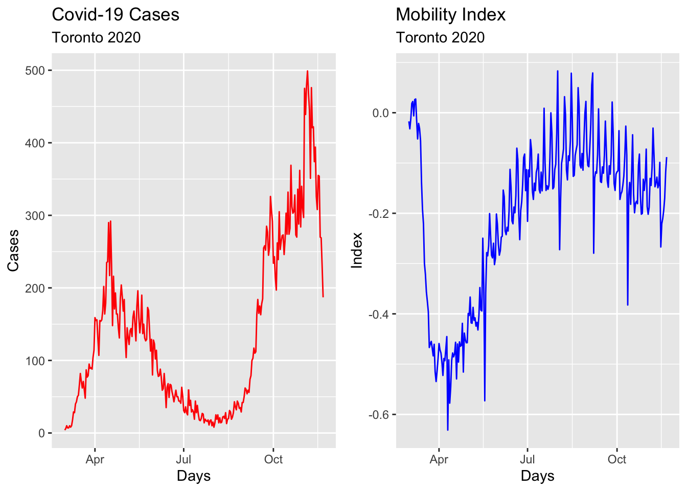
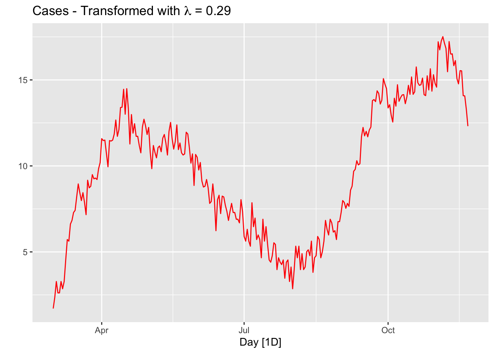
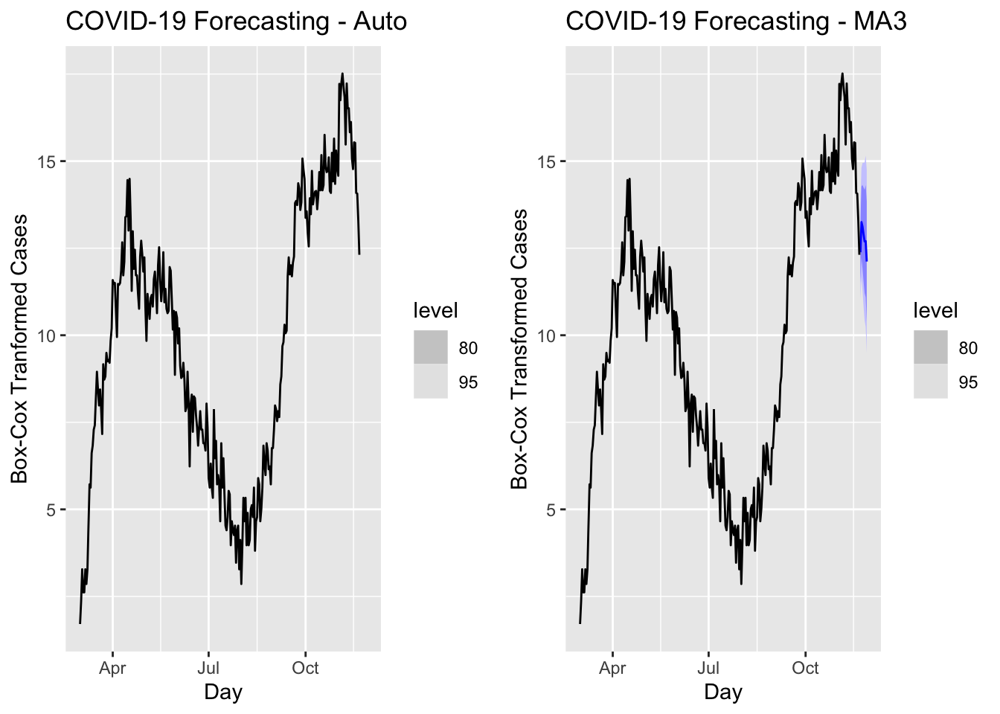
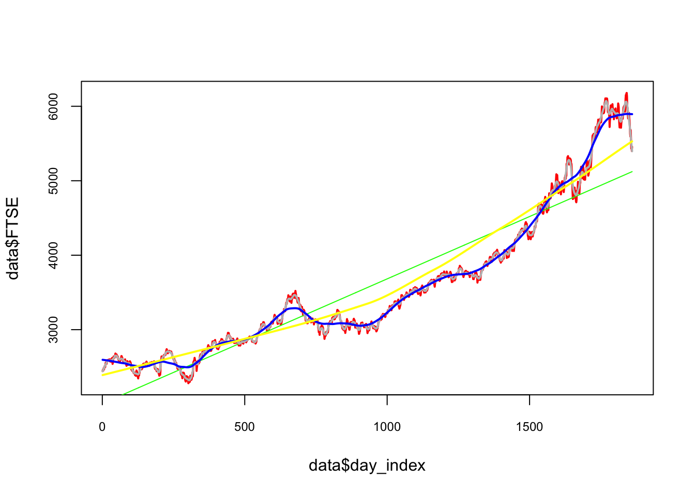
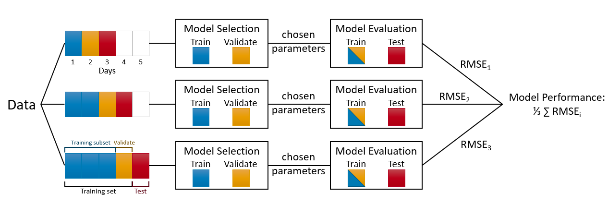

# Time Series


 (PART) Time Series {.unnumbered}

 Forecasting {.unnumbered}

Time series forecasting is a task that involves using a model to predict future values of a time series based on its past values. The data consists of sequences of values that are recorded at regular intervals over a period of time, such as daily stock prices or monthly weather data. Time series forecasting can be approached using a variety of machine learning techniques, including linear regression, decision trees, and neural networks.

One key difference between time series forecasting and other types of machine learning tasks is the presence of temporal dependencies in the data. In time series data, the value at a particular time point is often influenced by the values that came before it, which means that the order in which the data points are presented is important. This can make time series forecasting more challenging, as the model must take into account the relationships between past and future values in order to make accurate predictions.

One of the most accessible and comprehensive source on forecasting using R is [Forecasting: Principles and Practice](https://otexts.com/fpp3/) (FPP3) by Rob J Hyndman and George Athanasopoulos. The book now has the $3^{rd}$ edition that uses the `tsibble` and `fable` packages rather than the `forecast` package. This brings a better integration to the tidyverse collection of packages. A move from FPP2 to FPP3 brings a move from `forecast` to `fable`. The main difference is that `fable` is designed for `tsibble` objects and `forecast` is designed for `ts` objects [^18-timeseriesarima-1].

[^18-timeseriesarima-1]: There is a paper, \<<https://robjhyndman.com/publications/tsibble/>), by Wang et al. (2020) describing `tsibble` and the package in more details

In this section, we will use the `tsibble` and `fable` packages along with the `fpp3` package and cover five main topics: applications with ARIMA models, grid search for ARIMA, time series embedding, forecasting with random forests, and artificial neural network applications, RNN and LSTM. The time-series analysis and forecasting is a very deep and complex subject, which is beyond the scope of this book to cover in detail. FPP3 is free and very accessible even for those without a strong background on time-series forecasting. Therefore, this section assumes that some major concepts, like stationarity, time series decomposition, and exponential smoothing, are already understood by further readings of FPP3.

## ARIMA models

ARIMA (Autoregressive Integrated Moving Average) is a main statistical model for time series forecasting. It is a linear parametric model that can be used to analyze and forecast data that exhibit temporal dependencies, such as seasonality and autocorrelation. The model is comprised of three components:

-   Autoregressive (AR) component, which models the dependencies between the current value and the past values in the data.
-   Integrated (I) component, which refers to the degree of differencing that is applied to the time series data. The degree of differencing is the number of times that the data is differenced in order to make it stationary. The stationarity means that the mean, variance, and covariance are constant over time.
-   Moving average (MA) component, which models the dependencies between the current and the past forecast errors. The MA component of an ARIMA model is used to capture the short-term fluctuations in data that are not captured by the AR component. For example, if the time series data exhibits random noise or sudden spikes, the MA component can help to smooth out these fluctuations and improve the forecast accuracy.

The ARIMA model can be written as ARIMA(p,d,q), where p is the order of the autoregressive component, d is the degree of differencing, and q is the order of the moving average component. The values of p, d, and q are chosen based on the characteristics of the time series data to achieve maximum forecasting accuracy. To use the ARIMA model, the time series data must first be preprocessed to remove any trend and seasonality, and to ensure that the data is stationary. The model is then fit to the preprocessed data, and forecasts are generated based on the fitted model.

The mathematical foundation of the ARIMA model is based on the concept of autoregressive (AR) and moving average (MA) processes. An autoregressive process is a type of stochastic process in which the current value of a time series depends on a linear combination of past values of the series. An autoregressive process can be represented mathematically as:

$$
X_{t} = c + \sum_{i=1}^{p}(\phi_{i}  X_{t-i}) + \epsilon_{t},
$$

where $X_{t}$ is the value of the time series at time $t$, $c$ is a constant, $\phi_{i}$ is the autoregressive coefficient for lag $i$, and $\epsilon_{t}$ is white noise (a sequence of random variables with a mean of zero and a constant variance).

A moving average process is a type of stochastic process in which the current value of a time series depends on a linear combination of past errors or residuals (the difference between the actual value and the forecasted value). A moving average process can be represented mathematically as:

$$
X_{t} = c + \sum_{i=1}^{q}(\theta_{i}  \epsilon_{t-i}) + \epsilon_{t},
$$

where $\theta_{i}$ is the moving average coefficient for lag $i$, and $\epsilon_{t}$ is again white noise.

The ARIMA model, which is a combination of autoregressive and moving average processes, can be represented mathematically as:

$$
X_{t} = c + \sum_{i=1}^{p}(\phi_{i}  X_{t-i}) + \sum_{i=1}^{q}(\theta_{i}  \epsilon_{t-i}) + \epsilon_{t}
$$

It is possible to write any stationary $\operatorname{AR}(p)$ model as an MA($\infty$) model by using repeated substitution. Here is the example for an $\mathrm{AR}(1)$ model without a constant:

$$
X_{t} = \phi_{1} X_{t-1} + \epsilon_{t} ~~~ \text{and} ~~~ X_{t-1} = \phi_{1} X_{t-2} + \epsilon_{t-1}\\
X_{t}=\phi_1\left(\phi_1 X_{t-2}+\epsilon_{t-1}\right)+\epsilon_t\\
=\phi_1^2 X_{t-2}+\phi_1 \epsilon_{t-1}+\epsilon_t\\
=\phi_1^3 X_{t-3}+\phi_1^2 \epsilon_{t-2}+\phi_1 \epsilon_{t-1}+\epsilon_t\\
\vdots
$$

With $-1<\phi_1<1$, the value of $\phi_1^k$ will get smaller as $k$ gets bigger. Therefore, $\mathrm{AR}(1)$ becomes an MA $(\infty)$ process:

$$
X_t=\epsilon_t+\phi_1 \epsilon_{t-1}+\phi_1^2 \epsilon_{t-2}+\phi_1^3 \epsilon_{t-3}+\cdots
$$ The parameters of the ARIMA model ($c$, $\phi_{i}$, $\theta_{i}$) are estimated using maximum likelihood estimation (MLE), which involves finding the values of the parameters that maximize the likelihood of the observed data given the model. Once the model has been fit to the data, it can be used to make point forecasts (predictions for a specific time point) or interval forecasts (predictions with a range of possible values).

Some common methods for selecting p and q include in the ARIMA(p,d,q):

-   Autocorrelation function (ACF) plot, which shows the correlations between the time series data and lagged versions of itself. A high positive autocorrelation at a lag of p suggests that p may be a good value for p in ARIMA(p,d,q).
-   Partial autocorrelation function (PACF) plot, which shows the correlations between the time series data and lagged versions of itself, after accounting for the correlations at all lower lags. A high positive autocorrelation at a lag of q suggests the value for q in ARIMA(p,d,q).
-   There are several statistical measures that can be used to compare the goodness of fit of different ARIMA models, such as Akaike's Information Criterion (AIC) and the Bayesian Information Criterion (BIC). These measures can be used to select the model with the lowest value, which is generally considered to be the best model.

It is important to note that determining the values of p and q is an iterative process, and we may need to try different values and evaluate the results in order to find the best fit for our data.

## Hyndman-Khandakar algorithm

The Hyndman-Khandakar algorithm ([Hyndman & Khandakar](https://www.jstatsoft.org/article/view/v027i03), 2008) combines several steps for modeling (and estimation) of the ARIMA model: unit root tests, minimization of the AICc, and MLE to obtain an ARIMA model. The arguments to `ARIMA()` in the `fable` package provide for many variations for modeling ARIMA. The modeling procedure to a set of (non-seasonal) time series data for ARIMA is defined in FPP3 as follows:

1.  Plot the data to identify any outliers.
2.  If the data shows variation that increases or decreases with the level of the series, transform the data (Box-Cox transformation) to stabilize the variance.
3.  Check if the data are non-stationary. And, make them stationary, if they are not.
4.  Start with an ARIMA $(p, d, 0)$ or ARIMA $(0, d, q)$ depending of what ACF/PACF indicates.
5.  Try your chosen model(s), and use the AICc to search for a better model.

However, after step 5, the residuals from the chosen model are supposed to be white noise. Otherwise, the model has to be modified. Once the residuals look like white noise, the ARIMA model is ready for forecasting.

We will show all these steps by using the epidemic curve of COVID-19 in Toronto covering 266 days between the March $1^{st}$ and the November $21^{st}$ of 2020. An epidemic curve (or epi curve) is a visual display of the onset of illness among cases associated with an outbreak. The data contain the first wave and the first part of the second wave. It is from [Ontario Data Catalogue](https://data.ontario.ca/en/dataset?groups=2019-novel-coronavirus#byPHU) sorted by `Episode Date`, which is the date when the first symptoms were started. Our data set also contains the mobility data is from Facebook, `all_day_bing_tiles_visited_relative_change`, which reflects positive or negative changes in movement relative to baseline.

## TS Plots

Let's first load the data and convert it to `tsibble`.


```r
library(tsibble)
library(fpp3)

load("dftoronto.RData")
day <- seq.Date(
  from = as.Date("2020/03/01"),
  to = as.Date("2020/11/21"),
  by = 1
)

tdata <- tibble(Day = day,
                mob = data$mob,
                cases = data$cases)

toronto <- tdata %>%
  as_tsibble(index = Day)

toronto
```

```
## # A tsibble: 266 x 3 [1D]
##    Day             mob cases
##    <date>        <dbl> <dbl>
##  1 2020-03-01 -0.0172      4
##  2 2020-03-02 -0.0320      6
##  3 2020-03-03 -0.0119     10
##  4 2020-03-04  0.0186      7
##  5 2020-03-05  0.0223      7
##  6 2020-03-06 -0.00626    10
##  7 2020-03-07  0.0261      8
##  8 2020-03-08  0.0273     10
##  9 2020-03-09 -0.0158     18
## 10 2020-03-10 -0.0521     29
## # ℹ 256 more rows
```

Note the `[1D]` in the header indicating daily data. Dealing with daily and sub-daily data with `ts` class is not an easy process. The `tsibble` class handles such data with no problem. More details on `tsibbles` can be found at [Tidy time series data using tsibbles](https://robjhyndman.com/hyndsight/tsibbles/).

Although there are better plotting option cosmetically, we will stick to what `fpp3` simply offers:


```r
a <- toronto %>% autoplot(mob, col = 'blue') +
  labs(
    title = "Mobility Index",
    subtitle = "Toronto 2020",
    x = "Days",
    y = "Index"
  )
b <- toronto %>% autoplot(cases, col = 'red') +
  labs(
    title = "Covid-19 Cases",
    subtitle = "Toronto 2020",
    x = "Days",
    y = "Cases"
  )

require(gridExtra)
grid.arrange(b, a, ncol = 2)
```



## Box-Cox transformation

We would like to make the size of the variation about the same across the whole series. A proper variance-stabilizing transformation makes the forecasting model simpler and better. For example, Proietti and Lutkepohl (2012) find that the Box--Cox transformation produces forecasts which are significantly better than the untransformed data at the one-step-ahead horizon (See [Does the Box--Cox transformation help in forecasting macroeconomic time series?](https://www.sciencedirect.com/science/article/abs/pii/S0169207012000830)).


```r
lmbd <- toronto %>%
  features(cases, features = guerrero) %>%
  pull(lambda_guerrero)

toronto %>%
  autoplot(box_cox(cases, lambda = lmbd), col = "red") +
  labs(y = "",
       title = latex2exp::TeX(paste0(
         "Cases - Transformed with $\\lambda$ = ",
         round(lmbd, 2)
       )))
```



The option `guerrero` computes the optimal $\lambda$ value for a Box-Cox transformation using the [Guerrero](https://onlinelibrary.wiley.com/doi/10.1002/for.3980120104) method.

Note that, since the number of tests performed in a given day changes the numbers of cases, we should use "positivity rates", which is the percentage of positive results in all COVID-19 tests given any day, instead of case numbers. We ignore this problem for now.

## Stationarity

A time series is called stationary if a shift in time does not cause a change in the shape of the distribution: the mean, variance, and covariance. Stationarity is an important assumption in many time series forecasting methods, because non-stationary data have statistical properties that change over time making the current patterns and trends ungeneralizable for the future.

There are several tests that can be used to determine whether a time series is stationary or not, including the Dickey-Fuller and KPSS (Kwiatkowski-Phillips-Schmidt-Shin) tests. If a time series is found to be non-stationary, it may be necessary to transform the data in some way before applying a forecasting method in order to obtain reliable forecasts. The main method is differencing, which involves taking the difference between consecutive values in the series.

Let's first formally test all these series and see what we get:


```r
# number of first differences
toronto %>%
  features(cases, unitroot_ndiffs)
```

```
## # A tibble: 1 × 0
```

```r
# Formal KPSS test on level
toronto %>%
  features(cases, unitroot_kpss)
```

```
## # A tibble: 1 × 0
```

```r
# Formal KPSS test on the first difference
toronto %>%
  mutate(diffcases = difference(cases)) %>%
  features(diffcases, unitroot_kpss)
```

```
## # A tibble: 1 × 0
```

It seems that the first difference can make the `cases` series stationary. The null in this test suggests that the series are stationary, and the p-value indicates that the null is rejected. So, it seems that the test after first differencing gives us a green light! However, ACF's are telling us that seasonal differencing would be needed:


```r
level <- toronto %>% ACF(cases) %>%
  autoplot() + labs(subtitle = "Covid-19 Cases")

fdiff <- toronto %>% ACF(difference(cases)) %>%
  autoplot() + labs(subtitle = "First-difference")

diffbc <- toronto %>% ACF(difference(box_cox(cases, lmbd))) %>%
  autoplot() + labs(subtitle = "First-difference Box-Cox")

ddiff <-
  toronto %>% ACF(difference(difference(box_cox(cases, lmbd)))) %>%
  autoplot() + labs(subtitle = "Double-difference Box-Cox")

require(gridExtra)
grid.arrange(level, fdiff, diffbc, ddiff, ncol = 2, nrow = 2)
```


From ACF's, there seems to be a weekly seasonal pattern at 7, 14, and 21, which are Sundays. We know that reported Covid-19 cases on Sundays tend to be lower than the rest of the week at least during the first wave.

We can also test if we need seasonal differencing:


```r
toronto %>%
  features(cases, unitroot_nsdiffs)
```

```
## # A tibble: 1 × 1
##   nsdiffs
##     <int>
## 1       0
```

```r
# with Box-Cox
toronto %>%
  features(box_cox(cases, lmbd), unitroot_nsdiffs)
```

```
## # A tibble: 1 × 1
##   nsdiffs
##     <int>
## 1       0
```

The feature `unitroot_nsdiffs` returns 0 for both original and transformed series indicating no seasonal difference is required. We will stick to this "advice" because of two reasons. First, an unnecessary differencing would create more problems than a solution. Second, we can also modify ARIMA to incorporate seasonalllty in the data, which we will see shortly.

Yet, out of curiosity, let's remove the "seemingly" weekly seasonality and see what happens to ACF's. Since, the order of differencing is not important, we first applied the seasonal differencing then applied the first difference:


```r
toronto %>%
  gg_tsdisplay(difference(box_cox(cases, lmbd), 7) %>% difference(),
               plot_type = 'partial',
               lag = 36) +
  labs(title = "Seasonal & first differenced", y = "")
```


We can calculate the strength of the trend (T) and seasonality (S) in the time series, $y_t=T_t+S_t+R_t$, by

$$
F_{Trend}=\max \left(0,1-\frac{\operatorname{Var}\left(R_t\right)}{\operatorname{Var}\left(T_t+R_t\right)}\right),\\
F_{Seasonality}=\max \left(0,1-\frac{\operatorname{Var}\left(R_t\right)}{\operatorname{Var}\left(S_t+R_t\right)}\right),
$$

where $R_t$ is the remainder component:


```r
t <- toronto %>% features(cases, feat_stl)
t(t[1:2])
```

```
##                             [,1]
## trend_strength         0.9843102
## seasonal_strength_week 0.5142436
```

Relative to $F_{Trend}$, the seasonality is not robust in the data. So, our decision is to go with a simple first-differencing with Box-Cox transformation. However, we will look at the final predictive performance if the transformation provides any benefit.

## Modeling ARIMA

In his post, [Forecasting COVID-19](https://robjhyndman.com/hyndsight/forecasting-covid19/#how-can-we-forecast-covid-19), Rob J Hyndman makes the following comment in March 2020:

> (...) the COVID-19 pandemic, it is easy to see why forecasting its effect is difficult. While we have a good understanding of how it works in terms of person-to-person infections, we have limited and misleading data. The current numbers of confirmed cases are known to be vastly underestimated due to the limited testing available. There are almost certainly many more cases of COVID-19 that have not been diagnosed than those that have. Also, the level of under-estimation varies enormously between countries. In a country like South Korea with a lot of testing, the numbers of confirmed cases are going to be closer to the numbers of actual cases than in the US where there has been much less testing. So we simply cannot easily model the spread of the pandemic using the data that is available.

> The second problem is that the forecasts of COVID-19 can affect the thing we are trying to forecast because governments are reacting, some better than others. A simple model using the available data will be misleading unless it can incorporate the various steps being taken to slow transmission.

> In summary, fitting simple models to the available data is pointless, misleading and dangerous.

With our selection of the data, we do not intent to create another debate on forecasting COVID-19. There are hundreds of different forecasting models currently operational in a hub, [The COVID-19 Forecast Hub](https://covid19forecasthub.org), that can be used live. We will start with an automated algorithm `ARIMA()` that will allow a seasonal parameters:

$$
\text { ARIMA }(p, d, q) \times(P, D, Q) S
$$

The first term is the non-seasonal part of ARIMA with $p=$ AR order, $d=$ non-seasonal differencing, $q=$ MA order. The secon term is seasonal part of the model with $P=$ seasonal AR order, $D=$ seasonal differencing, $Q$ = seasonal MA order, and $S=$ seasonal pattern, which defines the number of time periods until the pattern repeats again.

In our case, low values tend always to occur in some particular days, Sundays. Therefore, we may think that $\mathrm{S}=7$ is the span of the periodic seasonal behavior in our data. We can think of a seasonal first order autoregressive model, AR(1), would use $X_{t-7}$ to predict $X_t$. Likewise, a seasonal second order autoregressive model would use $X_{t-7}$ and $X_{t-14}$ to predict $X_t$. A seasonal first order MA(1) model would use $\epsilon_{t-7}$ as a predictor. A seasonal second order MA(2) model would use $\epsilon_{t-7}$ and $\epsilon_{t-14}$.

Let's use our data first-differenced and transformed:


```r
toronto <- toronto %>% 
  mutate(boxcases = box_cox(cases, lambda = lmbd))

toronto %>%
  gg_tsdisplay(difference(boxcases), plot_type='partial')
```


We look at the spikes and decays in ACF and PACF: a exponential decay in ACF is observed at seasonal spikes of 7, 14, and 21 as well as two spikes at 7 and 14 in PACF indicate seasonal AR(2). We will also add non-seasonal AR(2) due to 2 spikes in PACF at days 1 and 2. Here are our initial models:

$$
\operatorname{ARIMA}(2,1,0)(2,1,0)_{7}\\
\operatorname{ARIMA}(0,1,2)(0,1,3)_{7}
$$


```r
covfit <- toronto %>%
  model(
    AR2 = ARIMA(boxcases ~ pdq(2, 1, 0) + PDQ(3, 1, 0)),
    MA3 = ARIMA(boxcases ~ pdq(0, 1, 2) + PDQ(0, 1, 3)),
    auto = ARIMA(boxcases, stepwise = FALSE, approx = FALSE)
  )

t(cbind(
  "AR2" = covfit$AR2,
  "MA3" = covfit$MA3,
  "auto" = covfit$auto
))
```

```
##      [,1]                  
## AR2  ARIMA(2,1,0)(3,1,0)[7]
## MA3  ARIMA(0,1,2)(0,1,3)[7]
## auto NULL model
```

```r
glance(covfit) %>% arrange(AICc) %>% dplyr::select(.model:BIC)
```

```
## # A tibble: 2 × 6
##   .model sigma2 log_lik   AIC  AICc   BIC
##   <chr>   <dbl>   <dbl> <dbl> <dbl> <dbl>
## 1 MA3     0.468   -277.  567.  567.  588.
## 2 AR2     0.534   -285.  582.  583.  604.
```

```r
covfit %>% dplyr::select(MA3) %>% report()
```

```
## Series: boxcases 
## Model: ARIMA(0,1,2)(0,1,3)[7] 
## 
## Coefficients:
##           ma1     ma2     sma1     sma2     sma3
##       -0.4340  0.1330  -0.8617  -0.0573  -0.0809
## s.e.   0.0648  0.0612   0.0827   0.0733   0.0600
## 
## sigma^2 estimated as 0.4684:  log likelihood=-277.29
## AIC=566.58   AICc=566.92   BIC=587.9
```

The `ARIMA()` function uses `unitroot_nsdiffs()` to determine $D$ when it is not specified. Earlier, we run this function that suggested no seasonal differencing.

All other parameters are determined by minimizing the AICc (Akaike's Information Criterion with a correction for finite sample sizes), which is similar to Akaike's Information Criterion (AIC), but it includes a correction factor to account for the fact that the sample size may be small relative to the number of parameters in the model. This correction helps to reduce the bias in the AIC estimate and make it more accurate for small sample sizes. When the sample size is large, AIC and AICc are nearly equivalent and either one can be used.

Although AICc values across the models are not comparable (for "auto", as it has no seasonal differencing), it seems that our manually constructed ARIMA, $\operatorname{ARIMA}(0,1,2)(0,1,3)_{7}$ could also be an option. This brings the possibility of a grid search to our attention.

Before that, however, let's check their residuals:


```r
rbind(
  augment(covfit) %>%
    filter(.model == "auto") %>%
    features(.innov, ljung_box, lag = 24, dof = 5),
  augment(covfit) %>%
    filter(.model == "MA3") %>%
    features(.innov, ljung_box, lag = 24, dof = 5),
  augment(covfit) %>%
    filter(.model == "AR2") %>%
    features(.innov, ljung_box, lag = 24, dof = 5)
)
```

```
## # A tibble: 3 × 3
##   .model lb_stat lb_pvalue
##   <chr>    <dbl>     <dbl>
## 1 auto      NA     NA     
## 2 MA3       27.3    0.0971
## 3 AR2       21.1    0.331
```


```r
covfit %>%dplyr::select(MA3) %>% gg_tsresiduals(lag=36)
```


There are several significant spikes in the ACF. But, the model passes the Ljung-Box test at the 5 percent significance level.

Meanwhile, a model without white noise errors can still be used for forecasting, but the prediction intervals may not be accurate due to the correlated residuals. Sometimes, we cannot find a model that passes this test. In practice, we may have to look at the tradeoff between prediction accuracy and reliable confidence intervals. If the difference is too high, we may chose the best model with the highest prediction accuracy.

Before looking at a cross-validation approach for model selection in ARIMA modeling, let use our model to predict a week ahead (2020-11-22 to 2020-11-28):


```r
fc <- covfit %>%
  forecast(h = 7)
fc
```

```
## # A fable: 21 x 4 [1D]
## # Key:     .model [3]
##    .model Day           boxcases .mean
##    <chr>  <date>          <dist> <dbl>
##  1 AR2    2020-11-22 N(12, 0.53)  12.1
##  2 AR2    2020-11-23 N(13, 0.68)  13.3
##  3 AR2    2020-11-24 N(13, 0.87)  12.8
##  4 AR2    2020-11-25  N(13, 1.1)  12.8
##  5 AR2    2020-11-26  N(12, 1.3)  12.2
##  6 AR2    2020-11-27  N(12, 1.5)  12.3
##  7 AR2    2020-11-28  N(12, 1.7)  11.5
##  8 MA3    2020-11-22 N(12, 0.48)  12.4
##  9 MA3    2020-11-23 N(13, 0.63)  13.2
## 10 MA3    2020-11-24 N(13, 0.87)  13.1
## # ℹ 11 more rows
```


```r
fc %>%
  autoplot(toronto, level = NULL) +
  xlab("Days") + ylab("Transformed Cases with Box-Cox")
```


```r
a <- forecast(covfit, h = 7) %>%
  filter(.model == 'auto') %>%
  autoplot(toronto) +
  labs(title = "COVID-19 Forecasting - Auto",
       y = "Box-Cox Tranformed Cases")
b <- forecast(covfit, h = 7) %>%
  filter(.model == 'MA3') %>%
  autoplot(toronto) +
  labs(title = "COVID-19 Forecasting - MA3",
       y = "Box-Cox Transformed Cases")

require(gridExtra)
grid.arrange(a, b, ncol = 2)
```



We have predicted values for coming 7 days but we do not have realized values. Hence, we cannot compare these models in terms of their accuracy. We can look at the forecast accuracy of these models by using a training set containing all data up to 2020-11-14. When we forecast the remaining seven days in the data, we can calculate the prediction accuracy.


```r
train <- toronto %>%
  filter_index( ~ "2020-11-14")

fit <- train %>%
  model(
    AR2 = ARIMA(boxcases ~ pdq(2, 1, 0) + PDQ(3, 1, 0)),
    MA3 = ARIMA(boxcases ~ pdq(0, 1, 2) + PDQ(0, 1, 3)),
    auto = ARIMA(boxcases, stepwise = FALSE, approx = FALSE)
  ) %>%
  mutate(mixed = (auto + AR2 + MA3) / 3)
```

Although mixing several different ARIMA models does not make sense, we can have an ensemble forecast mixing several different time series models in addition ARIMA modeling. A nice discussion can be found in this [post](https://stackoverflow.com/questions/70183054/time-series-forecasting-using-fable-in-r-determining-most-optimum-combination-o) at Stackoverflow.

And, now the accuracy measures:


```r
fc <- fit %>% forecast(h = 7)
fc %>%
  autoplot(toronto, level = NULL)
```


```r
accuracy(fc, toronto)
```

```
## # A tibble: 4 × 10
##   .model .type     ME   RMSE    MAE   MPE  MAPE   MASE  RMSSE   ACF1
##   <chr>  <chr>  <dbl>  <dbl>  <dbl> <dbl> <dbl>  <dbl>  <dbl>  <dbl>
## 1 AR2    Test   -1.57   1.88   1.57 -11.6  11.6   1.35   1.30  0.359
## 2 MA3    Test   -1.61   1.91   1.61 -11.9  11.9   1.38   1.32  0.501
## 3 auto   Test  NaN    NaN    NaN    NaN   NaN   NaN    NaN    NA    
## 4 mixed  Test  NaN    NaN    NaN    NaN   NaN   NaN    NaN    NA
```

In all measures, the model "auto" (ARIMA with the Hyndman-Khandakar algorithm) is better than others.

Finally, it is always good to check ARIMA (or any time series forecasting) against the base benchmark.


```r
bfit <- train %>%
  model(ave = MEAN(boxcases),
        lm = TSLM(boxcases ~ trend() + season()))

bfc <- bfit %>% forecast(h = 7)

bfc %>%
  autoplot(toronto, level = NULL)
```


```r
accuracy(bfc, toronto)
```

```
## # A tibble: 2 × 10
##   .model .type    ME  RMSE   MAE   MPE  MAPE  MASE RMSSE  ACF1
##   <chr>  <chr> <dbl> <dbl> <dbl> <dbl> <dbl> <dbl> <dbl> <dbl>
## 1 ave    Test   4.59  4.72  4.59  31.8  31.8  3.94  3.26 0.507
## 2 lm     Test   2.07  2.32  2.07  14.1  14.1  1.77  1.60 0.516
```

The results shows our ARIMA model is doing much better job relative to a time-series linear model or a simple average.

As we discussed earlier in this book, there are basically two ways to select a best fitting predictive model: **ex-post** and **ex-ante** tools to penalize the overfitting. With AIC (Akaike Information Criterion) and BIC (Bayesian Information Criteria) measures, we can indirectly estimate the test (out-of-sample) error by making an adjustment to the training (in-sample) error to account for the bias due to overfitting. Therefore, these methods are ex-post tools to penalize the overfitting. The Hyndman-Khandakar algorithm uses this ex-post approach by selecting the best predictive ARIMA model with minimum AICc among alternatives.

We can directly estimate the test error (out-sample) and choose the model that minimizes it. Instead of selecting a model with AICc, we can do it by tuning the parameters of ARIMA with a cross-validation approach so that the tuned model achieves the highest predictive accuracy.


## Grid search for ARIMA

Before we apply a cross validation approach to choose the model that has the minimum test error (out-sample), we would like to do a grid search for a seasonal ARIMA with $d=1$, $D=1$, and $S=7$.  We will report two outcomes: AICc and RMSE (root mean squared error).


  

```r
#In-sample grid-search
p <- 0:3
q <- 0:3
P <- 0:3
Q <- 0:2

comb <- as.matrix(expand.grid(p, q, P, Q))

# We remove the unstable grids
comb <- as.data.frame(comb[-1,])
ind <- which(comb$Var1 == 0 & comb$Var2 == 0, arr.ind = TRUE)
comb <- comb[-ind,]
row.names(comb) <- NULL
colnames(comb) <- c("p", "q", "P", "Q")

aicc <- c()
RMSE <- c()

for (k in 1:nrow(comb)) {
  tryCatch({
    fit <- toronto %>%
      model(ARIMA(boxcases ~ 0 + pdq(comb[k, 1], 1, comb[k, 2])
                  + PDQ(comb[k, 3], 1, comb[k, 4])))
    wtf <- fit %>% glance
    res <- fit %>% residuals()
    aicc[k] <- wtf$AICc
    RMSE[k] <- sqrt(mean((res$.resid) ^ 2))
  }, error = function(e) {
  })
}

cbind(comb[which.min(aicc), ], "AICc" = min(aicc, na.rm = TRUE))
```

```
##    p q P Q     AICc
## 75 3 3 0 1 558.7746
```

```r
cbind(comb[which.min(RMSE), ], "RMSE" = min(RMSE, na.rm = TRUE))
```

```
##     p q P Q      RMSE
## 120 3 3 3 1 0.6478857
```

Although we set the ARIMA without a constant, we could extend the grid with a constant. We can also add a line (`ljung_box`) that extracts and reports the Ljung-Box test for each model.  We can then select the one that has a minimum AICc and passes the test.
  
We may not need this grid search as the Hyndman-Khandakar algorithm for automatic ARIMA modelling is able to do it for us very effectively (except for the Ljung-Box test for each model).  We should note that the Hyndman-Khandakar algorithm selects the best ARIMA model for forecasting with the minimum AICc. In practice, we can apply a similar grid search with cross validation for selecting the best model that has the minimum out-of-sample prediction error without checking if it passes the Ljung-Box test or not.  Here is a simple example:


```r
#In-sample grid-search
p <- 0:3
q <- 0:3
P <- 0:3
Q <- 0:2

comb <- as.matrix(expand.grid(p, q, P, Q))

# We remove the unstable grids
comb <- as.data.frame(comb[-1,])
ind <- which(comb$Var1 == 0 & comb$Var2 == 0, arr.ind = TRUE)
comb <- comb[-ind, ]
row.names(comb) <- NULL
colnames(comb) <- c("p", "q", "P", "Q")

train <- toronto %>%
  filter_index( ~ "2020-11-14")

RMSE <- c()

for (k in 1:nrow(comb)) {
  tryCatch({
    amk <- train %>%
      model(ARIMA(boxcases ~ 0 + pdq(comb[k, 1], 1, comb[k, 2])
                  + PDQ(comb[k, 3], 1, comb[k, 4]))) %>%
      forecast(h = 7) %>%
      accuracy(toronto)
    RMSE[k] <- amk$RMSE
  }, error = function(e) {
  })
}

cbind(comb[which.min(RMSE), ], "RMSE" = min(RMSE, na.rm = TRUE))
```

```
##    p q P Q      RMSE
## 12 0 3 0 0 0.7937723
```

```r
g <- which.min(RMSE)
toronto %>%
  model(ARIMA(boxcases ~ 0 + pdq(comb[g, 1], 1, comb[g, 2])
              + PDQ(comb[g, 3], 1, comb[g, 4]))) %>%
  forecast(h = 7) %>%
  autoplot(toronto, level = NULL)
```


  
We will not apply h-step-ahead rolling-window cross-validations for ARIMA, which can be found in the post, [Time series cross-validation using fable](https://robjhyndman.com/hyndsight/tscv-fable/), by Hyndman (2021).  However, when we have multiple competing models, we may not want to compare their predictive accuracy by looking at their error rates using only few out-of-sample observations.  If we use rolling windows or continuously expanding windows, we can effectively create a large number of days tested within the data.       


## Hyperparameter tuning with time-series data:

While we have a dedicated section (Section VII) on forecasting with times series data, we will complete this chapter by looking at the fundamental differences between time-series and cross-sectional in terms of grid search.     

We will use the `EuStockMarkets` data set pre-loaded in R. The data contains the daily closing prices of major European stock indices: Germany DAX (Ibis), Switzerland SMI, France CAC, and UK FTSE. The data are sampled in business time, i.e., weekends and holidays are omitted. We will focus on the FTSE. Below, the data and its plot:  


```r
#Data
data <- as.data.frame(EuStockMarkets)
day_index <- seq(1, nrow(data), by = 1)
data <- cbind(data, day_index)
head(data)
```

```
##       DAX    SMI    CAC   FTSE day_index
## 1 1628.75 1678.1 1772.8 2443.6         1
## 2 1613.63 1688.5 1750.5 2460.2         2
## 3 1606.51 1678.6 1718.0 2448.2         3
## 4 1621.04 1684.1 1708.1 2470.4         4
## 5 1618.16 1686.6 1723.1 2484.7         5
## 6 1610.61 1671.6 1714.3 2466.8         6
```

```r
plot(
  data$day_index,
  data$FTSE,
  col = "orange",
  cex.main = 0.80,
  cex.axis = 0.75,
  type = "l"
)
```


We can use smoothing methods to detect trends in the presence of noisy data especially in cases where the shape of the trend is unknown.  A decomposition would show the components of the data: trend, seasonal fluctuations, and the noise, which  is **unpredictable** and remainder of after the trend (and seasonality) is removed  Here is an illustration for the FTSE with additive decomposition:  


```r
tsd <- EuStockMarkets
dctsd <- decompose(tsd[, 4])
plot(dctsd, col = "red")
```


  
Separating the trend from the noise will enable us to predict the future values better.  Having learnt how to model a learning algorithm, we can also train `loess()` to extract the trend in FTSE.  Several smoothing lines are illustrated below to visualize the differences:   


```r
plot(
  data$day_index,
  data$FTSE,
  type = "l",
  col = "red",
  cex.main = 0.80,
  cex.axis = 0.75,
  lwd = 2
)
lines(data$day_index,  
      predict(lm(FTSE ~ day_index, data)), lwd = 1, col = "green")
lines(data$day_index,
      predict(loess(
        data$FTSE ~ data$day_index, degree = 1, span = 0.01
      )),
      lwd = 2,
      col = "grey")
lines(data$day_index,
      predict(loess(
        data$FTSE ~ data$day_index, degree = 1, span = 0.1
      )),
      lwd = 2,
      col = "blue")
lines(data$day_index,
      predict(loess(
        data$FTSE ~ data$day_index, degree = 1, span = 0.9
      )),
      lwd = 2,
      col = "yellow")
```


  
It seems that a linear trend is not appropriate as it underfits to predict. Although a smoothing method like `loess()` would be a good choice, but which `loess()` would be a good fit?  One way of validating time series data is to keep the time order in the data when we use k-fold cross validation so that in each fold the training data takes place before the test data.
  
This type of cross validation is called as **h-step-ahead rolling cross-validation**. (There is also a method called as **sliding-window-cross-validation**). Below we can see an illustration of this kind of cross validation:


We are going to split the data without a random shuffle: 


```r
span <- seq(from = 0.05, to = 1, by = 0.05) 
# *****h-step-rolling-CV********
h <- 10
opt <- c()
#CV loop
nvalid <- round(nrow(data) / h)
#This gives the 10 cutoff points in rows
cut <- c(1)
for (j in 1:h) {
  cut <- c(cut, nvalid * j)
}
for (i in 1:h) {
  if (i < h) {
    train <- data[(cut[1]:cut[i + 1]),]
  } else{
    train <- data[cut[1]:cut[i],]
  }
  if (i + 2 < h)
    valid <- data[(cut[i + 1]:cut[i + 2]),]
  
  RMSPE <- c(rep(0), length(span)) #Matrix to store RMSPE
  
  for (s in 1:length(span)) {
    model <-
      loess(
        FTSE ~ day_index,
        control = loess.control(surface = "direct"),
        degree = 2,
        span = span[s],
        data = train
      )
    fit <- predict(model, valid$day_index)
    RMSPE[s] <- sqrt(mean((valid$FTSE - fit) ^ 2))
  }
  opt[i] <- which(RMSPE == min(RMSPE), arr.ind = TRUE)
}
#Hyperparameters
opt_span <- mean(span[opt])
opt_span
```

```
## [1] 0.43
```

```r
plot(
  data$day_index,
  data$FTSE,
  type = "l",
  col = "gray",
  cex.main = 0.80,
  cex.axis = 0.75
)
lines(data$day_index,
      predict(loess(
        data$FTSE ~ data$day_index,
        degree = 2, span = opt_span
      )),
      lwd = 2,
      col = "red")
```


Note that we did not start this algorithm with the initial split for testing.  For the full train-validate-test routine the initial split has to be added into this cross-validation script.
  
Moreover, we started the validation after the first 10\% split.  We can also decide on this starting point.  For example, we can change the code and decide to train the model after 30\% training set.  That flexibility is specially important if we apply **Day Forward-Chaining Nested Cross-Validation**, which is the same method but *rolling windows* are the days. The following figure helps demonstrate this method: 




Although it is designed for a day-chained cross validation, we can replace *days* with weeks, months or 21-day windows.  In fact, our algorithm that uses 10\% splits can be considered a **10\% Split Forward-Chaining Nested Cross-Validation**.  We will see multiple applications with special methods unique to time series data in Section VII.  

## Speed
  
Before concluding this section, notice that as the sample size rises, the learning algorithms take longer to complete, specially for cross sectional data.  That's why there are some other cross-validation methods that use only a subsample randomly selected from the original sample to speed up the validation and the test procedures. You can think how slow the conventional cross validation would be if the dataset has 1-2 million observations, for example.

There are some methods to accelerate the training process.  One method is to increase the delta (the increments) in our grid and identify the range of hyperparameters where the RMSPE becomes the lowest.  Then we reshape our grid with finer increments targeting that specific range.
  
Another method is called a random grid search.  In this method, instead of the exhaustive enumeration of all combinations of hyperparameters, we select them randomly.  This can be found in [Random Search for Hyper-Parameter Optimization](https://jmlr.csail.mit.edu/papers/volume13/bergstra12a/bergstra12a.pdf) by James Bergstra and
Yoshua Bengio [-@Berg_2012].  
  
To accelerate the grid search, we can also use parallel processing so that each loop will be assigned to a separate core in capable computers.  We will see several application using these options later in the book.  Both methods are covered in Chapter 14.
  
Finally, we did not use functions in our algorithms.  We should create functions for each major process in algorithms and compile them in one clean "source" script.


