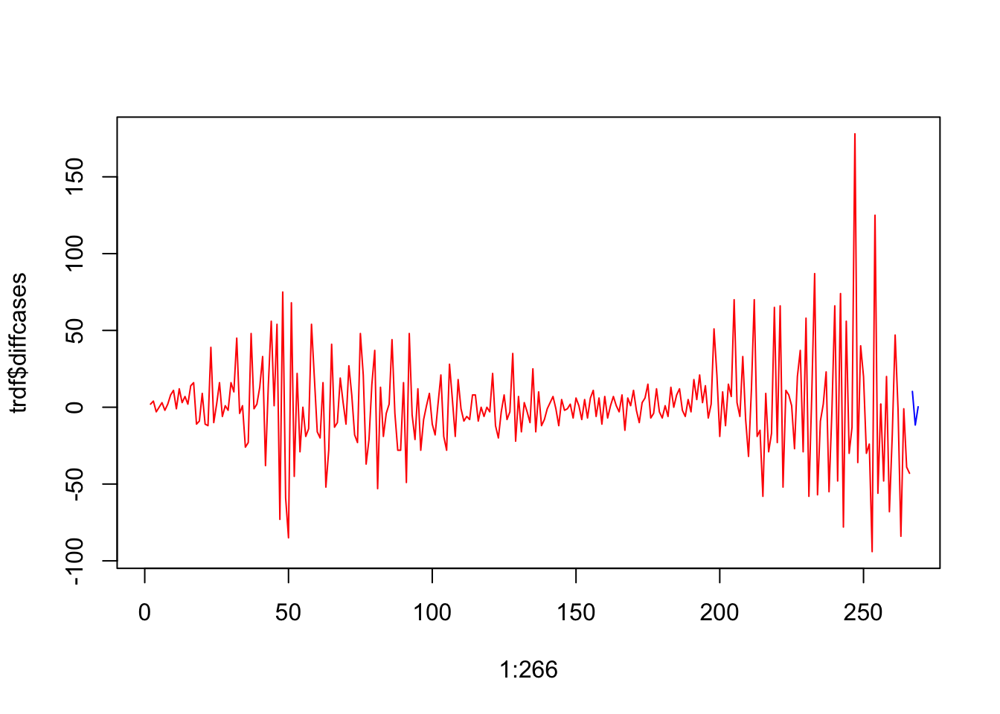
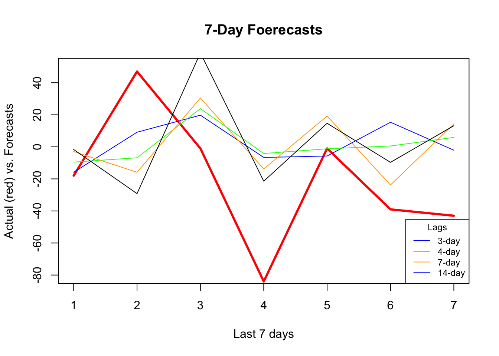
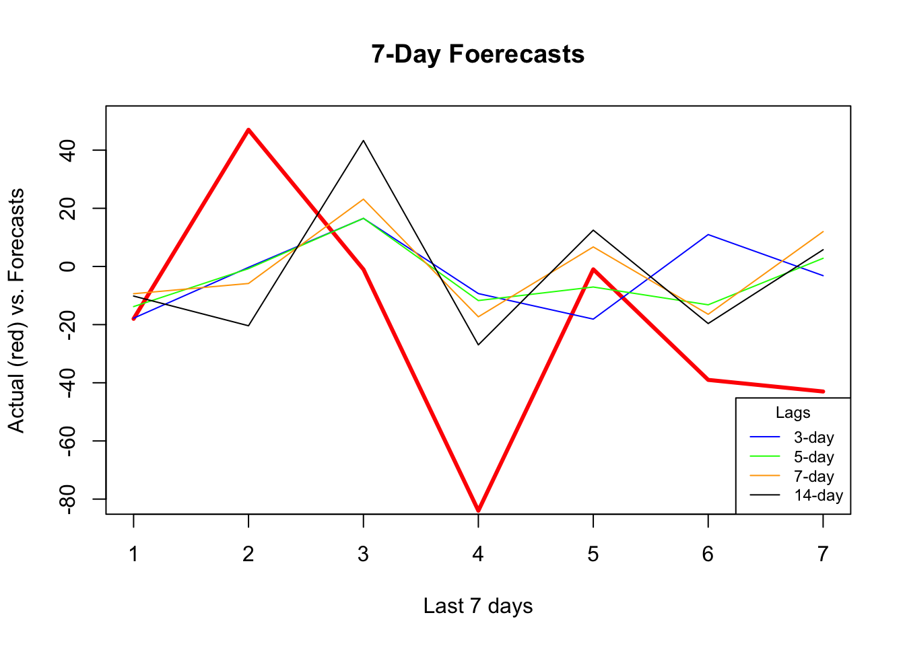
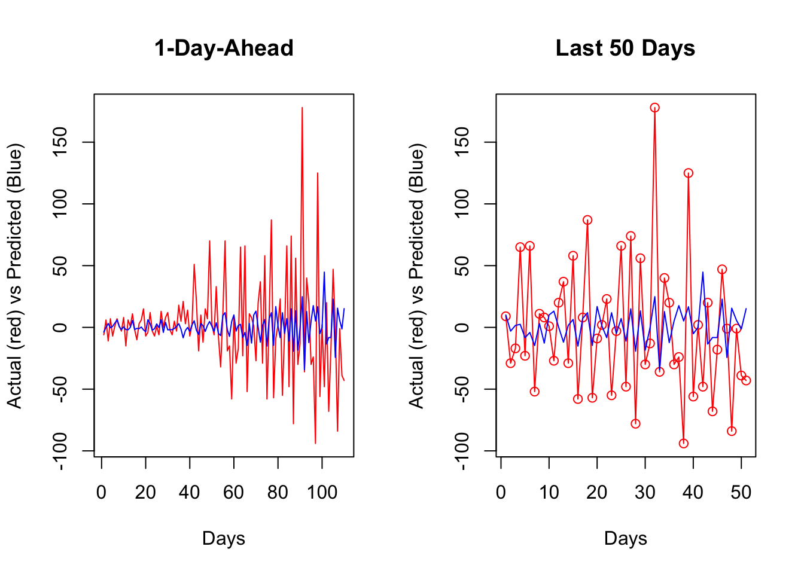
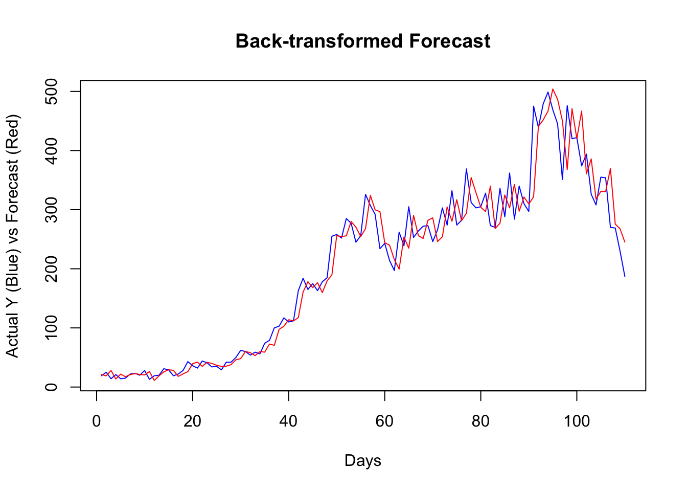

# Forecast

## Time Series Embedding

In general, forecasting models use either direct or recursive forecasting, or their combinations (See [Taieb and Hyndman](https://robjhyndman.com/papers/rectify.pdf), 2012).  The difference between these two methods is related to discussion on prediction accuracy and forecasting variance. 
  
Recursive forecasting requires a parametric model and would face increasing forecasting error when the underlying model is not linear. Direct forecasting, however, can be achieved by a nonparametric predictive algorithm, while it may have a higher variance as the forecast horizon gets longer.  

Multi-period recursive forecasting use a single time series model, like AR(1).  With iterative substitutions of the estimated model, any forecast period of $h$ can be computed.  Let's start with a simple AR(1) to see recursive forecasting:

$$
x_{t+1}=\alpha_0+\phi_1 x_t+\epsilon_{t}
$$

If we use this AR(1) to have a 3-period forecast:

$$
\hat{x}_{t+1}=\hat{\alpha}_0+\hat{\phi}_1 x_t, \\
\hat{x}_{t+2}=\hat{\alpha}_0+\hat{\phi}_1 \hat{x}_{t+1}, \\
\hat{x}_{t+3}=\hat{\alpha}_0+\hat{\phi}_1 \hat{x}_{t+2}
$$
With iterative substitutions:

$$
\hat{x}_{t+1}=\hat{\alpha}_0+\hat{\phi}_1 x_t ~~~~ 1^{st} ~ \text{Period}\\
\hat{x}_{t+2}=\hat{\alpha}_0+\hat{\alpha}_0\hat{\alpha}_1+\hat{\phi}^2_1 x_{t} ~~~~ 2^{nd} ~ \text{Period}\\
\hat{x}_{t+3}=\hat{\alpha}_0+\hat{\alpha}_0\hat{\alpha}_1+\hat{\alpha}_0\hat{\alpha}^2_1+\hat{\phi}^3_1 x_t~~~~ 3^{rd} ~ \text{Period}
$$

Of course, we can generalize it for $h$ periods:

$$
\hat{x}_{t+h}=\hat{\alpha}_0 \sum_{i=1}^h \hat{\phi}_1^{i-1}+\hat{\phi}_1^h x_t
$$

The estimated coefficients ($\hat{\alpha}_0$, $\hat{\phi}_1$) are the same; hence, we need only one model for any period.

Alternatively, we can apply the direct multi-period forecasting, where a separate predictive model for each forecasting horizon between $h$ and $t$ is estimated. Here is the example with AR(1):

$$
x_{t+1}=\alpha_0+\alpha_1 x_t+\epsilon_{t}, \\
x_{t+2}=\beta_0+\beta_1 x_t+\epsilon_{t}, \\
x_{t+3}=\omega_0+\omega_1 x_t+\epsilon_{t}. \\
$$
  
And, the 3-period direct forecasts with three different models:

$$
\hat{x}_{t+1}=\hat{\alpha}_0+\hat{\alpha}_1 x_t ~~~~ 1^{st} ~ \text{Period}\\
\hat{x}_{t+2}=\hat{\beta}_0+\hat{\beta}_1 x_{t} ~~~~ 2^{nd} ~ \text{Period}\\
\hat{x}_{t+3}=\hat{\omega}_0+\hat{\omega}_1x_t~~~~ 3^{rd} ~ \text{Period}
$$
 
## VAR for Recursive Forecasting

The problem with a multi-period recursive forecasting becomes clear when we have multivariate model:

$$
y_{t+1}=\beta_0+\beta_1 y_t+\beta_2x_t+\epsilon_{t}
$$

If we want a 2-period forecast,

$$
\hat{y}_{t+2}=\hat{\beta}_0+\hat{\beta}_1 \hat{y}_{t+1}+\hat{\beta}_2 \hat{x}_{t+1},
$$

Hence, $\hat{x}_{t+1}$ has to be estimated.  This can be done with a Vector Autorregressive (VAR) framework.  A VAR model consists of multiple equations, one per variable. Each equation includes a constant and lags of all of the variables in the system.

$$
\begin{aligned}
& y_{t}=c_1+\beta_{1} y_{t-1}+\beta_{2} x_{t-1}+\varepsilon_{t} \\
& x_{t}=c_2+\phi_{1} x_{t-1}+\phi_{2} y_{t-1}+e_{t}
\end{aligned}
$$

Each model is estimated using the principle of ordinary least squares, given that series are stationary. Forecasts in VAR are calculated with recursive iterations. Therefore, the set of equations generates forecasts for each variable. To decide the number of lags in each equation, the BIC is used.  

Let's have our COVID-19 data and include the mobility to our forecasting model.  


```r
library(tsibble)
library(fpp3)

load("dftoronto.RData")
day <- seq.Date(
  from = as.Date("2020/03/01"),
  to = as.Date("2020/11/21"),
  by = 1
)

tdata <- tibble(Day = day,
                mob = data$mob,
                cases = data$cases)

toronto <- tdata %>%
  as_tsibble(index = Day)

toronto
```

```
## # A tsibble: 266 x 3 [1D]
##    Day             mob cases
##    <date>        <dbl> <dbl>
##  1 2020-03-01 -0.0172      4
##  2 2020-03-02 -0.0320      6
##  3 2020-03-03 -0.0119     10
##  4 2020-03-04  0.0186      7
##  5 2020-03-05  0.0223      7
##  6 2020-03-06 -0.00626    10
##  7 2020-03-07  0.0261      8
##  8 2020-03-08  0.0273     10
##  9 2020-03-09 -0.0158     18
## 10 2020-03-10 -0.0521     29
## # ℹ 256 more rows
```

We will estimate the recursive forecasts for 1 to 14 days ahead. 


```r
# We need make series stationary
trdf <- toronto %>%
  mutate(diffcases = difference(cases),
         diffmob = difference(mob))

# VAR with BIC
fit <- trdf[-1, ] %>%
  model(VAR(vars(diffcases, diffmob), ic = "bic"))
glance(fit)
```

```
## # A tibble: 1 × 6
##   .model                                      sigma2   log_lik   AIC  AICc   BIC
##   <chr>                                       <list>     <dbl> <dbl> <dbl> <dbl>
## 1 "VAR(vars(diffcases, diffmob), ic = \"bic\… <dbl[…]>   -854. 1755. 1760. 1841.
```

```r
fit %>% report()
```

```
## Series: diffcases, diffmob 
## Model: VAR(5) 
## 
## Coefficients for diffcases:
##       lag(diffcases,1)  lag(diffmob,1)  lag(diffcases,2)  lag(diffmob,2)
##                -0.4074       -105.6524           -0.0703         11.0374
## s.e.            0.0639         28.3643            0.0695         29.9761
##       lag(diffcases,3)  lag(diffmob,3)  lag(diffcases,4)  lag(diffmob,4)
##                 0.0528         10.8093           -0.0123         -4.8989
## s.e.            0.0701         31.8601            0.0713         30.0019
##       lag(diffcases,5)  lag(diffmob,5)
##                 0.0227          6.1099
## s.e.            0.0640         29.2678
## 
## Coefficients for diffmob:
##       lag(diffcases,1)  lag(diffmob,1)  lag(diffcases,2)  lag(diffmob,2)
##                  0e+00          -0.314             0e+00         -0.4688
## s.e.             1e-04           0.057             1e-04          0.0603
##       lag(diffcases,3)  lag(diffmob,3)  lag(diffcases,4)  lag(diffmob,4)
##                  1e-04         -0.2931            -1e-04         -0.2664
## s.e.             1e-04          0.0641             1e-04          0.0603
##       lag(diffcases,5)  lag(diffmob,5)
##                  3e-04         -0.4059
## s.e.             1e-04          0.0588
## 
## Residual covariance matrix:
##           diffcases diffmob
## diffcases  811.6771 -0.1648
## diffmob     -0.1648  0.0033
## 
## log likelihood = -853.64
## AIC = 1755.28	AICc = 1760.38	BIC = 1840.73
```
  

```r
fit %>%
  forecast(h = 14) %>%
  autoplot(trdf[-c(1:200), ])
```


  
We should have transformed both series by the Box-Cox transformation, but we ignored it above.

## Embedding for Direct Forecast

For direct forecasting, we need to rearrange the data in a way that we can estimate 7 models for forecasting ahead each day of 7 days.  We will use `embed()` function to show what we mean with rearranging data for AR(3), for example: 


```r
Y <- 1:10
Y <- embed(Y, 3)
colnames(Y) = c("Y(t)", "Y(t-1)", "Y(t-2)")
Y
```

```
##      Y(t) Y(t-1) Y(t-2)
## [1,]    3      2      1
## [2,]    4      3      2
## [3,]    5      4      3
## [4,]    6      5      4
## [5,]    7      6      5
## [6,]    8      7      6
## [7,]    9      8      7
## [8,]   10      9      8
```

Now, the key point is that there is no a temporal dependence between each row so that shuffling this data after re-structuring it admissible.  Let's have an AR(1) example on this simulated data


```r
# Stationary data rho < 1 but = 0.85
n <- 10000
rho <- 0.85

y <- c(0, n)
set.seed(345)
eps <- rnorm(n, 0, 1)

for (j in 1:(n - 1)) {
  y[j + 1] <- y[j] * rho + eps[j]
}

ylagged <- y[2:n]

par(mfrow = c(1, 2))
plot(ylagged,
     y[1:(n - 1)],
     col = "lightpink",
     ylab = "y",
     xlab = "y(t-1)")
plot(y[1:500],
     type = "l",
     col = "red",
     ylab = "y",
     xlab = "t"
)
```


   
We will use an AR(1) estimation with OLS after embedding:


```r
head(y)
```

```
## [1]  0.0000000 -0.7849082 -0.9466863 -0.9661413 -1.1118166 -1.0125757
```

```r
y_em <- embed(y, 2)
colnames(y_em) <- c("yt", "yt_1")
head(y_em)
```

```
##              yt       yt_1
## [1,] -0.7849082  0.0000000
## [2,] -0.9466863 -0.7849082
## [3,] -0.9661413 -0.9466863
## [4,] -1.1118166 -0.9661413
## [5,] -1.0125757 -1.1118166
## [6,] -1.4942098 -1.0125757
```
  
And estimation of AR(1) with OLS:


```r
y_em <- as.data.frame(y_em)
ar1 <- lm(yt ~ yt_1 - 1, y_em)
ar1
```

```
## 
## Call:
## lm(formula = yt ~ yt_1 - 1, data = y_em)
## 
## Coefficients:
##   yt_1  
## 0.8496
```
  
Now, let's shuffle `y_em`:


```r
# Shuffle
ind <- sample(nrow(y_em), nrow(y_em), replace = FALSE)
y_em_sh <- y_em[ind, ]

ar1 <- lm(yt ~ yt_1 - 1, y_em_sh)
ar1
```

```
## 
## Call:
## lm(formula = yt ~ yt_1 - 1, data = y_em_sh)
## 
## Coefficients:
##   yt_1  
## 0.8496
```

This application shows the temporal independence across the observations in the rearranged data give that model (AR) is correctly specified.  This is important because we can use conventional machine learning applications on time series data, like random forests, which we see in the next chapter.   

This re-arrangement can also be applied to multivariate data sets:


```r
tsdf <- matrix(c(1:10, 21:30), nrow = 10)
colnames(tsdf) <- c("Y", "X")
first <- embed(tsdf, 3)
colnames(first) <- c("y(t)","x(t)","y(t-1)","x(t-1)", "y(t-2)", "x(t-2)")
head(first)
```

```
##      y(t) x(t) y(t-1) x(t-1) y(t-2) x(t-2)
## [1,]    3   23      2     22      1     21
## [2,]    4   24      3     23      2     22
## [3,]    5   25      4     24      3     23
## [4,]    6   26      5     25      4     24
## [5,]    7   27      6     26      5     25
## [6,]    8   28      7     27      6     26
```
Now, we need to have three models for three forecasting horizons.  Here are these models:

$$
\hat{y}_{t+1}=\hat{\alpha}_0+\hat{\alpha}_1 y_t + \hat{\alpha}_2 y_{t-1}+ \hat{\alpha}_3 x_t + \hat{\alpha}_4 x_{t-1}+ \hat{\alpha}_5 x_{t-2} ~~~~ 1^{st} ~ \text{Period}\\
\hat{y}_{t+2}=\hat{\beta}_0+\hat{\beta}_1 y_t + \hat{\beta}_2 y_{t-1}+ \hat{\beta}_3 x_t + \hat{\beta}_4 x_{t-1}+ \hat{\beta}_5 x_{t-2} ~~~~ 2^{nd} ~ \text{Period}\\
\hat{y}_{t+3}=\hat{\omega}_0+\hat{\omega}_1 y_t + \hat{\omega}_2 y_{t-1}+ \hat{\omega}_3 x_t + \hat{\omega}_4 x_{t-1}+ \hat{\omega}_5 x_{t-2} ~~~~ 3^{rd} ~ \text{Period}
$$
Each one of these models requires a different rearrangement in the data.  Here are the required arrangement for each model:    


```
##      y(t) x(t) y(t-1) x(t-1) y(t-2) x(t-2)
## [1,]    3   23      2     22      1     21
## [2,]    4   24      3     23      2     22
## [3,]    5   25      4     24      3     23
## [4,]    6   26      5     25      4     24
## [5,]    7   27      6     26      5     25
## [6,]    8   28      7     27      6     26
```

```
##      y(t) x(t-1) y(t-2) x(t-2) y(t-3) x(t-3)
## [1,]    4     23      2     22      1     21
## [2,]    5     24      3     23      2     22
## [3,]    6     25      4     24      3     23
## [4,]    7     26      5     25      4     24
## [5,]    8     27      6     26      5     25
## [6,]    9     28      7     27      6     26
```

```
##      y(t) x(t-2) y(t-3) x(t-3) y(t-4) x(t-4)
## [1,]    5     23      2     22      1     21
## [2,]    6     24      3     23      2     22
## [3,]    7     25      4     24      3     23
## [4,]    8     26      5     25      4     24
## [5,]    9     27      6     26      5     25
## [6,]   10     28      7     27      6     26
```
 
We already rearranged the data for the first model. if we remove the first row in `y(t)` and the last row in the remaining set, we can get the data for the second model:


```r
cbind(first[-1,1], first[-nrow(first),-1])
```

```
##      [,1] [,2] [,3] [,4] [,5] [,6]
## [1,]    4   23    2   22    1   21
## [2,]    5   24    3   23    2   22
## [3,]    6   25    4   24    3   23
## [4,]    7   26    5   25    4   24
## [5,]    8   27    6   26    5   25
## [6,]    9   28    7   27    6   26
## [7,]   10   29    8   28    7   27
```
We will use our COVID-19 data and a simple linear regression as an example of direct forecasting:


```r
# Preparing data
df <- data.frame(dcases = trdf$diffcases, dmob = trdf$diffmob)
df <- df[complete.cases(df),]
rownames(df) <- NULL
df <- as.matrix(df)
head(df)
```

```
##      dcases     dmob
## [1,]      2 -0.01480
## [2,]      4  0.02013
## [3,]     -3  0.03049
## [4,]      0  0.00367
## [5,]      3 -0.02854
## [6,]     -2  0.03232
```

Now we need to decide on two parameters: the window size, that is, how many lags will be included in each row; and how many days we will forecast.  The next section will use more advance functions for re-arranging the data and apply the direct forecasting with random forests. For now, let's use a 3-day window and a 3-day forecast horizon: 
  

```r
h = 3
w = 3
fh <- c() # storage for forecast

# Start with first
dt <- embed(df, w)
y <- dt[, 1]
X <- dt[, -1]

for (i in 1:h) {
  fit <- lm(y ~ X)
  l <- length(fit$fitted.values)
  fh[i] <- fit$fitted.values[l]
  y <- y[-1]
  X <- X[-nrow(X), ]
}

fh
```

```
## [1]  10.288416 -11.587090   0.302522
```


```r
plot(1:266, trdf$diffcases, col = "red", type = "l")
lines(267:269, fh, col = "blue")
```



We haven't used training and test sets above.  If we apply a proper splitting, we can even set the window size as our hyperparameter to minimize the forecast error:


```r
# We set the last 7 days as our test set
train <- df[1:258,]
test <- df[-c(1:258),]

h = 7
w <- 3:14 # a grid for window size

fh <- matrix(0, length(w), h)
rownames(fh) <- w
colnames(fh) <- 1:7

for (s in 1:length(w)) {
  dt <- embed(train, w[s])
  y <- dt[, 1]
  X <- dt[, -1]
  for (i in 1:h) {
    fit <- lm(y ~ X)
    fh[s, i] <- last(fit$fitted.values)
    y <- y[-1]
    X <- X[-nrow(X), ]
  }
}

fh
```

```
##             1          2           3          4          5           6
## 3   -4.292862  -6.288479   5.2727764  10.692206  22.133103  -0.5252184
## 4   -5.014668  -1.626752   8.2861736  23.982849   4.611554  -0.2773355
## 5   -1.125996   1.634917  20.7212780   6.767507   5.115816  -0.5577792
## 6    1.533541  14.584416   5.6832803   8.066816   4.937718  -6.8419291
## 7   13.228621   1.612629   7.3973443   7.980486  -1.484987  -5.3696924
## 8    2.812780   3.308271   7.6799879   1.589578  -1.265470  -9.6077196
## 9   -5.430448   1.811491   0.7675925   1.698785  -7.123733 -16.9647249
## 10  -5.488847  -4.382922   0.8842250  -4.199708 -14.615359 -13.8839491
## 11 -11.104866  -4.133680  -5.3274242 -11.510596 -11.935885 -18.5728995
## 12 -11.656935  -8.289153 -11.9044832  -9.515252 -16.534428 -16.8239307
## 13 -18.314269 -13.292359  -9.2157517 -14.330746 -15.341226 -13.0680709
## 14 -23.661938 -10.963027 -13.9621680 -12.855445 -11.683527 -12.3975126
##            7
## 3  -19.79742
## 4  -19.62517
## 5  -26.29534
## 6  -23.77712
## 7  -20.07199
## 8  -27.04771
## 9  -25.44710
## 10 -30.22356
## 11 -29.91304
## 12 -25.62393
## 13 -25.15019
## 14 -27.72488
```

Rows in `fh` show the 7-day forecast for each window size.  We can see which window size is the best:


```r
rmspe <- c()

for (i in 1:nrow(fh)) {
  rmspe[i] <- sqrt(mean((fh[i, ] - test) ^ 2))
}

rmspe
```

```
##  [1] 33.45400 35.28827 31.67333 29.69115 31.57618 28.99568 28.53882 28.70796
##  [9] 27.16182 28.59872 28.77714 28.99870
```

```r
which.min(rmspe)
```

```
## [1] 9
```

We used the last 7 days in our data as our test set.  A natural question would be whether we could shuffle the data and use **any** 7 days as our test set?  The answer is yes, because we do not need to follow a temporal order in the data after rearranging it with embedding. This is important because we can add a bootstrapping loop to our grid search above and get better tuning for finding the best window size.

We incorporate all these ideas with our random forest application in the next chapter. 


## Random Forest

We will utilize embedding methods for direct forecasting with Random Forests.  We choose the random forests algorithm because it does not need an explicit tuning by a grid search.  In the practice, however, we can still search for the number of trees and the number of variables randomly sampled as candidates at each split.   

Let's get our COVID-19 data:


```r
library(tsibble)
library(fpp3)

load("toronto2.rds")
day <- seq.Date(
  from = as.Date("2020/03/01"),
  to = as.Date("2020/11/21"),
  by = 1
)

tdata <- tibble(Day = day, data[, -1])
toronto2 <- tdata %>%
  as_tsibble(index = Day)
toronto2
```

```
## # A tsibble: 266 x 8 [1D]
##    Day        cases      mob delay  male   age  temp   hum
##    <date>     <dbl>    <dbl> <dbl> <dbl> <dbl> <dbl> <dbl>
##  1 2020-03-01     4 -0.0172  36.8  0.75   55   -4.2   65.5
##  2 2020-03-02     6 -0.0320   8.5  1      45    3.8   84  
##  3 2020-03-03    10 -0.0119  15    0.7    54    2.3   90  
##  4 2020-03-04     7  0.0186  25.7  0.286  50    3.35  71  
##  5 2020-03-05     7  0.0223  21    0.429  48.6  1.2   63.5
##  6 2020-03-06    10 -0.00626 13.1  0.5    36    0.04  75  
##  7 2020-03-07     8  0.0261  10.4  0.5    46.2 -1.65  54  
##  8 2020-03-08    10  0.0273  11.6  0.9    50    6.3   56  
##  9 2020-03-09    18 -0.0158   8.89 0.611  35.6 12.5   55  
## 10 2020-03-10    29 -0.0521   9.69 0.448  41.7  5.15  79  
## # ℹ 256 more rows
```

As before, the data contain the first wave and the initial part of the second wave in Toronto for 2020. It is from [Ontario Data Catalogue](https://data.ontario.ca/en/dataset?groups=2019-novel-coronavirus#byPHU) sorted by episode dates (`Day`), which is the date when the first symptoms were started. The mobility data is from Facebook, `all_day_bing_tiles_visited_relative_change`, which is reflects positive or negative change in movement relative to baseline. The other variables related to tests are `delay`, which is the time between test results and the episode date, the gender distribution of people is given by `male`, `age` shows the average age among tested people any given day.  The last two variables, `temp` and `hum`, show the daily maximum day temperature and the average outdoor humidity during the day, respectively.

Except for `age` all other variables are non-stationary.  We will take their first difference and make the series stationary before we proceed.


```r
df <- toronto2 %>%
  mutate(
    dcases = difference(cases),
    dmob = difference(mob),
    ddelay = difference(delay),
    dmale = difference(male),
    dtemp = difference(temp),
    dhum = difference(hum)
  )

dft <- df[, -c(2:5, 7, 8)] #removing levels
dft <- dft[-1, c(1, 3:7, 2)] # reordering the columns
```

First, we will use a univariate setting for a single-window forecasting, which is the last 7 days.  

## Univariate

We will not have a grid search on the random forest algorithm, which could be added to the following script:  


```r
library(randomForest)

h = 7
w <- 3:21 # a grid for window size

fh <- matrix(0, length(w), h)
rownames(fh) <- w
colnames(fh) <- 1:h

for (s in 1:length(w)) {
  dt <- as.data.frame(embed(as.matrix(dft[, 2]), w[s]))
  test_ind = nrow(dt) - (h)
  train <- dt[1:test_ind,]
  test <- dt[-c(1:test_ind),]
  y <- train[, 1]
  X <- train[, -1]
  
  for (i in 1:h) {
    fit <- randomForest(X, y)
    fh[s,] <- predict(fit, test[, -1])
    y <- y[-1]
    X <- X[-nrow(X),]
  }
}

fh
```

```
##                1          2        3          4         5           6         7
## 3  -15.880433333   9.121167 19.74952  -6.609067 -5.722785  15.3516667 -2.087685
## 4   -9.544133333  -6.810200 23.81880  -4.161529 -1.214533   0.5277333  5.875767
## 5   -2.893600000  -6.885967 32.69350  -8.538333 -2.237667  -5.7720778 11.219167
## 6    0.070366667  -8.057467 22.55983 -12.094967 14.929700 -11.2058667 17.507433
## 7   -2.908866667 -15.868133 30.45953 -13.805133 19.191067 -23.7922000 14.290767
## 8    7.417066667 -22.705167 39.25673  -9.230933 13.765733 -15.4590667 27.734367
## 9   -3.620766667 -33.568367 68.65190 -20.472133 12.023133 -25.9268333 19.220533
## 10  -5.063400000 -33.309933 68.74610 -23.970333 14.040067 -25.0332000 12.531533
## 11  -0.009233333 -31.799500 60.88173 -23.562800 19.142833 -19.2536000 13.502400
## 12   0.805100000 -28.058533 55.59913 -26.090367 13.274300 -14.7545000 10.550400
## 13  -2.226166667 -30.789467 59.84473 -25.233567 15.489200 -11.8885333 15.370867
## 14  -1.639966667 -29.185000 58.61637 -21.431733 14.705067  -9.6757333 13.182233
## 15  -5.260733333 -33.169933 48.44817 -21.982467 14.593733 -12.0262667  9.309300
## 16  -5.429300000 -37.097867 61.44953 -21.993267 11.335233 -11.8728667 10.263967
## 17 -10.734700000 -33.021967 67.64857 -25.555300 16.965033 -10.5087667 10.809200
## 18  -6.696733333 -32.629567 59.85407 -23.227433 13.093067 -10.5785667 11.307200
## 19 -11.170300000 -36.225467 54.98873 -25.408567 16.683433 -14.8820000 12.992233
## 20  -3.524700000 -33.719100 61.33873 -23.823233 13.677867 -12.6076333 16.435500
## 21  -5.546933333 -31.462433 53.45857 -22.071567  9.086700 -13.1858667 15.337400
```
We can now see RMSPE for each row (window size):


```r
actual <- test[, 1]
rmspe <- c()

for (i in 1:nrow(fh)) {
  rmspe[i] <- sqrt(mean((fh[i,] - actual) ^ 2))
}

rmspe
```

```
##  [1] 42.27364 44.57501 44.73248 44.35358 44.75067 51.39679 53.18043 51.53383
##  [9] 50.71377 48.11244 50.52535 50.43200 48.67944 51.68634 51.56775 50.45623
## [17] 50.10037 51.65413 49.68998
```

```r
which.min(rmspe)
```

```
## [1] 1
```

And, if we plot several series of our forecast with different window sizes:


```r
plot(
  actual,
  type = "l",
  col = "red",
  ylim = c(-80, 50),
  ylab = "Actual (red) vs. Forecasts",
  xlab = "Last 7 days",
  main = "7-Day Foerecasts",
  lwd = 3
)
lines(fh[1,], type = "l", col = "blue")
lines(fh[2,], type = "l", col = "green")
lines(fh[5,], type = "l", col = "orange")
lines(fh[12,], type = "l", col = "black")
legend(
  "bottomright",
  title = "Lags",
  legend = c("3-day", "4-day", "7-day", "14-day"),
  col = c("blue", "green", "orange"),
  lty = c(1, 1, 1, 1, 1),
  bty = "o",
  cex = 0.75
)
```



As the window size gets larger, the forecast becomes increasingly smooth missing the short term dynamics. Another observation is that, although "blue" (3-day window) has the minimum RMSPE, it is not able to capture ups and downs relative to 7-day or 14-day windows.  

## Multivariate

Can we increase the prediction accuracy with additional predictors?


```r
library(randomForest)

h = 7
w <- 3:14 # a grid for window size

fh <- matrix(0, length(w), h)
rownames(fh) <- w
colnames(fh) <- 1:h

for (s in 1:length(w)) {
  dt <- as.data.frame(embed(as.matrix(dft[, -1]), w[s]))
  test_ind = nrow(dt) - (h)
  train <- dt[1:test_ind,]
  test <- dt[-c(1:test_ind),]
  y <- train[, 1]
  X <- train[, -1]
  
  for (i in 1:h) {
    fit <- randomForest(X, y)
    fh[s,] <- predict(fit, test[, -1])
    y <- y[-1]
    X <- X[-nrow(X),]
  }
}

fh
```

```
##             1           2        3          4          5          6         7
## 3  -17.788533  -0.3141000 16.53653  -9.326433 -18.102767  10.969800 -3.163967
## 4  -22.697100  -3.4509000 15.49413  -8.524767 -12.633133   2.173933 -3.292467
## 5  -13.800000  -0.7464333 16.56037 -11.723300  -7.062600 -13.184300  2.813033
## 6  -11.665500   1.9710333 20.05657 -10.684600   3.292100  -9.363967  6.406867
## 7   -9.373733  -5.8512667 23.13793 -17.310433   6.720633 -16.444167 11.981633
## 8  -10.233033 -12.3322000 22.61410  -9.796867   5.102200 -14.007967 12.177500
## 9  -12.145600 -22.5280667 45.52763 -22.078400   7.680600 -21.096567  8.656400
## 10 -11.179767 -19.4309000 47.87777 -23.726333   8.190267 -22.027567 12.756467
## 11  -8.145300 -18.9786333 49.77097 -26.724600  14.152900 -21.407233 11.465667
## 12 -10.947600 -18.4935667 47.21440 -23.789367   9.581900 -19.870133  8.059733
## 13  -9.108533 -16.9865000 40.43617 -22.952300   9.804567 -19.631100 10.097000
## 14 -10.174000 -20.3914333 43.31103 -26.960767  12.482533 -19.625367  5.761600
```
  

```r
actual <- test[, 1]
rmspe <- c()

for (i in 1:nrow(fh)) {
  rmspe[i] <- sqrt(mean((fh[i, ] - actual) ^ 2))
}

rmspe
```

```
##  [1] 42.25558 41.30589 38.97195 40.04286 40.51307 43.67209 44.61230 44.66197
##  [9] 44.42342 43.71028 42.97556 42.68597
```

```r
which.min(rmspe)
```

```
## [1] 3
```


```r
plot(
  actual,
  type = "l",
  col = "red",
  ylim = c(-80,+50),
  ylab = "Actual (red) vs. Forecasts",
  xlab = "Last 7 days",
  main = "7-Day Foerecasts",
  lwd = 3
)
lines(fh[1,], type = "l", col = "blue")
lines(fh[3,], type = "l", col = "green")
lines(fh[5,], type = "l", col = "orange")
lines(fh[12,], type = "l", col = "black")
legend(
  "bottomright",
  title = "Lags",
  legend = c("3-day", "5-day", "7-day", "14-day"),
  col = c("blue", "green", "orange", "black"),
  lty = c(1, 1, 1, 1, 1),
  bty = "o",
  cex = 0.75
)
```



It seems that additional predictors do increase the accuracy. Again, relative to the best model (5-day window) our 7-day window correctly captures most ups and downs in the forecast.  Now, a visual inspection shows that all RMSPE's are lower than the univariate forecasts. We would conclude that this is because of the new predictors, specially mobility, temperature, and humidity.  As a side note, we need to test if those differences are statistical significant or not (i.e. Diebold-Mariano Test).   

## Rolling and expanding windows

A seven-day window is not enough for a reliable judgment on the forecast accuracy.  One way to deal with this issue is to use rolling or expanding windows to predict the next h days. The following example shows a 1-day-ahead forecast with varying lags for embedding.  


```r
library(randomForest)

l = 3:10 # lags for embedding
ws = 150 # size of each rolling window
rmspe <- c()

all_fh <- vector(mode = "list", length = length(l))
all_y <-  vector(mode = "list", length = length(l))

for (s in 1:length(l)) {
  dt <- as.data.frame(embed(as.matrix(dft[,-1]), l[s]))
  nwin <- nrow(dt) - ws #number of windows
  fh <- c()
  y <- c()
  
  for (i in 1:nwin) {
    train <- dt[i:(ws + i - 1),] # each loop, window moves one day forward
    test <- dt[(ws + i),]
    
    set.seed(i + s)
    fit <- randomForest(train[,-1], train[, 1])
    fh[i] <- predict(fit, test[,-1])
    y[i] <- test[, 1] # to use later for plotting
  }
  all_y[[s]] <- y
  all_fh[[s]] <- fh
  err <- test[, 1] - fh
  rmspe[s] <- sqrt(mean(err ^ 2))
}

rmspe
```

```
## [1] 45.00315 45.02472 45.31378 44.83595 45.81351 47.01531 47.14842 46.94298
```

```r
bst <- which.min(rmspe)
l[bst] # Winning lag in embedding
```

```
## [1] 6
```

To adjust the application above to an expanding-window forecast, we just need to change `dt[i:(ws + i - 1), ]` to `dt[1:(ws + i - 1), ]` in the script.
  
Now, we can plot the results:  


```r
par(mfrow = c(1, 2))
plot(
  all_y[[bst]],
  type = "l",
  col = "red",
  ylab = "Actual (red) vs Predicted (Blue)",
  xlab = "Days",
  main = "1-Day-Ahead"
)
lines(all_fh[[bst]], col = "blue")
plot(
  all_y[[bst]][60:110],
  type = "o",
  col = "red",
  ylab = "Actual (red) vs Predicted (Blue)",
  xlab = "Days",
  main = "Last 50 Days"
)
lines(all_fh[[bst]][60:110], col = "blue")
```


  
Getting the predicted values back to originals can be achieved by:

$$
\begin{aligned}
& y_{t+1}=y_t+z_{t+1} \\
& y_{t+2}=y_{t+1}+z_{t+2}=y_t+z_{t+1}+z_{t+2}
\end{aligned}
$$


```r
set.seed(321)
y <- rnorm(10)
z <- diff(y)     # first differences
back <- cumsum(c(y[1], z))
cbind(y, back)
```

```
##                y       back
##  [1,]  1.7049032  1.7049032
##  [2,] -0.7120386 -0.7120386
##  [3,] -0.2779849 -0.2779849
##  [4,] -0.1196490 -0.1196490
##  [5,] -0.1239606 -0.1239606
##  [6,]  0.2681838  0.2681838
##  [7,]  0.7268415  0.7268415
##  [8,]  0.2331354  0.2331354
##  [9,]  0.3391139  0.3391139
## [10,] -0.5519147 -0.5519147
```
  
Since our algorithm predict the changes in observations, a simple sum would do the job for back transformation. For example, as a starting point, our algorithm predicts the change in $Y$ from day 156 to 157 (window size 150 plus the best lag window, 6).  When we add this predicted change to the actual $Y$ at 156, it will give us the back-transformed forecast at day 157. 


```r
y <- df$cases

# The first forecast is at ws (150) + l[best] (6) + 1, which is 157
# The first actual Y should start a day earlier
# removing all Y's until ws+l[bst]

y_a_day_before <- y[-c(1:(ws + l[bst] - 1))]

# This adds predicted changes to observed values a day earlier
back_forecast <- head(y_a_day_before,-1) + all_fh[[bst]]

# Actual Y's in the test set starting at ws (150) + l[best] (6) + 1, which is 157
ytest <- y[-c(1:(ws + l[bst]))]

plot(
  ytest,
  type = "l",
  col = "blue",
  ylab = "Actual Y (Blue) vs Forecast (Red)",
  xlab = "Days",
  main = "Back-transformed Forecast"
)
lines(back_forecast, type = "l", col = "red")
```



It seems that, for most days, our algorithm simply forecasts the next day by using the value from the day before.  If we change our algorithm to a 7-day-ahead forecast, this would be different.   This is also a common problem when the predictive model has a poor forecasting power.  Again, this is not due to our algorithm, but forecasting an epi curve with imperfect test data is almost impossible job, as we highlighted earlier. 

In practice, however, there are several ways that we can improve the scripts above.  For example, we can consider the (rolling or expanding) window size as a hyperparameter.  We can also have an explicit training for the Random Forest algorithm.  We can have an ensemble forecasting by adding other predictive algorithms to the script, like boosting.  Further, we can develop a base forecast that would give us a benchmark to see how much our algorithm improves against that base. Lastly, we could apply a transformation to the data in order to stabilize the variance in all variables. 
