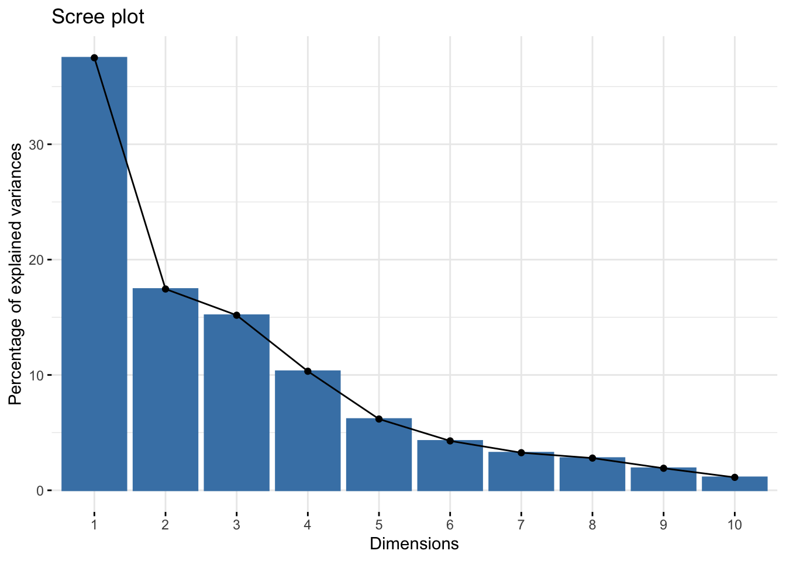
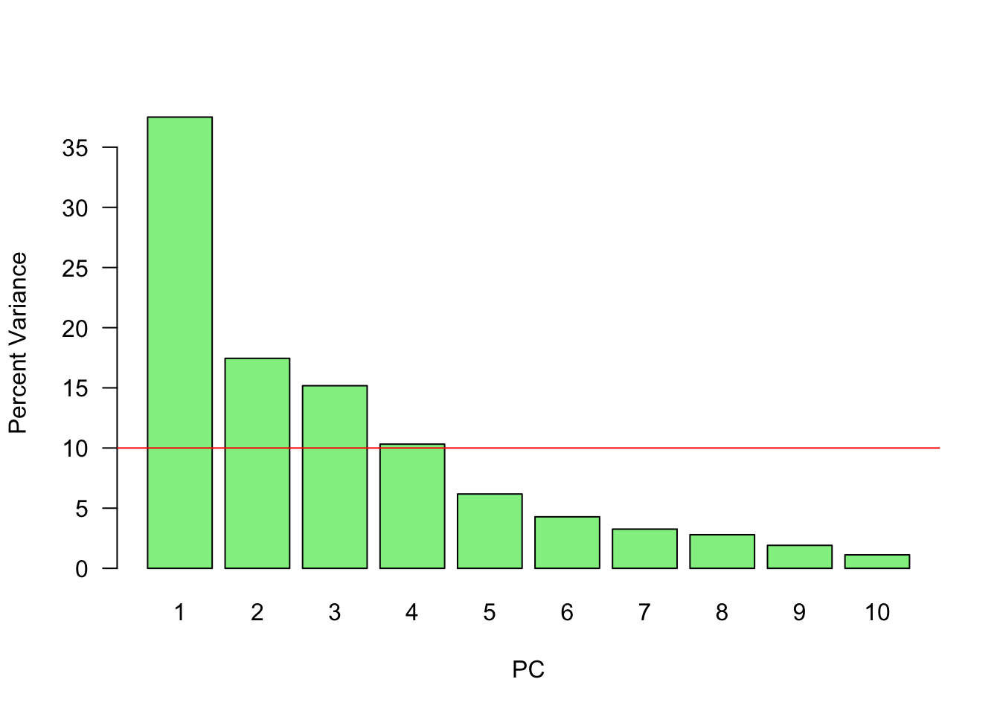

# PCA (Principle Component Analysis)

Having seen SVD and Eigenvalue decomposition, we can now look at Principle Component Analysis (PCA), which is a statistical procedure that allows us to summarize the information content in large data files.  In other words, PCA is a popular technique used to reduce the dimensionality of high-dimensional data while retaining most of the information in the original data.

**PCA is a eigenvalue decomposition of a covariance matrix** (of data matrix $\mathbf{X}$). Since a covariance matrix is a square symmetric matrix, we can apply the eigenvalue decomposition, which reveals the unique orthogonal directions (variances) in the data so that their orthogonal linear combinations maximize the total variance.

The goal is here a dimension reduction of the data matrix.  Hence by selecting a few loading, we can reduce the dimension of the data but capture a substantial variation in the data at the same time.  

Principal components are the ordered (orthogonal) lines (vectors) that best account for the maximum variance in the data by their magnitude. To get the (unique) variances (direction and the magnitude) in data, we first obtain the mean-centered covariance matrix.  

When we use the covariance matrix of the data, we can use eigenvalue decomposition to identify the unique variation (eigenvectors) and their relative magnitudes (eigenvalues) in the data.  Here is a simple procedure:  
  
1. $\mathbf{X}$ is the data matrix, 
2. $\mathbf{B}$ is the mean-centered data matrix, 
3. $\mathbf{C}$ is the covariance matrix ($\mathbf{B}^T\mathbf{B}$). Note that, if $\mathbf{B}$ is scaled, i.e. "z-scored", $\mathbf{B}^T\mathbf{B}$ gives correlation matrix. We will have more information on covariance and correlation in Chapter 32. 
4. The eigenvectors and values of $\mathbf{C}$ by $\mathbf{C} = \mathbf{VDV^{\top}}$.  Thus, $\mathbf{V}$ contains the eigenvectors (loadings) and $\mathbf{D}$ contains eigenvalues. 
5. Using $\mathbf{V}$, the transformation of $\mathbf{B}$ with $\mathbf{B} \mathbf{V}$ maps the data of $p$ variables to a new space of $p$ variables which are uncorrelated over the dataset. $\mathbf{T} =\mathbf{B} \mathbf{V}$ is called the **principle component or score matrix**. 
6. Since SVD of $\mathbf{B} = \mathbf{U} \Sigma \mathbf{V}^{\top}$, we can also get $\mathbf{B}\mathbf{V} = \mathbf{T} = \mathbf{U\Sigma}$. Hence the principle components are $\mathbf{T} = \mathbf{BV} = \mathbf{U\Sigma}$. 
7. However, not all the principal components need to be kept. Keeping only the first $r$ principal components, produced by using only the first $r$ eigenvectors, gives the truncated transformation $\mathbf{T}_{r} = \mathbf{B} \mathbf{V}_{r}$.  Obviously you choose those with higher variance in each directions by the order of eigenvalues. 
8. We can use $\frac{\lambda_{k}}{\sum_{i=1} \lambda_{k}}$ to identify $r$. Or cumulatively, we can see how much variation could be captured by $r$ number of $\lambda$s, which gives us an idea how many principle components to keep:  

$$
\frac{\sum_{i=1}^{r} \lambda_{k}}{\sum_{i=1}^n \lambda_{k}}
$$

We use the `factorextra` package and the `decathlon2` data for an example.  


```r
library("factoextra")
data(decathlon2)

X <- as.matrix(decathlon2[, 1:10])
head(X)
```

```
##           X100m Long.jump Shot.put High.jump X400m X110m.hurdle Discus
## SEBRLE    11.04      7.58    14.83      2.07 49.81        14.69  43.75
## CLAY      10.76      7.40    14.26      1.86 49.37        14.05  50.72
## BERNARD   11.02      7.23    14.25      1.92 48.93        14.99  40.87
## YURKOV    11.34      7.09    15.19      2.10 50.42        15.31  46.26
## ZSIVOCZKY 11.13      7.30    13.48      2.01 48.62        14.17  45.67
## McMULLEN  10.83      7.31    13.76      2.13 49.91        14.38  44.41
##           Pole.vault Javeline X1500m
## SEBRLE          5.02    63.19  291.7
## CLAY            4.92    60.15  301.5
## BERNARD         5.32    62.77  280.1
## YURKOV          4.72    63.44  276.4
## ZSIVOCZKY       4.42    55.37  268.0
## McMULLEN        4.42    56.37  285.1
```

```r
n <- nrow(X)
B <- scale(X, center = TRUE)
C <- t(B) %*% B / (n - 1)
head(C)
```

```
##                   X100m  Long.jump   Shot.put  High.jump      X400m
## X100m         1.0000000 -0.7377932 -0.3703180 -0.3146495  0.5703453
## Long.jump    -0.7377932  1.0000000  0.3737847  0.2682078 -0.5036687
## Shot.put     -0.3703180  0.3737847  1.0000000  0.5747998 -0.2073588
## High.jump    -0.3146495  0.2682078  0.5747998  1.0000000 -0.2616603
## X400m         0.5703453 -0.5036687 -0.2073588 -0.2616603  1.0000000
## X110m.hurdle  0.6699790 -0.5521158 -0.2701634 -0.2022579  0.5970140
##              X110m.hurdle     Discus  Pole.vault    Javeline      X1500m
## X100m           0.6699790 -0.3893760  0.01156433 -0.26635476 -0.17805307
## Long.jump      -0.5521158  0.3287652  0.07982045  0.28806781  0.17332597
## Shot.put       -0.2701634  0.7225179 -0.06837068  0.47558572  0.00959628
## High.jump      -0.2022579  0.4210187 -0.55129583  0.21051789 -0.15699017
## X400m           0.5970140 -0.2545326  0.11156898  0.02350554  0.18346035
## X110m.hurdle    1.0000000 -0.4213608  0.12118697  0.09655757 -0.10331329
```

```r
#Check it
head(cov(B))
```

```
##                   X100m  Long.jump   Shot.put  High.jump      X400m
## X100m         1.0000000 -0.7377932 -0.3703180 -0.3146495  0.5703453
## Long.jump    -0.7377932  1.0000000  0.3737847  0.2682078 -0.5036687
## Shot.put     -0.3703180  0.3737847  1.0000000  0.5747998 -0.2073588
## High.jump    -0.3146495  0.2682078  0.5747998  1.0000000 -0.2616603
## X400m         0.5703453 -0.5036687 -0.2073588 -0.2616603  1.0000000
## X110m.hurdle  0.6699790 -0.5521158 -0.2701634 -0.2022579  0.5970140
##              X110m.hurdle     Discus  Pole.vault    Javeline      X1500m
## X100m           0.6699790 -0.3893760  0.01156433 -0.26635476 -0.17805307
## Long.jump      -0.5521158  0.3287652  0.07982045  0.28806781  0.17332597
## Shot.put       -0.2701634  0.7225179 -0.06837068  0.47558572  0.00959628
## High.jump      -0.2022579  0.4210187 -0.55129583  0.21051789 -0.15699017
## X400m           0.5970140 -0.2545326  0.11156898  0.02350554  0.18346035
## X110m.hurdle    1.0000000 -0.4213608  0.12118697  0.09655757 -0.10331329
```

Eigenvalues and vectors ...


```r
#Eigens
evalues <- eigen(C)$values
evalues
```

```
##  [1] 3.7499727 1.7451681 1.5178280 1.0322001 0.6178387 0.4282908 0.3259103
##  [8] 0.2793827 0.1911128 0.1122959
```

```r
evectors <- eigen(C)$vectors
evectors #Ordered
```

```
##              [,1]       [,2]         [,3]        [,4]       [,5]        [,6]
##  [1,]  0.42290657 -0.2594748 -0.081870461 -0.09974877  0.2796419 -0.16023494
##  [2,] -0.39189495  0.2887806  0.005082180  0.18250903 -0.3355025 -0.07384658
##  [3,] -0.36926619 -0.2135552 -0.384621732 -0.03553644  0.3544877 -0.32207320
##  [4,] -0.31422571 -0.4627797 -0.003738604 -0.07012348 -0.3824125 -0.52738027
##  [5,]  0.33248297 -0.1123521 -0.418635317 -0.26554389 -0.2534755  0.23884715
##  [6,]  0.36995919 -0.2252392 -0.338027983  0.15726889 -0.2048540 -0.26249611
##  [7,] -0.37020078 -0.1547241 -0.219417086 -0.39137188  0.4319091  0.28217086
##  [8,]  0.11433982  0.5583051 -0.327177839  0.24759476  0.3340758 -0.43606610
##  [9,] -0.18341259 -0.0745854 -0.564474643  0.47792535 -0.1697426  0.42368592
## [10,] -0.03599937  0.4300522 -0.286328973 -0.64220377 -0.3227349 -0.10850981
##              [,7]        [,8]        [,9]       [,10]
##  [1,]  0.03227949 -0.35266427  0.71190625 -0.03272397
##  [2,] -0.24902853 -0.72986071  0.12801382 -0.02395904
##  [3,] -0.23059438  0.01767069 -0.07184807  0.61708920
##  [4,] -0.03992994  0.25003572  0.14583529 -0.41523052
##  [5,] -0.69014364  0.01543618 -0.13706918 -0.12016951
##  [6,]  0.42797378 -0.36415520 -0.49550598  0.03514180
##  [7,]  0.18416631 -0.26865454 -0.18621144 -0.48037792
##  [8,] -0.12654370  0.16086549 -0.02983660 -0.40290423
##  [9,]  0.23324548  0.19922452  0.33300936 -0.02100398
## [10,]  0.34406521  0.09752169  0.19899138  0.18954698
```

Now with `prcomp()`.  First, eigenvalues:  


```r
# With `prcomp()`
Xpca <- prcomp(X, scale = TRUE)
#Eigenvalues
Xpca$sdev 
```

```
##  [1] 1.9364846 1.3210481 1.2320016 1.0159725 0.7860272 0.6544393 0.5708855
##  [8] 0.5285666 0.4371645 0.3351059
```

They are the square root of the eigenvalues that we calculated before and they are ordered.# 


```pca2b
sqrt(evalues)
```

And, the "loadings" (Eigenvectors):


```r
#Eigenvectors 
Xpca$rotation # 10x10
```

```
##                      PC1        PC2          PC3         PC4        PC5
## X100m        -0.42290657 -0.2594748  0.081870461  0.09974877 -0.2796419
## Long.jump     0.39189495  0.2887806 -0.005082180 -0.18250903  0.3355025
## Shot.put      0.36926619 -0.2135552  0.384621732  0.03553644 -0.3544877
## High.jump     0.31422571 -0.4627797  0.003738604  0.07012348  0.3824125
## X400m        -0.33248297 -0.1123521  0.418635317  0.26554389  0.2534755
## X110m.hurdle -0.36995919 -0.2252392  0.338027983 -0.15726889  0.2048540
## Discus        0.37020078 -0.1547241  0.219417086  0.39137188 -0.4319091
## Pole.vault   -0.11433982  0.5583051  0.327177839 -0.24759476 -0.3340758
## Javeline      0.18341259 -0.0745854  0.564474643 -0.47792535  0.1697426
## X1500m        0.03599937  0.4300522  0.286328973  0.64220377  0.3227349
##                      PC6         PC7         PC8         PC9        PC10
## X100m         0.16023494 -0.03227949 -0.35266427  0.71190625  0.03272397
## Long.jump     0.07384658  0.24902853 -0.72986071  0.12801382  0.02395904
## Shot.put      0.32207320  0.23059438  0.01767069 -0.07184807 -0.61708920
## High.jump     0.52738027  0.03992994  0.25003572  0.14583529  0.41523052
## X400m        -0.23884715  0.69014364  0.01543618 -0.13706918  0.12016951
## X110m.hurdle  0.26249611 -0.42797378 -0.36415520 -0.49550598 -0.03514180
## Discus       -0.28217086 -0.18416631 -0.26865454 -0.18621144  0.48037792
## Pole.vault    0.43606610  0.12654370  0.16086549 -0.02983660  0.40290423
## Javeline     -0.42368592 -0.23324548  0.19922452  0.33300936  0.02100398
## X1500m        0.10850981 -0.34406521  0.09752169  0.19899138 -0.18954698
```

```r
loadings <- Xpca$rotation
```

The signs of eigenvectors are flipped and opposites of what we calculated with `eigen()` above. This is because the definition of an eigenbasis is ambiguous of sign. There are multiple discussions about the sign reversals in eignevectores.  

Let's visualize the order:   


```r
plot(Xpca$sdev) # Eigenvalues
```


```r
fviz_eig(Xpca) # Cumulative with "factoextra"
```



```r
# Or
var <- (Xpca$sdev) ^ 2
var_perc <- var / sum(var) * 100

barplot(
  var_perc,
  xlab = 'PC',
  ylab = 'Percent Variance',
  names.arg = 1:length(var_perc),
  las = 1,
  ylim = c(0, max(var_perc)),
  col = 'lightgreen'
)

abline(h = mean(var_perc), col = 'red')
```


  
Since we have ten variables, if each variable contributed equally, they would each contribute 10\% to the total variance (red line). This criterion suggests we should also include principal component 4 (but barely) in our interpretation. 

And principle component scores $\mathbf{T} = \mathbf{X}\mathbf{V}$ (a.k.a score matrix) with `prcomp()`:


```r
pc <- scale(X) %*% Xpca$rotation
head(pc)
```

```
##                  PC1        PC2        PC3         PC4         PC5        PC6
## SEBRLE     0.2727622  0.5264068  1.5556058  0.10384438  1.05453531  0.7177257
## CLAY       0.8879389  2.0551314  0.8249697  1.81612193 -0.40100595 -1.5039874
## BERNARD   -1.3466138  1.3229149  0.9439501 -1.46516144 -0.17925232  0.5996203
## YURKOV    -0.9108536 -2.2390912  1.9063730  0.09501304  0.18735823  0.3754439
## ZSIVOCZKY -0.1018764 -1.0694498 -2.0596722  0.07056229 -0.03232182 -0.9321431
## McMULLEN   0.2353742 -0.9215376 -0.8028425  1.17942532  1.79598700 -0.3241881
##                   PC7         PC8         PC9        PC10
## SEBRLE    -0.04935537 -0.02990462  0.63079187  0.07728655
## CLAY      -0.75968352  0.06536612 -0.05920672  0.15812336
## BERNARD   -0.75032098  0.49570997 -0.07483747 -0.03288604
## YURKOV    -0.29565551 -0.09332310  0.06769776  0.13791531
## ZSIVOCZKY -0.30752133 -0.29476740  0.48055837  0.44234659
## McMULLEN   0.02896393  0.53358562 -0.05116850  0.37610188
```

```r
dim(pc)
```

```
## [1] 27 10
```

```r
# which is also given by `prcomp()`
head(Xpca$x)
```

```
##                  PC1        PC2        PC3         PC4         PC5        PC6
## SEBRLE     0.2727622  0.5264068  1.5556058  0.10384438  1.05453531  0.7177257
## CLAY       0.8879389  2.0551314  0.8249697  1.81612193 -0.40100595 -1.5039874
## BERNARD   -1.3466138  1.3229149  0.9439501 -1.46516144 -0.17925232  0.5996203
## YURKOV    -0.9108536 -2.2390912  1.9063730  0.09501304  0.18735823  0.3754439
## ZSIVOCZKY -0.1018764 -1.0694498 -2.0596722  0.07056229 -0.03232182 -0.9321431
## McMULLEN   0.2353742 -0.9215376 -0.8028425  1.17942532  1.79598700 -0.3241881
##                   PC7         PC8         PC9        PC10
## SEBRLE    -0.04935537 -0.02990462  0.63079187  0.07728655
## CLAY      -0.75968352  0.06536612 -0.05920672  0.15812336
## BERNARD   -0.75032098  0.49570997 -0.07483747 -0.03288604
## YURKOV    -0.29565551 -0.09332310  0.06769776  0.13791531
## ZSIVOCZKY -0.30752133 -0.29476740  0.48055837  0.44234659
## McMULLEN   0.02896393  0.53358562 -0.05116850  0.37610188
```

Now you can think that if we use `evectors` that we calculated earlier with filliped signs, the data would be different.  It's similar to multiply the entire data with -1.  So the data would not change in a sense that that captures the variation between observations and variables.  That's why the sign of eigenvalues are arbitraray.

Now, with SVD:  
  

```r
# With SVD
Xsvd <- svd(scale(X))
pc_2 <- Xsvd$u %*% diag(Xsvd$d)
dim(pc_2)
```

```
## [1] 27 10
```

```r
head(pc_2)
```

```
##            [,1]       [,2]       [,3]        [,4]        [,5]       [,6]
## [1,]  0.2727622  0.5264068  1.5556058  0.10384438  1.05453531  0.7177257
## [2,]  0.8879389  2.0551314  0.8249697  1.81612193 -0.40100595 -1.5039874
## [3,] -1.3466138  1.3229149  0.9439501 -1.46516144 -0.17925232  0.5996203
## [4,] -0.9108536 -2.2390912  1.9063730  0.09501304  0.18735823  0.3754439
## [5,] -0.1018764 -1.0694498 -2.0596722  0.07056229 -0.03232182 -0.9321431
## [6,]  0.2353742 -0.9215376 -0.8028425  1.17942532  1.79598700 -0.3241881
##             [,7]        [,8]        [,9]       [,10]
## [1,] -0.04935537 -0.02990462  0.63079187  0.07728655
## [2,] -0.75968352  0.06536612 -0.05920672  0.15812336
## [3,] -0.75032098  0.49570997 -0.07483747 -0.03288604
## [4,] -0.29565551 -0.09332310  0.06769776  0.13791531
## [5,] -0.30752133 -0.29476740  0.48055837  0.44234659
## [6,]  0.02896393  0.53358562 -0.05116850  0.37610188
```

Here we can reduce the dimensionality by selecting only 4 PC (the first 4 PC's are above the average, which explain more than 80% of the variation in the data - see the graph above)


```r
reduced <- pc[, 1:4]
dim(reduced)
```

```
## [1] 27  4
```

```r
head(reduced)
```

```
##                  PC1        PC2        PC3         PC4
## SEBRLE     0.2727622  0.5264068  1.5556058  0.10384438
## CLAY       0.8879389  2.0551314  0.8249697  1.81612193
## BERNARD   -1.3466138  1.3229149  0.9439501 -1.46516144
## YURKOV    -0.9108536 -2.2390912  1.9063730  0.09501304
## ZSIVOCZKY -0.1018764 -1.0694498 -2.0596722  0.07056229
## McMULLEN   0.2353742 -0.9215376 -0.8028425  1.17942532
```

The individual columns of $\mathbf{T}$ successively inherit the maximum possible variance from $\mathbf{X}$, with each coefficient vector in $\mathbf{V}$ constrained to be a unit vector. In $\mathbf{T}=\mathbf{X V}$, $\mathbf{V}$ is a $p \times p$ matrix of weights whose columns are the eigenvectors of $\mathbf{X}^{\top} \mathbf{X}$. The columns of $\mathbf{V}$ multiplied by the square root of corresponding eigenvalues, that is, eigenvectors scaled up by the variances, are called loadings in PCA and Factor analysis.

Note that if we make a singular value decomposition for a covariance matrix 

$$
\begin{aligned}
\mathbf{X}^{T} \mathbf{X} &=\mathbf{V} \mathbf{\Sigma}^{\top} \mathbf{U}^{\top} \mathbf{U} \mathbf{\Sigma} \mathbf{V}^{\top} \\
&=\mathbf{V} \mathbf{\Sigma}^{\top} \mathbf{\Sigma} \mathbf{V}^{\top} \\
&=\mathbf{V} \hat{\mathbf{\Sigma}}^{2} \mathbf{V}^{\top}
\end{aligned}
$$

where $\hat{\boldsymbol{\Sigma}}$ is the square diagonal matrix with the singular values of $\mathbf{X}$ and the excess zeros are chopped off so that it  satisfies $\hat{\boldsymbol{\Sigma}}^{2}=\boldsymbol{\Sigma}^{\top} \boldsymbol{\Sigma}$.
  
Comparison with the eigenvector factorization of $\mathbf{X}^{\top} \mathbf{X}$ establishes that the right singular vectors $\mathbf{V}$ of $\mathbf{X}$ are equivalent to the eigenvectors of $\mathbf{X}^{\top} \mathbf{X}$, while the singular values $\sigma_{(k)}$ of $\mathbf{X}$ are equal to the square-root of the eigenvalues $\lambda_{(k)}$ of $\mathbf{X}^{\top} \mathbf{X}$.


## Factor Analysis

Factor analysis and Principal Component Analysis (PCA) both involve reducing the dimensionality of a dataset, but they are not the same.  PCA is a mathematical technique that transforms a dataset of possibly correlated variables into a smaller set of uncorrelated variables known as principal components. The principal components are linear combinations of the original variables, and each principal component accounts for as much of the variation in the data as possible.

Factor Analysis (FA) is a method for modeling observed variables, and their covariance structure, in terms of a smaller number of underlying latent (unobserved) "factors". In FA the observed variables are modeled as linear functions of the "factors." In PCA, we create new variables that are linear combinations of the observed variables.  In both PCA and FA, the dimension of the data is reduced. 

The main difference between FA and PCA lies in their objectives. PCA aims to reduce the number of variables by identifying the most important components, while factor analysis aims to identify the underlying factors that explain the correlations among the variables. Therefore, PCA is more commonly used for data reduction or data compression, while factor analysis is more commonly used for exploring the relationships among variables.

As shown below, a factor model can be represented by as a series of multiple regressions, where each $X_{i}$ ($i = 1, \cdots, p$) is a function of $m$ number of unobservable common factors $f_{i}$:

$$
\begin{gathered}
X_{1}=\mu_{1}+\beta_{11} f_{1}+\beta_{12} f_{2}+\cdots+\beta_{1m} f_{m}+\epsilon_{1} \\
X_{2}=\mu_{2}+\beta_{21} f_{1}+\beta_{22} f_{2}+\cdots+\beta_{2 m} f_{m}+\epsilon_{2} \\
\vdots \\
X_{p}=\mu_{p}+\beta_{p 1} f_{1}+\beta_{p 2} f_{2}+\cdots+\beta_{p m} f_{m}+\epsilon_{p}
\end{gathered}
$$

where $\mathrm{E}\left(X_i\right)=\mu_i$, $\epsilon_{i}$ are called the **specific factors**.  The coefficients, $\beta_{i j},$ are the factor **loadings**.  We can expressed all of them in a matrix notation.

\begin{equation}
\mathbf{X}=\boldsymbol{\mu}+\mathbf{L f}+\boldsymbol{\epsilon}
\end{equation} 

where

$$
\mathbf{L}=\left(\begin{array}{cccc}
\beta_{11} & \beta_{12} & \ldots & \beta_{1 m} \\
\beta_{21} & \beta_{22} & \ldots & \beta_{2 m} \\
\vdots & \vdots & & \vdots \\
\beta_{p 1} & \beta_{p 2} & \ldots & \beta_{p m}
\end{array}\right)
$$

There are multiple assumptions:
  
- $E\left(\epsilon_{i}\right)=0$ and $\operatorname{var}\left(\epsilon_{i}\right)=\psi_{i}$, which is called as "specific variance", 
- $E\left(f_{i}\right)=0$ and $\operatorname{var}\left(f_{i}\right)=1$,
- $\operatorname{cov}\left(f_{i}, f_{j}\right)=0$ for $i \neq j$,
- $\operatorname{cov}\left(\epsilon_{i}, \epsilon_{j}\right)=0$ for $i \neq j$,
- $\operatorname{cov}\left(\epsilon_{i}, f_{j}\right)=0$,

Given these assumptions, the variance of $X_i$ can be expressed as

$$
\operatorname{var}\left(X_{i}\right)=\sigma_{i}^{2}=\sum_{j=1}^{m} \beta_{i j}^{2}+\psi_{i}
$$

There are two sources of the variance in $X_i$: $\sum_{j=1}^{m} \beta_{i j}^{2}$, which is called the **Communality** for variable $i$, and **specific variance**, $\psi_{i}$.  

Moreover, 
  
- $\operatorname{cov}\left(X_{i}, X_{j}\right)=\sigma_{i j}=\sum_{k=1}^{m} l_{i k} l_{j k}$, 
- $\operatorname{cov}\left(X_{i}, f_{j}\right)=l_{i j}$

The factor model for our variance-covariance matrix of $\mathbf{X}$ can then be expressed as:

$$
\begin{equation}
\operatorname{var-cov}(\mathbf{X}) = \Sigma=\mathbf{L L}^{\prime}+\mathbf{\Psi}
\end{equation} 
$$

which is the sum of the shared variance with another variable, $\mathbf{L} \mathbf{L}^{\prime}$ (the common variance or **communality**) and the unique variance, $\mathbf{\Psi}$, inherent to each variable (**specific variance**)

We need to look at $\mathbf{L L}^{\prime}$, where $\mathbf{L}$ is the $p \times m$ matrix of loadings. In general, we want to have $m \ll p$.  

The $i^{\text {th }}$ diagonal element of $\mathbf{L L}^{\prime}$, the sum of the squared loadings, is called the $i^{\text {th }}$ communality. The communality values represent the percent of variability explained by the common factors. The sizes of the communalities and/or the specific variances can be used to evaluate the goodness of fit.

To estimate factor loadings with PCA, we first calculate the principal components of the data, and then compute the factor loadings using the eigenvectors of the correlation matrix of the standardized data.  When PCA is used, the matrix of estimated factor loadings, $\mathbf{L},$ is given by:

$$
\widehat{\mathbf{L}}=\left[\begin{array}{lll}
\sqrt{\hat{\lambda}_1} \hat{\mathbf{v}}_1 & \sqrt{\hat{\lambda}_2} \hat{\mathbf{v}}_2 & \ldots \sqrt{\hat{\lambda}_m} \hat{\mathbf{v}}_m
\end{array}\right]
$$

where 

$$
\hat{\beta}_{i j}=\hat{\mathbf{v}}_{i j} \sqrt{\hat{\lambda}_j}
$$
where $i$ is the index of the original variable, $j$ is the index of the principal component, eigenvector $(i,j)$ is the $i$-th component of the $j$-th eigenvector of the correlation matrix, eigenvalue $(j)$ is the $j$-th eigenvalue of the correlation matrix

This method tries to find values of the loadings that bring the estimate of the total communality close to the total of the observed variances. The covariances are ignored.  Remember, the communality is the part of the variance of the variable that is explained by the factors. So a larger communality means a more successful factor model in explaining the variable. 

Let's have an example.  The data set is called `bfi` and comes from the `psych` package. 

The data includes 25 self-reported personality items from the International Personality Item Pool, gender, education level, and age for 2800 subjects.  The personality items are split into 5 categories: Agreeableness (A), Conscientiousness (C), Extraversion (E), Neuroticism (N), Openness (O). Each item was answered on a six point scale: 1 Very Inaccurate to 6 Very Accurate.


```r
library(psych)
library(GPArotation)
data("bfi")
str(bfi)
```

```
## 'data.frame':	2800 obs. of  28 variables:
##  $ A1       : int  2 2 5 4 2 6 2 4 4 2 ...
##  $ A2       : int  4 4 4 4 3 6 5 3 3 5 ...
##  $ A3       : int  3 5 5 6 3 5 5 1 6 6 ...
##  $ A4       : int  4 2 4 5 4 6 3 5 3 6 ...
##  $ A5       : int  4 5 4 5 5 5 5 1 3 5 ...
##  $ C1       : int  2 5 4 4 4 6 5 3 6 6 ...
##  $ C2       : int  3 4 5 4 4 6 4 2 6 5 ...
##  $ C3       : int  3 4 4 3 5 6 4 4 3 6 ...
##  $ C4       : int  4 3 2 5 3 1 2 2 4 2 ...
##  $ C5       : int  4 4 5 5 2 3 3 4 5 1 ...
##  $ E1       : int  3 1 2 5 2 2 4 3 5 2 ...
##  $ E2       : int  3 1 4 3 2 1 3 6 3 2 ...
##  $ E3       : int  3 6 4 4 5 6 4 4 NA 4 ...
##  $ E4       : int  4 4 4 4 4 5 5 2 4 5 ...
##  $ E5       : int  4 3 5 4 5 6 5 1 3 5 ...
##  $ N1       : int  3 3 4 2 2 3 1 6 5 5 ...
##  $ N2       : int  4 3 5 5 3 5 2 3 5 5 ...
##  $ N3       : int  2 3 4 2 4 2 2 2 2 5 ...
##  $ N4       : int  2 5 2 4 4 2 1 6 3 2 ...
##  $ N5       : int  3 5 3 1 3 3 1 4 3 4 ...
##  $ O1       : int  3 4 4 3 3 4 5 3 6 5 ...
##  $ O2       : int  6 2 2 3 3 3 2 2 6 1 ...
##  $ O3       : int  3 4 5 4 4 5 5 4 6 5 ...
##  $ O4       : int  4 3 5 3 3 6 6 5 6 5 ...
##  $ O5       : int  3 3 2 5 3 1 1 3 1 2 ...
##  $ gender   : int  1 2 2 2 1 2 1 1 1 2 ...
##  $ education: int  NA NA NA NA NA 3 NA 2 1 NA ...
##  $ age      : int  16 18 17 17 17 21 18 19 19 17 ...
```
  
To get rid of missing observations and the last three variables,


```r
df <- bfi[complete.cases(bfi[, 1:25]), 1:25]
```

The first decision that we need make  is the number of factors that we will need to extract.  For $p=25$, the variance-covariance matrix $\Sigma$ contains
$$
\frac{p(p+1)}{2}=\frac{25 \times 26}{2}=325
$$
unique elements or entries. With $m$ factors, the number of parameters in the factor model would be
  
$$
p(m+1)=25(m+1)
$$

Taking $m=5$, we have 150 parameters in the factor model.  How do we choose $m$?  Although it is  common to look at the results of the principal components analysis, often in social sciences, the underlying theory within the field of study indicates how many factors to expect.  


```r
scree(df)
```


Let's use the `factanal()` function of the build-in `stats` package,  which performs maximum likelihood estimation.  


```r
pa.out <- factanal(df, factors = 5)
pa.out
```

```
## 
## Call:
## factanal(x = df, factors = 5)
## 
## Uniquenesses:
##    A1    A2    A3    A4    A5    C1    C2    C3    C4    C5    E1    E2    E3 
## 0.830 0.576 0.466 0.691 0.512 0.660 0.569 0.677 0.510 0.557 0.634 0.454 0.558 
##    E4    E5    N1    N2    N3    N4    N5    O1    O2    O3    O4    O5 
## 0.468 0.592 0.271 0.337 0.478 0.507 0.664 0.675 0.744 0.518 0.752 0.726 
## 
## Loadings:
##    Factor1 Factor2 Factor3 Factor4 Factor5
## A1  0.104                  -0.393         
## A2          0.191   0.144   0.601         
## A3          0.280   0.110   0.662         
## A4          0.181   0.234   0.454  -0.109 
## A5 -0.124   0.351           0.580         
## C1                  0.533           0.221 
## C2                  0.624   0.127   0.140 
## C3                  0.554   0.122         
## C4  0.218          -0.653                 
## C5  0.272  -0.190  -0.573                 
## E1         -0.587          -0.120         
## E2  0.233  -0.674  -0.106  -0.151         
## E3          0.490           0.315   0.313 
## E4 -0.121   0.613           0.363         
## E5          0.491   0.310   0.120   0.234 
## N1  0.816                  -0.214         
## N2  0.787                  -0.202         
## N3  0.714                                 
## N4  0.562  -0.367  -0.192                 
## N5  0.518  -0.187           0.106  -0.137 
## O1          0.182   0.103           0.524 
## O2  0.163          -0.113   0.102  -0.454 
## O3          0.276           0.153   0.614 
## O4  0.207  -0.220           0.144   0.368 
## O5                                 -0.512 
## 
##                Factor1 Factor2 Factor3 Factor4 Factor5
## SS loadings      2.687   2.320   2.034   1.978   1.557
## Proportion Var   0.107   0.093   0.081   0.079   0.062
## Cumulative Var   0.107   0.200   0.282   0.361   0.423
## 
## Test of the hypothesis that 5 factors are sufficient.
## The chi square statistic is 1490.59 on 185 degrees of freedom.
## The p-value is 1.22e-202
```

The first chunk provides the "uniqueness" (specific variance) for each variable, which range from 0 to 1 . The uniqueness explains the proportion of variability, which cannot be explained by a linear combination of the factors. That's why it's referred to as noise. This is the $\hat{\Psi}$ in the equation above. A high uniqueness for a variable implies that the factors are not the main source of its variance.

The next section reports the loadings ranging from $-1$ to $1.$ This is the $\hat{\mathbf{L}}$ in the equation (31.2) above. Variables with a high loading are well explained by the factor. Note that R does not print loadings less than $0.1$.

The communalities for the $i^{t h}$ variable are computed by taking the sum of the squared loadings for that variable. This is expressed below:

$$
\hat{h}_i^2=\sum_{j=1}^m \hat{l}_{i j}^2
$$

A well-fit factor model has low values for uniqueness and high values for communality. One way to calculate the communality is to subtract the uniquenesses from 1. 


```r
apply(pa.out$loadings ^ 2, 1, sum) # communality
```

```
##        A1        A2        A3        A4        A5        C1        C2        C3 
## 0.1703640 0.4237506 0.5337657 0.3088959 0.4881042 0.3401202 0.4313729 0.3227542 
##        C4        C5        E1        E2        E3        E4        E5        N1 
## 0.4900773 0.4427531 0.3659303 0.5459794 0.4422484 0.5319941 0.4079732 0.7294156 
##        N2        N3        N4        N5        O1        O2        O3        O4 
## 0.6630751 0.5222584 0.4932099 0.3356293 0.3253527 0.2558864 0.4815981 0.2484000 
##        O5 
## 0.2740596
```

```r
1 - apply(pa.out$loadings ^ 2, 1, sum) # uniqueness
```

```
##        A1        A2        A3        A4        A5        C1        C2        C3 
## 0.8296360 0.5762494 0.4662343 0.6911041 0.5118958 0.6598798 0.5686271 0.6772458 
##        C4        C5        E1        E2        E3        E4        E5        N1 
## 0.5099227 0.5572469 0.6340697 0.4540206 0.5577516 0.4680059 0.5920268 0.2705844 
##        N2        N3        N4        N5        O1        O2        O3        O4 
## 0.3369249 0.4777416 0.5067901 0.6643707 0.6746473 0.7441136 0.5184019 0.7516000 
##        O5 
## 0.7259404
```
  
The table under the loadings reports the proportion of variance explained by each factor. `Proportion Var` shows the proportion of variance explained by each factor. The row `Cumulative Var` is the cumulative `Proportion Var`. Finally, the row `SS loadings` reports the sum of squared loadings. This can be used to determine a factor worth keeping (Kaiser Rule).

The last section of the output reports a significance test: The null hypothesis is that the number of factors in the model is sufficient to capture the full dimensionality of the data set. Hence, in our example, we fitted not an appropriate model. 

Finally, we may compare estimated correlation matrix, $\hat{\Sigma}$ and the observed correlation matrix:


```r
Lambda <- pa.out$loadings
Psi <- diag(pa.out$uniquenesses)
Sigma_hat <- Lambda %*% t(Lambda) + Psi
head(Sigma_hat)
```

```
##             A1         A2         A3         A4         A5          C1
## A1  1.00000283 -0.2265272 -0.2483489 -0.1688548 -0.2292686 -0.03259104
## A2 -0.22652719  0.9999997  0.4722224  0.3326049  0.4275597  0.13835721
## A3 -0.24834886  0.4722224  1.0000003  0.3686079  0.4936403  0.12936294
## A4 -0.16885485  0.3326049  0.3686079  1.0000017  0.3433611  0.13864850
## A5 -0.22926858  0.4275597  0.4936403  0.3433611  1.0000000  0.11450065
## C1 -0.03259104  0.1383572  0.1293629  0.1386485  0.1145007  1.00000234
##             C2          C3          C4          C5          E1         E2
## A1 -0.04652882 -0.04791267  0.02951427  0.03523371  0.02815444  0.0558511
## A2  0.17883430  0.15482391 -0.12081021 -0.13814633 -0.18266118 -0.2297604
## A3  0.16516097  0.14465370 -0.11034318 -0.14189597 -0.24413210 -0.2988190
## A4  0.18498354  0.18859903 -0.18038121 -0.21194824 -0.14856332 -0.2229227
## A5  0.12661287  0.12235652 -0.12717601 -0.17194282 -0.28325012 -0.3660944
## C1  0.37253491  0.30456798 -0.37410412 -0.31041193 -0.03649401 -0.1130997
##            E3         E4          E5          N1          N2          N3
## A1 -0.1173724 -0.1247436 -0.03147217  0.17738934  0.16360231  0.07593942
## A2  0.3120607  0.3412253  0.22621235 -0.09257735 -0.08847947 -0.01009412
## A3  0.3738780  0.4163964  0.26694168 -0.10747302 -0.10694310 -0.02531812
## A4  0.2124931  0.3080580  0.18727470 -0.12916711 -0.13311708 -0.08204545
## A5  0.3839224  0.4444111  0.27890083 -0.20296456 -0.20215265 -0.13177926
## C1  0.1505643  0.0926584  0.24950915 -0.05014855 -0.02623443 -0.04635470
##             N4          N5          O1           O2          O3           O4
## A1  0.03711760  0.01117121 -0.05551140  0.002021464 -0.08009528 -0.066085241
## A2 -0.07360446  0.03103525  0.13218881  0.022852428  0.19161373  0.069742928
## A3 -0.10710549  0.01476409  0.15276068  0.028155055  0.22602542  0.058986934
## A4 -0.15287214 -0.01338970  0.03924192  0.059069402  0.06643848 -0.034070120
## A5 -0.20800410 -0.08388175  0.16602866 -0.008940967  0.23912037  0.008904693
## C1 -0.10426314 -0.05989091  0.18543197 -0.154255652  0.19444225  0.063216945
##             O5
## A1  0.03042630
## A2 -0.03205802
## A3 -0.03274830
## A4  0.03835946
## A5 -0.05224734
## C1 -0.15426539
```

Let's check the differences:


```r
round(head(cor(df)) - head(Sigma_hat), 2)
```

```
##       A1    A2    A3    A4    A5    C1    C2    C3    C4    C5    E1    E2
## A1  0.00 -0.12 -0.03  0.01  0.04  0.05  0.06  0.03  0.09  0.00  0.08  0.03
## A2 -0.12  0.00  0.03  0.02 -0.03 -0.04 -0.05  0.03 -0.03  0.02 -0.04 -0.01
## A3 -0.03  0.03  0.00  0.02  0.02 -0.02 -0.02 -0.02 -0.01 -0.01  0.03  0.01
## A4  0.01  0.02  0.02  0.00 -0.02 -0.04  0.04 -0.06  0.01 -0.04  0.01  0.01
## A5  0.04 -0.03  0.02 -0.02  0.00  0.02 -0.01  0.01  0.00  0.00  0.03  0.03
## C1  0.05 -0.04 -0.02 -0.04  0.02  0.00  0.07  0.01  0.01  0.05  0.01  0.01
##       E3    E4    E5    N1    N2    N3    N4    N5    O1    O2    O3    O4
## A1  0.07  0.05  0.01 -0.01 -0.02  0.02  0.01  0.00  0.06  0.06  0.02 -0.02
## A2 -0.06 -0.04  0.07  0.00  0.04 -0.03 -0.01 -0.01 -0.01 -0.01 -0.03  0.01
## A3  0.01 -0.03 -0.01  0.02  0.01 -0.01 -0.02 -0.05  0.00 -0.02  0.00 -0.03
## A4 -0.01  0.01 -0.02  0.02 -0.02  0.01 -0.02  0.00  0.02 -0.02  0.00 -0.02
## A5  0.03  0.04 -0.01  0.00  0.00 -0.01 -0.01  0.00  0.00  0.00  0.00  0.00
## C1 -0.02  0.06  0.02 -0.02 -0.01  0.02  0.01  0.01 -0.01  0.02  0.00  0.04
##       O5
## A1  0.07
## A2 -0.05
## A3 -0.01
## A4 -0.01
## A5  0.00
## C1  0.02
```

This matrix is also called as the **residual matrix**. 

For extracting and visualizing the results of factor analysis, we can use the `factoextra` package: <https://cran.r-project.org/web/packages/factoextra/readme/README.html>


