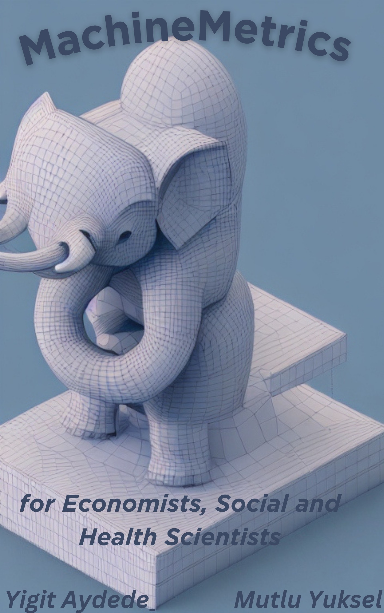

--- 
title: 'Causal MachineMetrics '
author: '[Yigit Aydede](https://yaydede.github.io/) and [Mutlu Yuksel](https://www.mutluyuksel.com/)'
date: 'This version: 2024-01-13'
subtitle: for Economists, Social and Health Scientists
titlerunning: MachineMetrics
site: bookdown::bookdown_site
documentclass: book
bibliography:
- book.bib
- packages.bib
biblio-style: apalike
nocite: '@*'
description: ''
link-citations: yes
cover-image: png/MachineMetrics.png
urlcolor: cyan
---

# Preface {.unnumbered}

## Why this book is different? {.unnumbered}

The uniqueness of this book lies in its approach to presenting topics and examples relevant to the fields of economics, social sciences, and related disciplines. Key features that set this book apart include:

1. Accessible language and concepts: Throughout the book, we consciously avoid using excessively technical terminology or concepts exclusive to computer science. Instead, we strive to present explanations in a clear and straightforward manner, employing terms and ideas that economists and social scientists are already familiar with. This approach ensures that the content is both accessible and relevant to the target audience

2. Tailored content: The book is specifically designed for researchers in economics, social sciences, and related fields, addressing topics and methods that are most relevant to their work.

3. Abundance of examples: We provide numerous examples throughout the book, ensuring that readers can thoroughly comprehend the concepts and methods presented.

4. Use of R programming language: Rather than depending on specialized packages, we emphasize the use of the core R language for all demonstrations and examples. This method allows readers to develop a more profound comprehension of the techniques and fosters the acquisition of crucial programming abilities. Additionally, we incorporate commonly used R packages for data analytics in specific sections to acquaint our readers with these tools.

5. Practical application: The topics covered in this book are illustrated using simulations or real-world data sets, enabling readers to connect the theoretical concepts with practical examples.

6. Cutting-edge research: In nearly all chapters, we include sections that showcase the most recent research papers in economics and social sciences. This feature keeps readers informed about the latest advancements in their respective fields, and it underscores the practical relevance of the methods discussed in the book.

By incorporating these features, we have created a resource that not only teaches essential concepts and techniques, but also demonstrates their real-world applicability and value for researchers in economics, social sciences, and related disciplines.

## Structure of Manuscript: {.unnumbered}
 
In this book, we delve into an extensive range of subjects aimed at equipping readers with a comprehensive understanding of various aspects of data analysis, modeling, and machine learning.

We commence with an introduction that highlights the differences between prediction and estimation, the relevance of the discussed topics in economics, health, and social sciences, the interpretation of concepts and terminology, and a comparison between machine learning and traditional econometric approaches. The initial section progresses to cover comprison of statistical and machine learning models, simulations, and discussions on prediction and estimation, correlation and counterfactual causal models.

To grasp the key methodology sections, we first explore the concept of learning, error types, bias-variance trade-offs, and overfitting in seperate chapters. We explain both fundamental parametric and nonparametric estimation techniques in order to familiarize our readers with these concepts. These initial chapters provide a seamless transition from inferential statistics and the "parametric world" to predictive models by including a section on nonparametric methods. In many cases, even at the graduate level, nonparametric methods are not commonly taught, as they are less frequently employed in inferential statistics. However, nonparametric econometrics serves as a bridge between the two domains of data modeling and algorithmic modeling, given that machine learning is essentially an extension of nonparametric econometrics. Subsequently, we present methods for hyperparameter tuning and a range of optimization algorithms, such as cross-validation and gradient descent. We present these topics using concepts that are well-known to economists, social scientists, and health researchers. 

Throughout the shrinkage sections, we discuss ridge, lasso, and elastic net methods. Subsequently, readers will encounter topics such as regression trees and ensemble learning techniques like bagging, boosting, and random forest models. We also delve into causality and machine learning, examining the implementation of counterfactual causal methods in health, economics, and social sciences, in addition to model selection, sparsity, and the application of machine learning tools. The diverse topics covered in these chapters include random experiment, instrumental variables, difference-in-differences, regression discontinuity, synthetic control, double/debiased lasso methods, and recently developed heterogeneous treatment effects, such as causal tree and causal forest.

We dedicate a comprehensive and standalone chapter to a thorough exploration of classification. In this chapter, we cover a wide range of topics, including: Introduction to Classification, Linear Probability and Logistic Regression, Goodness of Fit, Confusion Table, Performance Measures, Receiver Operating Characteristic (ROC), Area Under the Curve (AUC), and real-world Applications using the Caret package.

Following this, we delve into time series analysis combined with machine learning approaches. The topics covered in time series and forecast chapters include: ARIMA Models, the Hyndman-Khandakar Algorithm, Grid Search for ARIMA, Time Series Embedding, Vector Autoregression for Recursive Forecasting, Embedding for Direct Forecast, Random Forest, Univariate and Multivariate Analysis, and Rolling and Expanding Windows.

Next, we cover Support Vector Machines, neural networks, back propagation, and deep learning techniques. Both Support Vector Machines and Neural Networks utilize specific data transformations that project the data into a higher-dimensional space. In this section, we elucidate these topics in a step-by-step manner, employing simulations and concepts that are easy to understand. This approach distinguishes our book from many others in the fields of machine learning and data analytics, as we refrain from relying solely on pre-built R functions and instead focus on providing clear explanations and using hands-on simulation explained step-by-step.

Following that, we introduce the fundamentals of covariance, correlation, semi-partial correlation, regularized covariance matrix, and graphical ridge in the graphical network analysis section. We also cover matrix decomposition and singular decomposition techniques.

In the final section, we discuss principal component analysis, factor analysis, smoothing techniques, and address handling imbalanced data and fraud detection, as well as other nonparametric estimation methods. This provides readers with valuable insights into these specialized topics.

By covering this extensive range of topics, we aim to equip readers with the necessary knowledge and tools to effectively analyze, model, and make predictions using a wide array of methods and techniques in their fields. 
  
## Who Can Use This Book? {.unnumbered}

This book has been carefully crafted to cater to a diverse audience of motivated students and researchers who have a foundational understanding of inferential statistics using parametric models. The book's focus is on applied concepts, prioritizing practical application over extensive theoretical proofs and justifications. As such, it serves as an invaluable resource for those who wish to delve into real-world examples and case studies.

While no prior experience with the R programming language is assumed, having some familiarity with coding concepts will prove beneficial for readers. The book's content and structure have been designed to accommodate individuals with varying levels of coding expertise, ensuring that everyone can benefit from the material presented.

The target audience for this book includes, but is not limited to:

1. Graduate and advanced undergraduate students in economics, social and health sciences, and related disciplines who are keen to expand their knowledge of data analysis techniques and applications.

2. Researchers and practitioners in the fields of economics, social sciences, and beyond, who wish to acquire practical skills in data analytics and gain insights into the latest methodologies.

3. Educators and instructors who seek a comprehensive, application-focused resource for teaching data analysis methods to students in economics, social sciences, and related areas.

In summary, this book is an essential resource for anyone who is eager to learn and apply advanced data analysis techniques in the context of economics, social sciences, and related disciplines. With its clear explanations, practical examples, and accessible language, this book will enable readers to develop their skills and knowledge, regardless of their prior experience with R or coding in general.

## Acknowledgements {.unnumbered}

We would like to extend our heartfelt gratitude to our loved ones for their constant support during the creation of this book.Their unwavering belief in our abilities and vision has been invaluable, and we could not have reached this milestone without them.

Yigit is grateful for the sacrifices Isik has made and for her steadfast encouragement in the pursuit of this dream. Yigit is also grateful for the opportunity to share his passion for learning with Ege, his son.

Mutlu would like to extend his heartfelt thanks to his wife, Mevlude, whose love, patience, and understanding have been a constant source of strength and inspiration. Mutlu also extends his heartfelt gratitude to his sons, Eren and Kaan, whose laughter, curiosity, and boundless energy have been a driving force behind his determination to work harder and establish a lasting legacy.
 

## License {.unnumbered}

.](png/cc.png)

