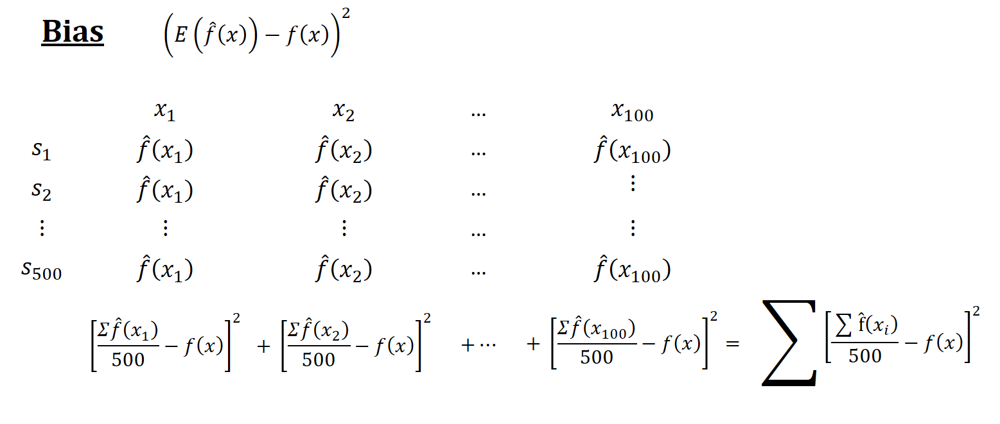

--- 
title: 'Causal MachineMetrics '
author: '[Yigit Aydede](https://yaydede.github.io/) and [Mutlu Yuksel](https://www.mutluyuksel.com/)'
date: 'This version: 2024-05-27'
subtitle: for Economists, Social and Health Scientists
titlerunning: MachineMetrics
site: bookdown::bookdown_site
documentclass: book
bibliography:
- book.bib
- packages.bib
biblio-style: apalike
nocite: '@*'
description: ''
link-citations: yes
cover-image: png/MachineMetrics.png
urlcolor: cyan
---

# Preface {.unnumbered}


## Why this book is different? {.unnumbered}

The uniqueness of this book lies in its approach to presenting topics and examples relevant to the fields of economics, social sciences, and related disciplines. Key features that set this book apart include:

1. Accessible language and concepts: Throughout the book, we consciously avoid using excessively technical terminology or concepts exclusive to computer science. Instead, we strive to present explanations in a clear and straightforward manner, employing terms and ideas that economists and social scientists are already familiar with. This approach ensures that the content is both accessible and relevant to the target audience

2. Tailored content: The book is specifically designed for researchers in economics, social sciences, and related fields, addressing topics and methods that are most relevant to their work.

3. Abundance of examples: We provide numerous examples throughout the book, ensuring that readers can thoroughly comprehend the concepts and methods presented.

4. Use of R programming language: Rather than depending on specialized packages, we emphasize the use of the core R language for all demonstrations and examples. This method allows readers to develop a more profound comprehension of the techniques and fosters the acquisition of crucial programming abilities. Additionally, we incorporate commonly used R packages for data analytics in specific sections to acquaint our readers with these tools.

5. Practical application: The topics covered in this book are illustrated using simulations or real-world data sets, enabling readers to connect the theoretical concepts with practical examples.

6. Cutting-edge research: In nearly all chapters, we include sections that showcase the most recent research papers in economics and social sciences. This feature keeps readers informed about the latest advancements in their respective fields, and it underscores the practical relevance of the methods discussed in the book.

By incorporating these features, we have created a resource that not only teaches essential concepts and techniques, but also demonstrates their real-world applicability and value for researchers in economics, social sciences, and related disciplines.

## Structure of Manuscript: {.unnumbered}
 
In this book, we delve into an extensive range of subjects aimed at equipping readers with a comprehensive understanding of various aspects of data analysis, modeling, and machine learning.

We commence with an introduction that highlights the differences between prediction and estimation, the relevance of the discussed topics in economics, health, and social sciences, the interpretation of concepts and terminology, and a comparison between machine learning and traditional econometric approaches. The initial section progresses to cover comprison of statistical and machine learning models, simulations, and discussions on prediction and estimation, correlation and counterfactual causal models.

To grasp the key methodology sections, we first explore the concept of learning, error types, bias-variance trade-offs, and overfitting in seperate chapters. We explain both fundamental parametric and nonparametric estimation techniques in order to familiarize our readers with these concepts. These initial chapters provide a seamless transition from inferential statistics and the "parametric world" to predictive models by including a section on nonparametric methods. In many cases, even at the graduate level, nonparametric methods are not commonly taught, as they are less frequently employed in inferential statistics. However, nonparametric econometrics serves as a bridge between the two domains of data modeling and algorithmic modeling, given that machine learning is essentially an extension of nonparametric econometrics. Subsequently, we present methods for hyperparameter tuning and a range of optimization algorithms, such as cross-validation and gradient descent. We present these topics using concepts that are well-known to economists, social scientists, and health researchers. 

Throughout the shrinkage sections, we discuss ridge, lasso, and elastic net methods. Subsequently, readers will encounter topics such as regression trees and ensemble learning techniques like bagging, boosting, and random forest models. We also delve into causality and machine learning, examining the implementation of counterfactual causal methods in health, economics, and social sciences, in addition to model selection, sparsity, and the application of machine learning tools. The diverse topics covered in these chapters include random experiment, instrumental variables, difference-in-differences, regression discontinuity, synthetic control, double/debiased lasso methods, and recently developed heterogeneous treatment effects, such as causal tree and causal forest.

We dedicate a comprehensive and standalone chapter to a thorough exploration of classification. In this chapter, we cover a wide range of topics, including: Introduction to Classification, Linear Probability and Logistic Regression, Goodness of Fit, Confusion Table, Performance Measures, Receiver Operating Characteristic (ROC), Area Under the Curve (AUC), and real-world Applications using the Caret package.

Following this, we delve into time series analysis combined with machine learning approaches. The topics covered in time series and forecast chapters include: ARIMA Models, the Hyndman-Khandakar Algorithm, Grid Search for ARIMA, Time Series Embedding, Vector Autoregression for Recursive Forecasting, Embedding for Direct Forecast, Random Forest, Univariate and Multivariate Analysis, and Rolling and Expanding Windows.

Next, we cover Support Vector Machines, neural networks, back propagation, and deep learning techniques. Both Support Vector Machines and Neural Networks utilize specific data transformations that project the data into a higher-dimensional space. In this section, we elucidate these topics in a step-by-step manner, employing simulations and concepts that are easy to understand. This approach distinguishes our book from many others in the fields of machine learning and data analytics, as we refrain from relying solely on pre-built R functions and instead focus on providing clear explanations and using hands-on simulation explained step-by-step.

Following that, we introduce the fundamentals of covariance, correlation, semi-partial correlation, regularized covariance matrix, and graphical ridge in the graphical network analysis section. We also cover matrix decomposition and singular decomposition techniques.

In the final section, we discuss principal component analysis, factor analysis, smoothing techniques, and address handling imbalanced data and fraud detection, as well as other nonparametric estimation methods. This provides readers with valuable insights into these specialized topics.

By covering this extensive range of topics, we aim to equip readers with the necessary knowledge and tools to effectively analyze, model, and make predictions using a wide array of methods and techniques in their fields. 
  
## Who Can Use This Book? {.unnumbered}

This book has been carefully crafted to cater to a diverse audience of motivated students and researchers who have a foundational understanding of inferential statistics using parametric models. The book's focus is on applied concepts, prioritizing practical application over extensive theoretical proofs and justifications. As such, it serves as an invaluable resource for those who wish to delve into real-world examples and case studies.

While no prior experience with the R programming language is assumed, having some familiarity with coding concepts will prove beneficial for readers. The book's content and structure have been designed to accommodate individuals with varying levels of coding expertise, ensuring that everyone can benefit from the material presented.

The target audience for this book includes, but is not limited to:

1. Graduate and advanced undergraduate students in economics, social and health sciences, and related disciplines who are keen to expand their knowledge of data analysis techniques and applications.

2. Researchers and practitioners in the fields of economics, social sciences, and beyond, who wish to acquire practical skills in data analytics and gain insights into the latest methodologies.

3. Educators and instructors who seek a comprehensive, application-focused resource for teaching data analysis methods to students in economics, social sciences, and related areas.

In summary, this book is an essential resource for anyone who is eager to learn and apply advanced data analysis techniques in the context of economics, social sciences, and related disciplines. With its clear explanations, practical examples, and accessible language, this book will enable readers to develop their skills and knowledge, regardless of their prior experience with R or coding in general.

## Acknowledgements {.unnumbered}

We would like to extend our heartfelt gratitude to our loved ones for their constant support during the creation of this book.Their unwavering belief in our abilities and vision has been invaluable, and we could not have reached this milestone without them.

Yigit is grateful for the sacrifices Isik has made and for her steadfast encouragement in the pursuit of this dream. Yigit is also grateful for the opportunity to share his passion for learning with Ege, his son.

Mutlu would like to extend his heartfelt thanks to his wife, Mevlude, whose love, patience, and understanding have been a constant source of strength and inspiration. Mutlu also extends his heartfelt gratitude to his sons, Eren and Kaan, whose laughter, curiosity, and boundless energy have been a driving force behind his determination to work harder and establish a lasting legacy.
 

## License {.unnumbered}

.](png/cc.png)


<!--chapter:end:index.Rmd-->

---
output:
  pdf_document: default
  html_document: default
---

#  Introduction:

Let’s start the book with an ancient parable. A group of blind men heard that a strange animal had been brought to the town, but none of them were aware of its shape and form. Out of curiosity, they said: "We must inspect and know it by touch, of which we are capable". So, they sought it out, and when they found it, they groped about it. They say the following one by one:

An animal such as a tree! ... said while holding his leg

An animal, such as walls! ... said while touching its broad and sturdy side

An animal like a snake! ... said while holding the squirming trunk within his hands

An animal, such as rope! ... said while seizing on the swinging tail

An animal like a fan! ... said while touching the ear 

An animal such as a spear! ... said while touching his tusk

What is this animal?

This animal is elephant!

Like in this parable, think someone, who just wanted to start to learn econometrics, came to you and ask for some advice. They're asking you the following question. How can I learn Econometrics? Your answer will depend on yours and that persons interest. You can tell that person to start with cross section, time-series, or panel data. Or you can start with frequentist approach or Bayesian approach. You can start with Econometrics theory then applied or vice versa. You can start with Applied Micro Econometrics or Macro Econometrics. You can start with parametric econometrics or nonparametric econometrics. You can provide any sources and courses and lectures with any of these topics and all of them are rightfully starting point to learn Econometrics. But people within this field even within the subfields don't agree totally which is the real econometrics and which is not.

Why are we telling this? Because everyone is talking about what machine learning is. Everyone explains this depending on their own field or from their own subfield or own perspective or what they're doing. Even finding a good definition for Machine Learning has become a subtle job as "machine learning" seems increasingly an *overloaded* term implying that a robot-like *machine* predicts the things by learning itself without being explicitly programmed.  

Machine learning involves programming computers to optimize performance criteria based on example or training data. It revolves around defining a model with certain parameters, where learning constitutes running a computer program to fine-tune these parameters utilizing training data derived from past experiences. The essence of machine learning is rooted in statistical theory, which forms the basis of building mathematical models. The primary objective here is to make predictions and inferences from samples. In summary, machine learning intertwines statistical theories with computer science to optimize models based on data, focusing both on efficient training of these models and effective implementation of the learned models for future inferences and predictions.

Hence, there are no "mysterious" machines that are learning and acting alone, but well-defined **statistical/econometrics models** for predictions that are optimized by efficient algorithms and executed by powerful machines, as known as computers. Thus, the part of the title of the book: **MachineMetrics**

<!--- ```{r, echo=FALSE, out.width = "700pt"}

``~ --->


<!--- use texshop to run the following latex command; obtain pdf file; open pdf in preview, choose tumbnail, export pdf to png, resolution 200.(existing png is saved as MLCategories.png)
\documentclass[12pt, oneside]{article}   	% use "amsart" instead of "article" for AMSLaTeX format
\usepackage{geometry}                		% See geometry.pdf to learn the layout options. There are lots.
\geometry{letterpaper}                   		% ... or a4paper or a5paper or ... 
%\geometry{landscape}                		% Activate for rotated page geometry
%\usepackage[parfill]{parskip}    		% Activate to begin paragraphs with an empty line rather than an indent
\usepackage{graphicx}				% Use pdf, png, jpg, or eps§ with pdflatex; use eps in DVI mode
								% TeX will automatically convert eps to pdf in pdflatex		
\usepackage{amssymb}
\usepackage{multirow}
\usepackage{caption}
%SetFonts

%SetFonts


%\date{}							% Activate to display a given date or no date
\pagestyle{empty} % This line removes page numbers

\begin{document}


\newgeometry{margin=0.1cm}


%\section{}
%\subsection{}

\begin{table}[h]
\centering
\caption*{Overview of Machine Learning Categories}
\label{table:ml_categories}
\begin{tabular}{|p{5cm}|p{6cm}|p{8cm}|}
\hline
\textbf{ML Category} & \textbf{Subcategory} & \textbf{Details} \\
\hline
\multirow{6}{*}{\textbf{\begin{tabular}[c]{@{}c@{}}Supervised \\ Learning\end{tabular}}} & \textbf{Classification} & 
    \begin{tabular}[c]{@{}l@{}}
    - Fraud detection \\
    - Image classification \\
    - Customer retention \\
    - Diagnostics \\
    - Email spam and malware filtering \\
    - Sentiment analysis \\
    \end{tabular} \\
\cline{2-3}
 & \textbf{Regression} & 
    \begin{tabular}[c]{@{}l@{}}
    - Forecasting (weather, stock prices) \\
    - Predictions (sales, revenue) \\
    - Process optimization (supply chain)  \\
    - Real estate pricing \\
    - Energy demand modeling \\
    \end{tabular} \\
\hline
\multirow{6}{*}{\textbf{\begin{tabular}[c]{@{}c@{}}Unsupervised \\ Learning\end{tabular}}} & \textbf{Clustering} & 
    \begin{tabular}[c]{@{}l@{}}
    - Recommendation systems \\
    - Targeted marketing \\
    - Customer segmentation \\
    - Genetic clustering \\
    - Social network analysis \\
    \end{tabular} \\
\cline{2-3}
 & \textbf{Dimensionality Reduction} & 
    \begin{tabular}[c]{@{}l@{}}
    - Big data visualizations \\
    - Meaningful compression \\
    - Structure discovery \\
    - Feature elicitation \\
    - Noise reduction \\
    - Data preprocessing \\
    \end{tabular} \\
    \hline
\textbf{\begin{tabular}[c]{@{}c@{}}Semi-Supervised \\ Learning\end{tabular}} & & 
    \begin{tabular}[c]{@{}l@{}}
  - Data labeling \\
  - Web content classification \\
  - Image and video annotation \\
  - Medical image analysis \\
    \end{tabular} \\
\hline
\textbf{\begin{tabular}[c]{@{}c@{}}Reinforcement \\ Learning\end{tabular}} & & 
    \begin{tabular}[c]{@{}l@{}}
    - Real-time decisions \\
    - Game AI \\
    - Learning tasks \\
    - Skill acquisition \\
    - Robot navigation \\
    - Autonomous vehicles \\
    - Personalized recommendations \\
    \end{tabular} \\
\hline
\multirow{12}{*}{\textbf{\begin{tabular}[c]{@{}c@{}}Deep \\ Learning\end{tabular}}} & \textbf{Convolutional Neural Networks (CNNs)} & 
    \begin{tabular}[c]{@{}l@{}}
    - Image and video recognition \\
    - Image segmentation \\
    - Medical image analysis \\
    \end{tabular} \\
\cline{2-3}
 & \textbf{Recurrent Neural Networks (RNNs)} & 
    \begin{tabular}[c]{@{}l@{}}
    - Language modeling \\
    - Speech recognition \\
    - Time series prediction \\
    \end{tabular} \\
\cline{2-3}
 & \textbf{Generative Adversarial Networks (GANs)} & 
    \begin{tabular}[c]{@{}l@{}}
    - Image generation \\
    - Art creation \\
    - Data augmentation \\
    \end{tabular} \\
\cline{2-3}
 & \textbf{Transformer Models} & 
    \begin{tabular}[c]{@{}l@{}}
    - Natural language understanding \\
    - Machine translation \\
    - Text summarization \\
    \end{tabular} \\
\hline
\end{tabular}
\end{table}

\end{document} --->

 The following machine learning visualization/list shows separate fields in machine learning.  


We designed this book for data-focused researchers aiming to provide an easily accessible toolkit which integrates causality with machine learning. When we first began exploring these topics years ago, we were uncertain about where to start and delved into various areas of machine learning mentioned in the table above. Our focus was on understanding individual topics and their applicability to our research. As applied microeconomists who have not been involved in fields like robot navigation or game AI, we concentrated on subtopics relevant to our work, such as dimension reduction, structure discovery, regression, and finance-related forecasting. Our interest mainly lies in areas related to causality, estimation, and optimization, as well as gaining new insights from raw data. As social scientists, only a portion of the topics in that table are applicable to our research. Thus, when discussing machine learning with professionals from computer science, robotics, or AI, they might highlight its use in song recommendations, image recognition, fraud detection, computer vision, speech recognition, document classification, and automated driving. Although these applications are fascinating, they do not directly relate to our area of expertise. However, it's noteworthy that nearly all these subfields are grounded in the statistical learning methods we cover in this book.

To understand machine learning, envision it as teaching a computer in a way similar to how we teach a child, a concept we'll explore in depth in Chapter 4. Imagine guiding a child to distinguish between animals, particularly identifying what a dog is and what a cat is. By the end of this exercise, the child will learn to recognize these animals. Instead of detailing every nuance of what differentiates a dog from a cat, you might show the child various pictures of dogs and cats. Over time, the child will start to notice patterns and be able to differentiate between the two animals. Machine learning works in a similar way. You feed a computer lots of data (like pictures of cats and dogs), and over time, the computer learns to recognize the patterns in the data.

Put simply, machine learning teaches computers to recognize patterns much as we teach children—though the former relies on data and algorithms, while the latter uses tangible examples and verbal explanations. Distinguishing between cats and dogs in images is just one facet of machine learning. Similarly, these techniques power our email filters to sort spam from important messages, enable virtual assistants like Siri or Alexa to understand voice commands, and help streaming platforms like Netflix or Spotify suggest movies or songs tailored to our preferences. These instances, alongside text analysis and speech recognition, underscore the pervasive role of machine learning in modern life. Yet, our primary emphasis will be on the techniques and uses of machine learning in data analysis, which is used for estimation procedures, data exploration, and causal inference.

A more fitting example for this book's content would be the following:

In a community with rising concerns about food allergies, Alex, a young individual, grappled with recurring allergic reactions. Driven by a pressing need to pinpoint their root cause, he embarked on a personal mission. Eager to understand the extent of his susceptibility, Alex meticulously documented each instance he consumed food as well as various nuts, leading to a preliminary data collection effort. 

In a bid to learn the reason of his sporadic sickness after eating, Alex adopted an approach resembling statistical and machine learning. By systematically recording his meals and subsequent health reactions, he discerned a pattern linking his discomfort to garlic consumption. Testing and validating his hypothesis through various food experiments, Alex refined his understanding, confirming garlic as the culprit while ruling out other foods. His methodical process of data collection, pattern recognition, hypothesis testing, and model refining mirrors the foundational steps in machine learning, showcasing how both humans and machines learn from data and adjust based on outcomes.

Visualization of this gathered data unveiled stark patterns, underscoring the correlation between his various nuts and garlic consumption and the allergic reactions, with garlic standing out prominently. Motivated to transition from mere correlation to concrete causation, Alex conducted controlled experiments, eventually confirming that garlic was the definitive cause of his allergic symptoms.

Realizing the potential broader implications of his discovery, especially for those who might share similar susceptibilities, Alex's endeavor caught the attention of researchers. Researchers embarked on a study to gauge its prevalence among those similar to Alex in the larger community. They selected a representative sample and found a significant proportion exhibited allergic reactions. Through their findings, they estimated a certain percentage of the broader group might have this allergy. Using statistical tools, they provided a confidence interval to show the likely range of this percentage. They then extrapolated their findings to the broader community, highlighting potential allergen prevalence. Yet, they acknowledged that their conclusions depend on the sample's accuracy and potential biases. This exercise underscores the principles of statistical estimation, with a focus on sampling, confidence intervals, and extrapolation.

Delving into statistical methods, they journeyed from basic correlations to deep causal insights, unraveling the true triggers behind such allergies. The research eventually progressed to other methodologies like time series forecasting of allergy intensities. Through using time series analysis and forecasting, researchers not only confirm the relationship between garlic consumption and allergic reactions in a larger sample but also provide valuable predictive insights for individuals similar to Alex.

Additionally, researchers employed graphical network analysis for the spread of allergy awareness in the population. By leveraging this analysis, they could grasp the intricacies of the community's social dynamics and the paths information took. This empowers them to deploy targeted interventions, ensuring that knowledge about garlic allergies is disseminated effectively.

Researchers also use of classification and regression models to ascertain risk categories and predict allergic reaction severity. While classification assists in grouping individuals as either high-risk or not, regression quantifies the anticipated intensity of their reactions.

Starting with Alex's personal exploration into his garlic allergy, mirroring the steps of statistical and machine learning, the scope expanded into a wider research project. This broader study harnessed statistical learning methodologies, using samples to gauge the prevalence of such allergies in the community. Both machine and statistical learning techniques can be instrumental in addressing varied research questions, demonstrating the multifaceted nature of learning from data.

In general, there are four different starting points and approaches to Machine Learning Theory. Bias- variance trade-off approach, Vapnik-Chervonenkis theory, Computational Complexity of Machine Learning, and Bayesian Learning. In this book, we will focus on bias-variance trade-off approach. This approach focuses on understanding and balancing the trade-off between bias (error from erroneous assumptions in the learning algorithm) and variance (error from sensitivity to small fluctuations in the training set). Optimizing this trade-off is crucial for developing effective machine learning models. 

The bias-variance tradeoff holds particular significance in the realms of economics, health and social sciences within the field of machine learning, often more so than other concepts like Vapnik-Chervonenkis (VC) Theory and Computational Complexity. This relevance is largely due to the nature of data and the specific requirements in these fields.

In economics,health and social sciences, the data used is often inherently noisy and uncertain. The bias-variance tradeoff plays a critical role in developing models that can effectively handle such data, striking a balance between capturing underlying patterns and not being overly sensitive to noise. This is crucial in these disciplines, where making sense of uncertain and complex real-world phenomena is a common challenge.

Another key aspect is the reliance on samples from larger populations in these fields. The bias-variance tradeoff is essential in understanding how well a model, trained on a sample, can generalize to the entire population. This is particularly important given that exhaustive studies are often impractical in economics, health and social sciences, making generalization a central concern. 

Furthermore, the interpretability of models and the explanations behind predictions are highly valued in these fields. Models with lower variance, which are simpler and more interpretable, align well with the need in economics and social sciences to communicate findings to a broader, often less technically-oriented audience. This emphasis on interpretability and explanation makes the bias-variance tradeoff more suitable than the more technical frameworks of VC Theory and Computational Complexity. These fields also often work with limited datasets, unlike fields with access to vast amounts of data. In such scenarios of limited data, the bias-variance tradeoff helps in constructing models that avoid overfitting, a common pitfall when data is scarce. Lastly, decisions in economics, health and social sciences carry significant real-world impacts and ethical implications. The bias-variance tradeoff assists in building models that are not only prudent and robust but also consider the ethical dimensions and practical constraints inherent in these fields.

In contrast, while VC Theory and Computational Complexity provide vital insights into the theoretical and computational underpinnings of machine learning models, they do not directly cater to the practical, interpretative, and ethical considerations that are paramount in the domains of health and social sciences. Again, as a side note, you can learn everything by starting from Vapnik-Chervonenkis Theory, the Perceptron Algorithm, especially if you are interested in deep learning and neural networks and you will reach to the same point. However, we will also cover these topics (deep learning and neural networks) in our book as well.

Machine Learning has three main paradigms build on the aforementioned theories. Supervised learning, Unsupervised learning, and Reinforcement learning.  The main paradigm we will cover in this book is supervised learning. Simply put, when we know the outcome, it is called supervised learning, and when we do not it is called unsupervised learning. The main topics we will cover under these paradigms are classification, regression, clustering, and dimensionality reduction. We will also cover some additional topics such as …… Some of these uninterpretable ML methods’ goal and aim are different as we will cover in this book. Now, lets discuss some basic concepts.
 
## Prediction vs. Estimation:

As a researcher our aim is finding associations and predictions using different dataset. We want to clarify some concepts that are used interchangeably, which is a mistake, in different machine learning sources.  

Keep in mind, the main aspect of machine learning is to use one set of data to generalize the findings on new data not seen yet.  We use the term Prediction to describe this process in Machine Learning. The other similar terms are extrapolation and forecasting. In social sciences, the most common term is estimation while analyzing main data. However, these terms have different connotations, and we think using them in the right place will help all of us to understand certain topics better.

Let’s started by describing the term of prediction first.

**Prediction** (Latin præ-, "before," and dicere, "to say"), or forecast, is a statement about a future event. They are often, but not always, based upon experience or knowledge. There is no universal agreement about the exact difference from "estimation"; different authors and disciplines ascribe different connotations. Prediction in the non-economic social sciences differs from the natural sciences and includes multiple alternative methods such as trend projection, forecasting, scenario-building and surveys. You can read different definitions of prediction and its use from 12 different fields from science, sports, finance, and non-scientific context. Here is the link (https://en.wikipedia.org/wiki/Prediction).  


**Extrapolation**: the action of estimating or concluding something by assuming that existing trends will continue, or a current method will remain applicable. Extrapolation is estimating the value of a variable outside a known range of values by assuming that the estimated value follows some pattern from the known ones. In mathematics, extrapolation is a type of estimation, beyond the original observation range, the value of a variable is based on its relationship with another variable.

**Forecasting**: the process of making predictions based on past and present data. Risk and uncertainty are central to forecasting and prediction; it is generally considered a good practice to indicate the degree of uncertainty attaching to forecasts. In any case, the data must be up to date in order for the forecast to be as accurate as possible.  “Good forecasts capture the genuine patterns and relationships which exist in the historical data, but do not replicate past events that will not occur again.” (reference Hydman book ). This term is more commonly used in fields of Finance and Economics. Generally, people use time series data and methods for forecasting.  

Even though, we think extrapolation is better term, we use forecast in Economics, Finance, or prediction in Machine Learning.

We should be aware that prediction in economics and social sciences differs from the natural sciences. If you discover a relationship in the natural sciences and explain the conditions for that relationship, then that relationship holds regardless of where and when it is found unlike social sciences. Hence, this relationship can be understood as both a prediction as well as an extrapolation. Consider the example of a chemical reaction occurring in a laboratory under well-defined conditions; the findings become immediately applicable to other locations with the same conditions. Moreover, in natural sciences, prediction incorporates multiple alternative methods such as trend projection, forecasting, and scenario building.

The hardest part of prediction in the social sciences, "predictors are part of the social context about which they are trying to make a prediction and may influence that context in the process". In another word, you predict something and implement the policy using this prediction, people change their behaviour based on this new policy, even before implementing the policy. In economics, this is well known as Lucas Critique.  “Lucas summarized his critique: Given that the structure of an econometric model consists of optimal decision rules of economic agents, and that optimal decision rules vary systematically with changes in the structure of series relevant to the decision maker, it follows that any change in policy will systematically alter the structure of econometric models.”

Estimation is various procedures to find an estimate using a sample drawn from the population. Estimate is the potential range of values of some property of a population and generated by projecting results from samples onto the entire population. Both effect and prediction research questions are inherently estimation questions, but they are distinct in their goals. In encapsulating Effect, the researcher is mainly interested in estimating the effect of exposure on outcome adjusted for covariates. On the other hand, when the focus is Prediction, the researcher is mainly interested in generating a function to input covariates and predict a value for the outcome. Mostly, economists and social and health scientists estimate an effect, and try to find Causal Explanation/Attribution. Even though, Economists prefer to use causal relation or explanation, statisticians studying these topics prefer to use the term of attribution.

**What about prediction?**

Most economist claim that economics research is not about prediction but estimation and finding a causal explanation. For instance, Ludwig von Mises, “[predicting the economic future is] beyond the power of mortal man”. Or Applied economists act as if unbiased estimation is prediction (on average). Even some claims prediction is not a good thing, and it is unscientific. We are interested in understanding things, not just predicting, or controlling them. However, “being able to predict something is a sign that you understand it, not being able to predict is a good sign that you don’t.”	

However, in real life, most people or firms are interested in prediction.  For instance, individually you ask whether this education policy is good for my children, and you don't care about the average estimates. You care about what will happen to your own kids education with this specific teacher or specific education policy. Similarly, crime forecasting in the law enforcement operations, or the change in specific treatment might cure the patient, or improve the prediction of one-year survival probability after sickness, treatment, etc.
All in all, you want a specific individual prediction. You don't care too much about the average estimated effect of the population.

Here you can see two very good sources that you can read about this discussion.
\footnotetext[1]{Bradley Efron,(2020) \href{https://doi.org/10.1080/01621459.2020.1762613}{"Prediction, Estimation, and Attribution"}, \textit{Journal of the American Statistical Association}, 115:530, 636-655}
\footnotetext[2]{Shmueli, Galit,(2010) \href{https://dx.doi.org/10.2139/ssrn.1351252}{"To Explain or To Predict?"}, \textit{Statistical Science}}


## Where can you use the covered topics in Social Sciences?:

In addition to clarifying the terms and terminology above, we would like to emphasize that even though Machine Learning is used primarily for prediction, we, as economists,social and health scientists, can use machine learning and other statistical and econometric tools  covered in this book for estimation procedures, exploration of data, causal inference, and more.

To begin, we can transform text, images, historical documents, and similar unconventional information into new data. It may be possible to incorporate job descriptions, language and sentiment of financial documents, social media, court transcripts, and health reports into indexes or other types of variables. Researchers can implement these types of new tools in almost any program in a straightforward and reliable way with ready-to-use packages.

The standard machine learning methods are correlational approaches; therefore, we can use some of these methods to visualize data in a more meaningful way, analyze it better, and identify patterns in the data. We have discussed several of these methods in this book, such as graphical modelling, semi-partial correlation, regularized covariance matrix, graphical ridge and lasso models.

There are some statistical methods which assist researchers in reducing dimensions when they are attempting to identify patterns between variables and identify significant influences, i.e. correlation analysis. The correlation analysis is a statistical method used to determine the degree of relationship between two or more variables while accounting for both spatial and temporal dimensions of these static and dynamic relationships. Correlation analysis may become complicated when the model includes too many variables as well as ‘latent variables’. These latent variables are unobserved but influential factors that explain a significant proportion of the variation common among the input variables. In the social sciences, it is common to use either random or fixed effect indicators to account for these unobserved factors.  However, dimension reduction methods should be used for settings which has too many latent variables, as well as dynamic spatial and temporal relationships. Some of these methods we cover are Principle Component Analysis, Factor Analysis, as well as Dynamic Mode Decomposition which can be thought of as an ideal combination of spatial dimensionality-reduction techniques.

In economics as well as other health and social sciences, finding causal relationship is the ultimate goal for any researcher, policy maker or business. Researchers use some machine learning methods to improve some of the usual causal methods. Researchers work with Rubin causal framework, in which they compare the representative sample in actual and counterfactual situations to find treatment or causal effect. Thus, imputing missing counterfactual values are mainly a prediction problem. Hence, researchers implement various ML methods for Direct and conditional randomization, Indirect randomization: Instrumental variables, Local randomization: Regression discontinuity, Second-order randomization: Difference-in-difference, as well as Propensity Score matching, and Synthetic Control methods.

Both Athey&Imbens (2019) and Mullainathan & Spiess (2017) highlight, “some substantive problems are naturally cast as prediction problems, and assessing their goodness of fit on a test set may be sufficient for the purposes of the analysis in such cases. In other cases, the output of a prediction problem is an input to the primary analysis of interest, and statistical analysis of the prediction component beyond convergence rates is not needed.” As an example , Variable Selection in $ y=D\gamma+X\beta+\epsilon$ as most coefficients besides treatment one are inconsequential! Another common example is first stage selection (since the first stage deals with prediction problems) in instrumental variable models. Debiased Machine Learning for Treatment is another recently developed method.
[footnote: [https://doi.org/10.1146/annurev-economics-080217-053433 ])  ]
(https://arxiv.org/pdf/1712.10024.pdf)

Researchers are also interested in knowing how treatment affects certain sub-populations in addition to finding the average treatment effect. A given treatment may have different effects on different units. Heterogeneity of treatment effects refers to the study of these differences across subjects. There are several machine-learning methods that can help to improve heterogeneous treatments or causal effects, including Causal Forest. The casual forest approach splits the covariate sample and calculates predictions as a local average treatment effect. (footnote: https://arxiv.org/abs/1712.09988 )

Almost always, in social sciences, we assume our models are linear and parametric. Model selection, however, is the process of selecting one model out of numerous potentials for a predictive problem. We discuss in detail the importance and usefulness of model selection as well.
	
Time series forecasting is a fundamental task at the core of many data-driven applications. Forecasting models were developed using a variety of advanced autoregressive methods, including ARIMA. Rather than using normal time series tests, we show how to grid search ARIMA model hyperparameters. Furthermore, methods based on deep learning have been explored for time series forecasting. Additionally, we cover an embedding method that enhances the performance of many deep learning models on time series data. As a result of the embedding layers, the model can simultaneously learn from several time series of different units. These categorical features (e.g., holidays, weather, geography) are embedded in a lower dimensional space to extract useful information.


The dynamic discrete choice (DDC) models are used for modeling an agent's choices among discrete options. As opposed to the assumption that observed choices are the result of static utility maximization, DDC models assume that observed choices are the result of maximization of the present value of utility. DDC methods aim to determine the structural parameters of the decision process of agents. By using these parameters, researchers can simulate how the agent would behave in a counterfactual setting. Recently developed machine learning methods have the potential to improve DDC models . [Dynamic Discrete Choice models (https://arxiv.org/abs/1808.02569) (https://sites.google.com/view/semenovavira/research?authuser=0)]

Obtaining reliable estimates of demand is fundamental to a wide range of studies in Industrial Organization and other fields of economics. For every counterfactual question concerning a market, it is necessary to quantify the response of choices to ceteris paribus changes in prices and other characteristics of the market. The most common methods of estimating demand are linear, logit, nested logit, and DDC. Recently, ML methods have been incorporated into routine demand estimation techniques to improve the out-of-sample prediction accuracy.
 [Footnote: Recent very extensive review about demand estimation: https://cowles.yale.edu/sites/default/files/d2301.pdf]

## Translation of Concepts: Different Terminology

-	Raw data and labels; create features (covariates(x)) which is input data

-	to train an algorithm: to run an estimation procedure

-	Estimation sample; Training data

- Features – Predictive covariates, Regressors

-	Labels- Outcome

-	Training Data- Sample

-	Prediction Rule (hypotheses): A function for prediction

-	Hypothesis testing:  testing whether prediction rule (function) is true or not (not a coefficient test)

-	Learning algorithms: algorithm which map samples into predictor functions.

-	a (categorical) dependent variable (y); Label

-	a (continuous) dependent variable (y); Response

-	Classification: predicting Discrete variables (-1, 1)

-	Regression: predicting a continuous value		

-	Use training data, validation data and test data (in-sample and out-sample)	

-	Linear regression is one type of parametric algorithm

-	Bias-Variance Tradeoff

-	The main goal is to get good out-of-sample predictions. To do so, we must overcome a problem known as overfitting.

-	Regularization ; hyperparameter by model tuning using cross-validation or penalty measure (like Akaike’s information criterion (AIC))

-	Minimize loss function and Learning parameters (minimize cost function using Lagrangian or gradient descent)

-	Non-parametric supervised learning algorithms: k-NN and	decision trees

-	Unsupervised learning (no y): principal components analysis (PCA), k-means clustering, Hierarchical clustering (\href{https://towardsdatascience.com/how-gene-expression-related-to-leukemia-type-using-pca-and-hierarchical-clustering-c8561303853a}{Real life example}), Singular value decomposition (SVD)

- Support Vector Machine

-	Ensemble methods; Bagging; Boosting

-	Neural Networks; Deep Learning

## Is Machine Learning Better?

Machine learning, while a powerful tool, may not always be the most suitable approach for every research inquiry. A crucial aspect of conducting research is the formulation of a precise and answerable research question. The strengths and weaknesses of conventional research methods versus machine learning techniques differ, and it is vital to establish the research objective before embarking on any study.

Traditional estimation methods still hold significant value and will continue to be employed in various research settings. However, machine learning techniques can be harnessed for their predictive capabilities. It is essential to understand that machine learning does not provide a solution to the core identification problem in social sciences, which revolves around the fact that counterfactual situations remain unobservable. Nonetheless, machine learning can enhance our ability to create certain counterfactual scenarios.

Machine learning demonstrates exceptional performance in tasks involving the prediction of patterns or structures, such as letters, words, and images. For example, it can accurately predict handwritten letters with a remarkable 99.97 percent accuracy rate. Despite these impressive capabilities, machine learning cannot replace human intuition or theoretical understanding when addressing the question of "why?" Furthermore, it is limited in its ability to predict large, unforeseen events (also known as "black swans"), as its predictions are grounded in historical data, and predicting such exceptional occurrences proves to be challenging.

In conclusion, researchers should carefully consider the purpose of their study and the specific research question at hand when deciding whether to employ machine learning techniques or rely on conventional statistical and econometrics methods. While machine learning offers notable advancements in predictive accuracy, it remains limited in addressing certain aspects of research, such as explaining causality and anticipating unexpected events.


<!--chapter:end:01-intro.Rmd-->


# Spectrum of Data Modeling:

In the rapidly evolving landscape of data analysis, the ability to effectively model and interpret data stands as a cornerstone of insight and innovation. 'Spectrum of Data Modeling' offers on an exploratory journey through the multifaceted world of data modeling, weaving together the threads of statistical and machine learning approaches, the nuances of parametric and nonparametric models, and the distinct realms of predictive and causal models. This chapter aims to demystify the complexities inherent in choosing the right modeling approach, delving into the critical aspects of model selection and the transformative role of simulation in understanding and predicting complex systems. As we navigate through these diverse methodologies and their applications, we aim to provide a comprehensive guide that not only enlightens the theoretical underpinnings but also illuminates their practical implications in various fields.

## Statistical vs. Machine Learning Approaches:

In the modern era of data-driven decision-making, comprehending the array of tools and techniques for data analysis is crucial. Machine learning and statistical modeling stand out as two prominent techniques in this domain. While they share similarities, it's important to understand that they are distinct in their purposes and goals, each contributing uniquely to the field of data analysis.

Machine learning models and statistical models, though sometimes used interchangeably, have distinct identities and functions. Each serves a specific purpose, and recognizing these fundamental distinctions is key to effectively navigating the complex landscape of data analysis. This understanding is not just academic; it has practical implications in how data is interpreted and used in various fields.

Both machine learning and statistical modeling are pivotal in data analysis, providing essential tools for predictions, model building, and informed decision-making. Statistical learning, which is often equated with machine learning, focuses on methods like decision trees, neural networks, and support vector machines, primarily for predictive purposes. In contrast, statistical learning, particularly in the context of inferential statistics in social and health sciences, places a stronger emphasis on developing models that accurately represent data, explaining and interpreting the relationships between variables. This distinction highlights the different orientations of these two approaches: one towards prediction and the other towards explanation.

In this section, we delve deeper into machine learning and statistical learning, discussing their key features, objectives, and the nuances that set them apart. This exploration is not just about understanding definitions; it's about appreciating how these methodologies shape the way we analyze data, draw conclusions, and make predictions in various fields. By the end of this section, the reader should have a clearer understanding of when and how to use these powerful tools in their data analysis endeavors.

In the realm of data analysis, the **primary objectives** of statistical models and machine learning models mark a fundamental distinction between the two. Statistical models are primarily concerned with investigating the relationships between variables, aiming to uncover and explain intrinsic patterns and connections. In contrast, machine learning models, often referred to as "Algorithm-Based Learning," focus on delivering precise predictions, learning directly from data without the need for explicit rule-based programming.

Machine learning stands out for its dynamic approach, where algorithms continually refine their performance as they process more data, thereby enhancing their prediction accuracy and decision-making capabilities. The core goal of machine learning is to use input data to generate accurate predictions. These models employ mathematical and statistical techniques to identify patterns and relationships, preparing them to make predictions on new and unseen data. The distinguishing feature of machine learning is its ability to predict future outcomes without being pre-programmed with specific assumptions about outcomes or functionals. The more data these models process, the more refined and accurate their predictions become.

Conversely, statistical models are tailored to infer relationships between variables. Their primary aim is to analyze data deeply, revealing the underlying patterns or connections between variables, which then serve as the foundation for informed decisions. Statistical learning, often described as "Learning from Data," focuses on using data to determine its originating distribution. A typical task in statistical inference might involve identifying the underlying distribution, \( F \), from a sample set like \( X_{1},...,X_{n} \sim F \).

Statistical modeling is essentially the formalization of relationships within data, defining connections between variables through mathematical equations. At its heart, a statistical model is a hypothesis about the genesis of the observed data, grounded in probability distributions. This encompasses a wide range of models, from regression and classification to non-parametric models.

The overarching goal of statistical learning theory is to provide a framework for studying the problem of inference. This includes gaining knowledge, making predictions, making decisions, and constructing models from a dataset. The analysis is conducted within a statistical paradigm, which involves making certain assumptions about the nature of the underlying data generation process. This contrast in objectives and methodologies highlights the unique roles that machine learning and statistical modeling play in the field of data analysis, each with its distinct approach to understanding and utilizing data.

Statistical learning, often paralleled with machine learning, primarily focuses on predictive methods such as decision trees, neural networks, and support vector machines. This approach involves training models on a set dataset, with the goal of maximizing prediction accuracy on a test set. Techniques like cross-validation and boosting are integral to this process, enhancing the model's ability to accurately predict outcomes. The essence of statistical learning lies in developing an effective approximation, $\hat{f}(x)$, of the function $f(x)$ that captures the relationship between inputs and outputs. This approximation is then used as a predictive tool based on the data at hand.

In fields like social and health sciences, where statistical learning aligns more closely with inferential statistics, the methodology differs significantly. Here, the emphasis is not on splitting data into training and testing sets but on creating models that accurately represent the data and elucidate the relationships between variables. These models are pivotal for tasks such as hypothesis testing and estimation. Typically, these models are formulated based on theoretical understanding or insights into the data generation process. They are used to interpret relationships between data and variables, determining the effects and significance of predictor variables. This approach is more about understanding the magnitude and dynamics of these relationships rather than just predicting outcomes.

Machine learning, or statistical learning in a predictive context, takes a distinctly empirical approach. It prioritizes accurate predictions based on observed data patterns over theoretical model assumptions. This focus on empirical data and prediction accuracy is what differentiates machine learning from traditional statistical modeling. While inferential statistical models aim to explain and understand, machine learning models are designed to predict and adapt, reflecting the diverse methodologies and applications within data analysis. This distinction highlights the unique contributions of each approach to the field, underscoring their respective strengths in explanation and prediction.

In concluding this exploration of statistical learning and machine learning, it's clear that while they share common ground, they are fundamentally distinct in their primary objectives and applications. Machine learning models are primarily designed for making accurate predictions, harnessing the power of algorithms to learn from data and adapt accordingly. In contrast, statistical models delve into understanding and inferring the relationships between variables, offering a more traditional approach to data analysis.

Statistical learning, often seen as a subset of machine learning, incorporates methods like regression to make predictions. However, it differs from inferential statistics, which focuses more on inference than prediction. The key distinction lies in the methodologies employed and their respective emphasis on prediction versus inference.

Both statistical learning and inferential statistics are capable of making predictions and inferences, but they prioritize these objectives differently. Statistical learning tends to focus more on prediction, sometimes at the expense of detailed inference. Conversely, inferential statistics place a higher value on inference, often prioritizing it over the predictive accuracy.

The balance between accuracy and interpretability is also a crucial aspect to consider. Statistical models, while insightful and capable of making predictions, may sometimes fall short in capturing complex relationships within data. Machine learning models, on the other hand, often excel in prediction accuracy. However, this comes with a trade-off, as their predictions, though accurate, can be complex and challenging to interpret and explain.

In the broader context of data analysis, statistical modeling and machine learning emerge as distinct yet complementary techniques. Each brings unique features and applications to the table, enabling the development of sophisticated algorithms that learn from data and make informed predictions or decisions. By grasping the fundamental concepts, goals, and applications of these techniques, researchers and practitioners can effectively leverage their strengths to address a wide array of data-driven tasks and challenges, thereby enhancing their understanding and decision-making processes in an increasingly data-centric world. 

Leo Breiman, a renowned statistician, introduced the concept of "two cultures" in statistical modeling in his influential 2001 paper. This concept delineates two distinct approaches to statistical modeling: the data model approach (Classical Statistical Modeling) and the algorithmic model approach (Machine Learning). The data model approach, deeply rooted in classical statistical modeling, is based on the assumption that data is generated from a specific stochastic data model. Its focus is on making inferences about this underlying data model, involving the selection of a model, estimation of its parameters, and hypothesis testing. Techniques like linear regression, logistic regression, and ANOVA are typical examples. This approach is known for its interpretability and clarity in understanding how variables interrelate, making it suitable for theory development and testing. However, it often struggles with complex or high-dimensional data where the underlying model is not well understood or too complicated for simple models.

In contrast, the algorithmic model approach, closely aligned with machine learning, views the modeling process as a black box, prioritizing prediction over inference. Its primary goal is to find an algorithm that excels in predicting outcomes, without necessarily delving into the underlying data generation process. This culture encompasses techniques like decision trees, neural networks, and support vector machines. It generally performs better in situations where the relationship between input and output is complex or not well understood, or in handling large datasets. A significant limitation of this approach is the lack of interpretability; it's often challenging to understand the reasons behind a model's predictions, which can be problematic in fields where the rationale is as crucial as the outcome.

Breiman's discussion of these two cultures underscores the philosophical and practical differences in statistical modeling. He emphasized the importance of considering both approaches and advocated for a greater emphasis on the algorithmic model approach in statistical practice, foreseeing the rise and significance of machine learning techniques in data analysis. Beginning of section 9, we will discuss further this Dichotomy of Statistical Modeling, the contemporary discussions, and the convergence of these two approaches in detail. Leo Breiman's two cultures in statistical modeling have a complex relationship with parametric and nonparametric models. The data model approach often leans towards parametric model. On the other hand, the algorithmic model approach aligns more closely with nonparametric models. We will also delve deeper into the relationship of these approaches and parametric and nonparametric models in Chapter 9. Thus, it becomes essential to explore the nuances of Parametric and Nonparametric Models next.


## Parametric and Nonparametric Models:

Each model type, parametric or non-parametric, comes with its unique strengths and limitations, and the choice between them depends on the nature of the data and the research question at hand.

Parametric models are grounded in specific assumptions regarding the data's underlying distribution, such as normal or binomial distributions. These assumptions are fundamental to the models' ability to estimate distribution parameters like the mean and standard deviation, which are subsequently used for making predictions or inferences about the population. Classic examples of parametric models include linear regression, logistic regression, ANOVA, polynomial regression, and Poisson regression, which are generally regarded as more efficient and robust, particularly when the data conforms to the model's assumptions. However, these models may produce biased or inaccurate results if their underlying assumptions are violated.

Building on this, nonparametric models come into play as an alternative approach, eschewing the need for predetermined distributional assumptions. This makes them particularly valuable when the data's distribution is unknown or when it fails to meet the criteria demanded by parametric models. With their hallmark flexibility and robustness, nonparametric models may sacrifice some efficiency and potentially possess lower statistical power, yet they excel in their adaptability to various data forms. Techniques falling under this category include k-Nearest Neighbors, the Spearman rank correlation, kernel density estimation, and Decision Trees such as CART. These methods are particularly favored for handling ordinal or categorical data, or in more complex modeling situations where the strict assumptions of parametric models are unmet. 

In statistics and machine learning, parametric methods often adopt a model-based approach, starting with an assumption about the form of the function $f$. For instance, one might assume $f$ is linear. This assumption guides the selection of a model to estimate the function's parameters. Despite their speed and less data-intensive nature, a significant drawback of parametric methods is the potential inaccuracy of their foundational assumptions. If the true nature of $f$ deviates from the assumed form, such as being nonlinear when a linear form is assumed, the model's predictions and inferences can be misleading. Due to their reliance on less flexible algorithms, parametric methods are generally more suited to simpler problems and offer greater interpretability.

Conversely, non-parametric methods do not make any assumptions about the form of $f$. This lack of assumptions allows these methods to estimate functions that can take on any shape or form, thus providing the flexibility to model more complex relationships within the data. Non-parametric methods do not confine the function $f$ to a specific structure, enabling a more adaptable approach to modeling. Such adaptability is crucial in situations where the intricacies of data relationships are not well-served by the rigid frameworks of parametric models.

As a result, non-parametric methods are often preferred for their capacity to model without the constraints of fixed distributions, offering a dynamic tool for analysts facing diverse challenges. Despite these advantages, non-parametric models typically require a substantial amount of data to accurately model complex relationships and can be computationally intensive. This need for significant data is attributable to their precision in fitting data points closely, which, while leading to accuracy, may also result in less efficiency during model training. Moreover, the flexibility of non-parametric methods, although advantageous for fitting data, may lead to overfitting, where the model learns the noise and errors as patterns, thus failing to generalize well to new, unseen data points. Nonetheless, the flexibility of non-parametric methods can lead to superior model performance since they are not restricted by predefined assumptions about the underlying function. Additionally, the ability of non-parametric methods to model data in its raw and often unstructured form makes them invaluable in the field of statistical analysis and machine learning, particularly when exploratory analysis is required, or when the data defies simple categorization. This flexibility, however, may cause many non-parametric methods to be less interpretable due to the complexity and variability of the functions they can model.

In summary, parametric and non-parametric methods represent different philosophies in statistical modeling and machine learning. Parametric methods, with their foundational assumptions, efficiency, and interpretability, are optimal for problems where the underlying data distribution is well understood and conforms to those assumptions. Non-parametric methods are advantageous when the data's structure is unknown or complex, and when the model needs to be as flexible as possible to capture the nuances within the data, although they require more data and computational power and might yield models that are less immediately interpretable. Both approaches have their place in the data scientist's toolkit.  The decision on which modeling approach to use should be carefully considered, balancing the need for accuracy, generalizability, and computational resources.

As we progress through the book, particularly in Chapter 9, which is entitled "Parametric Estimation - Basics", we will delve into the dichotomy of statistical modeling: Data versus Algorithmic Approaches. This section will explore these two approaches in greater depth, engage with contemporary discourse, and examine the integration of econometrics with machine learning. By doing so, we aim to provide a comprehensive understanding of these methodologies and their practical applications in statistical analysis, and connection of parametric and nonparametric approach to machine learning. In Chapter 10 titled " Nonparametric Estimations - Basics", we will focus on nonparametric estimation, particularly on the conditional expectation function (CEF), denoted as  $E[Y | X = x] = m(x)$. This approach contrasts with parametric models, which typically impose a predetermined functional form on $m(x)$. Nonparametric models permits a more dynamic and non-linear representation of  $m(x)$, offering invaluable flexibility when theoretical models present no specific parametric constraints. 

https://towardsdatascience.com/parametric-vs-non-parametric-methods-2cea475da1a

## Predictive vs. Causal Models:

Predictive and causal models represent two distinct approaches in statistical analysis, each with its specific objectives and methodologies. While predictive models concentrate on forecasting future outcomes, causal models delve into understanding the underlying causes of specific outcomes. This section aims to elucidate the differences between these two types of models.

Predictive models are a staple in fields like finance, marketing, and healthcare, where forecasting future trends or predicting the likelihood of certain events is crucial. These models harness past data to predict future outcomes, relying heavily on correlations between variables. They use samples of data collected over time to construct a statistical model that can forecast future events. However, it's important to note that predictive models, with their focus on correlations, are not designed to unravel causal relationships. They are adept at predicting future events or trends but may fall short in providing insights into the reasons behind these outcomes. Time series analysis, forecasting models, and machine learning algorithms for classification and regression tasks are typical examples of predictive models.

On the other hand, causal models are primarily concerned with understanding the causal relationships between variables. They are extensively used in disciplines like economics, sociology, and medicine, where identifying the underlying causes of a phenomenon is key. These models are built on the concept of causality, which posits that certain events or factors can directly cause other events or outcomes. To establish causality, researchers often employ experimental or quasi-experimental designs, where they manipulate or control variables to isolate their effect on the outcome. This approach allows them to determine the causal impact of specific variables. Techniques like experimental design, observational studies, and instrumental variables analysis are commonly used in building causal models. These methods help control for confounding variables and accurately estimate the causal effect of a particular variable on the outcome of interest.

In essence, predictive and causal models cater to different needs in data analysis. Predictive models excel in forecasting future outcomes by identifying correlations, whereas causal models strive to uncover the underlying causes of those outcomes through the study of causal relationships. Understanding the distinction between these models is crucial for researchers and analysts, as it guides them in choosing the appropriate approach based on their specific goals and the nature of the data at hand.

## Model Selection:

Data modeling, a pivotal aspect of modern analytics, involves a series of critical decisions that shape the effectiveness of data analysis. This section delves into these choices, highlighting the differences between parametric and nonparametric models and providing examples for better understanding.

The process of data modeling begins with choosing an appropriate model family. Parametric models, defined by specific parameters (β_{j}), are refined by adjusting these parameters, as seen in linear regression. In contrast, non-parametric models, often used in machine learning, do not rely on fixed parameter specifications and instead use a more fluid, algorithmic approach. For example, when modeling housing prices, a parametric approach might use fixed factors like square footage and location, while a non-parametric method, such as a decision tree, might dynamically evaluate various factors.

The nature of the data guides the choice between linear and polynomial models. Complex relationships within the data necessitate careful selection of variables and the degree of polynomial terms. A linear model might indicate a straightforward correlation between years of education and income, whereas a polynomial model could reveal subtleties, such as diminishing returns on income beyond a certain level of education. In cases where there are no interactions between predictors, the influence of a variable remains consistent, emphasizing the need to understand the true Data Generating Mechanism (DGM) during model selection.

Once a model type is chosen, the next step is to decide on the fitting technique. While ordinary least squares (OLS) and maximum likelihood estimation (MLE) are common, other methods may be more suitable depending on the data's characteristics and the desired properties of the estimates. For example, generalized least squares might be preferable when data shows varying variances across observations.

The decisions made in model selection set the stage for either causal or predictive analyses. Causal analyses seek to understand the reasons behind relationships, such as the health effects of certain diets, while predictive analyses focus on forecasting future events based on existing data, like predicting rainfall in a region.

Parametric and nonparametric models are fundamental in statistical modeling, influencing data analysis, predictions, and inferences. Parametric models assume a defined relationship between variables, whereas nonparametric models are more adaptable and can capture more complex relationships. For instance, a parametric model might linearly relate age to fitness levels, while a nonparametric model could identify unexpected patterns at certain ages.

In conclusion, the art of data modeling lies in the careful selection of the model family, its nature, and the fitting technique. Understanding the nuances between parametric and nonparametric models is crucial for effective model selection, allowing for the creation of models that accurately reflect the relationships between variables and enable robust predictions and inferences.

## Simulation:

Simulation is an integral technique that combines statistical and computational methods to model and analyze complex systems and processes. By creating mathematical or digital representations of real-world systems, researchers can generate synthetic data or predict system behavior, a method that proves crucial in fields like statistics, economics, and data science. It offers profound insights into the characteristics of models and the influence of different factors on outcomes.

The **value of simulation** is highlighted in its ability to address predictive challenges. For instance, in complex or nonlinear models, such as forecasting stock market movements, predicting behavior can be difficult due to the involvement of numerous unpredictable factors. Additionally, simulation tackles analytical challenges where the mathematics underlying a model are too intricate or even unsolvable using conventional methods, such as calculating the trajectory of a satellite in space with multiple gravitational influences. Furthermore, simulation plays a critical role in change impact analysis, allowing researchers to explore the effects of altering initial values, parameters, or assumptions, which is crucial for understanding potential scenarios like testing the impact of different interest rates on an economic model.

The **applications of simulation** are diverse and impactful. In statistics, it is a key tool for assessing the properties of statistical models, such as their reliability, and helps in understanding the influence of various factors on statistical estimates. It is instrumental in validating and comparing model performance, with techniques like bootstrapping used to estimate the accuracy of sample statistics. In the realm of economics, simulations are employed to model and analyze complex economic structures, aiding in forecasting the effects of policy changes or market dynamics. This is invaluable for policymakers and businesses, as it equips them with the knowledge to make informed decisions, such as understanding the global economic impact of a sudden oil price increase. In data science, simulation is pivotal for modeling large, complex datasets, essential for predicting behaviors of data-driven systems and verifying the effectiveness of machine learning and statistical models. An example of this is testing the performance of a new recommendation algorithm before its live implementation.

Several key **simulation techniques** address challenges related to prediction, calculation, or adaptability in systems. Monte Carlo Simulation, for instance, involves running a model multiple times with varying random inputs to estimate potential outcomes and is extensively used in finance, risk analysis, and physics. Discrete Event Simulation represents systems as sequences of individual events and is commonly used in manufacturing and healthcare to improve processes and evaluate performance. Agent-Based Simulation, on the other hand, models systems as groups of interacting agents and is especially useful in social sciences and economics to understand behaviors emerging from individual interactions.

The **benefits of simulation** are manifold. It offers deep insights into system behaviors and enables informed projections, clarifying complex models and providing an alternative to direct analytical solutions when they are unavailable. Through sensitivity analysis, researchers can determine the impact of variable changes on the system, identifying key variables and predicting system responses to these changes.

In conclusion, simulation techniques are indispensable in analyzing complex systems across various disciplines. They simplify complexities, provide insights, and offer solutions when analytical methods are inadequate. By employing simulations, researchers gain a comprehensive understanding of systems under different conditions, leading to informed decisions, accurate predictions, and the development of optimized processes and strategies. This makes simulation an invaluable asset in the toolkit of researchers and analysts across a broad spectrum of fields, underscoring its significance in contemporary research and analysis.

<!--chapter:end:02-ModelsAndSimulations.Rmd-->


# Counterfactual:

Imagine a college student,Alex, who occasionally gets sick after eating but doesn't know which specific food is the culprit. In a community increasingly concerned about food allergies, this young individual grappled with recurring allergic reactions. Driven by a pressing need to pinpoint the root cause, he embarked on a personal mission. Eager to understand the extent of his susceptibility, Alex meticulously documented every instance in which he consumed food, noting all the ingredients, leading to a comprehensive data collection effort.

In his quest to uncover the reason for his sporadic sickness after eating, Alex adopted an approach that resembled common quantitative research methods: collecting data, utilizing descriptive statistics, visualizing the data, finding correlations, and ultimately using methods to determine the causation of the allergy.

As Alex continues to gather more data about his dietary intake and subsequent health reactions, he starts by creating a simple table for each day. After visualizing the data, he begins to spot correlations between certain foods and his well-being.

**Data Visualization**:

Based on this recorded data, Alex can employ various visualization methods to better understand and identify patterns:

a) For the Histogram of Reaction Intensity, this chart allows Alex to see the frequency of days with varying intensities of reactions. The X-axis represents the Reaction Intensity ranging from 1 to 10, while the Y-axis shows the Number of Days. An observation he might make is if he notices a high number of days with intensities around 8-10 after consuming garlic, providing an initial clue.

b) In the Bar Chart of Reactions by Food, he can visually compare the average reaction intensities for various foods. The X-axis displays different foods or ingredients such as garlic, dairy, and wheat. The Y-axis represents the Average Reaction Intensity. If the bar for garlic consistently stands out in comparison to other foods, it further signals a potential issue.

c) The Time Series Line Graph enables Alex to track the evolution of reactions over time. With the X-axis indicating the Date and the Y-axis highlighting the Reaction Intensity, a line tracing the intensity of reactions over time can help him pinpoint if certain clusters of high-intensity days align with the consumption of specific food.

Recognizing correlations visually with these tools means Alex can discern if there's a pronounced spike in the histogram every time garlic is consumed. The bar chart might indicate that garlic has a noticeably higher average reaction intensity than other foods. Similarly, the time series graph can demonstrate peaks in reaction intensities on specific dates, which Alex can then cross-reference with the food he consumed on those days.

By visually plotting the data, Alex can more effectively recognize patterns and correlations, offering a foundational understanding before venturing into more intricate statistical analyses.

**Investigating Correlations**:

Observing Correlations: Alex began to rank his reactions on a scale from 1 to 10, with 10 marking the most severe reaction. As days turned to weeks, he noticed that every time he consumed garlic, the intensity of his reaction consistently hovered between 8 to 10. Contrastingly, other foods such as dairy or wheat might occasionally result in a reaction intensity of 3 or 4, but not always.

Potential Confounding Factors: On a particular day, Alex felt unwell after a meal without garlic, but recalled having a milkshake. Wondering if dairy might be another trigger, he started noting down dairy consumption alongside garlic. However, after several dairy-heavy days without any reaction, it becomes clear that the milkshake incident might have been a coincidence or caused by another factor.

Strength of Correlation: As weeks go by, the association between garlic ingestion and feeling under the weather becomes more evident. The consistency and strength of this correlation are much higher than with any other food. In statistical terms, one might say that garlic have a strong positive correlation with Alex's adverse reactions.

Spurious Correlations: A pattern Alex took note of was his increased tendency to fall ill on weekends. However, after some contemplation, he discerned that weekends were when he often dined out, inadvertently upping the odds of ingesting garlic. his is an example of a spurious correlation: the actual problem wasn't the weekend itself, but rather the increased exposure to the allergen.

Drawing Conclusions: While correlation does not imply causation, the consistent and strong correlation between garlic consumption and adverse reactions, gives Alex confidence in the hypothesis that he is allergic to garlic.

In this example, Alex's observations and data tracking are analogous to the process of determining correlation in statistical or machine learning contexts. Correlations can highlight patterns, yet it's crucial to ensure that confounding factors or spurious correlations aren't misleading the conclusions.

**The Mystery of Mia’s Illness:**

On certain weekends, Mia, Alex's girlfriend, also started feeling unwell. As she began to correlate her illness to the days she spent with Alex, she grew concerned. Was she allergic to something at Alex’s place? Or, even more alarmingly, was she developing an allergy to garlic, having shared many garlic-laden dishes with him?

Mia decided to chart her symptoms alongside Alex’s diary of garlic consumption. To her surprise, she found that she felt sick on several occasions when Alex had garlic in his meals, even if she hadn’t consumed any garlic herself.

Spurious Correlation Revealed:Further probing revealed an interesting detail. Whenever Alex prepared dishes with garlic at his place, he'd also light up a particular brand of aromatic candle to mask the strong garlic smell. Mia wasn't reacting to the garlic, but to the scent of that specific candle. Her sickness wasn’t directly linked to the days Alex consumed garlic, but rather to the days the candle was lit. The correlation between her sickness and Alex's garlic consumption was spurious, with the actual causative agent being the candle’s aroma.

In this example, Mia’s conclusion, based on initial observations, would lead her down the wrong path, emphasizing the importance of not mistaking correlation for causation. It serves as a cautionary tale on the pitfalls of spurious correlations in both real-life and statistical contexts.

**Alex's exploration of the effect of his garlic consumption on his allergy severity:**

After discovering a strong correlation between his garlic consumption and allergic reactions, Alex decided to take his investigation a step further. While the correlation was evident, he wanted to quantitatively understand the exact impact of garlic consumption on his reactions. He suspected that while garlic was the primary association with his reactions, other variables might exacerbate or alleviate his symptoms. Beyond just the amount of garlic he consumed, could factors like his weight, the weather temperature, and even eating outside influence the severity of his reactions?

Gathering Data: For several weeks, Alex meticulously documented the amount of garlic in his meals, his weight each day, the day's peak weather temperature, whether he dined inside or outside.

To understand the relationship better, Alex used an Ordinary Least Squares (OLS) regression. This approach would allow him to understand how each variable, when considered together, might predict the severity of his allergic reaction. He find that the coefficient for garlic quantity was positive, reaffirming that the more garlic he consumed, the stronger the allergic reaction. Interestingly, on days when he weighed more, the severity of his allergic reaction was slightly less, all else being equal. Perhaps his body was better equipped to handle allergens when he was at a slightly higher weight. On warmer days, Alex's allergic reactions were milder than on colder days. Dining outside frequently correlated with more intense reactions. This puzzled Alex until he realized that eating outside often meant dining at restaurants or cafes where he had less control over ingredients, and the chance of consuming hidden garlic was higher.

Alex remembered that his girlfriend once mentioned he seemed to react more during weekends. Reflecting on it, he saw that weekends were indeed when they often dined out, leading to more exposure to garlic-rich dishes. It wasn't the fact that it was a weekend causing the reactions but the increased likelihood of eating garlic-containing food outside. This was a classic case of spurious correlation; the real culprit was the garlic, not the weekend!

Equipped with these insights, Alex made some lifestyle changes. He became cautious about eating out, especially on weekends. He also kept an eye on the day's temperature, preparing for potential reactions on colder days. Knowing that his weight had a buffering effect was an added insight, but he decided that a balanced diet and regular exercise were more crucial for his overall health.

**Investigating Causation**

Building on the previously identified correlation between garlic and adverse reactions, Alex feels the pressing need to ascertain whether garlic truly triggers his allergic responses. Although correlation had provided some preliminary insights, he recognized the limitations of correlation evidence in proving causation. He turned to Ordinary Least Squares (OLS) regression analysis, aiming to isolate the impact of garlic relative to other potential variables, like his weight, weather temperature, and the environment where he eats.

He remembered a recent news article discussing certain foods that were structurally and chemically similar to garlic. The article suggested that these foods could also trigger allergic reactions in individuals sensitive to garlic. This revelation complicated his inquiry, as neither correlation nor regression methods could offer him a definitive answer. Could there be other foods amplifying his reactions? Or was garlic the sole offender?

Determined to get to the bottom of this mystery, Alex decided to undertake a more rigorous approach: the experimental method. Often hailed as the gold standard for establishing causality, this method would allow Alex to control specific variables and thereby isolate the effects of garlic and other similar foods on his system. By methodically introducing and removing these foods from his diet in a controlled setting, he aimed to definitively ascertain the root cause of his adverse reactions.

To unravel this mystery, Alex approached his friend Mia, who didn't have any known food allergies, to participate in a controlled experiment. By having Mia as a control group, Alex could compare reactions between them, potentially teasing out the specific effects of garlic.

They both embarked on a week-long experiment, where their diets were standardized, with the only variance being the consumption of garlic and its similar foods. Mia's consistent lack of adverse reactions when consuming the same meals as Alex, especially those containing garlic, reinforced its role in Alex's allergic symptoms. Meanwhile, Alex's symptoms persisted, lending more weight to the hypothesis about garlic's culpability.

When Mia remained symptom-free even after consuming the foods similar to garlic that the news had warned about, it provided Alex with further clarity. It became evident that while those foods might be problematic for some, they weren't the culprits in Alex's case. By incorporating Mia into the experiment as a control group, Alex was not only able to more confidently ascertain the role of garlic in his reactions but also to rule out other potential allergens. 

Causation Established: With consistent results across multiple trials, combined with the knowledge that other potential causes have been ruled out, Alex concludes that garlic is not just correlated with, but is the actual cause of his allergic reactions. In scientific terms, Alex has moved from observing a correlation (a relationship between garlic consumption and allergic reactions) to establishing causation (determining that garlic directly causes the allergic reactions).

This journey mirrors the scientific process where controlled experiments, repeated trials, and the isolation of variables are crucial for determining the true cause of an observed effect.


## Qualitative and Quantitative research methods:

In the realm of research, there are two primary methodologies: qualitative and quantitative. Qualitative research methods often involve focus groups, unstructured or in-depth interviews, and the review of documents to discern specific themes. For instance, in social sciences, a qualitative study might explore the lived experiences of individuals living in poverty, capturing their stories and challenges through in-depth interviews. In economics, qualitative research might delve into understanding the socio-economic factors influencing a community's resistance to adopting digital currencies.

On the other hand, quantitative research typically employs surveys, structured interviews, and measurements. It also involves reviewing records or documents to gather numeric or quantifiable data. Quantitative methods emphasize objective measurements and the statistical, mathematical, or numerical analysis of data collected through polls, questionnaires, and surveys. An example from economics might be a study analyzing the correlation between unemployment rates and economic recessions using historical data. Another economic example could be a quantitative analysis of the impact of interest rate changes on consumer spending patterns over a decade.

Additionally, quantitative research can involve manipulating pre-existing statistical data using computational techniques. For instance, in economics, researchers might use computational models to predict the future growth rate of an economy based on various indicators. Quantitative research is not just a method but a way to learn about a specific group of people, known as a sample population. In the health sector, a quantitative study might examine the efficacy of a new drug on a sample population, measuring specific health outcomes and side effects. In economics, a study might evaluate the spending habits of millennials compared to baby boomers using structured surveys. Through scientific inquiry, it relies on data that are observed or measured to examine questions about this sample population. There are various designs under quantitative research, including Descriptive non-experimental, Quasi-experimental, and Experimental.

The processes that underpin these two research types differ significantly. Qualitative research is characterized by its inductive approach, which aids in the formulation of theories or hypotheses. In contrast, quantitative research follows a deductive approach, aiming to test predefined concepts, constructs, and hypotheses that together form a theory.

When considering the nature of the data, qualitative research is inherently subjective. It seeks to describe issues or conditions from the vantage point of those experiencing them. For example, in economics, a qualitative study might investigate the perceptions of small business owners towards global trade agreements. Quantitative research, however, is more objective. It focuses on observing the effects of a program on an issue or condition, with these observations subsequently interpreted by researchers.

The type of data these methodologies yield is also distinct. Qualitative research is text-based, delving deep to provide rich information on a limited number of cases. Quantitative research, meanwhile, is number-based, offering a broader scope of information but spread across a larger number of cases, often sacrificing depth for breadth.

In terms of response options, qualitative research tends to use unstructured or semi-structured options, allowing for more open-ended answers. Quantitative research, in contrast, relies on fixed response options, measurements, or observations. Furthermore, while qualitative research does not typically employ statistical tests in its analysis, quantitative research does, ensuring a more structured and numerical interpretation of data.

Lastly, when it comes to generalizability, qualitative research findings are often less generalizable due to their in-depth focus on specific cases. Quantitative research, with its broader scope, tends to be more generalizable to larger populations.

In summary, while both qualitative and quantitative research methodologies offer valuable insights, they differ in their methods, processes, nature of data, and generalizability, each serving unique purposes in the research landscape, as evidenced by their applications in fields like economics, social sciences, and health. In this book, we cover quantitative methods. 

https://libguides.usc.edu/writingguide/quantitative

## Quantitative - Research methods :

General perspective about research methods in health, economics, and social sciences:

A researcher asks a good answerable question. It does not mean we can always find the answer right away with available data and methods.  Yet we know that we can find an answer which will expand our knowledge of how the world works. A good answerable research question can be defined as a hypothesis which can be a phenomenon what we observe in the world. Also, hypothesis, that we want to prove, comes from theory as well.  If the theory explains or predicts this is the specific hypothesis how the world works, then we should observe it with the data. 

To answer these questions, we collect or obtain data, then explore data.  After making certain assumptions, we analyze the data. Then, we reach conclusions which can be associations, correlations, or causal relations. We use results to explain, extrapolate or predict! our hypothesis.	 We covered these concepts in detail in the introduction of this book.

Different fields have dominant methods within their field to answer research questions. 
[The main source for health section is C. Manski, Patient Care under Uncertainty, Princeton University Press, 2019.]
Health research use “Evidence Based Research!” 	
Manski told in his seminal book “Research on treatment response and personalized risk assessment shares a common objective: Probabilistic prediction of some patient outcome conditional on specified patient attributes...Econometricians and Statisticians refer to conditional prediction as regression, a term in use since the nineteenth century. Some psychologists use the term actuarial prediction and statistical prediction. Computer scientists may refer to machine learning and artificial intelligence. Researchers in business school may speak of predictive analytics.”
In most general way, after collecting and analyzing data, they present descriptive analysis seeks to understand associations. By various medical research methods, especially “Gold standard methods!”, when(if) they determine X causes Y. They propose treatment and surveillance. By using clinical trials, they want to determine treatment/surveillance and find its efficacy and effectiveness. Using Prescriptive analyses, they attempt to improve the performance of actual decision making. They try to find optimal solution between surveillance and aggressive treatment. Mainly, they use clinical judgment and evidence-based research.
In general, statistical imprecision and identification problems affect empirical (evidence-based) research that uses sample data to predict population outcomes. There is a tension between the strength of assumptions and their credibility. The credibility of the inference decreases with the strength of the assumptions maintained.

The most credible and acceptable method is The Gold Standard! In health.  The "Gold Standard" Method for Health researchers is obtaining the effect of tested treatment comparing the results from trials and experiments which has treatment and control groups, and. In machine learning this is known as A/B testing, in economics it is random and field experiments. 

Even though this method is the most credible method in empirical research, it has problems like any other empirical methods. First, study/trial sample and actual patient population can be very different. Second, Due to small sample sizes, estimates and identification of treatment effects are imprecise. Third, it is wishful extrapolation to assume that treatment response in trials performed on volunteers is the same as what would occur in actual patient populations. Thus, predictions are fragile as they have limited data and do not handle uncertainty sufficiently.

Most of health researcher give more value for the results obtained by a randomized trial with 200 observations than results from observational studies with 200,000 observations. Why do most of the medical and health researchers have this perspective?	 To justify trials performed on study populations that may differ substantially from patient populations, researchers in public health and the social sciences often cite Donald Campbell, who made a distinction between the internal and external validity of studies of the treatment response (Campbell and Stanley, 1963). A study has internal validity if it has credible findings for the study population (in-sample data in Machine Learning). It has external validity if an invariance assumption permits credible extrapolation (out-sample in ML). The appeal of randomized trials is their internal validity. Campbell argued that studies should be judged primarily by their internal validity and secondarily by their external validity. Since 1960s, this perspective has been used to argue for the primacy of experimental research over observational studies, whatever the study population may be.

In contrast, observational studies which uses the representative sample of the population have more credibility in economics than randomized control trials with a small sample.  The Campbell perspective has also been used to argue that the best observational studies are those that most closely approximate randomized experiments if they are done with representative samples. 

We should keep in mind that statistics and economics have the following perspective which is weird in other fields. For instance, "All models are wrong, but some are useful" (Box, 1976), and "Economists should not worry if their assumptions are wrong, as long as their conclusions are relatively accurate." (Friedman, 1953)

## Data and visualization

Researchers in fields such as health, economics, business, and social sciences primarily utilize various datasets to deepen their understanding of dynamic and static phenomena. These datasets are primarily categorized into three types: cross-sectional data, time series data, and panel data, which is also referred to as longitudinal data.

Cross-sectional data is collected at a single point in time or within a short period, and is sourced from a variety of subjects, including individuals, companies, or countries. This type of dataset is instrumental in capturing a snapshot of various characteristics or attributes of a population at a given moment, providing insights into the current state of affairs without the changes over time.

In contrast, time series data, collected over an extended period at regular intervals, tracks changes in a particular variable over time. This data is useful for identifying trends and patterns over time and forecasting future occurrences based on historical data.

Panel data combines elements of both cross-sectional and time series datasets by tracking the same sample of subjects over time. This type of data is valuable for studying the relationship between different variables, identifying trends and patterns over time. Panel data enables researchers to analyze the impact of various factors on outcomes while controlling for individual-fixed effects.

The process of working with these datasets involves several critical steps to ensure the reliability and validity of the findings. Initially, researchers must examine the raw data to grasp its structure and content thoroughly. Following this, the data must be cleaned and prepared, which involves checking for errors, addressing missing values, and removing outliers to ensure the dataset is in a usable state. Finally, understanding the data through meticulous statistical analysis, creating visualizations, and employing various analytical techniques is essential to uncover underlying patterns and relationships within the data. This methodical approach enables researchers to derive meaningful conclusions that can significantly impact their respective fields.

Effective visualization is crucial for revealing features in data that are essential for further analysis. It serves as a foundational element in the analytical process across various disciplines, helping clarify complex information. Utilizing a range of visualization techniques, such as histograms, barplots, boxplots, scatterplots, and heatmaps, researchers can uncover subtle patterns and trends that may not be evident from raw data alone. These visual representations provide a comprehensive overview of the data, enabling researchers to identify relationships, correlations, and outliers that can inform subsequent analyses and decision-making processes.

Histograms graphically represent the frequency or distribution of data, whether continuous or discrete. This visualization comprises bins, each representing a range of values, with the height of each bin showing the frequency of data points within that range. For example, a histogram illustrating animal weights might have bins for different weight intervals, such as 20-29 kg and 30-39 kg, with each bin's height indicating the number of animals within those ranges.

Barplots graphically display data's mean or median, providing a visual comparison of central tendencies across different groups or categories. Each bar's height represents the mean or median for that group. For instance, a barplot could compare the average fuel efficiency of various car models or median home prices across different neighborhoods.

Boxplots show a dataset's distribution and are particularly valuable for visualizing data spread, skewness, and potential outliers. They include a box representing the interquartile range (middle 50% of the data), a median line, and whiskers that extend to the data's minimum and maximum values. This makes boxplots ideal for comparing distributions from different groups, such as student exam scores across various classes.

Scatterplots are used to illustrate the relationship between two variables, helping to visualize correlations and trends. In a scatterplot, each point represents the values of two variables for a data point. This type of plot might show how advertising spend correlates with sales revenue or the link between study hours and test scores.

Heatmaps provide a visual representation of the relationship between two or more variables by using color-coded cells, where each color intensity reflects the value of the variables for that cell. Heatmaps are particularly effective for data organized in grids or matrices, such as correlating stock prices or mapping crime frequency across different times and locations.

In addition to these commonly used techniques, there are other advanced visualization tools that can enhance the exploratory data analysis process. Line graphs, for instance, are particularly useful in time series data analysis, enabling the tracking of changes over time with clarity and precision. Area charts can also be employed to illustrate quantitative data graphically, showing how different components contribute to the whole over a given interval. Network diagrams are invaluable for visualizing relationships and interactions within datasets, especially in social sciences and biology, where understanding the connections between entities is crucial.

Moreover, interactive visualizations have become increasingly popular due to their ability to allow users to manipulate the parameters and directly see the effects of different variables on the data. Tools like dashboards and interactive maps provide dynamic insights that can adapt to varying user inputs, offering a more hands-on approach to data exploration.

By integrating these advanced and interactive techniques, researchers can gain a more nuanced understanding of their data. This comprehensive approach not only aids in identifying the underlying trends and patterns but also supports robust decision-making by providing a more detailed and interactive view of the data landscape. Building on these visualization techniques, the next subsection will focus on the concept of correlation, examining how it quantifies the strength and direction of relationships between variables, further enriching our understanding of data interactions.

##  Correlation

The phrase "correlation does not imply causation" is often invoked in discussions of statistical relationships to emphasize a critical caution in data interpretation. To fully grasp what this means, we must first understand the concept of correlation and its role in evaluating the connections between two variables.

Correlation is a statistical measure that quantifies the degree of association between two variables, typically describing how closely the variables follow a linear relationship. The term "association" is broader than "correlation," encompassing any type of relationship between two variables, whether linear or not. In various sectors, including finance, healthcare, and marketing, correlation measurements are crucial for analyzing data and guiding decision-making processes. The etymology of the word "correlation" combines "co-" (meaning together) with "relation," highlighting its function in identifying connections between quantities.

There are three types of correlations: positive, negative, and zero. A positive correlation indicates that both variables move in the same direction; for example, an increase in advertising expenditure might correspond to a rise in sales revenue, suggesting a positive correlation. In contrast, a negative correlation means the variables move in opposite directions, such as the relationship between the number of hours spent watching television and academic performance, where more TV time is associated with lower grades. Variables are considered uncorrelated if changes in one do not affect the other, indicating no discernible relationship.

Correlation analysis is a statistical method used to study the association or absence of a relationship between two variables. By examining the correlation between variables, researchers can measure the strength and nature of their association, allowing them to quantify how variables move together or apart. This analysis is integral in determining a numerical value that reflects the relationship between two variables, whether the change in one variable accompanies a change in another directly or indirectly.

The Pearson correlation coefficient is one of the most commonly used measures in correlation analysis. It quantifies the strength and direction of a linear relationship between two numerical variables. This coefficient ranges from -1 to 1, where -1 indicates a strong negative relationship, 0 signifies no relationship, and 1 indicates a strong positive relationship. For example, a Pearson correlation of 0.8 between two variables denotes a strong positive relationship, suggesting that an increase in one variable generally leads to an increase in the other.

The Pearson correlation coefficient, denoted as \( r \), can be calculated using two equivalent formulas. The first formula is:
\[
r = \frac{\sum (x_i - \overline{x})(y_i - \overline{y})}{\sqrt{\sum (x_i - \overline{x})^2 \sum (y_i - \overline{y})^2}}
\]
This formula directly computes \( r \) as the ratio of the sum of the product of deviations of \( x \) and \( y \) from their means to the geometric mean of the sums of squared deviations of \( x \) and \( y \) from their respective means.

The second method involves the covariance and the standard deviations of \( x \) and \( y \):
\[
r = \frac{\text{cov}(x, y)}{s_x s_y}
\]
where covariance, \( \text{cov}(x, y) \), is defined as:
\[
\text{cov}(x, y) = \frac{1}{n-1} \sum (x_i - \overline{x})(y_i - \overline{y})
\]
and the standard deviations, \( s_x \) and \( s_y \), are given by:
\[
s_x = \sqrt{\frac{1}{n-1} \sum (x_i - \overline{x})^2}
\]
\[
s_y = \sqrt{\frac{1}{n-1} \sum (y_i - \overline{y})^2}
\]

Here, \( x_i \) and \( y_i \) represent the values of the two variables, \( \overline{x} \) and \( \overline{y} \) are the means of the variables \( x \) and \( y \) respectively, and the sums are taken over all \( n \) pairs of data. These formulas showcase how \( r \) quantifies the linear relationship between \( x \) and \( y \), normalizing the covariance of the variables by the product of their standard deviations, thus measuring the degree to which \( x \) and \( y \) co-vary relative to their individual variability.


Covariance provides an indication of the direction of the linear relationship between two variables, 
\( X \) and \( Y \). However, it does not effectively convey the strength of the relationship because it is affected by the scale of the variables involved. To mitigate this limitation of covariance, we use the correlation coefficient.

Correlation is essentially the covariance between two variables standardized by the product of their standard deviation, or the ratio of the covariance to the product of the standard deviations of the two variables. This process of standardization transforms covariance into a dimensionless measure, which ranges from -1 to 1. This range allows for meaningful comparisons across different datasets and variables regardless of their original scales.

In the following simulation, we demonstrate the influence of scaling on covariance and the invariance of the correlation coefficient to such changes. We begin by generating two variables, each with 20 observations, and subsequently scale these variables by multiplying each by 1000. This process significantly alters the covariance values, showcasing how covariance is affected by the scale of the data. However, when we calculate the correlation coefficients using two different equations above —both before and after scaling—we observe that correlation remain sama regardless of the scale, unlike covariance.


```r
# Set seed for reproducibility
set.seed(0)

# Generate two variables each with 20 observations, all less than 10
x <- runif(20, min = 0, max = 10)
y <- runif(20, min = 0, max = 10)

# Scaling the data by multiplying each element by 1000
x_scaled <- x * 1000
y_scaled <- y * 1000

# Print the original and scaled variables
#print(x)
#print(y)
#print(x_scaled)
#print(y_scaled)

# Calculate the covariance between x and y
covariance_original <- cov(x, y)
print(paste("Original covariance:", covariance_original))
```

```
## [1] "Original covariance: -1.26490786248817"
```

```r
# Calculate the covariance between x_scaled and y_scaled
covariance_scaled <- cov(x_scaled, y_scaled)
print(paste("Covariance after scaling:", covariance_scaled))
```

```
## [1] "Covariance after scaling: -1264907.86248817"
```

```r
# Compute standard deviations for both datasets
sd_x <- sd(x)
sd_y <- sd(y)
#print(paste("Standard deviation of x:", sd_x))
#print(paste("Standard deviation of y:", sd_y))

# Standardize the variables
x_standardized <- (x - mean(x)) / sd_x
y_standardized <- (y - mean(y)) / sd_y
#print(paste("Standardized variable x:", x_standardized))
#print(paste("Standardized variable y:", y_standardized))

# Calculate the covariance between the standardized x and y which give us the correlation coefficient:
correlation_original <- cov(x_standardized, y_standardized)
print(paste("Correlation after standardizing:", correlation_original))
```

```
## [1] "Correlation after standardizing: -0.152795399233766"
```

```r
# Equivalent formula to calculate the correlation between the original x and y
correlation_original2 <- cov(x, y) / (sd_x * sd_y)
print(paste("Correlation after standardizing2:", correlation_original2))
```

```
## [1] "Correlation after standardizing2: -0.152795399233766"
```

```r
# Compute standard deviations for both scaled datasets
sd_x_scaled <- sd(x_scaled)
sd_y_scaled <- sd(y_scaled)
# Standardize the variables
x_scaled_standardized <- (x_scaled - mean(x_scaled)) / sd_x_scaled
y_scaled_standardized <- (y_scaled - mean(y_scaled)) / sd_y_scaled

# Calculate the correlation between the scaled x and y
correlation_scaled <- cov(x_scaled, y_scaled)/(sd_x_scaled * sd_y_scaled)
print(paste("Correlation after scaling:", correlation_scaled))
```

```
## [1] "Correlation after scaling: -0.152795399233766"
```

```r
# Equivalent formula to calculate the correlation between the scaled x and y
correlation_scaled2 <- cov(x_scaled_standardized, y_scaled_standardized)
print(paste("Correlation after scaling:", correlation_scaled2))
```

```
## [1] "Correlation after scaling: -0.152795399233766"
```

Having seen how correlation remains consistent across different scales, highlighting the robustness of this statistical measure against changes in data magnitude, we want to remind to the critical role of data visualization that we discussed in the previous subsection. A compelling illustration of why visual analysis is essential is provided by the Anscombe Quartet. This example underscores the limitations of relying solely on statistical summaries and demonstrates the importance of visualizing data to capture the true nature of relationships between variables.

A classic example that highlights the importance of visualizing data before drawing conclusions is the Anscombe Quartet (1973). This dataset consists of four sets of data that have nearly identical statistical properties, including the same mean, variance, and correlation. Moreover, each group's linear regression line has identical parameters, yet the underlying data distributions vary significantly. Thus, when plotted, the datasets reveal distinct patterns, emphasizing the need to visualize data to understand relationships accurately.  Group I displays a typical linear relationship, while Group II reveals a nonlinear pattern, illustrating poor fit despite identical regression lines. Group III's outlier drastically affects the regression influence, misleading interpretations if not visually inspected. Group IV, dominated by a cluster at one x-value with a single influential point, also misrepresents the actual data characteristics through its fitting. These visual discrepancies underscore the crucial role of plotting raw data to correctly interpret statistical results and avoid misleading conclusions based solely on numerical summaries.


```r
# Create Anscombe's quartet dataset
anscombe <- data.frame(
  x1 = c(10, 8, 13, 9, 11, 14, 6, 4, 12, 7, 5),
  y1 = c(8.04, 6.95, 7.58, 8.81, 8.33, 9.96, 7.24, 4.26, 10.84, 4.82, 5.68),
  x2 = c(10, 8, 13, 9, 11, 14, 6, 4, 12, 7, 5),
  y2 = c(9.14, 8.14, 8.74, 8.77, 9.26, 8.10, 6.13, 3.10, 9.13, 7.26, 4.74),
  x3 = c(10, 8, 13, 9, 11, 14, 6, 4, 12, 7, 5),
  y3 = c(7.46, 6.77, 12.74, 7.11, 7.81, 8.84, 6.08, 5.39, 8.15, 6.42, 5.73),
  x4 = c(8, 8, 8, 8, 8, 8, 8, 19, 8, 8, 8),
  y4 = c(6.58, 5.76, 7.71, 8.84, 8.47, 7.04, 5.25, 12.50, 5.56, 7.91, 6.89)
)

# Set up the plotting area with consistent axes and include fitted lines
par(mfrow = c(2, 2)) # Arrange plots in a 2x2 grid

# Define consistent x and y axis limits
xlim <- c(3, 20)
ylim <- c(2, 14)

# Function to calculate and print stats for each group
calculate_stats <- function(x, y) {
  c(mean_x = formatC(mean(x), format = "f", digits = 3), 
    mean_y = formatC(mean(y), format = "f", digits = 3), 
    variance_x = formatC(var(x), format = "f", digits = 3), 
    variance_y = formatC(var(y), format = "f", digits = 3), 
    covariance = formatC(cov(x, y), format = "f", digits = 3),  # Calculating covariance
    correlation = formatC(cor(x, y), format = "f", digits = 3), 
    intercept = formatC(coef(lm(y ~ x))[1], format = "f", digits = 3), 
    slope = formatC(coef(lm(y ~ x))[2], format = "f", digits = 3))
}

# Calculate stats for each group
stats1 <- calculate_stats(anscombe$x1, anscombe$y1)
stats2 <- calculate_stats(anscombe$x2, anscombe$y2)
stats3 <- calculate_stats(anscombe$x3, anscombe$y3)
stats4 <- calculate_stats(anscombe$x4, anscombe$y4)

# Create a matrix for the statistics
stats_matrix <- cbind("Statistics" = c("Mean X", "Mean Y", "Variance X", "Variance Y", 
                                      "Covariance", "Correlation", "Intercept", "Slope"), 
                     "Group I" = stats1, 
                     "Group II" = stats2, 
                     "Group III" = stats3, 
                     "Group IV" = stats4)

# Convert matrix to data frame for nicer printing
stats_df <- as.data.frame(stats_matrix)

# Print the data frame without row names
print(stats_df, row.names = FALSE)
```

```
##   Statistics Group I Group II Group III Group IV
##       Mean X   9.000    9.000     9.000    9.000
##       Mean Y   7.501    7.501     7.500    7.501
##   Variance X  11.000   11.000    11.000   11.000
##   Variance Y   4.127    4.128     4.123    4.123
##   Covariance   5.501    5.500     5.497    5.499
##  Correlation   0.816    0.816     0.816    0.817
##    Intercept   3.000    3.001     3.002    3.002
##        Slope   0.500    0.500     0.500    0.500
```

```r
# Print the data frame without row names
print(stats_df, row.names = FALSE)
```

```
##   Statistics Group I Group II Group III Group IV
##       Mean X   9.000    9.000     9.000    9.000
##       Mean Y   7.501    7.501     7.500    7.501
##   Variance X  11.000   11.000    11.000   11.000
##   Variance Y   4.127    4.128     4.123    4.123
##   Covariance   5.501    5.500     5.497    5.499
##  Correlation   0.816    0.816     0.816    0.817
##    Intercept   3.000    3.001     3.002    3.002
##        Slope   0.500    0.500     0.500    0.500
```

```r
# Group I
plot(anscombe$x1, anscombe$y1, main = "Group I", xlab = "X1", ylab = "Y1", 
     pch = 19, col = "blue", xlim = xlim, ylim = ylim)
abline(lm(y1 ~ x1, data = anscombe), col = "blue")

# Group II
plot(anscombe$x2, anscombe$y2, main = "Group II", xlab = "X2", ylab = "Y2", 
     pch = 19, col = "red", xlim = xlim, ylim = ylim)
abline(lm(y2 ~ x2, data = anscombe), col = "red")

# Group III
plot(anscombe$x3, anscombe$y3, main = "Group III", xlab = "X3", ylab = "Y3", 
     pch = 19, col = "green", xlim = xlim, ylim = ylim)
abline(lm(y3 ~ x3, data = anscombe), col = "green")

# Group IV
plot(anscombe$x4, anscombe$y4, main = "Group IV", xlab = "X4", ylab = "Y4", 
     pch = 19, col = "purple", xlim = xlim, ylim = ylim)
abline(lm(y4 ~ x4, data = anscombe), col = "purple")
```


Note that Correlation between x and y is zero doesNOT mean that x and y are not related and independent. It means that there is no linear relationship between x and y. There might be a non-linear relationship between x and y. 


```r
# Set seed for reproducibility
set.seed(0)

# Generate x as a sequence of values
x <- -10:10

# Define y as a non-linear function of x (e.g., y = A+B*x^2)
y <- 9+2*x^2

# Plot x vs y to visualize the non-linear relationship
plot(x, y, main = "Non-linear Relationship: 9+2*x^2", xlab = "x", ylab = "y", pch = 19, col = "blue")
```


```r
# Calculate and print the correlation between x and y
correlation <- cor(x, y)
print(paste("Correlation between x and y:", formatC(correlation, format = "f", digits = 3)))
```

```
## [1] "Correlation between x and y: -0.000"
```

If the relationship between variables is nonlinear, other correlation measures may be more appropriate.

Beyond the Pearson correlation, other correlation measures include partial correlation, conditional correlation, spatial correlation, and dynamic correlation.Partial correlation, for example, is a statistical method that measures the relationship between two variables while controlling for the effects of one or more additional variables. This technique helps isolate the direct relationship between the two primary variables by excluding the influence of other factors. For instance, in examining the relationship between education level and income, partial correlation can be utilized to account for variables like age or work experience, providing a clearer picture of the direct impacts of education on income.

Conditional correlation also measures the relationship between two variables but includes the consideration of one or more categorical variables. This method aims to understand how other variables might modify the relationship between the primary variables of interest.

Spatial correlation is another important technique, especially relevant in geographical studies. It assesses the relationship between variables measured at different locations, helping to determine if and how closely observations near each other are related. For example, researchers might use spatial correlation to analyze how pollution levels correlate with population density across different urban areas.

Lastly, dynamic correlation is used to analyze the relationship between variables that change over time. This measure is particularly useful in fields like finance or economics, where it is important to understand how relationships between variables such as stock prices and economic indicators evolve. Dynamic correlation provides insights into how these relationships fluctuate over time, aiding in the prediction of future trends based on historical data.

Each of these correlation measures offers unique insights and is chosen based on the specific characteristics of the data and the research questions at hand. These tools allow researchers to delve deeper into understanding the complexities of variable interactions, ensuring a more comprehensive analysis of their data.

In summary, correlation analysis is a powerful statistical tool for examining the relationships between variables, allowing researchers to measure the strength and nature of these associations. By employing various correlation measures such as Pearson correlation, partial correlation, conditional correlation, spatial correlation, and dynamic correlation, researchers can gain valuable insights into the complex relationships between variables in numerous fields.

Understanding the nature of correlation between variables allows for the prediction of future trends and clarifies the type of relationship, if any, that exists. However, the critical caveat remains: correlation does not imply causation. The presence of a strong correlation does not necessarily mean that one variable causes changes in another. There could be confounding factors or other underlying causes affecting the observed relationship. This underscores the importance of contextual understanding and conducting further analyses to explore causality beyond mere correlation before drawing definitive conclusions about the effects one variable may have on another.This analytical caution is encapsulated in the phrase "correlation does not imply causation," highlighting the necessity of a deeper investigation beyond correlation to fully understand the dynamics at play.

**Correlation and Regression**

Correlation and regression are two statistical methods used to analyze the relationships between variables. While they share some similarities, their purposes and applications differ significantly.Both correlation and regression are used to explore relationships between variables and typically assume a linear relationship between them. Additionally, both techniques involve the calculation of coefficients that quantify the relationships between variables, helping to illustrate how these variables interrelate.

However, the key differences between the two methods are crucial to understand. Correlation is primarily a descriptive statistical technique that measures the strength and direction of a relationship between two variables. It is used to summarize how closely two variables are related without predicting one from the other. Correlation is quantified using a correlation coefficient, which ranges from -1 to 1. A correlation coefficient of 1 indicates a perfect positive relationship, -1 signifies a perfect negative relationship, and 0 denotes no relationship. Correlation is valuable for identifying associations between variables, such as the relationship between smoking and lung cancer, without implying causation.

On the other hand, regression is a predictive statistical technique that not only assesses the relationship between variables but also models and predicts the value of one variable based on the value of another. This makes regression particularly valuable for forecasting and determining the impact of changes in one variable on another. Regression analysis can handle both continuous variables, such as height and weight, and categorical variables, such as GPA and major. It utilizes various statistics to build its models, including the coefficient of variables, the standard error, and the p-value, which help to understand the accuracy and reliability of the predictions made.

In conclusion, while correlation and regression both analyze relationships between variables, they serve different purposes: correlation describes the relationship without implying causation, while regression goes a step further by modeling and predicting outcomes based on this relationship. Understanding these differences is essential when selecting the appropriate statistical method for data analysis, ensuring that the analysis aligns with the research objectives.


##  Effect of X on Y / Regression

Economists and social scientists predominantly utilize observational survey data to answer research questions or test hypotheses. By analyzing samples, they make inferences about the larger population, which involves addressing three key issues: the effect of other factors on the relationship between x (independent variable) and y (dependent variable), the functional relationship between y and x, and ensuring a ceteris paribus (all other things being equal) condition in their analysis.

The simple linear regression model effectively addresses these concerns. It assumes a linear relationship between x and y, focusing on interpreting this relationship rather than on prediction. This contrasts with machine learning (ML) techniques, which do not assume a specific functional form but instead seek the optimal form for the best predictive model. This difference in focus is highlighted in Victor Chernozhukov's presentation at the 2013 NBER Summer Institute, where he demonstrated that Lasso, a linear ML method, can better approximate the conditional expectation function (CEF) than ordinary least squares (OLS) for certain datasets.

Bruce Hansen, in his recent book, points out that OLS regression yields the best linear approximation of the CEF. This property makes regression particularly valuable to economists and social scientists who are more interested in interpreting an approximation of reality rather than engaging in complex curve fitting.

The predictive power of \(x\) on \(y\) is encapsulated in the Conditional Expectation Function (CEF), \(E(y \mid x_i)\), which represents the expected value of \(y\) when a specific covariate \(x\) is held constant. This function is crucial for understanding how changes in x affect y on average, rather than predicting individual outcomes. The regression CEF theorem further supports this by stating that even if the CEF is nonlinear, regression provides the best linear approximation.

OLS estimates the coefficient \(\beta_1\) using a random sample of data to represent the population and makes assumptions about the relationships between the error term \(u\) and \(x\). These assumptions include the expected value of the error term being zero in the population, mean independence of the error term, and the zero conditional mean assumption.

In summary, while both simple linear regression and machine learning methods offer distinct approaches to exploring the relationship between x and y in observational survey data, they cater to different needs. Regression emphasizes interpretation and provides the best linear approximation to the CEF, useful for understanding distributions and influences in the data. On the other hand, machine learning techniques focus on creating the best functional form for predictive modeling, useful for making accurate predictions. Both methods have their merits and can provide valuable insights for economists and social scientists, depending on their specific research objectives.

### How can we estimate the population parameters, $\beta_{0}$ and $\beta_{1}$?

To estimate the population parameters \(\beta_0, \beta_1, \ldots, \beta_k\) in a linear regression model, we start by selecting a random sample that represents the population. We model the relationship as:
\[ y_i = \beta_0 + \beta_1 x_{i1} + \ldots + \beta_k x_{ik} + \epsilon_i, \]
where \( \epsilon_i \) represents the error terms satisfying the assumptions \( E(\epsilon_i) = 0 \) and \( \operatorname{Cov}(x_{ij}, \epsilon_i) = 0 \) for all \( j \).

The Ordinary Least Squares (OLS) method estimates the parameters by minimizing the sum of the squared residuals. This involves solving:
\[ \min_{\hat{\beta}_0, \hat{\beta}_1, \ldots, \hat{\beta}_k} \sum_{i=1}^{n} \left( y_i - (\hat{\beta}_0 + \hat{\beta}_1 x_{i1} + \ldots + \hat{\beta}_k x_{ik}) \right)^2. \]

The matrix form of the same model is \( y = X\beta + \epsilon \), where \( X \) is the matrix of regressors and \( \epsilon \) is the vector of error terms with \( \epsilon_i \sim (0, \sigma^2) \). The OLS estimator \(\hat{\beta}\) is given by:
\[ \hat{\beta} = (X'X)^{-1}X'y, \]
where \( X' \) is the transpose of \( X \) and \( y \) is the vector of observed values. This estimator provides the best linear unbiased estimates (BLUE) of the parameters under the Gauss-Markov theorem, assuming linearity, exogeneity, and homoscedasticity of errors among other conditions. Further exploration of error terms and OLS properties will be covered in Chapter 5.

That results from the first order conditions for the minimization problem:
\[ \frac{1}{n} \sum_{i=1}^n x_i (y_i - x_i' \hat{\beta}) = 0. \]

This estimator provides the best linear unbiased estimates (BLUE) of the parameters under the Gauss-Markov theorem, assuming linearity, exogeneity, and homoscedasticity of errors among other conditions. Further exploration of error terms and OLS properties will be covered in Chapter 5.

### Predicting $y$

The next step in regression analysis is predicting the dependent variable \( y \) using a set of predictors. Given estimators \( \hat{\beta}_0 \) and \( \hat{\beta}_1 \), we define the fitted values for each observation \( i \) as:
\[
    \hat{y}_i = \hat{\beta}_0 + \hat{\beta}_1 x_i.
\]
This equation provides us with \( n \) fitted values corresponding to \( n \) observations. The fitted value \( \hat{y}_i \) represents the predicted value of \( y_i \) given the predictor \( x_i \) and the estimated coefficients \( \hat{\beta} \).

The difference between the actual value \( y_i \) and the predicted value \( \hat{y}_i \) is known as the residual, which quantifies the error in our prediction:
\[
    \hat{\epsilon}_i = y_i - \hat{y}_i = y_i - (\hat{\beta}_0 + \hat{\beta}_1 x_i).
\]

In the matrix form, the model can be expressed as:
\[
    Y = X\beta + \epsilon,
\]
where \( Y \) is the vector of observed values, \( X \) is the matrix of predictors including a column of ones for the intercept, \( \beta \) is the vector of coefficients, and \( \epsilon \) is the vector of residuals. The OLS solution to estimating \( \beta \) is:
\[
    \hat{\beta} = (X'X)^{-1}X'Y,
\]
resulting in the vector of fitted values:
\[
    \hat{Y} = X\hat{\beta}.
\]
and residuals:
\[ \hat{\epsilon} = Y - \hat{Y}. \]

This matrix form is particularly beneficial in multiple regression models, clarifying the relationship between multiple predictors and the response variable. Detailed examination of these relationships will continue in Chapter 5.

\textbf{Note:} In econometrics, we often focus not just on forecasting \(y_i\) but also on understanding the relationship between \(y_i\) and elements of \(x_i\), with other factors held constant (ceteris paribus). We estimate coefficients by minimizing the sum of squared residuals in OLS. Different samples yield different estimates \(\hat{\beta}^1\) for the true \(\beta_1\), making \(\beta_1\) a random variable. However, \(\hat{\beta}^1\) acts as an estimator for that causal parameter, derived from a specific sample. The effect of \(x\) on \(y\) is \(\beta_1\) as long as it remains unbiased. Estimates must also be consistent and satisfy asymptotic normality, which we will explore in further chapter 5.

Unbiasedness means that if we could repeatedly take random samples on \(Y\) from the population and compute an estimate each time, the average of these estimates would equal \(\beta_1\). OLS is unbiased under certain assumptions: the model must be linear in parameters, utilize random sampling, include sample variation in the explanatory variable, ensure zero conditional mean, and exhibit homoskedasticity or constant variance (alternatively, handle heteroskedasticity). These conditions guarantee that, on average, our estimates match the population values.

Consistency ensures that using a larger sample size decreases the likelihood of obtaining an estimate \(\hat{\beta}\) that substantially deviates from the true effect \(\beta\). As sample size increases towards the size of the entire population, an estimate \(\hat{\beta}\) increasingly reflects the true \(\beta\), particularly when \(\beta\) is unbiased and its variance decreases with larger samples.

When many samples are drawn randomly, and \(\beta\) is estimated in each, asymptotic normality suggests that the pooled estimate \(\hat{\beta}\) from these samples follows a normal distribution, given very large sample sizes. Having this property makes it possible to approximate the distribution of an estimate across many samples well, even if we have only one sample with a sufficient number of observations rather than many samples. Understanding the distribution of an estimate is crucial in statistical inference.

However, obtaining an unbiased \(\beta\) is often very challenging or even impossible, as the population DGM (Data Generating Mechanism) is unknown. Errors may not be iid (independently and identically distributed). For example, observations between units in a group might be related (clustered), samples might be non-representative, or there could be issues such as the exclusion or inclusion of variables, measurement errors, endogeneity, reverse causality, or missing observations. Therefore, we often find associations or correlations instead of causal relationships. In such cases, we discuss the relationship, association, or correlation between \(y\) and \(x\).

### Maximum Likelihood Estimation (MLE)}

Maximum Likelihood Estimation (MLE) is a statistical method that estimates the parameters of a statistical model based on observed data. Unlike Ordinary Least Squares (OLS), which minimizes the squared differences between observed and predicted values, MLE seeks the parameter values that make the observed data most probable under an assumed probability distribution.

In MLE, the core objective is to estimate unknown parameters by maximizing the likelihood function, \( L(\theta; x) \), which represents the probability of observing the data \( x \) given the parameters \( \theta \):
\[
    \hat{\theta} = \arg\max_{\theta} L(\theta; x).
\]
This approach aims to find the parameter values \( \theta \) that best explain the observed data under the specified model.

Maximum Likelihood Estimation (MLE) offers a range of benefits that can make it a preferred choice over other estimation methods such as Ordinary Least Squares (OLS). MLE is known for its consistency; the estimates it provides converge to the true parameter values as the sample size increases, assuming the model is accurately specified. Additionally, under certain regularity conditions, MLE estimates are asymptotically normally distributed. This property is highly beneficial as it facilitates the construction of confidence intervals and enables hypothesis testing. MLE also stands out for its efficiency, achieving the lowest possible variance among all unbiased estimators, which guarantees highly precise estimates. Another advantage of MLE is its invariance property; the estimates remain unchanged under transformations, meaning that the transformation of the estimates corresponds directly to the estimates of the transformed parameters.

However, despite these significant advantages, MLE comes with certain limitations that must be carefully managed. One major drawback is its dependence on the correct specification of the data's probability distribution. If the assumed probability distribution does not accurately reflect the true distribution, the MLE estimates may become biased or inconsistent. MLE is also sensitive to outliers in the data because it aims to maximize the likelihood of the entire dataset. This sensitivity can result in biased estimates if the dataset contains extreme values. Furthermore, the process of maximizing the likelihood function can be computationally intensive, posing challenges in cases involving large datasets or complex models. This computational demand requires robust computational resources and can complicate the application of MLE in large-scale data analysis.

Keep in mind that Ordinary Least Squares (OLS) and Maximum Likelihood Estimation (MLE) converge under certain conditions, primarily when the model assumptions align particularly well. The most common scenario where OLS and MLE provide identical estimates is in linear regression models with normally distributed error terms. In such cases, the assumptions for OLS—that the errors have a mean of zero (no bias) and constant variance (homoscedasticity)—also satisfy the requirements for MLE under a normal distribution. Specifically, when the error terms are assumed to be normally distributed, the likelihood function for a linear model becomes proportional to the sum of squared residuals, which OLS minimizes. Thus, minimizing these residuals (as OLS does) also maximizes the likelihood of observing the data under the assumed normal error distribution (as MLE seeks to do). This overlapping objective ensures that both estimation methods yield the same parameter estimates when the model errors are normally distributed and other regularity conditions are met. However, in cases where the model assumptions diverge, such as non-normal error terms or heteroscedasticity, OLS and MLE may produce different estimates. Understanding the relationship between OLS and MLE is essential for interpreting regression results and selecting the most appropriate estimation method for a given dataset and research question.


```r
# Set seed for reproducibility
set.seed(123)

# Generate a vector of 10,000 random integers between 9 and 24
x <- sample(9:24, 10000, replace = TRUE)

# View the first few elements of x
# head(x)
intercept <- 3
slope <- 2
epsilon <- rnorm(10000, mean = 0, sd = 1)  # Error term
y <- intercept + slope * x + epsilon  # True linear relationship with some noise

# Perform linear regression using OLS
ols_model <- lm(y ~ x)
summary(ols_model)
```

```
## 
## Call:
## lm(formula = y ~ x)
## 
## Residuals:
##     Min      1Q  Median      3Q     Max 
## -3.8310 -0.6682 -0.0044  0.6948  3.8534 
## 
## Coefficients:
##             Estimate Std. Error t value Pr(>|t|)    
## (Intercept) 2.966117   0.036993   80.18   <2e-16 ***
## x           2.002174   0.002158  927.76   <2e-16 ***
## ---
## Signif. codes:  0 '***' 0.001 '**' 0.01 '*' 0.05 '.' 0.1 ' ' 1
## 
## Residual standard error: 1.002 on 9998 degrees of freedom
## Multiple R-squared:  0.9885,	Adjusted R-squared:  0.9885 
## F-statistic: 8.607e+05 on 1 and 9998 DF,  p-value: < 2.2e-16
```

```r
# Perform linear regression using MLE
mle_model <- nls(y ~ beta0 + beta1 * x, start = list(beta0 = 0, beta1 = 0))
summary(mle_model)
```

```
## 
## Formula: y ~ beta0 + beta1 * x
## 
## Parameters:
##       Estimate Std. Error t value Pr(>|t|)    
## beta0 2.966117   0.036993   80.18   <2e-16 ***
## beta1 2.002174   0.002158  927.76   <2e-16 ***
## ---
## Signif. codes:  0 '***' 0.001 '**' 0.01 '*' 0.05 '.' 0.1 ' ' 1
## 
## Residual standard error: 1.002 on 9998 degrees of freedom
## 
## Number of iterations to convergence: 1 
## Achieved convergence tolerance: 1.201e-09
```


In conclusion, Maximum Likelihood Estimation is a robust method for parameter estimation in statistical modeling, offering flexibility and efficiency under specific probability distribution assumptions. However, it is crucial to be mindful of its limitations regarding distributional assumptions and outlier sensitivity when applying MLE to real-world data. We will explore these concepts further in subsequent chapters.

##  Causal Effect

You may have heard the phrase "correlation does not equal causation," emphasizing that the co-occurrence of two events does not automatically imply that one causes the other. A more precise expression would be "correlation is not sufficient for causation." This distinction is crucial in research design, particularly in the initial stages prior to data collection. Unlike most traditional statistical analyses where you work with an existing random sample with no control over its selection, causal inference requires careful planning in the design phase.

In this phase, researchers decide how treatments are assigned to sample units or patients. If direct assignment isn't feasible, it becomes necessary to gather detailed information about covariates which can affect the outcome. This proactive approach in experimental design is fundamental for making valid causal inferences from the data. It's important to recognize that while correlation can indicate a relationship, it does not confirm causality without these rigorously controlled conditions. This perspective is a significant shift from typical statistical tasks, where the primary goal is to interpret and make sense of already collected data, emphasizing the importance of design in causal studies.

Most of the time though, we also want to find out not only the relationship or correlation between observations but also the reason behind it. Using this information, we are able to take action to alter the relationships and causes. Essentially, we want to know what the consequences are of not doing one thing or the other. Our goal is to understand the effects and consequences of specific actions, policies, and decisions.

In order to develop a hypothesis about such causal effects, we rely upon previous observations, personal experiences, and other information. Researchers in economics, health, and social sciences analyze empirical data to evaluate policies, actions, and choices based on quantitative methods.

When we want to say something about why? We work with potential outcomes Potential Outcomes (Neyman, 1923 - Rubin, 1975) framework, especially in applied economics, or directed acyclic graphs (DAG) which you can think presenting a chain of causal effects with a graph. We will review causal analysis as short as possible, and considering the approaches integrating the machine learning with causal analysis. The books we can recommend in this topic are Causal Inference-The Mixtape, The Effect, Mostly Harmless Econometrics,...

At the center of interest is the causal effect of some intervention or treatment on an outcome of interest by inferring what the outcome would be in the presence and in the absence of a specific treatment. Causality is tied to a unit (person, firm, classroom, city) exposed to an action (manipulation, treatment or intervention) at a particular point in time. The Causal Effect is the comparison or difference of potential outcomes,$Y_{i}(1)$ and $Y_{i}(0)$, for the same unit, at the same moment in time post-treatment. where $Y_{i}(1)$ is the outcome when unit $i$ exposed the treatment (active treatment state), and $Y_{i}(0)$ is the outcome when same unit $i$ has not exposed the treatment (control state) (at the same point in time)

Let's say $D$ is the treatment indicator (or intervention, or policy). When $D=1$ , the unit receives the treatment or participates in the intervention, thus these units constitute "treatment group". When $D=0$ , the unit does not receive treatment or does not participate in the intervention, thus these units constitute "control group". 

The causal effect of treatment,$D$, on outcome,$Y$, is the difference between the potential outcomes $Y_{i}(1)- Y_{i}(0)$ for unit $i$. 

However, we can not observe the unit in 2 different state at the same time. We can not observe "The Road Not Taken" (by Robert Frost). "The fundamental problem of causal inference" is therefore the problem that at most one of the potential
outcomes can be realized and thus observed (Holland, 1986). Thus, Holland (1986, 2003) says "No causation without manipulation" 

 Keep in mind that counter-factual state is and never will be observable. We can define counterfactual as what would have happened in the absence of a policy/treatment. Donald Rubin has been known to say that "causal inference is a missing data problem" (Ding and Li, 2018)
Hence, there are several methods used to find causal effect. Experiments (Randomized Control Trials) and Quasi-natural Experiments such as Regression Discontinuity (Sharp, Fuzzy), Instrumental Variable, Difference-in-Difference(-in-Difference), Synthetic Cohort, Propensity Score, and Partial identification. 

We can never know the real! causal effect (of a unit) in social sciences. Using Rubin’s framework, we can only estimate the causal effect under certain assumptions. Overcoming the missing data problem arising from the fact that only one state of nature is realized is very difficult. To do so requires credible assumptions!


Main implicit assumption in Rubin framework for all the aforementioned methods is the Stable Unit Treatment Value Assumption (SUTVA, Rubin 1978). SUTVA implies that potential outcomes of observation $i$ are independent of the treatment assignment of all other units. In another word, the unit's potential outcome are not affected by the spillover or interference effects by the treatment of other units. Thus, SUTVA rules out general equilibrium or indirect effects via spillovers.  Moreover, SUTVA also implies that the treatment, $D$, is identical for all observations and no variation in treatment intensity. Most of the current empirical work assumed this assumption satisfied. However, it may not be always plausible to assume no spillover effect when treated group is very large share of the population. We also need to reassess our policy proposal, which are based on the findings of randomized or natural experiments, for all population as they may violate SUTVA assumption when these studies are designed with small sample. 


### Average Treatment Effect(ATE)


While causal effects cannot be observed and measured at a unit level, under certain statistical assumptions we may identify causal effect of treatment,D, on outcome,Y, at an aggregate level, while using treatment and control groups.  

Even though we cannot observe treatment effect for each individual/unit separately, we know that for a given population these individual causal effects-if exist- will generate a distribution of treatment effects. [footnote: A distribution is simply a collection of data, or scores, on a variable. Usually, these scores are arranged in order from smallest to largest and then they can be presented graphically. — Page 6, Statistics in Plain English, Third Edition, 2010.]Thus, we can estimate the mean, variance and other parameters related to this distribution. 

 Most common parameter we want to estimate is the mean of treatment distribution. We can think the average treatment effect(ATE) is the population average of all individual treatment effects. We can formally write:
$$	
		 \delta^{ATE} = E[\delta_{i}]= E[Y_{i}(1) - Y_{i}(0)] = E[Y_{i}(1)] - E[Y_{i}(0)]
$$

 As known, the expected value of a random variable X is often denoted by E(X). 
 
 
 Assume government implement a policy, an agency act, or a doctor prescribe a pill. All in all, we can think 2 states. Treatment state in which every units in the population exposed a treatment, and control state in which every units in the population has not exposed the treatment . The equation above shows that the average of the outcome for everyone in treatment state and the average of the outcome for everyone in control state is called the average treatment effect for all population.
 
Depends on the question, we may want to estimate different treatment effects as well. Some of them are:
  
 Average Treatment Effect on the Treated (ATT, or ATET): The average treatment effect on the treatment group is equal to the average treatment effect conditional on being a treatment group member (D=1).
 
$$ 
 ATT= E[Y_{i}(1)|D=1] - E[Y_{i}(0) | D=1]
 $$
Average Treatment Effect on the Untreated (ATU): The average treatment effect on the control group is equal to the average treatment effect conditional on being untreated.
$$ 
 ATU= E[Y_{i}(1)|D=0] - E[Y_{i}(0) | D=0]
 $$

However,we want to emphasize ATE (ATT, and ATU) is unknowable because of the fundamental problem of causal inference.i.e. we can only observe individuals either when they receive treatment state or when they do not, thus we cannot calculate the average treatment effect. However, we can estimate it. How?

If we can find a population or split the population such as some of whom receive this treatment or act on it and some of whom has not. Then we can estimate "causal/treatment effect" as the difference between average outcome of the treated group and average outcome of control group.

How does the population split into treatment and control group? Whether units have any choice to be eligible for the treatment or not? Whether splitting process has any direct effect on outcome or not? How large, how many and how similar similar these groups? Whether treatment level is equal or not? Whether everyone who are eligible for treatment receive treatment or not? 
Answers of all these questions require different identification strategies and leads all the different causal methods we use.
 
### Additional Treatment Effects

yesil pdf fileindan
Local Average Treatment Effect (LATE): g = E[dijCompliers]The Local Average Treatment Effect (LATE) is a statistical measure that is used to estimate the effect of a treatment or intervention on a specific subgroup of the population. It is a measure of the average treatment effect for a group of individuals who would not have received the treatment if they had not been eligible for it.

LATE is typically estimated using a technique called instrumental variables (IV) regression, which involves using a variable that is correlated with the treatment but is not directly affected by the outcome of interest. By using this "instrumental" variable, researchers can estimate the effect of the treatment on the subgroup of individuals who are eligible for the treatment based on their values of the instrumental variable.

LATE is a useful measure when the treatment effect is not the same for all individuals in the population. For example, a study might estimate the LATE of a new medication on individuals with a specific type of disease, in order to understand how the medication affects this subgroup compared to the overall population.

It is important to note that LATE is only applicable when the treatment is randomly assigned, meaning that individuals are assigned to receive the treatment or not receive the treatment based on chance rather than their characteristics or other factors. This is necessary in order to ensure that the treatment effect can be accurately estimated and is not confounded by other factors.


Conditional Average Treatment Effect (CATE)
d(x) = E[Yi(1)−Yi(0)jXi = x] = E[dijXi = x]
• Xi exogenous pre-treatment covariates/features
• Xi includes not only confounders but also other covariates which are potentially
responsible for effect heterogeneity
• CATEs are often called individualised or personalised treatment effects
• CATEs can differ from CATET, r(x), and CLATE, g(x)

The Conditional Average Treatment Effect (CATE) is a statistical measure that is used to estimate the effect of a treatment or intervention on a specific subgroup of the population. It is a measure of the average treatment effect for a group of individuals who are similar in some way, such as having the same level of a certain characteristic or risk factor.

CATE is typically estimated using a technique called conditional mean regression, which involves estimating the expected value of the outcome variable for individuals with different values of the conditioning variable. By using this conditioning variable, researchers can estimate the effect of the treatment on the subgroup of individuals who are similar in terms of the conditioning variable, compared to the overall population.

CATE is a useful measure when the treatment effect is not the same for all individuals in the population and when there is a characteristic or factor that may influence the treatment effect. For example, a study might estimate the CATE of a new medication on individuals with a specific type of disease, in order to understand how the medication affects this subgroup compared to individuals with a different type of disease.

It is important to note that CATE is only applicable when the treatment is randomly assigned, meaning that individuals are assigned to receive the treatment or not receive the treatment based on chance rather than their characteristics or other factors. This is necessary in order to ensure that the treatment effect can be accurately estimated and is not confounded by other factors.

Group Average Treatment Effects (GATEs):
d(g) = E[d(x)jGi = g]
where the groups g can be defined based on exogenous or endogenous
variables

Group Average Treatment Effects (GATE) is a statistical measure that is used to estimate the effect of a treatment or intervention on a specific subgroup of the population. It is a measure of the average treatment effect for a group of individuals who are similar in some way, such as having the same level of a certain characteristic or risk factor.

GATE is typically estimated using a technique called group mean regression, which involves estimating the mean of the outcome variable for individuals with different values of the grouping variable. By using this grouping variable, researchers can estimate the effect of the treatment on the subgroup of individuals who are similar in terms of the grouping variable, compared to the overall population.

GATE is a useful measure when the treatment effect is not the same for all individuals in the population and when there is a characteristic or factor that may influence the treatment effect. For example, a study might estimate the GATE of a new medication on individuals with a specific type of disease, in order to understand how the medication affects this subgroup compared to individuals with a different type of disease.

It is important to note that GATE is only applicable when the treatment is randomly assigned, meaning that individuals are assigned to receive the treatment or not receive the treatment based on chance rather than their characteristics or other factors. This is necessary in order to ensure that the treatment effect can be accurately estimated and is not confounded by other factors.
 
### Selection Bias and Heteregeneous Treatment Effect Bias:

 When a group of individuals receive a treatment and a group does not, most inclined to calculate the treatment effect just calculating the simple difference between average outcomes of treated group and control group. However, this is (nearly) always wrong.
 
Can we find average treatment effect by calculating the simple difference between the average outcome for the treatment group and the average outcome for the control group? 

There may be already intrinsic differences between these 2 groups as some already decided to choose treatment, or there may be differences with some other characteristics that will already effect outcome directly or through another path. Hence, all of these will be included in the simple difference between average of outcome of these 2 groups. That "misassigned" effect is called as treatment selection bias. We can think the selection bias as the difference between a treatment group and a control group if there was no treatment at all. We want to emphasize that we may not observe this difference, we may not verify that. However, the main purpose of all causal inference methods is to eliminate as much as possible this bias by imposing different identifying assumptions.

Heteregeneous treatment effect bias always exist if we want to calculate ATE. However, when we assume that treatment effects -dosage effect- are constant then this bias disappears. Even though this is a strong assumption, this is very common and plausible in social sciences and economics as we want to analyze average effects, not individual effect. That average treatment/causal effect is presented either treatment effect for average person or "homogeneous" average treatment effect for everyone. However, heterogeneous treatment effect and dealing its bias is one of the major topic in which machine learning methods are contributing recently.  

Decomposition of difference in means
$$
		\begin{eqnarray*}
			\underbrace{E[Y_{i}(1) | D=1] - E[Y_{i}(0) | D=0]}_{{\text{Simple Difference in Outcomes}}}&=& \underbrace{E[Y_{i}(1)] - E[Y_{i}(0)]}_{{\text{Average Treatment Effect}}} \\
			&&+ \underbrace{E[Y_{i}(0)|D=1] - E[Y_{i}(0) | D=0]}_{{\text{Selection bias}}}  \\
			&& + \underbrace{(1-\pi)(ATT - ATU)}_{{\text{Heterogenous treatment effect bias}}} 
		\end{eqnarray*}
		$$
		where $(1-\pi)$ is the share of the population in the control group.(Detailed derivation of this equation in Mixtape page 131-133)

As we mentioned the simple difference between the average outcome for the treatment group and the average outcome for the control group can be assumed by most as an average treatment effect. It may be true only if we do not have selection and heterogeneous treatment bias. However, most of the time already the difference exist between a treatment group and a control group before treatment implemented. Thus selection bias exists. 

Most of the time the treatment effects individuals as well as groups differentially. Thus, the average effect of treatment for the group consist from treated individuals and for the group consist from untreated individuals differ. The multiplication of that difference and the share of the population in the control group is called as Heterogenous treatment effect bias.

As previously noted, we are unable to directly observe individuals in both treatment and control states, making it impossible to explicitly calculate treatment effects and associated biases. Social scientists have been devising strategies to address these biases and estimate treatment effects, with machine learning methods contributing to these advancements in recent years. The various methodologies can be categorized as follows:

Regression, penalized regression, and fixed effects

Matching and propensity score methods

Randomization inference

Instrumental variables, difference-in-differences, regression discontinuity, and event studies

Synthetic control method

Causal forest method

In the upcoming chapters, we will delve into these approaches and explore the relevant machine learning techniques that complement and enhance these methods in estimating treatment effects.


<!--chapter:end:03-Counterfactuals.Rmd-->


# Learning 

Imagine a young and curious person named Alex who occasionally gets sick after eating but doesn't know which specific food is the culprit. He grappled with recurring allergic reactions. Driven by a pressing need to pinpoint their root cause, he embarked on a personal mission. Eager to understand the extent of his susceptibility, Alex sought patterns and clues.

Data Collection: Each time Alex eats, he makes a list of everything he's consumed that day. He also records how he felt afterward, specifically noting any days he felt ill.

Pattern Recognition: After several weeks, Alex starts to see a pattern. Every time he ate dishes containing garlic, he felt sick within a few hours. However, on days he avoided garlic, he generally felt fine.

Making Predictions: With this new insight, Alex hypothesizes that garlic might be the cause of his discomfort. To test this theory, he deliberately avoids garlic for a few days and notes his health. Conversely, on another day, with all other foods being consistent, he consumes garlic to see if the reaction recurs.

Validation: During the days without garlic, Alex feels perfectly fine. However, after the day he reintroduces garlic, the familiar sickness returns. This strengthens Alex's belief in the connection between garlic and his adverse reactions.

Updating the Model: Wanting to be thorough, Alex decides to test other ingredients, wondering if the allergy might extend beyond garlic. After trying onions and shallots on different days and noticing no adverse reactions, Alex concludes that his allergy seems specific to garlic.

In this example, Alex is acting like a basic machine learning model.

Collect data (observations of the food).

Recognize patterns in the data.

Make informed predictions based on identified patterns.

Validate predictions against actual occurrences.

Adjust the predictive model considering new or contradictory data.

While Alex's learning process strongly suggests that garlic triggers his symptoms, it's important to recognize the limitations of his informal "model." Just as in any learning model, prediction errors could arise from multiple factors. For instance, there might be times when he consumes garlic but doesn't get sick because of variations in the quantity consumed, or the form in which it's ingested (raw versus cooked). There could also be external factors, like the combination of garlic with other foods, that influence his reaction. It's also possible that, on some days, other confounding variables like stress or a different underlying illness might mask or exaggerate his garlic-induced symptoms. Thus, while Alex feels confident in his findings, he understands that real-life scenarios can introduce unpredictability, making it essential to continually refine and reassess his conclusions.

This analogy showcases the parallels between Alex's learning process and that of machines. In a manner mirroring machine learning's approach to refining predictions with data, Alex has learned his very rare allergy. While he might not grasp the precise mechanisms or reasons behind his garlic allergy, and there could be some prediction errors, he has effectively employed a method reminiscent of machine learning. The insights he's gained are invaluable, allowing him to make informed decisions about his diet in the future.


Machine Learning comes more from the computer science field. While machine learning also wants to understand and interpret data similar to statistical learning as we talked in previous chapter, its main goal often leans more towards making accurate predictions or decisions. It might not always need to understand why something happens as long as it can predict it accurately. Think of it as an engineer who builds a tool that works efficiently, even if they don't fully grasp the science behind every component.

So, why do some people call machine learning "statistical learning"? Because many machine learning techniques are grounded in statistical methods. As both fields evolved, they started to overlap more and more. In many cases, the boundary between them has become blurry. For a layperson, you might think of statistical learning as a close cousin to machine learning. They both aim to understand and learn from data, but they might have slightly different priorities or approaches. At its heart, machine learning is a method of teaching computers to make decisions or predictions based on data, rather than being explicitly programmed to do so.

In machine learning, the main aim is to create a model with specific settings or parameters. This model should be good at making predictions on new, unseen data. Later in this book, we'll explore the three key steps in machine learning: prediction, training, and hyperparameter tuning.

Everything in machine learning starts with data. This could be photos, texts, economic indicators, political polling data, public health records, or employment statistics. This data is then organized and used as training data for the machine learning model. Generally, the more data we have, the better the model will be.

Once we have the data ready, the next steps are clear:

First, there's the Prediction or Inference Phase. This stage unfolds when a predictor, already trained, is employed on test data it hasn't encountered before. By this time, the model and its settings are already decided, and we're just using it to make predictions on new data points.

Next is the Training or Parameter Estimation Phase. This is when we refine our predictive model using training data. Broadly, there are two strategies to pinpoint robust predictors given our data. One strategy is searching for the best predictor based on a designated measure of quality, often referred to as identifying a point estimate. The other is Bayesian inference outscope of this book. Irrespective of the strategy, the goal remains the same: using numerical methods to find parameters that align or "fit" our data. 

Last, we have the Hyperparameter Tuning or Model Selection Phase. Here, we're trying to pick the optimal model and its corresponding hyperparameters on how well they do on a test or validation data. The main goal is to find a model that not only works well on our training data but will also make good predictions on new data it hasn't seen before.

After gathering and preparing the data, we select a model, train it, evaluate its performance, and fine-tune its parameters. Once optimized, the model is then employed to make predictions. In this section, we've touched upon the concepts of prediction, training, and hyperparameter tuning. However, rest assured, in future chapters, we will delve into these topics in comprehensive detail.

Learning systems in machine learning refer to algorithms and models that improve their performance or adapt to new data over time without being explicitly programmed for each specific task. These systems "learn" from data, identifying patterns or making decisions based on input.

In the realm of machine learning, systems are designed for various purposes and roles. Together, these roles underscore what machine learning models strive to accomplish, each offering insights and recommendations suited to particular situations and requirements.

The Descriptive role is foundational. True to its name, it's centered around understanding and articulating the information encapsulated within the data. This is particularly useful for understanding historical trends and patterns.

Next is the Predictive role. This goes a step beyond by not just reflecting on past events but by forecasting the future one. By analyzing existing data, the system forms informed predictions about upcoming occurrences.

Lastly, the Prescriptive role stands out. It's arguably the most forward-looking of the trio. Rather than merely explaining or projecting, it escalates its function by recommending specific courses of action derived from its data analysis. For instance, industrial economists using machine learning might recommend optimal pricing strategies, suggest resource allocation, and guide firms on ideal hiring practices by analyzing consumer demand, competitor prices, product line performance, employment trends, and skill set data. Moreover, based on diverse data such as patient outcomes, resource availability, population health trends, drug efficacy, and claim histories, health economists can use machine learning to recommend cost-effective treatment paths, optimize resource allocation in hospitals, suggest preventive interventions for high-risk groups, advise on pharmaceutical pricing, and offer insights into health insurance premium setting.

In the next subsection, we'll explore step by step how to find and train models, and how these models generalize well to unseen data.


## Learning Systems {-}

A Machine Learning System is a dynamic framework often seen in various Machine Learning projects. This system generally unfolds in an iterative manner, encompassing several key phases. It all begins with Data Collection, where datasets are not only created but also maintained and updated. This phase is crucial as the quality and relevance of data significantly influence the outcomes. Following this, the system dives into the Experimentation phase. During this stage, the data is thoroughly explored, various hypotheses about the data and potential models are formulated, tested, and validated, resulting in the construction of both training and prediction pipelines. With a robust model at hand, the next step is Deployment, which entails integrating this model into a tangible, working product. But the journey doesn't conclude here. The Operations phase ensures that the deployed model is under constant surveillance, ensuring it remains current and in tune with the ever-evolving environment. Together, these phases epitomize the core mechanics of a Machine Learning System, emphasizing continuous learning and adaptation.

Machine learning systems are algorithms and models that adapt to new data over time, improving their performance without specific programming for every task. These systems "learn" from data, identifying patterns or making decisions based on given input. In this book, our primary focus will be on machine learning models, which are integral components of learning systems. A machine learning model combines programming code with data. How do we find, train, and make sure our machine learning models work well on unseen data? 

Here's a step-by-step guide:

Splitting the Data: We take our whole dataset and split it into two parts: one for training our model, training data, and one for testing its performance, testing data.

Use Training Data Wisely: Most of the time, we use 80% of our total data for training. But even within this training data, we divide it further: estimation data and validation data.

Keeping Testing Data Untouched: We don't use the testing data to make any decision that lead to the selection of the model. It's set aside only to see how well our finished model works.

Choose Possible Models: Before we start training, we decide on a few potential models we might want to use. For parametric models: We assume a form of the model up to but not including the model parameters. For nonparametric models: We pick feature variables to be used and possible values of any tuning parameters.

Training the Model: We take each potential model and train(fit) it using the estimation data which is usually bigger chunk of our training data.

Check and Compare Models: Once trained, we see how well each model does using validation data, usually the smaller chunk of training data it hasn't seen before. This performance is all about how good the model is at predicting on the validation data which was not used to train the models.

Pick the Best Model: Based on how well they did on the validation performance, we choose the best model.

Final Training: With our best model in hand, we then use all the training data, both estimation and validation data together, to give it one last thorough training.

Test: Finally, we use our untouched test data to estimate model performance and see how well the best model does.

Note that we are using the validation data to select a model, while the testing data is used to estimate model performance.

Above, we outlined the machine learning process using plain language for clarity. Below, we'll delve into these steps using more technical terms commonly accepted in the field. If certain concepts seem unfamiliar, rest assured, we'll unpack each one in greater detail in the upcoming chapters.

1. The learner has a sample of observations.  This is an arbitrary (random) set of objects or instances each of which has a set of features ($\mathbf{X}$ - features vector) and labels/outcomes ($y$).  We call this sequence of pairs as a training set: $S=\left(\left(\mathbf{X}_{1}, y_{1}\right) \ldots\left(\mathbf{X}_{m}, y_{m}\right)\right)$.  
2. We ask the learner to produce a **prediction rule** (a predictor or a classifier model), so that we can use it to predict the outcome of **new** domain points (observations/instances).  
3. We assume that the training dataset $S$ is generated by a data-generating model (DGM) or some "correct" labeling function, $f(x)$.  The learner does not know about $f(x)$.  In fact, we ask the learner to discover it.  
4. The learner will come up with a **prediction rule**, $\hat{f}(x)$, by using $S$, which will be different than $f(x)$.  Hence, we can measure the learning system's performance by a loss function:  $L_{(S, f)}(\hat{f})$, which is a kind of function that defines the difference between $\hat{f}(x)$ and $f(x)$. This is also called as the **generalization error** or the **risk**.  
5. The goal of the algorithm is to find $\hat{f}(x)$ that minimizes the error with respect to the unknown $f(x)$. The key point here is that, since the learner does not know $f(x)$, it cannot calculate **the loss function**.  However, it calculates the training error also called as the **empirical error** or the **empirical risk**, which is a function that defines the difference between $\hat{f}(x)$ and $y_i$.  
6. Hence, the learning process can be defined as coming up with a predictor $\hat{f}(x)$ that minimizes the empirical error.  This process is called **Empirical Risk Minimization** (ERM).  
7. Now the question becomes what sort of conditions would lead to bad or good ERM?  

If we use the training data (in-sample data points) to minimize the empirical risk, the process can lead to $L_{(S, f)}(\hat{f}) = 0$.  This problem is called **overfitting** and the only way to rectify it is to restrict the number of features in the learning model.  The common way to do this is to "train" the model over a subsection of the data ("seen" or in-sample data points) and apply ERM by using the test data ("unseen" or out-sample data points).  Since this process restrict the learning model by limiting the number of features in it, this procedure is also called **inductive bias** in the process of learning.  

There are always two "universes" in a statistical analysis: the population and the sample.  The population is usually unknown or inaccessible to us. We consider the sample as a random subset of the population.  Whatever the statistical analysis we apply almost always uses that sample dataset, which could be very large or very small.  Although the sample we have is randomly drawn from the population, it may not always be representative of the population.  There is always some risk that the sampled data happens to be very unrepresentative of the population.  Intuitively, the sample is a window through which we have partial information about the population.  We use the sample to **estimate** an unknown parameter of the population, which is the main task of **inferential statistics**.  Or, we use the sample to develop a **prediction rule** to predict unknown population outcomes.  

When we have a numeric outcome (non-binary), the lost function, which can be expressed as the **mean squared error** (MSE), assesses the quality of a **predictor** or an **estimator**. Note that we call $\hat{f}(x)$ as a predictor or estimator.  Can we use an **estimator** as a **predictor**?  Could a "good" estimator also be a "good" predictor.  We had some simulations in the previous chapter showing that the best estimator could be the worst predictor.  Why? In this section we will try to delve deeper into these questions to find answers.  

The starting point will be to define these two different but similar processes. 


<!--chapter:end:04-Learning.Rmd-->


# Error

Many inquiries in economics, social sciences, and health sciences are centered around gaining insights about a population. 'Population' in this context refers to the complete set of individuals, events, or objects of interest in a study, encompassing all members or occurrences that meet specified criteria. The process of learning from this population can broadly be divided into two categories: estimation and hypothesis testing. Estimation involves determining the value of various population parameters, including the average (mean), variance, standard deviation, median, proportion, range, skewness, and kurtosis. Additionally, estimation also encompasses the calculation of correlation, covariance, and model coefficients. These are crucial for quantifying the relationships between different variables in a model.  On the other hand, hypothesis testing is a statistical method used to assess the strength of evidence against a null hypothesis, typically comparing it with an alternative hypothesis. It involves statistically determining whether the observed data deviates significantly from what would be expected under the null hypothesis, thereby providing insights into the likelihood of the occurrence of a specific event or characteristic within the population. This process is fundamental in validating or challenging existing theories and assumptions about the population's characteristics and behaviors. While hypothesis testing and estimation provide foundational methods for understanding populations, it's equally vital to consider the role of error in these processes, as it significantly influences the accuracy and reliability of our statistical and machine learning models.

In statistics and machine learning, **error** refers to the discrepancy between a calculated, estimated, or predicted value and the true or actual value. This encompasses estimation error, where estimations deviate from reality due to model limitations or assumptions; measurement errors, arising from inaccuracies in data collection; sampling errors, due to discrepancies between a sample and the overall population; and Type I and II errors in hypothesis testing, which are false positives and false negatives, respectively. In statistics, errors are often part of the model itself, such as the error term in a linear regression model, representing the part of the data that can't be explained by the estimation model. Sampling error arises because the sample may not perfectly represent the population's attributes, leading to differences between the true population's unknown parameters and the observed sample statistics. In machine learning, prediction error is the difference between a model's predicted values and the actual values. Prediction error is crucial for evaluating model performance, encompassing two types: training error, which occurs on the training dataset and reflects the model's learning accuracy; and generalization error (or test error), which is observed on new, unseen data, indicating the model's effectiveness in applying its learning to different scenarios. Minimizing both types of error is key to developing accurate and reliable machine learning models. Model error is the discrepancy between the model's assumptions and the real-world data it is trying to represent. Model error can occur due to incorrect model assumptions, oversimplification, or failure to capture complex relationships in the data. Algorithmic error arises due to the limitations or biases in the algorithms used for data processing and analysis. Additionally, errors in statistical and machine learning models are often categorized into irreducible and reducible errors. Irreducible error, inherent in any dataset, is the noise that cannot be eliminated by any model, while reducible error is due to the model’s inability to capture the true underlying pattern and can be minimized with better modeling techniques. Understanding and minimizing these errors, if possible, is crucial for effective and ethical decision-making based on data analytics, statistics, and machine learning. Throughout this book, we will explore all these various types of errors fundamental to statistics and machine learning. In this chapter, we'll focus on estimation error, a cornerstone of statistical analysis, and prediction error, particularly in in-sample or training data, which forms the basis of machine learning.


Assume you're interested in determining the average years of schooling among residents in your city and also understanding the effect of schooling on income. Collecting this data directly from every individual who constitutes the population of the city is often impractical. A more feasible approach is to gather data from a subset of people, say those passing through a main street, and use this as a sample to estimate the average years of schooling (using method of moments estimators) and estimating the effect of education on income (using OLS to estimate coefficient). For simplicity, assume the subset of people you gather information, your sample, is random and representative of the population. The estimated average, derived from your sample, i.e. realized data,represents an attempt to infer a population parameter - in this case, the mean years of schooling. Using the data from your sample, you can find the the correlation between education and income as well as analyze how schooling effects income by estimating the coefficient in an ordinary linear regression model (with the assumptions we will discuss below). In this specific example, you can estimate the average years of schooling, as well as the correlation between education and income, and the regression coefficient of education on income.

The process of deriving any of these method of moment and coefficient estimates involves selecting an estimator - a statistical method or rule for estimating the unknown population parameter. While the estimator remains unchanged regardless of the sample obtained, and ideally needs to be specified before any sampling carried out, the specific estimate varies with each different sample collected. The ideal scenario is when the estimate from your sample aligns perfectly with the true, but unknown, population parameter. Since the actual parameter is never truly known, statistical properties are used to justify the assumption that your estimate nearly equal to this parameter. Main assumption/requirement of this process is obtaining a representative sample and identifying an unbiased estimator. Even among unbiased estimators, questions arise about which is the 'best'. This leads us to the concept of estimation error. For instance, the difference between the estimated average schooling and the actual average schooling of the population, or the coefficient which indicates the return of schooling on income. Estimation error is a key aspect of statistical analysis in trying to approximate a population parameter.

Similarly, when using the gathered data to predict an individual's or a group's years of schooling, the process will inevitably include some level of prediction error. This error reflects the discrepancy between the predicted value and the actual outcome. It's easy to assume that we would encounter prediction error primarily in models with limited variables, like those predicting a single parameter such as mean of years of schooling from a sample. However, even in models with large datasets includes numerous variables, prediction error remains an inherent challenge, as we will see in the following example.

Let's consider a different scenario to more effectively illustrate prediction error. Imagine you are developing a model to predict an individual's income based on factors like education level, profession, work experience, and any other factors you think might impact income. You use your sample data to train this predictive model. Initially, the model makes predictions about the income of these individuals within the training data. There will be a difference between the predicted income and the actual income for the individuals in your sample. This difference is known as in-sample prediction error and reflects the model's accuracy in predicting outcomes using the data it was trained on. Despite the model's sophistication, it cannot perfectly account for every variable influencing future income, such as changes in the state of the economy, individual career preferences, misreporting, or factors that are difficult to quantify numerically, like ability or chance. Moreover, when you apply this model to predict the income of a new set of individuals, outside the training dataset, there will likely be some discrepancy between the model's predictions and the actual incomes of these new individuals. This discrepancy, known as out-of-sample prediction error, is critical in assessing how well the model generalizes to new, unseen data. Both in-sample and out-of-sample prediction errors are crucial for understanding the model's effectiveness. Minimizing these prediction errors, especially the out-of-sample error, is a major focus in the field of machine learning, where the emphasis is often on the model's ability to accurately predict outcomes for new, unseen data.

Recognizing the shift from traditional statistical methods, which concentrate on precise parameter estimation, we will now transition to discussing the concepts of estimation error and mean squared error (MSE). Following this, we will discuss the prediction error and Mean Squared Prediction Error (MSPE), highlighting their importance in the context of statistical and machine learning techniques.

## Estimation error

In this section, we show the concept of estimation error, using a simulation to understand how different estimators can be applied to estimate population parameters like the average years of schooling. We explore various estimators, examine their unbiasedness, and discuss the importance of efficiency and mean square error (MSE) in choosing the best estimator for accurate population parameter estimation. This simulation also highlights the balance between unbiasedness and variance in statistical estimation.

Our main objective is to estimate an unknown population parameter, symbolized as $\theta$. This parameter, $\theta$, could be the simple mean of a variable (or feature), $\mu_x$, or a slope coefficient, $\beta_{1}$, from OLS estimation (for instance, the OLS regression coefficient of education on income). We use estimator to estimate $\theta$. Our data comes from a random sample, yet, it may not perfectly represent the entire population, potentially due to sampling or measurement errors, or some other reasons. As a result, our estimate, denoted as $\hat{\theta}$, might not exactly match the true parameter, $\theta$. The difference between both is known as estimation error (i.e. \(\text{error}=\hat{\theta} - \theta\)). Also, note that when we say we have random samples, we imply that these samples are independent and identically distributed from our population as well.

Let's simulate the scenario we discussed above, aiming to estimate the average years of schooling of residents in our city. Since collecting data from everyone is impractical, we decide to gather 10 representative samples instead. In this simulation, people report 9 years of education if they've completed only compulsory schooling, 12 years if they graduated from high school, or 16 years if they're college graduates. We'll assume that reported years of schooling can be any discrete number between 9 and 16. Each of our 10 different representative samples will consist of 5000 individuals.

As previously discussed, estimating a parameter, denoted as $\theta$, requires choosing an estimator. Estimator is a statistical method or rule used to estimate an unknown population parameter. For estimating population mean, $\mu_x$, in this simulation, which represents our specific parameter $\theta$, we can use one of three different estimators.

First, we could use the average of years of schooling (sample mean) for everyone who reported it as an estimator. The average is a straightforward and commonly used estimator because it utilizes all available data points.    

$$
\bar{X}=\frac{1}{n} \sum_{i=1}^{n} x_{i}
$$
or alternatively, we can just take the half of the first person's and last person's years of schooling. This estimator is simpler and less computationally intensive. It takes into account the variability in the data by considering the extremes (the first and last data points). Although it doesn't use all data points, it can be a quick and effective estimator when the data is expected to be uniformly. distributed. 

$$
\hat{X}=0.5 x_{1}+0.5x_{n}
$$
or as a third alternative, we can just use weighted average of first person and the last person's years of schooling. This estimator allows for a more nuanced estimation than the equal weighting in the previous method. By adjusting the weights (0.25 for the first person and 0.75 for the last person), this estimator can be tuned to reflect certain assumptions about the distribution of the data, potentially providing a more accurate estimate under specific conditions. As a note, you can find unbiased estimator when you assign any positive values for weights as long as the sum is 1.

$$ 
  \tilde{X}=0.25 x_{1}+0.75x_{2}
$$
 
  In addition to these three estimators, other alternatives for estimating average years of schooling in our simulation may include using the **mode of the sample**, which identifies the most frequently reported years of schooling. Another option is the **trimmed mean**, which calculates the average after excluding extreme values at both ends of the spectrum, reducing the impact of outliers. Lastly, selecting a **single value** at random from the sample as the estimator. While this last method might seems overly simplistic and is subject to high variance, it could be useful in scenarios where a quick, single data-driven decision point is needed.

Therefore, we need to define **what makes an estimator the "best" among others**.  

Let's say we have drawn various random samples that represent the population. For each sample, we find a single value for each parameter, such as the mean or variance of the sample. All these single means of samples will generate a distribution, thus forming the sampling distribution of sample means, or sampling distribution of sample variances. The sampling distribution is a statistical term that refers to the distribution of a parameter (like a mean, variance, or coefficient) across a large number of samples drawn from a specific population. In simpler terms, it represents the likelihood of the various outcomes (probability distribution) of an estimator calculated from multiple random samples of a population. Analyzing this distribution for a parameter estimate, using any of the estimators mentioned above, aids in developing the main criteria that guide us in choosing the 'best' estimator. Initially, we need to discuss the expected means and variances of this distribution, which help establish certain principles leading to the development of the main criteria.

The first and most important criteria should be that the expected value, i.e., the mean, of all estimates obtained from various random samples, should be equal to the unknown population parameter, $\theta$. An estimator that satisfies this condition is referred to as an **unbiased estimator** , (i.e. \(\operatorname{Bias}(\hat{\theta}) = \mathbb{E}[\hat{\theta}] - \theta = 0\) so \(\mathbb{E}[\hat{\theta}] = \theta\). While an unbiased estimator doesn't ensure that the estimate from a particular sample will exactly match the population parameter, it implies that averaging the estimates from repeatedly drawn random samples, each calculated using the same estimator, will closely approximate the actual population parameter. We showed the therotical proof in the last section. It's also important to remember that this concept is theoretical, as in practical scenarios we typically work with a single random sample and rely on asymptotic (large sample) properties, which we will explore later.

Numerous econometrics textbooks, including outs in the last section of this chapter, do provide algebraic proofs to demonstrate that estimators for statistical parameters, including the average, variance, correlation, and Ordinary Least Squares (OLS) regression coefficients (both for single-variable and multiple-variable models), are unbiased under certain conditions. These proofs typically rely on assumptions such as linearity, independence, and normality of error terms, among others. However, in this case, we will demonstrate that all three estimators are unbiased through simulation. This approach can offer a clearer understanding of the concept, as visualizing it step-by-step in a simulation often makes it easier to grasp.Through this simulation, one can visually and numerically verify the fundamental statistical properties of i.i.d and unbiased estimators.
 

```r
# Here is our population
populationX <- c(9,10,11,12,13,14,15,16)

#Let's have a containers to have repeated samples (5000)
samples <- matrix(0, 5000, 10)
colnames(samples) <- c("X1", "X2", "X3", "X4", "X5", "X6", "X7", "X8", "X9", "X10")

# Let's have samples (with replacement always)
set.seed(123)
for (i in 1:nrow(samples)) {
  samples[i,] <- sample(populationX, 10, replace = TRUE)
}
head(samples)
```

```
##      X1 X2 X3 X4 X5 X6 X7 X8 X9 X10
## [1,] 15 15 11 14 11 10 10 14 11  13
## [2,] 12 14 14  9 10 11 16 13 11  11
## [3,]  9 12  9  9 13 11 16 10 15  10
## [4,]  9 14 11 12 14  9 11 15 13  12
## [5,] 15 16 10 13 15  9  9 10 15  11
## [6,] 12 13 15 13 11 16 14  9 10  13
```
  
 We define a population where years of schooling range from 9 to 16. Imagine this as a population where an equal number of individuals have each year of schooling, from 9 years up to 16. Consequently, the average years of schooling in this population, denoted as $\mu_x$, is known to be 12.5. This average is calculated as the mean of the range of schooling years (9 to 16).

We generate 10 random samples, each consisting of 5000 observations. These observations are created by randomly selecting from the defined population. Below we display the first six rows out of the 5,000 samples, where each row represents a different sample and each column represents a data point within that sample.  
 
We can test the following points:  

1. Is $X$ independently and identically distributed (i.i.d)? 

We need to verify that the mean and variance are consistent across different data points within the samples. In another words, an identical distribution requires \(\operatorname{E}(x_1)=\operatorname{E}(x_2)=\ldots=\operatorname{E}(x_{10})\) and \(\operatorname{Var}(x_1)=\operatorname{Var}(x_2)=\ldots=\operatorname{Var}(x_{10})\). In addition, independence is further confirmed by ensuring that the correlation (\(\operatorname{Corr}\)) between any two different data points is zero, \(\operatorname{Corr}(x_i, x_j)=0\) where \(i \neq j\).


2. Are the three estimators, $\bar{X}$, $\hat{X}$, and $\tilde{X}$, unbiased? 

An estimator is considered unbiased if its expected value—the average of the values of the parameters obtained from different samples—equals the true population mean, $\mu_x$ , which in this case is 12.5. This value is known in simulation but unknown in reality.

Let's see:  


```r
# Check if E(x_1)=E(x_2)=...=E(x_10), rounded to 2 decimal places
colMeans <- round(colMeans(samples), 2)
print(colMeans)
```

```
##    X1    X2    X3    X4    X5    X6    X7    X8    X9   X10 
## 12.48 12.51 12.48 12.57 12.54 12.51 12.45 12.50 12.51 12.45
```

```r
# Check if Var(x_1)=Var(x_2)=...=Var(x_10), rounded to 2 decimal places
variances <- apply(samples, 2, var)
variances <- round(variances, 2)
print(variances)
```

```
##   X1   X2   X3   X4   X5   X6   X7   X8   X9  X10 
## 5.22 5.17 5.28 5.30 5.18 5.31 5.21 5.20 5.27 5.31
```

```r
# Check correlation, rounded to 2 decimal places
correlations <- cor(samples)
correlations <- round(correlations, 2)
print(correlations)
```

```
##        X1    X2    X3    X4    X5    X6    X7    X8    X9   X10
## X1   1.00  0.02  0.00  0.00  0.01  0.00 -0.01  0.00  0.00 -0.02
## X2   0.02  1.00  0.01  0.02  0.00  0.00  0.01 -0.01  0.01 -0.02
## X3   0.00  0.01  1.00  0.01  0.01  0.00 -0.02  0.02 -0.01  0.00
## X4   0.00  0.02  0.01  1.00 -0.02  0.00  0.00  0.02  0.01 -0.01
## X5   0.01  0.00  0.01 -0.02  1.00 -0.01  0.00  0.01  0.00  0.01
## X6   0.00  0.00  0.00  0.00 -0.01  1.00  0.01  0.02 -0.02 -0.01
## X7  -0.01  0.01 -0.02  0.00  0.00  0.01  1.00 -0.01  0.01  0.00
## X8   0.00 -0.01  0.02  0.02  0.01  0.02 -0.01  1.00  0.01  0.06
## X9   0.00  0.01 -0.01  0.01  0.00 -0.02  0.01  0.01  1.00  0.01
## X10 -0.02 -0.02  0.00 -0.01  0.01 -0.01  0.00  0.06  0.01  1.00
```

Note that if you use only unique set of samples, you can get exact results using following commands


```r
uniqsam <- unique(samples)
colMeans(uniqsam)
apply(uniqsam, 2, var)
cor(uniqsam)
```
The observed expected value (mean) and variance of each random sample are nearly equal. It's worth noting that increasing the number of observations in each sample from 5000 to a larger number would likely result in these means and variances becoming even more similar. Additionally, the correlations between each sample are nearly zero. Thus, we can conclude that the condition of independence and identical distribution (i.i.d) is satisfied.

The next step involves determining if all three estimators are unbiased. For this, we apply each estimator to the random samples to estimate the population parameter. The code below is used to calculate the average value for a variable across multiple samples and then computes the overall average of these averages for each of the three estimators separately.


```r
# First Xbar : sample mean
X_bar <- rep(0, nrow(samples)) #Container to have all Xbars
for(i in 1:nrow(samples)){
  X_bar[i] <- sum(samples[i,])/ncol(samples)
}

EX_bar <- sum(X_bar)/length(X_bar)
EX_bar
```

```
## [1] 12.49894
```

```r
# Xhat: the half of the first person's and last person's years of schooling
X_hat <- rep(0, nrow(samples))
for(i in 1:nrow(samples)){
  X_hat[i] <- 0.5*samples[i,1] + 0.5*samples[i,10]
}

EX_hat <- sum(X_hat)/length(X_hat)
EX_hat
```

```
## [1] 12.466
```

```r
# Xtilde: weighted average of first person and the last person's years of schooling
X_tilde <- rep(0, nrow(samples))
for(i in 1:nrow(samples)){
  X_tilde[i] <- 0.25*samples[i,1] + 0.75*samples[i,2]
}

EX_tilde <- sum(X_tilde)/length(X_tilde)
EX_tilde
```

```
## [1] 12.503
```

We can conclude all these three estimators are unbiased as $\mathbf{E}(\bar{X})\approx \mathbf{E}(\hat{X}) \approx \mathbf{E}(\tilde{X}) \approx \mu_x \approx 12.5$. 

Increasing the number of observations in each sample, as well as the number of random samples, tends to bring these expected values closer to 12.5, the known population mean. However, it's important to note that these sample averages are not exactly the same as the population average. The discrepancy between the estimated value (from the sample) and the actual value (from the population) is known as **error**. Ideally, we aim for this error to be zero. As the number of observations in our sample approaches the size of the entire population, this error tends to diminish. Since we can never fully ascertain the exact characteristics of the entire population, we operate under the assumption that this error gets closer to zero as our sample size increases.


## Efficiency

Up to this point, we have demonstrated that all three estimators provide unbiased estimates. This means that unbiasedness cannot be the sole criterion for determining the "best" estimator. We seek an estimator that closely approximates the population parameter with a higher likelihood, making the second criterion the choice of a relatively efficient estimator. In other words, the estimator's probability density function should be concentrated around the true unknown population parameter, indicating that the estimator is **efficient**.

Before discussing efficiency, it's important to remind the difference between sample mean and variance, and sampling mean and sampling variance.

Let's say we have drawn various random samples that represent the population. For each sample, we find a single value for each parameter, such as the mean or variance of the sample. We previously defined a **sample mean** as \(\bar{X}=\frac{1}{n} \sum_{i=1}^{n} x_{i}=\mu_x\), and showed as unbiased estimator of unknown population mean, $\mu_x$. The formula $\hat{\sigma_{X}}^2 = \frac{1}{n-1} \sum_{i=1}^{n} (x_{i} - \bar{X})^2$ is the estimator for the unknown population variance $Var(X)=\sigma^2_x$, which is also unbiased (we show this in the last section). This is known as the **sample variance**, calculated by averaging the squared differences of each observation from the sample mean. We use n-1 in the denominator instead of n to provide an unbiased estimate of the unknown population variance, $\sigma^2_x$.

All these single sample parameters generate a distribution. One of the most important parameters we analyze is the mean. The collection of these means, when derived from a sufficient number of random samples, forms what is known as the sampling distribution of the sample mean. This distribution is a probability distribution of all possible means that could be obtained from sets of samples of the same size drawn from the same population. It plays a crucial role in statistical hypothesis testing and in constructing confidence intervals. The sampling distribution of the sample means has a mean and variance; hence, the mean of the sampling distribution of sample means is called the **sampling mean**, and the variance of the sampling distribution of sample means is called the **sampling variance**.

The sampling distribution refers to the distribution of a parameter (like a mean, variance, or coefficient) across many samples drawn from a specific population. This distribution of outcomes from an estimator features a sampling mean (which is used to check unbiasedness) and a sampling variance (which is used to check efficiency). The standard deviation of the sampling distribution, also known as the standard error, is the square root of the sampling variance and decreases as the sample size increases.

When each random sample with a mean $\mu_x$ and variance $\sigma_{X}^2$ is denoted as $X_{i}$, then the sampling mean is $E(\bar{X})=\frac{1}{n} \sum_{i=1}^{n} \bar{X_{i}}=\mu_x$, and the sampling variance is $Var(\bar{X}) = \frac{1}{n} \sum_{i=1}^{n} (\bar{X_{i}} - \mu_x)^2=\frac{\sigma^2_x}{n}$. (check the derivation in the last section).

In summary, when we have various random samples drawn from a population with mean $\mu_x$ and variance $Var(X)=\sigma^2_x$, the sampling mean mirrors the population mean. However, the sampling variance equals the population variance, $\sigma^2_x$, divided by the sample size, $n$. Therefore, as the sample size increases, the sampling variance approaches zero which is called *consistency*.

Generally, an estimator's variance tends to decrease as the sample size increases (Law of Large Numbers). However, we cannot claim one estimator is more efficient than another solely based on a smaller variance if the variances are calculated from different sample sizes. When comparing two unbiased estimators of a parameter, the one with the smaller variance is considered relatively more efficient. Among all unbiased estimators, the one with the smallest variance is deemed the "best". If an estimator is linear, unbiased, and has the smallest variance among all unbiased linear estimators for a given dataset then it is called the Best Linear Unbiased Estimator (BLUE).

The term "relative efficiency" should be used when comparing different estimators that utilize the same information, meaning they are based on the same data and the same sample size. It's not applicable when comparing variances of the same estimator derived from different sample sizes.

Therefore, *the unbiased estimator with the smallest variance is the best estimate for unknown population parameter*. However, it's important to note that while an unbiased estimator may be more efficient than another, this doesn't guarantee it will always provide a more accurate estimate. It simply means that it's more likely to be accurate than the less efficient one.(check the next figure)

Let's examine our simulation to determine which of the three unbiased estimators has the smallest variance.


```r
var(X_bar)
```

```
## [1] 0.5385286
```

```r
var(X_hat)
```

```
## [1] 2.590462
```

```r
var(X_tilde)
```

```
## [1] 3.27012
```
  
As seen comparing variances, the $\bar{X}$, the sample mean, has the smallest variance.
We showed the sample average is the most efficient of the all unbiased estimators. 

## Mean Square Error

The Mean Squared Error (MSE) is a fundamental measure for comparing the efficiency of different estimators. It encapsulates both the variance of the estimator and any bias it might introduce. This dual consideration is critical because it addresses the trade-off between precision and accuracy, making MSE a comprehensive criterion for estimator comparison.

Before proceeding, it is important to clarify the terminology used in this context. While some sources may use MSE interchangeably for both estimators and predictors, we will distinguish between these terms to avoid confusion. In this text, MSE refers exclusively to an estimator's performance measure. In the following section, we will introduce the Mean Squared Prediction Error (MSPE), which, although conceptually and mathematically distinct from MSE, is sometimes conflated with it in other sources. By maintaining this distinction, we aim to enhance clarity and precision in our discussion.

**How do we evaluate and compare different estimators when they are not all unbiased?**

 An unbiased estimator with high variance isn't always preferable, simply because it's unbiased, compared to a biased estimator with low variance. When comparing estimators, particularly when not all are unbiased, the choice isn't straightforward. For example, we might have two estimators for the same population characteristic: one is unbiased but has high variance, while the other is biased but with lower variance. The choice depends on our requirements. In applied microeconomics and social sciences, we often opt for an unbiased estimator when estimation errors are not a major concern. This is because we assume that estimation errors, on average, cancel each other out. This assumption is based on the error term having an expected value of zero (\(\operatorname{E}[\epsilon] = 0\)) and a variance of \(\sigma^2\).

 Which estimator is preferred? Estimator A is unbiased with high variance, while Estimator B has smaller variance but is biased. In the figure below, you can see that from a random sample representing the population, you are more likely to find an estimate for \(\theta\) that is closer to the real \(\theta\) using Estimator B, even though it has some bias. We will demonstrate this in the next chapter with further simulation.


In cases where large errors are intolerable, an estimator with lower variance may be chosen, even if it introduces a small bias. For example, , in weather forecasting, slightly biased temperature predictions might be favored if they consistently deliver more reliable results than unbiased models, which may fluctuate wildly from day to day. This reliability is crucial for industries relying on stable weather predictions, such as agriculture or aviation, where planning based on inaccurate forecasts can lead to severe operational disruptions. In medical diagnostics, tests that are slightly biased but have lower variance are sometimes preferred, especially in preliminary screening contexts. A diagnostic test for a disease might be calibrated to have a slight bias towards false positives. This means it may indicate the disease is present when it is not, but ensures that almost all actual cases are detected. In these scenarios, the high cost of errors necessitates the use of estimators that minimize variance, even at the expense of some bias. In other words, selecting an estimator often hinges on the cost associated with an error relative to its size. This cost is quantified by a *loss function*. In economics, social and health sciences, a commonly used loss function is the mean square error (MSE).

The mean squared error (MSE) of an estimator \(\hat{\theta}\) quantifies the average of the squares of the errors—that is, the average squared difference between the estimated values and the true value \(\theta\). It is formally defined as the expected value of the square of the difference between the estimator \(\hat{\theta}\) and the true parameter \(\theta\):

\[
\operatorname{MSE}(\hat{\theta}) = \mathbb{E}\left[(\hat{\theta} - \theta)^2\right]
\]

This parameter \(\theta\) could represent various statistical measures depending on the context, such as the mean or variance of a variable (or feature) \(\mu_x\), or a slope coefficient \(\beta\) from ordinary least squares (OLS) regression.

In the realm of OLS regression, which is frequently encountered in econometrics and other disciplines, the MSE is crucial for estimating coefficients. Consider the simple linear regression model, \(y = \beta_0 + \beta_1 X + \epsilon \). Here, \(y\) is the dependent variable, \(X\) represents the independent variable(s), \(\beta_0\) and \(\beta_1\) are coefficients to be estimated, and \(\epsilon\) is the error term, typically assumed to have a mean of zero and constant variance, normally distributed (optional).

The goal in Ordinary Least Squares (OLS) regression is to minimize the Mean Squared Error (MSE), which for the residuals \(\epsilon_i\) is given by:

\[
\text{MSE} = \frac{1}{n} \sum_{i=1}^n (\epsilon_i)^2 = \frac{1}{n} \sum_{i=1}^n (y_i - \hat{y}_i)^2
\]

where \(\hat{y}_i = \hat{\beta}_0 + \hat{\beta}_1 X_i\) represents the predicted value of \(y\) based on the regression line. The coefficients \(\beta_0\) and \(\beta_1\) are estimated such that this MSE is minimized. It is important to note that in OLS, we technically minimize the Residual Sum of Squares,\(\text{RSS} = \sum_{i=1}^n (y_i - \hat{y}_i)^2\), which is the sum of the squared residuals; however, minimizing RSS is equivalent to minimizing MSE. Here, a residual is defined as the difference between the observed value and the predicted value, expressed as \(y_i - \hat{y}_i\).


MSE serves as a fundamental measure for comparing the efficiency of different estimators because it encapsulates both the variance of the estimator and any bias it might introduce. This dual consideration is critical because it addresses the trade-off between precision and accuracy, making MSE a comprehensive criterion for estimator comparison.

The MSE can be decomposed into variance and bias as follows:

\[
\text{MSE}(\hat{\theta}) = \mathbb{E}_{\hat{\theta}}\left[(\hat{\theta}-\theta)^2\right] = \left[\text{bias}(\hat{\theta})\right]^{2} + \text{Var}(\hat{\theta})
\]

For the error term in OLS regression, this formulation also applies:

\[
\text{MSE}(\hat{\epsilon}) = \mathbb{E}_{\hat{\epsilon}}\left[(\hat{\epsilon}-\epsilon)^2\right] = \left[\text{bias}(\hat{\epsilon})\right]^{2} + \text{Var}(\hat{\epsilon}) 
\]

where \(\hat{\epsilon}\) represents the estimated error term and \(\epsilon\) the true error term. Minimizing the MSE of the error term is essential for achieving the best model fit, striving for zero bias and minimum variance.

Moreover, the decomposition of the MSE for the coefficient \(\hat{\beta}_1\) is:

\[
\text{MSE}(\hat{\beta}_1) = \mathbb{E}[(\hat{\beta}_1 - \beta_1)^2] = \text{Bias}^2(\hat{\beta}_1) + \text{Var}(\hat{\beta}_1)
\]

Here, an unbiased estimator with minimum variance is ideal, where the square root of the variance of a coefficient, known as the standard error, provides a measure of the estimator's precision.

As we conclude this section, it is important to note the other usages of the term Mean Squared Error (MSE) in statistics.

In regression analysis,  *The Mean Square Error* (MSE) may refer to the unbiased estimate of error variance, which is calculated as the residual sum of squares divided by the degrees of freedom. This usage differs from the broader definition previously discussed. Specifically, the unbiased estimate of the variance of the unobserved errors is obtained by dividing the sum of the squared residuals by the degrees of freedom, df = n - p - 1, where n is the number of observations in the sample, and p is the number of parameters estimated in the model, excluding the intercept. This formula provides an unbiased estimate of the variance of the unobserved errors, and it is commonly referred to as the mean squared error.

In the context of Analysis of Variance (ANOVA), which is a statistical method used to analyze differences among group means in a sample, *Mean Square Error (MSE)* has a specific usage and concept. The Error term in ANOVA represents the "variability within groups" or "unexplained random error."The primary goal of ANOVA is to identify whether any significant differences exist between the means of three or more unrelated groups. The method divides the observed aggregate variability found within a data set into two parts: variability between groups and variability within groups. Sum of Squares Total (SST) measures the total variance in the data and is calculated as the sum of the squared differences from the overall mean. Sum of Squares Between (SSB) quantifies the variance caused by differences between group means, highlighting the impact of the independent variable on the dependent variable. It is calculated by summing the squared differences between each group mean and the grand mean (overall mean), each multiplied by the number of observations in that group. Sum of Squares Within (SSW), also known as the error term, measures the variance within each group and represents the sum of squares of deviations of each observation from their respective group mean.

These components are related through the formula: SST = SSB + SSW . From these sums of squares, ANOVA calculates the mean squares. The Mean Square Between (MSB) quantifies the average variance between the groups and is calculated as MSB = SSB/k-1 , where k is the number of groups. *The Mean Square Error* (MSE), also known as the Mean Square Within (MSW), measures the average the squares of the errors (the residuals) within the groups and is computed as MSE = SSW/n-k, where n is the total number of observations. MSE indicates the average variance within each group about their respective group means. A smaller MSE indicates that the data points within each group are closer to their group mean, suggesting less variability within the groups.The ratio of MSB to MSE forms the F-statistic, which is compared against a critical value from an F-distribution to determine the statistical significance of the observed differences among group means. A significant F-statistic indicates that the differences between the group means are statistically significant, suggesting that the independent variable has an effect on the dependent variable. [Read](http://www.stat.columbia.edu/~gelman/research/published/AOS259.pdf) for more details.

**One random sample to population parameters**

Before we move on to the next section where we will discuss the Mean Square Prediction Error (MSPE), in this section we want to address a critical issue. In practice, we often have only one sample at our disposal, unlike the multiple random samples used in the simulation above or depicted in the figure. The figure illustrates estimators A and B, utilizing multiple sample-derived estimates to analyze the population parameter \(\theta\), including calculating the estimated mean, variance, distribution, and ultimately visualizing these estimators. This leads us to a pivotal question: how can we estimate a population parameter \(\theta\) using only a single random sample?

The objective is to utilize the data within the sample to infer the value of a parameter in the population. "Inferring" involves deducing or concluding information from evidence and reasoning. Statistical inference encompasses the theory, methods, and practice of forming judgments about the parameters of a population and the reliability of statistical relationships, typically based on random sampling.(Wikipedia). In essence, statistical inference is the process of drawing conclusions from data obtained from a subset of a larger population. It's important to note that no study can generalize universally. As an analyst, it's your responsibility to clarify the applicability of your results for making inferences and where they might not. This requires a clear description of the sample's characteristics when interpreting results and making inferences.

To begin, we must collect and verify a random sample from the population of interest. Randomness ensures that every member of the population has an equal chance of being selected, making the sample representative. From this single sample, we calculate sample statistics, such as the sample mean, variance, standard deviation, or regression coefficients. These serve as estimates for the corresponding population parameters.Through statistical inference, specifically through estimation and hypothesis testing, we use the parameters estimated from this random sample to make educated guesses about the population parameters.

A key aspect to consider is the asymptotic or large sample properties of the estimator. The estimator used should ideally exhibit consistency. Consistency is the asymptotic property of the estimator related to its ability to converge to the true population parameter as the sample size increases. For an estimator to be considered consistent, it must fulfill two key conditions: it must be unbiased (or its bias approaches zero as the sample size increases), and its variance must diminish to zero as the sample size grows. Demonstrating that an estimator is consistent involves showing that it converges in probability to the true parameter value as the sample size increases to infinity. This concept is indeed closely related to the Law of Large Numbers (LLN). 

Consistency suggests that as the sample size grows, the distribution of an estimator becomes more focused around the true parameter value. However, this concept doesn't provide any information about the distribution's shape at a given sample size. To conduct interval estimation and hypothesis testing, we rely on the Central Limit Theorem (CLT) to approximate the estimator's distribution, allowing for an assumption of an asymptotically normal distribution.  The CLT provides a description of the sampling distribution: by giving us information about an estimator (in hypothetical repeated sampling), it decreases the uncertainty of the estimation since now we can calculate how close the statistic is to the parameter.   

Next, interval estimation involves calculating a confidence interval that is likely to contain the population parameter. For instance, a 95% confidence interval for the population mean suggests that, if you were to take 100 different samples and compute 100 confidence intervals, about 95 of them would be expected to contain the actual population mean. This approach which is based on CLT allows us to infer population characteristics from a sample with a known level of confidence. We know that if the sample size is big enough (more than 30, for example), the sampling distribution would be normal according to [the Central Limit Theorem (CLT)](https://en.wikipedia.org/wiki/Central_limit_theorem). 

The Central Limit Theorem (CLT) is a foundational concept in statistics, explaining how the distribution of sample means becomes approximately normal as the sample size increases, regardless of the population's distribution. This theorem applies when the random variables are independent and identically distributed, and it is most effective when the sample size is large. The CLT's significance lies in its allowance for the use of normal distribution assumptions in statistical methods, even when the underlying population is not normally distributed. Regression analysis, especially ordinary least squares, often relies on the assumption that the error term has normal distribution. This assumption is justified by considering error term is actually the sum of many independent error terms. Even if these individual errors are not normally distributed, the CLT allows us to approximate the sum of error terms as a normal distribution. This approximation is a crucial aspect of statistical inference in regression analysis.

With this, we want to note that there are several common misconceptions about the CLT, as highlighted by various studies and even in some widely-used textbooks. These misconceptions include the belief that the theorem applies to any random sampling of variables. However, the CLT specifically relates to the means (or sums) of independent and identically distributed random variables obtained through repeated sampling. Another misconception is that the theorem guarantees the emergence of a normal distribution for large samples of any random variable. In reality, what the sampling does is asymptotically reproduce the properties of the population distribution, not necessarily lead to a normal distribution in all cases. This distinction is critical for accurately applying and interpreting the CLT in statistical analysis.

In other words, if the number of observations in each sample large enough, $\bar{X} \sim N(\mu_x, \sigma^{2}_x/n)$ or when population variance is not known $\bar{X} \sim \mathcal{T}\left(\mu, S^{2}\right)$ where $S$ is the standard deviation of the sample and $\mathcal{T}$ is the Student's $t$-distribution.  

Why is this important?  Because it works like a magic: with only one representative sample, we can **generalize** the results for the population.  We will not cover the details of interval estimation here, but by knowing $\bar{X}$ and the sample variance $S$, we can have the following interval for the $\mu_{x}$:  

$$
\left(\bar{x}-t^{*} \frac{s}{\sqrt{n}}, \bar{x}+t^{*} \frac{s}{\sqrt{n}}\right)
$$
  
where $t^*$, the critical values in $t$-distribution, are usually around 1.96 for samples more than 100 observations and for the 95% confidence level.  This interval would be completely wrong or misleading if $\mathbb{E}(\bar{X}) \neq \mu_x$ and would be useless if it is very wide, which is caused by a large variance.  That's the reason why we don't like large variances.  


"Then, finally, here is how inference works, in one paragraph: we use sample statistics to estimate population parameters — i.e., the statistics we calculate based on random sample data act as statistical estimators for what we truly want to know, the unknown population parameters. We do that by the postulates of the Central Limit Theorem which describe the sampling distribution, the bridge between the statistics and the parameters. By the CLT, we have the sampling distribution as normal. Again, by the CLT, we can center the sampling distribution on the sample mean, and calculate the sampling distribution’s standard error using the sample standard deviation. By applying the properties of the normal probability distribution to the sampling distribution, we then produce population estimates. Ta-da!" [from CLT](https://pressbooks.bccampus.ca/simplestats/chapter/6-6-the-central-limit-theorem/)

In making these inferences, it's crucial to consider the assumptions underlying the statistical methods used. Different methods may require certain conditions about the population from which the sample is drawn, such as assuming the population has a normal distribution or that observations within the sample are independent of each other. The accuracy and reliability of the inferences drawn from a sample significantly depend on how well these assumptions are met. By carefully considering these assumptions and applying appropriate statistical inference techniques, we can extend our findings from a single random sample to make broader conclusions about the entire population.

**Reminder:** 

Assuming a true linear model $y=X \beta+\varepsilon$, estimate $\hat{\beta}$ and prediction $\hat{y}=X \hat{\beta}$. One can define, with $\|$.$\|$ the mean square error norm for example:

- Estimation error: $\|\beta-\hat{\beta}\|$

- Prediction error (residual): $\|y-\hat{y}\|=\|X(\beta-\hat{\beta})\|$ (note this definition omits the part related to the error term )


```r
set.seed(123456)  # For reproducibility

# Generate integer x values within the desired range
x <- c(0, sample(2:25, 20, replace=TRUE))

# Generate y values with a positive shift for all 21 x values
y <- 50 + 3*x + rnorm(21, mean=0, sd=30)

model <- lm(y ~ x)

# Calculate predicted values
predicted <- predict(model)

# Adjust the y-limit for the plot
y_lim_upper <- max(y, predicted) + 10
y_lim_lower <- min(y, predicted) - 10

# Plotting
plot(x, y, xlim=c(0, 25), ylim=c(y_lim_lower, y_lim_upper), main='OLS', xaxt="n")
abline(model, col='red')

# Add segments from each data point to the regression line
for (i in 1:length(x)) {
  segments(x[i], y[i], x[i], predicted[i], col='blue', lty=2)
}


# Adding integer x-axis labels using the unique x values
axis(1, at=sort(unique(x)), labels=sort(unique(x)))

# Display y-values on each data point
for (i in 1:length(y)) {
  text(x[i], y[i], labels=round(y[i], 0), pos=3, cex=0.7, col="blue", offset=0.5)
}
```


Assuming a true linear model $y=X \beta+\varepsilon$, we estimate $\hat{\beta_{i}}$. The Gauss-Markov theorem states that if your linear regression model satisfies the first six classical assumptions, then ordinary least squares (OLS) regression produces unbiased estimates that have the smallest variance of all possible linear estimators,i.e. OLS is BLUE.

OLS Assumption 1: The regression model is linear in parameters (the coefficients) and correctly specified.

OLS Assumption 2: The errors have mean zero.

OLS Assumption 3: All independent variables (regressors) are uncorrelated with the error term.

OLS Assumption 4: The regressors in X must all be linearly independent.

OLS Assumption 5: The error term has a constant variance (no heteroscedasticity).

OLS Assumption 6: No independent variable is a perfect linear function of other explanatory variables (no Multicolinearlity

OLS Assumption 7: The error term is normally distributed (optional)


## Prediction error- MSPE

In the previous section, we defined mean square error (MSE) which is used exclusively to describe an estimator's performance measure, and then decomposed between its variance and bias. While some sources might use MSE interchangeably for both estimators and predictors, we make a clear distinction between these terms to prevent confusion. We prefer the term **Mean Square Prediction Error** (MSPE) in contexts specifically discussing prediction scenarios. We can define a predictor as a function mapping arbitrary inputs to a sample of values of some random variable. In this section, we aim to define the Mean Squared Error (MSE) specifically for prediction across various functions, thus use the term  (MSPE). However, in this chapter, we assume different prediction functions to find the best predictor function using the given sample dataset. This involves calculating the Mean Squared Prediction Error (MSPE) for each assumed function using the sample data, and then selecting the function with the lowest in-sample MSPE.


Our objective is the prediction of an outcome \(Y\), which is typical in a supervised learning context where the outcome is known and is non-binary in a regression setup. We model the response variable \(Y\) as a function of features \(X\), plus some random noise:
\[
Y = f(X) + \varepsilon
\]

We have a sample set (training set) consisting of data points \(x_1, \dots, x_n\) and corresponding real values \(y_i\) for each point. The data is assumed to be generated by a true function \(f(x)\) with added noise \(\varepsilon\), which has zero mean and a constant variance. Our goal is to find a predictive function \(\hat{f}(x)\) that approximates \(f(x)\) as closely as possible using a learning algorithm using the training dataset. But how do we define "close"? Commonly, this is done by minimizing the average squared error loss. 

The loss function is \((Y - f(X))^2\), and the average squared loss function is the expected value of this loss, termed the Risk function:
\[
\text{Risk function} = \operatorname{E}\left[(Y - f(X))^2\right]
\]
Thus, our goal is to minimize the Risk function to "predict" \(Y\) using \(X\). However, the true function \(f(X)\) is unknown, so we aim to find a prediction function \(\hat{f}(X)\), which is an estimate of unknown \(f\) using the data we have. This leads to an expected prediction error when predicting \(Y\) using \(\hat{f}(X)\). Ultimately, our objective becomes minimizing the average square of this error, called as the **Mean Square Prediction Error (MSPE)**:
\[
\operatorname{MSPE} = \operatorname{E}\left[(Y - \hat{f}(X))^2\right]
\]
The performance of this function is measured by how small the **mean squared *prediction* error** \((y - \hat{f}(x))^2\) is, not only for the training data but also for new, unseen data points. This model allows us to apply various supervised learning algorithms to find a function \(\hat{f}\) that generalizes well beyond the training data, with its expected error decomposable into specific components based on unseen data points. However, due to the noise in \(y_i\), there will always be some level of irreducible error in our predictions.


A good \(\hat{f}(X)\) will exhibit a low MSPE. This error can be decomposed into two components: the reducible error (mean squared error), which is the expected squared error loss of estimating \(f(X)\) using \(\hat{f}(X)\) at a fixed point \(X\), and the irreducible error, essentially the variance of \(Y\) given that \(X = x\), representing noise that we aim not to learn.

Reducible error for a given \(X = x\) is:
\[
\operatorname{MSE}(f(x), \hat{f}(x)) = \underbrace{(f(x) - \mathbb{E}[\hat{f}(x)])^2}_{\operatorname{bias}^2(\hat{f}(x))} + \underbrace{\mathbb{E}\left[(\hat{f}(x) - \mathbb{E}[\hat{f}(x)])^2\right]}_{\operatorname{var}(\hat{f}(x))}
\]

The Mean Square Prediction Error is:
\[
\operatorname{MSPE} = \operatorname{E}\left[(Y - \hat{f}(X))^2\right] = \operatorname{Bias}[\hat{f}(X)]^2 + \operatorname{Var}[\hat{f}(X)] + \sigma^2
\]
where \(\sigma^2 = \mathbb{E}[\varepsilon^2]\) represents the variance of the noise.

Moreover, the bias-squared and the variance of $\hat{f}$ is called *reducible error*.  Hence, the MSPE can be written as 

$$
\operatorname{MSPE}=\operatorname{Reducible~Error}+\operatorname{Irreducible~Error}
$$

We want to emphasize the difference between MSE and MSPE, and their decomposed forms in terms of their variances and biases. Even though the formulas for MSE for an estimator and MSE for a predictor are very similar, they serve distinct purposes. For MSE, bias and variance come from parameter estimation. For MSPE, bias and variance are derived from prediction functions. We try different prediction functions to find the best predictor function. In literature, finding an estimator is referred to as 'Point Estimation,' because \(\theta\)  is a point in a regular space. Conversely, determining the function \(f\) is described as 'Function Estimation,' since \(f\) represents a function within a functional space. A common source of confusion arises because MSE for both estimation and prediction is conceptually similar, leading to their interchangeable use in discussions about bias-variance decomposition, which we will discuss in the next chapter. The predictor with the smallest MSPE will be our choice among other alternative predictor functions. Yet, we have another concern that leads to over-fitting. We will discuss over-fitting in detail in chapter 7. A detailed decomposition of the MSPE can be found in the technical point section at the end of this chapter.

Our job is to pick the best predictor, i.e., a predictor that will have the minimum MSPE among alternatives. In a perfect setting, we want a prediction function with zero bias and low variance to achieve the minimum MSPE. However, this never happens. Unlike an estimator, we can accept some bias as long as the MSPE is lower. More specifically, we can allow a predictor to have a bias if it reduces the variance more than the bias itself increases it. We will provide an example in section 6.3.

Unlike estimations, this shows that, in predictions, we can achieve a reduction in MSPE by allowing a trade-off between variance and bias. We will discuss how we can achieve this in the next chapter. For instance, our predictor could be a constant, which, although it's a biased predictor, has zero variance. Or our predictor could be the mean of \(X\) as this predictor has zero bias but high variance. Or we could choose a predictor which has some bias and variance. We will show an example using these three predictors in the following simulation.

Let's follow the same simulation example from previous section. Our task is now different.  We want to predict the next persons years of schooling using the data we have. Let's summarize some important facts about MSPE related to this simulation here:

1. Let \( x_0 \) be the value we want to predict, and let \( \hat{f} \) be the predictor, which could be \( \operatorname{E}(\bar{X}) \), \( \operatorname{E}(\hat{X}) \), \( \operatorname{E}(\tilde{X}) \) from section 5.1, or any other predictor.

2. We model \( x_0 \) as \( x_0 = \mu_x + \varepsilon_0 \), where \( f = \mu_x \) represents the systematic component of \( x_0 \). Consequently, \( \operatorname{E}[x_0] = f \), ensuring that \( \operatorname{E}[\varepsilon_0] = 0 \) because the random error \( \varepsilon_0 \) has an expected value of zero.

3. Since \( f \) is modeled as \( \mu_x \), and \( \mu_x \) is a constant, the expected value of \( f \) is \( f \) itself: \( \operatorname{E}[f] = f \) and specifically, \( \operatorname{E}[\mu_x] = \mu_x \).

4. The variance of \( x_0 \) is calculated as follows:
    \[
    \operatorname{Var}[x_0] = \operatorname{E}\left[(x_0 - \operatorname{E}[x_0])^2\right] = \operatorname{E}\left[(x_0 - f)^2\right] = \operatorname{E}\left[(\mu_x + \varepsilon_0 - \mu_x)^2\right] = \operatorname{E}[\varepsilon_0^2] = \operatorname{Var}[\varepsilon_0] = \sigma^2.
    \]
    This illustrates that the variance of \( x_0 \) is entirely due to the variance of \( \varepsilon_0 \), given that \( \operatorname{E}[\varepsilon_0] = 0 \).


 We want to **predict** the unobserved value of $X$ rather than to estimate $\mu_x$.  Therefore, we need a **predictor**, not an **estimator**.  

To answer these questions, we need to compare MSPEs or their square roots (RMSPE) as well. Note that we use MSPE here because our example involves predicting a continuous outcome, not a classification problem. In classification scenarios, where the outcome is binary, the loss function has a different algebraic structure than MSPE. The performance evaluation metrics and methods for classification problems will be discussed in Chapter 21 later.  

As we know that, most developed countries require to go to school between age 6 to 16 years old. As a first predictor,  we may predict that the years of schooling for the next individual is 10 years. This is a very simple yet practical prediction function that may provide accurate predictions for some individuals. As a second predictor, we can use the average years of schooling in our data as a good predictor for the next individuals schooling level. Thus we have two different prediction functions. First one is a constant, 10, which has bias but zero variance. The other one is mean of our sample for each observation (average of each row), which has smaller bias and higher variance. For simplicity, we can use 1 sample which consist from 5000 individuals in this simulation.

The two predictors are $\hat{f}_1 = 10$ and $\hat{f}_2 = \bar{X}$:  

We will use the same example we worked with before.  We sample from this "population" multiple times. Now the task is to use each sample and come up with a predictor (a prediction rule) to predict a number or multiple numbers drawn from the same population.


```r
# Here is our population
populationX <- c(9,10,11,12,13,14,15,16)


#Let's have a containers to have repeated samples (2000)
Ms <- 5000
samples <- matrix(0, Ms, 10)
colnames(samples) <- c("X1", "X2", "X3", "X4", "X5", "X6", "X7", "X8", "X9", "X10")

# Let's have samples (with replacement always)
set.seed(123)
for (i in 1:nrow(samples)) {
  samples[i,] <- sample(populationX, 10, replace = TRUE)
}
head(samples)
```

```
##      X1 X2 X3 X4 X5 X6 X7 X8 X9 X10
## [1,] 15 15 11 14 11 10 10 14 11  13
## [2,] 12 14 14  9 10 11 16 13 11  11
## [3,]  9 12  9  9 13 11 16 10 15  10
## [4,]  9 14 11 12 14  9 11 15 13  12
## [5,] 15 16 10 13 15  9  9 10 15  11
## [6,] 12 13 15 13 11 16 14  9 10  13
```

As you see, this is the same sample with the previous simulation. You can change the data either setting different values in the seed or changing the sammle size, Ms.  Now, Let's use our predictors and find MSPEs: 


```r
# Container to record all predictions
predictions <- matrix(0, Ms, 2)

# fhat_1 = 10
for (i in 1:Ms) {
  predictions[i,1] <- 10
}
# fhat_2 - mean
for (i in 1:Ms) {
  predictions[i,2] <- sum(samples[i,])/length(samples[i,])
}
head(predictions)
```

```
##      [,1] [,2]
## [1,]   10 12.4
## [2,]   10 12.1
## [3,]   10 11.4
## [4,]   10 12.0
## [5,]   10 12.3
## [6,]   10 12.6
```
  

```r
# MSPE
MSPE <- matrix(0, Ms, 2)
for (i in 1:Ms) {
  MSPE[i,1] <- mean((populationX-predictions[i,1])^2)
  MSPE[i,2] <- mean((populationX-predictions[i,2])^2)
}
head(MSPE)
```

```
##      [,1] [,2]
## [1,] 11.5 5.26
## [2,] 11.5 5.41
## [3,] 11.5 6.46
## [4,] 11.5 5.50
## [5,] 11.5 5.29
## [6,] 11.5 5.26
```
 
  

```r
colMeans(MSPE)
```

```
## [1] 11.500000  5.788422
```
  
The MSPE of the t $\hat{f}_2$ prediction function is the better as its MSPE is smaller than the other prediction function.  

What makes a good predictor?  Is being unbiased predictor one of the required property?  Would being a biased estimator make it automatically a bad predictor?  In predictions, we can have a reduction in MSPE by allowing a **trade-off between variance and bias**. We will discuss this trade-off in the next chapter.  We will also show it by using the same simulation.


## Technical points and proofs


**Unbiasedness of a parameter:** 

To estimate an unknown population parameter, symbolized as \(\theta\), our data comes from a random sample. We refer to \(\hat{\theta}\) as the estimator of \(\theta\). The first and most important criteria choosing the “best” estimator should be that the expected value, i.e., the mean, of all estimates obtained from various random samples, should be equal to the unknown population parameter,\(\theta\). An estimator that satisfies this condition is referred to as an unbiased estimator , i.e.,

\[
\operatorname{Bias}(\hat{\theta}) = \mathbb{E}[\hat{\theta}] - \theta = 0 \quad \text{so} \quad \mathbb{E}[\hat{\theta}] = \theta
\]

While an unbiased estimator does not guarantee that the estimate from a particular sample will exactly match the population parameter, it implies that averaging the estimates from repeatedly drawn random samples, each calculated using the same estimator, will closely approximate the actual population parameter. It is important to remember that this concept is theoretical, as in practical scenarios we typically work with a single random sample and rely on asymptotic (large sample) properties.

**Unbiasedness of sample mean estimator:**

We want to estimate population mean of a variable (feature). Its common notation to use \(\mu_x\) instead of \(\theta\),  using a sample mean \(\bar{X}\) notation for an estimator to estimate this population mean.

Let's demonstrate the unbiasedness of the sample mean estimator, \(\mathbb{E}[\bar{X}]=\mu_x\). The sample mean \(\bar{X}\) is calculated as the average of \(n\) observations from a random sample. So 
\[
  \hat{\theta} = \bar{X} = \frac{1}{n} \sum_{i=1}^{n} x_{i}
\]
The expected value of the sample mean is:

\[
\mathbb{E}[\bar{X}] = \mathbb{E}\left[\frac{1}{n} \sum_{i=1}^{n} x_{i}\right] = \mathbb{E}\left[\frac{1}{n} (x_1 + x_2 + \ldots + x_n)\right]= \frac{1}{n} (\mathbb{E}[x_1] + \mathbb{E}[x_2] + \ldots + \mathbb{E}[x_n])
\]

Since the linearity of expectation allows the expectation operator to be distributed over addition.

Assuming each \(x_i\) is an independent and identically distributed sample from a population with mean \(\mu_x\), the expectation of each \(x_i\) is \(\mu_x\):

\(
\mathbb{E}[x_1] = \mathbb{E}[x_2] = \ldots = \mathbb{E}[x_n] = \mu_x
\)

Therefore, the equation simplifies to:

\[
\mathbb{E}[\bar{X}]= \frac{1}{n} (\mathbb{E}[x_1] + \mathbb{E}[x_2] + \ldots + \mathbb{E}[x_n]) = \frac{1}{n} (n \mu_x) = \mu_x
\]

This shows that \(\bar{X}\), the sample mean, is an unbiased estimator of the population mean \(\mu_x\), as the expected value of \(\bar{X}\) equals \(\mu_x\).


**The variance of the sampling distribution of sample means (sampling variance):**

The sampling distribution refers to the distribution of a parameter (like a mean, variance, or coefficient) across many samples drawn from a specific population. This distribution of outcomes from an estimator has a sampling mean (which is used to check unbiasedness) and a variance, known as the estimator’s sampling variance (which is used to check efficiency). The sampling variance of an estimator quantifies how much the estimates from different samples vary around the true population parameter. A smaller sampling variance indicates that the estimator is more precise and provides more consistent estimates across different samples.


The variance of the sample mean can be expressed using the definition of variance and the linearity of expectation:
\[
\operatorname{Var}(\bar{X}) = \operatorname{Var}\left(\frac{1}{n} \sum_{i=1}^n X_i\right)
\]

The variance of a constant times a random variable is the square of the constant times the variance of the random variable:
\[
\operatorname{Var}\left(\frac{1}{n} \sum_{i=1}^n X_i\right) = \frac{1}{n^2} \operatorname{Var}\left(\sum_{i=1}^n X_i\right)
\]

For independent random variables, the variance of their sum is the sum of their variances:
\[
\operatorname{Var}\left(\sum_{i=1}^n X_i\right) = \operatorname{Var}(X_1) + \operatorname{Var}(X_2) + \ldots + \operatorname{Var}(X_n)
\]
Since the \(x_i\) are i.i.d. with variance \(\sigma_x^2\), we have:
\[
\operatorname{Var}(X_i) = \sigma_x^2 \quad \text{for all } i
\]
Thus:
\[
\operatorname{Var}\left(\sum_{i=1}^n X_i\right) = \sigma_x^2 + \sigma_x^2 + \ldots + \sigma_x^2 = n \sigma_x^2
\]

Substitute back into the variance formula for \(\bar{X}\):
\[
\operatorname{Var}(\bar{X}) = \frac{1}{n^2} \cdot n \sigma_x^2 = \frac{\sigma_x^2}{n}
\]

This derivation concludes that the variance of the sampling mean \(\bar{X}\) is \(\frac{\sigma_x^2}{n}\), highlighting how the variability of the sample mean decreases as the sample size \(n\) increases.


**Unbiasedness of sample variance estimator:** 

We aim to estimate the population variance of a variable (or feature). It is common to use the notation \(\sigma^2_x\) for the population variance (instead of \(\theta\) ), and \(\hat{\sigma_{X}}^2\) as the notation for an estimator to estimate this population variance (instead of \(\hat{\theta}\) ).

Let's demonstrate the unbiasedness of the sample variance estimator, where \(\mathbb{E}[\hat{\sigma_{X}}^2]=\sigma_x^2\). The sample variance \(\hat{\sigma_{X}}^2\) is calculated using the formula:

\[
\hat{\sigma_{X}}^2 = \frac{1}{n-1} \sum_{i=1}^{n} (x_i - \bar{X})^2
\]

where \(\bar{X}\) is the sample mean. This formula corrects for the bias in the straightforward estimator of variance by dividing by \(n-1\) instead of \(n\), accounting for the degrees of freedom lost in estimating \(\bar{X}\) from the sample. The expected value of the sample variance will be shown to be:

\[
\mathbb{E}[\hat{\sigma_{X}}^2] = \mathbb{E}[\frac{1}{n-1} \sum_{i=1}^{n} (x_i - \bar{X})^2] = \frac{1}{n-1}\mathbb{E}[\sum_{i=1}^{n} (x_i - \bar{X})^2] = \frac{1}{n-1} \sum_{i=1}^{n} \mathbb{E}[(x_i - \bar{X})^2] \\ 
= \frac{1}{n-1} \sum_{i=1}^{n} \mathbb{E}[(x_i^2 - 2x_i\bar{X} + \bar{X}^2)] = \frac{1}{n-1} \sum_{i=1}^{n} (\mathbb{E}[x_i^2] - 2\mathbb{E}[x_i\bar{X}] + \mathbb{E}[\bar{X}^2]) \overset{?}{=} \sigma_x^2
\]

Let's calculate each term in this part of the last equation (\(\mathbb{E}[x_i^2] - 2\mathbb{E}[x_i\bar{X}] + \mathbb{E}[\bar{X}^2]\) ) separately:

Term 1: \( \mathbb{E}[x_i^2] = \sigma^2_x + \mu^2_x \) since \( x_i \) are i.i.d. with mean \( \mu_x \) and variance \( \sigma^2_x \), using variance decomposition formula (see below).

Term 2: \( \mathbb{E}[x_i\bar{X}] = \mathbb{E}[x_i]\mathbb{E}[\bar{X}] = \mu^2_x \) since \( \mathbb{E}[x_i]=\mu_x \) by definition and \( \mathbb{E}[\bar{X}] = \mu_x \) as shown above in unbiasness of mean.

Term 3: \(\mathbb{E}[\bar{X}^2] = \operatorname{Var}(\bar{X}) + \mathbb{E}[\bar{X}]^2 = \frac{\sigma^2_x}{n} + \mu^2_x\)
 since \(\mathbb{E}[\bar{X}] = \mu_x\) and \(\operatorname{Var}(\bar{X})= \frac{\sigma^2_x}{n}\) (see above), and using variance decomposition formula (see below).

Substituting these into the expectation of the squared differences gives:

\(
\mathbb{E}[x_i^2] - 2\mathbb{E}[x_i\bar{X}] + \mathbb{E}[\bar{X}^2] = (\sigma^2_x + \mu^2_x) - 2\mu^2_x + \left(\frac{\sigma^2_x}{n} + \mu^2_x\right) = \sigma^2_x - \frac{\sigma^2_x}{n}
\)

Thus, the expected value of the sample variance is:

\[
\mathbb{E}[\sigma_{X}^2] = \frac{1}{n-1} \sum_{i=1}^{n} \mathbb{E}[(x_i - \bar{X})^2] = \frac{1}{n-1} n \left(\sigma^2_x - \frac{\sigma^2_x}{n}\right) = \sigma^2_x
\]

This proves that the sample variance formula is an unbiased estimator of the population variance \( \sigma^2_x \), as the expected value of the sample variance equals the population variance.

**Variance decomposition formula:** 
The variance of a random variable \(x\) is defined as:
\[
\operatorname{Var}(x) = \sigma_{X}^2 = \mathbb{E}[(x - \mu_x)^2] = \mathbb{E}[x^2 - 2x\mu_x + \mu_x^2] = \mathbb{E}[x^2] - 2\mu_x\mathbb{E}[x] + \mathbb{E}[\mu_x^2]
\]
where \(\mu_x\) is the expected value (mean) of \(x\). Since the linearity of expectation allows the expectation operator to be distributed over addition.

As \(\mathbb{E}[x] = \mu_x\) and \(\mu_x\) is a constant, the expectation of a constant is the constant itself, and the expectation of a constant squared is also the constant squared: \(\operatorname{Var}(x) = \mathbb{E}[x^2] - 2\mu_x^2 + \mu_x^2 \)
Thus, Variance decomposition formula is the following:
\[
\operatorname{Var}(x) = \mathbb{E}[x^2] - \mu_x^2 \quad \text{or} \quad \operatorname{Var}(x) = \mathbb{E}[x^2] - \mathbb{E}[x^2]
\]

Rearranging to solve for \(\mathbb{E}[x^2]\) (to use in term 1 and term 3 above), we find:
\[
\mathbb{E}[x^2] = \operatorname{Var}(x) + \mu_x^2
\]

This equation demonstrates that the expected value of the square of the random variable \(x\) is equal to the variance of \(x\) plus the square of the mean of \(x\), expressed as:
\[
\mathbb{E}[x_i^2] = \sigma^2_x + \mu_x^2
\]

This relationship is fundamental in statistical analysis, particularly in understanding how the variance and mean of a distribution contribute to its second moment.


**Proof of variance and bias of decomposition an estimator:**

The MSE of an estimator $\hat{\theta}$ with respect to an unknown parameter $\theta$ is defined as:
$$
\operatorname{MSE}(\hat{\theta})=\mathrm{E}_\theta\left[(\hat{\theta}-\theta)^2\right]=\operatorname{Var}(\hat{\theta})+\operatorname{Bias}(\hat{\theta})^2
$$

The estimator $\hat{\theta}$ is derived as a sample statistic and is used to estimate some population parameter, then the expectation is with respect to the sampling distribution of the sample statistic.The MSE can be written as the sum of the variance of the estimator and the squared bias of the estimator.


The mean squared error of the estimator \(\hat{\theta}\) is defined as the expected value of the square of the difference between \(\hat{\theta}\) and the true parameter \(\theta\).

\[
\operatorname{MSE}(\hat{\theta}) = \mathrm{E}\left[(\hat{\theta} - \theta)^2\right]
\]

In the next step, we rewrite the squared term by adding and subtracting the expected value of \(\hat{\theta}\), which helps in simplifying the analysis by separating the estimator's variance from its bias.

\[
=\mathrm{E}\left[\left(\hat{\theta} - \mathrm{E}[\hat{\theta}] + \mathrm{E}[\hat{\theta}] - \theta\right)^2\right]
\]

We apply the square of a sum formula. We obtain expected value of an equation which has three parts: the variance of the estimator, the middle term, and the square of the bias as the third term.
\[
=\mathrm{E}\left[\left(\hat{\theta} - \mathrm{E}[\hat{\theta}]\right)^2 + 2\left(\hat{\theta} - \mathrm{E}[\hat{\theta}]\right)\left(\mathrm{E}[\hat{\theta}] - \theta\right) + \left(\mathrm{E}[\hat{\theta}] - \theta\right)^2\right]
\]


Next, we separate outside expectation. The linearity of expectation allow us to handle each component of the expanded square separately.
\[
=\underbrace{\mathrm{E}\left[\left(\hat{\theta} - \mathrm{E}[\hat{\theta}]\right)^2\right]}_{{\text{variance of the estimator (\(\hat{\theta}\))}}}  + \underbrace{\mathrm{E}\left[2\left(\hat{\theta} - \mathrm{E}[\hat{\theta}]\right)\left(\mathrm{E}[\hat{\theta}] - \theta\right)\right]} +\underbrace{ \mathrm{E}\left[\left(\mathrm{E}[\hat{\theta}] - \theta\right)^2\right]}
\]

The initial term represents the variance of the estimator \(\hat{\theta}\). The middle term comprises two components. The first component is \([\hat{\theta} - \mathrm{E}[\hat{\theta}]]\), which indicates the deviation of \(\hat{\theta}\) from its expected value. The second component is \(\mathrm{E}[\hat{\theta}] - \theta\), which is identical to the term that appears in the third term and represents the bias of the estimator \(\hat{\theta}\). Since this bias of an estimator is constant for any sample, it can be removed from the expectation operator in the middle term. Similarly, the initial expectation from the third term can be omitted, as the expected value of a constant squared is the constant itself.

We can simplify the expression by recognizing that the expected value of the deviation \(\hat{\theta} - \mathrm{E}[\hat{\theta}]\) is zero, leading to the final form of the MSE. The middle term simplifies to 
\(2\left(\mathrm{E}[\hat{\theta}] - \theta\right) \mathrm{E}\left[\hat{\theta} - \mathrm{E}[\hat{\theta}]\right] = 2\left(\mathrm{E}[\hat{\theta}] - \theta\right) \cdot 0 = 0\)

The final expression of the MSE is the sum of the variance of the estimator \(\hat{\theta}\) and the square of the bias, highlighting the bias-variance tradeoff.

\[
=\mathrm{E}\left[\left(\hat{\theta} - \mathrm{E}[\hat{\theta}]\right)^2\right] + \left(\mathrm{E}[\hat{\theta}] - \theta\right)^2
\]

which is equal to
\[
=\operatorname{Var}(\hat{\theta}) + \operatorname{Bias}(\hat{\theta})^2
\]


*Concise proof* of the MSE decomposition can also be demonstrated using the well-known identity for any random variable \(X\), which states that:
\[
\mathbb{E}\left(X^2\right) = \operatorname{Var}(X) + (\mathbb{E}(X))^2.
\]
Applying this identity to the estimator \(\hat{\theta}\) with respect to the true parameter \(\theta\), we set \(X = \hat{\theta} - \theta\). Then, the mean squared error (MSE) of \(\hat{\theta}\) is given by:
\[
\operatorname{MSE}(\hat{\theta}) = \mathbb{E}\left[(\hat{\theta} - \theta)^2\right].
\]
Substituting \(X\) into the identity, we have:
\[
\begin{aligned}
\mathbb{E}\left[(\hat{\theta} - \theta)^2\right] & = \operatorname{Var}(\hat{\theta} - \theta) + (\mathbb{E}[\hat{\theta} - \theta])^2 \\
& = \operatorname{Var}(\hat{\theta}) + \operatorname{Bias}^2(\hat{\theta}),
\end{aligned}
\]
where the variance of the estimator \(\operatorname{Var}(\hat{\theta})\) comes from the fact that the variance is invariant to shifts by a constant (in this case, \(\theta\)), and \(\operatorname{Bias}(\hat{\theta}) = \mathbb{E}[\hat{\theta}] - \theta\) by definition. Thus, the squared bias \(\operatorname{Bias}^2(\hat{\theta})\) is the square of the expected deviation of \(\hat{\theta}\) from \(\theta\). The final expression for the MSE shows that it is the sum of the variance of the estimator and the square of its bias.

In the case of unbiased estimators, the mean squared error (MSE) simplifies to the variance of the estimator. Given that our criterion is to select only unbiased estimators, where \(\mathbb{E}(\hat{\theta}) = \theta\), the MSE expression reduces to \(\mathbb{Var}(\hat{\theta})\). Consequently, evaluating the performance of alternative unbiased estimators by MSE effectively compares their variances, with the objective of selecting the estimator that offers the smallest variance. From our simulations in the previous section, consider the estimator \(\hat{\theta} = \bar{X}\), where \(\theta = \mu_x\) is the parameter we aim to estimate. This setup confirms that \(\hat{\theta}\) is indeed unbiased, as \(\mathbb{E}(\hat{\theta}) = \mu_x\), which aligns perfectly with our target \(\theta\). Thus, the efficiency of different unbiased estimators can be directly assessed by comparing their variances through MSE, guiding us toward the most precise estimator based on minimal variance.

**OLS Review:**

**OLS Regression Model**

Consider the simple linear regression model:
\[
Y_i = \beta_0 + \beta_1 X_i + \epsilon_i
\]
where \( Y_i \) is the dependent variable, \( X_i \) is the independent variable, \( \beta_0 \) and \( \beta_1 \) are coefficients, and \( \epsilon_i \) represents the *unknown* error term, assumed to have a mean of zero and constant variance.

Our objective is to find the values of \( \beta_0 \) and \( \beta_1 \) that minimize the Mean Squared Error (MSE), which is given by:
\[
\text{MSE} = \frac{1}{n} \sum_{i=1}^n (Y_i - \hat{Y}_i)^2
\]
where \( \hat{Y}_i = \hat{\beta_0} + \hat{\beta_1} X_i \) is the predicted value of \( Y \) based on the regression line. \( Y_i=\hat{Y}_i+\hat{\epsilon}_i \) thus each value of \(Y_i\) is divided into fitted value, \(\hat{Y}_i\), and residual, \( \hat{\epsilon}_i = Y_i - \hat{Y}_i \).

The coefficients \( \beta_0 \) and \( \beta_1 \) are estimated such that the Mean Squared Error (MSE) is minimized. To find an estimator for unkown \( \beta_0 \) and \( \beta_1 \), which minimize MSE, we take its partial derivatives with respect to \( \beta_0 \) and \( \beta_1 \), set them to zero, and solve for \( \beta_0 \) and \( \beta_1 \).  It is important to note that in Ordinary Least Squares (OLS), a more common explanation for finding the estimates of \( \beta_0 \) which is \( \hat{\beta_0} \)and estimates of \( \beta_1 \) which is \( \hat{\beta_1} \) involves the concept of a residual (or prediction error), defined as the difference between the observed value and the predicted value, expressed as \( Y_i - \hat{Y}_i \). We minimize the Residual Sum of Squares (RSS), given by 
\[
\text{RSS} = \sum_{i=1}^n (\hat{\epsilon}_i)^2= \sum_{i=1}^n (Y_i - \hat{Y}_i)^2,
\]
which is the sum of the squared residuals. However, as can be easily seen from the equations, minimizing RSS is equivalent to minimizing MSE.

Taking the partial derivative of MSE with respect to \( \hat{\beta}_0 \):
\[
\frac{\partial}{\partial \hat{\beta}_0} \left(\frac{1}{n} \sum_{i=1}^n (Y_i - (\hat{\beta}_0 + \hat{\beta}_1 X_i))^2\right) = -\frac{2}{n} \sum_{i=1}^n (Y_i - \hat{\beta}_0 - \hat{\beta}_1 X_i)
\]
Setting this to zero gives:
\[
\sum_{i=1}^n Y_i - n \hat{\beta}_0 - \hat{\beta}_1 \sum_{i=1}^n X_i = 0
\]
\[
n \hat{\beta}_0 = \sum_{i=1}^n Y_i - \hat{\beta}_1 \sum_{i=1}^n X_i
\]
\[
\hat{\beta}_0 = \bar{Y} - \hat{\beta}_1 \bar{X}
\]
where \( \bar{Y} \) and \( \bar{X} \) are the sample means of \( Y \) and \( X \) respectively.

Taking the partial derivative of MSE with respect to \( \hat{\beta}_1 \):
\[
\frac{\partial}{\partial \hat{\beta}_1} \left(\frac{1}{n} \sum_{i=1}^n (Y_i - (\hat{\beta}_0 + \hat{\beta}_1 X_i))^2\right) = -\frac{2}{n} \sum_{i=1}^n X_i(Y_i - \hat{\beta}_0 - \hat{\beta}_1 X_i)
\]
Setting this to zero gives:
\[
\sum_{i=1}^n X_i Y_i - \hat{\beta}_0 \sum_{i=1}^n X_i - \hat{\beta}_1 \sum_{i=1}^n X_i^2 = 0
\]
Substituting the expression for \( \hat{\beta}_0 \) we found earlier:
\[
\sum_{i=1}^n X_i Y_i - (\bar{Y} - \hat{\beta}_1 \bar{X}) \sum_{i=1}^n X_i - \hat{\beta}_1 \sum_{i=1}^n X_i^2 = 0
\]
\[
\sum_{i=1}^n X_i Y_i - \bar{Y} \sum_{i=1}^n X_i + \hat{\beta}_1 \bar{X} \sum_{i=1}^n X_i - \hat{\beta}_1 \sum_{i=1}^n X_i^2 = 0
\]
\[
\hat{\beta}_1 = \frac{\sum_{i=1}^n X_i Y_i - \bar{Y} \sum_{i=1}^n X_i}{\sum_{i=1}^n X_i^2 - \bar{X} \sum_{i=1}^n X_i} 
\]

\[
\hat{\beta}_1 = \frac{\sum_{i=1}^n X_i Y_i - n\bar{X}\bar{Y}}{\sum_{i=1}^n X_i^2 - n\bar{X}^2}
\]
This formula gives \( \hat{\beta}_1 \) as the slope of the regression line, which quantifies the relationship between \( X \) and \( Y \).
This formula also can be written as 
\[
\hat{\beta}_1 = \frac{\sum_{i=1}^n (X_i - \bar{X})(Y_i - \bar{Y})}{\sum_{i=1}^n (X_i - \bar{X})^2}
\]


Note that: Expand the numerator and denominator of the alternative formula for \( \hat{\beta}_1 \) as follows to show they are equal with the initial formula for \( \hat{\beta}_1 \) :

Recognize that:
\[
\bar{X} = \frac{1}{n} \sum_{i=1}^n X_i \quad \text{and} \quad \bar{Y} = \frac{1}{n} \sum_{i=1}^n Y_i
\]


\[
\text{Numerator: } \sum_{i=1}^n (X_i - \bar{X})(Y_i - \bar{Y}) = \sum_{i=1}^n (X_i Y_i - X_i \bar{Y} - \bar{X} Y_i + \bar{X} \bar{Y})
\]
\[
= \sum_{i=1}^n X_i Y_i - \bar{Y} \sum_{i=1}^n X_i - \bar{X} \sum_{i=1}^n Y_i + n \bar{X} \bar{Y}
\]
\[
= \sum_{i=1}^n X_i Y_i - n \bar{X} \bar{Y}
\]

\[
\text{Denominator: } \sum_{i=1}^n (X_i - \bar{X})^2 = \sum_{i=1}^n (X_i^2 - 2 X_i \bar{X} + \bar{X}^2)
\]
\[
= \sum_{i=1}^n X_i^2 - 2 \bar{X} \sum_{i=1}^n X_i + n \bar{X}^2
\]
\[
= \sum_{i=1}^n X_i^2 - n \bar{X}^2
\]

Therefore, we confirm both formulas are equivalent.

**Unbiasness of the OLS Estimator \(\hat{\beta}_1\)**

The OLS estimator \(\hat{\beta}_1\) for a simple linear regression model where \( y = \beta_0 + \beta_1 X + \epsilon \) is given by:
\[
\hat{\beta}_1 = \frac{\sum_{i=1}^n (X_i - \bar{X})(Y_i - \bar{Y})}{\sum_{i=1}^n (X_i - \bar{X})^2}
\]
where \( Y_i = \beta_0 + \beta_1 X_i + \epsilon_i \). Let us analyze the expectation \(\mathbb{E}[\hat{\beta}_1]\).

Starting from the formula of \(\hat{\beta}_1\), replace \(Y_i\) by its expression:
\[
\hat{\beta}_1 = \frac{\sum_{i=1}^n (X_i - \bar{X})(\beta_0 + \beta_1 X_i + \epsilon_i - \bar{Y})}{\sum_{i=1}^n (X_i - \bar{X})^2}
\]
We take the expectation of \(\hat{\beta}_1\):
\[
\mathbb{E}[\hat{\beta}_1] = \mathbb{E}\left[\frac{\sum_{i=1}^n (X_i - \bar{X})(\beta_0 + \beta_1 X_i + \epsilon_i - \bar{Y})}{\sum_{i=1}^n (X_i - \bar{X})^2}\right]
\]
Applying the linearity of expectation and simplifying:
\[
= \frac{\mathbb{E}\left[\sum_{i=1}^n (X_i - \bar{X})(\beta_0 + \beta_1 X_i + \epsilon_i - \bar{Y})\right]}{\sum_{i=1}^n (X_i - \bar{X})^2}
\]
\[
= \frac{\sum_{i=1}^n \mathbb{E}[(X_i - \bar{X})(\beta_0 + \beta_1 X_i + \epsilon_i - \bar{Y})]}{\sum_{i=1}^n (X_i - \bar{X})^2}
\]
Since \( \beta_0 \) and \( \beta_1 \) are constants and \(\epsilon_i\) are independent of \(X_i\) with zero mean, the expectations simplify:
\[
= \frac{\sum_{i=1}^n (X_i - \bar{X})(\beta_0 + \beta_1 X_i - \beta_0 - \beta_1 \bar{X})}{\sum_{i=1}^n (X_i - \bar{X})^2}
\]
\[
= \frac{\beta_1 \sum_{i=1}^n (X_i - \bar{X})^2}{\sum_{i=1}^n (X_i - \bar{X})^2} = \beta_1
\]
This shows that \(\mathbb{E}[\hat{\beta}_1] = \beta_1\), proving that \(\hat{\beta}_1\) is an unbiased estimator of \(\beta_1\).


**Variance of the OLS Estimator \(\hat{\beta}_1\)**

Given the estimator \(\hat{\beta}_1\) for a simple linear regression model:
\[
\hat{\beta}_1 = \frac{\sum_{i=1}^n (X_i - \bar{X})(Y_i - \bar{Y})}{\sum_{i=1}^n (X_i - \bar{X})^2}
\]
we want to find the variance of \(\hat{\beta}_1\).

\subsection*{Expression for Variance}
The variance of \(\hat{\beta}_1\) is defined as:
\[
\text{Var}(\hat{\beta}_1) = \mathbb{E}[(\hat{\beta}_1 - \mathbb{E}[\hat{\beta}_1])^2]
\]

\subsection*{Calculation of \(\text{Var}(\hat{\beta}_1)\)}
Starting with the formula for \(\hat{\beta}_1\), we know from earlier analysis that \(\mathbb{E}[\hat{\beta}_1] = \beta_1\). Hence, we consider:
\[
\hat{\beta}_1 - \mathbb{E}[\hat{\beta}_1] = \frac{\sum_{i=1}^n (X_i - \bar{X})(Y_i - \bar{Y})}{\sum_{i=1}^n (X_i - \bar{X})^2} - \beta_1
\]
Since \(Y_i = \beta_0 + \beta_1 X_i + \epsilon_i\), substituting \(Y_i\) gives:
\[
= \frac{\sum_{i=1}^n (X_i - \bar{X})(\beta_0 + \beta_1 X_i + \epsilon_i - \bar{Y})}{\sum_{i=1}^n (X_i - \bar{X})^2} - \beta_1
\]
\[
= \frac{\sum_{i=1}^n (X_i - \bar{X})\epsilon_i}{\sum_{i=1}^n (X_i - \bar{X})^2}
\]

we square it:
\[
\left(\frac{\sum_{i=1}^n (X_i - \bar{X})\epsilon_i}{\sum_{i=1}^n (X_i - \bar{X})^2}\right)^2 = \frac{\left(\sum_{i=1}^n (X_i - \bar{X})\epsilon_i\right)^2}{\left(\sum_{i=1}^n (X_i - \bar{X})^2\right)^2}
\]

\subsection*{Taking Expectations}
Now, taking the expectation of the squared term:
\[
\mathbb{E}\left[\frac{\left(\sum_{i=1}^n (X_i - \bar{X})\epsilon_i\right)^2}{\left(\sum_{i=1}^n (X_i - \bar{X})^2\right)^2}\right]
\]

\subsection*{Applying the Independence of \(\epsilon_i\)}
Since the \(\epsilon_i\) terms are independent and identically distributed (i.i.d.) with zero mean and variance \(\sigma^2\), we can expand and simplify the expectation of the numerator:
\[
\mathbb{E}\left[\left(\sum_{i=1}^n (X_i - \bar{X})\epsilon_i\right)^2\right] = \mathbb{E}\left[\sum_{i=1}^n \sum_{j=1}^n (X_i - \bar{X})(X_j - \bar{X})\epsilon_i \epsilon_j\right]
\]
\[
= \sum_{i=1}^n \sum_{j=1}^n (X_i - \bar{X})(X_j - \bar{X}) \mathbb{E}[\epsilon_i \epsilon_j]
\]
\[
= \sum_{i=1}^n (X_i - \bar{X})^2 \mathbb{E}[\epsilon_i^2] = \sum_{i=1}^n (X_i - \bar{X})^2 \sigma^2
\]
because \(\mathbb{E}[\epsilon_i \epsilon_j] = 0\) for \(i \neq j\) and \(\mathbb{E}[\epsilon_i^2] = \sigma^2\).

\subsection*{Final Expression for Variance}
The denominator of our original expression remains constant since it does not involve \(\epsilon_i\). Therefore, we simplify the expectation as:
\[
\frac{\sum_{i=1}^n (X_i - \bar{X})^2 \sigma^2}{\left(\sum_{i=1}^n (X_i - \bar{X})^2\right)^2} = \sigma^2 \left(\sum_{i=1}^n (X_i - \bar{X})^2\right)^{-1}
\]

This shows how the variance of \(\hat{\beta}_1\) depends inversely on the sum of squared deviations from the mean of \(X\), and directly on the variance of the error terms, \(\sigma^2\).


**Estimating the Variance of the Error Term \(\sigma^2\)**

\subsection*{Estimation of \(\sigma^2\)}
In the context of ordinary least squares (OLS) regression, the variance of the error terms, \(\sigma^2\), is unknown and must be estimated from the data. This estimate is typically obtained using the residual sum of squares (RSS) divided by the degrees of freedom, which in the simple linear regression model is \(n - 2\) (subtracting the number of estimated parameters).

\subsubsection*{Residual Sum of Squares (RSS)}
The residual for each observation is given by:
\[
\epsilon_i = y_i - \hat{y}_i
\]
where \(\hat{y}_i = \hat{\beta}_0 + \hat{\beta}_1 X_i\) are the predicted values. The RSS is then:
\[
\text{RSS} = \sum_{i=1}^n \epsilon_i^2 = \sum_{i=1}^n (y_i - \hat{\beta}_0 - \hat{\beta}_1 X_i)^2
\]
The estimator for \(\sigma^2\) is:
\[
\hat{\sigma}^2 = \frac{\text{RSS}}{n - 2}
\]
This provides an unbiased estimate of the variance of the error terms.

\subsection*{Standard Error of \(\hat{\beta}_1\)}
The standard error (SE) of \(\hat{\beta}_1\) is the square root of the variance of \(\hat{\beta}_1\), which we previously derived as:
\[
\text{Var}(\hat{\beta}_1) = \sigma^2 \left(\sum_{i=1}^n (X_i - \bar{X})^2\right)^{-1}
\]
Substituting our estimate for \(\sigma^2\), we have:
\[
\text{Var}(\hat{\beta}_1) = \hat{\sigma}^2 \left(\sum_{i=1}^n (X_i - \bar{X})^2\right)^{-1}
\]
and for standard error of \(\hat{\beta}_1\), we can use the formula:
\[
\text{SE}(\hat{\beta}_1) = \sqrt{\hat{\sigma}^2 \left(\sum_{i=1}^n (X_i - \bar{X})^2\right)^{-1}}
= \sqrt{\frac{\text{RSS}}{n - 2} \left(\sum_{i=1}^n (X_i - \bar{X})^2\right)^{-1}}
\]
This standard error is crucial for constructing confidence intervals and conducting hypothesis tests about the slope \(\beta_1\).

**Bias-Variance Decomposition for \(\beta_1\)**

In a simple linear regression model \( y = \beta_0 + \beta_1 X + \epsilon \), where \( \epsilon \) is the normally distributed error term with zero mean and variance \( \sigma^2 \), we can analyze the estimator \( \hat{\beta}_1 \) for the coefficient \( \beta_1 \).

The OLS estimator for \( \beta_1 \) is given by (as shown above):
\[
\hat{\beta}_1 = \frac{\sum_{i=1}^n (X_i - \bar{X})(Y_i - \bar{Y})}{\sum_{i=1}^n (X_i - \bar{X})^2}
\]
where \( \bar{X} \) and \( \bar{Y} \) are the sample means of \( X \) and \( Y \) respectively.


The expected value of \( \hat{\beta}_1 \) is:
\[
\mathbb{E}[\hat{\beta}_1] = \mathbb{E}\left[\frac{\sum_{i=1}^n (X_i - \bar{X})(Y_i - \bar{Y})}{\sum_{i=1}^n (X_i - \bar{X})^2}\right]
\]
Since \( Y_i = \beta_0 + \beta_1 X_i + \epsilon_i \), we can substitute and simplify:
\[
\mathbb{E}[\hat{\beta}_1] = \mathbb{E}\left[\frac{\sum_{i=1}^n (X_i - \bar{X})(\beta_0 + \beta_1 X_i + \epsilon_i - \bar{Y})}{\sum_{i=1}^n (X_i - \bar{X})^2}\right] = \beta_1
\]
This shows that \( \hat{\beta}_1 \) is an **unbiased** estimator of \( \beta_1 \).(Check below for detailed calculations)


The *variance* of \( \hat{\beta}_1 \) is given by:
\[
\text{Var}(\hat{\beta}_1) = \mathbb{E}[(\hat{\beta}_1 - \mathbb{E}[\hat{\beta}_1])^2] = \sigma^2 \left(\sum_{i=1}^n (X_i - \bar{X})^2\right)^{-1} =\frac{ \sigma^2}{ \left(\sum_{i=1}^n (X_i - \bar{X})^2\right)}
\]
This equation highlights that the variance of \( \hat{\beta}_1 \) depends inversely on the variability of \( X \).


The Mean Squared Error (MSE) of \( \hat{\beta}_1 \) can be decomposed as follows:
\[
\text{MSE}(\hat{\beta}_1) = \mathbb{E}[(\hat{\beta}_1 - \beta_1)^2] = \text{Bias}^2(\hat{\beta}_1) + \text{Var}(\hat{\beta}_1)
\]
Given that \( \hat{\beta}_1 \) is unbiased:
\[
\text{Bias}(\hat{\beta}_1) = \mathbb{E}[\hat{\beta}_1] - \beta_1 = 0
\]
\[
\text{MSE}(\hat{\beta}_1) = \text{Var}(\hat{\beta}_1) = \sigma^2 \left(\sum_{i=1}^n (X_i - \bar{X})^2\right)^{-1}
\]

This decomposition shows that the MSE of \( \hat{\beta}_1 \), in this case, is entirely due to its variance, reflecting the uncertainty due to the variability of \( X \) and the noise in the data.


**Proof of variance and bias of decomposition a prediction function (MSPE):**

We model the response variable \(Y\) as a function of features \(X\), combined with some random noise:
\[
Y = f(X) + \varepsilon
\]
This formulation implies that to "predict" \(Y\) using features \(X\) means to find an approximation function \(\hat{f}\) such that \(\hat{f}(X)\) closely approximates \(Y\).

The objective in predictive modeling is to minimize the Mean Square Prediction Error (MSPE), which quantifies how well the prediction function performs. The MSPE is defined as:
\[
\operatorname{MSPE} = \operatorname{E}\left[(Y - \hat{f}(X))^{2}\right]
\]
Given that \(Y\) can be expressed as \(f(X) + \varepsilon\), we substitute \(Y\) in the MSPE formula to more explicitly consider the effects of the model and the noise:
\[
\operatorname{MSPE} = \operatorname{E}\left[(f(X) + \varepsilon - \hat{f}(X))^{2}\right]
\]
This representation allows us to decompose the error into parts directly attributable to the model's approximation and the inherent noise in the data.


After now on, we will not use the subscript \(X\) for the sake of simplicity. 

\[
= \operatorname{E}\left[(f+\varepsilon-\hat{f})^{2}\right]
\]
By adding and subtracting \(\operatorname{E}[\hat{f}(X)]\), the MSPE can be rewritten as:
\[
= \operatorname{E}\left[(f+\varepsilon-\hat{f}+\operatorname{E}[\hat{f}]-\operatorname{E}[\hat{f}])^{2}\right]
\]
We can rewrite the same equation as
\[
= \operatorname{E}\left[(\underbrace{(f-\operatorname{E}[\hat{f}])}_{a}+\underbrace{\varepsilon}_{b}+\underbrace{(\operatorname{E}[\hat{f}]-\hat{f}}_{c}))^{2}\right]
\]

using \( (a+b+c)^2=a^2+b^2+c^2+2ab+2bc+2ca \), we will obtain

\[
= \operatorname{E}\left[\underbrace{(f-\operatorname{E}[\hat{f}])^{2}}_{a^2} + \underbrace{\varepsilon^{2}}_{b^2} + \underbrace{(\operatorname{E}[\hat{f}]-\hat{f})^{2}}_{c^2} + \underbrace{2 (f-\operatorname{E}[\hat{f}]) \varepsilon}_{2ab} + \underbrace{2 \varepsilon(\operatorname{E}[\hat{f}]-\hat{f})}_{2bc} + \underbrace{2 (\operatorname{E}[\hat{f}]-\hat{f})(f-\operatorname{E}[\hat{f}])}_{2ca}\right]
\]

Using Linearity of Expectation we can distribute the expectation across all terms, and taking 2's out as \(E(cX)=cE(X)\) if c is constant, The MSPE can be decomposed into the following 6 terms:

\[
= \underbrace{\operatorname{E}\left[(f-\operatorname{E}[\hat{f}])^{2}\right]}_{1} + \underbrace{\operatorname{E}\left[\varepsilon^{2}\right]}_{2} + \underbrace{\operatorname{E}\left[(\operatorname{E}[\hat{f}]-\hat{f})^{2}\right]}_{3} + 
\underbrace{2 \operatorname{E}[(f-\operatorname{E}[\hat{f}]) \varepsilon]}_{4} + \\
\underbrace{2 \operatorname{E}[\varepsilon(\operatorname{E}[\hat{f}]-\hat{f})]}_{5} + 
\underbrace{2 \operatorname{E}[(\operatorname{E}[\hat{f}]-\hat{f})(f-\operatorname{E}[\hat{f}])]}_{6}
\]


The simplification of this expression involves the following steps:

1. The first term, \(\operatorname{E}\left[(f-\operatorname{E}[\hat{f}])^{2}\right]\), simplifies to \((f-\operatorname{E}[\hat{f}])^{2}\) is called bias(squared) since the expression \((f-\operatorname{E}[\hat{f}])\) (also appears in 4^th and 6th term) is considered constant. This is due to \(f\) being the fixed true value and \(\operatorname{E}[\hat{f}]\) representing its expected estimate. Both values remain invariant across different samples or realizations of the data, resulting in a constant difference when subtracted.
2. The second term $\operatorname{E}\left[\varepsilon^{2}\right]$ is $\sigma^{2}$, which is irreducible error or the variance of the noise.
3. The third term $\operatorname{E}\left[(\operatorname{E}[\hat{f}]-\hat{f})^{2}\right]$ is $(\operatorname{E}[\hat{f}]-\hat{f})^{2}$ which is variance of predictor, because $(\operatorname{E}[\hat{f}]-\hat{f})^{2}$ is a constant.
4. The fourth term $2 \operatorname{E}[(f-\operatorname{E}[\hat{f}]) \varepsilon]$ can be written as $2(f-\operatorname{E}[\hat{f}]) \operatorname{E}[\varepsilon]$ because $(f-\operatorname{E}[\hat{f}])^{2}$ is a constant. As the expectation of \(\varepsilon\) is zero, this term simplifies to zero.

5. The fifth term $2 \operatorname{E}[\varepsilon(\operatorname{E}[\hat{f}]-\hat{f})]$ can be written as $2 \operatorname{E}[\varepsilon] \operatorname{E}[\operatorname{E}[\hat{f}]-\hat{f}]$.  (Note that $\varepsilon$ and $\hat{f}$ are independent). SInce both the expectation of \(\varepsilon\) and second component are zero, this term also simplifies to zero.
6. The sixth term \(2 \operatorname{E}[(\operatorname{E}[\hat{f}]-\hat{f})(f-\operatorname{E}[\hat{f}])]\) also reduces to zero. Since \((f-\operatorname{E}[\hat{f}])^{2}\) is constant, we can rewrite this term as \(2 (f-\operatorname{E}[\hat{f}]) \operatorname{E}[(\operatorname{E}[\hat{f}]-\hat{f})]\). Then, observing that \(\operatorname{E}[\hat{f}]\) is the expected value of \(\hat{f}\), we recognize that \(\operatorname{E}[\operatorname{E}[\hat{f}]-\hat{f}] = \operatorname{E}[\hat{f}] - \operatorname{E}[\hat{f}] = 0\). Thus, the entire term simplifies to:
\(
2 (f-\operatorname{E}[\hat{f}]) \cdot 0 = 0
\)
This result holds because the expectation of the deviation of \(\hat{f}\) from its own expected value is zero, reflecting the property that the mean of deviations from the mean is always zero. Therefore, this term does not contribute to the MSPE.


Thus, we obtain the final simplified expression for the MSPE as follows:
\[
\operatorname{MSPE} = (f-\operatorname{E}[\hat{f}])^{2} + \operatorname{E}\left[\varepsilon^{2}\right] + \operatorname{E}\left[(\operatorname{E}[\hat{f}]-\hat{f})^{2}\right]
\]

This result highlights the components of MSPE:
\[
\operatorname{MSPE} = \operatorname{Bias}[\hat{f}]^2 + \operatorname{Var}[\hat{f}] + \sigma^2
\]
where \(\sigma^2 = \operatorname{E}[\varepsilon^2]\) represents the irreducible error or the variance of the noise, and the terms \(\operatorname{Bias}[\hat{f}]^2\) and \(\operatorname{Var}[\hat{f}]\) constitute the reducible error.

The MSPE is thus decomposed into:
\[
\operatorname{MSPE} = \operatorname{Reducible~Error} + \operatorname{Irreducible~Error}
\]


**Another proof of bias-variance decomposition of MSPE**
https://en.wikipedia.org/wiki/Bias%E2%80%93variance_tradeoff

We have a training set that includes data points and corresponding real values for each point. The data is assumed to be generated by a true function with added noise, which has zero mean and a specific variance. Our goal is to find a predictive function that approximates this true function as closely as possible using a learning algorithm and the training data. We evaluate the performance of this function by measuring how small the error is between the predicted values and the actual values, not only for the training data but also for new, unseen data points. However, due to the noise in the actual values, there will always be some level of irreducible error in our predictions. This approach allows us to use various supervised learning algorithms to find a function that generalizes well beyond the training data, with its expected error decompose into specific components based on unseen data points.


Suppose we have a training set consisting of a set of points \( x_1, \dots, x_n \) and real values \( y_i \) associated with each point \( x_i \). We assume that the data is generated by a function \( f(x) \) such as \( y = f(x) + \varepsilon \), where the noise, \( \varepsilon \), has zero mean and variance \( \sigma^2 \).

We want to find a function \( \hat{f}(x; D) \), that approximates the true function \( f(x) \) as well as possible, by means of some learning algorithm based on a training dataset (sample) \( D = \{(x_1, y_1), \dots, (x_n, y_n)\} \). We make "as well as possible" precise by measuring the mean squared error between \( y \) and \( \hat{f}(x; D) \): we want \( (y - \hat{f}(x; D))^2 \) to be minimal, both for \( x_1, \dots, x_n \) and for points outside of our sample. Of course, we cannot hope to do so perfectly, since the \( y_i \) contain noise \( \varepsilon \); this means we must be prepared to accept an irreducible error in any function we come up with.

Finding an \( \hat{f} \) that generalizes to points outside of the training set can be done with any of the countless algorithms used for supervised learning. It turns out that whichever function \( \hat{f} \) we select, we can decompose its expected error on an unseen sample \( x \) (i.e., conditional to \( x \)) as follows:


The derivation of the bias-variance decomposition for squared error proceeds as follows. For notational convenience, we abbreviate \(\hat{f} = f(x; D)\) and we drop the \(D\) subscript on our expectation operators.

Let us write the mean-squared error of our model:

$$
\mathrm{MSE} \triangleq \mathrm{E}\left[(y-\hat{f})^2\right]=\mathrm{E}\left[y^2-2 y \hat{f}+\hat{f}^2\right]=\mathrm{E}\left[y^2\right]-2 \mathrm{E}[y \hat{f}]+\mathrm{E}\left[\hat{f}^2\right]
$$

Firstly, since we model $y=f+\varepsilon$, we show that
$$
\begin{aligned}
\mathrm{E}\left[y^2\right] & =\mathrm{E}\left[(f+\varepsilon)^2\right] \\
& =\mathrm{E}\left[f^2\right]+2 \mathrm{E}[f \varepsilon]+\mathrm{E}\left[\varepsilon^2\right] & & \text{by linearity of $\mathrm{E}$}\\
& =f^2+2 f \mathrm{E}[\varepsilon]+\mathrm{E}\left[\varepsilon^2\right]  & & \text{since $f$ does not depend on the data}\\
& =f^2+2 f \cdot 0+\sigma^2 & & \text{since $\varepsilon$ has zero mean and variance $\sigma^2$}
\end{aligned}
$$

Secondly,
$$
\begin{aligned}
\mathrm{E}[y \hat{f}] & =\mathrm{E}[(f+\varepsilon) \hat{f}] & & \text{by linearity of $\mathrm{E}$}\\
& =\mathrm{E}[f \hat{f}]+\mathrm{E}[\varepsilon \hat{f}] & & \text{since $\hat{f}$ and $\varepsilon$ are independent}\\
& =\mathrm{E}[f \hat{f}]+\mathrm{E}[\varepsilon] \mathrm{E}[\hat{f}] & & \text{since $\mathrm{E}[\varepsilon]=0$ }\\
& =f \mathrm{E}[\hat{f}]
\end{aligned}
$$
Lastly,
\[
\mathbb{E}[\hat{f}^2] = \text{Var}(\hat{f}) + \mathbb{E}[\hat{f}]^2\\
\text{since} \text{Var}(X) = \mathbb{E}[(X - \mathbb{E}[X])^2] = \mathbb{E}[X^2] - \mathbb{E}[X]^2 \text{for any random variable $X$}.
\]


Eventually, we plug these 3 formulas in our previous derivation of MSE and thus show that:
\[
\text{MSE} = f^2 + \sigma^2 - 2f\mathbb{E}[\hat{f}] + \text{Var}(\hat{f}) + \mathbb{E}[\hat{f}]^2
\]
\[
= (f - \mathbb{E}[\hat{f}])^2 + \sigma^2 + \text{Var}(\hat{f})
\]
\[
= \text{Bias}[\hat{f}]^2 + \sigma^2 + \text{Var}[\hat{f}]
\]
Finally, MSE loss function (or negative log-likelihood) is obtained by taking the expectation value over \(x \sim P\):
\[
\text{MSE} = \mathbb{E}_x[\text{Bias}[\hat{f}(x; D)]^2 + \text{Var}[\hat{f}(x; D)] + \sigma^2]
\]


<!--chapter:end:05-Error.Rmd-->


# Bias-Variance Trade-off 

In this chapter, we explore the bias-variance tradeoff and its critical role in model performance. In this chapter, we still assume prediction functions (i.e. we assume we know the prediction functions in simulations) to find MSPE using the given sample dataset. We use single data set to calculate MSPE for that given data set (in-sample MSPE for a test data). In this chapter, we show calculating bias-variance trade-off for each assumed function using the sample data. Bias-Variance Trade-off, while complex, is reflected in everyday life situations, offering insights into its practical significance. We begin with the story of Baran, whose experiences in planning his biweekly work trips vividly illustrate this tradeoff.

Baran aims to catch a flight for his biweekly work trips, with the gate closing at 8 AM. During his first year, he developed a routine to leave his house around 7:00 AM, planning to depart either 30 minutes before or after this time. However, he discovered that this approach sometimes led to him missing his flight. Even though his average or expected departure time from home was 7:00 AM, this process occasionally resulted in arrival times after the flight's gate closure, making his goal of catching the flight more error-prone. This approach represented a scenario with higher variance and lower bias, leading to costly errors concerning his airport arrival time and missed flights. In contrast, with his revised preparation routine, Baran aimed to leave around 7:00 AM but allowed a margin of 10 minutes either way. Consequently, his average departure time shifted to 7:05 AM, introducing a 5-minute bias. However, this new strategy led to more consistent success in catching his flight, reflecting higher bias but lower variance.  This approach nearly eliminated all instances of missing the flight. This whole experience demonstrates the bias-variance tradeoff. In the first case, a preparation process with higher variance and lower bias resulted in occasional flight misses. In the second case, adopting a process with reduced variance, even though it introduces a degree of bias, ultimately enhances the overall result. Baran's experience illustrates that consistently opting for lower bias (even unbiased), is not always the best strategy to predict his arrival time, as a balance between bias and variance can lead to more effective real-world results.

As seen from Baran's narrative, the bias-variance tradeoff is not an abstract statistical concept but a tangible factor in our everyday decision-making processes. Grasping this balance is key to understanding how to craft models that are not only accurate but also reliable across various situations. In the next chapter, we'll explore another critical concept in machine learning: overfitting. This concept is also very crucial for crafting precise and dependable models. We will explore how overfitting relates to and differs from the bias-variance tradeoff. This exploration will further enhance our understanding of model development, providing deeper insights into creating effective and reliable machine learning algorithms.

We already discuss bias and variance of estimator and predictor, and decomposition of MSE for estimation and MSPE for prediction in the previous chapter. Now, Lets discuss what is bias and variance and trade-off between them in predictive models. The bias-variance tradeoff is a fundamental concept in statistical learning and machine learning, which deals with the problem of minimizing and balancing two sources of error that can affect the performance of a model. Bias occurs from oversimplifying the model, leading to underfitting and missing relevant relations in the data. Variance occurs from overcomplicating the model, leading to overfitting and capturing random noise instead of the intended outputs. High bias results in poor performance on training data, while high variance causes poor generalization to new data. The goal is to find a balance, creating a model that is complex enough to capture true patterns but simple enough to generalize well. This balance is achieved through choosing appropriate model complexity, using techniques like cross-validation, applying regularization, and refining data or features.

Following is a formal discussion of bias-variance tradeoff. 

## Formal Definition

To remind,our task is prediction of an outcome, Y using the data (more accurately test/train data) .

To "predict" Y using features X, means to find some $f$ which is close to $Y$. We assume that $Y$ is some function of $X$ plus some random noise.

$$Y=f(X)+ \epsilon$$
However, we can never know real $f(X)$. Thus our goal becomes to finding some \(\hat{f(X)}\) that is a good estimate of the regression function $f(X)$. There will be always difference between real $f(X)$ and $\hat{f(X)}$. That difference is called reducible error. We find a good estimate of $f(X)$ by reducing the expected mean square of error of test data as much as possible. Thus, we can write 

**MSE for prediction function using training data** (for test data, validation sample):

$$
\operatorname{MSE}(f(x), \hat{f}(x))= \underbrace{(\mathbb{E}[f(x)-\hat{f}(x)])^2}_{\operatorname{bias}^2(\hat{f}(x))}+\underbrace{\mathbb{E}\left[(\hat{f}(x)-\mathbb{E}[\hat{f}(x)])^2\right]}_{\operatorname{var}(\hat{f}(x))}
$$

Then,  

**Mean Square of Prediction Error** can be written as:

$$
\text{MSPE}=\mathbb{E}\left[(Y-\hat{f(X)})^{2}\right]=(\text{Bias}[\hat{f(X)}])^{2}+\text{Var}[\hat{f(X)}]+\sigma^{2}
$$
$\sigma^{2}=E[\varepsilon^{2}]$

The expected mean-squared prediction error (MSPE) on the validation/training sample consists of the sum of the squared bias of the fit and the variance of both the fit and the error/noise term. The error term $\sigma^2$, also referred to as irreducible error or uncertainty, represents the variance of the target variable $Y$ around its true mean $f(x)$. It is inherent in the problem and does not depend on the model or training data. When the data generation process is known, $\sigma^2$ can be determined. Alternatively, estimation of $\sigma^2$ is possible using the sample variance of $y$ at duplicated (or nearby) inputs $x$.

**Variance** is the amount by which $\hat{f(X)}$ could change if we estimated it using different test/training data set. $\hat{f(X)}$ depends on the training data. (More complete notation would be $\hat{f}(X; Y_{train},X_{train})$ )If the $\hat{f(X)}$ is less complex/less flexible, then it is more likely to change if we use different samples to estimate it. However, if $\hat{f(X)}$ is more complex/more flexible function, then it is more likely to change between different test/training samples. 

For instance, Lets assume we have a data set (test or training data) and we want to "predict" Y using features X, thus estimate function $f(X)$. and lets assume we have 1-degree and 10-degree polynomial functions as a potential prediction functions. We say $\hat{f(X)}=\hat{\beta_{0}} + \hat{\beta_{1}} X$ is less complex than 10-degree polynomial $\hat{f(X)}=\hat{\beta_{0}} + \hat{\beta_{1}} X...+ \hat{\beta_{10}} X^{10}$ function. As, 10-degree polynomial function has more parameters $\beta_{0},..\beta_{10}$, it is more flexible. That also means it has high variance (As it has more parameters, all these parameters are more inclined to have different values in different training data sets). Thus, a prediction function has high variance if it can change substantially when we use different training samples to estimate $f(X)$. We can also say less flexible functions (functions with less parameters) have low variance. Low variance functions are less likely to change when we use different training sample or adding new data to the test sample. We will show all these with simulation in overfitting chapter as well.     

**Bias** is the difference between the real! prediction function and expected estimated function. If the $\hat{f(X)}$ is less flexible, then it is more likely to have higher bias. We can think this as real function(reality) is always more complex than the function approximates the reality. So, it is more prone to have higher error, i.e. more bias.  

In the context of regression, Parametric models are biased when the form of the model does not incorporate all the necessary variables, or the form of the relationship is too simple. For example, a parametric model assumes a linear relationship, but the true relationship is quadratic. In non-parametric models when the model provides too much smoothing.

There is a bias-variance tradeoff. That is, often, the more bias in our estimation, the lesser the variance. Similarly, less variance is often accompanied by more bias. Flexible(i.e. complex) models tend to be unbiased, but highly variable. Simple models are often extremely biased, but have low variance.

So for us, to select a model that appropriately balances the tradeoff between bias and variance, and thus minimizes the reducible error, we need to select a model of the appropriate flexibility for the data. However, this selected model should not overfit the data as well which we will discuss in the next chapter. Read [1](https://threadreaderapp.com/thread/1584515105374339073.html) and [2](https://www.simplilearn.com/tutorials/machine-learning-tutorial/bias-and-variance)


## Simulated Breakdown of the MSPE
 
Although the variance-bias trade-off conceptually seems intuitive, at least from a mathematical standpoint, another practical question arises: Is it possible to observe the components of the decomposed Mean Squared Prediction Error (MSPE)? In real-world data, observing these components is challenging as we do not know the true function and irreducible error. However, we can illustrate this concept through simulations.

For our analysis, we revisit the example discussed earlier. We consider years of schooling, varying between 9 and 16 years, as our variable of interest. From this 'population', we repeatedly take random samples. The objective now is to utilize each sample to develop a predictor or a set of prediction rules. These rules aim to predict a number or a series of numbers (years of schooling in this simulation) that are also drawn from the same population. By doing so, we can effectively simulate and analyze the decomposition of the MSPE, providing a clearer understanding of its components and their interplay.


```r
# Here is our population
populationX <- c(9,10,11,12,13,14,15,16)


#Let's have a containers to have repeated samples (2000)
Ms <- 5000
samples <- matrix(0, Ms, 10)
colnames(samples) <- c("X1", "X2", "X3", "X4", "X5", "X6", "X7", "X8", "X9", "X10")

# Let's have samples (with replacement always)
set.seed(123)
for (i in 1:nrow(samples)) {
  samples[i,] <- sample(populationX, 10, replace = TRUE)
}
head(samples)
```

```
##      X1 X2 X3 X4 X5 X6 X7 X8 X9 X10
## [1,] 15 15 11 14 11 10 10 14 11  13
## [2,] 12 14 14  9 10 11 16 13 11  11
## [3,]  9 12  9  9 13 11 16 10 15  10
## [4,]  9 14 11 12 14  9 11 15 13  12
## [5,] 15 16 10 13 15  9  9 10 15  11
## [6,] 12 13 15 13 11 16 14  9 10  13
```

Now, Let's use our predictors: 


```r
# Container to record all predictions
predictions <- matrix(0, Ms, 2)

# fhat_1 = 10
for (i in 1:Ms) {
  predictions[i,1] <- 10
}

# fhat_2 - mean
for (i in 1:Ms) {
  predictions[i,2] <- sum(samples[i,])/length(samples[i,])
}

head(predictions)
```

```
##      [,1] [,2]
## [1,]   10 12.4
## [2,]   10 12.1
## [3,]   10 11.4
## [4,]   10 12.0
## [5,]   10 12.3
## [6,]   10 12.6
```

Now let's have our MSPE decomposition:


```r
# MSPE
MSPE <- matrix(0, Ms, 2)
for (i in 1:Ms) {
  MSPE[i,1] <- mean((populationX-predictions[i,1])^2)
  MSPE[i,2] <- mean((populationX-predictions[i,2])^2)
}
head(MSPE)
```

```
##      [,1] [,2]
## [1,] 11.5 5.26
## [2,] 11.5 5.41
## [3,] 11.5 6.46
## [4,] 11.5 5.50
## [5,] 11.5 5.29
## [6,] 11.5 5.26
```

```r
# Bias
bias1 <- mean(populationX)-mean(predictions[,1])
bias2 <- mean(populationX)-mean(predictions[,2])

# Variance (predictor)
var1 <- var(predictions[,1])
var1
```

```
## [1] 0
```

```r
var2 <- var(predictions[,2])
var2
```

```
## [1] 0.5385286
```

```r
# Variance (epsilon)
var_eps <- mean((populationX-12.5)^2)
var_eps
```

```
## [1] 5.25
```

Let's put them in a table:


```r
VBtradeoff <- matrix(0, 2, 4)
rownames(VBtradeoff) <- c("fhat_1", "fhat_2")
colnames(VBtradeoff) <- c("Bias", "Var(fhat)", "Var(eps)", "MSPE")
VBtradeoff[1,1] <- bias1^2
VBtradeoff[2,1] <- bias2^2
VBtradeoff[1,2] <- var1
VBtradeoff[2,2] <- var2
VBtradeoff[1,3] <- var_eps
VBtradeoff[2,3] <- var_eps
VBtradeoff[1,4] <- mean(MSPE[,1])
VBtradeoff[2,4] <- mean(MSPE[,2])
round(VBtradeoff, 3)
```

```
##        Bias Var(fhat) Var(eps)   MSPE
## fhat_1 6.25     0.000     5.25 11.500
## fhat_2 0.00     0.539     5.25  5.788
```
  
This table clearly shows the decomposition of MSPE. The first column is the contribution to the MSPE from the bias, and the second column is the contribution from the variance of the predictor. These together make up the reducible error. The third column is the variance that comes from the data, the irreducible error. The last column is, of course, the total MSPE, and we can see that $\hat{f}_2$ is the better predictor because of its lower MSPE.  

Here is an example that shows the trade-off between bias and variance using prediction functions in a simulation.  

In a seminal study, Angrist and Krueger (1991) tackled the problems associated with ability bias in Mincer's equation by creating an instrumental variable based on students' quarter of birth. The data is provided as "ak91" in the package "masteringmetrics". Instead of using actual data, we simulate only education and income data using the same method of moments. One purpose is to show that we may perform simulations using only descriptive tables and regression results even if we do not have the actual data, allowing us to discuss the underlying concepts effectively.

In the simulation below, we generate a dataset based on the descriptive statistics of years of schooling (s) and the logarithm of wage (lnw). We then create four different prediction functions to evaluate their MSPE, bias, and variance.


```r
# Set seed for reproducibility
set.seed(123)

# Parameters
n <- 26732
mean_lnw <- 5.9
sd_lnw <- 0.7
mean_s <- 12.8
sd_s <- 3.3
min_s <- 0
max_s <- 20

# Generate schooling data
#schooling <- runif(n, min = min_s, max = max_s)
  # Generate schooling data and round to nearest 0.5
  schooling <- round(runif(n, min = min_s, max = max_s) * 2) / 2

# Generate lnw data using the provided regression coefficients
# Intercept = 5, Coefficient of s = 0.07
lnw <- 5 + 0.07 * schooling + rnorm(n, mean = 0, sd = sd_lnw)

# Create data frame
data <- data.frame(schooling = schooling, lnw = lnw)

# Define prediction functions for log income
predictor1 <- rep(mean(lnw), n)  # Constant predictor based on the mean of lnw
predictor2 <- 5 + 0.10 * schooling + rnorm(n, mean = 0, sd = 0.1)  # Linear predictor with noise
predictor3 <- 4.5 + 0.06 * schooling  # Biased predictor with lower intercept and coefficient
predictor4 <- 5 + 0.07 * schooling  # True predictor (linear)

# Function to calculate MSPE components
calculate_mspe <- function(true, pred) {
  bias <- mean(pred - true)
  variance <- var(pred)
  irreducible_error <- var(true - mean(true))
  mspe <- mean((true - pred)^2)
  return(c(bias^2, variance, irreducible_error, mspe))
}

# Calculate MSPE components for each predictor
true_values <- lnw

mspe1 <- calculate_mspe(true_values, predictor1)
mspe2 <- calculate_mspe(true_values, predictor2)
mspe3 <- calculate_mspe(true_values, predictor3)
mspe4 <- calculate_mspe(true_values, predictor4)

# Combine results into a data frame
results <- data.frame(
  Predictor = c("Predictor 1", "Predictor 2", "Predictor 3", "Predictor 4"),
  Bias2 = c(mspe1[1], mspe2[1], mspe3[1], mspe4[1]),
  Variance = c(mspe1[2], mspe2[2], mspe3[2], mspe4[2]),
  IrreducibleError = c(mspe1[3], mspe2[3], mspe3[3], mspe4[3]),
  MSPE = c(mspe1[4], mspe2[4], mspe3[4], mspe4[4])
)

# Print results with 3 decimal points
results_rounded <- data.frame(
  Predictor = results$Predictor,
  Bias2 = round(results$Bias2, 3),
  Variance = round(results$Variance, 3),
  IrreducibleError = round(results$IrreducibleError, 3),
  MSPE = round(results$MSPE, 3)
)

print(results_rounded)
```

```
##     Predictor Bias2 Variance IrreducibleError  MSPE
## 1 Predictor 1 0.000    0.000            0.661 0.661
## 2 Predictor 2 0.094    0.342            0.661 0.620
## 3 Predictor 3 0.353    0.120            0.661 0.847
## 4 Predictor 4 0.000    0.163            0.661 0.490
```

```r
# Clear the environment
rm(list = ls())
```

The simulation demonstrates the performance of four different prediction functions. Among these, the true linear predictor (Predictor 4) achieved the smallest MSPE, indicating it provides the most accurate predictions. This is expected since it closely aligns with the underlying data generation process.


```r
# Load necessary library
library(ggplot2)
library(gridExtra)  # For arranging plots side by side

# Set seed for reproducibility
set.seed(123)

# Parameters
n <- 26732
mean_lnw <- 5.9
sd_lnw <- 0.7
mean_s <- 12.8
sd_s <- 3.3
min_s <- 0
max_s <- 20

# Initialize storage for beta0 and beta1
beta0 <- numeric(100)
beta1 <- numeric(100)
mspe_values <- numeric(100)
bias_values <- numeric(100)
variance_values <- numeric(100)
irreducible_error_values <- numeric(100)

# Function to calculate MSPE components
calculate_mspe <- function(true, pred) {
  bias <- mean(pred - true)
  variance <- var(pred)
  irreducible_error <- var(true - mean(true))
  mspe <- mean((true - pred)^2)
  return(c(bias^2, variance, irreducible_error, mspe))
}

# Generate 100 different datasets and fit models
for (i in 1:100) {
  # Generate schooling data and round to nearest 0.5
  schooling <- round(runif(n, min = min_s, max = max_s) * 2) / 2
  
  # Generate lnw data using the provided regression coefficients
  lnw <- 5 + 0.07 * schooling + rnorm(n, mean = 0, sd = sd_lnw)
  
  # Fit the linear model
  model <- lm(lnw ~ schooling)
  beta0[i] <- coef(model)[1]
  beta1[i] <- coef(model)[2]
  
  # Generate predictions using the model
  predictions <- predict(model, newdata = data.frame(schooling = schooling))
  
  # Calculate MSPE components
  mspe_components <- calculate_mspe(lnw, predictions)
  mspe_values[i] <- mspe_components[4]
  bias_values[i] <- mspe_components[1]
  variance_values[i] <- mspe_components[2]
  irreducible_error_values[i] <- mspe_components[3]
  
  # Print initial 50 observations and other calculated variables for the first dataset
  if (i == 1) {
    initial_data <- data.frame(schooling = schooling[1:50], lnw = lnw[1:50], predicted_lnw = predictions[1:50])
    print("Initial 50 observations of schooling, lnw, and predicted lnw:")
    print(initial_data)
    
    print("Coefficients for the first generated dataset:")
    print(coef(model))
    
    print("MSPE components for the first generated dataset:")
    print(mspe_components)
  }
}
```

```
## [1] "Initial 50 observations of schooling, lnw, and predicted lnw:"
##    schooling      lnw predicted_lnw
## 1        6.0 4.309461      5.407463
## 2       16.0 5.252208      6.124208
## 3        8.0 5.800693      5.550812
## 4       17.5 6.868000      6.231720
## 5       19.0 6.337707      6.339232
## 6        1.0 5.271255      5.049090
## 7       10.5 6.936026      5.729998
## 8       18.0 6.449974      6.267557
## 9       11.0 6.726069      5.765835
## 10       9.0 5.014647      5.622486
## 11      19.0 6.781244      6.339232
## 12       9.0 4.850522      5.622486
## 13      13.5 6.106988      5.945022
## 14      11.5 5.621766      5.801673
## 15       2.0 4.888290      5.120764
## 16      18.0 6.967818      6.267557
## 17       5.0 5.339867      5.335788
## 18       1.0 4.622575      5.049090
## 19       6.5 6.853711      5.443300
## 20      19.0 7.802680      6.339232
## 21      18.0 5.595551      6.267557
## 22      14.0 6.682397      5.980859
## 23      13.0 6.445602      5.909184
## 24      20.0 6.644234      6.410906
## 25      13.0 6.194610      5.909184
## 26      14.0 6.800737      5.980859
## 27      11.0 6.830699      5.765835
## 28      12.0 4.844341      5.837510
## 29       6.0 5.324725      5.407463
## 30       3.0 5.177032      5.192439
## 31      19.5 7.673262      6.375069
## 32      18.0 6.750589      6.267557
## 33      14.0 5.300752      5.980859
## 34      16.0 6.542941      6.124208
## 35       0.5 3.807720      5.013253
## 36       9.5 6.065694      5.658324
## 37      15.0 6.444348      6.052534
## 38       4.5 6.583272      5.299951
## 39       6.5 5.447284      5.443300
## 40       4.5 5.759566      5.299951
## 41       3.0 5.401111      5.192439
## 42       8.5 5.123768      5.586649
## 43       8.5 5.225697      5.586649
## 44       7.5 4.734100      5.514974
## 45       3.0 5.616073      5.192439
## 46       3.0 5.388677      5.192439
## 47       4.5 4.772368      5.299951
## 48       9.5 4.891484      5.658324
## 49       5.5 4.781807      5.371625
## 50      17.0 5.894623      6.195883
## [1] "Coefficients for the first generated dataset:"
## (Intercept)   schooling 
##  4.97741540  0.07167454 
## [1] "MSPE components for the first generated dataset:"
## [1] 1.608257e-29 1.709228e-01 6.609322e-01 4.899911e-01
```

```r
# Calculate expected MSPE, bias, and variance
expected_mspe <- mean(mspe_values)
expected_bias <- mean(bias_values)
expected_variance <- mean(variance_values)
expected_irreducible_error <- mean(irreducible_error_values)

# Print results
cat("Expected MSPE:", round(expected_mspe, 3), "\n")
```

```
## Expected MSPE: 0.491
```

```r
cat("Expected Bias:", round(expected_bias, 3), "\n")
```

```
## Expected Bias: 0
```

```r
cat("Expected Variance:", round(expected_variance, 3), "\n")
```

```
## Expected Variance: 0.163
```

```r
cat("Expected Irreducible Error:", round(expected_irreducible_error, 3), "\n")
```

```
## Expected Irreducible Error: 0.654
```

```r
# Clear the environment
rm(list = ls())
```


Other simulation examples are [1](https://blog.zenggyu.com/en/post/2018-03-11/understanding-the-bias-variance-decomposition-with-a-simulated-experiment/) , [2](https://www.r-bloggers.com/2019/06/simulating-the-bias-variance-tradeoff-in-r/), and [3](https://daviddalpiaz.github.io/r4sl/simulating-the-biasvariance-tradeoff.html)

## Biased estimator as a predictor

Up to this point, we have shown through simulation that a prediction function with zero bias but high variance often produces better predictions than a prediction function with zero variance but high bias. However, we can potentially obtain an even better prediction function that has some bias and some variance. A better prediction function means a smaller Mean Squared Prediction Error (MSPE). The key idea is that if the reduction in variance more than compensates for the increase in bias, then we have a better predictor.

To explore this, let's define a biased estimator of \(\mu_x\):
\[
\hat{X}_{\text{biased}} = \hat{\mu}_x = \alpha \bar{X}
\]
where \(\bar{X}\) is the sample mean. The sample mean \(\bar{X}\) is an unbiased estimator of \(\mu_x\), and the parameter \(\alpha\) introduces bias. When \(\alpha\) is 1, \(\hat{\mu}_x\) becomes the unbiased sample mean.

The bias of the estimator \(\hat{\mu}_x\) is given by:
\[
\operatorname{Bias}(\hat{\mu}_x) = \mathbb{E}[\hat{\mu}_x] - \mu_x = \alpha \mu_x - \mu_x = (\alpha - 1) \mu_x
\]
The variance of the estimator \(\hat{\mu}_x\) is:
\[
\operatorname{Var}(\hat{\mu}_x) = \operatorname{Var}(\alpha \bar{X}) = \alpha^2 \operatorname{Var}(\bar{X})
\]
Since the variance of the sample mean \(\bar{X}\) is \(\frac{\sigma_{\varepsilon}^2}{n}\) (Check chapter 5.4), we have:
\[
\operatorname{Var}(\hat{\mu}_x) = \alpha^2 \frac{\sigma_{\varepsilon}^2}{n}
\]

The MSPE and its bias-variance components:
\[
\text{MSPE} = \mathbb{E}[(\hat{\mu}_x - \mu_x)^2] = \operatorname{Bias}^2(\hat{\mu}_x) + \operatorname{Var}(\hat{\mu}_x) + \sigma_{\varepsilon}^2
\]
where \(\sigma_{\varepsilon}^2\) is the irreducible error.

First, calculate the bias squared:
\[
\operatorname{Bias}^2(\hat{\mu}_x) = [(\alpha - 1) \mu_x]^2 = (1 - \alpha)^2 \mu_x^2
\]

Next, calculate the variance:
\[
\operatorname{Var}(\hat{\mu}_x) = \alpha^2 \frac{\sigma_{\varepsilon}^2}{n}
\]

Finally, the irreducible error is  \(\sigma_{\varepsilon}^2\). After combining these terms,we can shows that the MSPE for the biased estimator \(\hat{\mu}_x = \alpha \bar{X}\) is:
\[
\text{MSPE} = (1 - \alpha)^2 \mu_x^2 + \alpha^2 \frac{\sigma_{\varepsilon}^2}{n} + \sigma_{\varepsilon}^2 = [(1-\alpha) \mu_x]^2 + \frac{1}{n} \alpha^2 \sigma_{\varepsilon}^2 + \sigma_{\varepsilon}^2
\]

The final expression for the MSPE of the biased estimator \(\hat{\mu}_x = \alpha \bar{X}\) combines the squared bias term \((1 - \alpha)^2 \mu_x^2\), the variance term \(\frac{\alpha^2 \sigma_{\varepsilon}^2}{n}\), and the irreducible error term \(\sigma_{\varepsilon}^2\). By adjusting \(\alpha\), we can balance the trade-off between bias and variance to minimize the MSPE. This highlights that a small amount of bias can be beneficial if it significantly reduces the variance, leading to a lower MSPE and thus a better predictor.

Our first observation is that when $\alpha$ is one, the bias will be zero.  Since it seems that MSPE is a convex function of $\alpha$, we can search for $\alpha$ that minimizes MSPE.  The value of \(\alpha\) that minimizes the MSPE is:

$$
\frac{\partial \text{MSPE}}{\partial \alpha} =0 \rightarrow ~~ \alpha = \frac{\mu^2_x}{\mu^2_x+\sigma^2_\varepsilon/n}<1
$$

Check end of the chapter for step-by-step derivation of the optimal value of \(\alpha\) that minimizes the MSPE.

Using the same simulation sample above , lets calculate alpha and MSPE with this new biased prediction function, and compare all 3 MSPEs. 


```r
pred <-rep(0, Ms)

# The magnitude of bias
alpha <- (mean(populationX))^2/((mean(populationX)^2+var_eps/10))
alpha
```

```
## [1] 0.9966513
```

```r
# Biased predictor
for (i in 1:Ms) {
  pred[i] <- alpha*predictions[i,2]
}
# Check if E(alpha*Xbar) = alpha*mu_x
mean(pred)
```

```
## [1] 12.45708
```

```r
alpha*mean(populationX)
```

```
## [1] 12.45814
```

```r
# MSPE
MSPE_biased <- rep(0, Ms)
for (i in 1:Ms) {
  MSPE_biased[i] <- mean((populationX-pred[i])^2)
}
mean(MSPE_biased)
```

```
## [1] 5.786663
```
  
Let's add this predictor into our table:  


```r
VBtradeoff <- matrix(0, 3, 4)
rownames(VBtradeoff) <- c("fhat_1", "fhat_2", "fhat_3")
colnames(VBtradeoff) <- c("Bias", "Var(fhat)", "Var(eps)", "MSPE")
VBtradeoff[1,1] <- bias1^2
VBtradeoff[2,1] <- bias2^2
VBtradeoff[3,1] <- (mean(populationX)-mean(pred))^2
VBtradeoff[1,2] <- var1
VBtradeoff[2,2] <- var2
VBtradeoff[3,2] <- var(pred)
VBtradeoff[1,3] <- var_eps
VBtradeoff[2,3] <- var_eps
VBtradeoff[3,3] <- var_eps
VBtradeoff[1,4] <- mean(MSPE[,1])
VBtradeoff[2,4] <- mean(MSPE[,2])
VBtradeoff[3,4] <- mean(MSPE_biased)
round(VBtradeoff, 3)
```

```
##         Bias Var(fhat) Var(eps)   MSPE
## fhat_1 6.250     0.000     5.25 11.500
## fhat_2 0.000     0.539     5.25  5.788
## fhat_3 0.002     0.535     5.25  5.787
```

As seen , increase in bias is lower than decrease in variance. The prediction function with some bias and variance is the **best prediction function** as it has the smallest MSPE. This example shows the difference between estimation and prediction for a simplest predictor, the mean of $X$.  

In the next chapter, we will explore overfitting and how it relates to and differs from the bias-variance tradeoff. 

**Note:** To find the value of \(\alpha\) that minimizes the Mean Squared Prediction Error (MSPE), we take the derivative of the MSPE with respect to \(\alpha\), set it to zero, and solve for \(\alpha\).

The MSPE is given by:
\[
\text{MSPE} = [(1-\alpha) \mu_x]^2 + \frac{1}{n} \alpha^2 \sigma_{\varepsilon}^2 + \sigma_{\varepsilon}^2
\]

First, we take the derivative of MSPE with respect to \(\alpha\):
\[
\frac{\partial \text{MSPE}}{\partial \alpha} = \frac{\partial}{\partial \alpha} \left[(1-\alpha)^2 \mu_x^2 + \frac{1}{n} \alpha^2 \sigma_{\varepsilon}^2 + \sigma_{\varepsilon}^2\right]
\]

We compute the derivative term by term:
\[
\frac{\partial \text{MSPE}}{\partial \alpha} = 2(1-\alpha)(-1) \mu_x^2 + 2 \frac{1}{n} \alpha \sigma_{\varepsilon}^2
\]
Simplifying, we get:
\[
\frac{\partial \text{MSPE}}{\partial \alpha} = -2(1-\alpha) \mu_x^2 + 2 \frac{1}{n} \alpha \sigma_{\varepsilon}^2
\]

To find the minimum MSPE, we set the derivative equal to zero:
\[
-2(1-\alpha) \mu_x^2 + 2 \frac{1}{n} \alpha \sigma_{\varepsilon}^2 = 0
\]

Solving for \(\alpha\):
\[
-2 \mu_x^2 + 2 \alpha \mu_x^2 + 2 \frac{1}{n} \alpha \sigma_{\varepsilon}^2 = 0
\]
\[
- \mu_x^2 + \alpha \mu_x^2 + \frac{1}{n} \alpha \sigma_{\varepsilon}^2 = 0
\]
\[
- \mu_x^2 + \alpha \left( \mu_x^2 + \frac{\sigma_{\varepsilon}^2}{n} \right) = 0
\]
\[
\alpha \left( \mu_x^2 + \frac{\sigma_{\varepsilon}^2}{n} \right) = \mu_x^2
\]
\[
\alpha = \frac{\mu_x^2}{\mu_x^2 + \frac{\sigma_{\varepsilon}^2}{n}}
\]

Thus, the value of \(\alpha\) that minimizes the MSPE is:
\[
\alpha = \frac{\mu_x^2}{\mu_x^2 + \frac{\sigma_{\varepsilon}^2}{n}}
\]


<!--chapter:end:06-BiasVarTradeoff.Rmd-->


# Overfitting

Following our exploration of the bias-variance tradeoff, in this chapter we explore the equally crucial concept of overfitting in machine learning. 

Through the compelling stories of Baran's travel planning and Jennifer's exam preparation, we'll uncover how overfitting manifests in both everyday scenarios and complex algorithms, revealing its impact on decision-making and model accuracy. Let's extend Baran's story from the previous chapter, which not only illustrates the bias-variance tradeoff but also seamlessly incorporates the concept of overfitting, providing a deeper understanding of its implications.

As we mentioned at the beginning of previous chapter, Baran initially developed a routine to leave his house around 7:00 AM, with a 30-minute window on either side to catch his bi=weekly flights. This approach, while seemingly flexible, had high variance. It's like a machine learning model that is not sufficiently trained or fine-tuned – it has a broad range of responses (leaving times from his home) but lacks precision (cathing flights).

Missing Flights and Overfitting: Realizing the issue with his initial strategy, Baran decides to analyze past data more closely. He starts noting down the exact traffic conditions, weather patterns, and personal preparation times for each day of his travel. Based on this detailed analysis, he creates a very specific and complex routine, factoring in all these variables to predict the optimal departure time. This new strategy is akin to an overfitted model in machine learning – it is overly complex and tailored to past data, potentially capturing random error (like a one-time traffic jam or an unusual personal delay) rather than the overarching trend.

Experiencing the Pitfalls of Overfitting: Initially, Baran's new strategy seems to work perfectly, as he catches his flights consistently. However, on a day with unexpected conditions (not previously encountered in his data, like a new road closure), his overly complex routine fails him, and he continue to miss some of his flights. This is similar to an overfitted model performing well on training data but poorly on new, unseen data.

Revised Strategy with Bias-Variance Balance: Baran realizes that his overfitted strategy is not sustainable. He then revises his approach, aiming to leave around 7:05 AM with only a 10-minute window. This strategy introduces a slight bias (always leaving a bit later than the original 7:00 AM plan) but significantly reduces variance. It's like a well-balanced machine learning model that has been trained to generalize well, rather than just perform on specific past data.

Consistent Success and Learning: With this balanced approach, Baran consistently catches his flights, demonstrating that a balance between bias and variance can lead to more effective real-world results. His experience underscores the importance of not overcomplicating models (or plans) based on past data, as real-world conditions often present new, unforeseen challenges. This balance is crucial in machine learning to create models that perform well both on historical data and in new, unpredictable situations.


After discussing Baran's experience, let's shift to another example that deepens our grasp on overfitting. We now turn to Jennifer, a student facing challenges in her study methods for a history exam. Her story, paralleling Baran's, can illustrate the concept of overfitting in everyday situations and in machine learning models.

 Jennifer gathers an array of study materials, including textbooks, class notes, and online resources. She compiles detailed notes on all the topics that might be covered in the exam (Data Collection). She initially tries to get a general understanding of all historical events and themes, but soon realizes it's too much to handle. As she studies, Jennifer notices that certain events and dates are emphasized more in her materials (Pattern Recognition). Then, Jennifer forms a hypothesis that the exam will primarily consist of questions about these specific events and dates she has identified as important (Making Predictions).

Bias-Variance Balance: Jennifer faces a dilemma. She can either maintain a broad focus on history, which would result in a high bias but low variance in her study approach, potentially causing her to miss finer details. Alternatively, she can concentrate intensely on specific events and dates, which corresponds to a low bias but high variance approach, risking a lack of preparedness for broader questions. This scenario mirrors the bias-variance tradeoff in machine learning, where the challenge lies in balancing the generalization of the model (a broad study scope) with the accuracy on specific details (focused study on certain events).

Overfitting: Jennifer opts to focus on specific details, thinking this will prepare her better for the exam. She memorizes dates and specific events, neglecting the broader themes. However, she soon realizes the potential pitfalls of this method – while it might prepare her well for certain types of questions, it could leave her ill-equipped for others that require a more comprehensive understanding of history. This is akin to a machine learning model that is overfitted - it performs exceptionally well on the training data (or the specific details Jennifer studied) but fails to generalize well to new data (or the broader exam questions).

Validation and Realizing the Tradeoff: On the exam day, Jennifer does well on questions about specific events but struggles with questions that require a broader understanding of history. This reflects the problem in machine learning where a model with low bias but high variance performs well on training data but poorly on unseen data. Jennifer's experience shows the downside of focusing too narrowly and not maintaining a balance between the specific details and the broader context.

In this analogy, Jennifer's study method represents a machine learning model. It highlights the importance of balancing the depth of learning specific details (low bias) with the ability to generalize to broader concepts (managing variance) to create a well-rounded, effective model (or study method), an analogy for the bias-variance tradeoff. Her focus on specific details to the exclusion of broader themes is akin to overfitting.  Jennifer's experience in studying for her history exam illustrates that a balanced approach, which incorporates both bias-variance tradeoff and overfitting, is crucial for achieving the best overall performance. This principle holds true both in effective study methods and in developing robust machine learning models.

Overfitting is a phenomenon that occurs when a statistical model is trained too closely on the training dataset, capturing random error (noise, irreducible error) in the data rather than the underlying pattern. This results in a model that performs well on the training data (like Jennifer's success with specific questions) but poorly on new, unseen data (like the broader questions on the exam). A model that has been overfitted has poor predictive performance, as it overreacts to minor fluctuations in the training data. Overfitting is a common problem in statistics and machine learning. The more flexible (complex) a model is, the more likely it is to overfit the data. A good predictive model is able to learn the pattern from your data and then to generalize it on new data. Generalization(i.e. (learning)) is the ability of a model to perform well on unseen data. Overfitting occurs when a model does not generalize well. Underfitting occurs when a model is not flexible enough to capture the underlying relationship as well.
 
A simple example is the curve-fitting of a polynomial of a certain degree to a set of data points. A low-degree polynomial, such as a straight line, may fit the data points reasonably well, but would fail to capture the behavior of the data outside the range of the data points. However, a high-degree polynomial may fit the data points well, but would have wild fluctuations outside the range of the data points. The wild fluctuations would be fitting to the random noise in the data, and would fail to generalize to new data. We will simulate this example below. Another example is a decision tree with a large number of branches, may overfit the training data.
 
All in all, we say that **The optimal model is the simplest model (less complexity (or flexibility)) which has the right amount of Bias–variance tradeoff and fits the data without overfitting.**

To **detect overfitting**, you need to monitor the training error and the test error during the training process. As the model becomes more complex, the training error will decrease. However, when the model overfits the training data (i.e when model complexity increases), the test error will begin to increase.

To detect model complexity in the linear population model, we use Mallows' $C_{p}$ statistic, or Akaike information criterion (AIC) or Bayesian information criterion (BIC). Accuracy of $C_{p}$, AIC, and BIC depends on some knowledge of population model. 
(https://online.stat.psu.edu/stat462/node/197/)
**Cross-validation** is common way to for estimating prediction error of a model while handling overfitting, when data is (relatively) limited. The data is divided into a training set and a test set. The model is trained on the training set and evaluated on the test set. To reduce variability, the procedure is repeated for different partitions of the data into training and test sets, and the results are averaged. We discuss these model complexity scores and techniques in related chapters.

Overfitting can be **reduced or avoided** by using a simpler model, collecting more data, using regularization, or applying early stopping. The simplest way to prevent overfitting is to use a simpler model. The model should be as simple as possible, consistent with the bias–variance tradeoff. For example, a polynomial of low degree may be used instead of a polynomial of high degree. Another way to prevent overfitting is to use more data. More data can help to reduce the variance of the model. For example, if a model overfits the training data because it has too many parameters relative to the number of data points, then the model may not overfit if more data points are used. A third way to prevent overfitting is to use regularization. Regularization techniques add a penalty term to the loss function that measures the complexity of the model. The penalty term is called a regularizer. In neural networks, overfitting can be reduced by early stopping. During training, the error on the training set and the error on a validation set are monitored. When the error on the validation set begins to increase, training is stopped.

In time series, the problem of overfitting can be addressed by applying a smoothing technique, such as moving average, to the data. Overfitting can also be reduced by removing seasonal trends from the data. The seasonal trends are then reintroduced after forecasting has been performed.

https://www.r-bloggers.com/2017/06/machine-learning-explained-overfitting/

regularization:
https://towardsdatascience.com/regularization-the-path-to-bias-variance-trade-off-b7a7088b4577

https://statisticsbyjim.com/regression/overfitting-regression-models/

!!!! Although it seems that overfitting is a prediction problem, it is also a serious problem in estimations, where the unbiasedness is the main objective.  


$$ 
MSPE=E\left[(Y-\hat{f(X)})^{2}\right]=Bias[\hat{f(X)}]^{2}+Var[\hat{f(X)}]+\sigma^{2}
$$

using a prediction function means that we use in-sample data points to calculate MSPE in predictions, which may result in overfitting and a poor out-of-sample prediction accuracy.  We used in-sample data points to calculate MSPE in estimations in previous chapters, which may result in overfitting and a poor out-of-sample estimation accuracy.  Minimizing the in-sample MSPE completely ignores the overfitting by picking models which are too complex and with a very poor out-of-sample prediction accuracy.  I

Let's start with an example:  


```r
# Getting one-sample.
set.seed(123)
x_1 <- rnorm(100, mean= 0, sd= 1) 
f <- 1 + 2*x_1 - 2*(x_1^2)+ 3*(x_1^3) # DGM
#y <- f + rnorm(100, 0, 8) yigits eqn
y <- f + rnorm(100, 0, 2)
inn <- data.frame(y, x_1)

# OLS
ols1 <- lm(y~ poly(x_1, degree = 1), inn)
ols2 <- lm(y~ poly(x_1, degree = 2), inn)
ols3 <- lm(y~ poly(x_1, degree = 3), inn)
ols4 <- lm(y~ poly(x_1, degree = 20), inn)
ror <- order(x_1)
plot(x_1, y, col="darkgrey")
lines(x_1[ror], predict(ols1)[ror], col="pink", lwd = 1.5)
lines(x_1[ror], predict(ols2)[ror], col="green", lwd = 1.5)
lines(x_1[ror], predict(ols3)[ror], col="blue", lwd = 1.5)
lines(x_1[ror], predict(ols4)[ror], col="red" , lwd = 1.5)
legend("bottomright", c("ols1", "ols2", "ols3", "ols4"),
       col = c("pink", "green", "blue", "red"), lwd = 2)
```


  
As this is simulation, we know that the "true" estimator, $f(x)$, which is the "blue" line, is:  

$$
f(x_i)=\beta_0+\beta_1 x_{1i}+\beta_2 x_{1i}^2+\beta_2 x_{1i}^3 = 1+2x_{1i}-2x_{1i}^2+3 x_{1i}^3.
$$

Now we can calculate in-sample **empirical** MSPE:  
$$~$$

```r
# MSE
MSPE1 <- mean((predict(ols1)-y)^2) # which is also mean(ols1$residuals^2)
MSPE2 <- mean((predict(ols2)-y)^2)
MSPE3 <- mean((predict(ols3)-y)^2)
MSPE4 <- mean((predict(ols4)-y)^2)
all <- c(MSPE1, MSPE2, MSPE3, MSPE4)
MSPE <- matrix(all, 4, 1)
row.names(MSPE) <- c("ols1", "ols2", "ols3", "ols4")
colnames(MSPE) <- "In-sample MSPE's"
MSPE
```

```
##      In-sample MSPE's
## ols1        27.400554
## ols2        23.198011
## ols3         3.650487
## ols4         3.055368
```
  
As we see, the **overfitted** $\hat{f}(x)$, the $4^{th}$ model, has a lower **empirical in-sample** MSPE.  If we use nonparametric models, we can even find a better fitting model with a lower empirical in-sample MSPE.  We call these MSPE's **empirical** because they are not calculated based on repeated samples, which would give an **expected value** of squared errors over all samples.  In practice, however, we have only one sample. Therefore, even if our objective is to find an **unbiased** estimator of ${f}(x)$, not a prediction of $y$, since we choose our estimator, $\hat{f}(x)$, by the **empirical** in-sample MSPE, we may end up with an **overfitted** $\hat{f}(x)$, such as the $4^{th}$ estimator.  

Would an overfitted model create a biased estimator?  We will see the answer in a simulation later.  However, in estimations, our objective is not only to find an unbiased estimator but also to find the one that has the minimum variance.  We know that our $3^{rd}$ model is unbiased estimator of $f(x)$ as is the overfitted $4^{th}$ estimator.  Which one should we choose?  We have answered this question at the beginning of this chapter: the one with the minimum variance. Since overfitting would create a greater variance, our choice must be the $3^{rd}$ model.  

That is why we do not use the **empirical** in-sample MSPE as a "cost" or "risk" function in finding the best estimator.  This process is called a "data mining" exercise based on one sample without any theoretical justification on what the "true" model would be.  This is a general problem in **empirical risk minimization** specially in finding unbiased estimators of population parameters.

To see all these issues in actions, let's have a simulation for the decomposition of in-sample unconditional MSPE's.  


```r
# Function for X - fixed at repeated samples
xfunc <- function(n){
  set.seed(123)
  x_1 <- rnorm(n, 0, 1) 
  return(x_1)
}
  
# Function for simulation (M - number of samples)
simmse <- function(M, n, sigma, poldeg){
  
  x_1 <- xfunc(n) # Repeated X's in each sample

  # Containers
  MSPE <- rep(0, M)
  yhat <- matrix(0, M, n)
  olscoef <- matrix(0, M, poldeg+1)
  ymat <- matrix(0, M, n)
  
  # Loop for samples
  for (i in 1:M) {
    f <- 1 + 2*x_1 - 2*I(x_1^2) # DGM
    y <- f + rnorm(n, 0, sigma)
    samp <- data.frame("y" = y, x_1)
    # Estimator
    ols <- lm(y ~ poly(x_1, degree = poldeg, raw=TRUE), samp)
    olscoef[i, ] <- ols$coefficients
    # Yhat's
    yhat[i,] <- predict(ols, samp)
    # MSPE - That is, residual sum of squares
    MSPE[i] <- mean((ols$residuals)^2)
    ymat[i,] <- y
  }
  output <- list(MSPE, yhat, sigma, olscoef, f, ymat)
  return(output)
}

# running different fhat with different polynomial degrees
output1 <- simmse(2000, 100, 7, 1)
output2 <- simmse(2000, 100, 7, 2) #True model (i.e fhat = f)
output3 <- simmse(2000, 100, 7, 5) 
output4 <- simmse(2000, 100, 7, 20)

# Table
tab <- matrix(0, 4, 5)
row.names(tab) <- c("ols1", "ols2", "ols3", "ols4")
colnames(tab) <- c("bias^2", "var(yhat)", "MSE", "var(eps)", "In-sample MSPE")

f <- output1[[5]]

# Var(yhat) -  We use our own function instead of "var()"
tab[1,2] <- mean(apply(output1[[2]], 2, function(x) mean((x-mean(x))^2)))
tab[2,2] <- mean(apply(output2[[2]], 2, function(x) mean((x-mean(x))^2)))
tab[3,2] <- mean(apply(output3[[2]], 2, function(x) mean((x-mean(x))^2)))
tab[4,2] <- mean(apply(output4[[2]], 2, function(x) mean((x-mean(x))^2)))

# Bias^2 = (mean(yhat))-f)^2
tab[1,1] <- mean((apply(output1[[2]], 2, mean) - f)^2)
tab[2,1] <- mean((apply(output2[[2]], 2, mean) - f)^2)
tab[3,1] <- mean((apply(output3[[2]], 2, mean) - f)^2)
tab[4,1] <- mean((apply(output4[[2]], 2, mean) - f)^2)

# MSE
fmat <- matrix(f, nrow(output1[[6]]), length(f), byrow = TRUE)
tab[1,3] <- mean(colMeans((fmat - output1[[2]])^2))
tab[2,3] <- mean(colMeans((fmat - output2[[2]])^2))
tab[3,3] <- mean(colMeans((fmat - output3[[2]])^2))
tab[4,3] <- mean(colMeans((fmat - output4[[2]])^2))

# # MSPE - This can be used as well, which is RSS
# tab[1,5] <- mean(output1[[1]])
# tab[2,5] <- mean(output2[[1]])
# tab[3,5] <- mean(output3[[1]])
# tab[4,5] <- mean(output4[[1]])

# MSPE
tab[1,5] <- mean(colMeans((output1[[6]] - output1[[2]])^2))
tab[2,5] <- mean(colMeans((output2[[6]] - output2[[2]])^2))
tab[3,5] <- mean(colMeans((output3[[6]] - output3[[2]])^2))
tab[4,5] <- mean(colMeans((output4[[6]] - output4[[2]])^2))

# Irreducable error - var(eps) = var(y)
tab[1,4] <- mean(apply(output1[[6]], 2,  function(x) mean((x-mean(x))^2)))
tab[2,4] <- mean(apply(output2[[6]] - output2[[2]], 2,  function(x) mean(x^2)))
tab[3,4] <- mean(apply(output3[[6]], 2,  function(x) mean((x-mean(x))^2)))
tab[4,4] <- mean(apply(output4[[6]], 2,  function(x) mean((x-mean(x))^2)))

round(tab, 4)
```

```
##      bias^2 var(yhat)     MSE var(eps) In-sample MSPE
## ols1 4.9959    0.9467  5.9427  49.1493        53.2219
## ols2 0.0006    1.4224  1.4230  47.7574        47.7574
## ols3 0.0010    2.9011  2.9021  49.1493        46.2783
## ols4 0.0098   10.2528 10.2626  49.1493        38.9179
```

(SIMULATION TRAINING ERROR VS TEST ERROR CH 6, (https://web.stanford.edu/~rjohari/teaching/notes.html)

The table verifies that $\mathbf{MSE}(\hat{f})=\mathbf{Var}(\hat{f})+\left[\mathbf{bias}(\hat{f})\right]^{2}.$  However, it seems that the MSPE (in-sample) of each model is "wrong", which is not the sum of MSE and $\mathbf{Var}(\varepsilon)$.  
Now, back to our question:  Why is the in-sample MSPE not the sum of MSE and $\sigma^2$?  Let's look at MSPE again but this time with different angle.  

**For linear regression with a linear population model**

We define MSPE over some data points, as we did in our simulation above, and re-write it as follows:

$$
\mathbf{MSPE}_{out}=\mathbf{E}\left[\frac{1}{n} \sum_{i=1}^{n}\left(y'_{i}-\hat{f}(x_i)\right)^{2}\right],~~~~~~\text{where}~~y'_i=f(x_i)+\varepsilon'_i
$$
  
This type of MSPE is also called as **unconditional** MSPE.  Inside of the brackets is the "prediction error" for a range of out-of-sample data points.  The only difference here is that we distinguish $y'_i$ as out-of-sample data points.  Likewise, we define MSPE for in-sample data points $y_i$ as  

$$
\mathbf{MSPE}_{in}=\mathbf{E}\left[\frac{1}{n} \sum_{i=1}^{n}\left(y_{i}-\hat{f}(x_i)\right)^{2}\right],~~~~~~\text{where}~~y_i=f(x_i)+\varepsilon_i.
$$
  
Note that $\varepsilon'_i$ and $\varepsilon_i$ are independent but identically distributed. Moreover $y'_i$ and $y_i$ has the same distribution.  


$$
\mathbf{MSPE}_{out} =\mathbf{MSPE}_{in}+\frac{2}{n} \sigma^{2}(p+1).
$$


The last term quantifies the **overfitting**, the the amount by which the in-sample MSPE systematically underestimates its true MSPE, i.e. out-of-sample MSPE.  Note also that the overfitting  

1. **grows** with the "noise" ($\sigma^2$) in the data, 
2. **shrinks** with the sample size ($n$),
3. **grows** with the number of variables ($p$).  

Hence, as we had stated earlier, the overfitting problem gets worse as $p/n$ gets bigger.  Minimizing the in-sample MSPE completely ignores the overfitting by picking models which are too large and with a very poor out-of-sample prediction accuracy.  

Now we can calculate the size of overfitting in our simulation.


```r
# New Table
tabb <- matrix(0, 4, 3)
row.names(tabb) <- c("ols1", "ols2", "ols3", "ols4")
colnames(tabb) <- c("Cov(yi, yhat)","True MSPE", "TrueMSPE-Cov")

#COV
tabb[1,1] <- 2*mean(diag(cov(output1[[2]], output1[[6]])))
tabb[2,1] <- 2*mean(diag(cov(output2[[2]], output2[[6]])))
tabb[3,1] <- 2*mean(diag(cov(output3[[2]], output3[[6]])))
tabb[4,1] <- 2*mean(diag(cov(output4[[2]], output4[[6]])))

#True MSPE
tabb[1,2] <- tab[1,3] + tab[1,4]
tabb[2,2] <- tab[2,3] + tab[2,4]
tabb[3,2] <- tab[3,3] + tab[3,4]
tabb[4,2] <- tab[4,3] + tab[4,4]

#True MSPE - Cov (to compare with the measures in the earlier table)
tabb[1,3] <- tabb[1,2] - tabb[1,1]
tabb[2,3] <- tabb[2,2] - tabb[2,1]
tabb[3,3] <- tabb[3,2] - tabb[3,1]
tabb[4,3] <- tabb[4,2] - tabb[4,1]

t <- cbind(tab, tabb)
round(t, 4)
```

```
##      bias^2 var(yhat)     MSE var(eps) In-sample MSPE Cov(yi, yhat) True MSPE
## ols1 4.9959    0.9467  5.9427  49.1493        53.2219        1.8944   55.0920
## ols2 0.0006    1.4224  1.4230  47.7574        47.7574        2.8463   49.1804
## ols3 0.0010    2.9011  2.9021  49.1493        46.2783        5.8052   52.0514
## ols4 0.0098   10.2528 10.2626  49.1493        38.9179       20.5158   59.4119
##      TrueMSPE-Cov
## ols1      53.1976
## ols2      46.3341
## ols3      46.2462
## ols4      38.8961
```
  
Let's have a pause and look at this table:


1. We know that the "true" model is "ols2" in this simulation. However, we cannot know the true model and we have only one sample in practice. 
2. If we use the in-sample MSPE to choose a model, we pick "ols4" as it has the minimum MSPE. 
3. Not only "ols4" is the worst **predictor** among all models, it is also the worst **estimator** among the **unbiased** estimators "ols2", "ols3", and "ols4", as it has the highest MSE. 
4. If our task is to find the best predictor, we cannot use in-sample MSPE, as it give us "ols4", the worst predictor.  


https://web.stanford.edu/~rjohari/teaching/notes.html

https://bookdown.org/marklhc/notes_bookdown/model-comparison-and-regularization.html
use figure exaple.take data takesubset show that in figure

**Detailed explanation of Simulation for MSPE decomposition**

We will come back to this point, but before going further, to make the simulation calculations more understandable, I put here simple illustrations for each calculation.  
  
Think of a simulation as a big matrix: each row contains one sample and each column contains one observation of $x_i$.  For example, if we have 500 samples and each sample we have 100 observations, the "matrix" will be 500 by 100.  The figures below show how the simulations are designed and each term is calculated
  

  

  

  

 
**Technical Explanation of MSPE out and in sample**

 Let's look at $\mathbf{E}\left[(y'_i-\hat{f}(x_i))^{2}\right]$ closer.  By using the definition of variance,  

$$
\begin{aligned}
\mathbf{E}\left[(y'_i-\hat{f}(x_i))^{2}\right]
&=\mathbf{Var}\left[y'_{i}-\hat{f}(x_i)\right]+\left(\mathbf{E}\left[y'_{i}-\hat{f}(x_i)\right]\right)^{2}\\
&=\mathbf{Var}\left[y'_{i}\right]+\mathbf{Var}\left[\hat{f}(x_i)\right]-2 \mathbf{Cov}\left[y'_{i}, \hat{f}(x_i)\right]+\left(\mathbf{E}\left[y'_{i}\right]-\mathbf{E}\left[\hat{f}(x_i)\right]\right)^{2}
\end{aligned}
$$

Similarly,  

$$
\begin{aligned}
\mathbf{E}\left[(y_i-\hat{f}(x_i))^{2}\right]
&=\mathbf{Var}\left[y_{i}-\hat{f}(x_i)\right]+\left(\mathbf{E}\left[y_{i}-\hat{f}(x_i)\right]\right)^{2}\\
&=\mathbf{Var}\left[y_{i}\right]+\mathbf{Var}\left[\hat{f}(x_i)\right]-2 \mathbf{Cov}\left[y_{i}, \hat{f}(x_i)\right]+\left(\mathbf{E}\left[y_{i}\right]-\mathbf{E}\left[\hat{f}(x_i)\right]\right)^{2}
\end{aligned}
$$

Remember our earlier derivation of variance-bias decomposition:  When we predict out-of-sample data points, we know that $y_0$ and $\hat{f}(x_0)$ are independent.  We had stated it differently: $\varepsilon_0$ is independent from $\hat{f}(x_0)$.  In other words, how we estimate our estimator is an independent process from $y'_i$.  Hence, $\mathbf{Cov}\left[y'_{i}, \hat{f}(x_i)\right]=0$.  The critical point here is to understand is $\mathbf{Cov}\left[y_{i}, \hat{f}(x_i)\right]$, is **not zero**.  This is because the estimator $\hat{f}(x_i)$ is chosen in a way that its difference from $y_i$ should be minimum.  Hence, our estimator is not an independent than in-sample $y_i$ data points, on the contrary, we use them to estimate $\hat{f}(x_i)$.  In fact, we can even choose $\hat{f}(x_i) = y_i$ where the MSPE would be zero.  In that case correlation between $\hat{f}(x_i)$ and $y_i$ would be 1.

Using the fact that $\mathbf{E}(y'_i) = \mathbf{E}(y_i)$ and $\mathbf{Var}(y'_i) = \mathbf{Var}(y_i)$, we can now re-write $\mathbf{E}\left[(y'_i-\hat{f}(x_i))^{2}\right]$ as follows:    

$$
\mathbf{E}\left[(y'_i-\hat{f}(x_i))^{2}\right]=\mathbf{Var}\left[y_{i}\right]+\mathbf{Var}\left[\hat{f}(x_i)\right]+\left(\mathbf{E}\left[y_{i}\right]-\mathbf{E}\left[\hat{f}(x_i)\right]\right)^{2}\\ =\mathbf{E}\left[(y_i-\hat{f}(x_i))^{2}\right]+2 \mathbf{Cov}\left[y_{i}, \hat{f}(x_i)\right].
$$
  
Averaging over data points,  

$$
\mathbf{E}\left[\frac{1}{n} \sum_{i=1}^{n}\left(y_{i}^{\prime}-\hat{f}(x_i)\right)^{2}\right]=\mathbf{E}\left[\frac{1}{n} \sum_{i=1}^{n}\left(y_{i}-\hat{f}(x_i)\right)^{2}\right]+\frac{2}{n} \sum_{i=1}^{n} \mathbf{Cov}\left[y_{i}, \hat{f}(x_i)\right].
$$

For a linear model, it can be shown that    

$$
\frac{2}{n} \sum_{i=1}^{n} \mathbf{Cov}\left[y_{i}, \hat{f}(x_i)\right]=\frac{2}{n} \sigma^{2}(p+1).
$$
Hence,   

$$
\mathbf{MSPE}_{out} =\mathbf{MSPE}_{in}+\frac{2}{n} \sigma^{2}(p+1).
$$
   

<!--chapter:end:07-Overfitting.Rmd-->


# Regression v.s. Classification 

Both regression and classification problems fall into the supervised learning category. Each task involves developing a model that learns from historical data which enables it to make predictions on new instances that we do not have answers for. More formally, all supervised learning tasks involve learning a function that maps an input to an output based on example input-output pairs. But the distinction between classification vs regression is how they are used on particular machine learning problems. For weather forecast/prediction, if we predict temperature, which is continuous outcome, then it is regression. if we predict whether it will rain or not,then it is classification as outcome is categorical value.

The key distinction between Classification vs Regression algorithms is Regression algorithms are used to determine continuous values such as price, income, age, etc. Classification algorithms are used to predict or classify several categorical classes, i.e. discrete values. The regression Algorithm can be further separated into Non-linear and Linear Regression. The Classification algorithms can be classified into Multi-class Classifier and Binary Classifier. Regression attempt to find the best fit line, which predicts the output more accurately. Classification tries to find the decision boundary, which divides the dataset into different classes.

Classification algorithms used in ML used to solve problems such as Voice Recognition, Identification of spam emails, Identification of cancer cells, etc.  HEre are some common problems we can use Classification and regressions in social sciences:

1. Regression: Y is a continuous variable (numeric). 
  Examples:
 Predict income given demographic factors
 Predict consumption amount given profile
 Predict the price of a product
 Predict the test score of a student
 Predict Cholesterol levels
 Predict hospital expenditure
 
2. Classification: Y is a categorical variable (factor). 
  Examples:
 Predict whether the individual employed or not
 Predict whether the individual have kids or not
 Predict whether this customer going to buy an item or not
 Predict whether a company will default or not
 Predict whether a student will drop out of a school or not
 Predict whether an individual will have an heart attact or not
 
 
Popular types of Regression Algorithms include: Simple Linear Regression; Multiple Linear Regression;Polynomial Regression; Ridge Regression; Lasso Regression; Neural Networks Regression; Support Vector Regression; Decision Tree Regression; Random Forest Regression

Popular classification algorithms include: Logistic Regression; Naive Bayes; K-Nearest Neighbors; Decision Tree; Support Vector Machines; Kernel SVM; Naive Bayes; Random Forest Classification

As a Final Thoughts, the way we determine whether a task is a classification or regression problem is by the output. Regression tasks are concerned with predicting a continuous value, whereas classification tasks are concerned with predicting discrete values. Also, the way we evaluate each type of problem is different for example the mean squared error is a useful metric for regression tasks but this wouldn’t work for a classification. Similarly, accuracy wouldn’t be an effective metric for regression tasks but it can be useful for classification tasks.


<!--chapter:end:08-RegvsClass.Rmd-->


# Parametric Estimations - Basics

## The Dichotomy of Statistical Modeling: Data versus Algorithmic Approaches:

In the realm of statistical modeling, a fundamental dichotomy exists, deeply rooted in the philosophies of data and algorithmic modeling. This section delves into these two distinct cultures, tracing their origins and exploring their implications in the field of statistics, reflecting on the critical insights provided by various experts in their review of Leo Breiman's influential work in the Special Issue: Commentaries on Breimen’s Two Cultures paper (https://muse.jhu.edu/issue/45147).

The concept of 'two cultures' in statistical modeling can be traced back to CP Snow's seminal work in 1959, which highlighted a divide between traditional and scientific cultures. This idea was further refined by Leo Breiman, a statistician from the University of California Berkeley, in his 2001 publication "Statistical modeling: The two cultures". Breiman estimated that 98% of statisticians belonged to the data modeling culture, but he advocated strongly for the algorithmic modeling approach.

**Data Modeling Culture**

Data modeling (Classical Statistical Modeling) assumes a stochastic approach, relying on methodologies like linear regression, logistic regression, or the Cox model. The central focus here is estimating the model's parameters from the data, with validation achieved through goodness-of-fit tests. This culture values the simplicity and understandability of the relationship between input variables and responses, often leading to the creation of multiple models from which the most suitable is chosen. However, its reliance on parametric models can be a limitation, as these models often struggle to accurately represent complex or high-dimensional data where the underlying model is not well understood or too complicated for simple models.

**Algorithmic Modeling Culture**

Contrastingly, algorithmic modeling (Machine Learning) views the model as a 'black box', emphasizing function estimation and techniques like neural networks and decision trees. This culture prioritizes predictive accuracy over the interpretability of the model. It generally performs better in situations where the relationship between input and output is complex or not well understood, or in handling large datasets. The takeaway here is a focus on finding robust solutions, exploring data thoroughly before modeling, and relying heavily on computers as partners in the modeling process. A significant limitation of this approach is the lack of interpretability; it's often challenging to understand the reasons behind a model's predictions, which can be problematic in fields where the rationale is as crucial as the outcome.

**Breiman’s Critique** 

Breiman's critique of the data modeling culture within the statistical community is multifaceted. He argues that an overemphasis on this approach has not only led to the development of irrelevant theory and, at times, questionable scientific conclusions but has also kept statisticians from adopting more suitable algorithmic models. This adherence to traditional data models, according to Breiman, has constrained statisticians to a limited scope of problems, often resulting in oversimplified solutions that fail to capture the complexity of real-world data. He points out that lessons from algorithmic modeling suggest a preference for multiplicity, where multiple models yield good predictions and where there's a balance between simplicity and accuracy, especially when dealing with high-dimensional input. Contrary to the data modeling advice that cautions against high-dimensional scenarios, algorithmic modeling leans into this complexity, developing techniques to mitigate the risks of overfitting. Breiman underscores that the primary goal should be the acquisition of accurate information over interpretability, as exemplified in cases like survival data analysis where algorithmic models have demonstrated superior performance to traditional methods. Additionally, he laments that the field's fixation on data models has precluded statisticians from engaging with exciting new problems that could benefit from algorithmic approaches.


**The Contemporary Landscape:**

In econometrics, the initial response to Breiman's paper was one of bafflement, as the field was predominantly focused on causal effects. This causality-based focus led to a de-emphasis on R2 values and a drive to build credible cases for causal effect estimation. 

Notable figures like Sir David Cox and Brad Efron contributed their perspectives, with Cox advocating for methodological diversity and cautioning against the mechanical application of models. Efron, while admiring Breiman's openness to new ideas, questioned the overstated importance of prediction in Breiman's approach. Breiman responded by clarifying that algorithmic modeling supplements rather than replaces data modeling, and that it has shown significant breakthroughs in complex prediction tasks.


Andrew Gelman provides a critical perspective on Breiman's work. Gelman critiques Breiman's dismissal of Bayesian methods, suggesting that despite Breiman's misconceptions, his broader perspectives and contributions remain valuable. Gelman proposes applying Breiman’s algorithmic perspective to current statistical problems, emphasizing hierarchical modeling, model checking, and black-box computing. He agrees with Breiman on the importance of data usage and notes the effectiveness of modern big-data approaches, such as regularization. Gelman also identifies a division in statistical thinking between complex modeling and reduced-form approaches, observing that both of Breiman's cultures fall within the complex modeling approach. Gelman proposes applying Breiman’s algorithmic perspective to current statistical problems in areas such as generalizing inference to new predictive problems, model checking, and addressing the challenges of black-box computing. These applications highlight the need to respect the unknown nature of data mechanisms and the importance of continuously improving models based on their fit to the data.

In recent years, there has been a significant convergence of econometrics and machine learning, as explored in the work of Guido Imbens and Susan Athey. Initially, these disciplines seemed to operate in silos, focusing on data analysis without significant interaction. However, recent developments have seen a growing synergy between the two, particularly in the realm of econometrics. Econometricians, who traditionally prioritized causal effect estimation over prediction, have increasingly adopted machine learning algorithms as valuable tools for economic data analysis.

Econometrics has historically emphasized the identification and estimation of causal effects. This focus manifested in methodologies that prioritized building credible cases for causal effect estimation over mere predictive accuracy. In their paper, they presented Two key examples illustrate this approach. First one is Estimating Supply and Demand Functions, and second one is Returns to Education in detail. Imbens and Athey conclude as the integration of machine learning methods into econometric causal modeling has been a game-changer. The adoption of algorithmic machine learning methods has enabled more effective estimation of average treatment effects and treatment effects conditional on observable characteristics. This development has enhanced the accuracy and depth of econometric analyses.

The integration of machine learning in econometrics has been a game-changer, especially in areas such as economics, healthcare and public policy. In healthcare, machine learning methods are being used to estimate treatment effects, particularly in situations where randomized controlled trials are not feasible. The use of machine learning in evaluating the effectiveness of new drugs or medical procedures. By applying advanced algorithms to large healthcare datasets, researchers can control for a wide range of confounding variables, thereby isolating the causal impact of a treatment. Another area where the fusion of econometrics and machine learning has been impactful is in analyzing the effectiveness of environmental policies. For instance, assessing the impact of carbon taxes or cap-and-trade policies on reducing greenhouse gas emissions requires a nuanced understanding of causal relationships in complex economic and environmental systems. Machine learning models, equipped with advanced prediction capabilities, are being integrated with econometric models to analyze the causal effects of these policies. By processing large datasets, including satellite data and emissions records, machine learning algorithms can uncover patterns and relationships that traditional econometric models might miss.


Reflecting on the developments over the past two decades, it is evident that Breiman's perspective has gained substantial traction. The rise of deep learning and machine learning, particularly in prediction and classification tasks, highlights the increasing prominence of the algorithmic approach. This shift has led to algorithmic modeling contributing insights into various scientific fields and establishing predictive accuracy as a primary tool for model evaluation. there has been considerable progress in merging the machine learning algorithms with econometric methods. Developers of these algorithms have expanded their focus to include causal objectives and restrictions. This expansion has opened new avenues, such as causal discovery, demonstrating a fruitful convergence and mutual enrichment between the two cultures.


In conclusion, the dichotomy between data and algorithmic modeling cultures represents a fundamental aspect of statistical modeling, each with its strengths and limitations. The evolution of these cultures underscores the dynamic nature of statistical methodologies and their impact on our understanding of data in the modern world. This continuous dialogue between different perspectives enriches the field, paving the way for more robust and versatile statistical practices.


** include and clarify citations and quatations in the thext above

http://www2.math.uu.se/~thulin/mm/breiman.pdf

https://www.quora.com/What-was-Leo-Breiman-trying-to-convey-in-his-research-paper-Statistical-Modeling-The-Two-Cultures-Was-he-trying-to-say-that-the-field-is-odd-Did-he-mean-that-algorithmic-modelling-machine-learning-is-superior-to-traditional-data-modelling

https://www.uio.no/studier/emner/matnat/math/STK9200/h21/two_cultures_pdf.pdf

http://www.stat.columbia.edu/~gelman/research/published/gelman_breiman.pdf

https://muse.jhu.edu/article/799731/pdf


Leo Breiman [@Breiman_2001]: [Statistical Modeling: The Two Cultures](https://projecteuclid.org/download/pdf_1/euclid.ss/1009213726):

**The Dichotomy of Statistical Modeling: Parametric vs Nonparametric Models**

Leo Breiman's two cultures in statistical modeling, the data model approach and the algorithmic model approach, have a complex relationship with parametric and nonparametric models. The data model approach often leans towards parametric models, which operate under specific assumptions about the data's underlying distribution, like normal or binomial distributions. These models, including linear regression, logistic regression, ANOVA, polynomial regression, and Poisson regression, are pivotal in estimating distribution parameters such as mean and standard deviation. They are known for their interpretability and efficiency in making predictions or inferences about the population, especially when the data closely adheres to their underlying assumptions. However, their effectiveness diminishes when these assumptions are violated, potentially leading to biased or inaccurate results.

On the other hand, the algorithmic model approach aligns more closely with nonparametric models, which do not assume a specific distribution for the data. This approach includes flexible and robust techniques such as k-Nearest Neighbors, Spearman rank correlation, kernel density estimation, and Decision Trees like CART. Nonparametric models are particularly useful when the data distribution is unknown or when it does not conform to the assumptions required by parametric models. They are often the preferred choice for handling ordinal or categorical data, or in situations where the assumptions of parametric models are not met. While nonparametric models are celebrated for their adaptability to a wide range of data structures, they can be less efficient and might possess lower statistical power compared to parametric models. These models, which include decision trees and neural networks, are adept at modeling complex, nonlinear relationships that parametric models might struggle with. However, their flexibility comes with the need for larger datasets for effective learning and a general trade-off in interpretability compared to parametric models


It's important to recognize that the alignments between Leo Breiman's two cultures in statistical modeling and parametric or nonparametric models are not rigid. The data model approach, which traditionally focuses on inference and understanding the underlying model, can incorporate nonparametric models. Conversely, the algorithmic approach, known for prioritizing predictive accuracy and often treating the model as a black box, can also utilize parametric models, depending on the specific context. This indicates that the decision between parametric and nonparametric models transcends mere preference, evolving into a strategic choice influenced by data characteristics and research objectives. While parametric models excel in estimating parameters within a known probability distribution, offering clarity and efficiency in many scenarios, nonparametric models provide a versatile and flexible alternative, especially valuable when dealing with data that does not conform to specific distributional assumptions or when the distribution is unknown.


 

## Parametric Estimations

In **parametric econometrics** we assume that the data come from a generating process that takes the following form:

$$
y=X \beta+\varepsilon
$$

Model ($X$'s) are determined by the researcher and probability theory is a foundation of econometrics


In **Machine learning** we do not make any assumption on how the data have been generated:

$$
y \approx m(X)
$$

Model ($X$'s) is not selected by the researcher and probability theory is not required

Nonparametric econometrics makes the link between the two: **Machine Learning: an extension of nonparametric econometrics**
   
To see the difference between two "cultures", we start with parametric modeling in classification problems.


So far we have only considered models for numeric response variables. What happens if the response variable is categorical? Can we use linear models in these situations? Yes, we can.  To understand how, let's look at the model that we have been using, ordinary least-square (OLS) regression, which is actually a specific case of the more general, generalized linear model (GLM).  So, in general, GLMs relate the mean of the response to a linear combination of the predictors, $\eta(x)$, through the use of a link function, $g()$. That is,  

\begin{equation}
\eta(\mathbf{x})=g(\mathrm{E}[Y | \mathbf{X}=\mathbf{x}]),
  (\#eq:5-1)
\end{equation} 

Or,  

\begin{equation}
\eta(\mathbf{x})=\beta_{0}+\beta_{1} x_{1}+\beta_{2} x_{2}+\ldots+\beta_{p-1} x_{p-1} = g(\mathrm{E}[Y | \mathbf{X}=\mathbf{x}])
  (\#eq:5-2)
\end{equation} 
  
In the case of a OLS,  

$$
g(\mathrm{E}[Y | \mathbf{X}=\mathbf{x}]) = E[Y | \mathbf{X}=\mathbf{x}],
$$
  
To illustrate the use of a GLM we’ll focus on the case of binary responses variable coded using 0 and 1. In practice, these 0 and 1s will code for two classes such as yes/no, committed-crime/not, sick/healthy, etc.  

$$
Y=\left\{\begin{array}{ll}{1} & {\text { yes }} \\ {0} & {\text { no }}\end{array}\right.
$$


##	LPM

Estimate the regression function, which under squared error loss is the conditional mean of $Y$ , the response, given  $X$, the features. These goal are essentially the same. We want to fit a model that “generalizes” well, that is, works well on new data that was not used to fit the model. To do this, we want to use a model of appropriate flexibility so as not to overfit to the training data.

Linear models are a family of parametric models which assume that the regression function (outcome is known and continuous) is a linear combination of the features. The $\beta$ coefficients are model parameters that are learned from the data via least squares or maximum likelihood.


A linear classifier (like LPM and Logistic) is one where a “hyperplane” is formed by taking a linear combination of the features, such that one side of the hyperplane predicts one class and the other side predicts the other.
nonparametric classifier such as knn

Let's use the same dataset, **Vehicles**, that we used in the lab sections and create a new variable, `mpg`:  


```r
#Inspect the data before doing anything
library(fueleconomy)  #install.packages("fueleconomy")
data(vehicles)
df <- as.data.frame(vehicles)

#Keep only observations without NA
dim(df)
```

```
## [1] 33442    12
```

```r
data <- df[complete.cases(df), ]
dim(data)
```

```
## [1] 33382    12
```

```r
#Let's create a binary variable, mpg = 1 if hwy > mean(hwy), 0 otherwise
mpg <- c(rep(0, nrow(data))) #Create vector mpg
data2 <- cbind(data, mpg) # add it to data
data2$mpg[data2$hwy > mean(data2$hwy)] <- 1
```
  
We are going to have a model that will predict whether the vehicle is a high mpg (i.e. `mpg` = 1) or low mpg (`mpg` = 0) car. As you notice, we have lots of character variables. Our model cannot accept character variables, but we can convert them into factor variables that give each unique character variable a number. This allows our model to accept our data. Let's convert them to factor variables now:  
  

```r
for (i in 1:ncol(data2)) {
  if(is.character(data2[,i])) data2[,i] <- as.factor(data2[,i])
}
str(data2)
```

```
## 'data.frame':	33382 obs. of  13 variables:
##  $ id   : num  13309 13310 13311 14038 14039 ...
##  $ make : Factor w/ 124 levels "Acura","Alfa Romeo",..: 1 1 1 1 1 1 1 1 1 1 ...
##  $ model: Factor w/ 3174 levels "1-Ton Truck 2WD",..: 28 28 28 29 29 29 29 29 29 30 ...
##  $ year : num  1997 1997 1997 1998 1998 ...
##  $ class: Factor w/ 34 levels "Compact Cars",..: 29 29 29 29 29 29 29 29 29 1 ...
##  $ trans: Factor w/ 46 levels "Auto (AV-S6)",..: 32 43 32 32 43 32 32 43 32 32 ...
##  $ drive: Factor w/ 7 levels "2-Wheel Drive",..: 5 5 5 5 5 5 5 5 5 5 ...
##  $ cyl  : num  4 4 6 4 4 6 4 4 6 5 ...
##  $ displ: num  2.2 2.2 3 2.3 2.3 3 2.3 2.3 3 2.5 ...
##  $ fuel : Factor w/ 12 levels "CNG","Diesel",..: 11 11 11 11 11 11 11 11 11 7 ...
##  $ hwy  : num  26 28 26 27 29 26 27 29 26 23 ...
##  $ cty  : num  20 22 18 19 21 17 20 21 17 18 ...
##  $ mpg  : num  1 1 1 1 1 1 1 1 1 0 ...
```

Done! We are ready to have a model to predict `mpg`.  For now, we'll use only `fuel`.  


```r
model1 <- lm(mpg ~ fuel + 0, data = data2) #No intercept
summary(model1)
```

```
## 
## Call:
## lm(formula = mpg ~ fuel + 0, data = data2)
## 
## Residuals:
##     Min      1Q  Median      3Q     Max 
## -0.8571 -0.4832 -0.2694  0.5168  0.7306 
## 
## Coefficients:
##                                 Estimate Std. Error t value Pr(>|t|)    
## fuelCNG                         0.362069   0.065383   5.538 3.09e-08 ***
## fuelDiesel                      0.479405   0.016843  28.463  < 2e-16 ***
## fuelGasoline or E85             0.269415   0.015418  17.474  < 2e-16 ***
## fuelGasoline or natural gas     0.277778   0.117366   2.367   0.0180 *  
## fuelGasoline or propane         0.000000   0.176049   0.000   1.0000    
## fuelMidgrade                    0.302326   0.075935   3.981 6.87e-05 ***
## fuelPremium                     0.507717   0.005364  94.650  < 2e-16 ***
## fuelPremium and Electricity     1.000000   0.497942   2.008   0.0446 *  
## fuelPremium Gas or Electricity  0.857143   0.188205   4.554 5.27e-06 ***
## fuelPremium or E85              0.500000   0.053081   9.420  < 2e-16 ***
## fuelRegular                     0.483221   0.003311 145.943  < 2e-16 ***
## fuelRegular Gas and Electricity 1.000000   0.176049   5.680 1.36e-08 ***
## ---
## Signif. codes:  0 '***' 0.001 '**' 0.01 '*' 0.05 '.' 0.1 ' ' 1
## 
## Residual standard error: 0.4979 on 33370 degrees of freedom
## Multiple R-squared:  0.4862,	Adjusted R-squared:  0.486 
## F-statistic:  2631 on 12 and 33370 DF,  p-value: < 2.2e-16
```
  
What we estimated is LPM.  Since $Y$ is 1 or 0,  

$$
E[Y | \mathbf{X}=\mathbf{Regular}]) = Probability(Y|X = \mathbf{Regular}),
$$
  
In this context, the link function is called "identity" because it directly “links” the probability to the linear function of the predictor variables. Let's see if we can verify this:  


```r
tab <- table(data2$fuel, data2$mpg)
ftable(addmargins(tab))
```

```
##                                  0     1   Sum
##                                               
## CNG                             37    21    58
## Diesel                         455   419   874
## Gasoline or E85                762   281  1043
## Gasoline or natural gas         13     5    18
## Gasoline or propane              8     0     8
## Midgrade                        30    13    43
## Premium                       4242  4375  8617
## Premium and Electricity          0     1     1
## Premium Gas or Electricity       1     6     7
## Premium or E85                  44    44    88
## Regular                      11688 10929 22617
## Regular Gas and Electricity      0     8     8
## Sum                          17280 16102 33382
```

```r
prop.table(tab, 1)
```

```
##                              
##                                       0         1
##   CNG                         0.6379310 0.3620690
##   Diesel                      0.5205950 0.4794050
##   Gasoline or E85             0.7305849 0.2694151
##   Gasoline or natural gas     0.7222222 0.2777778
##   Gasoline or propane         1.0000000 0.0000000
##   Midgrade                    0.6976744 0.3023256
##   Premium                     0.4922827 0.5077173
##   Premium and Electricity     0.0000000 1.0000000
##   Premium Gas or Electricity  0.1428571 0.8571429
##   Premium or E85              0.5000000 0.5000000
##   Regular                     0.5167794 0.4832206
##   Regular Gas and Electricity 0.0000000 1.0000000
```
  
Yes!  That's why OLS with a binary $Y$ is actually LPM.  That is,  

$$
Pr[Y = 1 | x=\mathbf{Regular}]) = \beta_{0}+\beta_{1} x_{i}.
$$
  
A more formal explanation is related to how $Y$ is distributed.  Since $Y$ has only 2 possible outcomes (1 and 0), it has a specific probability distribution.  First, let's refresh our memories about Binomial and Bernoulli distributions.  In general, if a random variable, $X$, follows the **binomial distribution** with parameters $n \in \mathbb{N}$ and $p \in [0,1]$, we write $X \sim B(n, p)$. The probability of getting exactly $k$ successes in $n$ trials is given by the probability mass function:  

\begin{equation}
\operatorname{Pr}(X=k)=\left(\begin{array}{l}{n} \\ {k}\end{array}\right) p^{k}(1-p)^{n-k}
  (\#eq:5-3)
\end{equation} 
for $k = 0, 1, 2, ..., n$, where  

$$
\left(\begin{array}{l}{n} \\ {k}\end{array}\right)=\frac{n !}{k !(n-k) !}
$$
  
Formula 5.3 can be understood as follows: $k$ successes occur with probability $p^k$ and $n-k$ failures occur with probability $(1-p)^{n−k}$. However, the $k$ successes can occur anywhere among the $n$ trials, and there are $n!/k!(n!-k!)$ different ways of distributing $k$ successes in a sequence of $n$ trials. Suppose a *biased coin* comes up heads with probability 0.3 when tossed. What is the probability of achieving 4 heads after 6 tosses?  
  
$$
\operatorname{Pr}(4 \text { heads})=f(4)=\operatorname{Pr}(X=4)=\left(\begin{array}{l}{6} \\ {4}\end{array}\right) 0.3^{4}(1-0.3)^{6-4}=0.059535
$$
  
The **Bernoulli distribution** on the other hand, is a discrete probability distribution of a random variable which takes the value 1 with probability $p$ and the value 0 with probability $q = (1 - p)$, that is, the probability distribution of any single experiment that asks a yes–no question.  The **Bernoulli distribution** is a special case of the **binomial distribution**, where $n = 1$. Symbolically, $X \sim B(1, p)$ has the same meaning as $X \sim Bernoulli(p)$. Conversely, any binomial distribution, $B(n, p)$, is the distribution of the sum of $n$ Bernoulli trials, $Bernoulli(p)$, each with the same probability $p$.  

$$
\operatorname{Pr}(X=k) =p^{k}(1-p)^{1-k} \quad \text { for } k \in\{0,1\}
$$
  
Formally, the outcomes $Y_i$ are described as being Bernoulli-distributed data, where each outcome is determined by an unobserved probability $p_i$ that is specific to the outcome at hand, but related to the explanatory variables. This can be expressed in any of the following equivalent forms:  

\begin{equation}
\operatorname{Pr}\left(Y_{i}=y | x_{1, i}, \ldots, x_{m, i}\right)=\left\{\begin{array}{ll}{p_{i}} & {\text { if } y=1} \\ {1-p_{i}} & {\text { if } y=0}\end{array}\right.
  (\#eq:5-4)
\end{equation} 
  
The expression 5.4 is the probability mass function of the Bernoulli distribution, specifying the probability of seeing each of the two possible outcomes. Similarly, this can be written as follows, which avoids having to write separate cases and is more convenient for certain types of calculations. This relies on the fact that $Y_{i}$ can take only the value 0 or 1. In each case, one of the exponents will be 1, which will make the outcome either $p_{i}$ or 1−$p_{i}$, as in 5.4.^[Intuitively, when $n=1$, achieving head once ($k=1$) is $P(head)= p^{k}(1-p)^{1-k}=p$ or $P(tail)= p^{k}(1-p)^{1-k}=1-p.$]  

$$
\operatorname{Pr}\left(Y_{i}=y | x_{1, i}, \ldots, x_{m, i}\right)=p_{i}^{y}\left(1-p_{i}\right)^{(1-y)}
$$
  
Hence this shows that  

$$
\operatorname{Pr}\left(Y_{i}=1 | x_{1, i}, \ldots, x_{m, i}\right)=p_{i}=E[Y_{i}  | \mathbf{X}=\mathbf{x}])
$$

Let's have a more complex model:  


```r
model2 <- lm(mpg ~ fuel + drive + cyl, data = data2)
summary(model2)
```

```
## 
## Call:
## lm(formula = mpg ~ fuel + drive + cyl, data = data2)
## 
## Residuals:
##      Min       1Q   Median       3Q      Max 
## -1.09668 -0.21869  0.01541  0.12750  0.97032 
## 
## Coefficients:
##                                  Estimate Std. Error t value Pr(>|t|)    
## (Intercept)                      0.858047   0.049540  17.320  < 2e-16 ***
## fuelDiesel                       0.194540   0.047511   4.095 4.24e-05 ***
## fuelGasoline or E85              0.030228   0.047277   0.639  0.52258    
## fuelGasoline or natural gas      0.031187   0.094466   0.330  0.74129    
## fuelGasoline or propane          0.031018   0.132069   0.235  0.81432    
## fuelMidgrade                     0.214471   0.070592   3.038  0.00238 ** 
## fuelPremium                      0.189008   0.046143   4.096 4.21e-05 ***
## fuelPremium and Electricity      0.746139   0.353119   2.113  0.03461 *  
## fuelPremium Gas or Electricity   0.098336   0.140113   0.702  0.48279    
## fuelPremium or E85               0.307425   0.059412   5.174 2.30e-07 ***
## fuelRegular                      0.006088   0.046062   0.132  0.89485    
## fuelRegular Gas and Electricity  0.092330   0.132082   0.699  0.48454    
## drive4-Wheel Drive               0.125323   0.020832   6.016 1.81e-09 ***
## drive4-Wheel or All-Wheel Drive -0.053057   0.016456  -3.224  0.00126 ** 
## driveAll-Wheel Drive             0.333921   0.018879  17.687  < 2e-16 ***
## driveFront-Wheel Drive           0.497978   0.016327  30.499  < 2e-16 ***
## drivePart-time 4-Wheel Drive    -0.078447   0.039258  -1.998  0.04570 *  
## driveRear-Wheel Drive            0.068346   0.016265   4.202 2.65e-05 ***
## cyl                             -0.112089   0.001311 -85.488  < 2e-16 ***
## ---
## Signif. codes:  0 '***' 0.001 '**' 0.01 '*' 0.05 '.' 0.1 ' ' 1
## 
## Residual standard error: 0.3501 on 33363 degrees of freedom
## Multiple R-squared:  0.5094,	Adjusted R-squared:  0.5091 
## F-statistic:  1924 on 18 and 33363 DF,  p-value: < 2.2e-16
```
  
Since OLS is a "Gaussian" member of GLS family, we can also estimate it as GLS. We use glm() and define the family as "gaussian".  


```r
model3 <- glm(mpg ~ fuel + drive + cyl, family = gaussian, data = data2)
#You can check it by comparing model2 above to summary(model3)
#Let's check only the coefficients  
identical(round(coef(model2),2), round(coef(model3),2))
```

```
## [1] TRUE
```
  
With this LPM model, we can now predict the classification of future cars in term of high (`mpg` = 1) or low (`mpg` = 0), which was our objective.  Let's see how successful we are in identifying cars with `mpg` = 1 in our own sample.  


```r
#How many cars we have with mpg = 1 and mpg = 0 in our data
table(data2$mpg) 
```

```
## 
##     0     1 
## 17280 16102
```

```r
#In-sample fitted values or predicted probabilities for mpg = 1
#Remember our E(Y|X) is Pr(Y=1|X)
mpg_hat <- fitted(model2)

#If you think that any predicted mpg above 0.5 should be consider 1 then
length(mpg_hat[mpg_hat > 0.5]) 
```

```
## [1] 14079
```

```r
length(mpg_hat[mpg_hat <= 0.5])
```

```
## [1] 19303
```
  
This is Problem 1: we are using 0.5 as our threshold (discriminating) probability to convert predicted probabilities to predicted "labels". When we use 0.5 as our threshold probability though, our prediction is significantly off:  we predict many cars with `mpg` = 0 as having `mpg` = 1.  

And here is Problem 2:  


```r
summary(mpg_hat)
```

```
##    Min. 1st Qu.  Median    Mean 3rd Qu.    Max. 
## -0.7994  0.2187  0.4429  0.4824  0.9138  1.2088
```
  
The predicted probabilities (of `mpg` = 1) are not bounded between 1 and 0.  We will talk about these issues later.  First let's see our next classification model or GLM.  


## Logistic Regression

Logistic Regression
Linear vs. Logistic Probability Models, which is better and when?  We will briefly talk about it here. You can find a nice summary by Paul Von Hippel here as well (<https://statisticalhorizons.com/linear-vs-logistic>) [@Hippel_2015].  

First, let's define some notation that we will use throughout. (Note that many machine learning texts use $p$ as the number of parameters.  Here we use as a notation for probability.  You should be aware of it.)  

$$
p(\mathbf{x})=P[Y=1 | \mathbf{X}=\mathbf{x}]
$$

With a binary (Bernoulli) response, we will mostly focus on the case when $Y = 1$, since, with only two possibilities, it is trivial to obtain probabilities when $Y = 0$.  

$$
\begin{array}{c}{P[Y=0 | \mathbf{X}=\mathbf{x}]+P[Y=1 | \mathbf{X}=\mathbf{x}]=1} \\\\ {P[Y=0 | \mathbf{X}=\mathbf{x}]=1-p(\mathbf{x})}\end{array}
$$
  
An explanation of logistic regression can begin with an explanation of the standard logistic function. The logistic function is a sigmoid function, which takes any real input $z$, and outputs a value between zero and one. The standard logistic function is defined as follows:  

\begin{equation}
\sigma(z)=\frac{e^{z}}{e^{z}+1}=\frac{1}{1+e^{-z}}
  (\#eq:5-5)
\end{equation} 

Let's see possible $\sigma(z)$ values and plot them against $z$.  


```r
set.seed(1)
n <- 500
x = rnorm(n, 0,2)
sigma <- 1/(1+exp(-x))
plot(sigma ~ x, col ="blue", cex.axis = 0.7)
```


This logistic function is nice because: (1) whatever the $x$'s are $\sigma(z)$ is always between 0 and 1, (2) The effect of $x$ on $\sigma(z)$ is not linear.  That is, there is lower and upper thresholds in $x$ that before and after those values (around -2 and 2 here) the marginal effect of $x$ on $\sigma(z)$ is very low.  Therefore, it seems that if we use a logistic function and replace $\sigma(z)$ with $p(x)$, we can solve issues related to these 2 major drawbacks of LPM.  

Let us assume that $z = y = \beta_{0}+\beta_{1} x_{1}$, the general logistic function can now be written as:  

\begin{equation}
p(x)=P[Y=1|\mathbf{X}=\mathbf{x}]=\frac{1}{1+e^{-\left(\beta_{0}+\beta_{1} x\right)}}
  (\#eq:5-6)
\end{equation} 


To understand why nonlinearity would be a desirable future in some probability predictions, let's imagine we try to predict the effect of saving ($x$) on home ownership ($p(x)$).  If you have no saving now ($x=0$), additional \$10K saving would not make a significant difference in your decision to buy a house ($P(Y=1|x)$).  Similarly, when you have \$500K ($x$) saving but without having house,  additional \$10K ($dx$) saving should not make you buy a house (with \$500K, you could've bought a house already, had you wanted one).  That is why flat lower and upper tails of $\sigma(z)$ are nice futures reflecting very low marginal effects of $x$ on the probability of having a house in this case.  

After a simple algebra, we can also write the same function as follows,  

\begin{equation}
\ln \left(\frac{p(x)}{1-p(x)}\right)=\beta_{0}+\beta_{1} x,
  (\#eq:5-7)
\end{equation}

where $p(x)/[1-p(x)]$ is called *odds*, a ratio of success over failure.  The natural log (ln) of this ratio is called, **log odds**, or **Logit**, usually denoted as $\mathbf(L)$.  Let's see if this expression is really linear. 
  


```r
p_x <- sigma
Logit <- log(p_x/(1-p_x)) #By defult log() calculates natural logarithms
plot(Logit ~ x, col ="red", cex.axis = 0.7)
```


In many cases, researchers use a logistic function, when the outcome variable in a regression is dichotomous.  Although there are situations where the linear model is clearly problematic (as described above), there are many common situations where the linear model is just fine, and even has advantages.  Let’s start by comparing the two models explicitly. If the outcome $Y$ is dichotomous with values 1 and 0, we define $P[Y=1|X] = E(Y|X)$ as proved earlier, which is just the probability that $Y$ is 1, given some value of the regressors $X$. Then the linear and logistic probability models are:  

$$
P[Y = 1|\mathbf{X}=\mathbf{x}]=E[Y | \mathbf{X}=\mathbf{x}] = \beta_{0}+\beta_{1} x_{1}+\beta_{2} x_{2}+\ldots+\beta_{k} x_{k},
$$
$~$

$$
\ln \left(\frac{P[Y=1|\mathbf{X}]}{1-P[Y=1|\mathbf{X}]}\right)=\beta_{0}+\beta_{1} x_{1}+\ldots+\beta_{k} x_{k}
$$

$~$

The linear model assumes that the probability $P$ is a linear function of the regressors, while the logistic model assumes that the natural log of the odds $P/(1-P)$ is a linear function of the regressors.  Note that applying the inverse logit transformation allows us to obtain an expression for $P(x)$.  With LPM you don't need that transformation to have $P(x)$.  While LPM can be estimated easily with OLS, the Logistic model needs MLE.  

$$
p(\mathbf{x})=E[Y | \mathbf{X}=\mathbf{x}]=P[Y=1 | \mathbf{X}=\mathbf{x}]=\frac{1}{1+e^{-(\beta_{0}+\beta_{1} x_{1}+\cdots+\beta_{p-1} x_{(p-1)})}}
$$
$~$

The major advantage of LPM is its interpretability. In the linear model, if $\beta_{2}$ is (say) 0.05, that means that a one-unit increase in $x_{2}$ is associated with a 5-percentage point increase in the probability that $Y$ is 1. Just about everyone has some understanding of what it would mean to increase by 5 percentage points their probability of, say, voting, or dying, or becoming obese.  The logistic model is less interpretable. In the logistic model, if $\beta_{1}$ is 0.05, that means that a one-unit increase in $x_{1}$ is associated with a 0.05 "unit" increase in the log odds, $\text{log}(P/{(1-P)})$, that $Y$ is 1. And what does that mean? I’ve never had any intuition for log odds.  So you have to convert it to the odd ratio (OR) or use the above equation to calculate fitted (predicted) probabilities.  Not a problem with R, Stata, etc.  

But the main question is when we should use the logistic model?  The logistic model is unavoidable if it fits the data much better than the linear model. And sometimes it does. But in many situations the linear model fits just as well, or almost as well, as the logistic model. In fact, in many situations, the linear and logistic model give results that are practically indistinguishable except that the logistic estimates are harder to interpret.  Here is the difference: **For the logistic model to fit better than the linear model, it must be the case that the log odds are a linear function of X, but the probability is not.**  


Lets review these concepts in a simulation exercise: 


```r
#Creating random data
set.seed(1) # In order to get the same data everytime 
n <- 500 # number of observation
x = rnorm(n) # this is our x
z = -2 + 3 * x

#Probablity is defined by a logistic function
#Therefore it is not a linear function of x!
p = 1 / (1 + exp(-z))

#Remember Bernoulli distribution defines Y as 1 or 0 
#Bernoulli is the special case of the binomial distribution with size = 1
y = rbinom(n, size = 1, prob = p)

#And we create our data
data <-  data.frame(y, x)
head(data)
```

```
##   y          x
## 1 0 -0.6264538
## 2 0  0.1836433
## 3 0 -0.8356286
## 4 0  1.5952808
## 5 0  0.3295078
## 6 0 -0.8204684
```

```r
table(y)
```

```
## y
##   0   1 
## 353 147
```

We know that probablity is defined by a logistic function (see above).  What happens if we fit it as LPM, which is $Pr[Y = 1 | x=\mathbf{x}]) = \beta_{0}+\beta_{1} x_{i}$?


```r
lpm <- lm(y ~ x, data = data)
summary(lpm)
```

```
## 
## Call:
## lm(formula = y ~ x, data = data)
## 
## Residuals:
##      Min       1Q   Median       3Q      Max 
## -0.76537 -0.25866 -0.08228  0.28686  0.82338 
## 
## Coefficients:
##             Estimate Std. Error t value Pr(>|t|)    
## (Intercept)  0.28746    0.01567   18.34   <2e-16 ***
## x            0.28892    0.01550   18.64   <2e-16 ***
## ---
## Signif. codes:  0 '***' 0.001 '**' 0.01 '*' 0.05 '.' 0.1 ' ' 1
## 
## Residual standard error: 0.3504 on 498 degrees of freedom
## Multiple R-squared:  0.411,	Adjusted R-squared:  0.4098 
## F-statistic: 347.5 on 1 and 498 DF,  p-value: < 2.2e-16
```

```r
#Here is the plot Probabilities (fitted and DGM) vs x. 
plot(x, p, col = "green", cex.lab = 0.7, cex.axis = 0.8)
abline(lpm, col = "red")
legend("topleft", c("Estimated Probability by LPM", "Probability"), lty = c(1, 1),
pch = c(NA, NA), lwd = 2, col = c("red", "green"), cex = 0.7)
```


How about a logistic regression?


```r
logis <- glm(y ~ x, data = data, family = binomial)
summary(logis)
```

```
## 
## Call:
## glm(formula = y ~ x, family = binomial, data = data)
## 
## Coefficients:
##             Estimate Std. Error z value Pr(>|z|)    
## (Intercept)  -1.8253     0.1867  -9.776   <2e-16 ***
## x             2.7809     0.2615  10.635   <2e-16 ***
## ---
## Signif. codes:  0 '***' 0.001 '**' 0.01 '*' 0.05 '.' 0.1 ' ' 1
## 
## (Dispersion parameter for binomial family taken to be 1)
## 
##     Null deviance: 605.69  on 499  degrees of freedom
## Residual deviance: 328.13  on 498  degrees of freedom
## AIC: 332.13
## 
## Number of Fisher Scoring iterations: 6
```

```r
#Here is the plot Probabilities (fitted and DGM) vs x. 

plot(x, p, col = "green", cex.lab = 0.8, cex.axis = 0.8)
curve(predict(logis, data.frame(x), type = "response"), add = TRUE, col = "red", lty = 2)
legend("topleft", c("Estimated Probability by GLM", "Probability"), lty = c(1, 1),
pch = c(NA, NA), lwd = 2, col = c("red", "green"), cex = 0.7)
```


As you can see, the estimated logistic regression coefficients are in line with our DGM coefficients (-2, 3).
  
$$
\log \left(\frac{\hat{p}(\mathbf{x})}{1-\hat{p}(\mathbf{x})}\right)=-1.8253+2.7809 x
$$


<!--chapter:end:09-ParametricEst.Rmd-->

# Nonparametric Estimations - Basics

TBA

## Density estimations

TBA

## Kernel regression

TBA

<!--chapter:end:10-NonParametricBasics.Rmd-->

# Hyperparameter Tuning

TBA

## Training and Validation 

TBA

## Splitting the data randomly

TBA

## k-fold cross validation

TBA

<!--chapter:end:11-HyperTuning.Rmd-->


#  Optimization Algorithms - Basics


In this appendix, we will review some important concepts in algorithmic optimization.

## Brute-force optimization

TBA

## Derivative-based methods
 
TBA

## ML Estimation with logistic regression

TBA
  
## Gradient Descent Algorithm

TBA
  
## Optimization with R

A good summary of tools for optimization in R given in this guide: [Optimization and Mathematical Programming](https://cran.r-project.org/web/views/Optimization.html). There are many optimization methods, each of which would only be appropriate for specific cases.  In choosing a numerical optimization method, we need to consider following points:  

1. We need to know if it is a constrained or unconstrained problem.  For example, the MLE method is an unconstrained problem. Most regularization problems, like Lasso or Ridge, are constraint optimization problems.   
2. Do we know how the objective function is shaped a priori?  MLE and OLS methods have well-known objective functions (Residual Sum of Squares and Log-Likelihood).  Maximization and minimization problems can be used in both cases by flipping the sign of the objective function.  
3. Multivariate optimization problems are much harder than single-variable optimization problems.  There is, however, a large set of available optimization methods for multivariate problems.  
4. In multivariate cases, the critical point is whether the objective function has available gradients.  If only the objective function is available without gradient or Hessian, the Nelder-Mead algorithm is the most common method for numerical optimization.  If gradients are available, the best and most used method is the gradient descent algorithm.  We have seen its application for OLS.  This method can be applied to MLE as well. It is also called a Steepest Descent Algorithm.  In general, the gradient descent method has three types: Batch Gradient Descent, Stochastic Gradient Descent, and Mini-Batch Gradient Descent.    
5. If the gradient and Hessian are available, we can also use the Newton-Raphson Method. This is only possible if the dataset is not high-dimensional, as calculating the Hessian would otherwise be very expensive.  
6. Usually the Nelder-Mead method is slower than the Gradient Descent method. `Optim()` uses the Nelder-Mead method, but the optimization method can be chosen in its arguments.  

More details can be found in this educational [slides](http://bigdatasummerinst.sph.umich.edu/wiki/images/a/ad/Bdsi_optimization_2019.pdf).  The most detailed and advance source is [Numerical Recipes](https://en.wikipedia.org/wiki/Numerical_Recipes), which uses `C++` and `R`. 


<!--chapter:end:12-AlgorithmicOpt.Rmd-->


# Prediction Intervals

TBA

## Prediction interval for unbiased OLS predictor 

TBA
  

<!--chapter:end:13-UncertaintyandIntervals.Rmd-->


# Interpretability

TBA

## Interpretable vs NonInterpretable Models

TBA


Moreover, the interpretability of an artificial neural network (ANN), which is known to be a "blackbox" method, can be an issue regardless of the complexity of the network. However, it is generally easier to understand the decisions made by a simple ANN than by a more complex one.  

A simple ANN might have only a few layers and a relatively small number of neurons, making it easier to understand how the input data is processed and how the final output is produced. However, even a simple ANN can still be a black box in the sense that the specific calculations and decisions made by the individual neurons within the network are not fully visible or understood.  On the other hand, a more complex ANN with many layers and a large number of neurons can be more difficult to interpret, as the internal workings of the network are more complex and harder to understand. In these cases, it can be more challenging to understand how the ANN is making its decisions or to identify any biases or errors in its output. Overall, the interpretability of an ANN depends on the complexity of the network and the specific task it is being used for. Simple ANNs may be more interpretable, but even they can be considered black boxes to some extent.  

Here are a few resources that provide information about the interpretability of artificial neural networks (ANNs):  
  
- [Interpretable Machine Learning](https://christophm.github.io/interpretable-ml-book/) by Christoph Molnar is a online book that provides an overview of interpretability in machine learning, including techniques for interpreting ANNs. 
- [Interpretability of Deep Neural Networks](https://ieeexplore.ieee.org/document/8397411) by Chakraborty is a survey paper that discusses the interpretability of deep neural networks and presents an overview of the various techniques and approaches that have been developed to improve their interpretability.

<!--chapter:end:14-Interpretability.Rmd-->


# Shrinkage Models

TBA

## Ridge

TBA

## Lasso

TBA

## Adaptive Lasso

TBA

## Sparsity

TBA

**Adaptive Lasso**
  
TBA


<!--chapter:end:15-ShrinkageMethods.Rmd-->


# Regression Trees

TBA

## CART - Classification Tree

TBA

## Pruning 

TBA

## Regression Tree

TBA


<!--chapter:end:16-RegressionTrees.Rmd-->


# Ensemble Methods

TBA

## Bagging

TBA

## Boosting

TBA

### AdaBoost

TBA
  
### XGBoost

TBA

## Ensemble Applications

To conclude this section we will cover classification and regression applications using bagging, random forest and, boosting. First we will start with a classification problem.  In comparing different ensemble methods, we must look not only at their accuracy, but evaluate their stability as well.


## Classification

TBA

## Regression

TBA

## Exploration

TBA
  
## Boosting Applications

TBA

### Random search with parallel processing
  
Now, we will apply a random grid search introduced by Bergstra and Bengio in [Random Search for Hyper-Parameter Optimization](https://jmlr.csail.mit.edu/papers/volume13/bergstra12a/bergstra12a.pdf)) [@Bergs_2012].  This paper shows that randomly chosen trials are more efficient for hyperparameter optimization than trials on a grid.  Random search is a slight variation on grid search. Instead of searching over the entire grid, random search evaluates randomly selected parts on the grid. 

TBA

### Boosting vs. Others

TBA
  
### Classification with XGBoost

TBA

  

<!--chapter:end:17-EnsembleMethods.Rmd-->


# Causal Effect

via Potential outcome Framework

## Random experiment

TBA

## IV

TBA

## DiffD

TBA

## RD

TBA

## Synthetic control

TBA

## Double/Debiased Lasso/Methods 

TBC


<!--chapter:end:18-CausalityviaPotentialOutcome.Rmd-->


# Heterogeneous Treatment Effects
TBA

## Causal Tree

TBA

## Causal Forest

TBA

<!--chapter:end:19-HeterogeneousEffects.Rmd-->


# Model selection and Sparsity


## Model selection

TBA

## Dropping a variable in a regression


TBA

## Sparsity

TBA

<!--chapter:end:20-ModelSelection.Rmd-->


# Classification

## Nonparametric Classifier - kNN

TBA

## Linear classifiers 

TBA

## k-Nearest Neighbors

TBA


## Tuning in Classification

TBA

## Confusion matrix

TBA

## Performance measures

TBA

## ROC Curve

TBA

## AUC - Area Under the Curve
  
TBA


<!--chapter:end:21-Classification.Rmd-->


# Causal Inference for Time Series

TBA

## ARIMA models

TBA

## Hyndman-Khandakar algorithm

TBA

## TS Plots

TBA

## Box-Cox transformation

TBA

## Modeling ARIMA

TBA


## Grid search for ARIMA

TBA


## Hyperparameter tuning with time-series data:
TBA


## Speed
  
Before concluding this section, notice that as the sample size rises, the learning algorithms take longer to complete, specially for cross sectional data.  That's why there are some other cross-validation methods that use only a subsample randomly selected from the original sample to speed up the validation and the test procedures. You can think how slow the conventional cross validation would be if the dataset has 1-2 million observations, for example.

There are some methods to accelerate the training process.  One method is to increase the delta (the increments) in our grid and identify the range of hyperparameters where the RMSPE becomes the lowest.  Then we reshape our grid with finer increments targeting that specific range.
  
Another method is called a random grid search.  In this method, instead of the exhaustive enumeration of all combinations of hyperparameters, we select them randomly.  This can be found in [Random Search for Hyper-Parameter Optimization](https://jmlr.csail.mit.edu/papers/volume13/bergstra12a/bergstra12a.pdf) by James Bergstra and
Yoshua Bengio [-@Berg_2012].  
  
To accelerate the grid search, we can also use parallel processing so that each loop will be assigned to a separate core in capable computers.  

TBA

## CI for TS


<!--chapter:end:22-TimeSeries.Rmd-->


# Causal Forecasting

## Time Series Embedding

TBA

## VAR for Recursive Forecasting

TBA

## Embedding for Direct Forecast

TBA

## Random Forest

We will utilize embedding methods for direct forecasting with Random Forests.  We choose the random forests algorithm because it does not need an explicit tuning by a grid search.  In the practice, however, we can still search for the number of trees and the number of variables randomly sampled as candidates at each split.   

TBA


## Rolling and expanding windows

A seven-day window is not enough for a reliable judgment on the forecast accuracy.  One way to deal with this issue is to use rolling or expanding windows to predict the next h days. 

TBA


<!--chapter:end:23-Forecast.Rmd-->


# ATE with Support Vector Machine

## Support Vector Machine

In this section, we will delve into two of the most advanced learning algorithms, Support Vector Machines (SVM) and Neural Networks (NN), and explore their similarities and differences in terms of predictive power and explanatory capability. Both SVM and NN are parametric algorithms, but for different reasons. SVMs use a kernel method to embed non-linearity, while NNs use non-linear activation functions. Therefore, they have different types and numbers of parameters.

Despite these differences, both SVM and NN can approximate non-linear decision functions and can tackle the same classification problem using the same dataset. Their performance accuracy is comparable when given comparable training. However, when given more training and computational power, NNs tend to outperform SVMs.

One key difference between SVM and NN is the time required to train them on the same dataset. This is because the kernel method used by SVMs can be computationally expensive, while the activation function used by NNs can be more efficient. Overall, understanding the similarities and differences between SVM and NN can help us determine which algorithm is best suited for a particular problem.

Up to this point we have seen "probabilistic" binary classifiers, such as kNN, CART, Ensemble models, and classification regressions (logistic , LPM), where probabilistic predictions are made on observations and then converted to binary predictions based a tuned discriminating threshold.   Support-vector machines do not use probabilistic predictions to classify the outcomes, which is inspired from one of the oldest algorithms in machine learning introduced by Rosenblatt in 1958, *the perceptron algorithm*, for learning a linear classifier. Support Vector Machine (SVM) is a modern approach to linear separation.   

TBA

## ATE with SVM
  


<!--chapter:end:24-SupportVectorMachine.Rmd-->


# Neural Networks

Artificial neural networks (ANNs) are a type of machine learning model that are inspired by the structure and function of the human brain. They consist of interconnected units called artificial neurons or nodes, which are organized into layers. The concept of artificial neural networks dates back to the 1940s, 

TBA

## Neural Network - the idea
Both Support Vector Machines and Neural Networks employ some kind of data transformation that moves them into a higher dimensional space. What the kernel function does for the SVM, the hidden layers do for neural networks.  

Let's start with a predictive model with a single input (covariate).  The simplest model could be a linear model: 

$$
y \approx \alpha+\beta x
$$

TBA


## Backpropagation

In 1986, [Rumelhart et al.](https://www.iro.umontreal.ca/~vincentp/ift3395/lectures/backprop_old.pdf) found a way to train neural networks with the backpropagation algorithm. Today, we would call it a Gradient Descent using reverse-mode autodiff.  Backpropagation is an algorithm used to train neural networks by adjusting the weights and biases of the network to minimize the cost function.  

TBA

## Neural Network - More inputs

TBA


# Deep Learning

Simply, a Deep Neural Network (DNN), or Deep Learning, is an artificial neural network that has two or more hidden layers. Even greater flexibility is achieved via composition of activation functions:  

$$
y \approx \alpha+\sum_{m=1}^M \beta_m f\left(\alpha_m^{(1)}+\underbrace{\sum_{p=1}^P f\left(\alpha_p^{(2)}+\textbf{X} \delta_p^{(2)}\right)}_{\text {it replaces } \textbf{X}} \delta_m^{(1)}\right)
$$
   
 
 TBA

<!--chapter:end:25-NeuralNetworks.Rmd-->


# Graphical Network Analysis

  
A network represents a structure of relationships between objects. Graphical modeling presents a network structure in a graph, which consists of nodes and edges, by expressing conditional (in)dependence between the nodes. If we think of these nodes (objects) as variables and their relationship with each other as edges, a graphical model represents the probabilistic relationships among a set of variables. For example, the absence of edges (partial correlations) corresponds to conditional independence. Graphical models are becoming more popular in statistics because it helps us understand a very complex structure of relationships in networks, such as the dynamic structure of biological systems or social events.  

The central idea is that, since any pair of nodes may be joined by an edge, a missing edge represents some form of independency between the pair of variables. The complexity in network analysis comes from the fact that the independency may be either marginal or conditional on some or all of the other variables.  Therefore, defining a graphical model requires identification of a type of graph needed for each particular case.

In general, a graphical model could be designed with directed and undirected edges. In a directed graph, an arrow indicates the direction of dependency between nodes. In undirected graphs, however, the edges do not have directions.  The field of graphical modeling is vast, hence it is beyond the scope of this book. 

Yet, we will look at the precision matrix, which has been shown that its regularization captures the network connections.  Hence, the central theme of this section is the estimation of sparse standardized precision matrices, whose results can be illustrated by undirected graphs.

## Fundementals

In this chapter, we will cover several concepts related to statistical (in)dependence measured by correlations.

## Covariance

TBA

## Correlation

TBA

## Semi-partial Correlation

With partial correlation, we find the correlation between $X$ and $Y$ after controlling for the effect of $Z$ on both $X$ and $Y$. If we want to hold $Z$ constant for just $X$ or just $Y$, we use a semipartial correlation.
  
While a partial correlation is computed between two residuals, a semipartial is computed between one residual and another variable. One interpretation of the semipartial is that the influence of a third variable is removed from one of two variables (hence, semipartial). T

TBA
  

## Regularized Covariance Matrix

Due an increasing availability of high-dimensional data sets, graphical models have become powerful tools to discover conditional dependencies over a graph structure.


 TBA


<!--chapter:end:27-GraphicalNetworkAnalysis.Rmd-->

# Decompositions

## Matrix Decomposition


  
Matrix decomposition, also known as matrix factorization, is a process of breaking down a matrix into simpler components that can be used to simplify calculations, solve systems of equations, and gain insight into the underlying structure of the matrix. 
  
Matrix decomposition plays an important role in machine learning, particularly in the areas of dimensionality reduction, data compression, and feature extraction. For example, Principal Component Analysis (PCA) is a popular method for dimensionality reduction, which involves decomposing a high-dimensional data matrix into a lower-dimensional representation while preserving the most important information. PCA achieves this by finding the eigenvectors and eigenvalues of the covariance matrix of the data and then selecting the top eigenvectors as the new basis for the data.

Singular Value Decomposition (SVD) is also commonly used in recommender systems to find latent features in user-item interaction data. SVD decomposes the user-item interaction matrix into three matrices: a left singular matrix, a diagonal matrix of singular values, and a right singular matrix. The left and right singular matrices represent user and item features, respectively, while the singular values represent the importance of those features.

Rank optimization is another method that finds a low-rank approximation of a matrix that best fits a set of observed data. In other words, it involves finding a lower-rank approximation of a given matrix that captures the most important features of the original matrix.  For example, SVD decomposes a matrix into a product of low-rank matrices, while PCA finds the principal components of a data matrix, which can be used to create a lower-dimensional representation of the data.   In machine learning, rank optimization is often used in applications such as collaborative filtering, image processing, and data compression. By finding a low-rank approximation of a matrix, it is possible to reduce the amount of memory needed to store the matrix and improve the efficiency of algorithms that work with the matrix.

We start with the eigenvalue decomposition (EVD), which is the foundation to many matrix decomposition methods

## Eigenvectors and eigenvalues  

Eigenvalues and eigenvectors have many important applications in linear algebra and beyond. For example, in machine learning, principal component analysis (PCA) involves computing the eigenvectors and eigenvalues of the covariance matrix of a data set, which can be used to reduce the dimensionality of the data while preserving its important features. 

TBA

## Singular Value Decomposition

Singular Value Decomposition (SVD) is another type of decomposition. Different than eigendecomposition, which requires a square matrix, SVD allows us to decompose a rectangular matrix. This is more useful because the rectangular matrix usually represents data in practice.

TBA
  
## Moore-Penrose inverse 

TBA
  

<!--chapter:end:28-MatrixDecomposition.Rmd-->


# Causal Component Analysis

## PCA (Principle Component Analysis)

Having seen SVD and Eigenvalue decomposition, we can now look at Principle Component Analysis (PCA), which is a statistical procedure that allows us to summarize the information content in large data files.  In other words, PCA is a popular technique used to reduce the dimensionality of high-dimensional data while retaining most of the information in the original data.

**PCA is a eigenvalue decomposition of a covariance matrix** (of data matrix $\mathbf{X}$). Since a covariance matrix is a square symmetric matrix, we can apply the eigenvalue decomposition, which reveals the unique orthogonal directions (variances) in the data so that their orthogonal linear combinations maximize the total variance.

The goal is here a dimension reduction of the data matrix.  

TBA


## Factor Analysis

Factor analysis and Principal Component Analysis (PCA) both involve reducing the dimensionality of a dataset, but they are not the same...

Factor Analysis (FA) is a method for modeling observed variables, and their covariance structure, in terms of a smaller number of underlying latent (unobserved) "factors". In FA the observed variables are modeled as linear functions of the "factors." 

TBA


<!--chapter:end:29-FactorAnalyses.Rmd-->


# Smoothing
  
The main reason for using smoothing methods is noise reduction, which makes patterns and trends in the data more noticeable and easier to analyze for the improved accuracy of predictions made from the data. You can think of smoothing as a process that reduces the effect of noise in the data.

TBA

## Smooth Spline Regression

TBA

## Multivariate Loess

TBA

<!--chapter:end:30-Smoothing.Rmd-->


# Imbalanced Data

Classification with imbalanced data is characterized by the uneven proportion of cases that are available for each class, and causes problems in many learning algorithms.  

TBA

<!--chapter:end:31-ImbalancedData.Rmd-->


# Text-based Causal Inference

TBA

<!--chapter:end:32-TextAnalysis.Rmd-->


# Other Nonparametric Estimation methods


## Regression splines

TBA

## MARS

Multivariate Additive Regression Splines (MARS)


## GAM

Generalized Additive Models (GAM)


<!--chapter:end:33-OtherNonparametricEstimationMethods.Rmd-->

