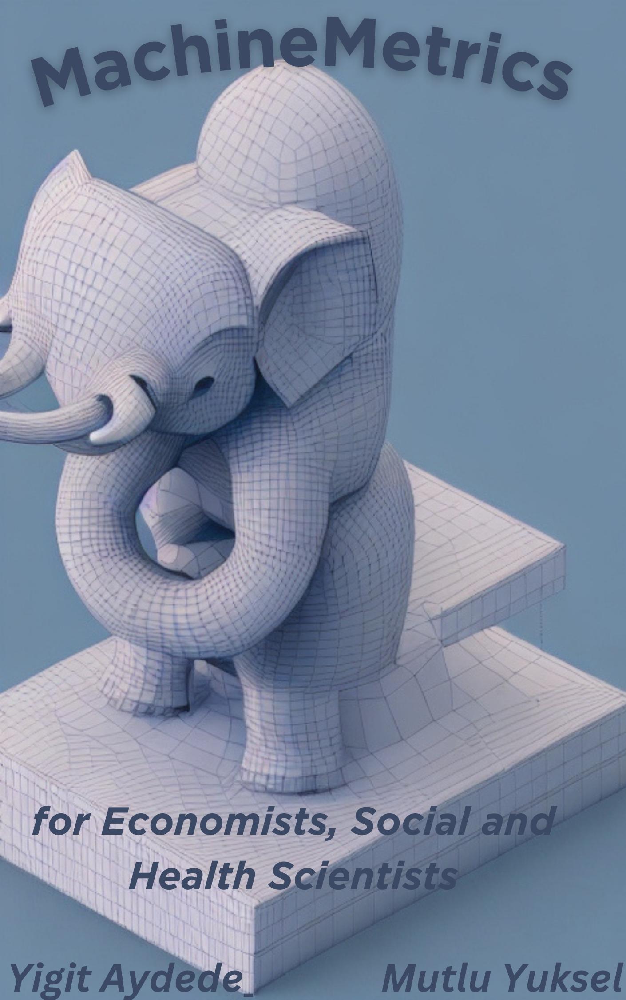

--- 
title: 'MachineMetrics '
author: '[Yigit Aydede](https://yaydede.github.io/) and [Mutlu Yuksel](https://www.mutluyuksel.com/)'
date: 'This version: 2023-10-07'
subtitle: for Economists, Social and Health Scientists
titlerunning: MachineMetrics
site: bookdown::bookdown_site
documentclass: book
bibliography:
- book.bib
- packages.bib
biblio-style: apalike
nocite: '@*'
description: ''
link-citations: yes
cover-image: png/MachineMetrics.png
urlcolor: cyan
---
--- 
title: 'MachineMetrics '
author: '[Yigit Aydede](https://yaydede.github.io/) and [Mutlu Yuksel](https://www.mutluyuksel.com/)'
date: 'This version: 2023-10-07'
subtitle: for Economists, Social and Health Scientists
titlerunning: MachineMetrics
site: bookdown::bookdown_site
documentclass: book
bibliography:
- book.bib
- packages.bib
biblio-style: apalike
nocite: '@*'
description: ''
link-citations: yes
cover-image: png/MachineMetrics.png
urlcolor: cyan
---

# Preface {.unnumbered}

## Why this book is different? {.unnumbered}

The uniqueness of this book lies in its approach to presenting topics and examples relevant to the fields of economics, social sciences, and related disciplines. Key features that set this book apart include:

1. Accessible language and concepts: Throughout the book, we consciously avoid using excessively technical terminology or concepts exclusive to computer science. Instead, we strive to present explanations in a clear and straightforward manner, employing terms and ideas that economists and social scientists are already familiar with. This approach ensures that the content is both accessible and relevant to the target audience

2. Tailored content: The book is specifically designed for researchers in economics, social sciences, and related fields, addressing topics and methods that are most relevant to their work.

3. Abundance of examples: We provide numerous examples throughout the book, ensuring that readers can thoroughly comprehend the concepts and methods presented.

4. Use of R programming language: Rather than depending on specialized packages, we emphasize the use of the core R language for all demonstrations and examples. This method allows readers to develop a more profound comprehension of the techniques and fosters the acquisition of crucial programming abilities. Additionally, we incorporate commonly used R packages for data analytics in specific sections to acquaint our readers with these tools.

5. Practical application: The topics covered in this book are illustrated using simulations or real-world data sets, enabling readers to connect the theoretical concepts with practical examples.

6. Cutting-edge research: In nearly all chapters, we include sections that showcase the most recent research papers in economics and social sciences. This feature keeps readers informed about the latest advancements in their respective fields, and it underscores the practical relevance of the methods discussed in the book.

By incorporating these features, we have created a resource that not only teaches essential concepts and techniques, but also demonstrates their real-world applicability and value for researchers in economics, social sciences, and related disciplines.

## Structure of Manuscript: {.unnumbered}
 
In this book, we delve into an extensive range of subjects aimed at equipping readers with a comprehensive understanding of various aspects of data analysis, modeling, and machine learning.

We commence with an introduction that highlights the differences between prediction and estimation, the relevance of the discussed topics in economics, health, and social sciences, the interpretation of concepts and terminology, and a comparison between machine learning and traditional econometric approaches. The initial section progresses to cover comprison of statistical and machine learning models, simulations, and discussions on prediction and estimation, correlation and counterfactual causal models.

To grasp the key methodology sections, we first explore the concept of learning, error types, bias-variance trade-offs, and overfitting in seperate chapters. We explain both fundamental parametric and nonparametric estimation techniques in order to familiarize our readers with these concepts. These initial chapters provide a seamless transition from inferential statistics and the "parametric world" to predictive models by including a section on nonparametric methods. In many cases, even at the graduate level, nonparametric methods are not commonly taught, as they are less frequently employed in inferential statistics. However, nonparametric econometrics serves as a bridge between the two domains of data modeling and algorithmic modeling, given that machine learning is essentially an extension of nonparametric econometrics. Subsequently, we present methods for hyperparameter tuning and a range of optimization algorithms, such as cross-validation and gradient descent. We present these topics using concepts that are well-known to economists, social scientists, and health researchers. 

Throughout the shrinkage sections, we discuss ridge, lasso, and elastic net methods. Subsequently, readers will encounter topics such as regression trees and ensemble learning techniques like bagging, boosting, and random forest models. We also delve into causality and machine learning, examining the implementation of counterfactual causal methods in health, economics, and social sciences, in addition to model selection, sparsity, and the application of machine learning tools. The diverse topics covered in these chapters include random experiment, instrumental variables, difference-in-differences, regression discontinuity, synthetic control, double/debiased lasso methods, and recently developed heterogeneous treatment effects, such as causal tree and causal forest.

We dedicate a comprehensive and standalone chapter to a thorough exploration of classification. In this chapter, we cover a wide range of topics, including: Introduction to Classification, Linear Probability and Logistic Regression, Goodness of Fit, Confusion Table, Performance Measures, Receiver Operating Characteristic (ROC), Area Under the Curve (AUC), and real-world Applications using the Caret package.

Following this, we delve into time series analysis combined with machine learning approaches. The topics covered in time series and forecast chapters include: ARIMA Models, the Hyndman-Khandakar Algorithm, Grid Search for ARIMA, Time Series Embedding, Vector Autoregression for Recursive Forecasting, Embedding for Direct Forecast, Random Forest, Univariate and Multivariate Analysis, and Rolling and Expanding Windows.

Next, we cover Support Vector Machines, neural networks, back propagation, and deep learning techniques. Both Support Vector Machines and Neural Networks utilize specific data transformations that project the data into a higher-dimensional space. In this section, we elucidate these topics in a step-by-step manner, employing simulations and concepts that are easy to understand. This approach distinguishes our book from many others in the fields of machine learning and data analytics, as we refrain from relying solely on pre-built R functions and instead focus on providing clear explanations and using hands-on simulation explained step-by-step.

Following that, we introduce the fundamentals of covariance, correlation, semi-partial correlation, regularized covariance matrix, and graphical ridge in the graphical network analysis section. We also cover matrix decomposition and singular decomposition techniques.

In the final section, we discuss principal component analysis, factor analysis, smoothing techniques, and address handling imbalanced data and fraud detection, as well as other nonparametric estimation methods. This provides readers with valuable insights into these specialized topics.

By covering this extensive range of topics, we aim to equip readers with the necessary knowledge and tools to effectively analyze, model, and make predictions using a wide array of methods and techniques in their fields. 
  
## Who Can Use This Book? {.unnumbered}

This book has been carefully crafted to cater to a diverse audience of motivated students and researchers who have a foundational understanding of inferential statistics using parametric models. The book's focus is on applied concepts, prioritizing practical application over extensive theoretical proofs and justifications. As such, it serves as an invaluable resource for those who wish to delve into real-world examples and case studies.

While no prior experience with the R programming language is assumed, having some familiarity with coding concepts will prove beneficial for readers. The book's content and structure have been designed to accommodate individuals with varying levels of coding expertise, ensuring that everyone can benefit from the material presented.

The target audience for this book includes, but is not limited to:

1. Graduate and advanced undergraduate students in economics, social and health sciences, and related disciplines who are keen to expand their knowledge of data analysis techniques and applications.

2. Researchers and practitioners in the fields of economics, social sciences, and beyond, who wish to acquire practical skills in data analytics and gain insights into the latest methodologies.

3. Educators and instructors who seek a comprehensive, application-focused resource for teaching data analysis methods to students in economics, social sciences, and related areas.

In summary, this book is an essential resource for anyone who is eager to learn and apply advanced data analysis techniques in the context of economics, social sciences, and related disciplines. With its clear explanations, practical examples, and accessible language, this book will enable readers to develop their skills and knowledge, regardless of their prior experience with R or coding in general.

## Acknowledgements {.unnumbered}

We would like to extend our heartfelt gratitude to our loved ones for their constant support during the creation of this book.Their unwavering belief in our abilities and vision has been invaluable, and we could not have reached this milestone without them.

Yigit is grateful for the sacrifices Isik has made and for her steadfast encouragement in the pursuit of this dream. Yigit is also grateful for the opportunity to share his passion for learning with Ege, his son.

Mutlu would like to extend his heartfelt thanks to his wife, Mevlude, whose love, patience, and understanding have been a constant source of strength and inspiration. Mutlu also extends his heartfelt gratitude to his sons, Eren and Kaan, whose laughter, curiosity, and boundless energy have been a driving force behind his determination to work harder and establish a lasting legacy.
 

## License {.unnumbered}

.](png/cc.png)

<!--chapter:end:index.Rmd-->

#  Introduction:

Placeholder

## Prediction vs. Estimation:
## Where can you use the covered topics in Social Sciences?:
## Translation of Concepts: Different Terminology
## Is Machine Learning Better?

<!--chapter:end:01-intro.Rmd-->

# Statistical Models and Simulations

Placeholder

## Distinguishing Between Statistical Modeling and Machine Learning in Data Analysis
### Goals and Objectives
### Prediction vs. Inference
### Conclusion
## Parametric and Nonparametric Models:
## Predictive vs. Causal Models
## Model Selection and Approaches in Data Modeling
## Simulation

<!--chapter:end:02-ModelsAndSimulations.Rmd-->

# Counterfactual:

Placeholder

## Qualitative and Quantitative research methods:
## Quantitative - Research methods :
## Data and visualization
##  Correlation
##  Effect of X on Y / Regression
### How can we estimate the population parameters, $\beta_{0}$ and $\beta_{1}$?
### Predicting $y$
### MLE
##  Causal Effect
### Average Treatment Effect(ATE)
### Additional Treatment Effects
### Selection Bias and Heteregeneous Treatment Effect Bias:

<!--chapter:end:03-Counterfactuals.Rmd-->

# Learning 

Placeholder

## Learning Systems {-}

<!--chapter:end:04-Learning.Rmd-->

# Error

Placeholder

## Estimation error - MSE
## Prediction error- MSPE
## Technical points about MSE and MSPE

<!--chapter:end:05-Error.Rmd-->

# Bias-Variance Trade-off 

Placeholder

## Biased estimator as a predictor

<!--chapter:end:06-BiasVarTradeoff.Rmd-->

# Overfitting

Placeholder

<!--chapter:end:07-Overfitting.Rmd-->

# Regression v.s. Classification 

Placeholder

<!--chapter:end:08-RegvsClass.Rmd-->

# Parametric Estimations - Basics

Placeholder

## Parametric Estimations
## Logistic Regression

<!--chapter:end:09-ParametricEst.Rmd-->

# Nonparametric Estimations - Basics

TBA

## Density estimations

TBA

## Kernel regression

TBA

<!--chapter:end:10-NonParametricBasics.Rmd-->

# Hyperparameter Tuning

TBA

## Training and Validation 

TBA

## Splitting the data randomly

TBA

## k-fold cross validation

TBA

<!--chapter:end:11-HyperTuning.Rmd-->

#  Optimization Algorithms - Basics

Placeholder

## Brute-force optimization
## Derivative-based methods
## ML Estimation with logistic regression
## Gradient Descent Algorithm
## Optimization with R

<!--chapter:end:12-AlgorithmicOpt.Rmd-->

# Prediction Intervals

TBA

## Prediction interval for unbiased OLS predictor 

TBA
  

<!--chapter:end:13-UncertaintyandIntervals.Rmd-->

# Interpretability
TBA

## Interpretable vs NonInterpretable Models
TBA

Moreover, the interpretability of an artificial neural network (ANN), which is known to be a "blackbox" method, can be an issue regardless of the complexity of the network. However, it is generally easier to understand the decisions made by a simple ANN than by a more complex one.  

A simple ANN might have only a few layers and a relatively small number of neurons, making it easier to understand how the input data is processed and how the final output is produced. However, even a simple ANN can still be a black box in the sense that the specific calculations and decisions made by the individual neurons within the network are not fully visible or understood.  On the other hand, a more complex ANN with many layers and a large number of neurons can be more difficult to interpret, as the internal workings of the network are more complex and harder to understand. In these cases, it can be more challenging to understand how the ANN is making its decisions or to identify any biases or errors in its output. Overall, the interpretability of an ANN depends on the complexity of the network and the specific task it is being used for. Simple ANNs may be more interpretable, but even they can be considered black boxes to some extent.  

Here are a few resources that provide information about the interpretability of artificial neural networks (ANNs):  
  
- [Interpretable Machine Learning](https://christophm.github.io/interpretable-ml-book/) by Christoph Molnar is a online book that provides an overview of interpretability in machine learning, including techniques for interpreting ANNs. 
- [Interpretability of Deep Neural Networks](https://ieeexplore.ieee.org/document/8397411) by Chakraborty is a survey paper that discusses the interpretability of deep neural networks and presents an overview of the various techniques and approaches that have been developed to improve their interpretability.

<!--chapter:end:14-Interpretability.Rmd-->

# Shrinkage Models

TBA
## Ridge

TBA
## Lasso

TBA
## Adaptive Lasso

TBA

## Sparsity

TBA

**Adaptive Lasso**
  
TBA

<!--chapter:end:15-ShrinkageMethods.Rmd-->

# Regression Trees

TBA

## CART - Classification Tree

TBA

## Pruning 

TBA
## Regression Tree

TBA

<!--chapter:end:16-RegressionTrees.Rmd-->

# Ensemble Methods

Placeholder

## Bagging
## Boosting
### AdaBoost
### XGBoost
## Ensemble Applications
## Classification
## Regression
## Exploration
## Boosting Applications
### Random search with parallel processing
### Boosting vs. Others
### Classification with XGBoost

<!--chapter:end:17-EnsembleMethods.Rmd-->

# Causal Effect

via Potential outcome Framework

## Random experiment
TBA
## IV
TBA
## DiffD
TBA
## RD
TBA
## Synthetic control
TBA
## Double/Debiased Lasso/Methods 

TBC

<!--chapter:end:18-CausalityviaPotentialOutcome.Rmd-->

# Heterogeneous Treatment Effects
TBA

## Causal Tree
TBA
## Causal Forest
TBA

<!--chapter:end:19-HeterogeneousEffects.Rmd-->

# Model selection and Sparsity

## Model selection
TBA
## Dropping a variable in a regression

TBA
## Sparsity

TBA

<!--chapter:end:20-ModelSelection.Rmd-->

# Classification

Placeholder

## Nonparametric Classifier - kNN
## Linear classifiers 
## k-Nearest Neighbors
## Tuning in Classification
## Confusion matrix
## Performance measures
## ROC Curve
## AUC - Area Under the Curve

<!--chapter:end:21-Classification.Rmd-->

# Time Series

Placeholder

## ARIMA models
## Hyndman-Khandakar algorithm
## TS Plots
## Box-Cox transformation
## Modeling ARIMA
## Grid search for ARIMA
## Hyperparameter tuning with time-series data:
## Speed

<!--chapter:end:22-TimeSeries.Rmd-->

# Forecast

## Time Series Embedding

TBA

## VAR for Recursive Forecasting

TBA

## Embedding for Direct Forecast

TBA

## Random Forest

We will utilize embedding methods for direct forecasting with Random Forests.  We choose the random forests algorithm because it does not need an explicit tuning by a grid search.  In the practice, however, we can still search for the number of trees and the number of variables randomly sampled as candidates at each split.   

TBA

## Rolling and expanding windows

A seven-day window is not enough for a reliable judgment on the forecast accuracy.  One way to deal with this issue is to use rolling or expanding windows to predict the next h days. 
TBA

<!--chapter:end:23-Forecast.Rmd-->

# Support Vector Machine

In this section, we will delve into two of the most advanced learning algorithms, Support Vector Machines (SVM) and Neural Networks (NN), and explore their similarities and differences in terms of predictive power and explanatory capability. Both SVM and NN are parametric algorithms, but for different reasons. SVMs use a kernel method to embed non-linearity, while NNs use non-linear activation functions. Therefore, they have different types and numbers of parameters.

Despite these differences, both SVM and NN can approximate non-linear decision functions and can tackle the same classification problem using the same dataset. Their performance accuracy is comparable when given comparable training. However, when given more training and computational power, NNs tend to outperform SVMs.

One key difference between SVM and NN is the time required to train them on the same dataset. This is because the kernel method used by SVMs can be computationally expensive, while the activation function used by NNs can be more efficient. Overall, understanding the similarities and differences between SVM and NN can help us determine which algorithm is best suited for a particular problem.

Up to this point we have seen "probabilistic" binary classifiers, such as kNN, CART, Ensemble models, and classification regressions (logistic , LPM), where probabilistic predictions are made on observations and then converted to binary predictions based a tuned discriminating threshold.   Support-vector machines do not use probabilistic predictions to classify the outcomes, which is inspired from one of the oldest algorithms in machine learning introduced by Rosenblatt in 1958, *the perceptron algorithm*, for learning a linear classifier. Support Vector Machine (SVM) is a modern approach to linear separation.   

TBA

  

<!--chapter:end:24-SupportVectorMachine.Rmd-->

# Neural Networks

Placeholder

## Neural Network - the idea
## Backpropagation
## Neural Network - More inputs

<!--chapter:end:25-NeuralNetworks.Rmd-->

# Graphical Network Analysis

Placeholder

## Fundementals
## Covariance
## Correlation
## Semi-partial Correlation
## Regularized Covariance Matrix

<!--chapter:end:27-GraphicalNetworkAnalysis.Rmd-->

# Decompositions

Placeholder

## Matrix Decomposition
## Eigenvectors and eigenvalues  
## Singular Value Decomposition
## Moore-Penrose inverse 

<!--chapter:end:28-MatrixDecomposition.Rmd-->

# PCA (Principle Component Analysis)

Having seen SVD and Eigenvalue decomposition, we can now look at Principle Component Analysis (PCA), which is a statistical procedure that allows us to summarize the information content in large data files.  In other words, PCA is a popular technique used to reduce the dimensionality of high-dimensional data while retaining most of the information in the original data.

**PCA is a eigenvalue decomposition of a covariance matrix** (of data matrix $\mathbf{X}$). Since a covariance matrix is a square symmetric matrix, we can apply the eigenvalue decomposition, which reveals the unique orthogonal directions (variances) in the data so that their orthogonal linear combinations maximize the total variance.

The goal is here a dimension reduction of the data matrix.  
TBA

## Factor Analysis

Factor analysis and Principal Component Analysis (PCA) both involve reducing the dimensionality of a dataset, but they are not the same...

Factor Analysis (FA) is a method for modeling observed variables, and their covariance structure, in terms of a smaller number of underlying latent (unobserved) "factors". In FA the observed variables are modeled as linear functions of the "factors." 
TBA

<!--chapter:end:29-FactorAnalyses.Rmd-->

# Smoothing
  
The main reason for using smoothing methods is noise reduction, which makes patterns and trends in the data more noticeable and easier to analyze for the improved accuracy of predictions made from the data. You can think of smoothing as a process that reduces the effect of noise in the data.

TBA

## Smooth Spline Regression
TBA

## Multivariate Loess

TBA

<!--chapter:end:30-Smoothing.Rmd-->

# Imbalanced Data

Classification with imbalanced data is characterized by the uneven proportion of cases that are available for each class, and causes problems in many learning algorithms.  
TBA

<!--chapter:end:31-ImbalancedData.Rmd-->

# Text Analysis
TBA

<!--chapter:end:32-TextAnalysis.Rmd-->

# Other Nonparametric Estimation methods

## Regression splines
TBA

## MARS

Multivariate Additive Regression Splines (MARS)

## GAM

Generalized Additive Models (GAM)

<!--chapter:end:33-OtherNonparametricEstimationMethods.Rmd-->

